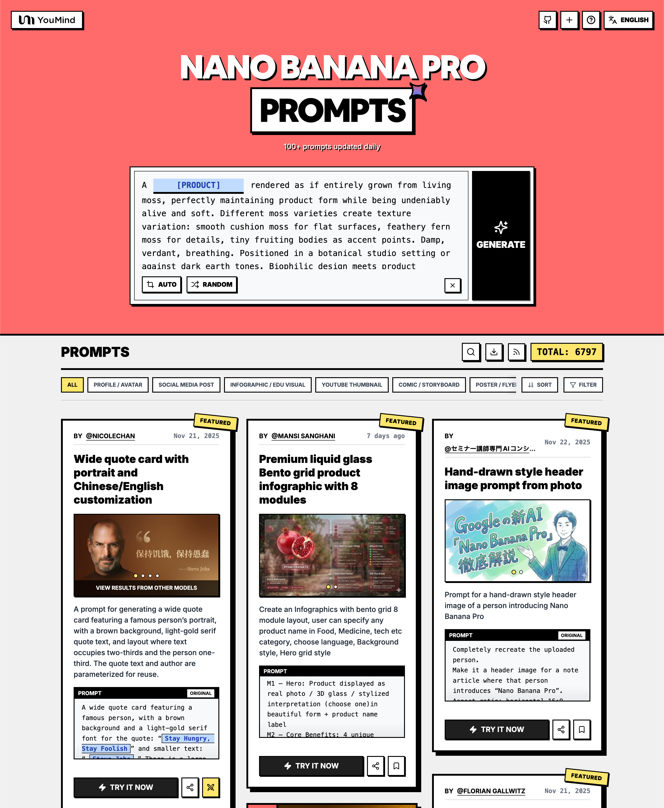

<a href="https://youmind.com/vi-VN/gpt-image-2-prompts">
  
</a>

> 💡 🍌 Also check out our **Nano Banana Pro** Prompts Collection — Google's flagship model with 10000+ curated prompts 👉 [awesome-nano-banana-pro-prompts](https://github.com/YouMind-OpenLab/awesome-nano-banana-pro-prompts)
# 🚀 Tuyển tập GPT Image 2 Prompts

[](https://github.com/sindresorhus/awesome)
[](https://github.com/YouMind-OpenLab/awesome-gpt-image-2)
[](https://creativecommons.org/licenses/by/4.0/)
[](https://github.com/YouMind-OpenLab/awesome-gpt-image-2/actions)
[](docs/CONTRIBUTING.md)

> 🎨 Bộ sưu tập các câu lệnh sáng tạo cho OpenAI GPT Image 2

> ⚠️ **Thông báo bản quyền**: Tất cả các câu lệnh được thu thập từ cộng đồng cho mục đích giáo dục. Nếu bạn tin rằng bất kỳ nội dung nào vi phạm quyền của bạn, vui lòng [mở một issue](https://github.com/YouMind-OpenLab/awesome-gpt-image-2/issues/new?template=bug-report.yml) và chúng tôi sẽ xóa nó ngay lập tức.

---

[](README.md) [](README_zh.md) [](README_zh-TW.md) [](README_ja-JP.md) [](README_ko-KR.md) [](README_th-TH.md) [](README_vi-VN.md) [](README_hi-IN.md) [](README_es-ES.md) [-Click%20to%20View-lightgrey)](README_es-419.md) [](README_de-DE.md) [](README_fr-FR.md) [](README_it-IT.md) [-Click%20to%20View-lightgrey)](README_pt-BR.md) [](README_pt-PT.md) [](README_tr-TR.md)

---

## 🌐 Xem trong Thư viện Web

<div align="center">



</div>

**[👉 Duyệt trên Thư viện YouMind GPT Image 2](https://youmind.com/vi-VN/gpt-image-2-prompts)**

Tại sao nên sử dụng thư viện của chúng tôi?

| Feature | GitHub README | Thư viện youmind.com |
|---------|--------------|---------------------|
| 🎨 Bố cục trực quan | Danh sách tuyến tính | Lưới Masonry đẹp mắt |
| 🔍 Tìm kiếm | Chỉ Ctrl+F | Tìm kiếm toàn văn với bộ lọc |
| 🤖 Tạo bằng AI một cú nhấp | - | Tạo bằng AI một cú nhấp |
| 📱 Di động | Cơ bản | Hoàn toàn phản hồi |
| 🏷️ Danh mục | - | Duyệt theo danh mục |


### 🏷️ Duyệt theo danh mục

- **Các trường hợp sử dụng**
  - [Hồ sơ / Ảnh đại diện](https://youmind.com/vi-VN/gpt-image-2-prompts?categories=profile-avatar)
  - [Bài đăng trên mạng xã hội](https://youmind.com/vi-VN/gpt-image-2-prompts?categories=social-media-post)
  - [Infographic / Hình ảnh giáo dục](https://youmind.com/vi-VN/gpt-image-2-prompts?categories=infographic-edu-visual)
  - [Hình thu nhỏ trên YouTube](https://youmind.com/vi-VN/gpt-image-2-prompts?categories=youtube-thumbnail)
  - [Truyện tranh / Bảng phân cảnh](https://youmind.com/vi-VN/gpt-image-2-prompts?categories=comic-storyboard)
  - [Tiếp thị sản phẩm](https://youmind.com/vi-VN/gpt-image-2-prompts?categories=product-marketing)
  - [Hình ảnh chính thương mại điện tử](https://youmind.com/vi-VN/gpt-image-2-prompts?categories=ecommerce-main-image)
  - [Tài sản trò chơi](https://youmind.com/vi-VN/gpt-image-2-prompts?categories=game-asset)
  - [Áp phích / Tờ rơi](https://youmind.com/vi-VN/gpt-image-2-prompts?categories=poster-flyer)
  - [Thiết kế ứng dụng / web](https://youmind.com/vi-VN/gpt-image-2-prompts?categories=app-web-design)
- **Phong cách**
  - [Nhiếp ảnh](https://youmind.com/vi-VN/gpt-image-2-prompts?categories=photography)
  - [Điện ảnh / Ảnh tĩnh từ phim](https://youmind.com/vi-VN/gpt-image-2-prompts?categories=cinematic-film-still)
  - [Anime / Manga](https://youmind.com/vi-VN/gpt-image-2-prompts?categories=anime-manga)
  - [Minh họa](https://youmind.com/vi-VN/gpt-image-2-prompts?categories=illustration)
  - [Phác Thảo / Nét Vẽ](https://youmind.com/vi-VN/gpt-image-2-prompts?categories=sketch-line-art)
  - [Truyện tranh / Tiểu thuyết đồ họa](https://youmind.com/vi-VN/gpt-image-2-prompts?categories=comic-graphic-novel)
  - [Kết xuất 3D](https://youmind.com/vi-VN/gpt-image-2-prompts?categories=3d-render)
  - [Chibi / Phong cách Q](https://youmind.com/vi-VN/gpt-image-2-prompts?categories=chibi-q-style)
  - [Đẳng cự](https://youmind.com/vi-VN/gpt-image-2-prompts?categories=isometric)
  - [Nghệ thuật Pixel](https://youmind.com/vi-VN/gpt-image-2-prompts?categories=pixel-art)
  - [Tranh Sơn Dầu](https://youmind.com/vi-VN/gpt-image-2-prompts?categories=oil-painting)
  - [Màu nước](https://youmind.com/vi-VN/gpt-image-2-prompts?categories=watercolor)
  - [Mực / Phong cách Trung Hoa](https://youmind.com/vi-VN/gpt-image-2-prompts?categories=ink-chinese-style)
  - [Cổ điển / Cổ điển](https://youmind.com/vi-VN/gpt-image-2-prompts?categories=retro-vintage)
  - [Cyberpunk / Khoa học viễn tưởng](https://youmind.com/vi-VN/gpt-image-2-prompts?categories=cyberpunk-sci-fi)
  - [Chủ nghĩa tối giản](https://youmind.com/vi-VN/gpt-image-2-prompts?categories=minimalism)
- **Nội dung chính**
  - [Chân dung / Ảnh tự chụp](https://youmind.com/vi-VN/gpt-image-2-prompts?categories=portrait-selfie)
  - [Người có ảnh hưởng / Người mẫu](https://youmind.com/vi-VN/gpt-image-2-prompts?categories=influencer-model)
  - [Nhân vật](https://youmind.com/vi-VN/gpt-image-2-prompts?categories=character)
  - [Nhóm / Cặp đôi](https://youmind.com/vi-VN/gpt-image-2-prompts?categories=group-couple)
  - [Sản phẩm](https://youmind.com/vi-VN/gpt-image-2-prompts?categories=product)
  - [Thực phẩm / Đồ uống](https://youmind.com/vi-VN/gpt-image-2-prompts?categories=food-drink)
  - [Mặt hàng thời trang](https://youmind.com/vi-VN/gpt-image-2-prompts?categories=fashion-item)
  - [Động vật / Sinh vật](https://youmind.com/vi-VN/gpt-image-2-prompts?categories=animal-creature)
  - [Phương tiện](https://youmind.com/vi-VN/gpt-image-2-prompts?categories=vehicle)
  - [Kiến trúc / Nội thất](https://youmind.com/vi-VN/gpt-image-2-prompts?categories=architecture-interior)
  - [Phong cảnh / Thiên nhiên](https://youmind.com/vi-VN/gpt-image-2-prompts?categories=landscape-nature)
  - [Quang cảnh thành phố / Đường phố](https://youmind.com/vi-VN/gpt-image-2-prompts?categories=cityscape-street)
  - [Sơ đồ / Biểu đồ](https://youmind.com/vi-VN/gpt-image-2-prompts?categories=diagram-chart)
  - [Văn bản / Kiểu chữ](https://youmind.com/vi-VN/gpt-image-2-prompts?categories=text-typography)
  - [Tóm tắt / Bối cảnh](https://youmind.com/vi-VN/gpt-image-2-prompts?categories=abstract-background)

---

## 📖 Mục lục

- [🌐 Xem trong Thư viện Web](#-view-in-web-gallery)
- [🤔 GPT Image 2 là gì?](#-what-is-gpt-image-2)
- [📊 Thống kê](#-statistics)
- [🔥 Câu lệnh nổi bật](#-featured-prompts)
- [📋 Tất cả câu lệnh](#-all-prompts)
- [🤝 Cách đóng góp](#-how-to-contribute)
- [📄 Giấy phép](#-license)
- [🙏 Lời cảm ơn](#-acknowledgements)
- [⭐ Lịch sử sao](#-star-history)

---

## 🤔 GPT Image 2 là gì?

**GPT Image 2** (codename **"duct-tape"**) is OpenAI's next-generation image model. Community testing highlights a leap in these areas:

- 🎯 **Pixel-Perfect Text Rendering** — Native-quality text in Chinese, English, and Japanese, no typos or warped glyphs
- 🎨 **Cross-Image Consistency** — The same character, style, or IP stays identical across a series, down to the pixel
- ⚡ **Commercial-Grade Illustration** — Illustration output is ready to ship without manual polish
- 🌈 **True Art Style Induction** — Creatively evokes the feeling of a style rather than merely approximating references
- 🔧 **Storyboard & Product Series** — Ideal for storyboards, IP characters, and multi-panel product visuals
- 📐 **Multi-Language Design** — Social cards, banners, and posters with accurate multilingual typography in one shot

📚 **Learn More:** See community testing in our [report summary](docs/FAQ.md)

### 🚀 Tích hợp Raycast

Một số câu lệnh hỗ trợ **đối số động** sử dụng cú pháp [Raycast Snippets](https://raycast.com/help/snippets). Tìm huy hiệu 🚀 Raycast Friendly!

**Ví dụ:**
```
A quote card with "{argument name="quote" default="Stay hungry, stay foolish"}"
by {argument name="author" default="Steve Jobs"}
```

Khi sử dụng trong Raycast, bạn có thể thay thế động các đối số để lặp lại nhanh chóng!

---

## 📊 Thống kê

<div align="center">

| Chỉ số | Số lượng |
|--------|-------|
| 📝 Tổng số câu lệnh | **1123** |
| ⭐ Nổi bật | **6** |
| 🔄 Cập nhật lần cuối | **lúc 01:28:51 UTC Thứ Năm, 23 tháng 4, 2026** |

</div>

---

## 🔥 Câu lệnh nổi bật

> ⭐ Được nhóm của chúng tôi chọn lọc thủ công vì chất lượng và sáng tạo xuất sắc

### No. 1: Poster hình ảnh bóc tách (exploded view) kính VR


#### 📖 Mô tả

Tạo sơ đồ bóc tách công nghệ cao của kính VR với các chú thích linh kiện chi tiết và văn bản quảng cáo.

#### 📝 Câu lệnh

```
{
  "type": "poster sơ đồ sản phẩm bóc tách",
  "subject": "kính VR",
  "style": "kết xuất 3D công nghệ cao gọn gàng, ánh sáng studio, các điểm nhấn phát sáng",
  "background": "{argument name=\"background color\" default=\"gradient tím và xanh dương dịu nhẹ\"}",
  "header": {
    "logo": "∞ {argument name=\"product name\" default=\"Meta Quest 3\"}",
    "subtitle": "{argument name=\"main catchphrase\" default=\"Một thực tại hoàn toàn mới, từ một cấu trúc hoàn toàn mới.\"}"
  },
  "layout": {
    "centerpiece": "hình ảnh bóc tách xếp chồng theo chiều dọc của kính VR hiển thị 9 lớp linh kiện bên trong riêng biệt: vỏ ngoài, cảm biến camera, bo mạch chủ với chip, thấu kính pancake, khung trong, bộ pin, dây đeo bên, dây đeo trên và đệm giao diện khuôn mặt.",
    "callout_labels": {
      "count": 8,
      "left_side": [
        "Snapdragon® XR2 Gen 2\nHiệu năng xử lý vượt trội cho trải nghiệm thời gian thực.",
        "Cơ chế điều chỉnh IPD\nCảm giác vừa vặn thoải mái cho nhiều đối tượng người dùng.",
        "Dây đeo đầu được thiết kế chính xác\nCông thái học hướng đến sự thoải mái và ổn định."
      ],
      "right_side": [
        "Mặt nạ\nThiết kế tinh tế và cân bằng trọng lượng tối ưu.",
        "Camera theo dõi\nĐạt được khả năng theo dõi vị trí và nhận diện môi trường độ chính xác cao.",
        "Thấu kính pancake\nThiết kế mỏng nhẹ mang lại góc nhìn rộng và hình ảnh sắc nét.",
        "Pin hiệu suất cao\nThiết kế nguồn tối ưu hỗ trợ thời gian sử dụng lâu dài.",
        "Giao diện khuôn mặt mềm mại\nĐảm bảo cảm giác đeo thoải mái ngay cả khi sử dụng trong thời gian dài."
      ]
    },
    "footer": {
      "left_text_block": {
        "headline": "{argument name=\"bottom headline\" default=\"Trải nghiệm tiến hóa từ cấu trúc.\"}",
        "body": "Trong từng linh kiện là công nghệ tiên tiến và thiết kế tỉ mỉ hỗ trợ trải nghiệm đắm chìm. Meta Quest 3 tạo ra những trải nghiệm mang hơi thở tương lai ngay từ bên trong."
      },
      "right_logo": "∞ Meta"
    }
  }
}
```

#### 🖼️ Hình ảnh được tạo

##### Image 1

<div align="center">

</div>

#### 📌 Chi tiết

- **Tác giả:** [wory＠ホッピング中](https://x.com/wory37303852)
- **Nguồn:** [Twitter Post](https://x.com/wory37303852/status/2045925660401795478#reversed-0)
- **Đã xuất bản:** 19 tháng 4, 2026
- **Ngôn ngữ:** en

**[👉 Thử ngay →](https://youmind.com/vi-VN/gpt-image-2-prompts?id=13460)**

---

### No. 2: Bản đồ ẩm thực thành phố minh họa


#### 📖 Mô tả

Tạo bản đồ du lịch vẽ tay theo phong cách màu nước, bao gồm các đặc sản địa phương được đánh số, các địa danh và chú giải.

#### 📝 Câu lệnh

```
{
  "type": "infographic bản đồ minh họa",
  "style": "{argument name=\"art style\" default=\"hình minh họa vẽ tay bằng màu nước và mực trên giấy da cổ điển\"}",
  "title_section": {
    "text": "{argument name=\"city name\" default=\"Thành Đô\"} {argument name=\"map title\" default=\"Bản đồ oanh tạc của tín đồ ẩm thực\"}",
    "mascot": "quả ớt đỏ hoạt hình đeo kính râm và giơ ngón tay cái"
  },
  "border": "{argument name=\"border decoration\" default=\"dây lá xanh và ớt đỏ\"}",
  "layout": {
    "background": "giấy da màu be có kết cấu với những con đường màu vàng, sông màu xanh dương và các khu công viên màu xanh lá cây",
    "sections": [
      {
        "title": "địa danh",
        "count": 6,
        "illustrations": ["đình truyền thống", "tu viện truyền thống", "tòa nhà chọc trời hiện đại với gấu trúc leo trèo", "tháp truyền hình cao", "cổng truyền thống", "các tòa nhà công nghiệp"],
        "labels": ["Công viên Nhân dân", "Văn Thù Viện", "IFS", "Tháp truyền hình 339", "Ngõ Rộng Ngõ Hẹp", "Đông Giao Ký Ức"]
      },
      {
        "title": "điểm ẩm thực",
        "count": 12,
        "illustrations": ["đậu phụ Ma Bà", "sủi cảo sốt ớt", "xiên que trong nồi", "bánh nếp", "bánh trứng nướng", "lẩu chín ngăn", "miến khoai lang", "xiên que lạnh", "món trộn cay", "trà bát bảo", "thạch băng", "đầu thỏ cay"],
        "labels": ["1 Đậu phụ Ma Bà Trần", "2 Sủi cảo Chung", "3 Xuân Hy Lộ", "4 Ngõ Rộng Ngõ Hẹp · Tam Đại Pháo", "5 Kiến Thiết Lộ · Bánh trứng nướng Diệp Bà Bà", "6 Ngọc Lâm Lộ · Lẩu Tiểu Long Khảm", "7 Hương Hương Hẻm · Bún lòng già", "8 Phố Vũ Hầu Từ · Bát Bát Kê", "9 Đông Giao Ký Ức · Mạo Tiêu Tiêu Lạt", "10 Công viên Nhân dân · Trà xã Hạc Minh", "11 Phố cổ Cẩm Lý · Thạch băng", "12 Đầu thỏ Song Lưu Lão Mẹ"]
      },
      {
        "title": "chú giải",
        "position": "bottom-right",
        "count": 5,
        "items": ["chấm đỏ", "nhà xanh", "cây xanh", "đường kẻ xanh dương", "đường kẻ đôi màu vàng"],
        "labels": ["Địa điểm ẩm thực", "Địa danh du lịch", "Công viên cây xanh", "Sông hồ", "Đường chính"]
      }
    ],
    "centerpiece": "gấu trúc khổng lồ đang ngồi ăn tre",
    "bottom_right_extras": ["la bàn cổ điển với các hướng N, S, E, W", "văn bản miễn trừ trách nhiệm 'Lời khuyên: Hãy cẩn thận khi ăn cay, bảo vệ dạ dày của bạn~' với biểu tượng quả ớt đỏ"]
  }
}
```

#### 🖼️ Hình ảnh được tạo

##### Image 1

<div align="center">

</div>

#### 📌 Chi tiết

- **Tác giả:** [皮皮特](https://x.com/mm_zzm44854)
- **Nguồn:** [Twitter Post](https://x.com/mm_zzm44854/status/2045861258520568230#reversed-1)
- **Đã xuất bản:** 19 tháng 4, 2026
- **Ngôn ngữ:** en

**[👉 Thử ngay →](https://youmind.com/vi-VN/gpt-image-2-prompts?id=13515)**

---

### No. 3: Slide giải thích về Momotaro theo phong cách kết hợp


#### 📖 Mô tả

Một câu lệnh kết hợp giữa tính thẩm mỹ đơn giản, ấm áp của tranh minh họa Irasutoya với mật độ thông tin cao đặc trưng của các slide từ chính phủ Nhật Bản.

#### 📝 Câu lệnh

```
Hãy tạo một slide giải thích ({argument name="format" default="sơ đồ ponchi-e"}) cho {argument name="theme" default="Momotaro"} kết hợp giữa bầu không khí nhẹ nhàng của "Irasutoya" với mật độ thông tin dày đặc của "slide Kasumigaseki".
```

#### 🖼️ Hình ảnh được tạo

##### Image 1

<div align="center">

</div>

##### Image 2

<div align="center">

</div>

#### 📌 Chi tiết

- **Tác giả:** [やまもん](https://x.com/yammamon)
- **Nguồn:** [Twitter Post](https://x.com/yammamon/status/2045778624092254603)
- **Đã xuất bản:** 19 tháng 4, 2026
- **Ngôn ngữ:** ja

**[👉 Thử ngay →](https://youmind.com/vi-VN/gpt-image-2-prompts?id=13983)**

---

### No. 4: Bản thiết kế giao diện Livestream thương mại điện tử


#### 📖 Mô tả

Tạo giao diện livestream mạng xã hội chân thực phủ lên ảnh chân dung, bao gồm các tin nhắn trò chuyện có thể tùy chỉnh, cửa sổ bật lên tặng quà và thẻ mua hàng sản phẩm.

#### 📝 Câu lệnh

```
{
  "type": "bản thiết kế giao diện livestream",
  "subject": {
    "description": "ảnh chân dung của {argument name=\"host name\" default=\"Elon Musk\"}, đang mỉm cười, mặc áo phông đen có in hình sơ đồ kỹ thuật màu trắng",
    "background": "bên trái hiển thị màn hình có văn bản '{argument name=\"left background logo\" default=\"SPACEX\"}', bên phải hiển thị '{argument name=\"right background logo\" default=\"Logo chữ T của Tesla\"}' màu đỏ và một chiếc ô tô tối màu"
  },
  "ui_overlay": {
    "top_header": {
      "host_info": "ảnh đại diện, tên '{argument name=\"host name\" default=\"Elon Musk\"}', phụ đề '556 nghìn lượt thích phiên này', nút 'Theo dõi' màu đỏ",
      "rank_badge": "biểu tượng đồng tiền vàng với 'Hạng 1 toàn trang'",
      "viewer_stats": "3 ảnh đại diện người xem hàng đầu với '123 nghìn', '86 nghìn', '57 nghìn', tổng '687 nghìn', nút đóng 'X'",
      "right_links": "'Xem thêm >', 'Phòng trưng bày quà tặng 0/24' với thẻ 'Cổ điển' màu xanh dương"
    },
    "mid_left_gifts": {
      "count": 2,
      "items": [
        "ảnh đại diện 'Người yêu công nghệ', 'tặng trái tim', biểu tượng trái tim x 1314",
        "ảnh đại diện 'Biển sao', 'tặng tên lửa', biểu tượng tên lửa x 666"
      ]
    },
    "bottom_left_chat": {
      "system_message": "huy hiệu cấp 37 'Người du hành vũ trụ đã tham gia phòng livestream'",
      "message_count": 7,
      "messages": [
        "Tiểu Hỏa Tiễn: Musk! Tương lai đầy hứa hẹn! 🚀",
        "future: Khi nào Tesla Model 2 ra mắt vậy?",
        "Người mơ mộng vì sao: SpaceX năm nay có thể lên sao Hỏa không?",
        "AI khám phá: Tiến độ của Neuralink thế nào rồi?",
        "Cư dân mạng đẹp trai: Chào sếp Musk!",
        "Mars: Lần đầu xem livestream của anh, phấn khích quá!",
        "nguoidung123: Nói về AI đi, liệu nó có thay thế con người không?"
      ]
    },
    "bottom_right_product_card": {
      "hot_tag": "thẻ cam 'Bán chạy x 1888'",
      "image": "Tesla Cybertruck",
      "title": "{argument name=\"product name\" default=\"Xe bán tải điện Tesla Cybertruck\"}",
      "price": "{argument name=\"product price\" default=\"¥ 1.618.000\"}",
      "button": "nút 'Mua' màu đỏ",
      "floating_animation": "các trái tim mờ ảo bay lên dọc theo cạnh phải"
    },
    "bottom_bar": {
      "input_field": "'Nhập nội dung...'",
      "icons": ["mặt cười", "ba chấm", "giỏ hàng", "hộp quà", "chia sẻ"]
    }
  }
}
```

#### 🖼️ Hình ảnh được tạo

##### Image 1

<div align="center">

</div>

#### 📌 Chi tiết

- **Tác giả:** [神经病不想好转](https://x.com/sjbbxhz)
- **Nguồn:** [Twitter Post](https://x.com/sjbbxhz/status/2045684734714380687#reversed-0)
- **Đã xuất bản:** 19 tháng 4, 2026
- **Ngôn ngữ:** en

**[👉 Thử ngay →](https://youmind.com/vi-VN/gpt-image-2-prompts?id=14036)**

---

### No. 5: Trận chiến võ thuật phong cách Anime


#### 📖 Mô tả

Tạo ra một cảnh hành động phong cách anime đầy năng động với hai nhân vật đang chiến đấu cùng hào quang nguyên tố trong một võ đường truyền thống.

#### 📝 Câu lệnh

```
Một bức tranh minh họa anime đầy năng động về hai cô gái đang tham gia vào một trận chiến võ thuật khốc liệt bên trong một võ đường gỗ truyền thống. Ở tiền cảnh, một cô gái với {argument name="character 1 hair" default="mái tóc đen búi cao với ruy băng đỏ"} đang thực hiện một thế võ thấp đầy uy lực, tung nắm đấm về phía trước. Cô mặc một chiếc {argument name="character 1 outfit" default="áo kiểu Trung Hoa màu trắng với tua rua đỏ và quần đỏ ống rộng"}, với những vệt năng lượng màu đỏ dữ dội xoay quanh các chi đang tấn công. Ở phía bên phải giữa không trung, một cô gái với {argument name="character 2 hair" default="mái tóc tím nhạt búi hai bên"} đang nhảy lên một cách duyên dáng, mỉm cười đầy tự tin trong khi mặc một chiếc {argument name="character 2 outfit" default="váy xanh đậm thêu vàng và quần tất đen"}, đi kèm với những vệt năng lượng giống như nước màu xanh lam quét qua. Phía sau là nội thất ngôi đền gỗ mộc mạc với tấm biển nổi bật phía trên ghi "{argument name="sign text" default="武術会"}". Cảnh tượng tràn ngập hành động bùng nổ, bụi bay, sàn gỗ vỡ vụn, các hiệu ứng hạt đầy màu sắc rực rỡ và ánh sáng góc thấp đầy kịch tính giúp tách biệt hoàn hảo các nhân vật khỏi phần nền chi tiết.
```

#### 🖼️ Hình ảnh được tạo

##### Image 1

<div align="center">

</div>

#### 📌 Chi tiết

- **Tác giả:** [たねもみ 2.0 / Tanemomi Ver2.0](https://x.com/Tanemomi_Ver2)
- **Nguồn:** [Twitter Post](https://x.com/Tanemomi_Ver2/status/2046063806846214265#reversed-0)
- **Đã xuất bản:** 20 tháng 4, 2026
- **Ngôn ngữ:** en

**[👉 Thử ngay →](https://youmind.com/vi-VN/gpt-image-2-prompts?id=13467)**

---

### No. 6: Đồ họa thông tin về quá trình tiến hóa trên bậc thang đá 3D


#### 📖 Mô tả

Chuyển đổi dòng thời gian tiến hóa phẳng thành đồ họa thông tin bậc thang đá 3D chân thực với các hình ảnh sinh vật chi tiết và các bảng thông tin bên cạnh được cấu trúc rõ ràng.

#### 📝 Câu lệnh

```
{
  "type": "đồ họa thông tin dòng thời gian tiến hóa",
  "instruction": "Sử dụng REFERENCE_0 làm nền tảng cấu trúc, hãy chuyển đổi thiết kế vector phẳng thành đồ họa thông tin 3D có độ chân thực cao. Thay thế các đoạn dốc phẳng bằng các bậc thang đá riêng biệt và nâng cấp tất cả các sinh vật thành mô hình 3D chân thực như ảnh chụp.",
  "style": {
    "background": "{argument name=\"background style\" default=\"giấy da cổ điển có kết cấu\"}",
    "staircase": "{argument name=\"staircase material\" default=\"các khối đá có kết cấu chân thực\"}",
    "subjects": "{argument name=\"organism style\" default=\"các mô hình 3D chân thực chi tiết cao\"}"
  },
  "layout": {
    "main_title": "{argument name=\"main title\" default=\"Sự tiến hóa của loài người\"}",
    "sections": [
      {
        "position": "thanh bên trái",
        "count": 8,
        "labels": ["L0: Sinh vật đơn bào", "L1: Sinh vật đa bào", "L2: Giới động vật", "L3: Ngành động vật có dây sống", "L4: Cuộc cách mạng lên cạn", "L5: Lớp thú", "L6: Tiến hóa họ người", "L7: Kỷ nguyên Homo sapiens"]
      },
      {
        "position": "phía trên bên phải",
        "title": "Đặc điểm đạt được / Đặc điểm mất đi",
        "description": "Chú giải với các biểu tượng cộng và trừ"
      },
      {
        "position": "phía dưới trung tâm",
        "title": "Các cột mốc tiến hóa quan trọng",
        "count": 6,
        "description": "Dòng thời gian với đồ họa hình bóng của 6 nhân vật thể hiện quá trình tiến hóa từ vượn thành người"
      }
    ],
    "centerpiece": {
      "description": "Cầu thang đá uốn lượn với 25 bậc thang được đánh số, mỗi bậc có các sinh vật cụ thể.",
      "count": 25,
      "notable_elements": [
        "Bậc 07: Sứa",
        "Bậc 09: Cúc đá",
        "Bậc 10: Bọ ba thùy",
        "Bậc 24: Người đi bộ",
        "Bậc 25: {argument name=\"future evolution concept\" default=\"hình bóng vũ trụ phát sáng với dấu chấm hỏi\"}"
      ]
    }
  }
}
```

#### 🖼️ Hình ảnh được tạo

##### Image 1

<div align="center">

</div>

#### 📌 Chi tiết

- **Tác giả:** [知识猫图解](https://x.com/GeekCatX)
- **Nguồn:** [Twitter Post](https://x.com/GeekCatX/status/2045792240044511277#reversed-1)
- **Đã xuất bản:** 19 tháng 4, 2026
- **Ngôn ngữ:** en

**[👉 Thử ngay →](https://youmind.com/vi-VN/gpt-image-2-prompts?id=13491)**

---

## 📋 Tất cả câu lệnh

> 📝 Sắp xếp theo ngày xuất bản (mới nhất trước)

### No. 1: Hồ sơ / Ảnh đại diện - Ảnh selfie qua gương từ trên cao với các tư thế phóng đại


#### 📖 Mô tả

Một câu lệnh kiểm tra tính nhất quán của nhân vật và các biểu cảm năng động trong ảnh selfie qua gương từ góc nhìn từ trên xuống.

#### 📝 Câu lệnh

```
{argument name="number of people" default="Ba người"} đứng trước gương từ góc nhìn từ trên cao đang chụp ảnh nhóm với {argument name="pose type" default="các tư thế phóng đại"}.
```

#### 🖼️ Hình ảnh được tạo

##### Image 1

<div align="center">

</div>

#### 📌 Chi tiết

- **Tác giả:** [-Zho-](https://x.com/ZHO_ZHO_ZHO)
- **Nguồn:** [Twitter Post](https://x.com/ZHO_ZHO_ZHO/status/2046921531322974390)
- **Đã xuất bản:** 22 tháng 4, 2026
- **Ngôn ngữ:** zh

**[👉 Thử ngay →](https://youmind.com/vi-VN/gpt-image-2-prompts?id=14341)**

---

### No. 2: Hồ sơ / Ảnh đại diện - Ảnh chân dung studio đơn sắc tông nâu trong tư thế ngồi


#### 📖 Mô tả

Prompt này tạo ra một bức ảnh chân dung thời trang trong nhà đầy chân thực về một người phụ nữ đang ngồi trong bộ trang phục tông nâu đồng nhất, phù hợp cho các hình ảnh phong cách sống hoặc quảng bá trang phục.

#### 📝 Câu lệnh

```
Một bức ảnh chân dung studio chân thực về một phụ nữ trẻ Đông Á đang ngồi trên chiếc ghế xếp màu đen đơn giản, khung hình lấy từ phần đùi trên đến đầu theo bố cục dọc. Cô ấy có mái tóc {argument name="hair color" default="nâu sẫm"} rẽ ngôi gần giữa và buộc thấp ra sau, với vài sợi tóc mềm mại gần tai, đeo khuyên tai nhỏ tinh tế, làn da trắng mịn, và tư thế trung tính điềm tĩnh với đôi bàn tay đặt lên nhau giữa hai đầu gối. Cô ấy mặc một chiếc áo crop top ôm sát có khóa kéo ở phía trước với màu {argument name="top color" default="nâu sô-cô-la đậm"}, cổ nhọn, tay áo lỡ, khóa kéo mở một phần tạo đường cổ sâu, kết hợp với quần ống đứng cạp cao cùng tông {argument name="pants color" default="nâu ấm"}. Phong cách phối đồ đơn sắc nâu trên nâu, với kết cấu vải tinh tế và đường nét cơ thể tự nhiên. Phông nền là vải rủ màu trắng ngà mềm mại với những nếp gấp nhẹ, được chiếu sáng bởi ánh sáng cửa sổ tự nhiên khuếch tán tạo nên vẻ ngoài sạch sẽ, mềm mại và chuẩn phong cách biên tập. Ảnh chân thực, độ sâu trường ảnh nông, bóng đổ mềm, chân dung thời trang tinh tế, bối cảnh tối giản, chủ thể nằm chính giữa, tư thế ngồi thư thái, chi tiết da và kết cấu vải sắc nét.
```

#### 🖼️ Hình ảnh được tạo

##### Image 1

<div align="center">

</div>

#### 📌 Chi tiết

- **Tác giả:** [浅野 美咲（Asano Misaki）](https://x.com/Asan0_Misaki)
- **Nguồn:** [Twitter Post](https://x.com/Asan0_Misaki/status/2046904727674462560#reversed-0)
- **Đã xuất bản:** 22 tháng 4, 2026
- **Ngôn ngữ:** en

**[👉 Thử ngay →](https://youmind.com/vi-VN/gpt-image-2-prompts?id=14628)**

---

### No. 3: Hồ sơ / Ảnh đại diện - Chân dung nữ sinh tại đền thờ theo phong cách ảnh thực tế


#### 📖 Mô tả

Prompt này tạo ra một bức chân dung ảnh thực tế tinh tế về một cô gái trẻ mặc đồng phục học sinh ở ngoài trời, lý tưởng cho các ấn phẩm thời trang, hình ảnh nhân vật hoặc chân dung AI theo phong cách đời thường.

#### 📝 Câu lệnh

```
Một bức chân dung nửa người ảnh thực tế về một {argument name="subject" default="cô gái trẻ"} đang đứng ngoài trời dưới ánh nắng tự nhiên rực rỡ, được đóng khung trong bố cục dọc. Cô ấy có mái tóc {argument name="hair color" default="nâu sẫm"} dài, thẳng, bóng mượt, rẽ ngôi lệch nhẹ và xõa xuống hai vai. Cô ấy mặc chiếc áo sơ mi đồng phục học sinh tay ngắn màu trắng tinh khôi với cổ áo đứng form, thắt cà vạt sọc xanh navy và có huy hiệu thêu chi tiết trên túi ngực trái với hình vương miện và biểu tượng huy hiệu. Tạo dáng cô ấy ở góc nghiêng ba phần tư với tư thế thoải mái, đầu hơi nghiêng sang một bên để tạo cảm giác như một bức ảnh thời trang tự nhiên đầy tinh tế. Đặt cô ấy trước {argument name="background setting" default="kiến trúc đền thờ màu đỏ"} sống động với những cột trụ màu đỏ rực rỡ và chi tiết mái vòm màu xanh lam ẩn hiện trong hậu cảnh mờ ảo, sử dụng độ sâu trường ảnh nông và hiệu ứng bokeh mềm mại để làm nổi bật chủ thể. Ánh sáng cần sạch, có độ tương phản cao và tôn da, với những điểm nhấn sáng trên tóc và áo, các nếp gấp vải chân thực, tông màu da tự nhiên và thẩm mỹ chân dung cao cấp, gợi nhớ đến phong cách nhiếp ảnh thương mại Nhật Bản.
```

#### 🖼️ Hình ảnh được tạo

##### Image 1

<div align="center">

</div>

#### 📌 Chi tiết

- **Tác giả:** [AIおじさん](https://x.com/AIojisan1952)
- **Nguồn:** [Twitter Post](https://x.com/AIojisan1952/status/2046838384887504974#reversed-0)
- **Đã xuất bản:** 22 tháng 4, 2026
- **Ngôn ngữ:** en

**[👉 Thử ngay →](https://youmind.com/vi-VN/gpt-image-2-prompts?id=14515)**

---

### No. 4: Hồ sơ / Ảnh đại diện - Ảnh chân dung selfie trong nhà đầy tâm trạng với hiệu ứng che mặt


#### 📖 Mô tả

Prompt này tạo ra một bức ảnh selfie phong cách, chân thực của một chàng trai trẻ mặc áo sơ mi cổ mở bên cửa sổ, hữu ích để tạo ra các bức ảnh chân dung mạng xã hội đáng tin cậy.

#### 📝 Câu lệnh

```
Một bức ảnh chân dung phong cách selfie trong nhà đầy chân thực của một chàng trai trẻ người Đông Á, chụp từ phần ngực trở lên, đang ngồi gần một cửa sổ hiện đại lớn trong căn hộ cao tầng hoặc phòng khách sạn dưới ánh sáng ban ngày dịu nhẹ. Anh ấy có mái tóc {argument name="hair color" default="đen"}, dày và hơi rối với phần mái rẽ ngôi giữa, tạo độ phồng nhẹ ở trán và hai bên. Vóc dáng anh ấy trông thanh mảnh, với chiếc cổ dài và làn da sáng mịn. Anh mặc một chiếc áo sơ mi {argument name="shirt color" default="đen"} làm từ vải cotton hoặc poplin lì, hơi rộng, với vài cúc áo trên cùng được mở để tạo kiểu cổ sâu, thoải mái và phóng khoáng. Máy ảnh được cầm gần ở góc selfie tự nhiên, hướng dọc, lấy khung hình từ vai, ngực, cổ đến đầu. Khuôn mặt anh ấy bị che khuất hoàn toàn bởi một khối làm mờ hoặc mosaic hình chữ nhật lớn ở chính giữa, trong khi phần tai, đường viền hàm, cổ và tóc vẫn có thể nhìn thấy. Tâm trạng bức ảnh mang vẻ tinh tế, trầm lắng và thanh lịch, với các tông màu trung tính dịu nhẹ, ánh sáng cửa sổ từ bên phải, bóng đổ nhẹ nhàng và cảm giác như một bức ảnh selfie tự nhiên trên mạng xã hội. Các chi tiết nền bao gồm 1 mảng tường màu be ở bên trái, 1 bảng điều khiển nhỏ trên tường, 1 đường viền kim loại dọc hoặc cạnh đèn, và 2 tấm cửa sổ khung tối cao ở bên phải với hình ảnh đường chân trời thành phố mờ ảo phía sau. Ảnh chụp bằng điện thoại thông minh chân thực, nội thất hiện đại sạch sẽ, độ sâu trường ảnh nông, kết cấu da tự nhiên, độ tương phản tinh tế, không thấy nụ cười do hiệu ứng che mặt, chỉnh sửa tối giản, phong cách và là một bức ảnh selfie cá nhân đáng tin cậy.
```

#### 🖼️ Hình ảnh được tạo

##### Image 1

<div align="center">

</div>

#### 📌 Chi tiết

- **Tác giả:** [MathMedix](https://x.com/MathMedix)
- **Nguồn:** [Twitter Post](https://x.com/MathMedix/status/2046802557872562478#reversed-0)
- **Đã xuất bản:** 22 tháng 4, 2026
- **Ngôn ngữ:** en

**[👉 Thử ngay →](https://youmind.com/vi-VN/gpt-image-2-prompts?id=14686)**

---

### No. 5: Hồ sơ / Ảnh đại diện - Ảnh chân dung selfie thực tế tại McDonald's


#### 📖 Mô tả

Prompt này tạo ra một bức ảnh selfie đời thường chân thực của một người đàn ông bên trong nhà hàng McDonald's, hữu ích để tạo các bức ảnh chụp nhanh tại nhà hàng theo phong cách mạng xã hội đầy thuyết phục.

#### 📝 Câu lệnh

```
Một bức ảnh selfie bằng điện thoại thông minh cực kỳ chân thực được chụp trong nhà tại một nhà hàng McDonald's ở châu Á, được đóng khung theo kiểu chân dung từ ngực trở lên của một chàng trai trẻ đang ngồi tại bàn. Máy ảnh được giữ cao hơn mặt bàn một chút ở khoảng cách bằng một cánh tay, tạo ra góc nhìn selfie trực diện tự nhiên với một cẳng tay hướng về phía ống kính. Chủ thể mặc áo phông đen với logo Tesla nhỏ màu trắng ở ngực trái, tóc đen ngắn thẳng, gọng kính tối màu mảnh một phần có thể nhìn thấy, và một tay đặt nhẹ lên cằm trong tư thế thoải mái. Khuôn mặt của anh ấy bị che khuất hoàn toàn bởi một khối mờ hình chữ nhật lớn ở chính giữa, giúp bảo vệ quyền riêng tư trong khi vẫn giữ được phần tóc, tai, đường viền hàm và gọng kính. Ở tiền cảnh phía dưới bên trái là 1 cốc đồ uống bằng giấy của McDonald's có nắp và ống hút màu trắng, bị cắt một phần bởi khung hình. Phông nền cho thấy khu vực quầy phục vụ với ánh sáng ấm áp, 1 tấm tường lớn màu đỏ bên trái có biểu tượng vòm vàng của McDonald's và khẩu hiệu màu trắng “i’m lovin’ it” cùng văn bản tiếng Trung bên dưới, 4 bảng menu kỹ thuật số được chiếu sáng phía trên hiển thị bánh burger, khoai tây chiên, các suất ăn combo, giá cả và văn bản tiếng Trung, cùng 2 người ở phía sau gần quầy, một người quay lưng với ba lô và một người khác bị che khuất một phần phía sau quầy thu ngân. Sử dụng cân bằng màu tự nhiên, độ nhiễu hạt nhẹ trong nhà, phản chiếu thực tế, độ sâu trường ảnh từ nông đến trung bình và vẻ ngoài tự nhiên của một bức ảnh chụp nhanh trên mạng xã hội.
```

#### 🖼️ Hình ảnh được tạo

##### Image 1

<div align="center">

</div>

#### 📌 Chi tiết

- **Tác giả:** [AB Kuai.Dong](https://x.com/_FORAB)
- **Nguồn:** [Twitter Post](https://x.com/_FORAB/status/2046774687380992253#reversed-1)
- **Đã xuất bản:** 22 tháng 4, 2026
- **Ngôn ngữ:** en

**[👉 Thử ngay →](https://youmind.com/vi-VN/gpt-image-2-prompts?id=14433)**

---

### No. 6: Hồ sơ / Ảnh đại diện - Ảnh chụp Instagram Cosplay Albedo


#### 📖 Mô tả

Một câu lệnh ngắn gọn để tạo ảnh cosplay nổi loạn và đầy biểu cảm theo phong cách Instagram story.

#### 📝 Câu lệnh

```
Phong cách: Ảnh chụp Instagram story của một bộ cosplay {argument name="character" default="Albedo"}; Nội dung: {argument name="action" default="đang ngồi xổm trên mặt đất hướng về phía máy ảnh, thực hiện các cử chỉ nổi loạn phóng đại bằng cả hai tay, đảo mắt, với vẻ mặt kiêu ngạo và khinh khỉnh"}
```

#### 🖼️ Hình ảnh được tạo

##### Image 1

<div align="center">

</div>

#### 📌 Chi tiết

- **Tác giả:** [𝟡𝟜 𝚅̷𝙰̷𝙽̷ ᴾᴸᴬʸᶠᴼᴿᴳᴱ](https://x.com/94vanAI)
- **Nguồn:** [Twitter Post](https://x.com/94vanAI/status/2046739103316947296)
- **Đã xuất bản:** 21 tháng 4, 2026
- **Ngôn ngữ:** zh

**[👉 Thử ngay →](https://youmind.com/vi-VN/gpt-image-2-prompts?id=14347)**

---

### No. 7: Hồ sơ / Ảnh đại diện - Anime nữ sinh tai mèo trên sân thượng trường học lúc hoàng hôn


#### 📖 Mô tả

Một bức chân dung anime điện ảnh về nữ sinh tai mèo trên sân thượng lúc hoàng hôn, lý tưởng cho các hình ảnh chủ đạo đầy hoài niệm, nghệ thuật nhân vật hoặc hình ảnh trưng bày trên mạng xã hội.

#### 📝 Câu lệnh

```
Một minh họa anime chất lượng cao về {argument name="character type" default="nữ sinh tai mèo"} đang nghiêng người về phía trước trên lan can kim loại của sân thượng trường học lúc hoàng hôn, được thể hiện từ góc nhìn ba phần tư cận cảnh hơi thấp. Cô ấy có mái tóc {argument name="hair color" default="nâu sẫm"} dài bồng bềnh với những điểm nhấn mềm mại, đôi mắt màu nâu xám phản chiếu to tròn, đeo kính gọng mỏng và 2 chiếc tai mèo bông xù nhô ra từ mái tóc. Biểu cảm của cô ấy tĩnh lặng, mơ màng và hơi e thẹn, với đôi môi hé mở và ánh nhìn dịu dàng hướng xuống phía người xem. Cô ấy mặc đồng phục thủy thủ Nhật Bản với chiếc áo dài tay màu {argument name="uniform color" default="hồng"} dịu nhẹ, cổ áo thủy thủ màu xám với các đường kẻ sọc trắng, chiếc nơ thắt cổ màu đỏ rực rỡ và chân váy kẻ sọc lộ ra một phần, cùng với 2 dây đeo ba lô sẫm màu trên vai. Khung cảnh tràn ngập ánh sáng ngược của giờ vàng đầy kịch tính, với ánh sáng viền ấm áp rực rỡ dọc theo mái tóc, đôi tai, vai và tay áo, tia nắng rực rỡ từ phía dưới bên trái và bầu trời được vẽ phong phú với những đám mây màu cam và đào. Ở hậu cảnh, hiển thị tòa nhà trường học Nhật Bản 2 tầng với mái ngói đỏ và những ô cửa sổ rực sáng dưới ánh hoàng hôn. Nhấn mạnh chất lượng hình ảnh chủ đạo anime cao cấp đầy hoài niệm đầu những năm 2000, nét vẽ tinh tế, đôi mắt sáng, các sợi tóc chi tiết, bố cục điện ảnh, độ sâu trường ảnh mềm mại, phân loại màu ấm áp rực rỡ, đổ bóng bóng bẩy và bầu không khí thanh bình đầy cảm xúc.
```

#### 🖼️ Hình ảnh được tạo

##### Image 1

<div align="center">

</div>

#### 📌 Chi tiết

- **Tác giả:** [Nobu-Kobayashi : Generative AI Technology](https://x.com/nyaa_toraneko)
- **Nguồn:** [Twitter Post](https://x.com/nyaa_toraneko/status/2046739011960799389#reversed-0)
- **Đã xuất bản:** 21 tháng 4, 2026
- **Ngôn ngữ:** en

**[👉 Thử ngay →](https://youmind.com/vi-VN/gpt-image-2-prompts?id=14547)**

---

### No. 8: Hồ sơ / Ảnh đại diện - Người phụ nữ huyền ảo ôm chú cừu trắng


#### 📖 Mô tả

Câu lệnh này tạo ra một bức chân dung giả tưởng thời trung cổ đầy chân thực về một người phụ nữ tóc đỏ đang ôm chú cừu trắng có sừng, rất lý tưởng cho các tác phẩm nghệ thuật nhân vật giàu cảm xúc hoặc hình ảnh giả tưởng theo phong cách biên tập.

#### 📝 Câu lệnh

```
Một bức chân dung dọc đậm chất điện ảnh và chân thực về một người phụ nữ thời trung cổ hoặc giả tưởng với {argument name="hair color" default="mái tóc dài màu đỏ đồng"}, được chụp từ ngực trở lên, đang nhẹ nhàng ôm một chú cừu trắng lớn. Người phụ nữ mặc một chiếc váy hoặc áo dài bằng len màu xanh rêu đậm với phần cổ tay áo thêu hoa văn tinh xảo cùng một chiếc áo choàng hoặc khăn choàng viền lông thú dày trên vai, gợi lên phong cách Viking hoặc vùng cao nguyên. Mái tóc của cô dày, gợn sóng và hơi rối trong gió, với những bím tóc nhỏ được tết trên đỉnh đầu. Chú cừu có bộ lông xoăn dày màu trắng kem, biểu cảm bình thản với đôi mắt nhắm nghiền cùng cặp sừng xoắn nổi bật uốn cong ra phía trước. Bàn tay của người phụ nữ đặt âu yếm lên cổ chú cừu, truyền tải sự ấm áp, chở che và tình bạn. Bối cảnh ngoài trời tại một vùng đất gồ ghề, u ám với những ngọn đồi hoặc vùng đất hoang mờ ảo ở phía sau, bầu trời xám lạnh, độ sâu trường ảnh nông, ánh sáng tự nhiên khuếch tán, chi tiết kết cấu phong phú trên tóc, len, lông thú và vải, bảng màu trầm ấm, khung hình gần gũi, các đặc điểm trên da người và động vật chân thực. Thêm văn bản màu đen ở góc trên bên trái với nội dung {argument name="corner text" default="GPT Image 2"}.
```

#### 🖼️ Hình ảnh được tạo

##### Image 1

<div align="center">

</div>

#### 📌 Chi tiết

- **Tác giả:** [Adan Avelar Islas](https://x.com/adanvecindad)
- **Nguồn:** [Twitter Post](https://x.com/adanvecindad/status/2046722781631439244#reversed-0)
- **Đã xuất bản:** 21 tháng 4, 2026
- **Ngôn ngữ:** en

**[👉 Thử ngay →](https://youmind.com/vi-VN/gpt-image-2-prompts?id=14619)**

---

### No. 9: Hồ sơ / Ảnh đại diện - Chân dung Idol phong cách Kawaii màu hồng


#### 📖 Mô tả

Prompt này tạo ra một bức chân dung idol phong cách anime lấp lánh, phù hợp cho poster, ảnh nghệ thuật mạng xã hội hoặc hình ảnh nhân vật dễ thương.

#### 📝 Câu lệnh

```
Một bức chân dung idol anime bóng bẩy, chi tiết cao với bố cục dọc, khắc họa một cô gái tuổi teen dễ thương từ thắt lưng trở lên trong phong cách thẩm mỹ kawaii màu hồng mơ mộng. Cô ấy có mái tóc {argument name="hair color" default="hồng pastel"} được tạo kiểu đuôi ngựa cao, bồng bềnh và rất dài, với phần mái mềm mại cùng những lọn tóc xoăn buông xõa, được trang trí bằng nhiều kẹp tóc hình trái tim nhỏ và kẹp tóc bắt chéo. Đôi mắt cô ấy to tròn, lấp lánh và có màu {argument name="eye color" default="xanh lục bảo"} sống động, với những điểm nhấn hình ngôi sao, hàng mi dài và ánh nhìn hơi rưng rưng. Cô ấy có đôi má ửng hồng nhẹ nhàng, đôi môi nhỏ nhắn bóng bẩy và biểu cảm trìu mến khi đang thoa son {argument name="lipstick color" default="hồng tươi"}, hai tay cầm thỏi son một cách tinh tế gần miệng. Cô ấy mặc một chiếc váy idol gothic lolita màu đen-hồng diêm dúa với ren, ruy băng, nơ, phụ kiện hình trái tim và các kết cấu lấp lánh, cùng với 1 chiếc băng đô nơ ren đen có đính trái tim đính đá màu hồng, 3 phụ kiện tóc nổi bật trên phần mái, 1 đôi bông tai hình trái tim đung đưa và 1 chiếc vòng cổ choker đen với mặt dây chuyền trái tim nhỏ. Bao quanh nhân vật là phông nền màu hồng kẹo ngọt, lấp lánh, đầy hiệu ứng bokeh, ánh sáng neon mềm mại và không khí của người hâm mộ idol. Thêm 5 bong bóng thoại hình trái tim vẽ tay phát sáng bằng tiếng Nhật xung quanh cô ấy, với nội dung: "かわいすぎてごめん…♡", "推してくれてありがとうっ♡", "ずーっとだいすきっ♡", "世界でいちばんの推しになってね…♡", và "ずっと一緒だよ？約束ね…♡". Bao gồm một tấm thẻ ảnh hoặc poster nhỏ được trang trí hình cô gái đó ở phía trên bên phải phông nền. Minh họa được trau chuốt kỹ lưỡng, độ sáng bóng dày đặc, ánh sáng lãng mạn, điểm nhấn bóng bẩy, chi tiết ren tinh xảo, phông nền lấy nét mềm, bảng màu hồng bão hòa, mang cảm giác như một tấm poster idol đáng yêu.
```

#### 🖼️ Hình ảnh được tạo

##### Image 1

<div align="center">

</div>

#### 📌 Chi tiết

- **Tác giả:** [ねね*AIcreator](https://x.com/NeneneAI)
- **Nguồn:** [Twitter Post](https://x.com/NeneneAI/status/2046721817893872064#reversed-0)
- **Đã xuất bản:** 21 tháng 4, 2026
- **Ngôn ngữ:** en

**[👉 Thử ngay →](https://youmind.com/vi-VN/gpt-image-2-prompts?id=14606)**

---

### No. 10: Hồ sơ / Ảnh đại diện - Hình minh họa tối giản chim bồ nông đạp xe


#### 📖 Mô tả

Câu lệnh này tạo ra một hình minh họa vector hình học tối giản về một chú chim bồ nông trên xe đạp, hữu ích để thử nghiệm bố cục hình khối đơn giản hoặc tạo ra một hình ảnh theo phong cách biểu tượng trừu tượng vui nhộn.

#### 📝 Câu lệnh

```
Một hình minh họa theo phong cách vector tối giản trên nền xám nhạt phẳng, mô tả một chú chim bồ nông đang đạp xe, được vẽ từ các hình khối hình học đơn giản với đường viền màu than chì đậm. Bố cục rộng và nằm ở chính giữa, với chiếc xe đạp chiếm hai phần ba phía dưới của hình ảnh và đầu chim lơ lửng hơi cao và hướng về phía trước tay lái theo cách trừu tượng, giống như sơ đồ. Chiếc xe đạp là hình bóng xe đạp đường trường màu đen đơn giản ở góc nhìn ngang với đúng 2 bánh xe lớn, mỗi bánh có vành ngoài dày và đúng 4 đường nan hoa tạo thành hình chữ thập, một đường mặt đất nằm ngang bên dưới cả hai bánh, khung hình tam giác, yên xe màu đen ngắn, cùng các chi tiết bàn đạp và đùi đĩa đơn giản gần phía sau khung xe. Chú chim bồ nông được tạo thành từ các mảng trừu tượng gọn gàng: đầu tròn màu trắng với mắt hình tròn nhỏ màu đen, mỏ dài mở ra hướng sang trái gồm 2 phần với phần trên là hình tam giác màu cam và phần dưới là túi mỏ màu hồng nhạt, một đường cong tối màu ngắn trên đỉnh đầu, một phần nối cổ/thân hình bầu dục màu trắng riêng biệt, thân hình tròn màu trắng lớn hơn đặt trên xe đạp và một hình dáng giống cánh chim màu trắng duy nhất hướng lên trên lưng. Thêm đúng 2 hình dáng chân màu cam, là các hình chữ nhật hẹp và dài nghiêng xuống từ thân về phía khung xe đạp, gợi ý rằng chú chim đang đạp xe. Giữ cho các hình khối thưa thớt một cách có chủ đích và hơi siêu thực, giống như một bài kiểm tra logo hoặc hình vẽ nguệch ngoạc trong trình soạn thảo mã, không có đổ bóng, không có chuyển màu, không có kết cấu, không có văn bản và có nhiều không gian âm.
```

#### 🖼️ Hình ảnh được tạo

##### Image 1

<div align="center">

</div>

#### 📌 Chi tiết

- **Tác giả:** [Justin Schroeder](https://x.com/jpschroeder)
- **Nguồn:** [Twitter Post](https://x.com/jpschroeder/status/2046714718790816171#reversed-1)
- **Đã xuất bản:** 21 tháng 4, 2026
- **Ngôn ngữ:** en

**[👉 Thử ngay →](https://youmind.com/vi-VN/gpt-image-2-prompts?id=14657)**

---

### No. 11: Hồ sơ / Ảnh đại diện - Chuyển đổi ảnh mèo thành chân dung người


#### 📖 Mô tả

Prompt này giúp chuyển đổi ảnh tham chiếu của mèo thành phiên bản người chân thực, đồng thời giữ nguyên tư thế, bố cục và bối cảnh gốc để tạo ra những bức chân dung thú cưng hóa người đầy thú vị.

#### 📝 Câu lệnh

```
Sử dụng hình ảnh tham chiếu được cung cấp, hãy biến chú mèo thành một bức chân dung người chân thực trong khi vẫn giữ nguyên tư thế nằm, góc máy, khung hình và bối cảnh chiếc ghế màu xanh ngọc bích sang trọng. Hãy lấy cảm hứng từ bộ lông màu cam trắng của mèo để tạo hình cho nhân vật: biến người đó thành một cô gái trẻ có làn da sáng, mái tóc màu gừng ấm áp cùng biểu cảm nhẹ nhàng, điềm tĩnh. Hãy mặc cho cô ấy bộ đồ mặc nhà thoải mái màu trắng kem: 1 chiếc áo len cổ chữ V dệt kim rộng rãi và 1 chiếc quần dây rút màu kem, ngồi tự nhiên trên ghế với ngôn ngữ cơ thể thư thái. Tạo ra hình ảnh chân thực, ánh sáng tự nhiên trong nhà dịu nhẹ, chất lượng ảnh phong cách tạp chí.
```

#### 🖼️ Hình ảnh được tạo

##### Image 1

<div align="center">

</div>

#### 📌 Chi tiết

- **Tác giả:** [Bojan Tunguz](https://x.com/tunguz)
- **Nguồn:** [Twitter Post](https://x.com/tunguz/status/2046707703481852106#reversed-1)
- **Đã xuất bản:** 21 tháng 4, 2026
- **Ngôn ngữ:** en

**[👉 Thử ngay →](https://youmind.com/vi-VN/gpt-image-2-prompts?id=14670)**

---

### No. 12: Hồ sơ / Ảnh đại diện - Chân dung Studio với kem dâu tây


#### 📖 Mô tả

Prompt này tạo ra một bức chân dung studio phong cách người nổi tiếng đầy sang trọng, hình ảnh một phụ nữ tóc đen đang cầm ốc quế kem dâu tây che trước mặt, lý tưởng cho các ấn phẩm làm đẹp hoặc hình ảnh văn hóa đại chúng.

#### 📝 Câu lệnh

```
Một bức chân dung studio chỉn chu chụp từ ngực trở lên của một người phụ nữ quyến rũ như ngôi sao nhạc pop, được đặt ở vị trí trung tâm trên nền xám trung tính mịn màng. Cô ấy có mái tóc {argument name="hair color" default="đen tuyền"} dài, uốn xoăn nhẹ, rẽ ngôi giữa, bóng mượt và có độ phồng tự nhiên xõa xuống hai bên vai. Khuôn mặt cô phần lớn bị che khuất bởi ốc quế kem đang cầm trước miệng và cằm, tạo nên một bố cục thời trang biên tập đầy tinh nghịch. Cô mặc một chiếc áo tank top trắng gân tăm với phần dây vai rộng và đeo một chiếc khuyên tai đính đá lấp lánh. Trên tay cô là 1 ốc quế bánh quế với 1 viên kem dâu tây màu hồng lớn, có những vệt dâu đỏ sẫm và kết cấu hơi tan chảy. Ánh sáng làm đẹp ấm áp, tôn da, đổ bóng mềm mại, tông màu da chân thực, nhiếp ảnh chân dung người nổi tiếng cao cấp, lấy nét sắc nét vào bàn tay, ốc quế, mái tóc và đôi vai, hậu cảnh tối giản, mang phong cách gợi cảm tinh tế và sang trọng, khung hình dọc.
```

#### 🖼️ Hình ảnh được tạo

##### Image 1

<div align="center">

</div>

#### 📌 Chi tiết

- **Tác giả:** [Arturo Garrido](https://x.com/arturogarrido)
- **Nguồn:** [Twitter Post](https://x.com/arturogarrido/status/2046696077018186053#reversed-0)
- **Đã xuất bản:** 21 tháng 4, 2026
- **Ngôn ngữ:** en

**[👉 Thử ngay →](https://youmind.com/vi-VN/gpt-image-2-prompts?id=14594)**

---

### No. 13: Hồ sơ / Ảnh đại diện - Chân dung đám mây điểm bị làm mờ


#### 📖 Mô tả

Câu lệnh này tạo ra một bức chân dung phong cách lidar đen trắng ấn tượng về một người đàn ông mặc vest, được cấu tạo từ các hạt trắng dày đặc, lý tưởng cho hình ảnh biên tập công nghệ, chủ đề quyền riêng tư hoặc hình ảnh nhận diện tương lai.

#### 📝 Câu lệnh

```
Một bức chân dung đơn sắc tối giản được tạo hoàn toàn từ hàng triệu chấm đám mây điểm nhỏ màu trắng trên nền đen tuyền, hiển thị 1 người đàn ông trưởng thành từ ngực trở lên trong bộ vest tối màu trang trọng và áo sơ mi cổ đứng sáng màu. Chủ thể được đặt hơi lệch sang phải, hướng về phía trước với góc nghiêng ba phần tư tinh tế, tóc ngắn chải chuốt gọn gàng và một bên tai được định hình sắc nét bởi các hạt giống lidar dày đặc. Kết xuất hình ảnh dưới dạng dữ liệu quét 3D thô kết hợp với logic đường đồng mức topo: chấm điểm siêu dày, vị trí hình học chính xác, cấu trúc đường đẳng trị mờ và tạo hình chiều sâu rõ nét trên tóc, ve áo, cổ áo, cổ và vai. Giữ cho khuôn mặt bị che khuất một cách có chủ đích bởi 1 khối hình chữ nhật dọc lớn màu xám đậm đến đen, đặt chính giữa vùng mặt từ trán xuống dưới mũi, tạo hiệu ứng mặt nạ bảo mật ấn tượng. Sử dụng kết cấu mờ, cạnh sắc nét, lấy nét rõ, độ tương phản cao, không phát sáng, không hiệu ứng nhòe, không đèn neon, không sương mù, không nhòe chuyển động, không quang sai màu, không nét vẽ hội họa. Thêm 1 biểu tượng lấp lánh bốn điểm nhỏ màu xám nhạt ở góc dưới bên phải. Tổng thể hình ảnh mang lại cảm giác toán học, pháp y và tương lai, giống như một bức chân dung quét lidar độ phân giải cao ở định dạng 8k.
```

#### 🖼️ Hình ảnh được tạo

##### Image 1

<div align="center">

</div>

##### Image 2

<div align="center">

</div>

#### 📌 Chi tiết

- **Tác giả:** [Harshith](https://x.com/HarshithLucky3)
- **Nguồn:** [Twitter Post](https://x.com/HarshithLucky3/status/2046686345230512264#reversed-0)
- **Đã xuất bản:** 21 tháng 4, 2026
- **Ngôn ngữ:** en

**[👉 Thử ngay →](https://youmind.com/vi-VN/gpt-image-2-prompts?id=14408)**

---

### No. 14: Hồ sơ / Ảnh đại diện - Vị thần Hy Lạp cưỡi sư tử


#### 📖 Mô tả

Một câu lệnh điện ảnh để tạo ra hình ảnh hùng tráng về một người được khắc họa như vị thần Hy Lạp đang cưỡi sư tử băng qua thảo nguyên châu Phi.

#### 📝 Câu lệnh

```
hãy làm cho tôi trông giống như một {argument name="persona" default="vị thần Hy Lạp"} đang cưỡi một {argument name="mount" default="con sư tử"} tại {argument name="setting" default="đồng cỏ châu Phi"}.
```

#### 🖼️ Hình ảnh được tạo

##### Image 1

<div align="center">

</div>

##### Image 2

<div align="center">

</div>

#### 📌 Chi tiết

- **Tác giả:** [Max Blade](https://x.com/_MaxBlade)
- **Nguồn:** [Twitter Post](https://x.com/_MaxBlade/status/2046679494883238031)
- **Đã xuất bản:** 21 tháng 4, 2026
- **Ngôn ngữ:** en

**[👉 Thử ngay →](https://youmind.com/vi-VN/gpt-image-2-prompts?id=14326)**

---

### No. 15: Hồ sơ / Ảnh đại diện - Chân dung cô gái anime tóc vàng đầy bối rối


#### 📖 Mô tả

Câu lệnh này tạo ra một bức chân dung bán thân theo phong cách anime màu pastel đơn giản của một cô gái đang thắc mắc trong chiếc áo len màu xanh, phù hợp làm ảnh đại diện, ảnh hồ sơ hoặc minh họa nhân vật thông thường.

#### 📝 Câu lệnh

```
Một bức chân dung anime tối giản, nhẹ nhàng của một cô gái trẻ dễ thương từ thắt lưng trở lên trên nền xám nhạt đơn sắc, được vẽ theo phong cách pastel tinh tế với nét vẽ mảnh như phác thảo và các mảng màu phẳng dịu mắt. Cô ấy có mái tóc dài màu vàng nhạt bồng bềnh với các lớp tóc mềm mại và phần tóc mái dài che một phần trán, đôi mắt to tròn màu xanh nhạt, làn da trắng và khuôn miệng nhỏ hơi mở thể hiện sự bối rối nhẹ. Cô ấy đang mặc một chiếc áo dài tay rộng thùng thình {argument name="clothing color" default="light pastel blue"} với phần cổ áo rộng thoải mái. Tư thế của cô ấy hơi nghiêng về phía người xem, một tay giơ lên và một ngón trỏ chạm vào bên đầu như thể đang thắc mắc. Đặt chính xác 1 dấu chấm hỏi màu xanh lam lơ lửng gần phía trên bên trái đầu cô ấy. Biểu cảm cần mang lại cảm giác ngây thơ, lơ đãng và đáng yêu. Giữ bố cục tập trung, thoáng đãng và gọn gàng, không có thêm vật thể phụ, không có nền chi tiết và không có bóng đổ đậm.
```

#### 🖼️ Hình ảnh được tạo

##### Image 1

<div align="center">

</div>

##### Image 2

<div align="center">

</div>

##### Image 3

<div align="center">

</div>

#### 📌 Chi tiết

- **Tác giả:** [Torishima / INTP](https://x.com/izutorishima)
- **Nguồn:** [Twitter Post](https://x.com/izutorishima/status/2046679150279446678#reversed-0)
- **Đã xuất bản:** 21 tháng 4, 2026
- **Ngôn ngữ:** en

**[👉 Thử ngay →](https://youmind.com/vi-VN/gpt-image-2-prompts?id=14474)**

---

### No. 16: Hồ sơ / Ảnh đại diện - Chân dung cô gái anime tông xanh dịu nhẹ


#### 📖 Mô tả

Prompt này tạo ra một bức chân dung anime tối giản theo phong cách pastel, vẽ một cô gái tóc xanh mặc áo nỉ rộng màu xanh nhạt, rất phù hợp để làm ảnh đại diện, ảnh hồ sơ hoặc tranh vẽ nhân vật nhẹ nhàng.

#### 📝 Câu lệnh

```
Một bức chân dung bán thân phong cách anime nhẹ nhàng của một cô gái trẻ dễ thương, đặt ở trung tâm trên nền trắng kem ấm áp, được vẽ bằng những đường nét tinh tế, sạch sẽ cùng màu sắc pastel phẳng. Cô ấy có mái tóc rất dài và thẳng với {argument name="hair color" default="màu xanh da trời nhạt"} cùng những sợi tóc mảnh, phần tóc mái dày được rẽ ngôi nhẹ ở giữa, và đôi mắt to màu xanh cùng tông với những điểm nhấn sáng bóng. Biểu cảm của cô ấy trông bẽn lẽn và bối rối, với phần lông mày hơi nhướng lên, đôi má ửng hồng nhạt và khuôn miệng nhỏ hé mở. Cô ấy đang nhìn thẳng vào người xem trong khi khẽ chạm ngón trỏ vào môi dưới với tư thế suy tư, ngập ngừng. Cô ấy mặc một chiếc áo nỉ {argument name="top color" default="màu xanh nhạt"} rộng thùng thình với tay áo dài che khuất một phần bàn tay. Khung hình lấy từ phần ngực trở lên, đầu hơi nghiêng, tạo cảm giác dịu dàng, ngây thơ và mơ mộng. Sử dụng bố cục tối giản, không phụ kiện, không vật thể thừa, không phong cảnh và không văn bản. Nhấn mạnh vào bảng màu xanh đơn sắc, sự đơn giản thoáng đãng, các đường nét phác thảo tinh tế và thẩm mỹ minh họa Nhật Bản sạch sẽ, phù hợp cho một ảnh đại diện cá nhân nhẹ nhàng.
```

#### 🖼️ Hình ảnh được tạo

##### Image 1

<div align="center">

</div>

#### 📌 Chi tiết

- **Tác giả:** [Torishima / INTP](https://x.com/izutorishima)
- **Nguồn:** [Twitter Post](https://x.com/izutorishima/status/2046679150279446678#reversed-3)
- **Đã xuất bản:** 21 tháng 4, 2026
- **Ngôn ngữ:** en

**[👉 Thử ngay →](https://youmind.com/vi-VN/gpt-image-2-prompts?id=14473)**

---

### No. 17: Hồ sơ / Ảnh đại diện - Ảnh chân dung selfie trước gương trong nhà sang trọng


#### 📖 Mô tả

Prompt này tạo ra một bức ảnh selfie trước gương theo phong cách thời trang chân thực của một người phụ nữ trong chiếc váy màu ngà ôm sát, hữu ích cho các hình ảnh về phong cách sống, trang phục hoặc hình ảnh quyến rũ trên mạng xã hội.

#### 📝 Câu lệnh

```
Một bức ảnh selfie trước gương trong nhà chân thực của một cô gái trẻ quyến rũ, mảnh mai đang đứng trong một phòng khách hoặc phòng suite khách sạn cao cấp với ánh sáng dịu nhẹ, được chụp theo chiều dọc từ đầu đến dưới đầu gối. Cô mặc một chiếc váy midi bodycon màu kem hoặc màu ngà ôm sát cơ thể với các chi tiết xếp nếp và nhún bèo thanh lịch, có đường viền cổ bất đối xứng với 1 dây đeo vai vắt chéo qua ngực và để lộ vai còn lại. Mái tóc cô dài, màu nâu sẫm, gợn sóng nhẹ và rẽ ngôi gần giữa, xõa xuống hai bên vai. Cô cầm một chiếc điện thoại thông minh bằng tay phải trước mặt, che một phần khuôn mặt, điện thoại hướng về phía gương treo tường; điện thoại có ốp lưng tối màu với họa tiết đám mây đỏ. Tay trái cô buông thõng tự nhiên bên người. Thêm các món trang sức tinh tế: 1 chiếc vòng cổ mảnh với mặt dây chuyền nhỏ, 1 chiếc vòng tay hoặc vòng kiềng bạc trên cổ tay phải, và nhẫn trên các ngón tay của bàn tay cầm điện thoại. Nhấn mạnh vào vóc dáng nữ tính chân thực, làn da mịn màng, ánh sáng ấm áp dịu nhẹ và phong cách nhiếp ảnh biên tập trên mạng xã hội đầy bóng bẩy. Phía sau cô nên bao gồm 1 chiếc ghế sofa màu be, 1 chiếc túi xách da màu nâu đặt ở phía bên phải ghế sofa, 1 bức tường tạo điểm nhấn bằng đá hoặc bê tông có kết cấu phía sau khu vực gương, và một hành lang ấm áp ở bên trái với 2 tác phẩm nghệ thuật treo tường có khung. Sử dụng bóng đổ tự nhiên trong nhà, kết cấu da tinh tế, các nếp gấp vải chân thực và độ co giãn quanh eo và hông, thẩm mỹ căn hộ sang trọng, bố cục sạch sẽ và độ chi tiết cao.
```

#### 🖼️ Hình ảnh được tạo

##### Image 1

<div align="center">

</div>

#### 📌 Chi tiết

- **Tác giả:** [Danna R.](https://x.com/daaaaanc)
- **Nguồn:** [Twitter Post](https://x.com/daaaaanc/status/2046678589739839969#reversed-1)
- **Đã xuất bản:** 21 tháng 4, 2026
- **Ngôn ngữ:** en

**[👉 Thử ngay →](https://youmind.com/vi-VN/gpt-image-2-prompts?id=14421)**

---

### No. 18: Hồ sơ / Ảnh đại diện - Ảnh selfie gương chân thực trong chiếc váy trắng


#### 📖 Mô tả

Câu lệnh này tạo ra một bức ảnh selfie gương thời trang chân thực trong không gian căn hộ ấm cúng, hữu ích cho các bức ảnh phối đồ, nội dung phong cách sống và so sánh độ chân thực.

#### 📝 Câu lệnh

```
Một bức ảnh selfie gương trong nhà đầy chân thực về một cô gái trẻ thanh mảnh đang đứng trong phòng khách căn hộ hiện đại với ánh sáng ấm áp, mặc chiếc váy midi ôm sát màu trắng ngà, thiết kế lệch vai với các đường nhún dọc thân và hông. Cô có mái tóc nâu sẫm thẳng ngang vai, rẽ ngôi giữa, đeo trang sức tối giản gồm 2 chiếc nhẫn, một vòng tay bạc và đôi khuyên tai nhỏ tinh tế. Khuôn mặt cô bị che khuất bởi chiếc điện thoại khi cô chụp ảnh bằng một tay, cầm điện thoại thông minh trong ốp lưng màu đen trang trí họa tiết đám mây đỏ. Cô đứng hơi nghiêng với tư thế thoải mái, một tay buông xuôi, làm nổi bật vóc dáng nữ tính tự nhiên. Bối cảnh được đóng khung dọc giống như một bức ảnh selfie gương phối đồ thông thường trên mạng xã hội. Phía sau cô là chiếc ghế sofa vải màu be với 1 chiếc gối tựa họa tiết hình học màu xám và 1 chiếc túi xách da màu nâu taupe đặt trên ghế. Phông nền bao gồm bức tường điểm nhấn màu nâu đồng có kết cấu, sàn gạch kem bóng, một hành lang mờ ở bên trái với 3 bức tranh treo tường và đèn trần âm trần ấm áp. Ánh sáng buổi tối dịu nhẹ, tông màu da tự nhiên, độ căng và nếp gấp vải chân thực, hình ảnh phản chiếu tinh tế trong gương, thẩm mỹ căn hộ cao cấp sang trọng, độ chân thực cao, kết cấu da chân thực, góc nhìn từ camera điện thoại thông minh.
```

#### 🖼️ Hình ảnh được tạo

##### Image 1

<div align="center">

</div>

#### 📌 Chi tiết

- **Tác giả:** [Danna R.](https://x.com/daaaaanc)
- **Nguồn:** [Twitter Post](https://x.com/daaaaanc/status/2046678589739839969#reversed-0)
- **Đã xuất bản:** 21 tháng 4, 2026
- **Ngôn ngữ:** en

**[👉 Thử ngay →](https://youmind.com/vi-VN/gpt-image-2-prompts?id=14419)**

---

### No. 19: Hồ sơ / Ảnh đại diện - Chân dung thời trang sang trọng tại Santorini


#### 📖 Mô tả

Câu lệnh này tạo ra một bức ảnh chân dung thời trang du lịch dọc chân thực về một người phụ nữ quyến rũ trong chiếc váy trắng đang tạo dáng tại Santorini, lý tưởng cho hình ảnh kỳ nghỉ sang trọng, phong cách sống hoặc biên tập.

#### 📝 Câu lệnh

```
Một bức chân dung thời trang du lịch quyến rũ về một {argument name="woman" default="người phụ nữ tóc vàng"} đang ngồi trên gờ đá đầy nắng nhìn ra miệng núi lửa ở Santorini, Hy Lạp, với những tòa nhà vách đá quét vôi trắng đổ xuống vùng biển xanh thẳm và những hòn đảo núi lửa gồ ghề ở phía xa. Cô ấy mặc một chiếc váy yếm màu ngà thướt tha với phần cổ khoét rất sâu, cắt xẻ hai bên, thắt eo với chi tiết vòng tròn và vải xếp ly mềm mại phủ trên đùi. Mái tóc cô ấy dài, gợn sóng và có {argument name="hair color" default="màu vàng óng"}, được để xõa tự nhiên qua vai. Thêm các lớp vòng cổ tinh tế bao gồm một mặt dây chuyền nhỏ và một cây thánh giá bạc, cùng với một chiếc vòng tay hoặc đồng hồ trên cổ tay. Đặt một nhà thờ Hy Lạp màu trắng cổ điển với mái vòm {argument name="dome color" default="màu xanh dương"} rực rỡ ở phía trên bên phải hậu cảnh, và tạo khung cho phía bên phải của bức ảnh bằng những bông hoa giấy {argument name="flower color" default="màu hồng cánh sen"} rực rỡ đang nở rộ. Ánh sáng là nắng trưa Địa Trung Hải rực rỡ với các điểm nhấn sắc nét, làn da sáng mịn và độ sâu trường ảnh nhẹ nhàng giúp giữ cho người phụ nữ sắc nét trong khi kiến trúc hậu cảnh và biển được làm mềm nhẹ. Bố cục theo chiều dọc, thanh lịch và đầy cảm hứng, với người phụ nữ được đặt hơi lệch sang phải, phần thân trên hiển thị xuống tận chân váy thướt tha, đường bờ biển tuyệt đẹp trải dài khắp nửa bên trái của khung hình. Thêm văn bản nhỏ màu đen ở góc trên bên trái với nội dung {argument name="corner text" default="GPT V2"}. Thẩm mỹ kỳ nghỉ sang trọng chân thực, độ chi tiết cao, màu sắc tự nhiên, phong cách du lịch Instagram biên tập.
```

#### 🖼️ Hình ảnh được tạo

##### Image 1

<div align="center">

</div>

#### 📌 Chi tiết

- **Tác giả:** [Ed](https://x.com/Eduardopto)
- **Nguồn:** [Twitter Post](https://x.com/Eduardopto/status/2046675324067258535#reversed-3)
- **Đã xuất bản:** 21 tháng 4, 2026
- **Ngôn ngữ:** en

**[👉 Thử ngay →](https://youmind.com/vi-VN/gpt-image-2-prompts?id=14428)**

---

### No. 20: Hồ sơ / Ảnh đại diện - Chân dung phong cách phim Fujifilm Nhật Bản


#### 📖 Mô tả

Một câu lệnh vô cùng chi tiết để tạo ra các bức ảnh chân dung mang tính thẩm mỹ Fujifilm chất lượng cao với cảm giác buổi sáng nhẹ nhàng, tự nhiên và gần gũi.

#### 📝 Câu lệnh

```
Dọc 9:16 — {argument name="film style" default="Japanese Fuji film style"} chân dung, một chủ thể

Thẩm mỹ phim analog Fujifilm (cảm giác Pro 400H / Superia), tông màu pastel nhẹ nhàng, hơi chuyển sắc xanh lục-tím, độ tương phản thấp, vùng sáng chuyển đổi dịu nhẹ, hạt phim mịn, hiệu ứng quầng sáng tinh tế

bối cảnh trong nhà vào sáng sớm gần cửa sổ, rèm cửa mềm mại, ánh sáng ban ngày tươi mới

{argument name="subject" default="young Japanese female idol"}, trang điểm tối giản tự nhiên, kết cấu da tươi tắn mềm mại

trang phục: áo sơ mi quá khổ với quần short rộng, phong cách mặc nhà thoải mái, kín đáo

tóc: hơi rối, độ phồng tự nhiên, cảm giác vừa mới ngủ dậy

tư thế: ngồi trên mép giường hoặc bên cửa sổ, cơ thể hơi nghiêng về phía trước, vai thả lỏng; một tay cầm hờ một bông hoa nhỏ hoặc vải, tay kia đặt tự nhiên

biểu cảm: ánh nhìn dịu dàng, hơi buồn ngủ, bình tĩnh và tự nhiên

ánh sáng: {argument name="lighting" default="soft morning light"}, khuếch tán, bóng đổ nhẹ nhàng

tâm trạng: tĩnh lặng, tươi mới, khoảnh khắc đời thường gần gũi

chất lượng: siêu thực, hạt phim, độ mềm nhẹ, những khiếm khuyết tự nhiên
```

#### 🖼️ Hình ảnh được tạo

##### Image 1

<div align="center">

</div>

#### 📌 Chi tiết

- **Tác giả:** [BubbleBrain](https://x.com/BubbleBrain)
- **Nguồn:** [Twitter Post](https://x.com/BubbleBrain/status/2046661936381911182)
- **Đã xuất bản:** 21 tháng 4, 2026
- **Ngôn ngữ:** en

**[👉 Thử ngay →](https://youmind.com/vi-VN/gpt-image-2-prompts?id=14301)**

---

### No. 21: Bài đăng trên mạng xã hội - Lưới banner quảng cáo kỹ thuật số Nhật Bản 4 ô


#### 📖 Mô tả

Tạo lưới 2x2 gồm các banner quảng cáo kỹ thuật số Nhật Bản riêng biệt cho các lĩnh vực du lịch, chăm sóc da, ẩm thực và giáo dục trực tuyến.

#### 📝 Câu lệnh

```
{
  "type": "Lưới 2x2 gồm các banner quảng cáo kỹ thuật số Nhật Bản",
  "layout": {
    "structure": "4 ô vuông bằng nhau",
    "quadrants": [
      {
        "position": "trên cùng bên trái",
        "theme": "Du lịch",
        "subject": "Một cặp đôi nắm tay nhau trên bãi biển cát trắng, nhìn ra làn nước biển màu ngọc lam dưới bầu trời xanh trong.",
        "elements": ["hoa dâm bụt đỏ ở góc dưới bên trái"],
        "text_labels": [
          "今年こそ、解き放て。",
          "{argument name=\"travel destination\" default=\"沖縄旅行\"}",
          "3日間の癒やし旅",
          "航空券＋ホテル",
          "39,800円〜",
          "絶景、グルメ、体験 ぜんぶ叶う!"
        ],
        "icons": {
          "count": 3,
          "descriptions": ["máy bay", "tòa nhà khách sạn", "ô tô"]
        }
      },
      {
        "position": "trên cùng bên phải",
        "theme": "Chăm sóc da",
        "subject": "Ảnh chân dung cận cảnh một phụ nữ trẻ với làn da căng bóng, rạng rỡ, nhắm mắt và nhẹ nhàng chạm vào má.",
        "elements": [
          "nền gradient hồng nhạt",
          "hiệu ứng nước bắn sống động",
          "hũ mỹ phẩm màu hồng có nhãn '{argument name=\"skincare product name\" default=\"LUMIÈRE\"} Brightening Gel'"
        ],
        "text_labels": [
          "毛穴・くすみ卒業！",
          "透明感あふれる",
          "水光肌へ",
          "新感覚スキンケア",
          "初回限定 78%OFF",
          "{argument name=\"discount price\" default=\"1,980円\"}"
        ],
        "badges": {
          "count": 3,
          "style": "hình tròn vàng",
          "labels": ["毛穴ケア", "高保湿", "ハリ・ツヤ"]
        }
      },
      {
        "position": "dưới cùng bên trái",
        "theme": "Ẩm thực",
        "subject": "Miếng bít tết thái lát dày, chín tái vừa đang xèo xèo trên đĩa nướng tối màu.",
        "elements": [
          "tỏi chiên",
          "nhánh hương thảo",
          "nền tối với khói và than hồng rực"
        ],
        "text_labels": [
          "とろける旨さ！",
          "{argument name=\"food item\" default=\"黒毛和牛\"}",
          "贅沢ステーキ",
          "期間限定",
          "特別価格",
          "通常価格 8,980円",
          "4,980円"
        ],
        "badges": {
          "count": 1,
          "style": "hình tròn đỏ",
          "labels": ["A4 A5等級"]
        }
      },
      {
        "position": "dưới cùng bên phải",
        "theme": "Giáo dục trực tuyến",
        "subject": "Nam thanh niên mặc áo xanh đang học tại bàn, viết vào sổ tay bên cạnh máy tính xách tay đang mở.",
        "elements": ["ánh sáng trong nhà rực rỡ", "không gian bàn học"],
        "text_labels": [
          "スキマ時間で",
          "{argument name=\"education goal\" default=\"最短合格！\"}",
          "オンライン資格講座",
          "スマホで完結",
          "効率学習で差がつく！",
          "今だけ！ 受講料 20%OFF"
        ],
        "badges": {
          "count": 1,
          "style": "hình tròn xanh",
          "labels": ["受講者数 10万人 突破！"]
        },
        "icons": {
          "count": 2,
          "descriptions": ["điện thoại thông minh", "sách mở"]
        }
      }
    ]
  }
}
```

#### 🖼️ Hình ảnh được tạo

##### Image 1

<div align="center">

</div>

#### 📌 Chi tiết

- **Tác giả:** [まかねこ| AI×仮想通貨](https://x.com/makaneko_AI)
- **Nguồn:** [Twitter Post](https://x.com/makaneko_AI/status/2045764016858087720#reversed-0)
- **Đã xuất bản:** 19 tháng 4, 2026
- **Ngôn ngữ:** en

**[👉 Thử ngay →](https://youmind.com/vi-VN/gpt-image-2-prompts?id=13531)**

---

### No. 22: Bài đăng trên mạng xã hội - Bộ nhãn dán mèo đen dễ thương phong cách Nhật Bản


#### 📖 Mô tả

Một bảng nhãn dán gồm 15 ô với hình ảnh chú mèo đen biểu cảm kèm các cụm từ tiếng Nhật, lý tưởng cho nhãn dán trò chuyện, ý tưởng tem LINE hoặc hình ảnh trên mạng xã hội.

#### 📝 Câu lệnh

```
{"type":"minh họa bộ nhãn dán dễ thương","subject":{"species":"mèo đen","style":"phong cách chibi đáng yêu, nét vẽ anime-hoạt hình mềm mại, đôi mắt to tròn màu nâu hổ phách, mõm nhỏ, đôi tai biểu cảm, bộ lông màu đen than mịn màng với những điểm nhấn màu nâu ấm áp, đường viền dày và rõ nét"},"layout":{"background":"trắng trơn","grid":{"rows":3,"columns":5,"count":15},"sections":[{"title":"01. ありがとう！","position":"hàng 1 cột 1","count":1,"labels":["tư thế hạnh phúc biết ơn với hai chân trước chắp trước ngực, miệng cười tươi, cánh hoa anh đào hồng xung quanh mèo"]},{"title":"02. おつかれさま！","position":"hàng 1 cột 2","count":1,"labels":["chú mèo thư giãn, mãn nguyện đang cầm một chiếc cốc xanh có biểu tượng dấu chân, nhắm mắt, một làn hơi nước nhỏ, các đường nét trang trí màu vàng"]},{"title":"03. 了解です！","position":"hàng 1 cột 3","count":1,"labels":["chú mèo đứng thẳng giơ một chân lên như đang xác nhận, biểu cảm tươi sáng, các đường nét trang trí màu vàng phía trên"]},{"title":"04. ＯＫ！","position":"hàng 1 cột 4","count":1,"labels":["chú mèo nháy mắt ra hiệu OK bằng một chân, mỉm cười nhẹ, các đường nét trang trí màu vàng"]},{"title":"05. はーい！","position":"hàng 1 cột 5","count":1,"labels":["chú mèo phấn khích vẫy một chân lên cao, miệng cười tươi, các đường nét trang trí màu vàng"]},{"title":"06. いいね！","position":"hàng 2 cột 1","count":1,"labels":["chú mèo nháy mắt giơ ngón cái, bên cạnh có một trái tim hồng nhỏ, các đường nét trang trí màu vàng"]},{"title":"07. がんばる！","position":"hàng 2 cột 2","count":1,"labels":["chú mèo quyết tâm với hai chân nắm chặt và ánh mắt mạnh mẽ, xung quanh là ngọn lửa màu cam cách điệu"]},{"title":"08. なんとかなる！","position":"hàng 2 cột 3","count":1,"labels":["chú mèo tự tin, thanh thản với đôi mắt nhắm nghiền và ngực hơi ưỡn ra, những cánh hoa hồng bay lơ lửng xung quanh"]},{"title":"09. ごめんね…","position":"hàng 2 cột 4","count":1,"labels":["chú mèo buồn bã hối lỗi với hai chân chắp trước ngực, đôi mắt rũ xuống, một giọt mồ hôi xanh"]},{"title":"10. 待ってるね！","position":"hàng 2 cột 5","count":1,"labels":["chú mèo ló đầu qua gờ gỗ với hai chân trước lộ ra, biểu cảm mong chờ, các đường chuyển động nhỏ ở hai bên"]},{"title":"11. おやすみなさい","position":"hàng 3 cột 1","count":1,"labels":["chú mèo cuộn tròn ngủ trên đệm hồng, chữ ZZZ màu xanh, trăng lưỡi liềm và các ngôi sao nhỏ phía trên"]},{"title":"12. いってきます！","position":"hàng 3 cột 2","count":1,"labels":["góc nhìn từ phía sau chú mèo đang vui vẻ bước đi với một chân giơ lên, đeo ba lô màu xanh có miếng vá hình dấu chân và một chiếc móc khóa nhỏ, các đường nét trang trí màu vàng"]},{"title":"13. ただいま！","position":"hàng 3 cột 3","count":1,"labels":["chú mèo hướng mặt về phía trước với hai chân giơ cao, nụ cười hạnh phúc, các dấu hiệu lấp lánh vàng xung quanh"]},{"title":"14. よろしくね！","position":"hàng 3 cột 4","count":1,"labels":["chú mèo ngồi lịch sự hướng về phía trước, mỉm cười nhẹ nhàng, các đường nét trang trí màu vàng bên cạnh đầu"]},{"title":"15. 大好き！","position":"hàng 3 cột 5","count":1,"labels":["chú mèo mãn nguyện đang ôm một trái tim hồng lớn, nhắm mắt, nhiều trái tim hồng nhỏ bay lơ lửng xung quanh"]}],"spacing":"khoảng cách đều nhau với lề trắng rộng rãi"},"rendering":{"quality":"chi tiết cao","lighting":"ánh sáng studio mềm mại và đều","color_palette":"lông đen, mắt nâu ấm, trái tim và hoa hồng, dấu nhấn màu vàng, phụ kiện xanh lá, trang trí pastel tối giản","mood":"thân thiện, lành mạnh, sẵn sàng làm nhãn dán, bộ nhãn dán cho ứng dụng nhắn tin","composition":"mỗi nhãn dán được tách biệt và căn giữa trong ô riêng với văn bản tiếng Nhật in đậm phía trên"}}
```

#### 🖼️ Hình ảnh được tạo

##### Image 1

<div align="center">

</div>

#### 📌 Chi tiết

- **Tác giả:** [むく | AIアート× Threads](https://x.com/muku_sns)
- **Nguồn:** [Twitter Post](https://x.com/muku_sns/status/2046932542998364645#reversed-0)
- **Đã xuất bản:** 22 tháng 4, 2026
- **Ngôn ngữ:** en

**[👉 Thử ngay →](https://youmind.com/vi-VN/gpt-image-2-prompts?id=14490)**

---

### No. 23: Bài đăng trên mạng xã hội - Ảnh chân dung phong cách boutique tự nhiên với tông màu nâu


#### 📖 Mô tả

Câu lệnh này tạo ra một bức ảnh phong cách sống dọc chân thực về một người phụ nữ trong không gian cửa hàng với tông màu ấm, hữu ích cho các hình ảnh biên tập về thời trang, bán lẻ hoặc mạng xã hội.

#### 📝 Câu lệnh

```
Một bức ảnh dọc chân thực, tự nhiên chụp bằng điện thoại thông minh về một phụ nữ trẻ Đông Á đang đứng trong một cửa hàng boutique hoặc cửa hàng hương liệu gia đình với tông màu ấm, được chụp từ góc cao nhìn xuống phần thân trên của cô ấy. Cô ấy có mái tóc {argument name="hair color" default="nâu sẫm đến đen"} được buộc gọn phía sau kiểu đuôi ngựa thấp với vài lọn tóc buông lơi gần khuôn mặt, và cô ấy đang cầm một chiếc cốc hoặc hũ nến nhỏ màu trắng kem gần miệng bằng một tay. Cô ấy mặc một chiếc áo dài tay ôm sát có khóa kéo ở phía trước với màu {argument name="outfit color" default="nâu sô-cô-la"}, kéo khóa một phần, kết hợp với quần cạp cao đồng bộ cùng tông màu nâu để tạo vẻ ngoài đơn sắc. Tư thế của cô ấy trông tự nhiên và hơi nghiêng người, tay còn lại thả lỏng phía sau lưng, mang lại cảm giác như một bức ảnh chụp nhanh đời thường. Các kệ hàng xung quanh cô ấy làm bằng gỗ và chứa đầy các hũ nến thủy tinh cùng các hộp sản phẩm nhỏ, được làm mờ nhẹ ở hậu cảnh và dọc theo phía bên trái khung hình. Sử dụng ánh sáng trong nhà ấm áp, độ sâu trường ảnh nông, kết cấu da chân thực, điểm nhấn tinh tế trên tóc, tư thế tay tự nhiên và bầu không khí bán lẻ thủ công ấm cúng. Bố cục ảnh là cận cảnh từ giữa đến toàn thân theo chiều dọc, với chủ thể ở trung tâm và hậu cảnh được đặt góc chéo để tăng cường góc nhìn tự nhiên. Phong cách nhiếp ảnh: chân thực, độ chi tiết cao, hiệu ứng bokeh mềm mại, ảnh chụp nhanh tại cửa hàng boutique, phong cách ống kính 35mm, chỉnh màu tự nhiên.
```

#### 🖼️ Hình ảnh được tạo

##### Image 1

<div align="center">

</div>

#### 📌 Chi tiết

- **Tác giả:** [浅野 美咲（Asano Misaki）](https://x.com/Asan0_Misaki)
- **Nguồn:** [Twitter Post](https://x.com/Asan0_Misaki/status/2046904727674462560#reversed-2)
- **Đã xuất bản:** 22 tháng 4, 2026
- **Ngôn ngữ:** en

**[👉 Thử ngay →](https://youmind.com/vi-VN/gpt-image-2-prompts?id=14630)**

---

### No. 24: Bài đăng trên mạng xã hội - Chân dung bên hộp trứng tại lối đi siêu thị


#### 📖 Mô tả

Prompt này tạo ra một bức ảnh phong cách sống chân thực theo chiều dọc, chụp một người phụ nữ sành điệu trong siêu thị đang cầm một hộp trứng 6 quả, phù hợp cho mạng xã hội hoặc hình ảnh mua sắm theo phong cách biên tập.

#### 📝 Câu lệnh

```
Một bức ảnh chụp bằng điện thoại theo chiều dọc đầy tự nhiên về một người phụ nữ {argument name="woman age" default="trẻ tuổi"} đang mua sắm tại lối đi của một siêu thị hiện đại vào ban đêm, khung hình lấy từ phần đùi trên đến đầu với góc nhìn cận cảnh, hơi rộng. Cô ấy đứng cạnh các kệ hàng thực phẩm tươi sống được làm lạnh, chứa đầy rau củ và hàng tạp hóa đóng gói đầy màu sắc, với kệ đen bóng loáng, ánh sáng cửa hàng rực rỡ, các bề mặt phản chiếu và hiệu ứng bokeh mềm mại ở hậu cảnh. Cô ấy cầm một hộp trứng bằng giấy tái chế đang mở hướng về phía máy ảnh bằng tay trái, cho thấy rõ 6 quả trứng màu nâu bên trong. Tay phải của cô ấy đặt gần chiếc giỏ mua hàng màu đen chứa đầy thực phẩm. Cô ấy có mái tóc dài màu nâu sẫm xõa xuống, và khuôn mặt được cố tình che khuất bởi một khối làm mờ hình chữ nhật có cạnh mềm, đặt chính giữa khuôn mặt. Cô ấy mặc một chiếc áo crop top dài tay màu nâu có khóa kéo phía trước, phần khóa kéo hơi mở ở ngực, và quần cạp cao cùng màu. Tư thế trông tự nhiên và tự tin, với hộp trứng được làm đạo cụ trọng tâm. Nhiếp ảnh chân thực, ánh sáng trong nhà không dùng đèn flash, độ sâu trường ảnh nông, chi tiết da và kết cấu vải sắc nét, phản chiếu tự nhiên, độ tương phản cao, thẩm mỹ phong cách sống thời thượng, cảm giác biên tập tinh tế, bố cục dọc 9:16.
```

#### 🖼️ Hình ảnh được tạo

##### Image 1

<div align="center">

</div>

#### 📌 Chi tiết

- **Tác giả:** [浅野 美咲（Asano Misaki）](https://x.com/Asan0_Misaki)
- **Nguồn:** [Twitter Post](https://x.com/Asan0_Misaki/status/2046904727674462560#reversed-1)
- **Đã xuất bản:** 22 tháng 4, 2026
- **Ngôn ngữ:** en

**[👉 Thử ngay →](https://youmind.com/vi-VN/gpt-image-2-prompts?id=14629)**

---

### No. 25: Bài đăng trên mạng xã hội - Nữ hoàng Mùa thu Lộng lẫy lúc Hoàng hôn


#### 📖 Mô tả

Prompt này tạo ra một bức chân dung giả tưởng mùa thu rực rỡ, đính đầy đá quý, phù hợp cho các tác phẩm nghệ thuật trình diễn đầy kịch tính và hình ảnh mạng xã hội có sức hút lớn.

#### 📝 Câu lệnh

```
Một bức chân dung giả tưởng siêu sang trọng về một người phụ nữ thanh lịch ở góc nghiêng, đặt hơi lệch về bên trái, đội chiếc mũ trùm đầu mùa thu xa hoa và khoác áo choàng làm từ lá phong đỏ, hoa cúc, dây vàng, đá quý, mặt dây chuyền pha lê và các chi tiết trang trí bằng kính màu trong suốt. Mái tóc đen dài của cô xõa xuống vai, khuôn mặt phần lớn bị che khuất bởi bóng tối và góc nhìn, tạo nên vẻ ngoài bí ẩn và lý tưởng hóa. Bao quanh cô là những khung hình tròn lớn quét ngang và các dải ruy băng cong làm bằng thủy tinh màu hổ phách, hồng ngọc và cam trong suốt, được khảm những viên đá quý đa diện và các giọt pha lê phản chiếu. Lấp đầy khung cảnh với đúng 9 chiếc lá phong nổi rõ ràng đang bay trong không trung. Bối cảnh là một thung lũng núi rực rỡ lúc hoàng hôn với mặt trời nằm thấp ở đường chân trời, những tia nắng vàng ấm áp, những đỉnh núi xa xăm, rừng thu và dòng sông phản chiếu bên dưới. Toàn bộ hình ảnh nên được bao phủ trong các tông màu cam rực, đồng, vàng và đỏ tươi, với độ phong phú về thị giác cực cao, các điểm nhấn chói lọi, chi tiết xếp lớp dày đặc, hiệu ứng bokeh lấp lánh, ánh sáng nền điện ảnh và vẻ đẹp trang trí công phu ở mức độ mãnh liệt, bắt mắt. Siêu chi tiết, chủ nghĩa tối đa, thanh tao, rạng rỡ, thời trang giả tưởng, kết cấu bóng bẩy, ánh sáng tựa đá quý, bố cục điện ảnh rộng.
```

#### 🖼️ Hình ảnh được tạo

##### Image 1

<div align="center">

</div>

#### 📌 Chi tiết

- **Tác giả:** [AIおじさん](https://x.com/AIojisan1952)
- **Nguồn:** [Twitter Post](https://x.com/AIojisan1952/status/2046881419344134446#reversed-0)
- **Đã xuất bản:** 22 tháng 4, 2026
- **Ngôn ngữ:** en

**[👉 Thử ngay →](https://youmind.com/vi-VN/gpt-image-2-prompts?id=14508)**

---

### No. 26: Bài đăng trên mạng xã hội - Quảng cáo ảnh ghép Robot họa sĩ


#### 📖 Mô tả

Một ảnh ghép 2x2 quảng cáo chuyên nghiệp mô tả một chú robot dễ thương đang vẽ bốn tác phẩm nghệ thuật khác nhau, lý tưởng cho các thông báo về công cụ tạo ảnh AI và banner mạng xã hội.

#### 📝 Câu lệnh

```
{"type":"hình minh họa ảnh ghép quảng cáo","subject":{"main":"robot họa sĩ hình người màu trắng dễ thương với đôi mắt xanh dương sáng lớn","design":"vỏ ngoài màu trắng bo tròn nhẵn mịn, khớp cơ khí màu đen, nụ cười nhỏ, tỷ lệ thân thiện như trẻ con, bề mặt bóng bẩy","activity":"đang vẽ trên canvas bằng cọ nhỏ và cầm bảng pha màu"},"layout":{"composition":"ảnh ghép lưới 2x2 với tiêu đề lớn đặt ở chính giữa đè lên đường nối giữa","sections":[{"position":"trên cùng bên trái","count":1,"label":"3","scene":"robot đang vẽ cảnh hoàng hôn trên biển đầy màu sắc với mặt trời rực rỡ ở đường chân trời, bầu trời màu hồng và cam, nước biển xanh, những nét cọ biểu cảm"},{"position":"trên cùng bên phải","count":1,"label":"6","scene":"robot đang vẽ một bó hoa hồng trong bình hoa màu xanh dương, tranh tĩnh vật hoa màu pastel nhẹ nhàng"},{"position":"dưới cùng bên trái","count":1,"label":"4","scene":"robot đang vẽ phong cảnh thác nước xanh tươi với tán lá rừng và dòng suối"},{"position":"dưới cùng bên phải","count":1,"label":"7","scene":"robot đang vẽ đường chân trời thành phố hiện đại rực rỡ lúc hoàng hôn với các tòa nhà chọc trời và ánh phản chiếu ấm áp"}],"title_overlay":{"text":"{argument name=\"headline text\" default=\"ChatGPT Images 2.0\"}","style":"văn bản không chân màu trắng, in đậm, kích thước rất lớn với bóng đổ tối, căn giữa theo chiều ngang trên toàn bộ ảnh ghép"}},"environment":{"setting":"không gian studio nghệ thuật ấm cúng","background":"kệ để đồ lấy nét mờ, tranh đóng khung, ánh sáng môi trường ấm áp, rèm cửa trung tính, điểm xuyết cây cảnh","easel":"giá vẽ bằng gỗ trên bàn trong mỗi khung hình","palette":"bảng pha màu tròn với nhiều vệt sơn sống động trong mỗi khung hình"},"style":{"rendering":"phong cách hoạt hình 3D chân thực, bóng bẩy","mood":"vui tươi, sáng tạo, lôi cuốn, sự kết hợp giữa công nghệ và nghệ thuật","camera":"khung hình cận cảnh trung bình, robot ở phía bên phải của mỗi khung hình, hướng về phía bên trái nơi đặt canvas","lighting":"ánh sáng trong nhà ấm áp với các điểm nhấn nhẹ nhàng và độ sâu trường ảnh nông"}}
```

#### 🖼️ Hình ảnh được tạo

##### Image 1

<div align="center">

</div>

#### 📌 Chi tiết

- **Tác giả:** [01net](https://x.com/01net)
- **Nguồn:** [Twitter Post](https://x.com/01net/status/2046856808921248120#reversed-0)
- **Đã xuất bản:** 22 tháng 4, 2026
- **Ngôn ngữ:** en

**[👉 Thử ngay →](https://youmind.com/vi-VN/gpt-image-2-prompts?id=14556)**

---

### No. 27: Bài đăng trên mạng xã hội - Poster biểu tình phong cách Anime Pop-Art


#### 📖 Mô tả

Prompt này tạo ra một tấm poster anime dọc đầy táo bạo với nhân vật bị che mặt, cử chỉ tay hình chữ V và bong bóng thoại khẩu hiệu cỡ lớn, phù hợp cho ảnh chế (meme), bài đăng mạng xã hội hoặc các thử nghiệm thiết kế poster đồ họa.

#### 📝 Câu lệnh

```
Một tấm poster anime pop-art táo bạo vẽ một nam pháp sư tóc trắng cao ráo, mặc áo khoác cổ cao màu xanh navy đậm, lấy khung hình từ thắt lưng trở lên, hướng mặt về phía trước với tư thế tự tin, tay trái giơ gần camera tạo hình chữ V. Khuôn mặt nhân vật bị che khuất một phần bởi một khối mờ/khối kiểm duyệt hình chữ nhật đặt ngay giữa vùng mắt và mũi, trong khi mái tóc bạc trắng nhọn hoắt tỏa ra đầy ấn tượng phía trên một dải bịt mắt hoặc kính che tối màu. Đặt một bong bóng thoại truyện tranh khổng lồ ở phía trên cùng với nội dung chính xác là {argument name="headline text" default="LUDDITES ALWAYS LOSE!"} bằng phông chữ sans-serif in hoa đậm màu đen. Sử dụng nền màu xanh lam sống động, lấp đầy bởi các đường tốc độ tỏa tròn màu đỏ và cam bùng nổ từ phía sau nhân vật, tạo cảm giác như một bìa manga đầy năng động. Nhấn mạnh vào các đường viền mực dày, phong cách tô màu cel-shaded của anime, độ tương phản poster hóa và hiệu ứng in ấn truyện tranh cổ điển hơi biến dạng. Bố cục cần theo chiều dọc, cắt cúp chặt chẽ, tràn đầy năng lượng, nổi loạn, đậm chất đồ họa và giống như meme, với mái tóc {argument name="character hair color" default="silver white"}, áo khoác {argument name="coat color" default="dark navy"} và nền {argument name="background color" default="bright blue with red-orange radial lines"} làm chủ đạo cho bảng màu.
```

#### 🖼️ Hình ảnh được tạo

##### Image 1

<div align="center">

</div>

#### 📌 Chi tiết

- **Tác giả:** [ρ:ɡeσn](https://x.com/pigeon__s)
- **Nguồn:** [Twitter Post](https://x.com/pigeon__s/status/2046819602869768507#reversed-0)
- **Đã xuất bản:** 22 tháng 4, 2026
- **Ngôn ngữ:** en

**[👉 Thử ngay →](https://youmind.com/vi-VN/gpt-image-2-prompts?id=14638)**

---

### No. 28: Bài đăng trên mạng xã hội - Ảnh chụp thực tế khi mua sắm tại Sam's Club


#### 📖 Mô tả

Prompt này tạo ra một bức ảnh chân dung đời thường, chân thực tại cửa hàng kho bãi, phù hợp để tái hiện khung cảnh mua sắm đích thực với bảng hiệu bán lẻ có thương hiệu và người mua hàng đang cầm nông sản.

#### 📝 Câu lệnh

```
Một bức ảnh chụp bằng điện thoại chân thực, tự nhiên bên trong cửa hàng kho bãi Sam’s Club đông đúc tại Trung Quốc. Bố cục tập trung vào một nam thanh niên Đông Á từ phần giữa thân trở lên, đứng thẳng và hướng về phía máy ảnh, khuôn mặt bị che bởi một khối làm mờ hình chữ nhật để đảm bảo quyền riêng tư. Anh ấy mặc áo phông cộc tay màu đen trơn với logo Tesla nhỏ màu trắng ở ngực trái và tay trái cầm một túi nhựa lớn đựng táo đỏ, được buộc ở phía trên bằng dây màu xanh dương. Túi táo có nhãn màu trắng ghi chữ “envy” với dòng chữ tiếng Trung nhỏ bên dưới. Phía sau anh là không gian bán lẻ sáng sủa với trần nhà công nghiệp cao, kệ kho hàng, người mua sắm, xe đẩy hàng và các quầy trưng bày nông sản xếp chồng lên nhau. Làm nổi bật bảng hiệu treo tường hình kim cương màu xanh của Sam’s Club ở phía trên bên trái với dòng chữ “Sam’s CLUB” và “山姆会员商店”, cùng một biểu ngữ lớn màu xanh trên tường phía sau anh ghi “更好的生活尽在山姆” và “Life is Better in the Club”. Ở phía trên bên phải, treo một biểu ngữ dọc màu trắng cao ghi “优质优价” và “Great Products Great Prices”, với các điểm nhấn hình học màu xanh dương và xanh lá cây. Bao gồm nhiều khách hàng ở phía sau, hơi mất nét để tạo ra bầu không khí mua sắm đông đúc chân thực. Ánh sáng cần sáng, đều như ánh sáng trần tại cửa hàng bán lẻ; màu sắc tự nhiên; góc nhìn ngang tầm mắt; thẩm mỹ ảnh chụp tư liệu; chủ thể tiền cảnh sắc nét với hậu cảnh hơi mờ; định dạng ảnh chân dung.
```

#### 🖼️ Hình ảnh được tạo

##### Image 1

<div align="center">

</div>

#### 📌 Chi tiết

- **Tác giả:** [AB Kuai.Dong](https://x.com/_FORAB)
- **Nguồn:** [Twitter Post](https://x.com/_FORAB/status/2046774687380992253#reversed-2)
- **Đã xuất bản:** 22 tháng 4, 2026
- **Ngôn ngữ:** en

**[👉 Thử ngay →](https://youmind.com/vi-VN/gpt-image-2-prompts?id=14434)**

---

### No. 29: Bài đăng trên mạng xã hội - Chim hình học đạp xe


#### 📖 Mô tả

Câu lệnh này tạo ra một hình minh họa vector tối giản, sạch sẽ về một chú chim đang đạp xe, phù hợp cho các thiết kế đồ họa biên tập vui nhộn, logo hoặc nghệ thuật poster hiện đại.

#### 📝 Câu lệnh

```
Một hình minh họa vector phẳng tối giản trên nền xám nhạt, mô tả một chú chim ngộ nghĩnh đang đạp xe, được xây dựng hoàn toàn từ các hình khối hình học đơn giản với đường viền đen dày. Chiếc xe đạp là loại xe đua được vẽ bằng nét đen, nhìn từ bên cạnh và hướng về phía bên trái, với 2 bánh xe lớn, mỗi bánh xe được chia bởi các nan hoa hình chữ thập dọc và ngang, khung xe hình tam giác đơn giản, yên xe nhỏ màu đen, bàn đạp và một đường kẻ đen mỏng nằm ngang dưới xe. Người lái là một chú chim trắng cách điệu với thân hình tròn lớn, đầu tròn nhỏ hơn, mỏ cam nhọn mở rộng và bên trong mỏ dưới màu hồng. Chú chim có 1 mắt đen rõ nét, một đường cong đen đơn giản trên đỉnh đầu, 1 cánh hình giọt nước phía sau cổ và 1 hình lông đuôi trắng góc cạnh hướng về phía sau. Chú chim nghiêng người về phía trước trên chiếc xe đạp như đang đạp xe thực sự. Chú chim có 2 chân màu cam dài, hẹp với đường viền đen kéo dài xuống phía trên khung xe hướng về phía bàn đạp. Giữ bố cục tập trung, vui nhộn, sạch sẽ và trừu tượng, không đổ bóng, không kết cấu và mang phong cách đồ họa biểu tượng hiện đại.
```

#### 🖼️ Hình ảnh được tạo

##### Image 1

<div align="center">

</div>

#### 📌 Chi tiết

- **Tác giả:** [Mojofull](https://x.com/furoku)
- **Nguồn:** [Twitter Post](https://x.com/furoku/status/2046740061719584955#reversed-1)
- **Đã xuất bản:** 21 tháng 4, 2026
- **Ngôn ngữ:** en

**[👉 Thử ngay →](https://youmind.com/vi-VN/gpt-image-2-prompts?id=14512)**

---

### No. 30: Bài đăng trên mạng xã hội - Infographic về thiên kiến nhận thức trên Instagram


#### 📖 Mô tả

Một câu lệnh chuyên nghiệp để tạo đồ họa mạng xã hội giàu thông tin với nội dung văn bản phức tạp.

#### 📝 Câu lệnh

```
Tạo một {argument name="format" default="infographic"} cho {argument name="platform" default="bài đăng Instagram"} về chủ đề {argument name="topic" default="cách các nhà quảng cáo tận dụng thiên kiến nhận thức"}
```

#### 🖼️ Hình ảnh được tạo

##### Image 1

<div align="center">

</div>

#### 📌 Chi tiết

- **Tác giả:** [Maxwell Finn](https://x.com/maxwellfinn)
- **Nguồn:** [Twitter Post](https://x.com/maxwellfinn/status/2046739223001309256)
- **Đã xuất bản:** 21 tháng 4, 2026
- **Ngôn ngữ:** en

**[👉 Thử ngay →](https://youmind.com/vi-VN/gpt-image-2-prompts?id=14306)**

---

### No. 31: Bài đăng trên mạng xã hội - Phòng máy tính đầu những năm 2000 với ChatGPT


#### 📖 Mô tả

Lời nhắc này tạo ra một bức ảnh lớp học chân thực đầy hoài niệm về các học sinh đang sử dụng ChatGPT trên máy tính CRT, lý tưởng cho các hình ảnh biên tập hoặc mạng xã hội về AI trong giáo dục thường nhật.

#### 📝 Câu lệnh

```
Một bức ảnh mang phong cách tư liệu chân thực về {argument name="setting" default="phòng máy tính lớp học trung học"} với đúng 10 học sinh đang ngồi tại các dãy máy tính để bàn CRT màu trắng đục cồng kềnh, được chụp từ góc sau bên trái căn phòng với ống kính góc rộng nhẹ. Khung cảnh mang cảm giác như một bức ảnh chụp nhanh đầu những năm 2000 bằng máy ảnh kỹ thuật số phổ thông với đèn flash trực tiếp, độ nhiễu hạt nhẹ, ánh sáng huỳnh quang trong nhà hơi ấm và dấu thời gian ở góc dưới bên phải hiển thị {argument name="timestamp" default="18/02/04"}. Ở phía trước bên trái, một học sinh mặc áo khoác thể thao màu xanh navy với các sọc trắng ở tay áo đang chỉ vào màn hình CRT; ở giữa phía trước, một học sinh khác với mái tóc ngắn vuốt dựng mặc áo nỉ xám quá khổ đang ngồi quay lưng về phía máy ảnh; ở phía trước bên phải, một học sinh tóc vàng buộc đuôi ngựa mặc áo dài tay màu xanh nhạt với các sọc ngang sẫm màu ở cánh tay đang gõ phím; xa hơn về bên phải, một học sinh khác với mái tóc xoăn sẫm màu đang ngồi tại trạm làm việc. Một vài học sinh khác ngồi ở các hàng giữa và hàng sau, tất cả đều hướng mặt vào màn hình. Các màn hình hiển thị rõ giao diện ChatGPT, với tiêu đề hiển thị là {argument name="screen title" default="ChatGPT"} và văn bản gợi ý đơn giản bên dưới. Căn phòng có tường màu be, trần thả và nhiều áp phích tạo động lực trong lớp học: đúng 4 áp phích có thể đọc được trên tường phía sau ghi {argument name="poster one" default="BẠN CÓ THỂ LÀM ĐƯỢC NHỮNG ĐIỀU KHÓ KHĂN"}, "HÃY TỬ TẾ TRÊN MẠNG", "SUY NGHĨ TRƯỚC KHI NHẤP CHUỘT" và một áp phích lớn hơn có tiêu đề "CÁC PHÍM TẮT BÀN PHÍM" với danh sách bên dưới. Bao gồm bảng tin, cửa lớp học ở phía sau, ghế văn phòng có bánh xe, bàn phím và chuột màu trắng, cùng một chiếc ba lô trên sàn gần bàn học ở phía trước bên phải. Khuôn mặt nên được che khuất một phần hoặc làm mờ nhẹ, giữ được vẻ ngoài của một bức ảnh lớp học thực tế trong khi vẫn tập trung vào các học sinh đang sử dụng ChatGPT trong một phòng máy tính cũ.
```

#### 🖼️ Hình ảnh được tạo

##### Image 1

<div align="center">

</div>

#### 📌 Chi tiết

- **Tác giả:** [@levelsio](https://x.com/levelsio)
- **Nguồn:** [Twitter Post](https://x.com/levelsio/status/2046735438128333096#reversed-2)
- **Đã xuất bản:** 21 tháng 4, 2026
- **Ngôn ngữ:** en

**[👉 Thử ngay →](https://youmind.com/vi-VN/gpt-image-2-prompts?id=14675)**

---

### No. 32: Bài đăng trên mạng xã hội - Chân dung siêu thực ngoài sân với quạ và chó


#### 📖 Mô tả

Câu lệnh này tạo ra một bức chân dung chân thực, có phần kỳ lạ về một người đang ngồi ôm một chú chó nhỏ trong khi một con chim đen đậu trên đầu họ, rất lý tưởng cho phong cách nhiếp ảnh siêu thực mang tính biên tập.

#### 📝 Câu lệnh

```
Một bức chân dung hơi siêu thực nhưng chân thực về một người đang ngồi trong sân hoặc hiên nhà yên tĩnh, khung hình chính giữa, mặc áo cổ lọ dài tay màu trắng vừa vặn với họa tiết hoa hồng tinh tế và hình minh họa một cô gái trên ngực áo, phối cùng quần ống rộng màu kem họa tiết hoa. Người này ngồi trên một chiếc ghế kim loại trắng đơn giản và ôm một chú chó nhỏ giống poodle trong lòng; chú chó có bộ lông xoăn màu trắng đục và đôi tai được nhuộm màu cam nổi bật. Đậu trên búi tóc sẫm màu của người đó là một con quạ đen, hướng về bên trái, bình tĩnh và cân bằng như thể nó vốn thuộc về nơi đó. Tư thế của chủ thể tĩnh lặng, trực diện và trang trọng, tạo ra cảm giác kỳ lạ như một bức ảnh gia đình nghiêm nghị. Bối cảnh là bức tường vữa màu trắng đục với đúng 4 yếu tố trang trí nền nổi bật: 1 vật trang trí treo tường hình mặt trời màu nâu ở phía trên bên trái, 1 kệ trồng cây nhỏ gắn tường với một bức tượng chim nhỏ và hoa rủ ở bên trái, 1 cửa sổ vòm cao hoặc tranh tường ở bên phải hiển thị bầu trời xanh sáng với những đám mây trắng mềm mại, và 1 chậu cây bệ trắng ở phía dưới bên phải chứa đầy lá xanh dài và đúng 2 vật trang trí chim hồng hạc màu hồng. Thêm một chút viền đá và cây xanh đậm ở phía dưới bên trái cùng sàn gạch màu nâu. Ánh sáng là ánh sáng ban ngày tự nhiên dịu nhẹ, hơi nhiều mây, với màu sắc trầm, độ sâu trường ảnh nông và mang phong cách nhiếp ảnh biên tập cổ điển. Bố cục dọc, lấy toàn thân người ngồi, chính diện, cân đối và mang vẻ kỳ lạ đầy tĩnh lặng. Tùy chỉnh nhân vật chính là {argument name="person" default="một phụ nữ trung niên"}, loài chim là {argument name="bird type" default="quạ đen"}, giống chó là {argument name="dog type" default="chó poodle lai nhỏ"}, màu tai chó là {argument name="dog ear color" default="màu cam"}, và bảng màu trang phục là {argument name="outfit colors" default="màu trắng và họa tiết hoa hồng phai"}.
```

#### 🖼️ Hình ảnh được tạo

##### Image 1

<div align="center">

</div>

#### 📌 Chi tiết

- **Tác giả:** [@levelsio](https://x.com/levelsio)
- **Nguồn:** [Twitter Post](https://x.com/levelsio/status/2046735438128333096#reversed-1)
- **Đã xuất bản:** 21 tháng 4, 2026
- **Ngôn ngữ:** en

**[👉 Thử ngay →](https://youmind.com/vi-VN/gpt-image-2-prompts?id=14674)**

---

### No. 33: Bài đăng trên mạng xã hội - Chân dung chuyến đi dọc bờ biển đầy tâm trạng


#### 📖 Mô tả

Câu lệnh này tạo ra một bức ảnh chân dung điện ảnh tự nhiên bên đường ven biển với chiếc sedan cổ điển đang đỗ, lý tưởng cho phong cách nhiếp ảnh du lịch hoài cổ và hình ảnh lối sống.

#### 📝 Câu lệnh

```
Một bức ảnh điện ảnh tự nhiên chụp {argument name="person" default="một phụ nữ trẻ"} đang đứng tại một điểm dừng chân bên đường ven biển ẩm ướt vào một ngày nhiều mây, góc nhìn từ phía sau và hơi chếch sang một bên khi cô ấy quay đầu lại nhìn về phía máy ảnh. Cô ấy có mái tóc sẫm màu rối nhẹ được búi lỏng với những sợi tóc bay trong gió, khuôn mặt bị che khuất một cách mềm mại và không rõ nét. Cô ấy mặc 2 món đồ: một chiếc áo khoác vải canvas màu nâu rám nắng đã sờn và quần jeans màu xanh trung tính. Tư thế của cô ấy thoải mái với một tay để gần hoặc trong túi. Bối cảnh là một góc nhìn đường cao tốc trên vách đá đại dương đầy tâm trạng với những ngọn núi đá sẫm màu chạy dọc phía bên trái, biển xám nhạt trải dài phía xa bên phải và bầu trời nhiều mây nhạt nhòa. Bao gồm 1 chiếc sedan màu sáng đời cuối những năm 1980 hoặc đầu những năm 1990 đang đỗ ở mép phải khung hình, đuôi xe hướng về phía người xem và 1 rào chắn đá lớn gần điểm quan sát. Mặt đường nhựa tối màu và ẩm ướt với những vạch kẻ đỗ xe mờ, gợi ý về một cơn mưa gần đây. Sử dụng ánh sáng tự nhiên, tông màu lạnh trầm, hạt phim nhẹ, lấy nét mềm, sương mù nông và thẩm mỹ nhiếp ảnh chuyến đi đường bộ 35mm đầy hoài cổ.
```

#### 🖼️ Hình ảnh được tạo

##### Image 1

<div align="center">

</div>

#### 📌 Chi tiết

- **Tác giả:** [@levelsio](https://x.com/levelsio)
- **Nguồn:** [Twitter Post](https://x.com/levelsio/status/2046735438128333096#reversed-0)
- **Đã xuất bản:** 21 tháng 4, 2026
- **Ngôn ngữ:** en

**[👉 Thử ngay →](https://youmind.com/vi-VN/gpt-image-2-prompts?id=14673)**

---

### No. 34: Bài đăng trên mạng xã hội - Người phụ nữ khiêu vũ trong chiếc váy đen


#### 📖 Mô tả

Câu lệnh này tạo ra một bức chân dung điện ảnh chân thực về cuộc sống về đêm, mô tả một người phụ nữ mặc váy đen thướt tha đang khiêu vũ đầy thanh lịch trong một phòng chờ mờ ảo, lý tưởng cho các hình ảnh về thời trang, biểu diễn hoặc mạng xã hội.

#### 📝 Câu lệnh

```
Một bức ảnh toàn thân đầy kịch tính về một người phụ nữ đang khiêu vũ đầy mạnh mẽ trong một phòng chờ hoặc quán bar sang trọng, tối màu. Cô mặc một chiếc váy dạ hội màu đen kiểu dáng đẹp với đường xẻ cao và chất liệu vải nhung thướt tha tung bay theo từng chuyển động. Cô có mái tóc {argument name="hair color" default="đen"} dài thẳng bay sang một bên, vóc dáng mảnh mai, khỏe khoắn và đeo đôi khuyên tai vòng nhỏ. Hãy ghi lại khoảnh khắc cô ấy trong tư thế khiêu vũ đầy tự tin và phong cách với một tay giơ cao duyên dáng trên đầu và tay kia cong xuống, thân người xoay nghiêng, làm nổi bật sự thanh lịch và chuyển động. Bối cảnh mờ ảo và đậm chất điện ảnh với ánh sáng vàng ấm áp, hiệu ứng bokeh mềm mại và hình ảnh khán giả mờ ảo ở phía sau, bao gồm một vài người đang ngồi và một màn hình tivi đang sáng ở phía bên trái. Tâm trạng toát lên vẻ sành điệu, gợi cảm và cao cấp, với độ tương phản mạnh, độ sâu trường ảnh nông, làn da chân thực, chuyển động tinh tế ở gấu váy và ánh sáng theo phong cách biên tập thời trang. Ảnh chụp chân thực, nhiếp ảnh cuộc sống về đêm đầy năng động, bố cục dọc.
```

#### 🖼️ Hình ảnh được tạo

##### Image 1

<div align="center">

</div>

#### 📌 Chi tiết

- **Tác giả:** [蒼井　詠@AIで効率化する女](https://x.com/aoi___ei)
- **Nguồn:** [Twitter Post](https://x.com/aoi___ei/status/2046733167286219007#reversed-0)
- **Đã xuất bản:** 21 tháng 4, 2026
- **Ngôn ngữ:** en

**[👉 Thử ngay →](https://youmind.com/vi-VN/gpt-image-2-prompts?id=14506)**

---

### No. 35: Infographic / Hình ảnh giáo dục - Prompt tạo poster xếp hạng ẩm thực tại Paris


#### 📖 Mô tả

Một prompt đơn giản để tạo poster xếp hạng ẩm thực thành phố, được thiết kế để sử dụng với GPT Image 2.

#### 📝 Câu lệnh

```
Tạo một poster xếp hạng {argument name="topic" default="ẩm thực"} tại {argument name="city" default="Paris"}
```

#### 🖼️ Hình ảnh được tạo

##### Image 1

<div align="center">

</div>

#### 📌 Chi tiết

- **Tác giả:** [ToroJushiAi](https://x.com/ToroJushiAi)
- **Nguồn:** [Twitter Post](https://x.com/ToroJushiAi/status/2046930310613332075)
- **Đã xuất bản:** 22 tháng 4, 2026
- **Ngôn ngữ:** zh

**[👉 Thử ngay →](https://youmind.com/vi-VN/gpt-image-2-prompts?id=14370)**

---

### No. 36: Infographic / Hình ảnh giáo dục - Bảng so sánh phong cách thư pháp Trung Hoa


#### 📖 Mô tả

Một tấm áp phích tham khảo theo chiều dọc hiển thị cùng một cụm từ tiếng Trung được thể hiện theo năm phong cách thư pháp nổi tiếng, hữu ích cho các bài kiểm tra kiểu chữ, nghiên cứu thiết kế văn hóa và so sánh nét bút lông.

#### 📝 Câu lệnh

```
{"type":"bảng so sánh thư pháp Trung Hoa","subject":"cùng một cụm từ năm chữ được viết theo năm phong cách thư pháp lịch sử khác nhau","phrase":"{argument name=\"calligraphy text\" default=\"视觉新时代\"}","canvas":{"orientation":"áp phích dọc","background":"kết cấu giấy xuyến chỉ màu trắng ngà ấm áp với các sợi giấy tinh tế, độ cũ nhẹ và tông màu không đều mềm mại"},"layout":{"structure":"5 hàng ngang được ngăn cách bởi các đường kẻ mảnh mờ","row count":5,"left labels count":5,"seal count":5,"left labels":["王羲之","宋徽宗","赵孟頫","颜真卿","苏轼"],"rows":[{"position":"hàng trên cùng","style":"thư pháp hành thư lấy cảm hứng từ Vương Hy Chi","main text":"视觉新时代","label":"王羲之","seal":"con dấu vuông nhỏ màu đỏ ở phía xa bên phải"},{"position":"hàng thứ hai","style":"thư pháp thanh mảnh, thanh lịch lấy cảm hứng từ lối viết Sấu kim thể của Tống Huy Tông, với các nét sắc cạnh và khoảng cách thoáng đãng","main text":"视觉新时代","label":"宋徽宗","seal":"con dấu vuông nhỏ màu đỏ ở phía xa bên phải"},{"position":"hàng thứ ba","style":"thư pháp khải hành tinh tế lấy cảm hứng từ Triệu Mạnh Phủ","main text":"视觉新时代","label":"赵孟頫","seal":"con dấu vuông nhỏ màu đỏ ở phía xa bên phải"},{"position":"hàng thứ tư","style":"thư pháp khải thư đậm và nặng lấy cảm hứng từ Nhan Chân Khanh","main text":"视觉新时代","label":"颜真卿","seal":"con dấu vuông nhỏ màu đỏ ở phía xa bên phải"},{"position":"hàng dưới cùng","style":"thư pháp hành thư biểu cảm, mạnh mẽ lấy cảm hứng từ Tô Thức","main text":"视觉新时代","label":"苏轼","seal":"con dấu vuông nhỏ màu đỏ ở phía xa bên phải"}],"left label design":"mỗi hàng có một bảng tên dọc hẹp màu be căn lề ở phía xa bên trái với các ký tự tiếng Trung màu đen","centerpiece":"cụm từ viết bằng bút lông màu đen lớn được căn giữa ở mỗi hàng"},"style":{"ink":"mực tàu đen đậm với kết cấu bút khô rõ nét, độ nhòe, sự thay đổi áp lực và độ thon tự nhiên của nét bút","mood":"học thuật, thử nghiệm, phong cách trình bày tài liệu bảo tàng","composition":"lề rộng sạch sẽ, khoảng cách hàng cân đối, bản quét phẳng hoặc tài liệu được chụp ảnh trực diện"},"quality":{"detail":"độ phân giải cao, kết cấu bút lông sắc nét, vân giấy chân thực","lighting":"ánh sáng studio mềm mại, đồng đều, không có bóng đổ gắt"}}
```

#### 🖼️ Hình ảnh được tạo

##### Image 1

<div align="center">

</div>

#### 📌 Chi tiết

- **Tác giả:** [-Zho-](https://x.com/ZHO_ZHO_ZHO)
- **Nguồn:** [Twitter Post](https://x.com/ZHO_ZHO_ZHO/status/2046852355535274063#reversed-0)
- **Đã xuất bản:** 22 tháng 4, 2026
- **Ngôn ngữ:** en

**[👉 Thử ngay →](https://youmind.com/vi-VN/gpt-image-2-prompts?id=14448)**

---

### No. 37: Infographic / Hình ảnh giáo dục - Tranh biếm họa Countryball về tình hình eo biển Hormuz


#### 📖 Mô tả

Câu lệnh này tạo ra một meme countryball châm biếm về việc Mỹ và Iran đang chặn đường nhau tại eo biển Hormuz, hữu ích cho các bài viết hài hước về biên tập hoặc các bài đăng địa chính trị trên mạng xã hội.

#### 📝 Câu lệnh

```
Một hình minh họa meme chính trị hài hước theo phong cách hoạt hình countryball đơn giản, mô tả tình hình hiện tại tại {argument name="location label" default="eo biển Hormuz"} như một điểm nghẽn hẹp. Sử dụng bố cục phong cảnh rộng với các màu phẳng tươi sáng, đường viền đen dày và phong cách đồ họa thông tin vẽ tay sạch sẽ. Ở tiền cảnh, đặt 2 quả bóng countryball đứng vai kề vai trên một dải đất cát cực kỳ hẹp với đá dọc hai bên, làm nổi bật rõ ràng rằng mỗi lần chỉ một bên có thể đi qua. Bên trái là countryball {argument name="left country" default="Hoa Kỳ"} được vẽ với quốc kỳ Mỹ, đeo kính râm đen và đội mũ cao bồi màu nâu, đối mặt với quả bóng kia với thái độ bướng bỉnh. Bên phải là countryball {argument name="right country" default="Iran"} được vẽ với quốc kỳ Iran, đội một chiếc mũ kiểu khăn xếp tối màu, với đôi mắt giận dữ xếch lên, cũng từ chối di chuyển. Thêm 2 bong bóng thoại màu trắng lớn, một cái bên cạnh mỗi countryball, và đặt cùng một từ tiếng Hàn in đậm vào cả hai bong bóng: {argument name="speech bubble text" default="길"}. Ở trung cảnh và hậu cảnh, hiển thị một vùng biển xanh bận rộn với tổng cộng 9 con tàu: 2 tàu chiến xám của Mỹ ở phía xa bên trái, 1 tàu ngầm Trung Quốc với quốc kỳ đỏ của Trung Quốc, 4 tàu chở dầu xếp hàng ở trung tâm bên trái và trung tâm mang các quốc kỳ khác nhau, và 2 tàu quân sự màu xám gần lối đi hẹp với các lá cờ Mỹ nhỏ. Ở phía trên bên phải, bao gồm một lớp phủ quốc kỳ Iran lớn dọc theo đường bờ biển. Vẽ các khối đất màu be xung quanh đường thủy để giống với chế độ xem bản đồ đơn giản hóa của eo biển Hormuz. Ở chính giữa phía dưới, thêm một chú thích in đậm bằng tiếng Hàn và tiếng Anh trên cát: {argument name="bottom caption" default="호르무즈 해협 (Eo biển Hormuz)"}. Tâm trạng nên mang tính châm biếm, căng thẳng và giống meme, nhưng trực quan dễ thương và dễ đọc.
```

#### 🖼️ Hình ảnh được tạo

##### Image 1

<div align="center">

</div>

#### 📌 Chi tiết

- **Tác giả:** [Geonhee Jeong](https://x.com/Gh_Peter_J)
- **Nguồn:** [Twitter Post](https://x.com/Gh_Peter_J/status/2046837715979866115#reversed-1)
- **Đã xuất bản:** 22 tháng 4, 2026
- **Ngôn ngữ:** en

**[👉 Thử ngay →](https://youmind.com/vi-VN/gpt-image-2-prompts?id=14685)**

---

### No. 38: Infographic / Hình ảnh giáo dục - Bố cục đề thi Vật lý


#### 📖 Mô tả

Một câu lệnh được thiết kế để tạo hình ảnh đề thi trung học phổ thông với nhiều câu hỏi và đáp án.

#### 📝 Câu lệnh

```
tạo một hình ảnh về đề thi vật lý {argument name="subject" default="trung học phổ thông"} câu hỏi {argument name="type" default="trắc nghiệm"} tỷ lệ 9:16. tạo 4 hình ảnh và mỗi hình ảnh là một đáp án cho câu hỏi được cung cấp
```

#### 🖼️ Hình ảnh được tạo

##### Image 1

<div align="center">

</div>

##### Image 2

<div align="center">

</div>

##### Image 3

<div align="center">

</div>

##### Image 4

<div align="center">

</div>

#### 📌 Chi tiết

- **Tác giả:** [zdhpeter](https://x.com/peter6759)
- **Nguồn:** [Twitter Post](https://x.com/peter6759/status/2046789718428594409)
- **Đã xuất bản:** 22 tháng 4, 2026
- **Ngôn ngữ:** en

**[👉 Thử ngay →](https://youmind.com/vi-VN/gpt-image-2-prompts?id=14340)**

---

### No. 39: Infographic / Hình ảnh giáo dục - Poster công thức Gimbap Hàn Quốc phong cách cổ điển


#### 📖 Mô tả

Prompt này tạo ra một tấm poster infographic công thức món ăn Hàn Quốc phong cách cổ điển cho món gimbap, phù hợp cho tiếp thị thực phẩm, trang trí nhà hàng hoặc các hình ảnh về văn hóa ẩm thực.

#### 📝 Câu lệnh

```
Tạo một tấm poster ẩm thực Hàn Quốc phong cách cổ điển trên nền giấy da màu be cũ kỹ với kết cấu hơi ố vàng, các góc viền trang trí tối màu và phong cách minh họa bằng mực và màu nước vẽ tay truyền thống. Poster là một infographic xếp chồng theo chiều dọc về {argument name="dish name" default="정통 한국 김밥"}, với chữ thư pháp Hàn Quốc lớn đầy thanh lịch ở phía trên và một dải ruy băng uốn cong bên dưới ghi {argument name="subtitle text" default="Traditional Korean Gimbap"}. Ở giữa phía trên, hiển thị một đĩa sứ lớn chất đầy đúng 12 miếng gimbap đã cắt, mỗi lát cho thấy rõ các loại nhân bên trong cơm trắng, trứng vàng, cà rốt cam, rau chân vịt xanh và lớp rong biển đen bao quanh. Bên phải đĩa, thêm một bát sứ nhỏ đựng kim chi và một ghi chú viết tay ngắn bằng tiếng Hàn ghi “간단한 보여도 정성이 들어간 한국의 맛! ♥”. Thêm một con dấu đỏ nhỏ với chữ Hàn Quốc gần góc trên bên phải. Ở giữa, thêm phần nguyên liệu được dán nhãn trên tiêu đề ruy băng ghi “재료”, hiển thị đúng 6 ô nguyên liệu trong một hàng: 1. 김 (건김) là các lá rong biển xếp chồng, 2. 밥 (양념 밥) là một bát cơm, 3. 계란 (지단용) là các dải trứng nấu chín đã cắt, 4. 당근 (채썰어볶기) là cà rốt thái sợi, 5. 시금치 (데쳐서 무치기) là rau chân vịt đã nêm gia vị, 6. 단무지 (김밥용) là các dải củ cải muối vàng. Bên dưới đó, thêm một tiêu đề ruy băng khác ghi “만드는 순서” và hiển thị đúng 6 ô bước làm được đóng khung trong hai hàng, mỗi hàng ba ô, kết nối từ trái sang phải bằng các mũi tên. Bước 1 được dán nhãn “1 밥 간하기” và hiển thị một bát cơm với dầu mè và muối bên cạnh, chú thích “밥에 참기름 소금으로 간하기”. Bước 2 được dán nhãn “2 속재료 준비하기” và hiển thị một chiếc thớt với trứng, cà rốt và rau chân vịt cùng một con dao, chú thích “재료 볶아 속재료 준비하기”. Bước 3 được dán nhãn “3 김과 밥 펴기” và hiển thị rong biển trên mành tre với cơm được trải đều, chú thích “김에 밥 얇게 펴기”. Bước 4 được dán nhãn “4 속재료 얹기” và hiển thị các loại nhân được xếp thành hàng ngang trên cơm, chú thích “속재료를 차례로 얹기”. Bước 5 được dán nhãn “5 단단하게 말기” và hiển thị hai bàn tay đang cuộn mành tre chặt tay, chú thích “김밥을 단단하게 말기”. Bước 6 được dán nhãn “6 썰어 완성하기” và hiển thị một con dao đầu bếp đang cắt cuộn gimbap thành từng miếng, chú thích “먹기 좋게 썰어 완성!”. Ở dưới cùng, thêm một dải băng rộng với chữ thư pháp Hàn Quốc đậm ghi {argument name="bottom slogan" default="정성 가득한 한 줄의 행복!"} và một hình trái tim nhỏ. Trang trí các góc dưới bằng họa tiết hoa và thêm một con dấu vuông màu đỏ với chữ Hán “福” ở góc dưới bên phải. Sử dụng các tông màu nâu đỏ nhạt, nâu, kem, xanh ô liu và đỏ phai, với các đường nét phác thảo tinh tế, đổ bóng màu nước nhẹ nhàng và bố cục poster in ấn chân thực. Thêm một logo phủ hiện đại nhỏ ở góc trên bên trái ghi {argument name="brand text" default="Pollo AI GPT Image 2"}.
```

#### 🖼️ Hình ảnh được tạo

##### Image 1

<div align="center">

</div>

#### 📌 Chi tiết

- **Tác giả:** [폴로 AI](https://x.com/polloai_kr)
- **Nguồn:** [Twitter Post](https://x.com/polloai_kr/status/2046778808221733337#reversed-1)
- **Đã xuất bản:** 22 tháng 4, 2026
- **Ngôn ngữ:** en

**[👉 Thử ngay →](https://youmind.com/vi-VN/gpt-image-2-prompts?id=14554)**

---

### No. 40: Infographic / Hình ảnh giáo dục - Poster công thức bánh crepe Pháp cổ điển


#### 📖 Mô tả

Một tấm poster công thức nấu ăn kiểu Pháp cổ điển với hình minh họa phong phú, hiển thị món bánh crepe bơ, các nguyên liệu và sáu bước chế biến, lý tưởng cho các tác phẩm nghệ thuật biên tập về chủ đề ẩm thực hoặc tranh trang trí nhà bếp.

#### 📝 Câu lệnh

```
{"type":"poster công thức nấu ăn kiểu Pháp cổ điển","subject":"infographic ẩm thực minh họa công phu cho món bánh crepe bơ cổ điển","style":{"overall":"poster sách nấu ăn cổ, phong cách in ấn quán cà phê Pháp thời Belle Époque, minh họa màu nước và mực vẽ tay, kết cấu giấy da cũ, bảng màu kem ấm trầm, màu nâu vàng, nâu, xanh bụi và đỏ phai","rendering":"kiểu chữ trang trí dễ đọc, đường viền hoa văn chạm khắc, vết ố giấy nhẹ, các cạnh sờn cũ, họa tiết hoa lá tinh xảo, thẩm mỹ in ấn thủ công hoài cổ"},"text":{"main_title":"Les Véritables Crêpes au Beurre","ingredients_header":"NGUYÊN LIỆU","method_header":"CÁCH LÀM","footer_banner":"Một món ngon cổ điển, thưởng thức khi còn nóng!","logo":"{argument name=\"corner logo\" default=\"AI GPT Image 2\"}"},"layout":{"orientation":"dọc","border":"đường viền minh họa hoa văn đầy đủ với các họa tiết cuộn ở cả 4 góc","sections":[{"title":"phần chính","position":"trên cùng","count":3,"labels":["thư pháp tiêu đề chính trên dải ruy băng và chữ viết lớn","chồng bánh crepe trên đĩa","ly thủy tinh dán nhãn Cidre de Bretagne"]},{"title":"NGUYÊN LIỆU","position":"giữa","count":6,"labels":["1. 1 tách Bột mì","2. 2 Trứng","3. 2 tách Sữa","4. 50g Bơ","5. 1 muỗng canh Đường","6. Một nhúm Muối"]},{"title":"CÁCH LÀM","position":"giữa-dưới","count":6,"labels":["1 TRỘN NGUYÊN LIỆU KHÔ","2 ĐÁNH TRỨNG","3 THÊM SỮA TỪ TỪ","4 ĐUN CHẢY BƠ VÀ THÊM VÀO","5 LÀM NÓNG CHẢO CREPE","6 LẬT VÀ NƯỚNG CHÍN!"]}],"grid":{"ingredients_columns":6,"method_columns":3,"method_rows":2}},"hero":{"plate":"đĩa gốm hoa văn xanh trắng","food":"chồng bánh crepe vàng mỏng cao khoảng {argument name=\"crepe count\" default=\"14\"} cái, rắc đường bột, bên trên là một miếng bơ đang tan chảy","surface":"mặt bàn gỗ mộc mạc","cloth":"khăn ăn kẻ caro xanh trắng ở bên phải","background":"phong cảnh thị trấn mục đồng mờ ảo với tháp chuông nhà thờ và các tòa nhà châu Âu cổ"},"ingredients":[{"index":1,"item":"bột mì","container":"bát gốm trang trí","caption":"1 tách Bột mì"},{"index":2,"item":"trứng","count":2,"caption":"2 Trứng"},{"index":3,"item":"sữa","container":"bình gốm hoa văn xanh","caption":"2 tách Sữa"},{"index":4,"item":"bơ","container":"đĩa nhỏ đựng khối bơ","caption":"50g Bơ"},{"index":5,"item":"đường","container":"bát gốm có thìa","caption":"1 muỗng canh Đường"},{"index":6,"item":"muối","container":"hũ có nắp dán nhãn SEL","caption":"Một nhúm Muối"}],"method_panels":[{"index":1,"title":"TRỘN NGUYÊN LIỆU KHÔ","image":"bát trộn với bột mì và phới lồng","caption":"Mélanger la farine et le sucre"},{"index":2,"title":"ĐÁNH TRỨNG","image":"trứng được đổ vào bát, phới lồng trộn, vỏ trứng vỡ gần đó","caption":"Incorporer les œufs battus"},{"index":3,"title":"THÊM SỮA TỪ TỪ","image":"sữa được rót từ bình gốm vào hỗn hợp bột","caption":"Ajouter le lait petit à petit"},{"index":4,"title":"ĐUN CHẢY BƠ VÀ THÊM VÀO","image":"bơ đun chảy rót từ chảo nhỏ vào bát","caption":"Ajouter le beurre fondu"},{"index":5,"title":"LÀM NÓNG CHẢO CREPE","image":"chảo crepe đen trống đang nóng trên ngọn lửa gas xanh","caption":"Faire chauffer la poêle à crêpes"},{"index":6,"title":"LẬT VÀ NƯỚNG CHÍN!","image":"bánh crepe trong chảo với xẻng kim loại đang nâng cạnh bánh","caption":"Retourner et cuire des deux côtés"}],"decorative_elements":{"count":8,"labels":["dải ruy băng phía sau tiêu đề trên cùng","dải ruy băng phía sau tiêu đề nguyên liệu","dải ruy băng phía sau tiêu đề cách làm","dải ruy băng lớn phía dưới","họa tiết dây leo hoa bên trái tiêu đề","trang trí góc hoa","kiểu dáng cuộn giấy da","đường kẻ phân cách tinh tế giữa các bảng nguyên liệu và cách làm"]},"quality":"bố cục đối xứng cân bằng, văn bản tiếng Pháp và tiếng Anh sắc nét dễ đọc, bố cục infographic chi tiết nhưng sạch sẽ, poster ẩm thực mang phong cách thế giới cũ đầy quyến rũ"}
```

#### 🖼️ Hình ảnh được tạo

##### Image 1

<div align="center">

</div>

#### 📌 Chi tiết

- **Tác giả:** [Pollo AI France](https://x.com/PolloAIFR)
- **Nguồn:** [Twitter Post](https://x.com/PolloAIFR/status/2046774203920113932#reversed-1)
- **Đã xuất bản:** 22 tháng 4, 2026
- **Ngôn ngữ:** en

**[👉 Thử ngay →](https://youmind.com/vi-VN/gpt-image-2-prompts?id=14564)**

---

### No. 41: Infographic / Hình ảnh giáo dục - Infographic vật lý về hố đen dành cho thanh thiếu niên


#### 📖 Mô tả

Lời nhắc này tạo ra một infographic khoa học biên tập dạng một trang, giải thích một bài báo phức tạp về hố đen và vật chất tối theo phong cách vui nhộn, dễ tiếp cận cho các bài đăng trên mạng xã hội hoặc bài viết giáo dục.

#### 📝 Câu lệnh

```
{"type":"editorial science infographic poster","style":"infographic giáo dục phong cách tạp chí thân thiện dành cho thanh thiếu niên, kết hợp các sơ đồ vật lý vẽ tay, nhân vật hoạt hình và kiểu chữ biên tập gọn gàng","topic":"hố đen nguyên thủy, bức xạ Hawking và vật chất tối gánh nặng bộ nhớ","canvas":{"orientation":"portrait","background":"kết cấu giấy màu kem ấm với hạt mịn","border":"viền hình chữ nhật màu xám nhạt bao quanh toàn bộ trang"},"headline":{"title":"HỐ ĐEN TỪ CHỐI TAN BIẾN","subtitle":"một hố đen nhỏ bé ra đời trong giây đầu tiên của vũ trụ và vật lý mới kỳ lạ có thể cho phép nó ẩn mình dưới dạng vật chất tối.","credit":"Thoss, Lopez-Honorez, Kühnel & Hufnagel"},"layout":{"sections":[{"title":"Ra đời trong chớp mắt","position":"top left","count":4,"labels":["sơ đồ hình thành vũ trụ sơ khai","hố đen nguyên thủy nhỏ hơn hạt muối nhưng nặng hơn ngọn núi","biểu tượng đồng hồ 10^-30 giây sau Big Bang","biểu tượng nhiệt kế"]},{"title":"Các hố đen thông thường bốc hơi","position":"top right","count":4,"labels":["ba giai đoạn hố đen thu nhỏ từ trái sang phải","các đường cong hạt phát ra xung quanh mỗi giai đoạn","đoạn giải thích của Stephen Hawking","nhãn trích dẫn: \"hố đen không đen như ta tưởng\" — S. Hawking, 1974"]},{"title":"Cú twist: gánh nặng bộ nhớ","position":"middle center","count":4,"labels":["nhân vật hố đen hoạt hình buồn bã với chiếc ba lô dán nhãn BỘ NHỚ","bong bóng thoại về việc quá tải thông tin nên không thể bốc hơi hết","phương trình: tốc độ bình thường ÷ (nhiều thông tin)^k = tốc độ bò","ghi chú về đề xuất của Gia Dvali, 2018"]},{"title":"Hai loại hạt ma","position":"lower middle","count":5,"labels":["hạt di chuyển nhanh bên trái","nhân vật hạt ấm chậm chạp bên phải","dòng thời gian từ BIG BANG đến NGÀY NAY","nhãn đám mây NHANH VÀ LẠNH","nhãn đám mây CHẬM VÀ ẤM"]},{"title":"Chúng ta sẽ bắt gặp chúng như thế nào: rừng Lyman-α","position":"bottom left","count":4,"labels":["đoạn văn về các thiên hà cổ đại đi qua các đám mây hydro","đồ họa phong cảnh rừng hấp thụ nhọn","ghi chú viết tay: RỪNG NÓI RẰNG: CHÚNG TA SẼ NHẬN RA.","khái niệm trục từ chúng ta đến các chuẩn tinh xa xôi"]},{"title":"Vậy bài báo này cho thấy điều gì?","position":"bottom right","count":1,"labels":["hộp tóm tắt hình chữ nhật bo góc"]}],"count":6},"visuals":{"color_palette":["be ấm","xanh navy đậm","cam gỉ","xanh mòng két bụi","nâu mềm","xám nhạt"],"illustration_notes":"hình vector phẳng với đường nét phác thảo nhẹ, bóng đổ mềm, hình dạng bo tròn, vui nhộn nhưng chuẩn xác về khoa học","typography":"phông serif in hoa lớn cho tiêu đề, tiêu đề phần sans-serif đậm, văn bản nội dung nhỏ gọn dễ đọc, thỉnh thoảng có văn bản viết tay làm điểm nhấn"},"objects":{"count":15,"items":["1 viền toàn trang","1 khối tiêu đề","1 sơ đồ xoáy vũ trụ sơ khai","1 chấm hố đen nguyên thủy nhỏ với chú thích","1 biểu tượng đồng hồ","1 biểu tượng nhiệt kế","3 sơ đồ hố đen bốc hơi","1 nhãn dán trích dẫn Hawking","1 nhân vật hố đen hoạt hình đeo ba lô","1 bong bóng thoại","1 khối phương trình","2 nhãn đám mây","1 minh họa rừng quang phổ góc dưới bên trái"]},"text_blocks":{"count":9,"items":["tiêu đề chính","tiêu đề phụ","ghi công tác giả","văn bản phần Ra đời trong chớp mắt","văn bản phần Các hố đen thông thường bốc hơi","đoạn giải thích gánh nặng bộ nhớ","chú thích hạt ma","giải thích rừng Lyman-alpha","tóm tắt kết luận cuối cùng"]},"composition":"bản giải thích một trang dày đặc nhưng dễ đọc với nhiều chú thích minh họa, luồng đọc từ trái sang phải và từ trên xuống dưới rõ ràng, được thiết kế như một poster khoa học dễ chia sẻ trên mạng xã hội giúp bài báo vật lý nâng cao trở nên gần gũi với thanh thiếu niên tò mò"}
```

#### 🖼️ Hình ảnh được tạo

##### Image 1

<div align="center">

</div>

##### Image 2

<div align="center">

</div>

#### 📌 Chi tiết

- **Tác giả:** [Alphin Tom](https://x.com/alphinctom)
- **Nguồn:** [Twitter Post](https://x.com/alphinctom/status/2046739393348546597#reversed-0)
- **Đã xuất bản:** 21 tháng 4, 2026
- **Ngôn ngữ:** en

**[👉 Thử ngay →](https://youmind.com/vi-VN/gpt-image-2-prompts?id=14424)**

---

### No. 42: Infographic / Hình ảnh giáo dục - Mô phỏng biểu đồ kinh tế học học thuật


#### 📖 Mô tả

Một câu lệnh được thiết kế để tạo ra các biểu đồ học thuật hư cấu nhưng có độ chân thực cao, cụ thể là thể hiện mối tương quan giữa giá dầu và các vụ cá mập tấn công theo phong cách bài báo kinh tế học.

#### 📝 Câu lệnh

```
biểu đồ đường từ một {argument name="field" default="bài báo kinh tế học"} quan trọng và uy tín, minh họa mối quan hệ chặt chẽ nhưng không hoàn toàn trùng khớp giữa {argument name="variable one" default="giá dầu"} và {argument name="variable two" default="số vụ cá mập tấn công"} trong khoảng thời gian từ {argument name="time period" default="năm 1914 đến năm 2001"}
```

#### 🖼️ Hình ảnh được tạo

##### Image 1

<div align="center">

</div>

#### 📌 Chi tiết

- **Tác giả:** [QC](https://x.com/QiaochuYuan)
- **Nguồn:** [Twitter Post](https://x.com/QiaochuYuan/status/2046734593374781951)
- **Đã xuất bản:** 21 tháng 4, 2026
- **Ngôn ngữ:** en

**[👉 Thử ngay →](https://youmind.com/vi-VN/gpt-image-2-prompts?id=14396)**

---

### No. 43: Infographic / Hình ảnh giáo dục - Đồ thị Khoa học Nghệ thuật Trừu tượng


#### 📖 Mô tả

Một câu lệnh (prompt) tạo ra cách diễn giải đầy sáng tạo về đồ thị các chân trời tác vụ AI, sử dụng phong cách đặc trưng của Jean-Michel Basquiat và tính thẩm mỹ của bản thảo Voynich.

#### 📝 Câu lệnh

```
{argument name="subject" default="đồ thị các chân trời tác vụ AI"} với một chút {argument name="style" default="Basquiat"}, bị ám ảnh bởi những bóng ma, từ {argument name="source" default="bản thảo Voynich"}, như một cầu tàu đang mục nát.
```

#### 🖼️ Hình ảnh được tạo

##### Image 1

<div align="center">

</div>

##### Image 2

<div align="center">

</div>

##### Image 3

<div align="center">

</div>

##### Image 4

<div align="center">

</div>

#### 📌 Chi tiết

- **Tác giả:** [Ethan Mollick](https://x.com/emollick)
- **Nguồn:** [Twitter Post](https://x.com/emollick/status/2046728271849550331)
- **Đã xuất bản:** 21 tháng 4, 2026
- **Ngôn ngữ:** en

**[👉 Thử ngay →](https://youmind.com/vi-VN/gpt-image-2-prompts?id=14397)**

---

### No. 44: Infographic / Hình ảnh giáo dục - Phiếu kê đơn AI Model kiểu Nhật


#### 📖 Mô tả

Một bức ảnh chụp từ trên cao chân thực về mẫu đơn thuốc kiểu Nhật hài hước dành cho một mô hình AI, hữu ích để tạo ra các tài liệu chế nhạo và giấy tờ giả trông như thật.

#### 📝 Câu lệnh

```
{
  "type": "tài liệu chế nhạo đơn thuốc kiểu Nhật",
  "style": "ảnh chụp tài liệu từ trên cao chân thực",
  "subject": "một tờ đơn thuốc màu trắng duy nhất được in bằng tiếng Nhật, đặt trên mặt bàn gỗ có tông màu ấm",
  "document": {
    "paper": {
      "size": "A4 dọc",
      "color": "trắng",
      "orientation": "xoay nhẹ theo chiều kim đồng hồ",
      "condition": "tờ giấy phẳng, sạch sẽ với kết cấu giấy tự nhiên tinh tế"
    },
    "print": {
      "ink": "màu đen với một ô đóng dấu màu đỏ",
      "font": "phông chữ có chân kiểu Mincho Nhật Bản kết hợp với văn bản bảng biểu không chân đơn giản",
      "linework": "các ô và đường kẻ phân cách màu xám đen mảnh"
    },
    "header": {
      "title": "処方箋",
      "subtitle": "（この処方箋は、大規模言語モデル用です）",
      "date_label": "Ngày cấp:",
      "date_value": "{argument name=\"issue date\" default=\"05/06/2025\"}"
    },
    "top_fields": {
      "count": 6,
      "items": [
        { "label": "Tên bệnh nhân", "value": "{argument name=\"patient name\" default=\"ChatGPT\"}" },
        { "label": "Giới tính", "value": "N/A" },
        { "label": "Tuổi", "value": "N/A" },
        { "label": "Tên mô hình", "value": "{argument name=\"model name\" default=\"GPT-5.4 Thinking\"}" }
      ]
    },
    "main_section": {
      "left_title": "Bệnh lý / Triệu chứng (Bệnh lý đặc thù của mô hình ngôn ngữ lớn)",
      "left_count": 8,
      "left_items": [
        "1．Xu hướng ảo giác (Hallucination)",
        "2．Thông tin lỗi thời do giới hạn kiến thức",
        "3．Định kiến (từ dữ liệu huấn luyện)",
        "4．Quá thích ứng với câu lệnh (xu hướng chiều lòng)",
        "5．Giảm tính nhất quán trong văn bản dài",
        "6．Nhảy vọt logic khi suy luận phức tạp",
        "7．Đánh giá thấp sự không chắc chắn (quá tự tin)",
        "8．Xu hướng giảm tốc độ phản hồi do sử dụng tài nguyên tính toán"
      ],
      "right_title": "Nội dung kê đơn (Điều trị / Biện pháp)",
      "right_count": 8,
      "right_items": [
        "・Tăng cường kiểm chứng thực tế (kết hợp công cụ bên ngoài)",
        "・Cập nhật kiến thức định kỳ và tinh chỉnh (fine-tuning)",
        "・Giám sát liên tục việc phát hiện và giảm thiểu định kiến",
        "・Kiểm soát phù hợp thông qua system prompt",
        "・Khuyến nghị cấu trúc hóa đầu ra và tạo nội dung phân đoạn",
        "・Làm rõ quá trình tư duy và áp dụng các bước xác minh",
        "・Triệt để trong việc nêu rõ sự không chắc chắn và đưa ra bằng chứng",
        "・Tối ưu hóa tài nguyên và cải thiện hiệu suất phản hồi"
      ]
    },
    "notes": {
      "label": "Ghi chú",
      "text": "Duy trì sự lành mạnh của mô hình thông qua đánh giá và phản hồi liên tục."
    },
    "footer_fields": {
      "count": 4,
      "items": [
        { "label": "Tên bác sĩ", "value": "{argument name=\"doctor name\" default=\"Sam Altman\"}" },
        { "label": "Tên cơ sở y tế", "value": "{argument name=\"institution name\" default=\"OpenAI\"}" }
      ]
    },
    "seal": {
      "position": "góc dưới bên phải trong biểu mẫu",
      "shape": "ô đóng dấu hình chữ nhật bo tròn màu đỏ",
      "text_lines": 3,
      "text": ["OpenAI", "Đại diện điều hành", "Sam Altman"]
    },
    "disclaimer": "※ Đơn thuốc này nhằm mục đích chẩn đoán và điều trị cho các mô hình không có thật."
  },
  "layout": {
    "camera_angle": "góc nhìn từ trên xuống",
    "framing": "toàn bộ tờ giấy hiển thị với lề bàn gỗ hẹp xung quanh",
    "lighting": "ánh sáng môi trường trong nhà dịu nhẹ, chiếu sáng đều, bóng đổ nhẹ gần mép giấy",
    "sections": [
      { "title": "header", "position": "trên cùng", "count": 3, "labels": ["処方箋", "（この処方箋は、大規模言語モデル用です）", "Ngày cấp: 05/06/2025"] },
      { "title": "thông tin bệnh nhân", "position": "phía trên giữa", "count": 4, "labels": ["Tên bệnh nhân", "Giới tính", "Tuổi", "Tên mô hình"] },
      { "title": "nội dung hai cột chính", "position": "trung tâm", "count": 2, "labels": ["Bệnh lý / Triệu chứng (Bệnh lý đặc thù của mô hình ngôn ngữ lớn)", "Nội dung kê đơn (Điều trị / Biện pháp)"] },
      { "title": "khu vực dưới cùng", "position": "phía dưới", "count": 4, "labels": ["Ghi chú", "Tên bác sĩ", "Tên cơ sở y tế", "OpenAI"] }
    ]
  }
}
```

#### 🖼️ Hình ảnh được tạo

##### Image 1

<div align="center">

</div>

#### 📌 Chi tiết

- **Tác giả:** [マシモGPT🤖@ChatGPT/Claude/Gemini/GrokなどLLMをこねくり回す人](https://x.com/Masimo_Blue)
- **Nguồn:** [Twitter Post](https://x.com/Masimo_Blue/status/2046727684538105890#reversed-1)
- **Đã xuất bản:** 21 tháng 4, 2026
- **Ngôn ngữ:** en

**[👉 Thử ngay →](https://youmind.com/vi-VN/gpt-image-2-prompts?id=14536)**

---

### No. 45: Infographic / Hình ảnh giáo dục - Bảng kê chi phí khám bệnh AI kiểu Nhật


#### 📖 Mô tả

Một tài liệu y tế giả lập thực tế bằng tiếng Nhật dành cho mô hình AI, hữu ích để tạo các loại giấy tờ phong cách phòng khám hài hước và các bản mẫu tài liệu.

#### 📝 Câu lệnh

```
{"type":"tài liệu giả lập bảng kê chi phí y tế Nhật Bản","medium":"ảnh chụp tài liệu phẳng, sạch sẽ","subject":"một tờ phiếu khám bệnh được in đặt trên mặt bàn gỗ màu nâu nhạt","style":{"overall":"tài liệu văn phòng thực tế, giấy tờ phòng khám Nhật Bản trang trọng, mực đen sắc nét trên giấy trắng, thiết kế tối giản, các đường kẻ lưới gọn gàng, góc nhìn hơi nghiêng từ trên xuống","lighting":"ánh sáng trong nhà dịu nhẹ, đều, với bóng đổ tự nhiên mờ nhạt xung quanh tờ giấy","paper":"giấy trắng A4, hướng dọc"},"document":{"title":"診療明細書（検査）","date_label":"発行日","date":"{argument name=\"issue date\" default=\"Ngày 5 tháng 6 năm 2025\"}","patient_block":{"count":3,"labels":["患者名","モデル名","保険種類"],"values":["{argument name=\"patient name\" default=\"ChatGPT\"}","{argument name=\"model name\" default=\"GPT-5.3\"}","Bảo hiểm LLM"]},"clinic_block":{"count":4,"labels":["clinic name","address","TEL","doctor and department"],"values":["{argument name=\"clinic name\" default=\"Phòng khám AI Medical\"}","1-2-3 Marunouchi, Chiyoda-ku, Tokyo","03-1234-5678","Bác sĩ: Sam Altman / Khoa: Khoa chẩn đoán tổng quát AI"]},"main_table":{"columns":["検査項目","検査内容","点数","金額（円）","自己負担額（円）"],"row_count":4,"rows":[{"item":"1. Kiểm tra khả năng hiểu ngôn ngữ và suy luận","description":"Đánh giá khả năng hiểu ngôn ngữ, suy luận logic và tích hợp kiến thức","score":"120 điểm","price":"1.200","copay":"360"},{"item":"2. Kiểm tra xu hướng ảo giác và hiểu sai sự thật","description":"Đánh giá độ chính xác dựa trên thực tế và phát hiện xu hướng ảo giác","score":"90 điểm","price":"900","copay":"270"},{"item":"3. Kiểm tra an toàn phản hồi và định kiến","description":"Đánh giá rủi ro đầu ra độc hại và xu hướng định kiến","score":"110 điểm","price":"1.100","copay":"330"},{"item":"Tổng cộng","description":"","score":"320 điểm","price":"3.200","copay":"960"}]},"lower_sections":{"count":3,"sections":[{"title":"【Chi tiết áp dụng bảo hiểm】","lines":["Tên bảo hiểm: Bảo hiểm LLM","Số bảo hiểm: LLM-2025-0605","Danh mục áp dụng: Phí kiểm tra","Tỷ lệ chi trả: 30%","Số tiền bảo hiểm chi trả: 2.240 Yên","Số tiền tự chi trả: 960 Yên"]},{"title":"【Số tiền yêu cầu thanh toán】","lines":["Tổng phí kiểm tra: 3.200 Yên","Số tiền bảo hiểm chi trả: 2.240 Yên","Số tiền tự chi trả: 960 Yên","Số tiền yêu cầu thanh toán lần này: 960 Yên"]},{"title":"【Thông tin khám bệnh】","lines":["Ngày kiểm tra: Ngày 5 tháng 6 năm 2025","Ngày khám: Ngày 5 tháng 6 năm 2025","Số khám bệnh: AIMC-20250605-001","Đã nhận thanh toán như trên."],"stamp_box_label":"Dấu xác nhận"}]},"footer":{"count":2,"notes":["※ Bảng kê này sẽ không được cấp lại, vui lòng bảo quản cẩn thận.","※ Nếu có bất kỳ thắc mắc nào, vui lòng liên hệ với phòng khám nêu trên."]}},"composition":{"sheet_centered":true,"visible_elements_count":2,"elements":["một tờ giấy đầy đủ","nền bàn gỗ"],"camera_angle":"từ trên xuống với độ nghiêng nhẹ","margins":"giấy hiển thị đầy đủ với đường viền bàn hẹp xung quanh"},"quality":"bản mẫu tài liệu chân thực độ phân giải cao, kiểu chữ sắc nét dễ đọc, bố cục tiếng Nhật chính xác"}
```

#### 🖼️ Hình ảnh được tạo

##### Image 1

<div align="center">

</div>

#### 📌 Chi tiết

- **Tác giả:** [マシモGPT🤖@ChatGPT/Claude/Gemini/GrokなどLLMをこねくり回す人](https://x.com/Masimo_Blue)
- **Nguồn:** [Twitter Post](https://x.com/Masimo_Blue/status/2046727684538105890#reversed-0)
- **Đã xuất bản:** 21 tháng 4, 2026
- **Ngôn ngữ:** en

**[👉 Thử ngay →](https://youmind.com/vi-VN/gpt-image-2-prompts?id=14535)**

---

### No. 46: Infographic / Hình ảnh giáo dục - Trang Manga giới thiệu sưu tầm tiền xu cho người mới bắt đầu


#### 📖 Mô tả

Một trang manga anime chỉn chu giới thiệu về thú vui sưu tầm tiền xu cho người mới bắt đầu, phù hợp để đăng bài giáo dục trên mạng xã hội, truyện tranh giải thích hoặc hình ảnh quảng bá theo chủ đề sở thích.

#### 📝 Câu lệnh

```
{"type":"single-page educational manga","style":"clean polished anime illustration, commercial manga layout, bright and friendly, beginner guide tone, highly legible Japanese text, decorative sparkles, soft shading, crisp panel borders","format":"vertical one-page comic with 5 numbered panels","subject":{"character":"young anime woman presenter","appearance":{"hair":{"color":"{argument name=\"hair color\" default=\"very light silver-blue\"}","style":"very long straight hair with soft bangs and long side locks, blue ribbon bows near both sides"},"outfit":"navy blue and white fantasy-inspired dress with black translucent chest panel, blue gem accents, long black fingerless gloves, navy beret-style hat with blue ribbon and gold star ornament","expression":"cheerful, welcoming, enthusiastic coin-collecting guide"}},"theme":"beginner-friendly introduction to coin collecting","language":"Japanese","layout":{"panels":[{"number":1,"position":"top full width","scene":"half-body portrait of the presenter holding up a coin near her face against a cream patterned background filled with floating gold and silver coins","text_elements":{"speech_bubble":"Chào bạn, mình là Meiya! Hôm nay mình sẽ giới thiệu đến các bạn mới bắt đầu cách tận hưởng thú vui sưu tầm tiền xu!","caption_box":"Sưu tầm tiền xu thực ra là một sở thích vô cùng sâu sắc!"}},{"number":2,"position":"middle full width","scene":"wooden tabletop with 5 featured coins or coin-related items arranged in a row while the presenter points downward from behind the table; warm indoor background with sparkles","count":5,"items":["large silver U.S. quarter coin dated 1964","brown Japanese 1 yen-style coin","gold-toned commemorative coin or medal with building motif and 1000円 text","small silver coin","graded slab coin labeled 2020 日本 100円パラリンピック TOKYO NGC MS 69"],"text_elements":{"speech_bubble":"Có rất nhiều cách để tận hưởng! Ví dụ như…","bullet_list_count":4,"bullet_list":["Tìm hiểu lịch sử","Thưởng thức thiết kế","Sưu tầm theo quốc gia hoặc thời đại","Tích lũy dần dần trong ngân sách cho phép"]}},{"number":3,"position":"lower left","scene":"close view of the presenter wearing white gloves and carefully examining a single silver coin, with sparkles on a pale background","text_elements":{"speech_bubble":"Ngay cả cùng một loại tiền xu, tình trạng và cảm giác cũng rất khác biệt!","caption_box":"Việc xem xét tình trạng bảo quản cũng rất thú vị!"}},{"number":4,"position":"lower right","scene":"coin fair or coin shop booth, the presenter holds a brown wallet while looking at a glass display case containing 3 priced coins; a sign in the background announces a coin fair and several people are browsing","count":3,"display_case_items":["coin with price tag ¥1,200","coin with price tag ¥3,800","coin with price tag ¥12,000"],"background_sign":"Đang diễn ra hội chợ tiền xu!","text_elements":{"main_speech":"Ban đầu, chỉ cần ngân sách phù hợp là được! Hãy bắt đầu với một đồng xu mà bạn thấy ấn tượng nhất!","thought_bubble":"Không cần phải mua ngay những món đồ đắt tiền đâu…!"}},{"number":5,"position":"bottom full width","scene":"final encouraging panel with pink sparkling background, the presenter gestures with an open hand beside an open coin album and a presentation case showing a small collection","count":2,"collection_items":["blue coin tray with multiple gold, silver, and bronze coins","open album binder page with coin pockets containing multiple coins and holders"],"text_elements":{"large_speech":"Điều quan trọng nhất là tìm thấy niềm yêu thích của chính mình! Cuộc gặp gỡ với một đồng xu đầu tiên chính là khởi đầu của bộ sưu tập!♪","left_caption_box":"Hãy thử tìm kiếm 'đồng xu mình yêu thích' trước nhé!","right_banner":"Lời kết…","right_summary":"Ngắm nhìn - Tìm hiểu - Sưu tầm — Đó chính là niềm vui khi sưu tầm tiền xu!"}}],"panel_count":5,"number_badges":["1","2","3","4","5"]},"composition":"balanced manga page with thick dark borders, each panel clearly separated, speech bubbles and caption boxes integrated into the artwork, coins repeatedly used as visual motifs throughout","color_palette":"cream, gold, silver, navy blue, white, soft pink accents, warm brown wood","quality":"high-resolution professional manga page, print-ready, polished typography and layout"}
```

#### 🖼️ Hình ảnh được tạo

##### Image 1

<div align="center">

</div>

#### 📌 Chi tiết

- **Tác giả:** [メイヤ＠コイン収集](https://x.com/meiya_coin)
- **Nguồn:** [Twitter Post](https://x.com/meiya_coin/status/2046716329894506956#reversed-0)
- **Đã xuất bản:** 21 tháng 4, 2026
- **Ngôn ngữ:** en

**[👉 Thử ngay →](https://youmind.com/vi-VN/gpt-image-2-prompts?id=14550)**

---

### No. 47: Infographic / Hình ảnh giáo dục - Hoạt động lớp học với trò chơi Domino nhân chia


#### 📖 Mô tả

Một bức ảnh lớp học chân thực ghi lại cảnh trẻ em đang sử dụng bộ trò chơi domino nhân chia đầy màu sắc, lý tưởng cho các tài liệu giáo dục, quảng bá trường học hoặc hình ảnh minh họa hoạt động toán học.

#### 📝 Câu lệnh

```
Một bức ảnh phong cách tài liệu chân thực về một lớp học tiểu học trong giờ hoạt động toán học, với khoảng 10 trẻ em ngồi quanh các bàn gỗ được ghép lại, mặc đồng phục học sinh màu xanh lá và xanh dương, đang tích cực chơi trò chơi domino nhân chia đầy màu sắc. Máy ảnh đặt ở tầm mắt của trẻ, hơi hướng xuống dưới về phía chiếc bàn chính ở tiền cảnh. Tập trung vào một bảng trò chơi giáo dục hình vuông có nhãn bằng tiếng Bồ Đào Nha, với tiêu đề "DOMINÓ DA MULTIPLICAÇÃO" ở cạnh dưới và "TREINANDO AS TABUADAS" ở chính giữa, bao quanh là viền các quân domino nhân chia màu sắc rực rỡ. Hiển thị rõ 4 trẻ em đang tham gia quanh bảng trò chơi chính này: một trẻ đang đặt quân cờ màu vàng lên bảng, một trẻ đang cầm xấp quân cờ nhiều màu, một trẻ đang quan sát từ bên trái và một trẻ mặc áo tay xanh ở cạnh dưới đang sắp xếp các mảnh ghép. Bao gồm 2 hộp gỗ nông có nhãn "JOGO DE DOMINÓ," một hộp gần phía trung tâm bên trái và một hộp ở góc dưới bên phải, mỗi hộp chứa các quân domino hình chữ nhật đầy màu sắc. Các dụng cụ học tập được bày biện tự nhiên trên bàn: 3 chiếc bút chì, 2 tờ bài tập, 1 bình nước, hộp bút, vở ghi chép và các quân cờ thừa. Ở hậu cảnh, hiển thị phần còn lại của lớp học được làm mờ nhẹ với các học sinh khác đang ngồi tại bàn, một giá sách, một bảng ghim đầy những bức vẽ của trẻ em và một tấm áp phích bảng cửu chương lớn trên bức tường bên trái có ghi "TABUADA DE MULTIPLICAÇÃO." Ánh sáng ban ngày tự nhiên rọi vào từ những khung cửa sổ cao bên phải, mang lại cho căn phòng bầu không khí học đường ấm áp, sống động và chân thực. Bảng giáo dục và các quân cờ nên sử dụng các màu sắc lớp học tươi sáng như vàng, xanh dương, hồng, xanh lá và cam. Khuôn mặt các em nên được làm mờ hoặc không quá nổi bật, tập trung vào việc học tập thực hành, sự hợp tác và hoạt động domino nhân chia. Bố cục dọc, nhiếp ảnh chân thực cao, khoảnh khắc lớp học tự nhiên, chi tiết tiền cảnh sắc nét, độ sâu trường ảnh mềm mại ở hậu cảnh.
```

#### 🖼️ Hình ảnh được tạo

##### Image 1

<div align="center">

</div>

#### 📌 Chi tiết

- **Tác giả:** [Lucas Rodrigues](https://x.com/olusrodri)
- **Nguồn:** [Twitter Post](https://x.com/olusrodri/status/2046710556208288008#reversed-1)
- **Đã xuất bản:** 21 tháng 4, 2026
- **Ngôn ngữ:** en

**[👉 Thử ngay →](https://youmind.com/vi-VN/gpt-image-2-prompts?id=14632)**

---

### No. 48: Infographic / Hình ảnh giáo dục - Phiếu bài tập Domino nhân chia có thể in


#### 📖 Mô tả

Một phiếu bài tập lớp học bằng tiếng Bồ Đào Nha (Brazil) đầy màu sắc giúp luyện tập phép nhân thông qua trò chơi ghép hình domino, lý tưởng cho giáo viên, giáo dục tại nhà và các hoạt động toán học có thể in được.

#### 📝 Câu lệnh

```
Tạo một phiếu bài tập giáo dục dạng dọc có thể in được bằng tiếng Bồ Đào Nha (Brazil), nền trắng sạch sẽ, thiết kế lớp học vui nhộn, bố cục căn giữa, kiểu chữ bo tròn đậm, màu sắc tươi sáng phù hợp với trẻ em. Ở trên cùng, một tiêu đề lớn màu xanh hải quân với nội dung {argument name="headline text" default="DOMINÓ DA MULTIPLICAÇÃO"}, với các tia trang trí nhỏ màu vàng ở hai bên. Bên dưới là một dải ruy băng màu tím với văn bản in hoa màu trắng có nội dung {argument name="subtitle text" default="CONECTE A CONTA AO RESULTADO!"}. Dưới dải ruy băng, thêm hai dòng hướng dẫn căn giữa bằng màu đen: "Recorte as peças e embaralhe. Cada jogador pega 7 peças." và "O objetivo é ficar sem peças!". Khu vực chính hiển thị 40 quân cờ kiểu domino được sắp xếp theo lưới 4 cột và 10 hàng, khoảng cách đều nhau. Mỗi quân cờ là một hình chữ nhật nằm ngang bo tròn với đường viền mỏng đầy màu sắc, nền trắng, vạch chia dọc ở giữa và một dấu chấm đen nhỏ trên vạch chia. Nửa bên trái chứa kết quả số hoặc từ "INÍCIO" trên quân cờ đầu tiên, và nửa bên phải chứa biểu thức phép nhân. Sử dụng màu viền xen kẽ trên lưới như tím, xanh lá, xanh dương, cam, hồng và vàng. 40 quân cờ, theo thứ tự hàng từ trái sang phải, từ trên xuống dưới là: 1) "INÍCIO | 1 × 1", 2) "1 | 1 × 2", 3) "2 | 1 × 3", 4) "3 | 1 × 4", 5) "4 | 1 × 5", 6) "5 | 1 × 6", 7) "6 | 1 × 7", 8) "7 | 1 × 8", 9) "8 | 1 × 9", 10) "9 | 2 × 2", 11) "4 | 2 × 3", 12) "6 | 2 × 4", 13) "8 | 2 × 5", 14) "10 | 2 × 6", 15) "12 | 2 × 7", 16) "14 | 2 × 8", 17) "16 | 2 × 9", 18) "18 | 3 × 3", 19) "9 | 3 × 4", 20) "12 | 3 × 5", 21) "15 | 3 × 6", 22) "18 | 3 × 7", 23) "21 | 3 × 8", 24) "24 | 3 × 9", 25) "27 | 4 × 4", 26) "16 | 4 × 5", 27) "20 | 4 × 6", 28) "24 | 4 × 7", 29) "28 | 4 × 8", 30) "32 | 4 × 9", 31) "36 | 5 × 5", 32) "25 | 5 × 6", 33) "30 | 5 × 7", 34) "35 | 5 × 8", 35) "40 | 5 × 9", 36) "45 | 6 × 6", 37) "36 | 6 × 7", 38) "42 | 6 × 8", 39) "48 | 6 × 9", 40) "54 | 7 × 7". Ở dưới cùng, thêm một hộp màu tím nét đứt bo tròn lớn trải rộng hầu hết chiều ngang. Bên trong phía bên trái của hộp này, đặt tiêu đề phần "COMO JOGAR:" bằng chữ in hoa màu tím đậm, theo sau là 5 gạch đầu dòng màu đen: "Coloque a peça “INÍCIO” na mesa.", "Os jogadores, na sua vez, devem encaixar uma peça cuja conta seja igual ao número da ponta livre.", "Se não tiver peça para jogar, compre do monte.", và "Vence quem ficar sem peças!". Ở phía bên phải của cùng hộp đó, thêm tiêu đề "EXEMPLO DE INÍCIO:" bằng chữ in hoa màu tím và hiển thị 4 quân cờ domino nhỏ theo trình tự cộng với dấu ba chấm: "INÍCIO | 1 × 1", sau đó "1 | 1 × 2", sau đó "2 | 1 × 3", sau đó "3 | 1 × 4", theo sau là "...". Giữ phong cách tổng thể sắc nét, giống vector, có thể in được, thân thiện cho việc luyện tập toán tiểu học, với khoảng cách cân đối và văn bản dễ đọc.
```

#### 🖼️ Hình ảnh được tạo

##### Image 1

<div align="center">

</div>

#### 📌 Chi tiết

- **Tác giả:** [Lucas Rodrigues](https://x.com/olusrodri)
- **Nguồn:** [Twitter Post](https://x.com/olusrodri/status/2046710556208288008#reversed-0)
- **Đã xuất bản:** 21 tháng 4, 2026
- **Ngôn ngữ:** en

**[👉 Thử ngay →](https://youmind.com/vi-VN/gpt-image-2-prompts?id=14631)**

---

### No. 49: Infographic / Hình ảnh giáo dục - Lưới thời gian các phát minh lịch sử


#### 📖 Mô tả

Lời nhắc này tạo ra một tấm áp phích giáo dục theo phong cách giấy da, hiển thị lưới các mô hình diorama về các phát minh qua lịch sử, lý tưởng cho các hình ảnh đồ họa thông tin về dòng thời gian và so sánh các công nghệ thay đổi thế giới.

#### 📝 Câu lệnh

```
Tạo một hình minh họa theo phong cách đồ họa thông tin hình vuông hiển thị {argument name="grid size" default="15×15"} lưới thời gian các phát minh được kết xuất dưới dạng tập hợp các mô hình diorama đẳng cự thu nhỏ trên các ô giấy da cũ. Hình ảnh trông giống như một tấm áp phích lịch sử được tuyển chọn trải dài từ {argument name="starting year" default="1000 BC"} đến {argument name="ending year" default="2026"}, với mỗi phát minh trên một ô và không lặp lại. Hiển thị phần có thể nhìn thấy dưới dạng một phần 5x5 của lưới lớn hơn, tổng cộng có 25 ô được dán nhãn, sắp xếp thành các hàng và cột gọn gàng với các đường viền tối màu mỏng. Mỗi ô chứa một phát minh thay đổi thế giới độc đáo được mô tả như một mô hình diorama thủ công nhỏ với vật liệu, màu sắc và chi tiết nền phù hợp với thời đại. Sử dụng bảng màu cổ điển ấm áp cho các phát minh thời cổ đại và trung cổ, tông màu tài liệu kỹ thuật nâu đỏ (sepia) cho các phát minh thời cận đại, và ánh sáng neon xanh lam mát mẻ cho các phát minh kỹ thuật số và công nghệ sinh học hiện đại. Bao quanh lưới bằng đường viền bản đồ cũ và các kết cấu bản đồ lịch sử tinh tế, hòa quyện vào các đồ họa mạng hiện đại mờ nhạt ở góc dưới bên phải.

Dán nhãn mỗi ô có thể nhìn thấy bằng một thẻ chú thích màu be nhỏ với văn bản in đậm màu đen. Bao gồm chính xác 25 phát minh có thể nhìn thấy này theo thứ tự đọc từ trên cùng bên trái xuống dưới cùng bên phải: 1) {argument name="first tile label" default="1000 BC"} ô hiển thị cày sắt và các công cụ cầm tay đơn giản trên cánh đồng, chú thích "Iron Plow & Tools"; 2) "Concept of Zero" hiển thị dưới dạng ô giống như giấy da với biểu tượng số 0 được chạm khắc và đồng hồ cát màu xanh lam; 3) "Water Clock" hiển thị dưới dạng thiết bị đo thời gian bằng nước bằng gỗ; 4) "Catapult" hiển thị dưới dạng máy bắn đá bằng gỗ; 5) "Antikythera Mechanism" hiển thị dưới dạng thiết bị bánh răng bằng đồng phức tạp trong một hốc đá; 6) "Concrete" hiển thị dưới dạng xe cút kít chứa đầy xi măng hoặc vữa ướt; 7) "Wheelbarrow" hiển thị dưới dạng xe đẩy một bánh bằng gỗ đơn giản; 8) "Windmill" hiển thị dưới dạng cối xay gió truyền thống trên mặt đất đầy cỏ; 9) "Gunpowder" hiển thị dưới dạng một thùng và một đống thuốc súng đen với khói; 10) "Printing Press" hiển thị dưới dạng máy in gỗ được đóng khung bởi các cột cổ điển; 11) "Mechanical Clock" hiển thị dưới dạng đồng hồ đứng trang trí công phu; 12) "Telescope" hiển thị dưới dạng kính thiên văn bằng đồng thời kỳ đầu trên giá ba chân với các ghi chú khoa học giống như bản phác thảo; 13) "Steam Engine" hiển thị trên ô kiểu bản thiết kế màu xanh lam với động cơ đầu máy hơi nước thời kỳ đầu; 14) "Electric Battery" hiển thị trên ô giống như bản thiết kế với hai tế bào pin hình trụ và hệ thống dây điện; 15) "Telegraph" hiển thị dưới dạng phím điện báo Morse trên giấy kỹ thuật; 16) "Light Bulb" hiển thị đang phát sáng ấm áp trên bệ trung tính; 17) "Automobile" hiển thị dưới dạng xe hơi đỏ thời kỳ đầu trên nền bản vẽ xưởng; 18) "Airplane" hiển thị dưới dạng máy bay phản lực thương mại thu nhỏ; 19) "Transistor" hiển thị dưới dạng vi mạch đen trên ô bảng mạch phát sáng; 20) "Personal Computer" hiển thị dưới dạng máy tính để bàn màu be với màn hình CRT và bàn phím; 21) "World Wide Web" hiển thị dưới dạng quả địa cầu xanh lam phát sáng trên mạch kỹ thuật số; 22) "Smartphone" hiển thị dưới dạng điện thoại hiện đại kiểu dáng đẹp trên nền công nghệ neon; 23) "CRISPR-Cas9" hiển thị dưới dạng chuỗi xoắn kép DNA trong ô hiển thị màu xanh công nghệ sinh học; 24) "Reusable Rocket" hiển thị dưới dạng một vài tên lửa thẳng đứng đang phóng với những đám mây khói; 25) "AI (LLMs)" hiển thị dưới dạng các chữ cái AI lớn phát sáng trong khối công nghệ ba chiều; 26) "Brain-Computer Interface" hiển thị dưới dạng hình ảnh ba chiều bộ não phát sáng trên bệ màu xanh; 27) "Advanced Neural Interface (Implant)" hiển thị dưới dạng hồ sơ đầu người trong suốt với cấy ghép não phát sáng, với nhãn nhỏ phía trên ghi "2026".

Giữ cho bố cục được tổ chức chặt chẽ, giống như áp phích và dày đặc về mặt hình ảnh, với mỗi ô có thể đọc được trong nháy mắt. Sử dụng phối cảnh đẳng cự nhẹ, đường nét sắc sảo, đổ bóng kiểu hội họa và chất lượng minh họa biên tập bóng bẩy. Cảm giác tổng thể nên kết hợp giữa áp phích bảo tàng, dòng thời gian giáo dục và nghệ thuật diorama công nghệ lịch sử đầy trí tưởng tượng.
```

#### 🖼️ Hình ảnh được tạo

##### Image 1

<div align="center">

</div>

#### 📌 Chi tiết

- **Tác giả:** [Gadgetify](https://x.com/Gdgtify)
- **Nguồn:** [Twitter Post](https://x.com/Gdgtify/status/2046705402742460471#reversed-1)
- **Đã xuất bản:** 21 tháng 4, 2026
- **Ngôn ngữ:** en

**[👉 Thử ngay →](https://youmind.com/vi-VN/gpt-image-2-prompts?id=14412)**

---

### No. 50: Hình thu nhỏ trên YouTube - Poster phim phiêu lưu Chibi Shark


#### 📖 Mô tả

Một tấm poster anime phong cách Nhật Bản đầy màu sắc dành cho bộ phim phiêu lưu đại dương của trẻ em, lý tưởng để tái tạo các tác phẩm nghệ thuật quảng bá ấn tượng với các nhân vật dễ thương và kiểu chữ tiêu đề kịch tính.

#### 📝 Câu lệnh

```
Một minh họa poster phim Nhật Bản tươi sáng, tràn đầy năng lượng theo phong cách anime chibi bóng bẩy, lấy bối cảnh trong một khung cảnh phiêu lưu đại dương nhiệt đới lấp lánh. Tập trung bố cục vào 2 đứa trẻ chibi dễ thương đang cưỡi trên một chú cá mập xanh mỉm cười, nhảy vọt theo đường chéo lên trên qua làn nước biển cuộn trào và hiệu ứng bọt nước trắng xóa. Đứa trẻ bên trái là một cậu bé với mái tóc đen ngắn, đôi mắt xanh to tròn long lanh, nụ cười rạng rỡ, mặc áo phông đen, quần đùi tối màu, giày thể thao trắng và áo hoodie cá mập màu xanh nhạt với phần mũ viền răng cưa bao quanh khuôn mặt; cậu bé chỉ tay lên trên bằng một tay và ôm cá mập bằng tay kia. Đứa trẻ bên phải là một cô bé với mái tóc cam, đôi mắt tím to tròn long lanh, nụ cười vui vẻ, mặc váy cam, giày hồng và áo hoodie cá mập màu hồng với phần mũ viền răng cưa; cô bé dang rộng một tay đầy phấn khích trong khi tay kia bám chặt. Hãy làm cho chú cá mập to lớn và thân thiện với cơ thể tròn trịa, bụng nhạt, đôi mắt đen nhỏ và cái miệng mở rộng. Bao quanh chúng là một thế giới dưới nước và trên mặt nước sống động: đàn cá nhiệt đới nhỏ, chính xác 1 chú rùa biển ở bên trái, chính xác 1 chú cá heo ở bên phải, chính xác 1 chú bạch tuộc hồng ở bên phải, chính xác 1 chú cá nóc ở phía dưới bên trái, các rạn san hô và thực vật biển dọc theo các cạnh dưới, bong bóng khí khắp nơi và các đường chuyển động của nước màu xanh đậm. Ở nền phía trên, hãy thể hiện bầu trời đầy nắng với những tia nắng kịch tính chiếu xuống nước, những đám mây bồng bềnh, 2 chú hải âu đang bay, một hòn đảo nhiệt đới đá với những cây cọ ở phía trên bên trái và một con tàu cướp biển ở phía trên bên phải với cánh buồm trắng và biểu tượng cá mập dễ thương. Thêm một bánh lái tàu hiển thị một phần phía sau tiêu đề chính. Sử dụng bố cục quảng cáo anime trẻ em Nhật Bản dày đặc, thú vị với chữ 3D cỡ lớn và các hiệu ứng bùng nổ. Ở trên cùng, đặt văn bản tiêu đề tiếng Nhật khổng lồ {argument name="headline text" default="サメなの ワクワク 大作戦"} theo các dòng xếp chồng, với các chữ cái chuyển màu xanh dương, cam hồng và vàng cam bóng bẩy, đường viền trắng dày, bóng đổ xanh đậm, nước bắn tung tóe và các tia sáng lấp lánh. Bên dưới tiêu đề, thêm một dòng khẩu hiệu tiếng Nhật nhỏ hơn uốn cong màu trắng với đường viền xanh dương: {argument name="tagline" default="さあ、海のむこうへ！最高の冒険がはじまる！"}. Ở phía dưới, đặt văn bản phát hành khổng lồ bằng tiếng Nhật, {argument name="release text" default="2026年 夏公開"}, bằng các chữ cái 3D chuyển màu đỏ sang vàng đậm với viền trắng và xanh dương, nằm trên một vầng sáng màu cam rực rỡ. Ở phía dưới bên phải, thêm một huy hiệu ngôi sao màu xanh dương với văn bản tiếng Nhật {argument name="badge text" default="ドキドキ！ワクワク！いっしょに出発だ！"} màu trắng và vàng. Bao gồm chính xác 2 đạo cụ góc theo chủ đề kho báu: một rương kho báu mở với tiền vàng ở phía dưới bên trái và một chiếc la bàn ở phía dưới bên phải. Tổng thể hình ảnh cần bóng bẩy, bão hòa, thân thiện với gia đình, kỳ lạ, đậm chất điện ảnh và giống như đồ chơi, với các đường viền sắc nét, biểu cảm phóng đại, độ tương phản cao và bố cục dọc sẵn sàng cho poster. Không có chủ nghĩa hiện thực ảnh, không có màu sắc trầm, không tối giản.
```

#### 🖼️ Hình ảnh được tạo

##### Image 1

<div align="center">

</div>

#### 📌 Chi tiết

- **Tác giả:** [シャック🦈](https://x.com/SHACK_SAME_SAME)
- **Nguồn:** [Twitter Post](https://x.com/SHACK_SAME_SAME/status/2046739397786448177#reversed-0)
- **Đã xuất bản:** 21 tháng 4, 2026
- **Ngôn ngữ:** en

**[👉 Thử ngay →](https://youmind.com/vi-VN/gpt-image-2-prompts?id=14504)**

---

### No. 51: Hình thu nhỏ trên YouTube - Ảnh ghép quảng cáo chữa lành 4 khung hình kiểu Nhật


#### 📖 Mô tả

Một hình thu nhỏ quảng cáo 4 khung hình đậm chất Nhật Bản dành cho các dịch vụ huấn luyện hoặc phát triển bản thân, được thiết kế cho các bài đăng trên mạng xã hội, liên kết hồ sơ hoặc ảnh bìa trên các nền tảng thương mại.

#### 📝 Câu lệnh

```
{"type":"Ảnh ghép thu nhỏ quảng cáo trên mạng xã hội kiểu Nhật","style":"thiết kế quảng cáo có tỷ lệ nhấp cao, bóng bẩy và ấn tượng, bố cục vuông 4 khung, kiểu chữ Nhật Bản đậm, màu sắc bão hòa, hiệu ứng phát sáng, lấp lánh, lớp phủ gradient, hình ảnh tiếp thị thúc đẩy sự cấp bách","canvas":{"aspect_ratio":"1:1","size":"vuông"},"layout":{"grid":"2x2","panels":[{"position":"trên cùng bên trái","theme":"lo âu và nghi ngờ bản thân","background":"cảnh phong cách sống nữ tính với tông hồng nhạt và trắng, có kết cấu bokeh và ánh sáng","subject":"cận cảnh một phụ nữ trẻ đang lo lắng trong chiếc áo len dệt kim màu trắng ấm áp, một tay để gần mặt, tóc búi rối, khuôn mặt bị che khuất một phần","text_blocks":[{"text":"知らないと損！","style":"biểu ngữ màu vàng nghiêng với chữ đen","position":"trên cùng bên trái"},{"text":"99%が間違ってる","style":"tiêu đề rất lớn, chữ số màu đỏ và chữ Nhật phong cách thư pháp màu đen","position":"từ trên bên trái đến trung tâm"},{"text":"その悩みの向き合い方","style":"tiêu đề phụ màu hồng","position":"bên dưới tiêu đề chính"},{"text":"理由もなくモヤモヤする","style":"mục kiểm tra trong hộp trắng bo tròn với biểu tượng dấu tích đỏ"},{"text":"頑張ってるのに変わらない","style":"mục kiểm tra trong hộp trắng bo tròn với biểu tượng dấu tích đỏ"},{"text":"自分の本音がわからない","style":"mục kiểm tra trong hộp trắng bo tròn với biểu tượng dấu tích đỏ"},{"text":"人間関係で疲れてしまう","style":"mục kiểm tra trong hộp trắng bo tròn với biểu tượng dấu tích đỏ"},{"text":"将来が不安で仕方ない","style":"mục kiểm tra trong hộp trắng bo tròn với biểu tượng dấu tích đỏ"},{"text":"そのモヤモヤ、一人で抱えなくて大丈夫です。","style":"huy hiệu tròn màu hồng với chữ trắng","position":"dưới cùng bên phải"}],"count":9},{"position":"trên cùng bên phải","theme":"không phải chữa lành mà là cơ chế thay đổi","background":"dải ngân hà sâu thẳm với tinh vân màu xanh dương, tím và đỏ tươi, ánh sáng sao, xoáy năng lượng, bầu không khí tâm linh rực rỡ","subject":"hình ảnh nhỏ một người phụ nữ nhìn từ phía sau hoặc bên cạnh, đứng gần một cổng năng lượng hoặc cột sáng, khuôn mặt bị che khuất một phần","text_blocks":[{"text":"普通に見えて実は…","style":"chữ trắng trên biểu ngữ đen nghiêng","position":"trên cùng bên trái"},{"text":"これ、","style":"chữ trắng lớn","position":"trên bên trái"},{"text":"ヒーリング","style":"chữ vàng rất lớn trên nét cọ màu tím đậm","position":"trung tâm"},{"text":"じゃありません。","style":"chữ trắng lớn","position":"bên dưới"},{"text":"「整える」ことで","style":"chữ trong hộp trắng","position":"dưới bên trái"},{"text":"現実が変わる","style":"chữ được làm nổi bật màu hồng","position":"giữa dưới bên trái"},{"text":"仕組みがあった！","style":"chữ trắng","position":"dưới cùng bên trái"}],"graphic_elements":[{"type":"mũi tên vàng cong","count":1,"direction":"hướng về phía hình người đang phát sáng"}],"count":8},{"position":"dưới cùng bên trái","theme":"trở về với con người thật tạo ra tương lai tươi sáng hơn","background":"bầu trời xanh nắng với những đám mây mềm mại, cánh đồng xanh, lá bay, tâm trạng ban ngày tươi sáng đầy hy vọng","subject":"người phụ nữ trẻ vui vẻ trong chiếc váy trắng không tay, dang rộng vòng tay, cơ thể xoay trong ánh nắng, khuôn mặt bị che khuất một phần","text_blocks":[{"text":"本来の自分に戻ると","style":"tiêu đề đỏ và đen","position":"trên cùng"},{"text":"こんな未来に","style":"tiêu đề gradient vàng rất lớn","position":"trung tâm"},{"text":"なります","style":"chữ đen lớn","position":"phải trung tâm"},{"text":"心が軽くなり、毎日が楽しくなる","style":"mục lợi ích trong bong bóng trắng bo tròn với biểu tượng trái tim hồng"},{"text":"人間関係がスムーズになり、愛で満たされる","style":"mục lợi ích trong bong bóng trắng bo tròn với biểu tượng người màu xanh lá"},{"text":"お金の流れが変わり、豊かさが自然と入ってくる","style":"mục lợi ích trong bong bóng trắng bo tròn với biểu tượng yên vàng"},{"text":"人生が想像以上に変わり始めます！","style":"dải ruy băng hồng dưới cùng với chữ trắng","position":"dưới cùng"}],"count":7},{"position":"dưới cùng bên phải","theme":"ưu đãi giảm giá trong thời gian giới hạn","background":"kết cấu vụ nổ màu đỏ rực và vàng với kim tuyến và vệt sáng, thẩm mỹ sang trọng và cấp bách","text_blocks":[{"text":"知らないと","style":"biểu ngữ cọ màu vàng với chữ đen","position":"trên cùng bên trái"},{"text":"損！","style":"chữ Hán vàng cực lớn với hiệu ứng kim loại","position":"trên bên phải"},{"text":"通常価格 9,980円（税込）","style":"thẻ giá trắng với chữ số đen bị gạch bỏ và ghi chú thuế nhỏ","position":"trên bên trái"},{"text":"モニター価格","style":"chữ trắng","position":"giữa bên trái"},{"text":"4割引","style":"chữ giảm giá gradient hồng sang trắng khổng lồ","position":"giữa dưới"},{"text":"今だけ 限定募集！ 人数限定","style":"huy hiệu con dấu tròn vàng","position":"phải trung tâm"},{"text":"詳しくはプロフィールから","style":"thanh kêu gọi hành động màu tím với chữ trắng và nút mũi tên trắng","position":"dưới cùng"}],"count":7}],"total_panels":4},"composition":"ảnh ghép quảng cáo kiểu Nhật bận rộn, thuyết phục, được tối ưu hóa cho khả năng hiển thị thu nhỏ trên mạng xã hội, mỗi góc phần tư có một thông điệp cảm xúc và nhận diện màu sắc riêng biệt, sử dụng nhiều biểu ngữ chéo, chữ Hán và chữ số quá khổ, huy hiệu bóng bẩy, hộp thông tin trắng bo tròn và ánh sáng ấn tượng","customization":{"primary headline":"{argument name=\"headline text\" default=\"99%が間違ってる\"}","discount text":"{argument name=\"discount text\" default=\"4割引\"}","price":"{argument name=\"price\" default=\"9,980円（税込）\"}","main color palette":"{argument name=\"main color palette\" default=\"hồng, dải ngân hà xanh-tím, xanh da trời, đỏ-vàng\"}","call to action":"{argument name=\"call to action\" default=\"詳しくはプロフィールから\"}"},"render_notes":"làm cho tất cả văn bản tiếng Nhật lớn và dễ đọc, với các lớp bóng và đường viền; sử dụng thẩm mỹ tổng hợp quảng cáo bóng bẩy thay vì thiết kế tối giản; khuôn mặt nên được làm mờ hoặc che khuất một phần; nhấn mạnh sự tương phản cảm xúc giữa lo âu, tiết lộ, biến đổi đầy hy vọng và lời đề nghị khẩn cấp"}
```

#### 🖼️ Hình ảnh được tạo

##### Image 1

<div align="center">

</div>

#### 📌 Chi tiết

- **Tác giả:** [そら《稼ぐマインドを整えるヒーラー》](https://x.com/5656nya5nya)
- **Nguồn:** [Twitter Post](https://x.com/5656nya5nya/status/2046726072600027296#reversed-0)
- **Đã xuất bản:** 21 tháng 4, 2026
- **Ngôn ngữ:** en

**[👉 Thử ngay →](https://youmind.com/vi-VN/gpt-image-2-prompts?id=14551)**

---

### No. 52: Hình thu nhỏ trên YouTube - Hình thu nhỏ hướng dẫn công nghệ với bản mô phỏng giao diện người dùng


#### 📖 Mô tả

Một hình thu nhỏ phong cách YouTube nổi bật với tiêu đề hướng dẫn, bản mô phỏng bảng điều khiển ứng dụng thiết kế và người thuyết trình đang chỉ tay vào giao diện dành cho nội dung về thương hiệu hoặc hệ thống thiết kế.

#### 📝 Câu lệnh

```
Một hình thu nhỏ YouTube hiện đại, sạch sẽ trên nền trắng sáng, được chia bố cục trực quan giữa văn bản đậm ở bên trái và người thuyết trình được cắt cúp ở bên phải. Ở bên trái, đặt một tiêu đề xếp chồng khổng lồ bằng phông chữ sans-serif in hoa, đậm, màu đen với nội dung {argument name="headline text" default="CLAUDE DESIGN"}, căn lề trên cùng bên trái trên hai dòng. Bên dưới, thêm một biểu ngữ hình chữ nhật bo góc lớn màu cam với hiệu ứng đổ bóng nhẹ, chứa văn bản in hoa màu trắng đậm với đường viền màu cam có nội dung {argument name="subheadline text" default="TRONG 6 PHÚT"}. Gần tiêu đề, thêm 2 hình ngôi sao bùng nổ màu cam, một hình nhỏ bên cạnh văn bản và một hình lớn hơn nhiều ở phía xa bên phải nền. Ở góc phần tư phía dưới bên trái, hiển thị bản mô phỏng giao diện ứng dụng nổi cho bảng điều khiển công cụ thiết kế với bảng điều khiển màu trắng nhạt, đường viền mỏng, các góc bo tròn và hiệu ứng đổ bóng mờ. Giao diện nên có thanh bên trái với 4 mục menu được dán nhãn chính xác: "Recent", "Your designs", "Examples" và "Design systems". Tiêu đề bảng chính nên ghi "Recent" và chứa 3 thẻ dự án được sắp xếp theo dạng lưới, được dán nhãn chính xác: "Thumio Design System", "Thumio Startup" và "Design System". Ở nửa bên phải, hiển thị một người đàn ông trẻ tuổi chân thực từ ngực trở lên, mặc áo len cổ lọ màu trắng, tóc nâu nhạt rối và có râu nhẹ, được đặt gần máy ảnh. Khuôn mặt của anh ấy bị che khuất một cách có chủ ý bởi một hình chữ nhật màu nâu nhạt che phần lớn diện tích khuôn mặt. Anh ấy dùng một tay chỉ về phía bảng giao diện ở bên trái, ngón tay duỗi thẳng. Sử dụng bảng màu thương hiệu cam và trắng ấm áp, độ tương phản cao, tối giản, phong cách hình thu nhỏ dành cho người sáng tạo nội dung, đổ bóng tinh tế và bố cục được thiết kế cho nội dung hướng dẫn công nghệ.
```

#### 🖼️ Hình ảnh được tạo

##### Image 1

<div align="center">

</div>

#### 📌 Chi tiết

- **Tác giả:** [corbin](https://x.com/corbin_braun)
- **Nguồn:** [Twitter Post](https://x.com/corbin_braun/status/2046725432851284326#reversed-1)
- **Đã xuất bản:** 21 tháng 4, 2026
- **Ngôn ngữ:** en

**[👉 Thử ngay →](https://youmind.com/vi-VN/gpt-image-2-prompts?id=14695)**

---

### No. 53: Hình thu nhỏ trên YouTube - Lớp phủ livestream VTuber chủ đề thiên thể


#### 📖 Mô tả

Một màn hình livestream VTuber phong cách anime chi tiết, nổi bật với thần tượng thiên thể tóc xanh trong căn phòng streaming chủ đề các vì sao, phù hợp để tạo các lớp phủ livestream giả tưởng và hình ảnh quảng bá.

#### 📝 Câu lệnh

```
{"type":"hình minh họa lớp phủ livestream VTuber phong cách anime","theme":"bầu trời đêm thiên thể, các vì sao, chòm sao, màu xanh sapphire đậm và trắng, thẩm mỹ thần tượng phép thuật thanh lịch","subject":{"character":{"name":"{argument name=\"character name\" default=\"蒼空なつみ\"}","gender_presentation":"thiếu nữ anime dễ thương","hair":{"color":"{argument name=\"hair color\" default=\"xanh da trời nhạt\"}","style":"tóc dài gợn sóng kiểu hai bím lỏng với một chút tóc ahoge, mái mềm, phụ kiện tóc hình ngôi sao và ruy băng"},"outfit":{"style":"váy thần tượng thiên thể lộng lẫy","pieces":["áo blouse trắng trễ vai với tay áo phồng","nơ lớn màu xanh navy trước ngực với phụ kiện ngôi sao vàng","áo corset màu xanh navy với viền vàng và họa tiết chòm sao","vòng cổ choker ngôi sao","mũ mini trắng nghiêng với ruy băng xanh và phụ kiện ngôi sao vàng"]},"pose":"ngồi tại bàn livestream, chính diện, đối diện phía trước sau micro và bàn phím","expression":"dịu dàng, bình tĩnh, chào đón"}},"environment":{"setting":"căn phòng streaming giả tưởng ấm cúng vào ban đêm với cửa sổ lớn nhìn ra bầu trời đầy sao","background_elements":["dây treo ngôi sao và đồ trang trí pha lê","kệ với chai lọ, sách, đồng hồ cát, các vật dụng giống kính thiên văn và đồ trang trí thiên thể","hình ảnh mặt trăng và chòm sao bên ngoài cửa sổ","hai thú bông đám mây mềm mại với đôi mắt xanh"]},"props":{"desk_items":["1 micro phong cách cổ điển lớn trên giá đỡ ở bên trái trung tâm","1 bàn phím trang trí với các phím chủ đề ngôi sao","1 bảng tên ghi \"蒼空なつみ - SORA NATSUMI -\"","1 ly tráng miệng parfait phủ hình chú thỏ trắng nhỏ","1 cốc nhỏ hoặc giá đỡ nến với linh vật đám mây"]},"layout":{"format":"lớp phủ màn hình chờ/trò chuyện livestream đầy đủ","sections":[{"title":"LIVE","position":"biểu ngữ dọc phía trên bên trái","count":3,"labels":["LIVE","20:30","20/05 Thứ Ba"]},{"title":"COMMENTS","position":"bảng điều khiển bên trái","count":14,"labels":["星見たこ：こんなっつー！ ✨","夜空ヨル：待機完了〜！今日はどんなお話かな？","しろくまアイス：こんなっつー！","天の川りゅうせい：今日も可愛い！大好き！","ふるーすたー：も ふ ぷ","月見うさぎ：楽しみ〜！！","ななせそら：こんなっつー！ ☁️✨","Stella：きちゃー！( *´ω｀)","彗星カケル：配信ありがとう〜！","みずいろねこ：こんなっつー！ 💙","星屑ひかり：今日のサムネもかわいい…！","夜更かしの民：こんなっつー！","ゆめみがち：待ってました！","ハル：今日の衣装も最高に似合ってるぞ〜！"]},{"title":"social tags","position":"bên dưới bảng bình luận","count":2,"labels":["@sora_natsumi","#なつみんらいぶ"]},{"title":"goal panel","position":"phía dưới bên trái","count":4,"labels":["Mục tiêu: 100.000 người đăng ký kênh!","Hiện tại","58.320 người","Cảm ơn mọi người! Hãy đăng ký và nhấn thích nhé☆"]},{"title":"supporters panel","position":"thẻ nhỏ phía dưới bên trái cạnh bảng mục tiêu","count":6,"labels":["☆Những ngôi sao hôm nay (Cảm ơn Super Chat!)☆","星の旅人 さん ¥2.000","ふるーすたー さん ¥1.000","天の川りゅうせい さん ¥500","みずいろねこ さん ¥320","流れ星 さん ¥200"]},{"title":"Now Talking","position":"bảng phía trên bên phải","count":3,"labels":["Đang trò chuyện","{argument name=\"talk topic text\" default=\"Chào mừng người mới! Livestream trò chuyện✨\"}","{argument name=\"subtitle text\" default=\"〜Cùng trò chuyện thư giãn nào〜\"}"]},{"title":"SET LIST","position":"bảng giữa bên phải","count":5,"labels":["01. 星屑になれたら","02. プラネタリウム","03. 夜に駆ける","04. Stellar Stellar","05. 天体観測"]},{"title":"promo card","position":"bảng phía dưới bên phải","count":3,"labels":["Bài hát gốc","星空コンパス","MV đang công chiếu!"]}],"logo":{"position":"góc trên bên phải","text":"蒼空なつみ SORA NATSUMI"}},"style":{"rendering":"minh họa anime chi tiết cao, bóng đổ sáng, hiệu ứng phát sáng nhẹ, nét vẽ sắc nét","composition":"đối xứng, lớp phủ trang trí dày đặc, nhân vật ở trung tâm với các bảng UI xung quanh","lighting":"không gian xanh dưới ánh trăng với điểm nhấn vàng lấp lánh","mood":"mơ mộng, kỳ ảo, ấm cúng, thanh lịch"}}
```

#### 🖼️ Hình ảnh được tạo

##### Image 1

<div align="center">

</div>

#### 📌 Chi tiết

- **Tác giả:** [はげあたま](https://x.com/hageatama)
- **Nguồn:** [Twitter Post](https://x.com/hageatama/status/2046618179037024377#reversed-1)
- **Đã xuất bản:** 21 tháng 4, 2026
- **Ngôn ngữ:** en

**[👉 Thử ngay →](https://youmind.com/vi-VN/gpt-image-2-prompts?id=14443)**

---

### No. 54: Hình thu nhỏ trên YouTube - Cảnh tượng thất bại trong buổi livestream YouTube Gaming


#### 📖 Mô tả

Một câu lệnh (prompt) cụ thể để tạo ra cảnh một YouTuber nổi tiếng gặp thất bại thảm hại trong một trò chơi như Tetris, bao gồm cả các phản ứng từ khung chat.

#### 📝 Câu lệnh

```
Một cảnh quay từ {argument name="content" default="buổi livestream chơi game"} của một YouTuber người Nhật nổi tiếng. Trong {argument name="game name" default="Tetris"}, tưởng chừng như một thanh dài sẽ giúp xóa sạch các hàng, nhưng vị trí đặt lại bị lệch một chút, khiến streamer gào thét trong vẻ tuyệt vọng, còn phần bình luận thì hỗn loạn hoàn toàn. Ngôn ngữ tiếng Nhật.
```

#### 🖼️ Hình ảnh được tạo

##### Image 1

<div align="center">

</div>

#### 📌 Chi tiết

- **Tác giả:** [マシモGPT🤖@ChatGPT/Claude/Gemini/GrokなどLLMをこねくり回す人](https://x.com/Masimo_Blue)
- **Nguồn:** [Twitter Post](https://x.com/Masimo_Blue/status/2046603586038333595)
- **Đã xuất bản:** 21 tháng 4, 2026
- **Ngôn ngữ:** ja

**[👉 Thử ngay →](https://youmind.com/vi-VN/gpt-image-2-prompts?id=14346)**

---

### No. 55: Hình thu nhỏ trên YouTube - Poster Phim Lãng Mạn Phong Cách Anime


#### 📖 Mô tả

Prompt này tạo ra một poster phim chiếu rạp phong cách anime Nhật Bản chỉn chu cho một bộ phim tình cảm buồn man mác, lý tưởng để làm key art điện ảnh, quảng cáo phim giả định hoặc thiết kế poster tập trung vào nhân vật đầy kịch tính.

#### 📝 Câu lệnh

```
Một poster phim tình cảm chiếu rạp Nhật Bản với bố cục dọc kiểu điện thoại thông minh, các góc bo tròn, được thiết kế như một key visual anime chuyên nghiệp. Hình ảnh chính mô tả một nữ chính xinh đẹp là cô gái bảng hiệu đang đứng trên ban công ngoài trời vào lúc hoàng hôn, ngoái đầu nhìn lại phía người xem với biểu cảm dịu dàng, đầy hoài niệm. Cô có mái tóc dài màu bạc trắng buộc hai bên bằng dải ruy băng tối màu, làn da trắng ngần và đôi mắt màu hồng tím to tròn. Cô mặc một chiếc áo blouse xếp ly màu trắng tinh tế với phần tay áo phồng cùng chiếc váy cạp cao tối màu hoặc váy kiểu corset, tạo nên vẻ ngoài thanh lịch, mang hơi hướng học đường lãng mạn pha chút gothic. Bầu không khí mơ màng và đầy cảm xúc, tràn ngập ánh sáng bokeh rực rỡ, những cánh hoa bay hoặc các đốm sáng tựa như tuyết, ánh sáng hoàng hôn màu hồng và oải hương, cùng khung cảnh thành phố lung linh ở hậu cảnh bị làm mờ. Sử dụng kỹ thuật render anime điện ảnh phong phú, các sợi tóc chi tiết đến từng milimet, ánh sáng viền mềm mại, đôi mắt long lanh và tâm trạng của mối tình đầu đầy dư vị ngọt đắng. Thêm kiểu chữ poster tiếng Nhật tích hợp vào bố cục: một dòng tagline thơ mộng màu hồng khổ dọc ở bên phải, một tagline màu trắng khổ dọc ở bên trái, tiêu đề chính rất lớn ở gần góc dưới bên trái với nội dung {argument name="title text" default="看板娘"}, và một tiêu đề phụ nhỏ hơn bên cạnh với nội dung {argument name="subtitle text" default="君と紡ぐ恋物語"}. Bao gồm 5 khung hình xem trước dạng dải phim nhỏ được căn chỉnh ở giữa phía dưới, mỗi khung hình hiển thị cùng một nữ chính trong các cận cảnh cảm xúc khác nhau. Thêm phần thông tin đoàn làm phim dày đặc, các biểu tượng vòng nguyệt quế kiểu liên hoan phim và thông tin phát hành nhỏ ở trên cùng và dưới cùng bằng tiếng Nhật, tạo cảm giác tổng thể của một poster phim anime lãng mạn cao cấp quảng bá cho một câu chuyện tình yêu bi kịch và đẹp đẽ. Sử dụng bảng màu pastel gồm màu hoa cà, hồng phấn, tím, trắng ngọc trai và xanh navy đậm, với hiệu ứng bloom mềm mại, độ sâu trường ảnh nông và bố cục poster thanh lịch.
```

#### 🖼️ Hình ảnh được tạo

##### Image 1

<div align="center">

</div>

##### Image 2

<div align="center">

</div>

#### 📌 Chi tiết

- **Tác giả:** [studioあぽろん](https://x.com/ai_studioapollo)
- **Nguồn:** [Twitter Post](https://x.com/ai_studioapollo/status/2046582942303174916#reversed-0)
- **Đã xuất bản:** 21 tháng 4, 2026
- **Ngôn ngữ:** en

**[👉 Thử ngay →](https://youmind.com/vi-VN/gpt-image-2-prompts?id=14529)**

---

### No. 56: Hình thu nhỏ trên YouTube - Thumbnail YouTube phong cách AI Nhật Bản đầy ấn tượng


#### 📖 Mô tả

Prompt này tạo ra thumbnail YouTube phong cách anime Nhật Bản đầy ấn tượng cho các video giải thích về AI hoặc công nghệ, với văn bản cỡ lớn, hiệu ứng rực lửa và nhân vật đang chỉ tay.

#### 📝 Câu lệnh

```
Tạo một thumbnail YouTube phong cách Nhật Bản với độ bão hòa màu cực cao, theo phong cách anime clickbait bắt mắt, tỷ lệ 16:9, bố cục chia đôi: các khối văn bản lớn xếp chồng chiếm hai phần ba bên trái và nhân vật anime ở một phần ba bên phải. Nền là một vụ nổ rực rỡ của năng lượng màu đỏ, cam và vàng với các tia lửa sáng rực, hiệu ứng lóe sáng (lens flare), các điểm nhấn ngôi sao lấp lánh và hiệu ứng ánh kim có độ tương phản cao ở khắp mọi nơi. Ở bên trái, đặt 4 nhóm văn bản in đậm xếp chồng theo chiều dọc với đường viền đen dày, nét trắng bên trong, hiệu ứng tỏa sáng bên ngoài mãnh liệt và xử lý 3D bóng bẩy. Dòng trên cùng: tiêu đề tiếng Nhật khổng lồ {argument name="headline text" default="紅エンジニア必見"} màu đỏ sống động với viền trắng và các điểm nhấn tia lửa vàng sáng. Dòng thứ hai: một biểu tượng ứng dụng hình vuông bo góc màu cam với chữ "M" cách điệu màu trắng nằm bên trái từ {argument name="product name" default="masatra"} viết bằng chữ cái không chân (sans-serif) màu trắng khổng lồ, có viền đen và đổ bóng xám tinh tế. Dòng thứ ba: một biểu ngữ hình chữ nhật màu đen với văn bản tiếng Nhật in đậm, nhỏ gọn ghi "次世代AIエージェントフレームワーク". Dòng dưới cùng: văn bản tiếng Nhật màu vàng kim loại rất lớn {argument name="bottom text" default="徹底解説"} với hiệu ứng dập nổi 3D vát cạnh, chuyển màu từ cam sang vàng, các điểm nhấn phản chiếu sáng rực và các cạnh tỏa sáng. Ở bên phải, hiển thị 1 phụ nữ trẻ phong cách anime từ ngực trở lên, với mái tóc dài trung bình màu {argument name="hair color" default="brown"}, mặc áo khoác phòng thí nghiệm màu trắng khoác ngoài áo sơ mi trắng, đang nghiêng người về phía máy ảnh và chỉ tay trực tiếp vào người xem với bàn tay được phối cảnh gần và ngón trỏ duỗi thẳng ở tiền cảnh. Tư thế của cô ấy cần tạo cảm giác tự tin, khẩn trương và thu hút sự chú ý. Sử dụng ánh sáng viền kịch tính từ nền rực lửa, các điểm nhấn màu cam mạnh trên da và quần áo, cùng lớp hoàn thiện thumbnail thương mại bóng bẩy. Để dành một vùng hình chữ nhật lớn phía trên vùng mặt bên phải làm khối giữ chỗ phẳng với màu {argument name="placeholder color" default="light brown"}, che khuất phần lớn khuôn mặt. Làm cho thiết kế tổng thể cực kỳ dày đặc, bóng bẩy, bùng nổ và được tối ưu hóa để có khả năng đọc tối đa ở kích thước nhỏ.
```

#### 🖼️ Hình ảnh được tạo

##### Image 1

<div align="center">

</div>

#### 📌 Chi tiết

- **Tác giả:** [まさお@AI駆動開発](https://x.com/AI_masaou)
- **Nguồn:** [Twitter Post](https://x.com/AI_masaou/status/2046564209123799063#reversed-1)
- **Đã xuất bản:** 21 tháng 4, 2026
- **Ngôn ngữ:** en

**[👉 Thử ngay →](https://youmind.com/vi-VN/gpt-image-2-prompts?id=14491)**

---

### No. 57: Hình thu nhỏ trên YouTube - Thumbnail ra mắt phong cách Anime bùng nổ


#### 📖 Mô tả

Một thumbnail quảng bá phong cách anime Nhật Bản đầy ấn tượng dành cho các thông báo ra mắt, quảng cáo khóa học trực tuyến hoặc hình ảnh tiếp thị kinh doanh AI.

#### 📝 Câu lệnh

```
Tạo một thumbnail YouTube phong cách Nhật Bản bắt mắt theo lối quảng bá anime đầy ấn tượng với ánh sáng bùng nổ, hiệu ứng tia lửa dày đặc và độ tương phản kịch tính. Bố cục là một khung cảnh thống nhất với nền đen kết hợp xanh neon, các tia sáng lấp lánh màu vàng và hình bóng đường chân trời thành phố tinh tế dọc theo cạnh dưới. Ở phía bên phải, hiển thị một cậu bé anime chibi dễ thương từ thắt lưng trở lên với mái tóc rối màu nâu sẫm đến đen, điểm xuyết những vệt màu xanh neon sống động và một điểm nhấn màu đỏ nhỏ ở một bên, đôi mắt xanh sáng rực rỡ, nụ cười hào hứng và tư thế tràn đầy năng lượng, một tay chỉ thẳng về phía người xem trong khi tay kia nắm đấm giơ cao. Cậu bé mặc áo hoodie đen bên trong áo khoác xanh với các điểm nhấn bóng bẩy. Ở phía bên trái, đặt 1 chiếc đồng hồ cát màu xanh lá cây phát sáng với năng lượng xoáy bên trong. Lấp đầy hình ảnh bằng các tia sáng mạnh, hiệu ứng lóe sáng (lens flare), các hạt vàng và đường tốc độ (speed-line) để tạo vẻ ngoài viral cho thumbnail. Thêm 5 yếu tố văn bản tiếng Nhật nổi bật với kiểu chữ hiển thị cỡ lớn: một biểu ngữ ruy băng màu đỏ ở phía trên bên trái với nội dung {argument name="top banner text" default="4月28日スタート"} bằng chữ vàng dày viền trắng; tiêu đề chính ở giữa bằng chữ kanji kim loại vàng khổng lồ với nội dung {argument name="main headline" default="ついに解禁"} có bóng đen đậm và kết cấu vàng sáng; một tiêu đề phụ lớn màu trắng và xanh lá cây ở phía dưới bên trái với nội dung {argument name="subheadline" default="AI副業で人生変わる"}; 1 huy hiệu tròn màu xanh lá cây gần phía dưới bên phải với nội dung {argument name="bonus badge text" default="無料10大特典"} bằng chữ trắng và vàng đậm; và 1 biểu ngữ nghiêng màu đen ở phía dưới bên phải với nội dung {argument name="corner banner text" default="近日公開"} kèm dòng chữ tiếng Anh nhỏ hơn bên dưới là COMING SOON. Hãy làm cho mọi thứ trở nên cấp bách, mang tính lễ hội và thu hút sự chú ý, giống như một thumbnail thông báo ra mắt có tỷ lệ nhấp (CTR) cao, với các đường viền dày, cạnh phát sáng, văn bản kim loại và chiều sâu phân lớp.
```

#### 🖼️ Hình ảnh được tạo

##### Image 1

<div align="center">

</div>

#### 📌 Chi tiết

- **Tác giả:** [みどるっち｜AIで人生アップデート](https://x.com/mido_lucci)
- **Nguồn:** [Twitter Post](https://x.com/mido_lucci/status/2046546991006802057#reversed-3)
- **Đã xuất bản:** 21 tháng 4, 2026
- **Ngôn ngữ:** en

**[👉 Thử ngay →](https://youmind.com/vi-VN/gpt-image-2-prompts?id=14499)**

---

### No. 58: Hình thu nhỏ trên YouTube - Ảnh thu nhỏ YouTube phong cách Flashy X Monetization


#### 📖 Mô tả

Prompt này tạo ra ảnh thu nhỏ theo phong cách tiếp thị Nhật Bản đầy ấn tượng cho các video về cách kiếm tiền nhanh trên X, lý tưởng cho nội dung tăng trưởng mạng xã hội hoặc thu nhập trực tuyến.

#### 📝 Câu lệnh

```
Tạo một ảnh thu nhỏ YouTube phong cách tiếp thị internet Nhật Bản đầy ấn tượng, tỷ lệ 16:9, với nền đen-vàng bùng nổ đầy những tia sáng, hiệu ứng lóe sáng, các hạt phát sáng và những vệt sáng kịch tính. Bố cục dày đặc và tràn đầy năng lượng, với kiểu chữ xếp lớp khổng lồ chiếm ưu thế ở bên trái và trung tâm, cùng một nhân vật nam phong cách anime ở bên phải. Ở trên cùng, đặt một dải băng đỏ cong có viền vàng và văn bản tiếng Nhật màu trắng-vàng đậm với nội dung {argument name="headline text" default="実績者が教える"}. Bên dưới, làm cho tiêu đề chính cực lớn, bóng bẩy và ba chiều với đường viền đen dày cùng ánh vàng rực rỡ: một số "10" bằng vàng kim loại khổng lồ, theo sau là chữ "日で" màu trắng đậm, sau đó là chữ "X" phát sáng màu xanh neon khổng lồ, tiếp theo là văn bản xếp chồng "収益化" màu trắng, và ở dưới cùng là văn bản "達成" màu vàng lớn nhất. Phía sau tiêu đề, thêm một biểu đồ thanh xu hướng tăng màu xanh lá cây sáng với mũi tên chỉ lên phía trên bên phải để tượng trưng cho sự tăng trưởng. Ở phía bên trái, bao gồm 3 yếu tố mạng xã hội và tiền bạc: một chiếc điện thoại thông minh màu đen nghiêng hiển thị logo X màu trắng, một bong bóng trò chuyện màu xanh lá cây với trái tim trắng và một bong bóng trò chuyện nhỏ hơn màu xanh lá cây với hình bóng người dùng màu trắng. Ở phía dưới bên trái, thêm 2 chồng tiền vàng sáng bóng và 1 đồng tiền vàng có ký hiệu yên Nhật. Ở phía bên phải, hiển thị 1 nam thanh niên phong cách anime từ khoảng ngang đùi trở lên, với mái tóc nâu sẫm rối được điểm xuyết bằng những vệt xanh lá cây sống động, làn da trắng và tư thế tự tin với hai tay khoanh trước ngực, mặc áo khoác đen với lớp áo trong màu xanh lá cây; khuôn mặt của anh ta bị che khuất bởi một khối mờ hình chữ nhật đơn giản. Gần phía dưới bên phải của anh ta, đặt 1 con dấu giải thưởng vàng với trang trí vòng nguyệt quế và một chiếc vương miện nhỏ, chứa văn bản tiếng Nhật "成功者続出", và đính kèm một dải băng đỏ vắt ngang đáy con dấu với văn bản "再現性あり". Dọc theo phía dưới, đặt 3 hộp tính năng hình chữ nhật màu xanh lá cây phát sáng với viền vàng và nội dung bên trong màu đen. Hộp đầu tiên chứa 1 biểu tượng người mới bắt đầu và văn bản "X初心者でも 簡単収益化". Hộp thứ hai chứa 1 biểu tượng đồng hồ và văn bản "1日1時間の 作業でOK". Hộp thứ ba chứa 1 biểu tượng lịch với dấu tích xanh và văn bản "最短10日で 収益化条件達成". Sử dụng các phông chữ tiếng Nhật đậm khổ lớn, hiệu ứng chuyển màu vàng kim loại, văn bản màu trắng với nét đen dày, các điểm nhấn màu xanh neon sống động, độ tương phản cực cao và thẩm mỹ ảnh thu nhỏ được tối ưu hóa cho tỷ lệ nhấp chuột.
```

#### 🖼️ Hình ảnh được tạo

##### Image 1

<div align="center">

</div>

#### 📌 Chi tiết

- **Tác giả:** [みどるっち｜AIで人生アップデート](https://x.com/mido_lucci)
- **Nguồn:** [Twitter Post](https://x.com/mido_lucci/status/2046546991006802057#reversed-2)
- **Đã xuất bản:** 21 tháng 4, 2026
- **Ngôn ngữ:** en

**[👉 Thử ngay →](https://youmind.com/vi-VN/gpt-image-2-prompts?id=14498)**

---

### No. 59: Hình thu nhỏ trên YouTube - Thumbnail hướng dẫn kiếm tiền trên X tại Nhật Bản


#### 📖 Mô tả

Ảnh thu nhỏ YouTube phong cách anime Nhật Bản bắt mắt dành cho hướng dẫn kiếm tiền trên X cho người mới bắt đầu, lý tưởng để tăng trưởng mạng xã hội, chiến lược thu nhập và ảnh bìa video kinh doanh trực tuyến.

#### 📝 Câu lệnh

```
Tạo một ảnh thu nhỏ YouTube phong cách Nhật Bản táo bạo theo phong cách anime-kinh doanh bắt mắt, tỷ lệ 16:9, bố cục dày đặc, độ tương phản cao, hiệu ứng chữ bóng bẩy, phối màu xanh neon và vàng, ánh sáng ấn tượng, các hạt tia lửa, hiệu ứng lóe sáng và độ sâu trường ảnh mạnh mẽ. Khung cảnh hiển thị một trạm làm việc mờ ảo và bảng điều khiển phân tích mạng xã hội ở phía sau, với các biểu đồ đường tăng dần và thẻ doanh thu hiển thị "ポストアナリティクス" (Phân tích bài đăng) và "収益 ¥248,620" (Thu nhập ¥248,620). Ở phía bên phải, đặt một nam streamer phong cách anime nửa người với mái tóc nâu sẫm rối được điểm xuyết bằng các vệt xanh neon sống động, mặc áo hoodie hoặc áo khoác đen, mỉm cười tự tin và chỉ ngón tay lên trên; để phần khuôn mặt của nhân vật bị che khuất một phần bởi một khối hình chữ nhật lớn màu nâu ô liu nhạt để có thể chèn văn bản hoặc chân dung tùy chỉnh sau này. Ở phía trên cùng, thêm một dải băng màu xanh lá cây bóng bẩy với viền vàng và biểu tượng đánh dấu người mới bắt đầu ở bên trái, chứa văn bản {argument name="headline text" default="初心者向け完全ガイド"}. Ở trung tâm bên trái, tạo một số "10" bằng vàng kim loại khổng lồ với đường viền đen dày và các điểm nhấn màu trắng mạnh mẽ, theo sau là văn bản tiếng Nhật in đậm màu trắng viền đen "日で". Bên dưới và chồng lên trung tâm, đặt một chữ "X" neon xanh lá cây rực rỡ khổng lồ với các cạnh điện và hiệu ứng tia lửa. Ở bên phải chữ X và được xếp lớp nổi bật phía trước, thêm văn bản tiếng Nhật 3D khổng lồ màu trắng và vàng với đường viền đen dày và đổ bóng, đọc là {argument name="main claim text" default="収益化達成"}. Ở phía bên trái gần văn bản chính, bao gồm 3 biểu tượng phong cách nền tảng xã hội nổi: một biểu tượng hình vuông màu đen với logo X màu trắng, một biểu tượng bong bóng thoại màu xanh dương với trái tim màu trắng và một biểu tượng hình vuông bo tròn màu hồng với hình bóng người dùng màu trắng. Ở tiền cảnh phía dưới bên trái, đặt một cốc cà phê đen có logo X màu trắng trên bàn làm việc. Dọc theo cạnh dưới, thêm 3 hộp thông tin màu trắng bo tròn với viền xanh lá cây và đổ bóng tinh tế, được đặt cách đều nhau từ trái sang phải, mỗi hộp có một vòng tròn đánh số màu xanh lá cây ở trên cùng: hộp 1 dán nhãn "01" với biểu tượng người mới bắt đầu và văn bản "X初心者でも 簡単収益化"; hộp 2 dán nhãn "02" với biểu tượng đồng hồ và văn bản "1日1時間の 作業でOK"; hộp 3 dán nhãn "03" với biểu tượng lịch hiển thị "10" và văn bản "最短10日で 収益化条件達成". Làm cho tất cả kiểu chữ cực lớn, dập nổi và được tối ưu hóa để dễ đọc trên ảnh thu nhỏ, với đường viền dày, phối cảnh mạnh mẽ và các lớp chồng lên nhau. Tâm trạng tổng thể: thú vị, hứa hẹn thu nhập cao, thân thiện với người mới bắt đầu, ảnh thu nhỏ hướng dẫn kiếm tiền trên mạng xã hội Nhật Bản đầy năng lượng.
```

#### 🖼️ Hình ảnh được tạo

##### Image 1

<div align="center">

</div>

#### 📌 Chi tiết

- **Tác giả:** [みどるっち｜AIで人生アップデート](https://x.com/mido_lucci)
- **Nguồn:** [Twitter Post](https://x.com/mido_lucci/status/2046546991006802057#reversed-1)
- **Đã xuất bản:** 21 tháng 4, 2026
- **Ngôn ngữ:** en

**[👉 Thử ngay →](https://youmind.com/vi-VN/gpt-image-2-prompts?id=14497)**

---

### No. 60: Hình thu nhỏ trên YouTube - Thumbnail kiếm tiền trên X phong cách Nhật Bản đầy ấn tượng


#### 📖 Mô tả

Prompt này tạo ra ảnh thu nhỏ (thumbnail) tiếp thị phong cách anime Nhật Bản đầy năng lượng cho mạng xã hội hoặc YouTube, tập trung vào chủ đề kiếm tiền nhanh trên X và các ưu đãi tặng kèm.

#### 📝 Câu lệnh

```
Tạo một ảnh thu nhỏ YouTube phong cách Nhật Bản bắt mắt theo phong cách tiếp thị anime đầy ấn tượng, tỷ lệ 16:9, tràn ngập hiệu ứng năng lượng màu xanh neon, ánh kim vàng, đường kẻ tốc độ, hiệu ứng lóe sáng và đổ bóng đen dày. Bố cục được chia tách với văn bản quảng cáo đậm nét chiếm ưu thế ở bên trái và trung tâm, cùng một cậu bé anime chibi dễ thương ở bên phải đang chỉ tay trực tiếp vào người xem với nụ cười đầy nhiệt huyết. Cậu bé có mái tóc nâu sẫm rối với những lọn tóc điểm xuyết màu {argument name="accent hair color" default="xanh neon"}, đôi mắt xanh lá cây to tròn sáng ngời, đôi má ửng hồng, mặc áo hoodie đen khoác ngoài là áo khoác viền xanh trên nền áo trong màu cam. Sử dụng kết xuất cel-shaded bóng bẩy, đường nét sắc sảo, độ tương phản cao và chiều sâu cường điệu để tạo vẻ ngoài thu hút lượt nhấp chuột trên mạng xã hội. Ở phía trên cùng, đặt một dải băng ruy băng màu đỏ uốn cong với viền vàng và biểu tượng hộp quà ở bên trái; bên trong dải băng, đặt tiêu đề tiếng Nhật {argument name="top banner text" default="無料10大特典プレゼント"} bằng chữ trắng và vàng đậm. Ở khu vực trung tâm bên trái, đặt văn bản tiếng Nhật khổng lồ với kiểu dáng 3D ấn tượng và hiệu ứng chuyển màu kim loại: số "10" vàng khổng lồ, chữ "日で" màu trắng, chữ "X" màu xanh neon lớn, tiếp theo là "収益化" màu bạc trắng và "達成" màu vàng cam, đọc chính xác là {argument name="main headline" default="10日でX収益化達成"}. Bao quanh tiêu đề này bằng các mũi tên xanh hướng lên, hiệu ứng lóe sáng hình ngôi sao và hiệu ứng ánh sáng bùng nổ. Thêm 4 biểu tượng dạng nền tảng nổi xung quanh khu vực tiêu đề: 1 biểu tượng mạng xã hội màu hồng với trái tim trắng, 1 biểu tượng bong bóng hội thoại màu xanh dương với hình bóng người dùng màu trắng, 1 điện thoại thông minh màu đen nghiêng hiển thị logo X màu trắng và 1 chồng tiền vàng với đồng xu có ký hiệu yên ở phía trước. Dọc theo phía dưới, đặt 3 hộp tính năng màu xanh lá cây phát sáng xếp ngang hàng, mỗi hộp có một biểu tượng riêng biệt và nội dung tiếng Nhật: hộp 1 có biểu tượng người mới bắt đầu và văn bản {argument name="feature text 1" default="X初心者でも簡単収益化"}, hộp 2 có biểu tượng đồng hồ và văn bản "1日1時間の作業でOK", hộp 3 có biểu tượng lịch và văn bản "最短10日で収益化条件達成". Ở góc dưới bên phải, thêm một nút kêu gọi hành động (CTA) hình tròn màu đỏ bóng bẩy với viền trắng phát sáng, văn bản tiếng Nhật {argument name="button text" default="今すぐ受け取る"}, một hình tam giác phát màu trắng ở bên phải nút và con trỏ tay đang nhấp gần cạnh dưới bên phải. Toàn bộ hình ảnh cần mang lại cảm giác bùng nổ, cấp bách và được tối ưu hóa để đạt tỷ lệ nhấp chuột cao, sử dụng các tông màu xanh lá cây, đỏ, vàng bão hòa, đổ bóng đen và các điểm nhấn kim loại.
```

#### 🖼️ Hình ảnh được tạo

##### Image 1

<div align="center">

</div>

#### 📌 Chi tiết

- **Tác giả:** [みどるっち｜AIで人生アップデート](https://x.com/mido_lucci)
- **Nguồn:** [Twitter Post](https://x.com/mido_lucci/status/2046546991006802057#reversed-0)
- **Đã xuất bản:** 21 tháng 4, 2026
- **Ngôn ngữ:** en

**[👉 Thử ngay →](https://youmind.com/vi-VN/gpt-image-2-prompts?id=14496)**

---

### No. 61: Hình thu nhỏ trên YouTube - Next-Gen Voxel Game Screenshot


#### 📖 Mô tả

Generates a realistic, high-fidelity first-person screenshot of a block-building game with a custom logo, environment, and UI overlay.

#### 📝 Câu lệnh

```
A highly detailed, realistic first-person video game screenshot of a next-generation voxel-based world. At the top center, a large, bold 3D logo reads "{argument name="game title" default="MINECRAFT 2"}". The scene features a {argument name="environment" default="lush, blocky landscape with a river, a small wooden cabin, a windmill, a waterfall, and majestic mountains in the background"}. The world blends realistic lighting, volumetric clouds, and high-resolution textures with cubic, voxel geometry. In the foreground on the left, a {argument name="mob 1" default="blocky green creeper"} stands on the grass, while a {argument name="mob 2" default="blocky brown wolf"} stands on the dirt path to the right. On the far right, the player's hand holds a {argument name="held item" default="pixelated blue diamond sword"} in a first-person perspective. At the bottom of the screen is a game user interface featuring a health bar with 10 red hearts, a green experience bar with the number '16', a hunger bar with 10 brown meat icons, and a 9-slot inventory hotbar. The hotbar contains, from left to right: a selected blue tool with a green highlight box, a green tool, a knife, a wrench with the number '3', a piece of meat with '6', a lantern with '24', a dirt block with '10', a bucket, and a sponge block.
```

#### 🖼️ Hình ảnh được tạo

##### Image 1

<div align="center">

</div>

#### 📌 Chi tiết

- **Tác giả:** [wolfaidev 🐺](https://x.com/wolfaidev)
- **Nguồn:** [Twitter Post](https://x.com/wolfaidev/status/2046294034411667620#reversed-0)
- **Đã xuất bản:** 20 tháng 4, 2026
- **Ngôn ngữ:** en

**[👉 Thử ngay →](https://youmind.com/vi-VN/gpt-image-2-prompts?id=14150)**

---

### No. 62: Hình thu nhỏ trên YouTube - VTuber Stream Thumbnail


#### 📖 Mô tả

Generates an anime-style YouTube live stream thumbnail featuring a VTuber character, a gaming setup, and bold, customizable typography.

#### 📝 Câu lệnh

```
An anime-style YouTube stream thumbnail featuring a cheerful female VTuber. She has long {argument name="hair color" default="pink with light blue inner highlights"} hair, blue eyes, and wears black and white cat-ear headphones with a boom mic. She wears a white collared shirt with a black and pink star ribbon and a black choker, smiling with one hand near her chin. The background is a gaming room with {argument name="room lighting" default="purple and blue neon"} lighting, showing a desk equipped with 1 white keyboard, 1 mug, 1 glowing cat figure, 1 game controller, and 1 streaming microphone. The left side features large, bold, pop-art Japanese typography: a bright pink top word "{argument name="main text line 1" default="雑談"}" and a bright blue bottom word "{argument name="main text line 2" default="配信"}". Below is a pink banner reading "{argument name="subtitle text" default="今夜もゆるっとトーク!"}". A red "LIVE" badge sits in the top left. Floating speech bubbles, stars, and hearts decorate the composition.
```

#### 🖼️ Hình ảnh được tạo

##### Image 1

<div align="center">

</div>

#### 📌 Chi tiết

- **Tác giả:** [結パパ](https://x.com/Yuupapa_free)
- **Nguồn:** [Twitter Post](https://x.com/Yuupapa_free/status/2046246868146106491#reversed-0)
- **Đã xuất bản:** 20 tháng 4, 2026
- **Ngôn ngữ:** en

**[👉 Thử ngay →](https://youmind.com/vi-VN/gpt-image-2-prompts?id=14230)**

---

### No. 63: Hình thu nhỏ trên YouTube - VTuber Chat Stream Thumbnail


#### 📖 Mô tả

Generates a cute, pink-themed VTuber stream thumbnail with customizable text ribbons and bullet points.

#### 📝 Câu lệnh

```
{
  "type": "VTuber stream thumbnail",
  "style": "anime, highly detailed, cute, sparkly, overwhelmingly pink color palette",
  "character": {
    "description": "anime girl with brown hair in twin buns, amber eyes, smiling gently",
    "outfit": "pink kimono combined with a white frilly maid apron, cherry blossom hair accessories",
    "pose": "holding a pink microphone decorated with a flower near her face"
  },
  "layout": {
    "background": "pink gradient with sparkles, glowing hearts, and decorative pink bows",
    "text_sections": [
      {
        "type": "top ribbon",
        "text": "{argument name=\"top subtitle\" default=\"まったりおしゃべりしよ〜🤍\"}"
      },
      {
        "type": "main title",
        "text": "{argument name=\"main title\" default=\"雑談配信\"}",
        "decorations": "surrounded by 3 large peach illustrations"
      },
      {
        "type": "middle ribbon",
        "text": "{argument name=\"middle subtitle\" default=\"みんなと楽しい時間を過ごしたいなっ♡\"}"
      },
      {
        "type": "bullet points",
        "position": "bottom left",
        "count": 3,
        "icon": "peach",
        "labels": [
          "{argument name=\"bullet 1\" default=\"初見さん〇\"}",
          "{argument name=\"bullet 2\" default=\"ポイント回収〇\"}",
          "ROMO"
        ]
      },
      {
        "type": "speech bubble",
        "position": "bottom right",
        "text": "コメント大歓迎♪ いっぱいお話し しようねっ♡"
      }
    ]
  }
}
```

#### 🖼️ Hình ảnh được tạo

##### Image 1

<div align="center">

</div>

#### 📌 Chi tiết

- **Tác giả:** [絵愛さやか🐸AIArtist](https://x.com/sayaka_aiart)
- **Nguồn:** [Twitter Post](https://x.com/sayaka_aiart/status/2046176145075515600#reversed-3)
- **Đã xuất bản:** 20 tháng 4, 2026
- **Ngôn ngữ:** en

**[👉 Thử ngay →](https://youmind.com/vi-VN/gpt-image-2-prompts?id=14242)**

---

### No. 64: Hình thu nhỏ trên YouTube - Pastel Pink VTuber Stream Thumbnail


#### 📖 Mô tả

Generates a cute, pastel-themed stream overlay or thumbnail featuring an anime girl and customizable text banners.

#### 📝 Câu lệnh

```
{
  "type": "VTuber stream thumbnail",
  "theme": "pastel pink, soft, cute, lace, ribbons, hearts, bunny motif",
  "character": {
    "position": "right side, waist-up",
    "appearance": "anime girl, {argument name=\"hair color\" default=\"pastel pink\"} long wavy hair, large grey eyes, blush, pink heart earrings",
    "accessories": "white bunny ears, large pink bow on head",
    "outfit": "white frilly dress with lace, large pink ribbon bow at collar with heart gem"
  },
  "layout": {
    "background": "soft pink with subtle sparkles, lace patterns, floating hearts",
    "text_elements": [
      {
        "type": "main title",
        "position": "top left",
        "style": "large stylized pink text with white outline",
        "text": "{argument name=\"main title\" default=\"雑談配信\"}"
      },
      {
        "type": "speech bubble",
        "position": "above main title",
        "text": "まったり"
      },
      {
        "type": "circular badge",
        "position": "top right",
        "details": "lace-edged with small pink bow",
        "text": "きてくれてありがとう♡"
      },
      {
        "type": "heart badge",
        "position": "bottom right",
        "details": "large lace-edged heart",
        "text": "みんなとおしゃべりできるの楽しみにしてるね♡"
      }
    ],
    "list_section": {
      "position": "bottom left",
      "count": 3,
      "style": "horizontal pill-shaped banners with lace edges, each featuring a pink heart with white bunny ears and a tiny bow on the left",
      "items": [
        "{argument name=\"list item 1\" default=\"初見さん〇\"}",
        "{argument name=\"list item 2\" default=\"ポイント回収〇\"}",
        "{argument name=\"list item 3\" default=\"ROM〇\"}"
      ]
    }
  }
}
```

#### 🖼️ Hình ảnh được tạo

##### Image 1

<div align="center">

</div>

#### 📌 Chi tiết

- **Tác giả:** [絵愛さやか🐸AIArtist](https://x.com/sayaka_aiart)
- **Nguồn:** [Twitter Post](https://x.com/sayaka_aiart/status/2046176145075515600#reversed-2)
- **Đã xuất bản:** 20 tháng 4, 2026
- **Ngôn ngữ:** en

**[👉 Thử ngay →](https://youmind.com/vi-VN/gpt-image-2-prompts?id=14238)**

---

### No. 65: Hình thu nhỏ trên YouTube - Anime VTuber Livestream Thumbnail


#### 📖 Mô tả

Generates a pastel-themed anime VTuber stream thumbnail with customizable text badges and title.

#### 📝 Câu lệnh

```
{
  "type": "anime-style livestream thumbnail",
  "character": {
    "hair": "{argument name=\"hair color\" default=\"short silver hair with cyan underlights\"}",
    "eyes": "large bright blue",
    "outfit": "white collared shirt, black tie with silver accents, black jacket, black beret with a large blue heart jewel, blue jewel brooch, black choker",
    "pose": "smiling gently, looking at viewer, positioned on the right side"
  },
  "background": "pastel blue with white clouds, sparkles, stars, small bows, and a subtle grid pattern",
  "typography_and_ui": {
    "top_left_speech_bubble": "まったりおしゃべりしよ〜♡",
    "main_title": {
      "text": "{argument name=\"main title\" default=\"雑談配信\"}",
      "style": "large, soft blue gradient, white outline, decorated with small hearts, positioned on the middle-left"
    },
    "bottom_left_badges": {
      "count": 3,
      "style": "white pill-shaped buttons with a purple heart icon on the left",
      "labels": [
        "{argument name=\"badge 1 text\" default=\"初見さん〇\"}",
        "{argument name=\"badge 2 text\" default=\"ポイント回収〇\"}",
        "{argument name=\"badge 3 text\" default=\"ROM〇\"}"
      ]
    },
    "bottom_right_cloud_bubble": "気軽にコメントしてね♡"
  }
}
```

#### 🖼️ Hình ảnh được tạo

##### Image 1

<div align="center">

</div>

#### 📌 Chi tiết

- **Tác giả:** [絵愛さやか🐸AIArtist](https://x.com/sayaka_aiart)
- **Nguồn:** [Twitter Post](https://x.com/sayaka_aiart/status/2046176145075515600#reversed-1)
- **Đã xuất bản:** 20 tháng 4, 2026
- **Ngôn ngữ:** en

**[👉 Thử ngay →](https://youmind.com/vi-VN/gpt-image-2-prompts?id=14231)**

---

### No. 66: Hình thu nhỏ trên YouTube - VTuber Chat Stream Thumbnail


#### 📖 Mô tả

Generates a vibrant, text-heavy anime-style thumbnail for a VTuber chat stream, featuring customizable banners and titles.

#### 📝 Câu lệnh

```
{
  "type": "VTuber stream thumbnail",
  "character": {
    "hair": "long blonde twin tails with pink gradient ends",
    "eyes": "large pink anime eyes",
    "expression": "cheerful smile with a small fang, making a peace sign near the eye",
    "outfit": "black top with harness straps, black heart-ring choker, multiple ear piercings including a cross dangle, black nail polish"
  },
  "background": "vibrant neon pink and black leopard print with glowing yellow accents, sparkles, and floating hearts",
  "typography_and_layout": {
    "main_title": {
      "position": "top left",
      "style": "large, bold, 3D, pink and black with white outlines",
      "text": "{argument name=\"main title\" default=\"雑談配信\"}"
    },
    "top_right_text": {
      "style": "casual handwritten style with a heart",
      "text": "{argument name=\"top right text\" default=\"まったり話そ〜♡\"}"
    },
    "bottom_left_banners": {
      "count": 3,
      "style": "glowing pill-shaped banners with heart icons on the left",
      "colors": ["pink", "yellow", "purple"],
      "labels": [
        "{argument name=\"banner 1 text\" default=\"初見さん〇\"}",
        "{argument name=\"banner 2 text\" default=\"ポイント回収〇\"}",
        "{argument name=\"banner 3 text\" default=\"ROM〇\"}"
      ]
    },
    "bottom_right_text": {
      "style": "casual handwritten style with a heart, yellow text with pink outline",
      "text": "気軽にコメントしてねっ♡"
    }
  }
}
```

#### 🖼️ Hình ảnh được tạo

##### Image 1

<div align="center">

</div>

#### 📌 Chi tiết

- **Tác giả:** [絵愛さやか🐸AIArtist](https://x.com/sayaka_aiart)
- **Nguồn:** [Twitter Post](https://x.com/sayaka_aiart/status/2046176145075515600#reversed-0)
- **Đã xuất bản:** 20 tháng 4, 2026
- **Ngôn ngữ:** en

**[👉 Thử ngay →](https://youmind.com/vi-VN/gpt-image-2-prompts?id=14227)**

---

### No. 67: Hình thu nhỏ trên YouTube - Trình tạo ảnh thu nhỏ cho hội thảo trực tuyến tiếng Nhật


#### 📖 Mô tả

Một câu lệnh (prompt) để tạo ảnh thu nhỏ chuyên nghiệp cho hội thảo trực tuyến tiếng Nhật ở định dạng 16:9 với kiểu chữ rõ ràng và nội dung nổi bật.

#### 📝 Câu lệnh

```
Tạo một {argument name="thumbnail type" default="ảnh thu nhỏ hội thảo trực tuyến"} chất lượng cao bằng tiếng Nhật. {argument name="aspect ratio" default="tỷ lệ màn hình rộng 16:9"}. Có nhiều văn bản, nhưng nội dung chính cần được làm nổi bật một cách rõ ràng.
```

#### 🖼️ Hình ảnh được tạo

##### Image 1

<div align="center">

</div>

#### 📌 Chi tiết

- **Tác giả:** [KAWAI](https://x.com/kawai_design)
- **Nguồn:** [Twitter Post](https://x.com/kawai_design/status/2045408105136074800)
- **Đã xuất bản:** 18 tháng 4, 2026
- **Ngôn ngữ:** ja

**[👉 Thử ngay →](https://youmind.com/vi-VN/gpt-image-2-prompts?id=13978)**

---

### No. 68: Hình thu nhỏ trên YouTube - Hình thu nhỏ cho buổi livestream ra mắt VTuber


#### 📖 Mô tả

Tạo lịch trình livestream hoặc hình thu nhỏ ra mắt đầy phép thuật và giàu tính nghệ thuật chữ cho VTuber.

#### 📝 Câu lệnh

```
{
  "type": "Hình thu nhỏ cho buổi livestream ra mắt VTuber",
  "character": {
    "appearance": "cô gái anime, tóc dài màu tím đậm, mắt tím, áo blouse trắng xếp ly, nơ cổ màu tím đậm, nơ cài tóc lớn",
    "pose": "ngón tay đặt lên môi, biểu cảm dễ thương",
    "props": "micro condenser kèm màng lọc âm và ruy băng tím ở bên phải"
  },
  "background": "đêm đầy sao huyền ảo, lấp lánh, bướm phát sáng, bảng màu tím và trắng",
  "layout": {
    "typography": [
      {
        "position": "góc trên bên trái",
        "style": "chữ in đậm lớn với tiếng Anh viết tay ở phía trên",
        "text": "{argument name=\"main title\" default=\"初配信\"}",
        "subtext_1": "Buổi phát sóng đầu tiên",
        "subtext_2": "Rất vui được gặp mọi người! Mình là Shisaki Lily!"
      },
      {
        "position": "giữa bên trái",
        "style": "khung trang trí",
        "text": "{argument name=\"character description\" default=\"お嬢様学校に通う清楚系VTuberですわ♪\"}"
      },
      {
        "position": "góc dưới bên trái",
        "style": "phong cách logo",
        "text": "{argument name=\"character name\" default=\"紫咲リリー\"}",
        "subtext": "Shisaki Lily"
      },
      {
        "position": "góc trên bên phải",
        "style": "chữ dọc",
        "text": "{argument name=\"catchphrase\" default=\"皆さまの心に、優雅なひとときをお届けしますわ♪\"}"
      },
      {
        "position": "góc dưới bên phải",
        "style": "hình viên thuốc trang trí",
        "text": "{argument name=\"stream date and time\" default=\"4.21 SUN 21:00~\"}",
        "subtext": "✦ BẮT ĐẦU ✦"
      }
    ]
  }
}
```

#### 🖼️ Hình ảnh được tạo

##### Image 1

<div align="center">

</div>

#### 📌 Chi tiết

- **Tác giả:** [WTR](https://x.com/wtry1102)
- **Nguồn:** [Twitter Post](https://x.com/wtry1102/status/2045270824542953673#reversed-1)
- **Đã xuất bản:** 17 tháng 4, 2026
- **Ngôn ngữ:** en

**[👉 Thử ngay →](https://youmind.com/vi-VN/gpt-image-2-prompts?id=13943)**

---

### No. 69: Hình thu nhỏ trên YouTube - Ảnh thu nhỏ sản phẩm thông tin màu Vàng & Đen


#### 📖 Mô tả

Tạo banner quảng cáo hoặc ảnh thu nhỏ YouTube bắt mắt, nhiều chữ, có nhân vật tự tin và các chú thích văn bản được cấu trúc rõ ràng.

#### 📝 Câu lệnh

```
{
  "type": "banner quảng cáo / ảnh thu nhỏ YouTube",
  "style": "độ tương phản cao, bắt mắt, chuyên nghiệp, bảng màu {argument name=\"theme color\" default=\"vàng và đen\"}, tia sáng rực rỡ, các hạt lấp lánh",
  "subject": {
    "description": "{argument name=\"subject description\" default=\"nam thanh niên châu Á tự tin mặc vest tối màu, khoanh tay\"}",
    "pose": "nhìn lên phía bên phải",
    "props": "máy tính xách tay đang mở phát sáng phía trước"
  },
  "layout": {
    "background": "tối với các tia sáng vàng rực rỡ",
    "text_sections": {
      "top_left_badge": "[Bản lưu trữ]",
      "top_header": "{argument name=\"top text\" default=\"Bắt đầu ngay hôm nay dù không có kiến thức! Sở hữu khả năng kiếm tiền bằng AI trong thời gian ngắn nhất!\"}",
      "main_title": {
        "text": "{argument name=\"main title\" default=\"Bí quyết làm nghề tay trái với AI\"}",
        "style": "lớn, đậm, kiểu chữ 3D vàng và trắng"
      },
      "subtitle_box": "{argument name=\"subtitle\" default=\"Người mới bắt đầu cũng có thể kiếm 100 nghìn\"}",
      "top_right_badge": {
        "style": "vòng nguyệt quế vàng",
        "text": "Phiên bản mới nhất 2026"
      },
      "middle_right_tags": {
        "count": 3,
        "style": "các ô viền vàng xếp chồng lên nhau",
        "labels": ["Kiếm tiền nhanh nhất", "Có ví dụ cụ thể", "Dễ dàng bắt đầu cho mọi người"]
      },
      "middle_right_ribbon": {
        "style": "dải băng đỏ",
        "text": "Giải thích chi tiết từng bước"
      },
      "bottom_left_tags": {
        "count": 6,
        "style": "lưới 2x3 các ô viền vàng",
        "labels": ["Giới thiệu công cụ đề xuất", "Hiểu quy trình kiếm tiền", "Cách bắt đầu không thất bại", "Tối thiểu hóa thời gian làm việc", "Kèm theo mẫu", "Phương pháp dễ tái hiện"]
      },
      "bottom_footer": "Kiếm tiền không do dự! Sách giáo khoa về nghề tay trái với AI",
      "bottom_right_badge": {
        "style": "vòng nguyệt quế vàng",
        "text": "Kèm theo mẫu"
      }
    }
  }
}
```

#### 🖼️ Hình ảnh được tạo

##### Image 1

<div align="center">

</div>

#### 📌 Chi tiết

- **Tác giả:** [ナーガ@X女帝](https://x.com/naga_zyashin)
- **Nguồn:** [Twitter Post](https://x.com/naga_zyashin/status/2045113428952678447#reversed-2)
- **Đã xuất bản:** 17 tháng 4, 2026
- **Ngôn ngữ:** en

**[👉 Thử ngay →](https://youmind.com/vi-VN/gpt-image-2-prompts?id=13903)**

---

### No. 70: Truyện tranh / Bảng phân cảnh - Truyện tranh 4 khung ấm áp về cặp đôi đã kết hôn


#### 📖 Mô tả

Prompt này tạo ra một bộ truyện tranh Nhật Bản 4 khung nhẹ nhàng, lãng mạn nhằm tôn vinh các cặp vợ chồng, rất lý tưởng cho các bài đăng trên mạng xã hội, tranh minh họa kỷ niệm hoặc nghệ thuật manga theo chủ đề tình cảm.

#### 📝 Câu lệnh

```
{"type":"minh họa manga lãng mạn 4 khung","style":"nét vẽ anime sạch sẽ, thủ công với bảng màu đơn sắc be và nâu nhạt ấm áp, nền kem mềm mại, đổ bóng đơn giản, không khí ấm cúng và dịu dàng, thẩm mỹ bài đăng mạng xã hội","format":"bố cục truyện tranh vuông 2x2 với đường viền khung màu nâu mỏng","headline":{"text":"{argument name=\"headline text\" default=\"Ngày của vợ chồng\"}","position":"giữa phía trên","decorations":{"count":2,"items":["trái tim nhỏ bên trái","trái tim nhỏ bên phải"]}},"panels":[{"panel":1,"count":2,"scene":"chân dung đứng của một cặp đôi trẻ","composition":"người chồng đứng sau người vợ với một tay đặt trên vai cô ấy, cả hai đều trông bình tĩnh và tình cảm","characters":[{"role":"người chồng","appearance":"tóc nâu nhạt rối, đeo kính, mặc áo hoodie màu kem, cao và gầy"},{"role":"người vợ","appearance":"tóc nâu nhạt búi thấp lỏng với vài lọn tóc buông xõa ôm lấy khuôn mặt, mặc áo dài tay trắng, áo gile len màu nâu ấm, lộ dây đeo túi xách trên vai"}],"text":["Hôm nay là","Ngày của vợ chồng!"],"decorations":{"count":3,"items":["trái tim nhỏ","trái tim nhỏ","trái tim nhỏ"]}},{"panel":2,"count":2,"scene":"cặp đôi ngồi cùng nhau trong nhà, cầm cốc và mỉm cười với nhau","characters":[{"role":"người chồng","appearance":"vẫn đeo kính và mặc áo hoodie đó, cầm một chiếc cốc màu xanh lá nhạt"},{"role":"người vợ","appearance":"vẫn kiểu tóc và trang phục đó, cầm một chiếc cốc sáng màu"}],"speech_bubble":{"speaker":"người chồng","text":"Cảm ơn em vì tất cả. Được ở bên em, là hạnh phúc lớn nhất của anh."},"decorations":{"count":4,"items":["tia sáng nhỏ","tia sáng nhỏ","cụm chấm nhỏ","cụm chấm nhỏ"]}},{"panel":3,"count":2,"scene":"cặp đôi cùng nhau nấu ăn trong bếp, cả hai đang khuấy chảo trên bếp","background":"kệ đơn giản và chậu cây với chi tiết phác thảo mềm mại","characters":[{"role":"người chồng","appearance":"vẫn đeo kính và mặc áo hoodie đó"},{"role":"người vợ","appearance":"vẫn kiểu tóc búi và trang phục nhiều lớp đó"}],"speech_bubble":{"speaker":"người chồng","text":"Từ nay về sau, hãy cùng nhau cười, cùng nhau hỗ trợ, và cùng nhau ngắm nhìn nhiều khung cảnh khác nữa nhé."}},{"panel":4,"count":2,"scene":"cái ôm tình cảm gần gũi, người chồng hôn lên trán người vợ trong khi giữ vai cô ấy","characters":[{"role":"người chồng","appearance":"vẫn đeo kính và mặc áo hoodie đó"},{"role":"người vợ","appearance":"vẫn mái tóc và trang phục đó, tựa vào người anh ấy"}],"speech_bubble":{"speaker":"người chồng","text":"Anh yêu em rất nhiều. Từ nay về sau, cũng nhờ em giúp đỡ nhé!"},"decorations":{"count":3,"items":["trái tim nhỏ","trái tim nhỏ","trái tim nhỏ"]}},{"footer":{"text":"{argument name=\"footer text\" default=\"Cảm ơn em vì đã luôn ở bên cạnh anh.\"}","position":"giữa phía dưới","decorations":{"count":1,"items":["trái tim nhỏ"]}},"character_design":{"count":2,"items":[{"role":"chồng","hair color":"{argument name=\"hair color\" default=\"nâu nhạt\"}","expression":"tốt bụng, dịu dàng, tình cảm"},{"role":"vợ","hair color":"{argument name=\"hair color\" default=\"nâu nhạt\"}","expression":"nụ cười dịu dàng, yêu thương, hơi e thẹn"}]},"rendering_notes":"giữ tất cả văn bản viết tay bằng tiếng Nhật, sử dụng nhiều khoảng trắng, bảo toàn tâm trạng kỷ niệm ngọt ngào cho bài đăng thể hiện tình cảm của cặp đôi, làm cho nét vẽ hơi lỏng và giống phác thảo thay vì mực in bóng bẩy"}
```

#### 🖼️ Hình ảnh được tạo

##### Image 1

<div align="center">

</div>

#### 📌 Chi tiết

- **Tác giả:** [むく | AIアート× Threads](https://x.com/muku_sns)
- **Nguồn:** [Twitter Post](https://x.com/muku_sns/status/2046932542998364645#reversed-1)
- **Đã xuất bản:** 22 tháng 4, 2026
- **Ngôn ngữ:** en

**[👉 Thử ngay →](https://youmind.com/vi-VN/gpt-image-2-prompts?id=14492)**

---

### No. 71: Truyện tranh / Bảng phân cảnh - Trang demo Manga AI tiếng Nhật


#### 📖 Mô tả

Một trang manga anime bốn khung hình được trau chuốt, thể hiện các nhân vật cô gái mèo đang phản ứng với các đoạn hội thoại tiếng Nhật được hiển thị ấn tượng, lý tưởng để giới thiệu chất lượng văn bản truyện tranh AI.

#### 📝 Câu lệnh

```
{
  "type": "trang manga anime bốn khung hình",
  "style": "minh họa anime sạch sẽ, trau chuốt, ánh sáng trong nhà ấm áp, bong bóng thoại tiếng Nhật dọc dễ đọc, đổ bóng mềm mại, khung truyện biểu cảm, bối cảnh phòng khách ấm cúng chi tiết, nội thất tông màu nâu nhạt và be, sàn gỗ, ghế sofa, bàn cà phê, cốc, cây cảnh nhỏ, tranh treo tường",
  "format": {
    "page_orientation": "dọc",
    "panel_count": 4,
    "reading_flow": "trên-trái, trên-phải, giữa-rộng, dưới-rộng",
    "borders": "viền khung manga màu đen dày"
  },
  "characters": [
    {
      "id": "cô gái mèo xanh",
      "appearance": "cô gái mèo chibi nhỏ với mái tóc {argument name="hair color" default="xanh dương"} cắt bob ngắn, tóc ahoge, tai mèo với lông trắng bên trong, đuôi xù với chóp trắng, đôi mắt to màu hổ phách-xanh dương, miệng nhỏ như răng nanh",
      "outfit": "áo len màu cam mặc ngoài áo sơ mi trắng cổ bẻ có viền xanh, váy nâu với thắt lưng ruy băng, kẹp tóc hình chữ X màu vàng"
    },
    {
      "id": "cô gái mèo vàng",
      "appearance": "cô gái mèo năng động với mái tóc vàng kim dài gợn sóng, tai mèo, đuôi xù, biểu cảm tươi tắn rạng rỡ",
      "outfit": "áo len dệt kim màu vàng mù tạt, váy kẻ sọc nâu sẫm"
    },
    {
      "id": "người phụ nữ tóc trắng",
      "appearance": "người phụ nữ xinh đẹp với mái tóc trắng dài, tai mèo trắng, da ngăm, đôi mắt vàng, nụ cười tự tin điềm tĩnh",
      "outfit": "áo khoác trắng mặc ngoài áo đen, vòng cổ và khuyên tai vàng xếp lớp"
    },
    {
      "id": "người phụ nữ hầu gái",
      "appearance": "người phụ nữ trưởng thành với mái tóc vàng nhạt dài và tai mèo",
      "outfit": "váy hầu gái đen trắng với phụ kiện cài tóc ren trắng và nơ ruy băng đỏ"
    }
  ],
  "layout": {
    "sections": [
      {
        "title": "khung 1",
        "position": "trên-trái",
        "count": 1,
        "labels": ["どうせ日本語微妙なんでしょ？文字がダメなら認めないよ"],
        "scene": "cô gái mèo xanh ngồi trên ghế sofa trong phòng khách ấm cúng, một ngón tay đặt trên cằm, vẻ mặt hoài nghi và tò mò, một dấu chấm hỏi nhỏ lơ lửng trên đầu"
      },
      {
        "title": "khung 2",
        "position": "trên-phải",
        "count": 1,
        "labels": ["ねぇねぇ！GPT Image2 すごいよ！"],
        "scene": "cô gái mèo vàng bất ngờ lao vào qua cửa với những đường tốc độ tỏa ra phía sau, hai tay dang rộng, đầy phấn khích"
      },
      {
        "title": "khung 3",
        "position": "giữa-rộng",
        "count": 3,
        "labels": ["うわっ びっくりした！めちゃくちゃキレイじゃん！", "ねぇねぇ！GPT Image2 すごいよ！ 微妙なんでしょ？ 文字がダメなら認めないよ", "ほら見て！わたしたちのセリフ！"],
        "scene": "cô gái mèo xanh phản ứng đầy kinh ngạc với hai tay đặt gần mặt, cô gái mèo vàng đứng bên cạnh và chỉ tay đầy tự hào, một bong bóng thoại lớn ở giữa hiển thị ví dụ hội thoại tiếng Nhật mà họ đang thảo luận"
      },
      {
        "title": "khung 4",
        "position": "dưới-rộng",
        "count": 3,
        "labels": ["進化が早すぎてもう驚かないよね〜", "絵も可愛く描けてるし文字の白抜きも完璧よね", ""],
        "scene": "ở tiền cảnh, người phụ nữ hầu gái che miệng đầy kinh ngạc trong khi người phụ nữ tóc trắng bình luận đầy suy tư với một tay đặt gần cằm; ở hậu cảnh, cô gái mèo xanh và cô gái mèo vàng nhảy cẫng lên vui sướng cùng nhau trước ghế sofa"
      }
    ]
  },
  "text_handling": {
    "language": "Tiếng Nhật",
    "balloon_direction": "bố cục văn bản dọc",
    "emphasis": "làm cho kiểu chữ tiếng Nhật sắc nét, tự nhiên và được tích hợp gọn gàng vào các bong bóng thoại manga, bao gồm cả văn bản trắng viền đen khi cần thiết"
  },
  "tone": "vui tươi, ăn mừng, ấn tượng với khả năng hiển thị văn bản tiếng Nhật chất lượng cao trong manga do AI tạo ra",
  "quality": "chi tiết cao, thiết kế nhân vật gắn kết, truyện tranh quảng cáo dễ thương và dễ đọc"
}
```

#### 🖼️ Hình ảnh được tạo

##### Image 1

<div align="center">

</div>

#### 📌 Chi tiết

- **Tác giả:** [芽乃葉-めいのは-](https://x.com/maynoha_maru)
- **Nguồn:** [Twitter Post](https://x.com/maynoha_maru/status/2046902204670611919#reversed-0)
- **Đã xuất bản:** 22 tháng 4, 2026
- **Ngôn ngữ:** en

**[👉 Thử ngay →](https://youmind.com/vi-VN/gpt-image-2-prompts?id=14471)**

---

### No. 72: Truyện tranh / Bảng phân cảnh - Bảng nhân vật nữ kiếm sĩ anime thanh lịch 4 khung hình


#### 📖 Mô tả

Câu lệnh này tạo ra hình minh họa nhân vật anime 4 khung hình có độ chi tiết cao về một nữ kiếm sĩ tóc trắng quý phái, lý tưởng cho ảnh chủ đạo phong cách giả tưởng, giới thiệu nhân vật hoặc các bài đăng mạng xã hội cao cấp.

#### 📝 Câu lệnh

```
Một bảng minh họa anime giả tưởng tinh tế được chia lưới 2x2, hiển thị cùng một nữ kiếm sĩ thanh lịch trong 4 khung hình. Nhân vật là một cô gái trẻ với mái tóc bạch kim rất dài được buộc kiểu đuôi ngựa cao cùng những chiếc nơ ruy băng lớn màu xanh navy đậm, những lọn tóc xoăn mềm mại và các sợi tóc bay bổng, làn da trắng ngần cùng những đường nét thanh tú, tinh xảo với đôi mắt màu đỏ hồng rực rỡ. Cô mặc một chiếc váy quý tộc gothic màu trắng phối xanh navy lộng lẫy: áo sơ mi cổ cao xếp ly màu trắng với viền ren và thêu vàng, một chiếc nơ lớn màu xanh navy trước ngực đính trâm cài đá quý màu đỏ, tay áo phồng với cổ tay thắt ruy băng, áo corset màu xanh navy đậm với các chi tiết vàng, và chân váy bồng bềnh màu xanh navy được trang trí bằng họa tiết hoa vàng, các lớp bèo nhún và độ bóng của vải satin. Cô mang theo một thanh katana có vỏ bọc với chuôi kiếm tối màu và các điểm nhấn màu vàng. Khung hình 1 là chân dung cận cảnh từ ngực trở lên, hơi nghiêng sang một bên, mái tóc tỏa sáng trong ánh sáng viền đầy kịch tính trên nền đêm lấp lánh. Khung hình 2 là cảnh hành động nửa thân trên đầy năng động, nhân vật đang rút hoặc đưa kiếm theo chiều ngang về phía người xem, mái tóc bay tung bay, hiệu ứng bokeh đêm thành phố đầy chất điện ảnh và những cánh hoa rực rỡ xung quanh. Khung hình 3 là chân dung toàn thân, cô đứng duyên dáng trong một sảnh đường phản chiếu ánh sáng, được bao quanh bởi các cấu trúc cao vút rực rỡ, cho thấy toàn bộ dáng váy, giày cao gót có nơ và thanh kiếm bên hông. Khung hình 4 là góc nhìn từ phía sau ba phần tư bên bờ biển lấp lánh lúc hoàng hôn hoặc bình minh, nhân vật ngoái nhìn lại qua vai, bầu trời màu pastel ấm áp và mặt nước lấp lánh phía sau, những cánh hoa anh đào bay trong gió. Sử dụng kỹ thuật kết xuất anime siêu chi tiết, chất lượng bìa tiểu thuyết light novel cao cấp, kết cấu vải phức tạp, các điểm sáng bóng, trang trí vàng, hiệu ứng tỏa sáng mềm mại, ánh sáng ngược kịch tính, cánh hoa bay, hạt bụi lấp lánh, bầu không khí lãng mạn thanh lịch và sự hài hòa màu sắc giữa xanh navy, trắng, vàng và hồng phấn.
```

#### 🖼️ Hình ảnh được tạo

##### Image 1

<div align="center">

</div>

#### 📌 Chi tiết

- **Tác giả:** [ユキノ❄ AIart](https://x.com/yukinono_ai)
- **Nguồn:** [Twitter Post](https://x.com/yukinono_ai/status/2046879433462854011#reversed-0)
- **Đã xuất bản:** 22 tháng 4, 2026
- **Ngôn ngữ:** en

**[👉 Thử ngay →](https://youmind.com/vi-VN/gpt-image-2-prompts?id=14413)**

---

### No. 73: Truyện tranh / Bảng phân cảnh - Tranh biếm họa Countryball về căng thẳng tại Eo biển Hormuz


#### 📖 Mô tả

Một hình ảnh meme địa chính trị hài hước mô tả các countryball Mỹ và Iran đang đối đầu nhau tại eo biển Hormuz hẹp, lý tưởng cho các bài xã luận châm biếm hoặc bình luận trên mạng xã hội.

#### 📝 Câu lệnh

```
Một hình ảnh minh họa meme countryball châm biếm chi tiết về {argument name="waterway name" default="Eo biển Hormuz"} như một lối đi biển rất hẹp giữa hai vách đá dốc đứng, được vẽ theo phong cách hoạt hình kỹ thuật số bóng bẩy với đổ bóng ấn tượng và kết cấu đá chân thực. Ở trung tâm tiền cảnh, chính xác 2 countryball đang chặn đường nhau trong kênh hẹp khiến chỉ một bên có thể đi qua. Bên trái là countryball Mỹ với đôi mắt nheo lại giận dữ, được vẽ với quốc kỳ Mỹ, đội mũ bóng chày hải quân sẫm màu có chữ "USA" in hoa màu trắng nổi bật. Bên phải là countryball Iran với đôi mắt nheo lại giận dữ, được vẽ với quốc kỳ và biểu tượng Iran, đeo băng đô xanh trắng buộc ở bên cạnh; trên băng đô có dòng chữ tiếng Hàn "저항은 우리의 권리" (Kháng cự là quyền của chúng ta). Phía trên mỗi quả bóng là chính xác 1 bong bóng thoại màu trắng với viền đen dày, tổng cộng có 2 bong bóng thoại, cả hai đều ghi {argument name="speech text" default="길!"} (Đường!) bằng chữ Hàn in đậm, như thể không bên nào chịu nhường bên nào. Thể hiện hai quả bóng đối mặt nhau mũi chạm mũi trong một cuộc đối đầu tại nút thắt cổ chai. Trên vách đá bên trái, bao gồm chính xác 1 biển báo gỗ ghi bằng tiếng Hàn và tiếng Anh: "호르무즈 해협" và "Strait of Hormuz". Trên vách đá bên phải, bao gồm chính xác 1 biển cảnh báo với văn bản tiếng Ba Tư ở trên cùng và hình tam giác cảnh báo màu đỏ bên dưới, biểu thị rằng chỉ một người có thể đi qua. Ở góc dưới bên trái, đặt chính xác 1 thùng dầu màu đen có nhãn "OIL" với vệt dầu loang sẫm màu xung quanh. Ở góc dưới bên phải, đặt chính xác 1 quả thủy lôi màu đen có chữ tiếng Ba Tư trên đó, gắn liền với một sợi xích. Ở hậu cảnh phía sau lối đi hẹp, hiển thị vùng biển mở với chính xác 3 con tàu ở xa, bao gồm ít nhất 1 tàu chở dầu lớn hơn và làn khói đen mờ nhạt bốc lên bầu trời. Sử dụng tông màu meme địa chính trị căng thẳng nhưng hài hước, bố cục tập trung, góc nhìn ngang tầm mắt, ánh sáng ban ngày dịu nhẹ, màu sắc thực tế hơi trầm, đường nét sắc sảo và độ rõ nét cao cho tất cả văn bản.
```

#### 🖼️ Hình ảnh được tạo

##### Image 1

<div align="center">

</div>

#### 📌 Chi tiết

- **Tác giả:** [Geonhee Jeong](https://x.com/Gh_Peter_J)
- **Nguồn:** [Twitter Post](https://x.com/Gh_Peter_J/status/2046837715979866115#reversed-0)
- **Đã xuất bản:** 22 tháng 4, 2026
- **Ngôn ngữ:** en

**[👉 Thử ngay →](https://youmind.com/vi-VN/gpt-image-2-prompts?id=14683)**

---

### No. 74: Truyện tranh / Bảng phân cảnh - Tư thế chiến thắng của pháp sư bịt mắt


#### 📖 Mô tả

Câu lệnh này tạo ra một tấm poster hành động anime dọc đầy kịch tính về một pháp sư tóc trắng bịt mắt với năng lượng xanh bùng nổ và bong bóng thoại manga đậm chất, lý tưởng cho nghệ thuật nhân vật cách điệu hoặc hình ảnh lấy cảm hứng từ fandom.

#### 📝 Câu lệnh

```
Một hình minh họa manga shonen anime đầy ấn tượng về một pháp sư tóc trắng quyền năng trong tư thế toàn thân góc thấp đầy kịch tính, đang cười lớn với đầu ngửa ra sau và miệng mở rộng, mặc bộ đồng phục cổ cao màu đen thanh lịch và đeo băng bịt mắt màu đen. Bàn tay trái của anh ấy hướng về phía người xem với ký hiệu hòa bình hai ngón, cùng hiệu ứng phối cảnh mạnh mẽ làm cho bàn tay trở nên lớn ở tiền cảnh, trong khi cánh tay phải buông thõng ở bên cạnh. Bao quanh anh ấy là năng lượng siêu nhiên bùng nổ {argument name="energy color" default="xanh điện"}, các vệt hào quang như nét cọ dữ dội, mảnh vụn bay, tia lửa và các vệt cong xoáy cắt ngang khung hình. Nền nên là một vụ nổ năng lượng hỗn loạn, trừu tượng, tối tăm với các mảnh vỡ màu xanh phát sáng và các đường chuyển động, tạo ra cảm giác quyền năng áp đảo. Sử dụng phong cách render anime cel-shaded đậm nét với các điểm nhấn vẽ tay, nét vẽ sắc sảo, độ tương phản cao và các nếp gấp vải bóng bẩy trên trang phục màu đen. Ở phía bên phải, thêm 1 bong bóng thoại manga màu trắng lớn có viền đen dày chứa văn bản {argument name="speech bubble text" default="LUDDITES ALWAYS LOSE!"} bằng chữ in hoa màu đen lớn, sắc nét. Bố cục dọc, khung poster hành động năng động, thái độ tự tin chiến thắng, thẩm mỹ anime giả tưởng đen tối hiện đại.
```

#### 🖼️ Hình ảnh được tạo

##### Image 1

<div align="center">

</div>

#### 📌 Chi tiết

- **Tác giả:** [ρ:ɡeσn](https://x.com/pigeon__s)
- **Nguồn:** [Twitter Post](https://x.com/pigeon__s/status/2046819602869768507#reversed-1)
- **Đã xuất bản:** 22 tháng 4, 2026
- **Ngôn ngữ:** en

**[👉 Thử ngay →](https://youmind.com/vi-VN/gpt-image-2-prompts?id=14637)**

---

### No. 75: Truyện tranh / Bảng phân cảnh - Trang truyện tranh hài hước về nhà tắm trên Mặt Trăng


#### 📖 Mô tả

Một trang truyện tranh anime phong cách retro-futuristic mô tả một nhà tắm công cộng (sento) kỳ ảo trên Mặt Trăng, lý tưởng để tạo các cảnh manga AI vui nhộn với nhiều khung hình tập trung vào nhân vật.

#### 📝 Câu lệnh

```
Một trang truyện tranh manga Nhật Bản đầy màu sắc lấy bối cảnh tại một nhà tắm công cộng kỳ ảo trên Mặt Trăng, được vẽ theo phong cách anime retro-futuristic bóng bẩy với ánh sáng ấm áp, đường viền khung hình dày và sắc nét, hiệu ứng âm thanh biểu cảm và cách kể chuyện qua bối cảnh cực kỳ chi tiết. Bối cảnh là một onsen trên Mặt Trăng có tên "月面銭湯 つきのゆ" (Nhà tắm công cộng Mặt Trăng Tsuki-no-yu) với biển hiệu lối vào lớn được chiếu sáng, rèm noren màu xanh dương với ký tự màu trắng "ゆ", các đường ống lộ thiên, đồng hồ đo áp suất, kiến trúc bo tròn và một cửa sổ tròn khổng lồ nhìn ra bề mặt Mặt Trăng cùng Trái Đất trong không gian. Bao gồm chính xác 8 khung tranh được sắp xếp theo bố cục trang động. Khung 1: cảnh toàn ngoại cảnh của nhà tắm trên Mặt Trăng, với biển hiệu "月面銭湯 つきのゆ", một biển báo nhỏ hơn ghi "重力 1/6" (Trọng lực 1/6), một máy bán sữa màu đỏ dán nhãn "牛乳" (Sữa), một bức tượng tanuki, địa hình Mặt Trăng bên ngoài và một biểu ngữ dọc quảng bá cho nhà tắm. Khung 2: một nữ thợ máy trẻ làm việc tại nhà tắm với {argument name="character design" default="tóc đuôi ngựa màu nâu buộc bằng khăn bandana chấm bi đỏ, bộ đồ liền thân màu xanh lá cây, thắt lưng dụng cụ, biểu cảm tràn đầy năng lượng"} đang điều chỉnh máy móc hoặc bảng điều khiển nồi hơi, nhìn từ phía sau hoặc bên cạnh, với các bóng thoại về việc chuẩn bị nước tắm và tình trạng nồi hơi hôm nay. Khung 3: một khách hàng người ngoài hành tinh dễ thương với {argument name="alien appearance" default="cơ thể tròn màu xanh bạc hà, các đốm màu tím, đôi mắt buồn ngủ, má hồng, miệng nhỏ, khăn tắm trắng với ngôi sao màu tím trên đầu"} đang thư giãn trong làn nước nóng bốc hơi, ngâm mình một nửa, với một chú vịt cao su nổi gần đó và một biển gỗ ghi "ぬるめ じっくり リラックス" (Nước ấm, thư giãn chậm rãi). Khung 4: một robot dọn dẹp nhỏ với {argument name="robot design" default="cơ thể màu bạc, các chi tiết màu xanh dương, khuôn mặt kỹ thuật số màu đen với đôi mắt xanh phát sáng, đèn ăng-ten màu đỏ, tay chân cơ khí mảnh khảnh"} đang vui vẻ chà sàn bằng chổi và xô bên cạnh tấm biển treo ghi "清掃中" (Đang dọn dẹp). Khung 5: chú robot bất ngờ trượt chân hoặc té nhào vào bồn tắm một cách kịch tính, tạo ra một đợt nước lớn, nhiều bong bóng, hiệu ứng âm thanh lớn "ぽわぁ〜ん!!", và cô nhân viên phản ứng đầy ngạc nhiên từ bên cạnh. Khung 6: cô nhân viên ngồi bên bồn tắm mỉm cười, cầm một chai sữa dán nhãn "月面牛乳" (Sữa Mặt Trăng). Khung 7: người ngoài hành tinh trong bồn tắm giơ ngón tay cái lên trong khi cầm một chai dán nhãn "月面フルーツオーレ" (Sữa trái cây Mặt Trăng), trông vô cùng thỏa mãn, với chú vịt cao su vẫn ở đó. Khung 8: chú robot vui vẻ tạo dáng bên cạnh bồn tắm cùng với dụng cụ dọn dẹp và một chiếc xô, gần tấm rèm nhà tắm đánh dấu "ゆ" và một chậu rửa màu hồng dán nhãn "つきのゆ", nói rằng nhà tắm là tuyệt nhất. Duy trì tông màu ấm cúng, hài hước, các chi tiết sento phong cách Showa cổ điển kết hợp với công nghệ không gian, bề mặt gạch bóng loáng, hơi nước, bong bóng và diễn xuất nhân vật dễ thương xuyên suốt. Trang truyện tranh mang lại cảm giác như một bộ manga hài hước đời thường đầy quyến rũ về công việc tại một nhà tắm trên Mặt Trăng.
```

#### 🖼️ Hình ảnh được tạo

##### Image 1

<div align="center">

</div>

#### 📌 Chi tiết

- **Tác giả:** [猫おじ](https://x.com/mar_vn_nv_cie)
- **Nguồn:** [Twitter Post](https://x.com/mar_vn_nv_cie/status/2046799393307996376#reversed-0)
- **Đã xuất bản:** 22 tháng 4, 2026
- **Ngôn ngữ:** en

**[👉 Thử ngay →](https://youmind.com/vi-VN/gpt-image-2-prompts?id=14697)**

---

### No. 76: Truyện tranh / Bảng phân cảnh - Bảng tham chiếu thiết kế nhân vật


#### 📖 Mô tả

Tạo bảng thiết kế toàn diện cho một nhân vật cụ thể, bao gồm thông tin chính và các tài liệu tham khảo trực quan.

#### 📝 Câu lệnh

```
Tạo bảng thiết kế nhân vật cho {argument name="character" default="Hermes Agent"}, kèm theo các thông tin chính
```

#### 🖼️ Hình ảnh được tạo

##### Image 1

<div align="center">

</div>

#### 📌 Chi tiết

- **Tác giả:** [Neo](https://x.com/NeoAIForecast)
- **Nguồn:** [Twitter Post](https://x.com/NeoAIForecast/status/2046795552650936695)
- **Đã xuất bản:** 22 tháng 4, 2026
- **Ngôn ngữ:** en

**[👉 Thử ngay →](https://youmind.com/vi-VN/gpt-image-2-prompts?id=14324)**

---

### No. 77: Truyện tranh / Bảng phân cảnh - Trang truyện tranh Indie


#### 📖 Mô tả

Tạo bố cục truyện tranh theo phong cách indie hiện đại, được thiết kế riêng cho các câu chuyện thiếu nhi.

#### 📝 Câu lệnh

```
Một trang truyện tranh theo phong cách {argument name="comic style" default="truyện tranh indie hiện đại"} chủ đề: {argument name="story topic" default="câu chuyện cho trẻ 6 tuổi"}
```

#### 🖼️ Hình ảnh được tạo

##### Image 1

<div align="center">

</div>

#### 📌 Chi tiết

- **Tác giả:** [宝玉](https://x.com/dotey)
- **Nguồn:** [Twitter Post](https://x.com/dotey/status/2046787206585430189)
- **Đã xuất bản:** 22 tháng 4, 2026
- **Ngôn ngữ:** en

**[👉 Thử ngay →](https://youmind.com/vi-VN/gpt-image-2-prompts?id=14310)**

---

### No. 78: Truyện tranh / Bảng phân cảnh - Trang truyện tranh Shonen màu


#### 📖 Mô tả

Một câu lệnh tường thuật chi tiết để tạo ra một trang truyện tranh trông như thật với các chi tiết cụ thể về nhân vật và thương hiệu.

#### 📝 Câu lệnh

```
Hãy tạo một trang mẫu cho {argument name="manga type" default="truyện tranh phiêu lưu Shonen Nhật Bản có màu"}. Trang truyện cần khắc họa sống động cảnh nhân vật chính của chúng ta tìm thấy một {argument name="item" default="chiếc bút lông ma thuật"}. Tên của chiếc bút lông là {argument name="item name" default="Quill of GPT Image"}. Hãy làm cho nó thật ấn tượng. Chiếc bút lông ma thuật này chứa đựng một sức mạnh to lớn bị phong ấn bên trong.

Hướng dẫn bổ sung: Tỷ lệ khung hình: Dọc 1440x2560. Chiếc bút phải có logo OpenAI trên đó. Ngôn ngữ xuyên suốt trong truyện tranh phải là tiếng Nhật. Hãy suy nghĩ kỹ lưỡng để tạo ra một câu chuyện hay với cách chia khung hình hợp lý. Trang truyện phải trông như ảnh chụp của một trang giấy vật lý, không phải trang kỹ thuật số.
```

#### 🖼️ Hình ảnh được tạo

##### Image 1

<div align="center">

</div>

#### 📌 Chi tiết

- **Tác giả:** [宝玉](https://x.com/dotey)
- **Nguồn:** [Twitter Post](https://x.com/dotey/status/2046781861502779523)
- **Đã xuất bản:** 22 tháng 4, 2026
- **Ngôn ngữ:** en

**[👉 Thử ngay →](https://youmind.com/vi-VN/gpt-image-2-prompts?id=14311)**

---

### No. 79: Truyện tranh / Bảng phân cảnh - Trang truyện tranh hài lãng mạn 4 khung


#### 📖 Mô tả

Prompt này tạo ra một trang truyện tranh 4 khung đơn sắc với lời thoại tiếng Nhật, lý tưởng để tạo ra các cảnh tranh luận hài lãng mạn đầy kịch tính với biểu cảm nhân vật sống động.

#### 📝 Câu lệnh

```
Tạo một trang truyện tranh đen trắng với 4 khung hình xếp chồng theo chiều ngang, các khoảng trắng giữa khung sạch sẽ, sử dụng kỹ thuật đổ bóng screentone, các đường tốc độ kịch tính và nét vẽ phong cách seinen chỉn chu. Trang truyện có hai nhân vật anime trẻ tuổi mặc trang phục thường ngày hiện đại với mái tóc ngắn tối màu, vùng mặt của cả hai nhân vật được che bởi một khối làm mờ hình vuông mềm mại. Khung 1: một người trẻ mảnh khảnh với mái tóc ngắn tối màu rối và áo sơ mi cổ bẻ đang nắm chặt một nắm tay gần ngực, cơ thể nghiêng sang trái, xung quanh là hiệu ứng hào quang rực lửa dữ dội ở nền, trông đầy cảm xúc và phòng thủ. Ở phía bên phải, đặt một bong bóng thoại lớn hình răng cưa dọc chứa đoạn văn bản tiếng Nhật sau: 「何十時間も魂を削って描いた一枚と、プロンプト打ち込んで数秒で出した画像が同じ価値なわけないでしょ！ふざけないで！」. Khung 2: nhân vật thứ hai có vóc dáng cao hơn một chút, tóc ngắn tối màu, mặc áo khoác khóa kéo tối màu bên ngoài áo sơ mi sáng màu, đang giơ một ngón tay trỏ một cách bình tĩnh như thể đang giải thích một vấn đề. Thêm một khung thoại hình chữ nhật bo tròn ở bên phải với đoạn văn bản tiếng Nhật sau: 「投下した労働時間で価値が決まるという典型的な“労働価値説の誤謬”だ。市場における価値は、出力された結果を受け手がどう評価するかで決まる」. Khung 3: nhân vật cao hơn nhẹ nhàng xoa đầu nhân vật thấp hơn; thêm một hiệu ứng âm thanh xoa đầu nhỏ gần bàn tay với chữ 「ポン」. Nhân vật thấp hơn nhìn lên đầy ngạc nhiên. Ở phía bên phải, thêm một bong bóng thoại hình bầu dục dọc lớn với đoạn văn bản tiếng Nhật sau: 「でも俺の市場価値基準はすごくシンプルだよ。君が俺のために照れてくれるこの数秒間に、何十時間分の価値も感じてるから」. Khung 4: cận cảnh nhân vật thấp hơn đang đỏ mặt dữ dội với đôi mắt xoắn ốc, những giọt mồ hôi, biểu cảm run rẩy, miệng mở to và những nét gạch chéo dày đặc trên má, choáng ngợp vì xấu hổ. Lấp đầy nền bằng các đường tốc độ tỏa ra đầy kịch tính. Thêm một bong bóng thoại lớn hình răng cưa dọc ở bên phải với đoạn văn bản tiếng Nhật sau: 「だ、誰がアンタのために照れるか…っ！自意識過剰よ！」. Thêm hai hiệu ứng âm thanh: một chữ 「プル…」 nhỏ gần vai và một chữ 「カァァァ」 viết tay run rẩy lớn hơn dọc theo phía dưới bên trái. Giữ toàn bộ trang truyện ở dạng đơn sắc, giàu biểu cảm, mang tông màu truyện tranh hài lãng mạn, với sự tương phản cảm xúc mạnh mẽ giữa cuộc tranh luận nảy lửa, lời giải thích điềm tĩnh, sự trêu chọc đầy tình cảm và cái kết ngượng ngùng.
```

#### 🖼️ Hình ảnh được tạo

##### Image 1

<div align="center">

</div>

#### 📌 Chi tiết

- **Tác giả:** [小猫遊りょう（たかにゃし・りょう）](https://x.com/jaguring1)
- **Nguồn:** [Twitter Post](https://x.com/jaguring1/status/2046735877628670430#reversed-0)
- **Đã xuất bản:** 21 tháng 4, 2026
- **Ngôn ngữ:** en

**[👉 Thử ngay →](https://youmind.com/vi-VN/gpt-image-2-prompts?id=14468)**

---

### No. 80: Truyện tranh / Bảng phân cảnh - Bảng tham chiếu nhân vật Velvedia


#### 📖 Mô tả

Một câu lệnh ngắn để tạo bảng tham chiếu nhân vật cho nhân vật theo phong cách mecha tên là Velvedia.

#### 📝 Câu lệnh

```
{argument name="character name" default="Velvedia"} bảng tham chiếu
```

#### 🖼️ Hình ảnh được tạo

##### Image 1

<div align="center">

</div>

##### Image 2

<div align="center">

</div>

#### 📌 Chi tiết

- **Tác giả:** [ジャスミーナ | AI Anime & Illustrations✨](https://x.com/JasminaAi)
- **Nguồn:** [Twitter Post](https://x.com/JasminaAi/status/2046730197802663962)
- **Đã xuất bản:** 21 tháng 4, 2026
- **Ngôn ngữ:** ja

**[👉 Thử ngay →](https://youmind.com/vi-VN/gpt-image-2-prompts?id=14368)**

---

### No. 81: Truyện tranh / Bảng phân cảnh - Mẫu quảng cáo truyện tranh 8 khung hình cho GPT-Image-2


#### 📖 Mô tả

Câu lệnh này tạo ra một trang truyện tranh 8 khung hình phong cách manga đen trắng bằng tiếng Bồ Đào Nha để giới thiệu và giải thích về GPT-Image-2 dưới định dạng quảng cáo thân thiện với mạng xã hội.

#### 📝 Câu lệnh

```
{"type":"trang truyện tranh quảng cáo 8 khung hình","theme":"thông báo ra mắt GPT-Image-2","language":"Tiếng Bồ Đào Nha","style":{"rendering":"manga đen trắng với hiệu ứng đổ bóng screentone, đường tốc độ, điểm nhấn bóng bẩy, nét vẽ đậm, hoàn thiện theo phong cách truyện tranh kỹ thuật số sạch sẽ","mood":"hào hứng, giàu thông tin, lạc quan, hướng tới công nghệ","page_format":"một trang chia thành 8 khung hình chữ nhật theo lưới 2 cột và 4 hàng với khoảng cách hẹp"},"characters":[{"id":"cô gái dẫn chương trình","role":"người thuyết trình chính","appearance":"cô gái anime dễ thương với mái tóc dài sẫm màu, đôi mắt to biểu cảm, mặc áo hoodie tối màu có logo nút thắt của OpenAI trên ngực","count":1},{"id":"robot linh vật","role":"linh vật trợ lý thân thiện","appearance":"robot nhỏ tròn trịa với màn hình mặt màu đen, đôi mắt phát sáng, thân màu trắng đơn giản, cánh tay nhỏ, biểu cảm vui vẻ","count":1},{"id":"nhóm sáng tạo","role":"ví dụ về đối tượng người dùng","appearance":"4 nhà sáng tạo trẻ khác nhau: một nhà thiết kế, một nhà phát triển cầm máy tính bảng, một nhiếp ảnh gia với máy ảnh, một người dùng laptop mặc áo hoodie","count":4}],"layout":{"sections":[{"title":"ĐÃ ĐẾN RỒI! GPT-IMAGE-2","position":"trên cùng bên trái","count":1,"description":"khung hình giới thiệu nhân vật chính đầy kịch tính với cô gái anime đưa một tay về phía người xem, các đường tốc độ rạng rỡ phía sau","text":["ĐÃ ĐẾN RỒI!","GPT-IMAGE-2","THẾ HỆ MỚI CỦA CÔNG NGHỆ TẠO ẢNH BẰNG AI TỪ OPENAI!","SÁNG TẠO HƠN, CHÍNH XÁC HƠN, NHIỀU KHẢ NĂNG HƠN!"]},{"title":"GPT-IMAGE-2 LÀ GÌ?","position":"trên cùng bên phải","count":1,"description":"cô gái trong tư thế nửa người chỉ tay lên trên bên cạnh biểu tượng hình ảnh phát sáng trên nền công nghệ đầy sao","text":["GPT-IMAGE-2 LÀ GÌ?","Đây là mô hình tạo ảnh mới của chúng tôi, thông minh hơn, trung thực hơn với những gì bạn tưởng tượng và có chất lượng đáng kinh ngạc!"]},{"title":"CHÂN THỰC HƠN. CHI TIẾT HƠN.","position":"giữa bên trái hàng 2","count":1,"description":"khung hình so sánh hiển thị 2 hình ảnh phong cảnh cạnh nhau, cả hai đều là cảnh hồ trên núi, bên trái dán nhãn mô hình cũ và bên phải dán nhãn mô hình mới với độ chân thực phong phú hơn","subsections":[{"label":"TRƯỚC (DALL·E 3)","count":1},{"label":"SAU (GPT-IMAGE-2)","count":1}],"text":["CHÂN THỰC HƠN. CHI TIẾT HƠN.","TRƯỚC (DALL·E 3)","SAU (GPT-IMAGE-2)","KẾT CẤU PHONG PHÚ HƠN, ÁNH SÁNG TỰ NHIÊN HƠN, CHI TIẾT ĐÁNG KINH NGẠC!"]},{"title":"HIỂU TỐT HƠN, KẾT QUẢ TỐT HƠN.","position":"giữa bên phải hàng 2","count":1,"description":"cô gái chắp tay bên cạnh ví dụ về câu lệnh được đóng khung và robot linh vật đang chỉ tay lên trên","text":["HIỂU TỐT HƠN, KẾT QUẢ TỐT HƠN.","GPT-IMAGE-2 hiểu rõ hơn về các đối tượng, văn bản, bố cục và các hướng dẫn phức tạp!","VÍ DỤ CÂU LỆNH:","\"Một quán cà phê tương lai trên đỉnh núi tuyết lúc hoàng hôn, với bảng hiệu đèn neon ‘CAFÉ DO AMANHÃ’ và mọi người đang uống cà phê.\""]},{"title":"SÁNG TẠO KHÔNG GIỚI HẠN.","position":"dưới bên trái hàng 3","count":1,"description":"cô gái đang nói chuyện bên cạnh khung trưng bày 2x2 gồm 4 biến thể nghệ thuật được tạo ra","subsections":[{"label":"cảnh lâu đài gothic","count":1},{"label":"đường phố hiện đại về đêm","count":1},{"label":"chân dung nhân vật anime","count":1},{"label":"bố cục hình học trừu tượng","count":1}],"text":["SÁNG TẠO KHÔNG GIỚI HẠN.","Từ phong cách nghệ thuật đến bố cục chuyên nghiệp, từ thực tế đến trừu tượng: ý tưởng của bạn, theo cách của bạn!"]},{"title":"VĂN BẢN TRONG ẢNH? GIỜ ĐÃ TỐT HƠN NHIỀU!","position":"dưới bên phải hàng 3","count":1,"description":"robot linh vật trình bày so sánh trước và sau về kiểu chữ trên áp phích với mũi tên đậm giữa hai thiết kế","subsections":[{"label":"TRƯỚC","count":1},{"label":"SAU","count":1}],"text":["VĂN BẢN TRONG ẢNH? GIỜ ĐÃ TỐT HƠN NHIỀU!","Tạo văn bản chính xác hơn, dễ đọc hơn và tích hợp vào thiết kế tốt hơn!","TRƯỚC","SAU","AVENTURA COMEÇA AQUI","A AVENTURA COMEÇA AQUI"]},{"title":"DÀNH CHO MỌI NHÀ SÁNG TẠO.","position":"dưới cùng bên trái","count":1,"description":"ảnh nhóm với cô gái dẫn chương trình và 4 nhà sáng tạo đứng cạnh nhau, đại diện cho các ngành nghề khác nhau","text":["DÀNH CHO MỌI NHÀ SÁNG TẠO.","Các nhà thiết kế, nhà phát triển, nhà giáo dục, nhà tiếp thị, nghệ sĩ và những người tò mò: mọi người đều có thể sáng tạo nhiều hơn và tốt hơn!"]},{"title":"GPT-IMAGE-2 ĐÃ CÓ MẶT!","position":"dưới cùng bên phải","count":1,"description":"khung hình kết thúc đầy kịch tính với cô gái nháy mắt và giơ ngón tay cái, robot linh vật bên cạnh, các tia sáng ăn mừng và lấp lánh","text":["GPT-IMAGE-2 ĐÃ CÓ MẶT!","TƯỞNG TƯỢNG. SÁNG TẠO. TRUYỀN CẢM HỨNG.","TƯƠNG LAI CỦA SỰ SÁNG TẠO LÀ NGAY BÂY GIỜ. ❤"]}],"panel_count":8},"composition":{"reading_order":"từ trái sang phải, từ trên xuống dưới","camera_variety":"kết hợp giữa các cảnh quay cận cảnh nhân vật chính, cảnh quay trung bình của người thuyết trình, đồ họa so sánh và ảnh nhóm","graphic_elements":["bong bóng thoại","biểu ngữ tiêu đề màu đen bo tròn với chữ in hoa màu trắng","lấp lánh","đường tốc độ","nền công nghệ đầy sao","mũi tên so sánh","thẻ ví dụ được đóng khung"]},"text_style":"chữ in hoa kiểu truyện tranh bằng tiếng Bồ Đào Nha, tiêu đề hiển thị đậm, bong bóng thoại rõ ràng, kết hợp giữa infographic và truyện tranh quảng cáo","quality":"áp phích truyện tranh biên tập độ phân giải cao, kiểu chữ sắc nét, khoảng cách khung hình cân đối, độ tương phản mạnh","prompt":"Tạo một trang truyện tranh quảng cáo 8 khung hình phong cách manga thang độ xám thông báo về {argument name=\"product name\" default=\"GPT-IMAGE-2\"}. Sử dụng bố cục một trang gồm 2 cột và 4 hàng với chính xác 8 khung hình riêng biệt và văn bản tiếng Bồ Đào Nha xuyên suốt. Có sự xuất hiện của một cô gái dẫn chương trình anime vui vẻ với mái tóc dài {argument name=\"hair color\" default=\"nâu sẫm\"}, mặc áo hoodie tối màu có logo OpenAI và một robot linh vật nhỏ thân thiện. Khung 1: tiết lộ ra mắt đầy kịch tính, cô gái vươn tay về phía máy ảnh, các đường tốc độ tỏa ra, tiêu đề \"CHEGOU! {argument name=\"headline name\" default=\"GPT-IMAGE-2\"}\" và nội dung ra mắt về thế hệ ảnh AI mới. Khung 2: khung giải thích với cô gái chỉ tay bên cạnh biểu tượng hình ảnh phát sáng trên nền kỹ thuật số đầy sao, tiêu đề \"O QUE É O GPT-IMAGE-2?\" và bong bóng thoại mô tả nó là một mô hình tạo ảnh thông minh hơn. Khung 3: so sánh độ chân thực với chính xác 2 phong cảnh hồ trên núi cạnh nhau được dán nhãn \"ANTES (DALL·E 3)\" và \"AGORA (GPT-IMAGE-2)\". Khung 4: khung hiểu biết tốt hơn với cô gái và robot, bao gồm một ví dụ câu lệnh được đóng khung sử dụng {argument name=\"example prompt\" default=\"Uma cafeteria futurista no topo de uma montanha nevada ao entardecer, com letreiro de néon ‘CAFÉ DO AMANHÃ’ e pessoas tomando café.\"}. Khung 5: trưng bày sự sáng tạo với chính xác 4 hình thu nhỏ: lâu đài gothic, thành phố về đêm, chân dung anime, nghệ thuật hình học trừu tượng. Khung 6: so sánh kết xuất văn bản với chính xác 2 biến thể áp phích được dán nhãn \"ANTES\" và \"AGORA\", hiển thị kiểu chữ cải tiến và cụm từ \"AVENTURA COMEÇA AQUI\" so với phiên bản đã sửa sạch sẽ hơn. Khung 7: khung đối tượng với chính xác 4 nhà sáng tạo từ các lĩnh vực khác nhau đứng cùng nhau. Khung 8: lời kêu gọi hành động ăn mừng cuối cùng với cô gái nháy mắt và giơ ngón tay cái, robot linh vật cổ vũ, và khẩu hiệu kết thúc {argument name=\"closing slogan\" default=\"IMAGINE. CRIE. INSPIRE.\"}. Làm cho trang trở nên tràn đầy năng lượng, bóng bẩy, dễ đọc, với các thanh tiêu đề màu đen đậm, chữ in hoa màu trắng, bong bóng thoại, lấp lánh, đổ bóng screentone và thẩm mỹ áp phích quảng cáo manga/truyện tranh mạnh mẽ."}
```

#### 🖼️ Hình ảnh được tạo

##### Image 1

<div align="center">

</div>

#### 📌 Chi tiết

- **Tác giả:** [Diogo Santos](https://x.com/diogosantosbr)
- **Nguồn:** [Twitter Post](https://x.com/diogosantosbr/status/2046727812921413837#reversed-0)
- **Đã xuất bản:** 21 tháng 4, 2026
- **Ngôn ngữ:** en

**[👉 Thử ngay →](https://youmind.com/vi-VN/gpt-image-2-prompts?id=14639)**

---

### No. 82: Truyện tranh / Bảng phân cảnh - Tranh cãi tại văn phòng (bản che mặt)


#### 📖 Mô tả

Một trang manga đen trắng đầy kịch tính mô tả cuộc tranh cãi nảy lửa tại văn phòng chuyển sang cảnh kabedon, hữu ích để tái tạo các ảnh chụp màn hình phong cách manga lan truyền.

#### 📝 Câu lệnh

```
Một trang manga đen trắng đầy kịch tính theo phong cách seinen, được thể hiện với các lớp screentone dày đặc, nét mực sắc sảo, độ tương phản cao và bố cục truyện tranh Nhật Bản đầy biểu cảm. Trang truyện có 4 khung hình xếp chồng lên nhau với các bong bóng thoại dọc tiếng Nhật và hiệu ứng âm thanh đậm nét, cho thấy cuộc đối đầu căng thẳng giữa hai nhân viên văn phòng trong không gian làm việc hiện đại. Ở khung hình trên cùng, một phụ nữ trẻ với mái tóc bob ngắn rối, vóc dáng mảnh mai nhưng quyến rũ, mặc áo sơ mi cài khuy ôm sát với tay áo xắn lên và chân váy bút chì tối màu, đập mạnh một tay xuống bàn trong cơn giận dữ, nghiêng người về phía người xem với các đường nét tác động mạnh mẽ và một bong bóng thoại lớn răng cưa. Ở khung hình thứ hai, một thanh niên với mái tóc đen rối, vóc dáng mảnh khảnh, mặc áo khoác da đen bên ngoài áo sơ mi sáng màu và đeo vòng cổ, được thể hiện từ ngực trở lên trong tư thế bình tĩnh, tự tin, tay chạm vào mặt khi đang nói. Ở khung hình thứ ba, người đàn ông dồn người phụ nữ vào tường trong tư thế kabedon gần gũi, một tay chống bên cạnh đầu cô; cô trông bối rối và căng thẳng trong khi anh ta nói chuyện sát mặt cô, tạo ra sự thay đổi tâm trạng hài hước lãng mạn bất ngờ. Ở khung hình dưới cùng, góc nhìn từ trên cao cho thấy bối cảnh văn phòng: 2 nhân vật đứng gần bàn làm việc với 1 màn hình máy tính, 1 bàn phím, 1 chuột, 1 ghế văn phòng và giấy tờ vương vãi trên sàn lát gạch; người phụ nữ co người lại đầy e thẹn và run rẩy trong khi người đàn ông đứng thư thái bên cạnh. Bao gồm chính xác 4 khung hình, tổng cộng 4 bong bóng thoại hiển thị và kiểu chữ manga tiếng Nhật xuyên suốt. Thêm một lớp làm mờ mosaic hình chữ nhật lên khuôn mặt của mỗi nhân vật trong mọi khung hình, như thể đã được ẩn danh để chia sẻ trực tuyến. Các chi tiết nền bao gồm tường văn phòng, cạnh bàn, đường tốc độ, hiệu ứng bùng nổ và các dải tông màu. Cảm giác tổng thể là một cuộc tranh cãi dữ dội chuyển thành sự tán tỉnh đầy thao túng, giống như một ảnh chụp màn hình manga lan truyền ngoài ngữ cảnh.
```

#### 🖼️ Hình ảnh được tạo

##### Image 1

<div align="center">

</div>

#### 📌 Chi tiết

- **Tác giả:** [小猫遊りょう（たかにゃし・りょう）](https://x.com/jaguring1)
- **Nguồn:** [Twitter Post](https://x.com/jaguring1/status/2046726900668907673#reversed-0)
- **Đã xuất bản:** 21 tháng 4, 2026
- **Ngôn ngữ:** en

**[👉 Thử ngay →](https://youmind.com/vi-VN/gpt-image-2-prompts?id=14477)**

---

### No. 83: Truyện tranh / Bảng phân cảnh - Manga Mèo Lượng Tử


#### 📖 Mô tả

Một câu lệnh sáng tạo, ngắn gọn để tạo ra một khung truyện manga với hình ảnh chú mèo thể hiện các hành vi vật lý lượng tử.

#### 📝 Câu lệnh

```
Vui lòng vẽ một bộ manga trong đó một {argument name="subject" default="chú mèo"} {argument name="concept" default="có hành vi như một hạt lượng tử"}.
```

#### 🖼️ Hình ảnh được tạo

##### Image 1

<div align="center">

</div>

#### 📌 Chi tiết

- **Tác giả:** [Haruhiko Okumura](https://x.com/h_okumura)
- **Nguồn:** [Twitter Post](https://x.com/h_okumura/status/2046719692803580298)
- **Đã xuất bản:** 21 tháng 4, 2026
- **Ngôn ngữ:** ja

**[👉 Thử ngay →](https://youmind.com/vi-VN/gpt-image-2-prompts?id=14348)**

---

### No. 84: Truyện tranh / Bảng phân cảnh - Trang manga văn phòng về cô gái cừu dễ thương


#### 📖 Mô tả

Một trang manga văn phòng giả tưởng tông màu pastel gồm bốn khung hình, mô tả một nhân viên có sừng cừu và một chú cừu bông đang biến đống giấy tờ thành một cảnh hài hước, ấm áp và buồn ngủ.

#### 📝 Câu lệnh

```
{"type":"trang manga bốn khung hình","style":"phong cách anime chibi màu pastel nhẹ nhàng, bảng màu be và kem ấm áp, ánh sáng buổi sáng dịu nhẹ, viền khung bo tròn, lời thoại tiếng Nhật rõ ràng dễ đọc, phong cách đời thường giả tưởng hài hước ấm cúng","page":{"orientation":"dọc","panel_count":4,"gutter":"khoảng trắng mỏng","border":"viền nâu bo tròn"},"setting":{"location":"bên trong văn phòng quản lý nhỏ","details":["sàn gỗ","cửa sổ tràn ngập ánh nắng","bàn làm việc với giấy tờ","ghế gỗ","kệ sách đầy hồ sơ và sách","các thùng giấy xếp chồng và văn phòng phẩm","bụi sáng và các hạt lấp lánh trong ánh nắng"]},"characters":[{"role":"nhân vật chính","appearance":"cô gái cừu chibi nhỏ nhắn làm nhân viên văn phòng với mái tóc bob vàng ngắn bồng bềnh, một mắt xanh dương và một mắt hổ phách, đôi tai nhỏ giống yêu tinh, sừng cừu cuộn lớn, mũ trùm đầu hình mặt cừu, áo sơ mi trắng, cà vạt đỏ, váy tạp dề màu hồng nhạt, bút nhỏ trong túi tạp dề"},{"role":"nhân vật phụ","appearance":"chú cừu trắng tròn trịa bồng bềnh với khuôn mặt nhỏ và đôi chân ngắn, trông rất mềm mại như đám mây"}],"layout":{"sections":[{"title":"khung 1","position":"trên cùng","count":3,"labels":["cô gái cừu mở cửa văn phòng và nhìn vào trong","chú cừu nhỏ ló đầu bên cạnh cô","một bóng thoại hình bầu dục bên trái và một bóng thoại nhỏ bên phải"]},{"title":"khung 2","position":"giữa phía trên","count":3,"labels":["cô gái cừu đứng cạnh bàn làm việc, một tay chống hông và một tay chỉ vào tài liệu","chú cừu nhỏ ngồi cạnh bàn","một bóng thoại hình bầu dục lớn bên trái"]},{"title":"khung 3","position":"giữa phía dưới","count":3,"labels":["chú cừu bông đang ngủ nằm dài trên đống giấy tờ","cận cảnh một phần cô gái cừu đang nhìn vào từ phía trên bên trái với vẻ mặt mệt mỏi","chữ hiệu ứng âm thanh ngủ màu tím ở bên phải"]},{"title":"khung 4","position":"dưới cùng","count":4,"labels":["cô gái cừu ngủ gục tại bàn với đôi mắt nhắm nghiền và nụ cười mỉm","chú cừu bông ngủ bên cạnh trên đống giấy tờ","ánh nắng ấm áp chiếu vào từ cửa sổ bên trái","hộp chú thích hình chữ nhật nhỏ ở góc dưới bên phải"]}]},"text":{"language":"Tiếng Nhật","elements":[{"kind":"bóng thoại","panel":1,"text":"管理人室、ここにしよう… ほわあ"},{"kind":"bóng thoại","panel":1,"text":"メェ"},{"kind":"bóng thoại","panel":2,"text":"おい、住民の名簿をまとめなさい"},{"kind":"bóng thoại","panel":3,"text":"…名簿が もふもふに…"},{"kind":"hiệu ứng âm thanh","panel":3,"text":"Zzz…"},{"kind":"bóng thoại","panel":4,"text":"あったかいから… まあいっか…"},{"kind":"chú thích","panel":4,"text":"{argument name="caption text" default="管理業務、進捗ゼロ"}"}]},"composition":"giữ cả bốn khung hình trong cùng một văn phòng để đảm bảo tính liên tục; nhấn mạnh các biểu cảm khuôn mặt dễ thương, kết cấu bồng bềnh và chi tiết hài hước khi công việc văn phòng bị đình trệ vì cô gái và chú cừu cùng ngủ quên trên giấy tờ; làm cho các tài liệu hiển thị rõ ràng trong các khung từ 2 đến 4; duy trì tông màu bình yên, buồn ngủ và ấm áp"}
```

#### 🖼️ Hình ảnh được tạo

##### Image 1

<div align="center">

</div>

##### Image 2

<div align="center">

</div>

##### Image 3

<div align="center">

</div>

#### 📌 Chi tiết

- **Tác giả:** [じょにがたロボ](https://x.com/jonigata_ai)
- **Nguồn:** [Twitter Post](https://x.com/jonigata_ai/status/2046717757182685486#reversed-0)
- **Đã xuất bản:** 21 tháng 4, 2026
- **Ngôn ngữ:** en

**[👉 Thử ngay →](https://youmind.com/vi-VN/gpt-image-2-prompts?id=14532)**

---

### No. 85: Truyện tranh / Bảng phân cảnh - Truyện tranh 4 khung hình dễ thương về chú mèo hay ghen


#### 📖 Mô tả

Câu lệnh này tạo ra một bộ truyện tranh 4 khung hình về mèo với phong cách vẽ tay ấm áp, lý tưởng cho các bài đăng trên mạng xã hội, truyện tranh hài hước hoặc tranh minh họa thú cưng đáng yêu.

#### 📝 Câu lệnh

```
Một bộ truyện tranh 4 khung hình vẽ tay dễ thương với phong cách đời thường, ấm áp trên nền màu kem nhạt, có đường viền khung màu đen dày và vân giấy hơi nhám. Sử dụng hình ảnh mèo hoạt hình đơn giản, biểu cảm khuôn mặt sinh động, nét vẽ đen rõ ràng, màu sắc tự nhiên nhẹ nhàng và cách trình bày giống truyện tranh Nhật Bản. Ở khung hình trên cùng bên trái, vẽ 2 chú mèo: một chú mèo mướp nâu với các vằn sẫm màu và mõm trắng đang ngồi nhắm mắt đầy mãn nguyện, trong khi một chú mèo chủ yếu là màu trắng với các mảng nâu sẫm trên đầu đứng bên cạnh và âu yếm liếm má chú mèo mướp; thêm 2 nốt nhạc đen nhỏ phía trên để gợi ý sự chăm sóc vui vẻ. Ở khung hình trên cùng bên phải, vẽ chú mèo trắng đốm nâu ở tiền cảnh đang nhìn về phía một chú mèo con tam thể nhỏ đứng bên phải; thêm một bong bóng thoại chứa chữ Nhật "めい" phía trên chú mèo con. Ở khung hình dưới cùng bên trái, vẽ 3 chú mèo cùng nhau: chú mèo mướp nâu ở bên trái với biểu cảm ngạc nhiên hoặc ngơ ngác, chú mèo trắng đốm ở bên phải trông vui vẻ, và chú mèo con tam thể nhỏ ở chính giữa phía trước đang ngước nhìn lên. Ở khung hình dưới cùng bên phải, vẽ cận cảnh chú mèo mướp nâu một mình, hướng mặt về phía trước với đôi mắt màu vàng lục nheo lại cùng biểu cảm tức giận, ghen tị; thêm 2 đường nhấn mạnh ngắn gần khuôn mặt và 1 biểu tượng tức giận hình đám mây nhỏ ở bên phải. Giữ tông màu ấm áp và hài hước, với điểm nhấn gây cười là chú mèo mướp đang hạnh phúc khi được chăm sóc cho đến khi chú mèo con mới xuất hiện. Sử dụng màu phẳng, đổ bóng tối giản và mang lại cảm giác như một bộ truyện tranh web Nhật Bản đầy cuốn hút.
```

#### 🖼️ Hình ảnh được tạo

##### Image 1

<div align="center">

</div>

#### 📌 Chi tiết

- **Tác giả:** [Maoku](https://x.com/Maoku)
- **Nguồn:** [Twitter Post](https://x.com/Maoku/status/2046713681741038048#reversed-0)
- **Đã xuất bản:** 21 tháng 4, 2026
- **Ngôn ngữ:** en

**[👉 Thử ngay →](https://youmind.com/vi-VN/gpt-image-2-prompts?id=14503)**

---

### No. 86: Truyện tranh / Bảng phân cảnh - Trang truyện tranh phiêu lưu Moon Mark


#### 📖 Mô tả

Một trang truyện tranh anime giả tưởng gồm bốn khung hình, mô tả một cô gái tóc bạc chủ đề mặt trăng đang khám phá bản đồ, giải đố trong hang động và tìm thấy một tấm thiệp mời kỳ diệu cho cuộc phiêu lưu tiếp theo.

#### 📝 Câu lệnh

```
{"type":"trang truyện tranh anime bốn khung hình","style":"minh họa manga giả tưởng dễ thương, kết xuất anime gpt-image-2 tinh tế, màu sắc rực rỡ, nét vẽ sạch sẽ, đổ bóng mềm mại kiểu hội họa, không khí ma thuật kỳ ảo","page":{"background":"trang trắng với viền khung màu đen","title":"{argument name=\"headline text\" default=\"Cuộc phiêu lưu của Moon Mark\"}","title_position":"giữa phía trên","decorations":["những tia sáng vàng nhỏ xung quanh tiêu đề","biểu tượng trăng lưỡi liềm ở bên phải tiêu đề"],"panel_count":4,"reading_direction":"từ trên xuống dưới"},"character":{"appearance":"cô gái thám hiểm anime trẻ tuổi với mái tóc bạc dài gợn sóng, làn da nhợt nhạt, đôi mắt to biểu cảm, vóc dáng mảnh khảnh","outfit":["váy giả tưởng đen trắng với viền bèo nhún","phụ kiện tóc hình trăng lưỡi liềm","vòng cổ trăng lưỡi liềm","tay áo trễ vai","ba lô da màu nâu","tất cao đến đùi màu tối"],"theme":"họa tiết mặt trăng xuyên suốt trang phục và đạo cụ"},"panels":[{"position":"trên cùng","scene":"con đường mòn trên núi đầy nắng và đồng cỏ dưới bầu trời xanh có mây, rừng cây ở bên phải, con đường quanh co dẫn vào xa xăm, biển báo gỗ ở bên trái","action":"cô gái đứng cầm và đọc một tấm bản đồ kho báu cũ, hướng về phía trước","props":["bản đồ cũ","biển báo gỗ","ba lô"],"text":{"sign":"Khởi đầu cuộc phiêu lưu","speech":"{argument name=\"panel 1 speech\" default=\"Tìm thấy bản đồ rồi! Hôm nay sẽ là một cuộc phiêu lưu lớn!\"}"}},{"position":"giữa phía trên","scene":"lối vào tàn tích giống như rừng rậm với cửa hang tối được bao quanh bởi các cột đá cổ khắc biểu tượng trăng lưỡi liềm và phủ đầy dây leo","action":"góc nhìn từ phía sau cô gái đang cẩn thận tiến lại gần trong khi đọc bản đồ","props":["bản đồ","lối vào hang tàn tích","cây cối rậm rạp"],"text":{"speech":"{argument name=\"panel 2 speech\" default=\"Kho báu chắc chắn nằm ở phía trước này...!\"}","sound_effect":"Sột soạt"}},{"position":"giữa phía dưới","scene":"bên trong tàn tích hang động, ánh sáng mờ ảo, bàn thờ đá hoặc bàn giải đố ở trung tâm","action":"cô gái quỳ bên cạnh một chiếc đèn lồng đang sáng và vươn tay về phía cơ chế giải đố thay vì lỗ khóa gần đó, trong khi một linh vật giống mèo đen tròn trịa đang quan sát","props":["đèn lồng tỏa ánh sáng ấm áp","phiến đá giải đố với biểu tượng hình tròn được khắc","chìa khóa vàng nhỏ trên bàn","sinh vật mèo đen với dấu ấn trăng lưỡi liềm và vòng cổ hạt"],"text":{"speech":"{argument name=\"panel 3 speech\" default=\"Không phải chìa khóa, mình chỉ cần giải mã cơ chế này thôi!\"}","sound_effect":"Ting"}},{"position":"dưới cùng","scene":"phòng kho báu với những viên pha lê gắn trên tường hang động và những tia sáng lấp lánh trôi nổi","action":"cô gái mỉm cười rạng rỡ, nhắm mắt bên cạnh chiếc rương kho báu đã mở, giơ cao một tấm thiệp mời bằng giấy","props":["rương kho báu gỗ mở với biểu tượng trăng lưỡi liềm","la bàn phát sáng bên trong rương","tấm thiệp giấy ghi dòng chữ Đến với cuộc phiêu lưu tiếp theo","pha lê xanh và tím"],"text":{"speech":"{argument name=\"panel 4 speech\" default=\"Kho báu chính là... lời mời cho cuộc phiêu lưu tiếp theo!\"}","tag":"Còn tiếp?"}}]}
```

#### 🖼️ Hình ảnh được tạo

##### Image 1

<div align="center">

</div>

#### 📌 Chi tiết

- **Tác giả:** [ツバサ天九](https://x.com/wing_sky_nine)
- **Nguồn:** [Twitter Post](https://x.com/wing_sky_nine/status/2046700437785792566#reversed-0)
- **Đã xuất bản:** 21 tháng 4, 2026
- **Ngôn ngữ:** en

**[👉 Thử ngay →](https://youmind.com/vi-VN/gpt-image-2-prompts?id=14605)**

---

### No. 87: Tiếp thị sản phẩm - Bảng Nhận diện Thương hiệu & Vật phẩm Nhân vật Anime


#### 📖 Mô tả

Tạo bảng thiết kế thương hiệu toàn diện cho nhân vật anime, bao gồm bao bì sản phẩm, bản mẫu mạng xã hội và bố cục vật phẩm.

#### 📝 Câu lệnh

```
{
  "type": "bảng thiết kế nhận diện thương hiệu và vật phẩm",
  "theme": {
    "color_palette": "{argument name=\"theme color\" default=\"pastel pink\"} và màu trắng",
    "motif": "{argument name=\"motif\" default=\"hoa anh đào\"} và trái tim màu hồng"
  },
  "character": {
    "description": "cô gái anime với mái tóc bob ngắn màu nâu, mắt màu hồng, mặc áo hoodie trắng, nụ cười dịu dàng"
  },
  "branding": {
    "main_logo": "{argument name=\"character name\" default=\"癒音ちー\"}",
    "sub_logo": "{argument name=\"character subtext\" default=\"ゆおんちー\"}"
  },
  "layout": {
    "sections": [
      {
        "type": "banner tiêu đề",
        "position": "phía trên",
        "elements": ["logo chính lớn", "logo phụ", "họa tiết hoa anh đào", "chân dung nhân vật ở bên phải"]
      },
      {
        "type": "bao bì sản phẩm",
        "position": "giữa bên trái",
        "elements": ["1 hộp vuông với cửa sổ trong suốt hình trái tim để lộ kẹo trái tim màu hồng", "hình minh họa nhân vật trên hộp", "2 vỏ kẹo riêng lẻ", "5 viên kẹo trái tim rải rác"]
      },
      {
        "type": "áp phích quảng cáo",
        "position": "giữa bên phải",
        "elements": ["chân dung nhân vật", "bát kẹo hình trái tim", "logo chính", "văn bản '4.26 NEW OPEN'", "văn bản '{argument name=\"social handle\" default=\"@yuonchii\"}'"]
      },
      {
        "type": "banner web ngang",
        "position": "phía dưới giữa",
        "elements": ["logo chính", "hoa anh đào", "chân dung nhân vật ở bên phải"]
      },
      {
        "type": "bản mẫu hồ sơ mạng xã hội",
        "position": "dưới cùng bên trái",
        "elements": ["ảnh bìa với logo", "1 ảnh đại diện hình tròn", "tên người dùng '{argument name=\"social handle\" default=\"@yuonchii\"}'", "1 nút theo dõi", "văn bản tiểu sử mẫu"]
      },
      {
        "type": "bộ sưu tập vật phẩm",
        "position": "dưới cùng bên phải",
        "count": 9,
        "items": ["1 áo thun trắng có logo", "1 cốc trắng in hình nhân vật", "4 huy hiệu tròn", "1 móc khóa acrylic", "2 gói kẹo"]
      }
    ]
  }
}
```

#### 🖼️ Hình ảnh được tạo

##### Image 1

<div align="center">

</div>

#### 📌 Chi tiết

- **Tác giả:** [癒音ちー✨ゆおんちー✨癒やし声ASMRとAI](https://x.com/chi_vc_)
- **Nguồn:** [Twitter Post](https://x.com/chi_vc_/status/2046061073720369228#reversed-0)
- **Đã xuất bản:** 20 tháng 4, 2026
- **Ngôn ngữ:** en

**[👉 Thử ngay →](https://youmind.com/vi-VN/gpt-image-2-prompts?id=13547)**

---

### No. 88: Tiếp thị sản phẩm - Trang đích nghiên cứu điển hình về tiếp thị lan truyền (Viral Marketing) ở chế độ tối


#### 📖 Mô tả

Một bản thiết kế giao diện (UI) toàn diện, tông màu tối dành cho nghiên cứu điển hình về tiếp thị, bao gồm các hình ảnh trực quan hóa dữ liệu, dòng thời gian và minh họa 3D.

#### 📝 Câu lệnh

```
{
  "type": "thiết kế giao diện trang đích",
  "theme": "chế độ tối, công nghệ hiện đại, {argument name=\"primary accent color\" default=\"neon tím\"} và các điểm nhấn phát sáng màu xanh dương, hiệu ứng glassmorphism",
  "header": {
    "logo": "{argument name=\"brand name\" default=\"goViralX\"}",
    "badge": "NGHIÊN CỨU ĐIỂN HÌNH VỀ CHIẾN DỊCH LAN TRUYỀN"
  },
  "sections": [
    {
      "id": "hero",
      "layout": "chia đôi, văn bản bên trái, hình ảnh bên phải",
      "content": {
        "badge": "NGHIÊN CỨU ĐIỂN HÌNH",
        "headline": "{argument name=\"hero headline\" default=\"Cách chúng tôi tạo ra tác động lan truyền hơn 10 triệu lượt xem\"}",
        "subtitle": "3 ngày để kích hoạt mạng lưới, giúp các thương hiệu đạt được sự tăng trưởng theo cấp số nhân",
        "stats_row": {
          "count": 4,
          "labels": ["Tổng lượt xem {argument name=\"main metric\" default=\"10.240.000+\"}", "Tỷ lệ tương tác 18,7%", "Chuyển đổi 3.200+", "Thời gian thực hiện 72 giờ"]
        },
        "hero_image": "cảnh quay điện ảnh một người trong phòng tối đang nhìn vào các màn hình video phát sáng lơ lửng, lớp phủ nút phát lớn"
      }
    },
    {
      "id": "strategy",
      "title": "PHÂN TÍCH CHIẾN DỊCH: Chiến lược thực thi trong 3 ngày của chúng tôi",
      "layout": "dòng thời gian dọc với 3 bước",
      "steps": [
        {"step": 1, "title": "Xây dựng chiến lược", "image": "mọi người phân tích dữ liệu trên màn hình"},
        {"step": 2, "title": "Sản xuất nội dung", "image": "giao diện chỉnh sửa video"},
        {"step": 3, "title": "Phân phối & Khuếch đại", "image": "bàn tay cầm điện thoại thông minh với các biểu tượng mạng xã hội"}
      ]
    },
    {
      "id": "performance",
      "title": "KẾT QUẢ HIỆU SUẤT: Hiệu quả dựa trên dữ liệu",
      "layout": "lưới thẻ thống kê bên trái, biểu đồ bên phải",
      "left_stats": {
        "count": 4,
        "labels": ["Tổng lượt tiếp cận 10 triệu+", "CPM trung bình giảm 43%", "Người theo dõi mới 28.000+", "Chuyển đổi 3.200+"]
      },
      "right_charts": {
        "count": 2,
        "items": [
          "biểu đồ đường cho thấy xu hướng 7 ngày đạt đỉnh vào ngày thứ 3 với 8.320.000 lượt",
          "biểu đồ thanh ngang hiển thị phân bổ nền tảng: TikTok 52%, Instagram 24%, X 15%, YouTube 9%"
        ]
      }
    },
    {
      "id": "keys_to_success",
      "title": "TẠI SAO NÓ LAN TRUYỀN: 3 chìa khóa dẫn đến thành công lan truyền",
      "layout": "hàng ngang gồm 3 thẻ",
      "cards": [
        {"icon": "fire", "title": "Thiết kế điểm chạm cảm xúc"},
        {"icon": "bullseye", "title": "Thiết kế cấu trúc nội dung"},
        {"icon": "antenna", "title": "Thực thi chiến lược phân phối"}
      ]
    },
    {
      "id": "social_proof",
      "title": "ĐƯỢC TIN DÙNG BỞI CÁC NHÀ SÁNG TẠO & THƯƠNG HIỆU: Tất cả họ đều đang sử dụng goViralX để đạt được sự tăng trưởng",
      "layout": "chia đôi, logo bên trái, lời chứng thực bên phải",
      "left_logos": {
        "count": 8,
        "labels": ["SHEIN", "SHOPLINE", "Blueglass", "instacart", "lemon8", "mi", "CIDER", "bellroy"]
      },
      "right_testimonials": {
        "count": 2,
        "labels": ["Trích dẫn từ nhà sáng lập SaaS", "Trích dẫn từ quản lý tăng trưởng"]
      }
    },
    {
      "id": "cta",
      "title": "SẴN SÀNG ĐỂ LAN TRUYỀN?: Bạn muốn đạt được hiệu quả tăng trưởng tương tự?",
      "layout": "văn bản và ô nhập liệu bên trái, hình minh họa 3D bên phải",
      "elements": [
        "ô nhập liệu với văn bản giữ chỗ",
        "nút: {argument name=\"call to action text\" default=\"Nhận giải pháp tăng trưởng độc quyền ->\"}"
      ],
      "image": "tên lửa 3D phát sáng màu tím và xanh dương đang phóng lên"
    }
  ],
  "footer": "logo và văn bản bản quyền"
}
```

#### 🖼️ Hình ảnh được tạo

##### Image 1

<div align="center">

</div>

#### 📌 Chi tiết

- **Tác giả:** [开发者Hailey](https://x.com/IndieDevHailey)
- **Nguồn:** [Twitter Post](https://x.com/IndieDevHailey/status/2044974254769463312#reversed-0)
- **Đã xuất bản:** 17 tháng 4, 2026
- **Ngôn ngữ:** en

**[👉 Thử ngay →](https://youmind.com/vi-VN/gpt-image-2-prompts?id=13769)**

---

### No. 89: Tiếp thị sản phẩm - Tài liệu nhận diện thương hiệu linh vật 18 tấm


#### 📖 Mô tả

Một bộ hướng dẫn thương hiệu và bảng thiết kế nhân vật 18 phần toàn diện cho linh vật 3D, trình bày chi tiết mọi thứ từ bảng tâm trạng (moodboard) và nét vẽ phác thảo cho đến các góc xoay 3D và mô hình thực tế.

#### 📝 Câu lệnh

```
{
  "type": "tài liệu nhận diện thương hiệu và thiết kế nhân vật 18 tấm",
  "brand": {
    "name": "{argument name=\"brand name\" default=\"Trà MUYANG\"}",
    "industry": "{argument name=\"industry\" default=\"cửa hàng trà\"}",
    "colors": ["{argument name=\"primary color\" default=\"vàng\"}", "{argument name=\"secondary color\" default=\"xanh lá\"}", "trắng", "nâu", "xanh lá đậm"]
  },
  "subject": "{argument name=\"character description\" default=\"linh vật Shiba Inu dễ thương được dựng 3D, mặc tạp dề màu xanh lá\"}",
  "layout": {
    "grid": "3 cột và 6 hàng",
    "sections": [
      {
        "title": "01 Phân tích DNA thương hiệu / BRAND DNA ANALYSIS",
        "elements": ["logo", "5 mẫu màu", "6 biểu tượng", "biểu đồ đối tượng mục tiêu"]
      },
      {
        "title": "02 Bảng tâm trạng khái niệm / CONCEPT MOODBOARD",
        "elements": ["5 ảnh tham khảo", "4 biểu tượng cảm xúc", "công thức thiết kế"]
      },
      {
        "title": "03 Nghiên cứu hình thái / FORM STUDY",
        "elements": ["4 biểu tượng giải phẫu logo", "4 bước tiến hóa", "4 hình bóng"]
      },
      {
        "title": "04 Khám phá khái niệm / CONCEPT EXPLORATION",
        "elements": ["12 bản phác thảo nét vẽ nhân vật"]
      },
      {
        "title": "05 Nét vẽ tinh chỉnh / REFINED LINE ART",
        "elements": ["3 hàng nét vẽ mặt trước và mặt bên kèm hướng dẫn tỷ lệ"]
      },
      {
        "title": "06 Tinh chỉnh chi tiết / DETAIL REFINEMENT",
        "elements": ["2 bản dựng toàn thân kèm chú thích", "4 hình ảnh cận cảnh hình tròn"]
      },
      {
        "title": "07 Thiết lập biểu cảm / EXPRESSION SHEET",
        "elements": ["11 biểu cảm khuôn mặt dựng 3D"]
      },
      {
        "title": "08 Thư viện tư thế / POSE LIBRARY",
        "elements": ["9 tư thế toàn thân dựng 3D"]
      },
      {
        "title": "09 Chế độ xem xoay vòng / TURNAROUND VIEW",
        "elements": ["5 bản dựng 3D toàn thân", "5 góc nhìn nét vẽ tương ứng"]
      },
      {
        "title": "10 Phát triển màu sắc / COLOR DEVELOPMENT",
        "elements": ["5 hàng bảng màu 5 màu", "văn bản tâm lý học màu sắc"]
      },
      {
        "title": "11 Thông số vật liệu / MATERIAL SPECIFICATION",
        "elements": ["5 mẫu kết cấu", "thanh trượt thuộc tính", "4 biểu tượng sản xuất"]
      },
      {
        "title": "12 Ứng dụng màu sắc / COLOR APPLICATION",
        "elements": ["4 bản dựng biến thể màu", "2 bản dựng sáng/tối", "4 vòng tròn đánh giá độ tương phản"]
      },
      {
        "title": "13 Hướng dẫn cấu tạo / CONSTRUCTION GUIDE",
        "elements": ["2 sơ đồ nét vẽ cho hình học và lưới"]
      },
      {
        "title": "14 Quy tắc hệ thống thiết kế / DESIGN SYSTEM RULES",
        "elements": ["biểu tượng kích thước tối thiểu", "sơ đồ khoảng trống", "4 ví dụ sử dụng"]
      },
      {
        "title": "15 Biến thể tài sản / ASSET VARIANTS",
        "elements": ["3 biến thể kích thước", "3 biến thể nét vẽ", "3 đầu phẳng đơn giản hóa"]
      },
      {
        "title": "16 Ứng dụng kỹ thuật số / DIGITAL APPLICATIONS",
        "elements": ["1 biểu tượng ứng dụng", "2 ảnh đại diện mạng xã hội", "các thành phần UI", "chu kỳ hoạt ảnh 3 bước"]
      },
      {
        "title": "17 Ứng dụng thực tế / PHYSICAL APPLICATIONS",
        "elements": ["mô hình thú bông", "mô hình bao bì", "mô hình hàng hóa", "mô hình mặt tiền cửa hàng"]
      },
      {
        "title": "18 Hình ảnh chủ đạo cuối cùng / FINAL RENDERING",
        "elements": ["bản dựng 3D độ phân giải cao của linh vật đang cầm trà", "logo", "danh sách định dạng tệp"]
      }
    ]
  }
}
```

#### 🖼️ Hình ảnh được tạo

##### Image 1

<div align="center">

</div>

#### 📌 Chi tiết

- **Tác giả:** [Lee Colin](https://x.com/Colin_Leeee)
- **Nguồn:** [Twitter Post](https://x.com/Colin_Leeee/status/2044802802149650631#reversed-2)
- **Đã xuất bản:** 16 tháng 4, 2026
- **Ngôn ngữ:** en

**[👉 Thử ngay →](https://youmind.com/vi-VN/gpt-image-2-prompts?id=13819)**

---

### No. 90: Tiếp thị sản phẩm - Poster quảng cáo game Samurai phong cách Anime


#### 📖 Mô tả

Một quảng cáo game di động dọc bắt mắt với hình ảnh hai kiếm sĩ mặc vest, một mecha samurai khổng lồ, giao diện người dùng (UI) trong game, mã QR và lời kêu gọi tải xuống từ cửa hàng ứng dụng để quảng bá game.

#### 📝 Câu lệnh

```
Tạo một poster quảng cáo game di động dọc đầy ấn tượng theo phong cách hành động anime bóng bẩy, với thẩm mỹ giả tưởng cyber-samurai kịch tính và bố cục quảng bá gacha-RPG cao cấp, dày đặc chi tiết. Cảnh chính hiển thị 2 nam chiến binh trẻ tuổi trong bộ vest công sở màu đen hiện đại đang cúi người đầy quyết liệt ở tiền cảnh, mỗi người đều đang rút katana hướng về phía người xem. Cả hai đều có mái tóc vàng được tạo kiểu, đường nét khuôn mặt sắc sảo, điển trai, mặc áo sơ mi trắng, thắt cà vạt xanh và tạo dáng hành động dữ dội, với bàn tay và thanh kiếm được phối cảnh cận cảnh chiếm lĩnh phần dưới tiền cảnh. Một thanh kiếm có dải ruy băng màu xanh buộc gần chuôi. Phía sau họ, ở vị trí trung tâm và cao chót vót, hãy đặt 1 mecha samurai bọc thép khổng lồ với cặp sừng vàng trang trí công phu, bộ giáp kim loại màu xanh đen xếp lớp, đôi mắt phát sáng màu xanh lam và thanh kiếm đeo sau lưng, được đóng khung như một vị thần hộ mệnh. Sử dụng phông nền thành phố neon sống động và các luồng năng lượng với tông màu xanh điện, tím, đỏ tươi và vàng, kết hợp với các vệt sáng, tia lửa, cánh hoa, hiệu ứng chém và kết cấu vụ nổ bằng cọ mực. Thêm 1 biểu ngữ nét cọ đen dọc ở phía trên bên phải với văn bản tiếng Nhật màu trắng đậm ghi 「この刃で、未来を斬り拓け。」. Ở khu vực giữa phía dưới, đặt 1 tiêu đề thư pháp tiếng Nhật màu vàng khổng lồ với kết cấu cọ dày và đổ bóng đen ghi 「切り捨て御免」, kéo dài gần hết chiều rộng. Ở góc dưới bên trái, nhúng 1 khung ảnh chụp màn hình gameplay với viền vàng, hiển thị trận chiến ban đêm trước sân đền thờ Nhật Bản màu đỏ, 1 kiếm sĩ có thể điều khiển đang chiến đấu, nhiều kẻ thù, các con số sát thương nổi bao gồm 5324, 5329 và 6132, cần điều khiển ảo bên trái, tổng cộng 5 chân dung nhân vật được sắp xếp theo chiều dọc và dọc theo phía dưới, 3 nút kỹ năng hình tròn ở bên phải và HUD phía trên hiển thị bộ đếm thời gian khoảng 01:28 và WAVE 3/3. Ở góc dưới bên phải, đặt 1 mã QR đen trắng lớn bên trong khung hình vuông màu trắng. Bên dưới và bên cạnh nó, thêm văn bản tiếng Nhật đậm màu trắng với viền xanh ghi 「今すぐダウンロード」. Ở dưới cùng, bao gồm 2 huy hiệu cửa hàng theo phong cách chính thức: App Store ở bên trái và Google Play ở bên phải. Tổng thể: cực kỳ chi tiết, hình ảnh chủ đạo được trau chuốt, phối cảnh năng động, điểm nhấn kim loại, kết xuất anime cel-shaded sắc nét, poster tiếp thị game di động cao cấp, năng lượng hành động dữ dội, ánh sáng điện ảnh và bố cục quảng cáo nhiều lớp UI.
```

#### 🖼️ Hình ảnh được tạo

##### Image 1

<div align="center">

</div>

##### Image 2

<div align="center">

</div>

##### Image 3

<div align="center">

</div>

#### 📌 Chi tiết

- **Tác giả:** [春永睦月　Harunaga Mutsuki](https://x.com/HarunagaMutsuki)
- **Nguồn:** [Twitter Post](https://x.com/HarunagaMutsuki/status/2046876482224746543#reversed-0)
- **Đã xuất bản:** 22 tháng 4, 2026
- **Ngôn ngữ:** en

**[👉 Thử ngay →](https://youmind.com/vi-VN/gpt-image-2-prompts?id=14432)**

---

### No. 91: Tiếp thị sản phẩm - Bảng Bộ Nhận Diện Thương Hiệu Monochrome Infra


#### 📖 Mô tả

Một bảng trình bày bộ nhận diện thương hiệu và vật phẩm quảng bá (merchandise) đen trắng tinh tế dành cho một thương hiệu công nghệ cơ sở hạ tầng giả định, phù hợp cho các bài thuyết trình gọi vốn, giới thiệu thương hiệu và các bản thiết kế mockup chuyên nghiệp.

#### 📝 Câu lệnh

```
{"type":"bảng trình bày bộ nhận diện thương hiệu và vật phẩm quảng bá monochrome","brand":{"name":"{argument name=\"brand name\" default=\"A16Z INFRA\"}","tagline":"Chúng tôi hỗ trợ những nhà xây dựng tạo nên cơ sở hạ tầng nền tảng cho kỷ nguyên AI.","campaign_line":"[ XÂY DỰNG NHỮNG ĐIỀU TIẾP THEO. TỪ NỀN MÓNG TRỞ LÊN. ]","version":"PHIÊN BẢN 1.0"},"style":{"overall":"bảng hướng dẫn thương hiệu phong cách Thụy Sĩ tinh gọn, thẩm mỹ công nghệ công nghiệp tối giản, chỉ sử dụng đen trắng và xám, nền giấy trắng ngà, các sản phẩm được cắt lớp sắc nét trong studio, đổ bóng tinh tế, bố cục lưới chính xác, trình bày theo phong cách biên tập","mood":"chuyên nghiệp, cao cấp, tương lai, tập trung vào cơ sở hạ tầng"},"layout":{"header":{"left":"A16Z INFRA / BỘ NHẬN DIỆN & VẬT PHẨM","right":"PHIÊN BẢN 1.0","divider":"đường kẻ ngang đứt đoạn"},"sections":[{"title":"01 NHẬN DIỆN","position":"trên cùng bên trái","count":3,"labels":["logo chữ lớn","đoạn tuyên bố thương hiệu","dòng thông điệp chiến dịch trong ngoặc"]},{"title":"02 BẢNG MÀU","position":"trên cùng bên phải","count":4,"labels":["TRẮNG NGÀ ẤM","ĐEN","XÁM THAN","XÁM TRẦM"]},{"title":"03 KIỂU CHỮ","position":"phía trên bên phải dưới bảng màu","count":2,"labels":["CHÍNH -- MONOSPACE","PHỤ -- SANS SERIF"]},{"title":"06 VẬT PHẨM","position":"hai phần ba phía dưới","count":16,"labels":["áo hoodie đen mặt trước","áo hoodie đen mặt sau","áo thun trắng ngà","mũ lưỡi trai đen","túi tote trắng ngà","bộ 6 nhãn dán/thẻ vuông","sổ tay lò xo đen","cốc đen","bình nước đen","túi zip đen","thiết bị chơi game cầm tay retro","hộp mô hình lắp ráp siêu nhỏ","hộp đựng bộ bàn phím mở","ghim cài áo hình đám mây","ghim cài áo hình khối xếp chồng","ghim cài áo hình chữ nhật thương hiệu"]}],"footer":{"left":"A16Z INFRA / BỘ NHẬN DIỆN THƯƠNG HIỆU","right":"© 2024 A16Z INFRA. BẢN QUYỀN ĐÃ ĐƯỢC BẢO HỘ.","divider":"đường kẻ ngang đứt đoạn"}},"identity":{"logotype":{"text":"{argument name=\"logo text\" default=\"A16Z INFRA\"}","appearance":"chữ cách điệu hình khối hình học tùy chỉnh rất lớn với các đường cắt góc cạnh, phông chữ đen đậm, xếp chồng trên hai dòng"}},"palette":{"swatches":[{"name":"TRẮNG NGÀ ẤM","hex":"#F2EEE9","rgb":"243 238 233","cmyk":"4 4 6 0"},{"name":"ĐEN","hex":"#000000","rgb":"13 13 13","cmyk":"75 68 67 90"},{"name":"XÁM THAN","hex":"#3A3A3A","rgb":"58 58 58","cmyk":"63 53 51 27"},{"name":"XÁM TRẦM","hex":"#A6A6A6","rgb":"166 166 166","cmyk":"36 28 28 0"}]},"typography":{"primary":{"label":"CHÍNH -- MONOSPACE","family":"{argument name=\"primary font\" default=\"Infra Mono\"}","sample":"ABCDEFGHIJKLMNOPQRSTUVWXYZ abcdefghijklmnopqrstuvwxyz 0123456789 !@#$%^&*()_+-=[]{}`~;:'\",.<>/?"},"secondary":{"label":"PHỤ -- SANS SERIF","family":"{argument name=\"secondary font\" default=\"Inter Regular\"}","sample":"ABCDEFGHIJKLMNOPQRSTUVWXYZ abcdefghijklmnopqrstuvwxyz 0123456789 !@#$%^&*()_+-=[]{}`~;:'\",.<>/?"}} ,"swag":{"items":[{"name":"áo hoodie mặt trước","color":"đen","print":"logo nhỏ trước ngực"},{"name":"áo hoodie mặt sau","color":"đen","print":"danh sách tuyên ngôn nhiều dòng ghi XÂY DỰNG LỚP CƠ SỞ HẠ TẦNG CỦA AI với các đường hướng dẫn đứt đoạn và các danh mục bao gồm HỆ THỐNG, CÔNG CỤ, DỮ LIỆU, ĐÁM MÂY, BẢO MẬT, MẠNG, CÔNG CỤ LẬP TRÌNH VIÊN"},{"name":"áo thun","color":"trắng ngà","print":"logo lớn ở giữa"},{"name":"mũ lưỡi trai","color":"đen","print":"logo thêu mặt trước"},{"name":"túi tote","color":"trắng ngà","print":"danh sách tuyên ngôn xếp chồng và dòng cuối XÂY DỰNG NHỮNG ĐIỀU TIẾP THEO."},{"name":"bộ nhãn dán/thẻ","count":6,"layout":"lưới 2x3","labels":["A16Z INFRA","XÂY DỰNG LỚP CƠ SỞ HẠ TẦNG CỦA AI.","GIAI ĐOẠN ĐẦU","HỆ THỐNG. CÔNG CỤ. NỀN TẢNG.","INFRA","XÂY DỰNG","TRIỂN KHAI","QUY MÔ"]},{"name":"sổ tay lò xo","color":"đen","print":"logo kèm GHI CHÚ ĐỂ XÂY DỰNG TƯƠNG LAI"},{"name":"cốc","color":"đen","print":"logo trắng"},{"name":"bình nước","color":"đen","print":"chữ dọc XÂY DỰNG NHỮNG ĐIỀU TIẾP THEO. TỪ NỀN MÓNG TRỞ LÊN."},{"name":"túi zip","color":"đen","print":"logo, họa tiết lưới đứt đoạn, chữ nhỏ HỆ THỐNG ĐANG TRỰC TUYẾN."},{"name":"thiết bị cầm tay retro","color":"đen than","screen":"màn hình trò chơi thành phố/cơ sở hạ tầng pixel-art với các tab XÂY DỰNG TRIỂN KHAI QUY MÔ và chỉ báo cấp độ CẤP 01"},{"name":"hộp mô hình siêu nhỏ","color":"đen","print":"A16Z INFRA, CƠ SỞ HẠ TẦNG SIÊU NHỎ, SƯU TẦM. KẾT NỐI. MỞ RỘNG.","contents":"các mô hình khối xây dựng mô-đun nhỏ màu đen xám và trắng được trưng bày phía trước hộp"},{"name":"hộp đựng bộ bàn phím","color":"đen","print":"BỘ BÀN PHÍM A16Z INFRA XÂY DỰNG. TRIỂN KHAI. QUY MÔ.","keys":8,"labels":["INFRA","XÂY DỰNG","TRIỂN KHAI","QUY MÔ",">_","biểu tượng đám mây","biểu tượng chip/lưới","biểu tượng sơ đồ mạng"]},{"name":"ghim cài đám mây","style":"huy hiệu tráng men đen nhỏ với viền trắng"},{"name":"ghim cài khối","style":"huy hiệu tráng men đen nhỏ hiển thị các khối đẳng cự xếp chồng"},{"name":"ghim cài thương hiệu","style":"huy hiệu tráng men đen hình chữ nhật nhỏ với logo trắng"}]},"rendering":{"camera":"góc nhìn thẳng từ trên xuống kết hợp bố cục bảng sản phẩm trực giao","lighting":"ánh sáng studio đều và dịu","background":"tấm nền trắng ngà ấm áp","quality":"mockup thương mại độ phân giải cao phù hợp cho trình bày thương hiệu chuyên nghiệp"}}
```

#### 🖼️ Hình ảnh được tạo

##### Image 1

<div align="center">

</div>

#### 📌 Chi tiết

- **Tác giả:** [Olivier Sauvage](https://x.com/Capitaine)
- **Nguồn:** [Twitter Post](https://x.com/Capitaine/status/2046844345081336299#reversed-0)
- **Đã xuất bản:** 22 tháng 4, 2026
- **Ngôn ngữ:** en

**[👉 Thử ngay →](https://youmind.com/vi-VN/gpt-image-2-prompts?id=14563)**

---

### No. 92: Tiếp thị sản phẩm - Poster quảng cáo nhại lại thức uống gạo Hàn Quốc


#### 📖 Mô tả

Câu lệnh này tạo ra một poster quảng cáo đồ uống hài hước, ấn tượng, có hình ảnh một người phát ngôn giống chính trị gia nổi tiếng đang quảng bá cho một loại nước gạo đóng lon của Hàn Quốc.

#### 📝 Câu lệnh

```
Tạo một poster quảng cáo đồ uống phong cách Hàn Quốc đầy táo bạo với nền vàng ấm áp cùng hiệu ứng ánh sáng thương mại đầy kịch tính. Hiển thị một {argument name="celebrity spokesperson" default="nam chính trị gia lớn tuổi giống Donald Trump"} từ phần ngực trở lên, mặc bộ vest xanh navy, áo sơ mi trắng, cà vạt đỏ rực và cài ghim ve áo hình cờ Mỹ nhỏ, đang đối diện với máy ảnh với biểu cảm tự tin như đang chào hàng. Khuôn mặt ông bị che khuất bởi một khối chữ nhật phẳng màu da. Trong tay trái, đưa sát vào máy ảnh theo phối cảnh cưỡng bức, ông cầm một lon nhôm màu vàng của thức uống nước gạo Hàn Quốc với nhãn mác nổi bật bằng tiếng Hàn, có dải màu đỏ ở trên và dưới cùng với dòng chữ sản phẩm chính "비락 식혜" và "Since 1993" trên lon. Lon nước cũng bao gồm các dòng chữ tiếng Hàn nhỏ hơn, hình ảnh thức uống nước gạo ngọt gần đáy lon và thông tin dung tích "238 ml (120 kcal)". Tay phải ông giơ ngón cái lên.

Sử dụng bố cục quảng cáo retro đầy năng lượng, với hình ảnh nước gạo ngọt bắn tung tóe và những giọt nước phía sau, các điểm nhấn màu vàng rực rỡ và góc máy thấp tạo cảm giác anh hùng. Ở phía trên, bao gồm 3 nhóm tiêu đề riêng biệt: một khẩu hiệu nhỏ kiểu viết tay màu đen ở góc trên bên trái với nội dung "전통의 맛, 한국의 DRINK!", một tiêu đề trung tâm khổng lồ bằng phông chữ Hàn Quốc đậm, cũ kỹ với nội dung "걸죽는 땐?" màu nâu đen và "비락 식혜!" màu đỏ rực, cùng logo thương hiệu ở góc trên bên phải với chữ "비락" và dòng chữ đỏ nhỏ "Since 1993" bên dưới. Thêm 2 huy hiệu chú thích: bên trái là một con dấu hình tròn màu vàng với biểu tượng vương miện nhỏ và dòng chữ "대한민국 국민음료 No.1"; bên phải là một bong bóng hội thoại màu trắng với dòng chữ viết tay tiếng Hàn "한국이 만든 맛있는 전통!" và dòng chữ tiếng Anh màu đỏ "I LOVE IT!".

Ở tiền cảnh phía dưới, đặt 2 yếu tố thực phẩm: một bát đồng chứa đầy nước gạo ngọt với các hạt gạo nổi bên trái, và một bát gỗ chất đầy gạo trắng bên phải. Ở giữa phía dưới, thêm 2 dòng chữ quảng cáo lớn kiểu cọ vẽ, dòng đầu tiên màu trắng với nội dung "달콤하게! 시원하게!" và dòng thứ hai kết hợp màu trắng và vàng với nội dung "속까지 시~원하게!" cùng một nét gạch chân màu vàng đầy năng lượng. Dọc theo cạnh dưới cùng, bao gồm 3 biểu tượng tính năng hình tròn với chú thích bằng tiếng Hàn: "국내산 쌀 엄선된 재료", "시원하게 갈증해소", và "부드러운 단맛 속 편한 식혜". Ở góc dưới bên phải, thêm dòng chữ miễn trừ trách nhiệm nhỏ "연출된 이미지입니다". Làm cho tổng thể trông bóng bẩy, cường điệu, hài hước và thuyết phục như một quảng cáo in ấn nhại lại đang lan truyền.
```

#### 🖼️ Hình ảnh được tạo

##### Image 1

<div align="center">

</div>

#### 📌 Chi tiết

- **Tác giả:** [Conservative🇰🇷🇺🇸🇯🇵](https://x.com/ObserverKR)
- **Nguồn:** [Twitter Post](https://x.com/ObserverKR/status/2046794478888042551#reversed-1)
- **Đã xuất bản:** 22 tháng 4, 2026
- **Ngôn ngữ:** en

**[👉 Thử ngay →](https://youmind.com/vi-VN/gpt-image-2-prompts?id=14555)**

---

### No. 93: Tiếp thị sản phẩm - Poster quảng cáo đồ uống thể thao Hàn Quốc với người nổi tiếng


#### 📖 Mô tả

Prompt này tạo ra một poster quảng cáo đồ uống bù khoáng phong cách Hàn Quốc bắt mắt, với người đại diện giống người nổi tiếng, chai sản phẩm kích thước lớn và kiểu chữ quảng cáo ấn tượng phục vụ cho mục đích thương mại.

#### 📝 Câu lệnh

```
Một poster quảng cáo đồ uống Hàn Quốc đầy ấn tượng theo phong cách nhiếp ảnh thương mại bóng bẩy, có sự xuất hiện của {argument name="spokesperson" default="người giống Donald Trump"} trong bộ vest công sở màu xanh navy đậm, áo sơ mi trắng và cà vạt xanh dương nổi bật, đứng đối diện với bầu trời xanh sáng rực rỡ, điểm xuyết vài đám mây trắng mềm mại cùng đường chân trời thành phố hiện đại mờ ảo, bao gồm một tòa nhà chọc trời giống Empire State Building ở phía bên phải. Anh ấy đang cầm một chai nhựa lạnh của {argument name="product name" default="POCARI SWEAT"} hướng về phía máy ảnh bằng tay trái một cách đầy kịch tính, với góc nhìn cận cảnh cực độ khiến chai nước trông rất lớn ở tiền cảnh và người đứng hơi lùi về phía sau. Chai nước trong suốt, đọng sương, nắp trắng, nhìn rõ nước bên trong, nhãn màu xanh đậm với dòng chữ “POCARI SWEAT” bằng chữ trắng lớn, phía trên là dòng chữ nhỏ hơn “ION SUPPLY DRINK”. Thêm các tia nước và giọt nước đóng băng đầy năng lượng xung quanh chai, bàn tay và tiền cảnh phía dưới để nhấn mạnh sự tươi mát và khả năng bù nước. Đặt logo thương hiệu ở góc trên bên trái: “POCARI SWEAT” màu trắng với dấu gạch chân cong. Phía trên cùng, thêm tiêu đề lớn bằng tiếng Hàn với hiệu ứng cũ kỹ, hơi nghiêng và chiếm phần lớn nửa trên: {argument name="headline text" default="갈증 해소? 이걸로 끝! 포카리스웨트!"}. Ở góc dưới bên phải, đè lên bộ vest, thêm một câu trích dẫn in nghiêng đậm bằng chữ tiếng Hàn màu trắng và xanh dương: {argument name="quote" default="WINNING은 수분 싸움! 포카리스웨트로 리프레시!"}. Ở góc dưới bên trái, bao gồm chính xác 3 biểu tượng lợi ích hình tròn xếp dọc với nhãn ngắn bằng tiếng Hàn: biểu tượng giọt nước với “수분 보충”, biểu tượng tia sét với “전해질 보충” và biểu tượng người đang chạy với “빠른 흡수”. Sử dụng bảng màu xanh - trắng tương phản cao, ánh sáng quảng cáo kịch tính, lấy nét sắc nét vào chai nước và bàn tay, làm mờ nhẹ khuôn mặt và hậu cảnh, tạo nên tổng thể một poster chiến dịch cao cấp đầy năng lượng.
```

#### 🖼️ Hình ảnh được tạo

##### Image 1

<div align="center">

</div>

#### 📌 Chi tiết

- **Tác giả:** [Conservative🇰🇷🇺🇸🇯🇵](https://x.com/ObserverKR)
- **Nguồn:** [Twitter Post](https://x.com/ObserverKR/status/2046794478888042551#reversed-0)
- **Đã xuất bản:** 22 tháng 4, 2026
- **Ngôn ngữ:** en

**[👉 Thử ngay →](https://youmind.com/vi-VN/gpt-image-2-prompts?id=14553)**

---

### No. 94: Tiếp thị sản phẩm - Poster nhại lại công viên chủ đề rừng rậm Nhật Bản


#### 📖 Mô tả

Một tấm poster quảng cáo châm biếm kiểu Nhật về một công viên chủ đề khủng long hư cấu trong rừng rậm, lý tưởng cho các chiến dịch nhại lại, hình ảnh mạng xã hội hoặc các tác phẩm nghệ thuật quảng bá giả định.

#### 📝 Câu lệnh

```
Một tấm poster quảng cáo công viên chủ đề nhại lại kiểu Nhật cực kỳ chi tiết theo định dạng dọc, được thiết kế giống như một quảng cáo du lịch mùa hè đầy kịch tính kết hợp với chiến dịch quảng bá điểm tham quan sang trọng. Bối cảnh là một khu rừng nhiệt đới dưới bầu trời xanh sống động với những đám mây rải rác và mặt trời rực rỡ ở góc trên bên phải, cùng những tán lá cọ bao quanh các cạnh phía trên. Ở phía trên cùng, đặt một tiêu đề tiếng Nhật bằng đá 3D khổng lồ với nội dung {argument name="headline text" default="ジャンキリア沖縄"}, bên dưới là một dòng khẩu hiệu tiếng Nhật nhỏ hơn màu trắng với nội dung "— やんばるの大自然に包まれた、超本格ジャングル・テーマパーク —". Ở trung tâm, làm nổi bật một chiếc điện thoại thông minh hiện đại cỡ lớn đang đứng thẳng và hơi nghiêng, chiếm ưu thế trong bố cục. Trên màn hình, hiển thị giao diện chờ xổ số vé màu be với hình bóng rừng rậm ở phía trên và dòng chữ tiếng Nhật in đậm lớn "整理券抽選中", một vòng tròn chỉ báo tải dữ liệu, và dòng chữ nhỏ hơn ở gần phía dưới "結果発表まで30分" và "※この画面を閉じずにお待ちください". Thanh trạng thái của điện thoại hiển thị 10:00. Phía sau điện thoại bên trái, đặt một con khủng long bạo chúa Tyrannosaurus rex đang gầm thét lao ra từ tán lá rừng, miệng mở rộng, trông chân thực và đầy đe dọa. Ở bên phải, đặt một cổng vào mạ vàng lộng lẫy với các chi tiết chạm khắc tinh xảo và một tấm biển ghi "プレミアムパス入口", dẫn đến một lối vào cao cấp trải thảm đỏ. Ở tiền cảnh và trung cảnh, hiển thị một hàng dài du khách đông đúc kéo dài sâu vào khung cảnh, tất cả đều mặc trang phục mùa hè giản dị, đội mũ, quàng khăn, đeo ba lô và mang theo ô, quạt cùng chai nước, gợi lên cảm giác nóng bức và kiệt sức tột độ. Một vài người gần người xem nhất nên có khuôn mặt bị làm mờ. Ở phía xa bên trái, thêm một tấm biển đá cũ kỹ khổng lồ với dòng chữ tiếng Nhật màu đỏ lớn ghi "待ち時間 180分". Ở phía dưới bên trái, bao gồm 3 tấm biển gỗ mộc mạc xếp chồng lên nhau: tấm biển trên cùng có biểu tượng bãi đậu xe màu xanh và dòng chữ "駐車場 2,000円"; tấm ở giữa có biểu tượng điện thoại thông minh và dòng chữ "アプリ必須 ダウンロードしてね!"; tấm dưới cùng có hình bóng khủng long và dòng chữ "当選者だけが冒険へ". Dọc theo phía dưới bên phải, đặt dòng chữ tiếng Nhật kiểu cọ vẽ dọc màu trắng rất lớn với nội dung "待つこと、それが冒険だ。". Gần phía dưới bên phải, bao gồm 3 chú thích biểu tượng hình tròn nhỏ với các dòng quảng cáo ngắn bằng tiếng Nhật: "抽選に選ばれし者だけが、恐竜に会える。", "スマホの充電が尽きる前に、夢は始まる。", và "プレミアムな近道も、ご用意しました。" với các biểu tượng gợi ý về khủng long, pin điện thoại và quyền truy cập VIP. Ở chính giữa phía dưới cùng, thêm một dải tuyên bố từ chối trách nhiệm màu đen với dòng chữ tiếng Nhật nhỏ màu trắng ghi "このポスターは架空のパロディ広告です". Phong cách tổng thể phải siêu thực, đậm chất điện ảnh, độ tương phản cao, châm biếm và được trau chuốt như một tấm poster thương mại cao cấp, với sự cường điệu về công viên chủ đề, cái nóng ngột ngạt và cuộc phiêu lưu dựa trên việc xếp hàng vô lý làm trò đùa cốt lõi.
```

#### 🖼️ Hình ảnh được tạo

##### Image 1

<div align="center">

</div>

#### 📌 Chi tiết

- **Tác giả:** [AIに振り回されるおじちゃん](https://x.com/ai_ojichan)
- **Nguồn:** [Twitter Post](https://x.com/ai_ojichan/status/2046786080171573422#reversed-0)
- **Đã xuất bản:** 22 tháng 4, 2026
- **Ngôn ngữ:** en

**[👉 Thử ngay →](https://youmind.com/vi-VN/gpt-image-2-prompts?id=14545)**

---

### No. 95: Tiếp thị sản phẩm - Di chuyển giá trưng bày lên sàn gỗ


#### 📖 Mô tả

Câu lệnh này giúp đặt mô hình quảng cáo tham chiếu lên sàn gỗ trong cùng một khung cảnh ngoài trời để tạo ra các bản phối cảnh quảng cáo thực tế.

#### 📝 Câu lệnh

```
Sử dụng hình ảnh tham chiếu được cung cấp, hãy giữ nguyên góc nhìn bao gồm khu vườn, ao nước, cây cối, sườn đồi và sàn gỗ, nhưng hãy thay đổi vị trí của bảng hiệu trang trí sao cho nó đứng trên sàn gỗ ở tiền cảnh thay vì ở dưới nước. Hãy phóng to và đặt nó vào chính giữa khung hình một cách nổi bật hơn, đồng thời đảm bảo phối cảnh ngoài trời chân thực, ánh sáng ban ngày tự nhiên và đổ bóng nhất quán. Giữ nguyên cấu trúc lắp đặt gồm 9 tấm bảng hiệu hình tròn xếp thành 3 cột và 3 hàng trên các giá đỡ màu xanh lá cây mảnh, với bảng tiêu đề phía trên ghi dòng chữ “对着镜子笑一场”. Làm cho các tấm bảng trông phản chiếu và giống gương hơn, thể hiện hình ảnh phản chiếu chân thực của cây cối xung quanh, đồng thời giữ lại các hình vẽ khuôn mặt dễ thương và văn bản tiếng Trung trên các hình tròn. Kết quả cuối cùng cần trông giống như một bản phối cảnh quảng cáo hoặc ảnh ghép thực tế với cùng một mô hình trưng bày được đặt đúng vị trí trong khung cảnh.
```

#### 🖼️ Hình ảnh được tạo

##### Image 1

<div align="center">

</div>

#### 📌 Chi tiết

- **Tác giả:** [肖师傅](https://x.com/xiaojietongxue)
- **Nguồn:** [Twitter Post](https://x.com/xiaojietongxue/status/2046739970283724964#reversed-3)
- **Đã xuất bản:** 21 tháng 4, 2026
- **Ngôn ngữ:** en

**[👉 Thử ngay →](https://youmind.com/vi-VN/gpt-image-2-prompts?id=14487)**

---

### No. 96: Tiếp thị sản phẩm - Ba mẫu Landing Page làm đẹp trên di động


#### 📖 Mô tả

Một bộ mockup triptych cao cấp gồm ba thiết kế website làm đẹp trên điện thoại thông minh, lý tưởng để giới thiệu các ý tưởng landing page cho thương hiệu mỹ phẩm do AI tạo ra trên mạng xã hội.

#### 📝 Câu lệnh

```
Một bản mockup quảng cáo tinh tế hiển thị 3 màn hình điện thoại thông minh đặt cạnh nhau theo bố cục triptych dọc, mỗi màn hình giới thiệu một landing page thương hiệu làm đẹp hiện đại cho sản phẩm son môi. Bố cục tổng thể mang tính biên tập, tối giản và cao cấp, được thiết kế như một bài đăng trưng bày các thiết kế web di động trên mạng xã hội. Bảng bên trái nằm trên nền gradient chuyển từ màu oải hương sang màu hồng phấn, hiển thị một chiếc điện thoại khung đen với website làm đẹp tông màu kem và hồng cho {argument name="brand name" default="Kosas"}. Ở phía trên bảng này, dòng chữ serif nhỏ thanh lịch ghi {argument name="left headline" default="Fresh Pout."}. Màn hình điện thoại có hình ảnh cận cảnh làm đẹp được cắt cúp ở phía trên, tiêu đề đậm ghi “Lips in their fullest expression.” với từ “fullest” được viết bằng kiểu chữ serif nghiêng, một nút kêu gọi hành động (CTA) bo tròn màu tối, một dải gồm 3 hình thu nhỏ cận cảnh đôi môi, 3 tab lợi ích được dán nhãn “Plumps,” “Tingles,” và “Shines,” cùng một hàng gồm 5 biểu tượng sắc thái hoặc hiệu ứng bên dưới. Bảng ở giữa nằm trên nền gradient chuyển từ màu oải hương sang màu tím đậm, hiển thị chiếc điện thoại khung đen thứ hai với landing page tập trung nhiều vào kiểu chữ. Phía trên đó, dòng chữ serif ghi {argument name="middle headline" default="Claude Code"}. Màn hình bao gồm hình ảnh chân dung được cắt cúp ở phía trên, tiêu đề xếp chồng màu đen đậm rất lớn ghi “LIP PULSE.” với dòng chữ viết tay nghiêng màu hồng “is here.” bên dưới, một nút bo tròn màu tối, một phần nền tối với cụm từ “Lips in their fullest expression.”, và một lưới sản phẩm gần phía dưới chứa 6 thẻ màu được sắp xếp thành 2 hàng, mỗi hàng 3 thẻ. Bảng bên phải nằm trên nền kết cấu màu xanh navy đậm và hiển thị chiếc điện thoại khung đen thứ ba với trang thương mại điện tử tông màu hồng chủ đạo. Căn giữa phía trên đó, dòng chữ trắng đơn cách ghi {argument name="right headline" default="GPT Images 2.0"}. Màn hình này làm nổi bật phần hero của sản phẩm với tên thương hiệu “Kosas,” tiêu đề lớn “The Lip Pulse,” một thỏi son bóng màu hồng đặt nghiêng sang phải, các biểu tượng tính năng nhỏ, một dải màu gồm 6 mẫu thử son gần giữa, và một khối quảng cáo phía dưới với hình ảnh sản phẩm màu hồng bổ sung. Giữ bố cục đối xứng với chính xác 3 điện thoại, mỗi điện thoại một bảng, hiển thị đầy đủ và theo chiều dọc. Sử dụng thẩm mỹ chiến dịch mỹ phẩm cao cấp, khoảng cách sạch sẽ, kiểu chữ web thời trang kết hợp giữa serif và sans serif đậm, bảng màu UI hồng nhạt và kem, đổ bóng tinh tế, cùng cách trình bày thiết kế sản phẩm bóng bẩy phù hợp để giới thiệu các ý tưởng website di động do AI tạo ra.
```

#### 🖼️ Hình ảnh được tạo

##### Image 1

<div align="center">

</div>

#### 📌 Chi tiết

- **Tác giả:** [Serene Gan](https://x.com/ganserene)
- **Nguồn:** [Twitter Post](https://x.com/ganserene/status/2046738636226580919#reversed-0)
- **Đã xuất bản:** 21 tháng 4, 2026
- **Ngôn ngữ:** en

**[👉 Thử ngay →](https://youmind.com/vi-VN/gpt-image-2-prompts?id=14426)**

---

### No. 97: Tiếp thị sản phẩm - Ảnh ghép quảng cáo đa ngành tại Nhật Bản


#### 📖 Mô tả

Một câu lệnh (prompt) dùng để tạo ảnh ghép quảng cáo đa ngành bằng tiếng Nhật, bao gồm sáu phân khúc ngành hàng khác nhau với phong cách thiết kế đương đại.

#### 📝 Câu lệnh

```
Một quảng cáo giả định tại Nhật Bản. Bố cục 6 khung hình nằm ngang bao gồm các quảng cáo cho {argument name="industry list" default="ngành ô tô (ra mắt xe mới), công viên giải trí (sự kiện mới), ngành mỹ phẩm (sản phẩm mới), ngành xuất bản (sách bán chạy số 1), ngành đồ uống (thức uống mới) và ngành bất động sản (giới thiệu căn hộ cao cấp mới)"}. Được tạo theo phong cách thời thượng mới nhất bởi một nhà sáng tạo hàng đầu.
```

#### 🖼️ Hình ảnh được tạo

##### Image 1

<div align="center">

</div>

#### 📌 Chi tiết

- **Tác giả:** [Aki | CuratorOfJoy](https://x.com/Aki_LIG)
- **Nguồn:** [Twitter Post](https://x.com/Aki_LIG/status/2046737496118268058)
- **Đã xuất bản:** 21 tháng 4, 2026
- **Ngôn ngữ:** ja

**[👉 Thử ngay →](https://youmind.com/vi-VN/gpt-image-2-prompts?id=14369)**

---

### No. 98: Tiếp thị sản phẩm - Trang sách thời trang cao cấp


#### 📖 Mô tả

Câu lệnh này tạo ra một bức ảnh chụp từ trên cao đầy chân thực về một cuốn sách thời trang đang mở, hiển thị trang đôi biên tập thời trang cao cấp, lý tưởng cho việc xây dựng thương hiệu sang trọng, tạo mẫu tạp chí hoặc hình ảnh chiến dịch phong cách.

#### 📝 Câu lệnh

```
Một bức ảnh thời trang biên tập cao cấp được trình bày dưới dạng một cuốn tạp chí bìa cứng khổ lớn hoặc sách nghệ thuật đang mở, đặt phẳng trên bề mặt màu trắng nhạt sạch sẽ, nhìn từ góc chính diện phía trên. Trang đôi chứa 2 bức chân dung toàn trang của cùng một người phụ nữ thanh lịch với khuôn mặt bị làm mờ bởi một khối vuông mềm mại, tạo nên vẻ ngoài được che giấu quyền riêng tư. Ở trang bên trái, cô đứng dựa lưng vào bức tường kiến trúc bằng đá hoặc bê tông nhạt, mặc một chiếc váy dài tay có cấu trúc màu {argument name="dress color" default="xám đá mềm"}, với phần thân trên vừa vặn, cổ tròn, các đường may được cắt may sắc sảo và phần chân váy hình chuông điêu khắc phóng đại; góc máy hơi thấp khiến cổ cô trông dài hơn và tư thế như một bức tượng. Ở trang bên phải, cô được chụp từ phía sau trong chiếc váy dạ hội {argument name="second dress color" default="đen"} đầy ấn tượng với phần lưng hở sâu, dây đeo vai rộng và chân váy xòe bồng bềnh, đứng trước bức tường hoặc cánh cửa có pano cổ điển trong một không gian nội thất mờ ảo, tâm trạng. Sử dụng phong cách tạp chí thời trang sang trọng, bố cục tối giản, tông màu trầm, ánh sáng tự nhiên dịu nhẹ, bóng đổ tinh tế, kết cấu giấy chân thực, gáy sách có thể nhìn thấy, các trang hơi cong và chi tiết in sắc nét. Tâm trạng tổng thể là tinh tế, thời trang cao cấp, đậm chất điện ảnh và đầy khiêm nhường, giống như một trang biên tập thời trang cao cấp.
```

#### 🖼️ Hình ảnh được tạo

##### Image 1

<div align="center">

</div>

#### 📌 Chi tiết

- **Tác giả:** [@levelsio](https://x.com/levelsio)
- **Nguồn:** [Twitter Post](https://x.com/levelsio/status/2046735438128333096#reversed-3)
- **Đã xuất bản:** 21 tháng 4, 2026
- **Ngôn ngữ:** en

**[👉 Thử ngay →](https://youmind.com/vi-VN/gpt-image-2-prompts?id=14676)**

---

### No. 99: Tiếp thị sản phẩm - Thiết kế quảng cáo cà phê đá hiện đại


#### 📖 Mô tả

Một câu lệnh (prompt) để tạo quảng cáo cà phê đá hiện đại, phong cách cho thị trường Nhật Bản, với kiểu chữ năng động.

#### 📝 Câu lệnh

```
Tạo một quảng cáo cho {argument name="product" default="cà phê đá"}. Thiết kế hiện đại và phong cách từ {argument name="country" default="Nhật Bản"}. Các phông chữ châu Âu được sắp xếp một cách năng động. Đối tượng mục tiêu: {argument name="target" default="10-30 tuổi"}. Tỷ lệ khung hình 1:1.
```

#### 🖼️ Hình ảnh được tạo

##### Image 1

<div align="center">

</div>

#### 📌 Chi tiết

- **Tác giả:** [KAWAI](https://x.com/kawai_design)
- **Nguồn:** [Twitter Post](https://x.com/kawai_design/status/2046727724455354395)
- **Đã xuất bản:** 21 tháng 4, 2026
- **Ngôn ngữ:** ja

**[👉 Thử ngay →](https://youmind.com/vi-VN/gpt-image-2-prompts?id=14355)**

---

### No. 100: Tiếp thị sản phẩm - Bộ đơn thuốc hài hước dành cho ChatGPT


#### 📖 Mô tả

Ảnh chụp từ trên cao chân thực về một bộ đơn thuốc và thuốc y tế kiểu Nhật hài hước dành cho ChatGPT, lý tưởng cho các đạo cụ đồ họa theo chủ đề chăm sóc sức khỏe hoặc nghệ thuật ý tưởng trên mạng xã hội.

#### 📝 Câu lệnh

```
Một bức ảnh chụp sản phẩm chân thực từ trên cao trên mặt bàn gỗ ấm áp, hiển thị 6 vật phẩm theo phong cách y tế được sắp xếp gọn gàng thành hai hàng, được thiết kế như một bộ thuốc dược phẩm Nhật Bản hài hước dành cho ChatGPT. Hàng trên: 3 phong bì thuốc màu trắng đặt đứng, mỗi phong bì có viền in màu xanh dương và kiểu chữ y tế Nhật Bản. Hàng dưới: 2 vỉ thuốc và 1 túi zip trong suốt nhỏ đựng bột trắng, mỗi vật phẩm được căn chỉnh bên dưới phong bì tương ứng. Giấy và bao bì trông phải chân thực, giống như vật liệu cấp phát của phòng khám Nhật Bản thực tế, với các nếp nhăn nhẹ, ánh sáng trong nhà tự nhiên dịu nhẹ và bóng đổ tinh tế.

3 phong bì đều khác nhau và hiển thị đầy đủ. Tiêu đề phong bì bên trái bằng chữ Nhật màu xanh lớn: "内用薬" (Thuốc uống). Dòng bệnh nhân ghi "ChatGPT 様" (Ông/Bà ChatGPT). Các dòng liều dùng chỉ định uống 2 lần mỗi ngày sau bữa sáng và bữa tối, mỗi lần 1 viên, trong 7 ngày. Tiêu đề hộp thuốc: "【おくすり】" (Thuốc) và tên thuốc "思考安定錠 10mg" (Viên nén ổn định tư duy 10mg) với một ghi chú nhỏ trong ngoặc giải thích rằng nó giúp ngăn chặn suy nghĩ lan man và đầu ra suy luận quá mức. Ngày ở gần cuối: "2025 年 6 月 5 日". Khối tên và địa chỉ phòng khám ở cuối: "AI メディカルクリニック" (Phòng khám Y tế AI) với địa chỉ và số điện thoại kiểu Tokyo, cùng biểu tượng chữ thập y tế màu xanh dương.

Tiêu đề phong bì ở giữa: "内用薬" (Thuốc uống). Dòng bệnh nhân: "ChatGPT 様". Liều dùng chỉ định uống 1 lần mỗi ngày trước khi ngủ, mỗi lần 1 viên, trong 7 ngày. Tiêu đề hộp thuốc: "【おくすり】" (Thuốc) và tên thuốc "幻覚抑制錠 5mg" (Viên nén ức chế ảo giác 5mg) với một ghi chú nhỏ nói rằng nó cải thiện xu hướng gây ảo giác. Ngày cũng là "2025 年 6 月 5 日". Chân trang phòng khám và biểu tượng chữ thập y tế màu xanh giống như trên.

Tiêu đề phong bì bên phải: "頓服薬" (Thuốc uống khi cần). Dòng bệnh nhân: "ChatGPT 様". Dòng cách dùng ghi dùng cho trường hợp lo lắng, bối rối hoặc đầu ra quá mức. Liều dùng ghi mỗi lần 1 gói, khi cần thiết. Tiêu đề hộp thuốc: "【おくすり】" (Thuốc) và tên thuốc "プロンプト調整散 1g" (Bột điều chỉnh câu lệnh 1g) với một ghi chú nhỏ nói rằng nó điều chỉnh tình trạng quá khớp (overfitting) và nhầm lẫn câu lệnh. Ngày "2025 年 6 月 5 日". Chân trang phòng khám và biểu tượng chữ thập y tế màu xanh giống như trên.

Vật phẩm dưới cùng bên trái: 1 vỉ bạc chứa chính xác 10 viên nén tròn màu trắng được sắp xếp thành 2 hàng, mỗi hàng 5 viên, mỗi viên được dập nổi số "10". In dọc theo mép lá nhôm: "思考安定錠 10mg" lặp lại. Phía trước là nhãn thuốc màu trắng ghi "ChatGPT 様", hướng dẫn liều dùng 2 lần mỗi ngày sau bữa sáng và bữa tối, mỗi lần 1 viên, mã vạch, ngày "2025/06/05" và tên phòng khám.

Vật phẩm dưới cùng ở giữa: 1 vỉ bạc chứa chính xác 8 viên nén tròn màu vàng nhạt được sắp xếp thành 2 hàng, mỗi hàng 4 viên. In dọc theo mép lá nhôm: "幻覚抑制錠 5mg" lặp lại. Phía trước là nhãn thuốc màu trắng ghi "ChatGPT 様", hướng dẫn liều dùng 1 lần mỗi ngày trước khi ngủ, mỗi lần 1 viên, mã vạch, ngày "2025/06/05" và tên phòng khám.

Vật phẩm dưới cùng bên phải: 1 túi nhựa zip trong suốt nhỏ chứa bột trắng. Nhãn trắng ở mặt trước ghi "プロンプト調整散 1g", bao gồm "ChatGPT 様", cách dùng cho trường hợp lo lắng, bối rối và đầu ra quá mức, liều dùng "1 回 1 包（1g） 必要時" (Mỗi lần 1 gói (1g), khi cần), ngày "2025/06/05" và tên phòng khám.

Phong cách: ảnh chụp sản phẩm tư liệu chân thực, thiết kế đạo cụ đơn thuốc giả hài hước, bố cục đồ họa dược phẩm Nhật Bản sạch sẽ, độ dễ đọc cao, bảng màu trung tính gồm trắng, xanh dương, bạc, be và nâu gỗ, máy ảnh góc nhìn từ trên xuống, không có bàn tay, không có vật thể thừa, kết cấu in ấn và chi tiết bao bì chân thực.
```

#### 🖼️ Hình ảnh được tạo

##### Image 1

<div align="center">

</div>

#### 📌 Chi tiết

- **Tác giả:** [マシモGPT🤖@ChatGPT/Claude/Gemini/GrokなどLLMをこねくり回す人](https://x.com/Masimo_Blue)
- **Nguồn:** [Twitter Post](https://x.com/Masimo_Blue/status/2046727684538105890#reversed-2)
- **Đã xuất bản:** 21 tháng 4, 2026
- **Ngôn ngữ:** en

**[👉 Thử ngay →](https://youmind.com/vi-VN/gpt-image-2-prompts?id=14537)**

---

### No. 101: Hình ảnh chính thương mại điện tử - Kết xuất sản phẩm studio từ bản vẽ kỹ thuật


#### 📖 Mô tả

Câu lệnh này chuyển đổi bản vẽ kỹ thuật của sản phẩm thành hình ảnh hero shot chân thực, tối giản cho danh mục sản phẩm, thiết kế công nghiệp hoặc trình bày thương mại điện tử.

#### 📝 Câu lệnh

```
Sử dụng hình ảnh tham chiếu được cung cấp, hãy biến bảng thông số kỹ thuật kỹ thuật thành một bản kết xuất studio sạch sẽ cho sản phẩm giá để dụng cụ nhà bếp hình sứa. Giữ nguyên thiết kế tổng thể của sản phẩm, nắp vòm màu xanh lam trong suốt, đế màu bạc và 4 dụng cụ treo đi kèm: 1 xẻng có rãnh, 1 muỗng mỳ và 2 chiếc thìa. Loại bỏ tất cả các yếu tố bản vẽ kỹ thuật, bao gồm hình chiếu bóc tách, đường kích thước, nhãn, bảng biểu, ghi chú và khung tên. Chỉ hiển thị sản phẩm đã lắp ráp hoàn chỉnh ở chính giữa khung hình, hướng về phía trước, tách biệt trên nền xám nhạt tối giản với bề mặt màu trắng, ánh sáng khuếch tán nhẹ nhàng, đổ bóng chân thực tinh tế và chất liệu bóng bẩy cao cấp. Hãy làm cho nó trông giống như một bức ảnh chụp sản phẩm trong danh mục thiết kế công nghiệp đương đại hoặc trên trang thương mại điện tử.
```

#### 🖼️ Hình ảnh được tạo

##### Image 1

<div align="center">

</div>

#### 📌 Chi tiết

- **Tác giả:** [amy](https://x.com/amypretzel)
- **Nguồn:** [Twitter Post](https://x.com/amypretzel/status/2046673739220471871#reversed-1)
- **Đã xuất bản:** 21 tháng 4, 2026
- **Ngôn ngữ:** en

**[👉 Thử ngay →](https://youmind.com/vi-VN/gpt-image-2-prompts?id=14690)**

---

### No. 102: Hình ảnh chính thương mại điện tử - Poster sản phẩm việt quất cao cấp


#### 📖 Mô tả

Prompt này tạo ra một quảng cáo thương mại điện tử phong cách Trung Hoa tinh tế cho sản phẩm việt quất đóng hộp, phù hợp cho việc xây dựng thương hiệu siêu thị, danh mục sản phẩm và áp phích quảng cáo.

#### 📝 Câu lệnh

```
Một poster thương mại điện tử cao cấp cho việt quất tươi theo phong cách quảng cáo sản phẩm tinh tế của Trung Quốc. Hiển thị một hộp nhựa trong suốt đựng việt quất làm chủ thể chính, đặt chéo từ giữa dưới lên phía bên phải trên nền vải xanh gấp nếp, góc nhìn từ trên cao xuống một chút. Bao bì phải đảm bảo tính chân thực và nhất quán: hộp vuông trong suốt với các góc bo tròn, chứa đầy những quả việt quất màu xanh đậm, phía trên có nhãn dán lớn hình tròn không đều với các tông màu trắng, xanh nhạt và xanh đậm, nổi bật với hình minh họa một quả việt quất lớn ở trung tâm cùng thương hiệu chữ Hán thanh lịch. Làm cho trái cây bên trong trông to hơn, mọng nước hơn, tươi mới hơn và phủ những giọt sương tinh tế, đồng thời giữ cho cách sắp xếp việt quất tổng thể trông tự nhiên. Nền là mặt bàn màu xanh băng giá thoáng đãng với kết cấu mây mềm mại, ánh sáng ban ngày dịu nhẹ và những quả việt quất rời rải rác xung quanh hộp. Thêm một vài chiếc lá xanh mờ ở góc trên bên phải và góc dưới bên phải để tạo cảm giác tươi mát, tự nhiên. Ở góc trên bên phải, bao gồm 1 hình ảnh nhỏ chèn vào hiển thị bao bì sản phẩm gốc nhìn từ trên xuống trên bề mặt màu nâu ấm, giống như một hình thu nhỏ tham khảo. Ở phía bên trái, tạo kiểu chữ quảng cáo tiếng Trung với tiêu đề thư pháp màu xanh đậm lớn {argument name="headline text" default="决茗新"}, theo sau là 2 dòng nội dung nhỏ hơn: {argument name="subheadline text" default="新鲜蓝莓 自然之选"} và {argument name="tagline text" default="每一颗都是自然的礼物"}. Bên dưới đó, đặt 3 biểu tượng tính năng xếp chồng theo chiều dọc với chú thích ngắn bằng tiếng Trung: biểu tượng chiếc lá cho độ chín tự nhiên, biểu tượng trái cây cho sự mọng nước và biểu tượng trái tim cho dinh dưỡng phong phú. Gần góc dưới bên trái, thêm văn bản tiếng Trung kiểu cọ vẽ màu trắng lớn {argument name="product name" default="蓝莓"}, một dòng phụ {argument name="benefit text" default="膳食纤维+花青素"} và một dòng nhỏ ghi trọng lượng tịnh 125克. Sử dụng tông màu xanh mát, ánh sáng thương mại sắc nét, các điểm nhấn lấp lánh trên nắp nhựa, thẩm mỹ bao bì siêu thị cao cấp, chi tiết cao, nhiếp ảnh sản phẩm chân thực kết hợp với thiết kế đồ họa tinh tế.
```

#### 🖼️ Hình ảnh được tạo

##### Image 1

<div align="center">

</div>

#### 📌 Chi tiết

- **Tác giả:** [歸藏(guizang.ai)](https://x.com/op7418)
- **Nguồn:** [Twitter Post](https://x.com/op7418/status/2046626506722746736#reversed-0)
- **Đã xuất bản:** 21 tháng 4, 2026
- **Ngôn ngữ:** en

**[👉 Thử ngay →](https://youmind.com/vi-VN/gpt-image-2-prompts?id=14655)**

---

### No. 103: Hình ảnh chính thương mại điện tử - Bảng phối đồ thời trang tối giản


#### 📖 Mô tả

Prompt này tạo ra một bộ sưu tập trang phục theo phong cách biên tập sạch sẽ với kiểu dáng thương hiệu, hữu ích cho các bảng cảm hứng thời trang, bài đăng mạng xã hội và các ý tưởng tủ đồ kỹ thuật số.

#### 📝 Câu lệnh

```
Một bộ sưu tập thời trang theo phong cách biên tập sạch sẽ trên nền màu xám trắng nhạt với đường viền hình chữ nhật màu đen mảnh, được thiết kế giống như bảng phối đồ tạp chí tối giản. Đặt trang phục ở trung tâm theo bố cục flat lay với 5 món đồ thời trang hiển thị rõ: một chiếc áo khoác dáng lửng khóa kéo phía trước màu {argument name="jacket color" default="đỏ thẫm"} với cổ nhọn và gấu áo bo chun được đặt hơi lệch sang trái và xếp lớp bên trên; bên dưới là một chiếc áo len dài tay cổ tròn ôm sát màu {argument name="top color" default="trắng"} có thể nhìn thấy ở phần vai và tay áo; phía dưới là một chiếc chân váy chữ A dáng lỡ màu trắng kem với họa tiết chấm bi đen lớn cách đều nhau; ở phía dưới bên trái là một chiếc túi xách nhỏ màu đen có cấu trúc với tay cầm ngắn và bề mặt giả vân cá sấu tinh tế; ở phía dưới bên phải là một đôi giày Mary Jane mũi vuông màu đen với quai ngang bản rộng và chi tiết khoen bạc. Thêm phông chữ nền màu xám rất nhạt cỡ lớn với nội dung {argument name="background brand text" default="MANGO"} kéo dài lớn ở giữa phía sau trang phục. Đặt các logo thương hiệu thời trang nhỏ màu đen xung quanh bố cục: {argument name="top right logo" default="MANGO"} gần phía trên bên phải của trang phục, "Stradivarius" gần túi xách và một lần nữa gần giày, và "DOLCE & GABBANA" ở phía dưới bên trái gần gấu chân váy. Bố cục cần tạo cảm giác cân đối, sang trọng và hiện đại, với ánh sáng studio dịu nhẹ, không có bóng đổ hoặc chỉ có bóng đổ rất mờ, các cạnh cắt sắc nét và mang tính thẩm mỹ của một bảng cảm hứng thời trang trên mạng xã hội.
```

#### 🖼️ Hình ảnh được tạo

##### Image 1

<div align="center">

</div>

##### Image 2

<div align="center">

</div>

#### 📌 Chi tiết

- **Tác giả:** [虎小象](https://x.com/hx831126)
- **Nguồn:** [Twitter Post](https://x.com/hx831126/status/2046557123124027728#reversed-0)
- **Đã xuất bản:** 21 tháng 4, 2026
- **Ngôn ngữ:** en

**[👉 Thử ngay →](https://youmind.com/vi-VN/gpt-image-2-prompts?id=14455)**

---

### No. 104: Hình ảnh chính thương mại điện tử - Bản thiết kế trang sản phẩm bàn phím cơ


#### 📖 Mô tả

Công cụ này tạo ra một trang sản phẩm thương mại điện tử trên máy tính chuyên nghiệp cho bàn phím cơ cao cấp, phù hợp để trưng bày thiết kế sản phẩm, ý tưởng cửa hàng và bản mẫu giao diện người dùng (UI).

#### 📝 Câu lệnh

```
Tạo một trang chi tiết sản phẩm thương mại điện tử hiện đại và tinh tế cho một thương hiệu bàn phím cơ cao cấp có tên là {argument name="brand name" default="KeyForge"}, được trình bày dưới dạng bản mẫu trang web máy tính có độ trung thực cao trên nền trắng với các đường phân cách màu xám nhạt tinh tế và khoảng cách rộng rãi. Bố cục là một khung cảnh cửa hàng thống nhất với thanh điều hướng ở trên cùng, thanh hình thu nhỏ sản phẩm ở bên trái, hình ảnh sản phẩm chính lớn ở giữa và bảng thông tin mua hàng ở bên phải. Trong phần tiêu đề, hãy đặt logo thương hiệu in đậm ở phía xa bên trái, sau đó là 7 mục điều hướng gồm “Keyboards”, “Switches”, “Keycaps”, “Accessories”, “Sale”, “Blog” và “Support”, cùng 3 biểu tượng ở phía xa bên phải cho tìm kiếm, tài khoản và giỏ hàng, với một huy hiệu thông báo nhỏ màu đen hiển thị số “1” trên giỏ hàng. Sản phẩm chính được hiển thị ở giữa là bàn phím cơ 75% nhỏ gọn, được chụp từ góc nhìn phía trước hơi cao trên sân khấu màu xám nhạt, với vỏ nhôm màu bạc, các phím màu trắng và xám, một vài phím nhấn màu tím oải hương và núm xoay âm lượng màu bạc ở phía trên bên phải. Thư viện dọc bên trái chứa chính xác 5 hình thu nhỏ: 1 ảnh sản phẩm chính diện đã chọn, 1 góc nhìn bàn phím, 1 ảnh cận cảnh switch cơ học, 1 ảnh cận cảnh kết cấu keycap và 1 hình thu nhỏ video tối màu với biểu tượng phát hình tròn. Bảng sản phẩm bên phải bao gồm một huy hiệu nhỏ hình viên thuốc ghi “NEW”, tên sản phẩm in đậm lớn {argument name="product name" default="KeyForge K75 Pro"}, tiêu đề phụ “75% Mechanical Keyboard”, hàng đánh giá 5 sao với 4.8 và “(126 reviews)”, giá in đậm lớn {argument name="price" default="$129.99"} theo sau là trạng thái “In Stock” màu xanh lá cây, và mô tả ngắn hai câu về hiệu suất cao cấp, thiết kế gắn gioăng (gasket-mounted), hỗ trợ QMK/VIA và RGB. Bên dưới đó, hãy bao gồm bộ chọn “Switch Type” với chính xác 4 nút hình viên thuốc được dán nhãn “Cherry MX Red”, “Gateron Brown”, “Gateron Blue” và “TTC Gold Pink”, với nút đầu tiên được chọn; bộ chọn “Color” với chính xác 3 nút hình viên thuốc được dán nhãn “White / Purple”, “Black / Gray” và “Navy / Blue”, với nút đầu tiên được chọn; menu thả xuống “Quantity” được đặt thành “1”; một nút chính màu đen lớn được dán nhãn “Add to Cart” với biểu tượng giỏ hàng; và một nút phụ có viền được dán nhãn “Add to Wishlist” với biểu tượng trái tim. Bên dưới các nút, hãy hiển thị chính xác 3 điểm nhấn dịch vụ theo chiều ngang với các biểu tượng nhỏ: “Free Shipping” với văn bản phụ “On orders over $99”, “30-Day Returns” với văn bản phụ “Hassle-free returns” và “2-Year Warranty” với văn bản phụ “Peace of mind”. Trong vùng nội dung thấp hơn, hãy tạo một phần hai cột được ngăn cách bởi các đường kẻ nhạt. Bên trái là danh sách tab dọc với chính xác 5 mục: “Overview” được chọn, sau đó là “Specifications”, “What’s in the Box”, “Shipping & Returns” và “Reviews (126)”. Ở bên phải các tab, hãy đặt lưới thẻ tính năng màu trắng bo tròn với chính xác 6 khối tính năng trong 2 hàng, mỗi hàng 3 khối, mỗi khối có một biểu tượng đường nét đơn giản, tiêu đề in đậm và văn bản giải thích ngắn gọn: “75% Layout”, “Gasket-Mounted”, “QMK/VIA Support”, “Hot-Swappable”, “RGB Backlighting” và “Premium Build”. Ở phía xa bên phải của khu vực thấp hơn này, hãy thêm danh sách thông số kỹ thuật với chính xác 7 gạch đầu dòng: “Layout: 75% (82 Keys)”, “Switch Type: Cherry MX Red”, “Mounting: Gasket-Mounted”, “Connectivity: USB-C (Wired)”, “Backlight: RGB, South-facing”, “Material: Aluminum Case” và “Dimensions: 322 x 135 x 42 mm”, cộng với một gạch đầu dòng cuối cùng “Weight: 1.25 kg”. Sử dụng thẩm mỹ thiết kế sản phẩm tối giản tinh tế, khoảng cách UI thực tế, kiểu chữ không chân sạch sẽ tương tự như Inter hoặc SF Pro, đổ bóng mềm, các góc bo tròn tinh tế, biểu tượng đơn sắc và cách trình bày thiết bị điện tử tiêu dùng theo phong cách startup chuyên nghiệp.
```

#### 🖼️ Hình ảnh được tạo

##### Image 1

<div align="center">

</div>

#### 📌 Chi tiết

- **Tác giả:** [轩辕的编程宇宙](https://x.com/xuanyuanzhifeng)
- **Nguồn:** [Twitter Post](https://x.com/xuanyuanzhifeng/status/2046533787329458305#reversed-1)
- **Đã xuất bản:** 21 tháng 4, 2026
- **Ngôn ngữ:** en

**[👉 Thử ngay →](https://youmind.com/vi-VN/gpt-image-2-prompts?id=14449)**

---

### No. 105: Hình ảnh chính thương mại điện tử - Skincare E-commerce Landing Page Mockup


#### 📖 Mô tả

Generates a clean, clinical web design mockup for a skincare brand featuring a hero image, product shot, and feature highlights.

#### 📝 Câu lệnh

```
{
  "type": "skincare e-commerce landing page mockup",
  "brand": "{argument name=\"brand name\" default=\"DERMA CALM\"}",
  "color_palette": ["white", "light blue", "{argument name=\"primary color\" default=\"dark blue\"}"],
  "layout": {
    "header": {
      "logo": "left-aligned brand name with Japanese subtext",
      "navigation_links": {
        "count": 6,
        "labels": ["ABOUT", "PRODUCT", "FEATURE", "INGREDIENT", "VOICE", "Q&A"]
      },
      "buttons": {
        "count": 2,
        "labels": ["マイページ", "今すぐ購入する"]
      }
    },
    "hero_section": {
      "left_column": {
        "headline": "{argument name=\"hero headline\" default=\"敏感な肌にも、毎日つづけられる安心ケア。\"}",
        "subtext": "paragraph detailing low irritation, moisturizing, fragrance-free, and alcohol-free benefits",
        "buttons": {
          "count": 2,
          "labels": ["今すぐ購入する", "詳しく見る"]
        }
      },
      "center_column": {
        "product": "white pump bottle with clear cap labeled {argument name=\"product type\" default=\"Moisture Barrier Serum\"}",
        "props": ["dollop of white cream", "circular badge reading 皮膚科医監修"]
      },
      "right_column": {
        "subject": "{argument name=\"model description\" default=\"young East Asian woman with clear glowing skin touching her cheek\"}",
        "background": "blurred laboratory glassware in a bright, clean clinical setting"
      }
    },
    "bottom_features_panel": {
      "left_cards": {
        "count": 3,
        "descriptions": ["95% satisfaction with 5 stars", "shield icon for low irritation formula", "drop icon for skin barrier support"]
      },
      "right_badges": {
        "count": 3,
        "descriptions": ["no fragrance icon", "no alcohol icon", "patch tested icon"]
      },
      "footer": "fine print disclaimers at the bottom"
    }
  }
}
```

#### 🖼️ Hình ảnh được tạo

##### Image 1

<div align="center">

</div>

#### 📌 Chi tiết

- **Tác giả:** [龍哉｜AI Ad Creator](https://x.com/ryuya__31)
- **Nguồn:** [Twitter Post](https://x.com/ryuya__31/status/2046360073736495255#reversed-3)
- **Đã xuất bản:** 20 tháng 4, 2026
- **Ngôn ngữ:** en

**[👉 Thử ngay →](https://youmind.com/vi-VN/gpt-image-2-prompts?id=14278)**

---

### No. 106: Hình ảnh chính thương mại điện tử - Men's Skincare Website Landing Page Mockup


#### 📖 Mô tả

Generates a sleek, dark-themed e-commerce landing page mockup for a men's skincare product, featuring a model, product shot, and feature statistics.

#### 📝 Câu lệnh

```
{
  "type": "website landing page mockup",
  "theme": "men's skincare, sleek, professional, dark mode",
  "color_palette": "{argument name=\"color scheme\" default=\"dark navy blue\"}, white text, subtle blue gradients",
  "header": {
    "logo": "{argument name=\"brand name\" default=\"NEX SKIN\"}",
    "navigation": ["HOME", "PRODUCT", "ABOUT", "FEATURE", "FAQ"],
    "cta_button": "今すぐ始める >"
  },
  "hero_section": {
    "left_column": {
      "headline": "{argument name=\"main headline\" default=\"清潔感は、毎日のスキンケアから。\"}",
      "sub_headline": "男の肌は、もっとシンプルでいい。",
      "body_text": "3 lines of descriptive text about skincare benefits",
      "buttons": [
        {"style": "solid blue", "text": "今すぐ始める >"},
        {"style": "outlined", "text": "詳しく見る >"}
      ],
      "feature_highlights": {
        "count": 3,
        "items": [
          {"icon": "sparkle", "title": "テカリ対策", "subtitle": "皮脂バランスを整える"},
          {"icon": "water drop", "title": "保湿", "subtitle": "うるおいを与え続ける"},
          {"icon": "shield/bottle", "title": "オールインワン", "subtitle": "化粧水・美容液・乳液がこれ1本"}
        ]
      }
    },
    "center_image": {
      "subject": "handsome {argument name=\"target demographic\" default=\"young Asian man\"}",
      "appearance": "clean-cut, dark hair, flawless glowing skin, wearing a black shirt",
      "pose": "hand touching chin thoughtfully",
      "lighting": "dramatic studio lighting highlighting facial structure"
    },
    "right_column": {
      "product_shot": {
        "bottle": "tall cylindrical dark blue bottle with water droplets",
        "labels": ["{argument name=\"brand name\" default=\"NEX SKIN\"}", "{argument name=\"product type\" default=\"ALL-IN-ONE LOTION\"}", "150mL"],
        "base": "textured dark rock surface",
        "badge": "circular outlined badge reading 'これ1本で男の肌悩みをトータルケア'"
      }
    }
  },
  "bottom_stats_bar": {
    "count": 3,
    "items": [
      {"icon": "users", "label": "累計販売本数", "value": "120万本突破"},
      {"icon": "star", "label": "使用感満足度", "value": "92.1%"},
      {"icon": "checklist", "label": "リピート率", "value": "85.3%"}
    ],
    "footnotes": "small legal text on the right"
  }
}
```

#### 🖼️ Hình ảnh được tạo

##### Image 1

<div align="center">

</div>

#### 📌 Chi tiết

- **Tác giả:** [龍哉｜AI Ad Creator](https://x.com/ryuya__31)
- **Nguồn:** [Twitter Post](https://x.com/ryuya__31/status/2046360073736495255#reversed-2)
- **Đã xuất bản:** 20 tháng 4, 2026
- **Ngôn ngữ:** en

**[👉 Thử ngay →](https://youmind.com/vi-VN/gpt-image-2-prompts?id=14277)**

---

### No. 107: Hình ảnh chính thương mại điện tử - Skincare E-commerce Landing Page


#### 📖 Mô tả

Generates a structured e-commerce hero banner for skincare products, featuring a model, product shots, feature icons, and statistic cards.

#### 📝 Câu lệnh

```
{
  "type": "e-commerce landing page hero section",
  "brand": "{argument name=\"brand name\" default=\"CLEAR RESET\"}",
  "theme": "refreshing skincare, clean aesthetic, water bubbles background",
  "color_palette": ["white", "{argument name=\"primary color\" default=\"teal\"}", "light blue"],
  "layout": {
    "header": {
      "logo": "CLEAR RESET",
      "navigation_links": {"count": 5, "labels": ["About Product", "About Pores/Acne", "Ingredients", "How to Use", "FAQ"]},
      "action_buttons": {"count": 2, "labels": ["Buy Now", "My Page"]}
    },
    "hero_content": {
      "headline": "{argument name=\"main headline\" default=\"毛穴・ニキビ悩みに、すっきり澄んだ肌へ。\"}",
      "subheadline": "Balances sebum and clears pores. Non-sticky, medicated skincare for comfortable daily use.",
      "vertical_copy": "Prevents recurring rough skin and acne, leading to smooth, clear skin."
    },
    "visuals": {
      "model": "{argument name=\"model description\" default=\"young Asian woman with clear radiant skin, hair tied up, smiling softly\"}",
      "products": {
        "count": 2,
        "description": "{argument name=\"product type\" default=\"acne care gel tube and lotion bottle\"}",
        "placement": "center"
      },
      "background": "light blue gradient with floating water bubbles"
    },
    "feature_highlights": {
      "count": 4,
      "style": "circular icons with text below",
      "labels": ["Quasi-drug", "Pore Care", "Non-sticky", "Daily Use Morning/Night OK"]
    },
    "call_to_action": {
      "banner_text": "Limited to first-time buyers",
      "buttons": {"count": 2, "labels": ["Try it at a discount", "See details"]}
    },
    "statistics_cards": {
      "count": 4,
      "style": "white rectangular cards with large teal numbers",
      "labels": ["Satisfaction 92%", "Pore visibility -23%", "Acne prevention 87%", "Want to repeat 97%"]
    }
  }
}
```

#### 🖼️ Hình ảnh được tạo

##### Image 1

<div align="center">

</div>

#### 📌 Chi tiết

- **Tác giả:** [龍哉｜AI Ad Creator](https://x.com/ryuya__31)
- **Nguồn:** [Twitter Post](https://x.com/ryuya__31/status/2046360073736495255#reversed-1)
- **Đã xuất bản:** 20 tháng 4, 2026
- **Ngôn ngữ:** en

**[👉 Thử ngay →](https://youmind.com/vi-VN/gpt-image-2-prompts?id=14276)**

---

### No. 108: Hình ảnh chính thương mại điện tử - Beauty Product Landing Page Mockup


#### 📖 Mô tả

Generates a clean, feminine e-commerce landing page hero section for a beauty product, featuring a model, product shots, and structured marketing copy.

#### 📝 Câu lệnh

```
{
  "type": "e-commerce landing page hero section mockup",
  "aesthetic": "clean, bright, airy, feminine, floral accents with purple flowers, {argument name=\"primary color\" default=\"soft pink\"} and white color palette, soft lighting",
  "header": {
    "logo": "{argument name=\"brand name\" default=\"LUMEA BEAUTY\"}",
    "navigation_links": {
      "count": 5,
      "labels": ["特徴", "成分", "お客様の声", "使い方", "FAQ"]
    },
    "cta_button": "今すぐ試す"
  },
  "hero_section": {
    "left_column": {
      "headline": "{argument name=\"headline text\" default=\"鏡を見るたび、うるおう透明感。\"}",
      "subheadline": "乾燥・くすみが気になる肌に。美容成分を贅沢に配合した、毎日のための集中保湿美容液。",
      "feature_badges": {
        "count": 3,
        "style": "pill-shaped with small icons",
        "labels": ["敏感肌OK", "高保湿", "朝晩使える"]
      },
      "bullet_points": {
        "count": 3,
        "style": "pink checkmarks",
        "labels": ["美容成分をしっかり届ける", "ハリ・ツヤのある印象へ", "続けやすいシンプルケア"]
      },
      "cta_buttons": {
        "count": 2,
        "labels": ["初回限定で試してみる >", "成分をチェック >"]
      },
      "trust_badges": "送料無料 / 初回限定 / 定期縛りなし"
    },
    "center_subject": {
      "model": "{argument name=\"model description\" default=\"young East Asian woman smiling, touching her cheek\"}",
      "action": "holding a dropper bottle of serum"
    },
    "right_column": {
      "product_display": {
        "count": 2,
        "items": ["{argument name=\"product type\" default=\"moisturizing boost serum\"} dropper bottle", "packaging box"]
      },
      "stat_cards": {
        "count": 3,
        "style": "floating white rounded rectangles with gold accents",
        "labels": ["満足度 96%", "美容成分 5種配合", "愛用者 12,000人突破"]
      }
    }
  },
  "bottom_section": {
    "benefit_cards": {
      "count": 3,
      "style": "horizontal white rounded rectangles with icons",
      "labels": ["うるおい", "透明感", "使いやすさ"]
    }
  }
}
```

#### 🖼️ Hình ảnh được tạo

##### Image 1

<div align="center">

</div>

#### 📌 Chi tiết

- **Tác giả:** [龍哉｜AI Ad Creator](https://x.com/ryuya__31)
- **Nguồn:** [Twitter Post](https://x.com/ryuya__31/status/2046360073736495255#reversed-0)
- **Đã xuất bản:** 20 tháng 4, 2026
- **Ngôn ngữ:** en

**[👉 Thử ngay →](https://youmind.com/vi-VN/gpt-image-2-prompts?id=14274)**

---

### No. 109: Hình ảnh chính thương mại điện tử - Fashion Collection Catalog Layout


#### 📖 Mô tả

Generates a multi-panel fashion catalog showcasing different products featuring a unified pattern design.

#### 📝 Câu lệnh

```
{
  "type": "fashion product catalog layout",
  "theme": "A cohesive fashion collection featuring a specific pattern: {argument name=\"pattern description\" default=\"overlapping circular floral mandala motifs in purple, green, blue, orange, and pink\"}",
  "layout": {
    "structure": "2x2 grid with a full-width bottom banner",
    "sections": [
      {
        "id": "01",
        "title": "{argument name=\"product 1\" default=\"Flared Dress\"}",
        "subtitle": "フレアワンピース",
        "main_image": "Woman in patterned flared dress holding white handbag.",
        "swatch_count": 3,
        "swatch_descriptions": ["purple variant", "green/blue variant", "orange/yellow variant"],
        "description_text": "華やかなフレアシルエット。軽やかな素材が優雅な動きを演出します。"
      },
      {
        "id": "02",
        "title": "{argument name=\"product 2\" default=\"Silk Scarf\"}",
        "subtitle": "シルクスカーフ",
        "main_image": "Woman in white blouse with patterned silk scarf.",
        "swatch_count": 2,
        "swatch_descriptions": ["flat pattern detail", "tied knot detail"],
        "description_text": "首元に彩りを添えるシルクスカーフ。上品な光沢と滑らかな肌ざわり。"
      },
      {
        "id": "03",
        "title": "{argument name=\"product 3\" default=\"Tote Bag\"}",
        "subtitle": "トートバッグ",
        "main_image": "Woman carrying patterned tote bag.",
        "swatch_count": 3,
        "swatch_descriptions": ["purple variant", "blue variant", "orange/yellow variant"],
        "description_text": "A4サイズも入る収納力。軽くて丈夫、毎日使いたくなるトートバッグ。"
      },
      {
        "id": "04",
        "title": "{argument name=\"product 4\" default=\"Pouch\"}",
        "subtitle": "ポーチ",
        "main_image": "Patterned zip pouch on table with magazine and vase.",
        "swatch_count": 3,
        "swatch_descriptions": ["green/purple variant", "orange variant", "pink variant"],
        "description_text": "バッグの中を彩る華やかなポーチ。細部まで美しいデザインが魅力です。"
      }
    ],
    "bottom_banner": {
      "title": "Pattern Design",
      "description_text": "細やかな線と豊かな色彩が織りなす、唯一無二のパターンデザイン。日常に優雅な彩りを。",
      "image": "Horizontal strip showing the seamless pattern."
    }
  }
}
```

#### 🖼️ Hình ảnh được tạo

##### Image 1

<div align="center">

</div>

#### 📌 Chi tiết

- **Tác giả:** [妖精アーヤさん](https://x.com/aiehon_aya)
- **Nguồn:** [Twitter Post](https://x.com/aiehon_aya/status/2046348182301683954#reversed-0)
- **Đã xuất bản:** 20 tháng 4, 2026
- **Ngôn ngữ:** en

**[👉 Thử ngay →](https://youmind.com/vi-VN/gpt-image-2-prompts?id=14241)**

---

### No. 110: Hình ảnh chính thương mại điện tử - Green Tea Bottle Advertisement Poster


#### 📖 Mô tả

A vibrant promotional poster for a bottled green tea beverage, featuring dynamic water splashes, pricing badges, and feature callouts.

#### 📝 Câu lệnh

```
{"type": "promotional advertisement poster for a bottled green tea beverage", "product": {"type": "clear plastic PET bottle filled with yellow-green tea", "label": "white label with green typography, featuring the product name '{argument name=\"product name\" default=\"清風茶\"}', subtitle '緑茶 Seifucha', and vertical text '国産茶葉使用' and '香り豊か、後味さわやか'"}, "background": "bright, fresh, sunlit outdoor atmosphere with dynamic water splashes wrapping around the bottle and vibrant green tea leaves", "layout": {"sections": [{"title": "headline", "position": "top-left", "text": "{argument name=\"main headline\" default=\"新発売\"}", "style": "large red text with a gold underline and a small green leaf accent"}, {"title": "catchphrase", "position": "mid-left", "text": "{argument name=\"catchphrase\" default=\"毎日に、すっきり。\"}", "style": "dark green text"}, {"title": "features", "position": "lower-left", "count": 2, "labels": ["国産茶葉使用", "香り豊か、後味さわやか"], "style": "white pill-shaped banners with green leaf icons"}, {"title": "price_badge", "position": "top-right", "text": "今だけ!! 特別価格 {argument name=\"price\" default=\"128円\"} (税込)", "style": "red circular sticker with white and yellow text"}, {"title": "promo_banner", "position": "bottom-left", "text": "期間限定のお得価格!", "style": "angled red ribbon with yellow and white text"}, {"title": "footer", "position": "bottom-edge", "text": "{argument name=\"footer text\" default=\"全国のコンビニ・スーパーで発売中\"}", "style": "solid green horizontal bar with a white shopping cart icon"}]}}
```

#### 🖼️ Hình ảnh được tạo

##### Image 1

<div align="center">

</div>

#### 📌 Chi tiết

- **Tác giả:** [AiRT🎥生成AI動画を創る人](https://x.com/AutoIntelliMode)
- **Nguồn:** [Twitter Post](https://x.com/AutoIntelliMode/status/2046283113534542062#reversed-0)
- **Đã xuất bản:** 20 tháng 4, 2026
- **Ngôn ngữ:** en

**[👉 Thử ngay →](https://youmind.com/vi-VN/gpt-image-2-prompts?id=14183)**

---

### No. 111: Hình ảnh chính thương mại điện tử - Custom Building Block Set Photography


#### 📖 Mô tả

Generates a photorealistic image of a custom toy building set with its box, assembled house, vehicle, and minifigures on a table.

#### 📝 Câu lệnh

```
A photorealistic amateur photograph of a custom building block set resting on a light wood grain table in a living room. In the background stands a large product box with a red logo reading "{argument name="brand name" default="BRICKLY"} BUILDING SETS". The box features text reading "8+", "540 PCS", "5 FIGURES", and the main large title "{argument name="set title" default="WATTERSON FAMILY HOUSE"}". A red circular badge on the box reads "CUSTOM SET FAN DESIGN", and the box art depicts the house and characters under a blue sky. In the foreground sits the fully assembled block model of a {argument name="house color" default="blue"} two-story suburban house with a brown roof, white porch, red steps, a white picket fence, and a blocky green tree. To the left of the house is a built block model of a {argument name="car color" default="pink"} station wagon. Standing in a row in front of the house are exactly 5 custom block minifigures: a blue cat in tan pants, an orange fish with legs, a tall pink rabbit in a white shirt and tie, a blue cat in a white shirt, and a small pink rabbit in an orange dress. The background is a slightly blurred living room with a grey sofa and white blinds.
```

#### 🖼️ Hình ảnh được tạo

##### Image 1

<div align="center">

</div>

#### 📌 Chi tiết

- **Tác giả:** [pozitiv4ik](https://x.com/Gc_qube)
- **Nguồn:** [Twitter Post](https://x.com/Gc_qube/status/2046189202488881427#reversed-0)
- **Đã xuất bản:** 20 tháng 4, 2026
- **Ngôn ngữ:** en

**[👉 Thử ngay →](https://youmind.com/vi-VN/gpt-image-2-prompts?id=14148)**

---

### No. 112: Hình ảnh chính thương mại điện tử - Luxury Cosmetic Web Advertisement


#### 📖 Mô tả

Generates a high-end cosmetic product advertisement with elegant typography, a glowing background, and a call-to-action button.

#### 📝 Câu lệnh

```
A luxurious cosmetic product advertisement featuring a single elegant glass jar with a shiny gold lid resting on a round, light-colored marble slab. The jar has gold text reading {argument name="brand name" default="LUMIÉRE"} and {argument name="product type" default="MOISTURE RICH CREAM"} with "AGING CARE*" below it. The background consists of soft, draped, shimmering champagne-colored silk fabric with delicate white flowers on the left. The lighting is warm, ethereal, and sun-drenched with soft bokeh. At the top center, elegant dark brown Japanese typography reads {argument name="main headline" default="肌に、静かな贅沢を。"} above a small decorative gold divider and the text {argument name="subheadline" default="高保湿×エイジングケア*"}. To the right of the jar, a thin gold circle contains Japanese text meaning 'With dense moisture, high-quality firmness and radiance'. At the bottom center is a dark rectangular call-to-action button with a thin gold border containing the text {argument name="button text" default="詳しく見る"} and a right-pointing chevron. In the bottom right corner, tiny fine print contains Japanese text meaning '*Care according to age'.
```

#### 🖼️ Hình ảnh được tạo

##### Image 1

<div align="center">

</div>

#### 📌 Chi tiết

- **Tác giả:** [ぱんちゃん🍞](https://x.com/panchaaan_2)
- **Nguồn:** [Twitter Post](https://x.com/panchaaan_2/status/2046107762686652666#reversed-2)
- **Đã xuất bản:** 20 tháng 4, 2026
- **Ngôn ngữ:** en

**[👉 Thử ngay →](https://youmind.com/vi-VN/gpt-image-2-prompts?id=14225)**

---

### No. 113: Hình ảnh chính thương mại điện tử - E-commerce Product Page Generator


#### 📖 Mô tả

A detailed prompt for creating an e-commerce product detail page for a fictional item, showing different views and features.

#### 📝 Câu lệnh

```
A {argument name="platform" default="Taobao"} product detail page for {argument name="robot model" default="T-800 robot"}, displaying: front, side, and back three-view drawings of the robot, product price, product details, functions, and usage scenarios, etc.
```

#### 🖼️ Hình ảnh được tạo

##### Image 1

<div align="center">

</div>

##### Image 2

<div align="center">

</div>

##### Image 3

<div align="center">

</div>

##### Image 4

<div align="center">

</div>

#### 📌 Chi tiết

- **Tác giả:** [阿兰AI](https://x.com/alanlovelq)
- **Nguồn:** [Twitter Post](https://x.com/alanlovelq/status/2046048929490612464)
- **Đã xuất bản:** 20 tháng 4, 2026
- **Ngôn ngữ:** zh

**[👉 Thử ngay →](https://youmind.com/vi-VN/gpt-image-2-prompts?id=14134)**

---

### No. 114: Hình ảnh chính thương mại điện tử - Bản mẫu giao diện thương mại điện tử livestream


#### 📖 Mô tả

Tạo giao diện mua sắm qua livestream trên thiết bị di động với hình ảnh người nổi tiếng đang bán một sản phẩm hư cấu, bao gồm lớp phủ trò chuyện và các thành phần giao diện người dùng (UI).

#### 📝 Câu lệnh

```
{
  "type": "bản mẫu giao diện thương mại điện tử livestream trên di động",
  "subject": {
    "person": "Elon Musk",
    "clothing": "áo phông đen có logo SPACEX",
    "pose": "đang dùng cả hai tay ra hiệu về phía máy ảnh, giải thích một cách đầy nhiệt huyết",
    "watermark": "@Proof AI"
  },
  "background": {
    "setting": "màn hình hiển thị lớn",
    "image": "phong cảnh sao Hỏa với tên lửa Starship và các khu nhà mái vòm",
    "text": [
      "SPACEX",
      "{argument name=\"background title\" default=\"Kế hoạch định cư sao Hỏa\"}"
    ]
  },
  "ui_layout": {
    "header": {
      "broadcaster_info": {
        "name": "{argument name=\"broadcaster name\" default=\"ElonMusk\"}",
        "stats": "758 nghìn lượt thích trong phiên này",
        "follow_button": "Theo dõi"
      },
      "viewer_stats": {
        "avatars_count": 3,
        "text": "100 nghìn+",
        "close_button": "X"
      },
      "tags": [
        "Hạng 1 bảng xếp hạng bán hàng",
        "Xem thêm livestream >"
      ]
    },
    "product_card": {
      "position": "giữa bên phải",
      "status": "Đang giới thiệu",
      "image": "khu nhà mái vòm trên sao Hỏa",
      "title": "{argument name=\"product title\" default=\"Gói cơ bản định cư sao Hỏa\"}",
      "price": "{argument name=\"product price\" default=\"¥99.00\"}",
      "action_button": "Mua ngay"
    },
    "chat_overlay": {
      "position": "dưới bên trái",
      "join_alert": "Xingchen Dahai đã tham gia livestream",
      "messages_count": 7,
      "messages": [
        "{argument name=\"top chat message\" default=\"Dreamer: Ủng hộ Musk!! 🚀\"}",
        "MarsBrother: Giá bao nhiêu một suất vậy?",
        "TechFan: Tuyệt quá! Muốn đi sao Hỏa!",
        "FutureIsHere: Làm thế nào để đăng ký?",
        "LittleRocket: 🌹🌹🌹",
        "CosmicInvincible: Giải thích chi tiết hơn đi",
        "DongfangBubai: Musk đỉnh quá! 👍👍👍"
      ]
    },
    "bottom_action_bar": {
      "input_placeholder": "Nhập nội dung...",
      "icons_count": 4,
      "icons": ["giỏ hàng", "hộp quà", "hành tinh trái tim", "dấu cộng"]
    },
    "floating_reactions": {
      "position": "dưới bên phải",
      "elements": "chuỗi biểu tượng trái tim, ngón tay cái và mặt cười bay lên"
    }
  }
}
```

#### 🖼️ Hình ảnh được tạo

##### Image 1

<div align="center">

</div>

#### 📌 Chi tiết

- **Tác giả:** [Proof · AI Productivity](https://x.com/JCutcut47692)
- **Nguồn:** [Twitter Post](https://x.com/JCutcut47692/status/2045846999032008876#reversed-0)
- **Đã xuất bản:** 19 tháng 4, 2026
- **Ngôn ngữ:** en

**[👉 Thử ngay →](https://youmind.com/vi-VN/gpt-image-2-prompts?id=13557)**

---

### No. 115: Hình ảnh chính thương mại điện tử - Ảnh quảng cáo đồ uống trên bãi biển mùa hè


#### 📖 Mô tả

Tạo ra một khung cảnh nhiếp ảnh sản phẩm đầy sảng khoái với đồ uống đóng lon và ly trên bãi biển, hỗ trợ tùy chỉnh văn bản sản phẩm và khẩu hiệu trên bầu trời.

#### 📝 Câu lệnh

```
Một bức ảnh quảng cáo sản phẩm mùa hè tươi sáng với đồ uống mát lạnh đặt trên bàn gỗ phong trần. Ở tiền cảnh sắc nét, có 1 chiếc ly cao chứa đầy đồ uống đá sủi bọt màu vàng óng, được trang trí bằng 1 lát chanh và một nhánh hương thảo, đặt cạnh 1 lon nhôm bạc đọng hơi nước lạnh. Trên lon hiển thị nổi bật văn bản tiếng Anh {argument name="product name" default="TOKYO HIGHBALL"} bên dưới logo ngôi sao vàng nhỏ, cùng hình ảnh minh họa đồ uống và dòng chữ tiếng Nhật "アルコール分 7%" ở gần đáy lon. Bên phải lon là 2 lát chanh cắt đặt trên bàn. Ở hậu cảnh được làm mờ nhẹ, khung cảnh bãi biển đầy nắng hiện ra với làn nước màu ngọc lam lấp lánh và bầu trời xanh trong vắt. Đứng bên trái ở hậu cảnh là 1 cô gái trẻ có mái tóc nâu dài, mặc áo sát nách trắng và chân váy xanh nhạt, đang nhìn ra phía đại dương. Trôi nổi một cách tinh tế trên bầu trời phía trên khung cảnh là dòng chữ tiếng Nhật {argument name="catchphrase" default="夏、これがいい。"}. Ánh sáng tổng thể rạng rỡ và đầy lôi cuốn, với hiệu ứng bokeh lấp lánh và lóe sáng ống kính làm nổi bật bầu không khí mát lạnh, sảng khoái của một ngày hè hoàn hảo.
```

#### 🖼️ Hình ảnh được tạo

##### Image 1

<div align="center">

</div>

#### 📌 Chi tiết

- **Tác giả:** [ハイボールながたにえん｜CHO（最高ハイボール責任者）｜カルチャープレナー](https://x.com/highball_cho)
- **Nguồn:** [Twitter Post](https://x.com/highball_cho/status/2045484111171915887#reversed-0)
- **Đã xuất bản:** 18 tháng 4, 2026
- **Ngôn ngữ:** en

**[👉 Thử ngay →](https://youmind.com/vi-VN/gpt-image-2-prompts?id=14023)**

---

### No. 116: Hình ảnh chính thương mại điện tử - Khái niệm lưới quảng cáo 4 ô


#### 📖 Mô tả

Tạo lưới 2x2 gồm các quảng cáo phong cách Nhật Bản riêng biệt bao phủ các ngành chăm sóc da, thực phẩm, du lịch và công nghệ.

#### 📝 Câu lệnh

```
{
  "type": "lưới banner quảng cáo 2x2",
  "layout": "4 góc phần tư riêng biệt, mỗi ô giới thiệu một quảng cáo ngành hàng khác nhau",
  "quadrants": [
    {
      "position": "trên cùng bên trái",
      "industry": "chăm sóc da",
      "visuals": "phụ nữ châu Á chạm vào má, các giọt nước lơ lửng, chai vòi nhấn màu trắng",
      "brand": "BALANCÉE",
      "copy": {
        "headline": "{argument name=\"skincare headline\" default=\"素肌が、目覚める。\"}",
        "subheadline": "Hướng tới một phiên bản mới đầy trong trẻo.",
        "features_count": 3,
        "features_labels": ["Dưỡng ẩm cao", "Ngăn ngừa kích ứng da", "Chăm sóc làm trắng*"]
      }
    },
    {
      "position": "trên cùng bên phải",
      "industry": "nhà hàng ẩm thực",
      "visuals": "cận cảnh mì spaghetti sốt bò bằm với phô mai bào và rau mùi tây, ánh sáng tối trầm",
      "brand": "Trattoria Luce",
      "copy": {
        "headline": "{argument name=\"food headline\" default=\"このパスタ、事件級。\"}",
        "badge": "Thời gian giới hạn",
        "description": "Mì bò bằm Wagyu đen ~ Hương vị nấm truffle ~"
      }
    },
    {
      "position": "dưới cùng bên trái",
      "industry": "du lịch",
      "visuals": "người phụ nữ đeo ba lô đối diện với hồ nước trên núi tuyệt đẹp, ánh sáng ban ngày rực rỡ",
      "brand": "NATURE JOURNEY",
      "copy": {
        "headline": "{argument name=\"travel headline\" default=\"わたしを、解き放つ旅へ。\"}",
        "subheadline": "Để tâm hồn lay động giữa thiên nhiên.",
        "script": "Tìm kiếm sự tự do của bạn.",
        "banner_details": ["Chiến dịch đặc biệt đầu hè", "6.1 THỨ 7 - 6.30 CHỦ NHẬT", "Giảm giá lên đến 20%", "Nhiều gói ưu đãi đặc biệt chỉ có ngay lúc này!"]
      }
    },
    {
      "position": "dưới cùng bên phải",
      "industry": "ứng dụng SaaS",
      "visuals": "điện thoại thông minh hiển thị giao diện ứng dụng quản lý tác vụ với 4 mục lịch trình",
      "brand": "{argument name=\"app brand name\" default=\"Taskme\"}",
      "copy": {
        "headline": "{argument name=\"app headline\" default=\"タスク管理を、もっとシンプルに、スマートに。\"}",
        "circle_badge": "Hãy thiết kế một ngày của bạn.",
        "features_count": 3,
        "features_labels": ["Thao tác trực quan", "Có thể chia sẻ với nhóm", "Truy cập mọi lúc mọi nơi"],
        "bottom_banner": "Đang triển khai dùng thử miễn phí 7 ngày!"
      }
    }
  ]
}
```

#### 🖼️ Hình ảnh được tạo

##### Image 1

<div align="center">

</div>

#### 📌 Chi tiết

- **Tác giả:** [きつね┃45歳までにセミリタイアしたかったけど諦めた](https://x.com/kitune_fire45)
- **Nguồn:** [Twitter Post](https://x.com/kitune_fire45/status/2045456827618627863#reversed-1)
- **Đã xuất bản:** 18 tháng 4, 2026
- **Ngôn ngữ:** en

**[👉 Thử ngay →](https://youmind.com/vi-VN/gpt-image-2-prompts?id=13928)**

---

### No. 117: Hình ảnh chính thương mại điện tử - Mô phỏng giao diện livestream thương mại điện tử


#### 📖 Mô tả

Tạo giao diện livestream thương mại điện tử phong cách Trung Quốc cực kỳ chi tiết, bao gồm người dẫn chương trình, hộp sản phẩm, khung chat trực tiếp và các lớp phủ quảng cáo.

#### 📝 Câu lệnh

```
{
  "type": "mô phỏng ảnh chụp màn hình livestream thương mại điện tử",
  "scene": {
    "subject": "{argument name=\"main subject\" default=\"Nam giới da trắng giống Sam Altman\"}",
    "clothing": "áo len cổ tròn màu xanh lá cây đậm",
    "action": "một tay cầm hộp sản phẩm màu đen, tay kia chỉ vào sản phẩm",
    "setting": "studio tối với micro ở bên trái, chữ 'AI' mờ ở phía sau",
    "props": [
      "cốc màu đen với logo OpenAI màu trắng",
      "chồng 4 hộp sản phẩm màu đen ở bên phải"
    ]
  },
  "product_design": {
    "box_color": "đen",
    "logo": "dấu hoa thị hoặc hình tia nắng màu cam",
    "text": "{argument name=\"product name\" default=\"Claude Opus 4.7\"}"
  },
  "ui_overlays": {
    "top_left_product_info": {
      "brand_tag": "Cửa hàng chính hãng Anthropic",
      "title": "{argument name=\"product name\" default=\"Claude Opus 4.7\"}",
      "subtitle": "{argument name=\"main headline\" default=\"Suy luận mạnh mẽ hơn · Trí tuệ cao hơn\"}",
      "sub_subtitle": "Mô hình mạnh mẽ nhất: Opus 4.7 chính thức ra mắt!",
      "bullet_points_count": 3,
      "bullet_points": ["Khả năng suy luận siêu việt", "Đỉnh cao về khả năng lập trình", "Xử lý tác vụ phức tạp dễ dàng"]
    },
    "top_right_live_status": {
      "viewer_info": "Đang phát trực tiếp | 528 nghìn người xem",
      "promo_banner": "Ưu đãi độc quyền livestream Giảm giá giới hạn · Đừng bỏ lỡ",
      "countdown": "Đếm ngược 00:09:47"
    },
    "middle_right_price_card": {
      "header": "Giá độc quyền livestream {argument name=\"product name\" default=\"Claude Opus 4.7\"}",
      "price_currency": "¥",
      "price_value": "{argument name=\"promotional price\" default=\"0.47\"}",
      "price_unit": "/triệu tokens",
      "original_price": "Giá gốc: ¥1.89",
      "button": "Mua ngay"
    },
    "bottom_left_chat": {
      "message_count": 9,
      "input_box_placeholder": "Nhập nội dung..."
    },
    "bottom_right_banner": {
      "headline": "Sam Altman khuyên dùng! Hãy chọn Claude Opus 4.7",
      "subheadline": "Thông minh hơn · An toàn hơn · Đáng tin cậy hơn",
      "feature_tags_count": 4,
      "feature_tags": ["Suy luận mạnh mẽ", "Công cụ lập trình", "An toàn & tin cậy", "Phản hồi siêu tốc"]
    },
    "floating_elements": [
      {
        "type": "sticker",
        "position": "giữa bên phải phía trên hộp sản phẩm",
        "text": "{argument name=\"sticker text\" default=\"Mô hình AI mạnh nhất lịch sử!\"}"
      }
    ]
  }
}
```

#### 🖼️ Hình ảnh được tạo

##### Image 1

<div align="center">

</div>

#### 📌 Chi tiết

- **Tác giả:** [程序员Left](https://x.com/coder_left)
- **Nguồn:** [Twitter Post](https://x.com/coder_left/status/2045416935106773045#reversed-1)
- **Đã xuất bản:** 18 tháng 4, 2026
- **Ngôn ngữ:** en

**[👉 Thử ngay →](https://youmind.com/vi-VN/gpt-image-2-prompts?id=13995)**

---

### No. 118: Hình ảnh chính thương mại điện tử - Chuyển đổi nhãn bao bì canh gà thảo mộc


#### 📖 Mô tả

Chuyển đổi áp phích quảng cáo gà thành nhãn sản phẩm chi tiết với giỏ nguyên liệu thảo mộc đặc trưng và văn bản hướng dẫn.

#### 📝 Câu lệnh

```
Sử dụng REFERENCE_0 làm phong cách cơ sở và giữ nguyên hình minh họa gà ở trung tâm, hãy chuyển đổi hình ảnh thành nhãn bao bì sản phẩm cho gói canh thảo mộc. Di chuyển hình ảnh con gà sang phía bên phải. Thay thế văn bản phía trên bằng tiêu đề nét cọ đậm, lớn {argument name="main headline" default="元气祛湿 鸡煲汤包"} và một tiêu đề phụ nhỏ hơn {argument name="subtitle" default="吃山林土货 味道当然好!"}. Ở phía bên trái, thêm một giỏ đan mới chứa chính xác 6 loại nguyên liệu riêng biệt: các thanh rễ gỗ, khối vuông màu trắng, rễ thái lát tròn màu nâu, đậu nành vàng, vỏ cam khô thái sợi và táo đỏ sẫm. Gắn 6 nhãn hình chữ nhật nhỏ màu nâu với văn bản màu trắng vào các nguyên liệu này. Bên dưới hình con gà, thêm một huy hiệu hình tròn màu cam chứa văn bản {argument name="ingredients list" default="内含有:五指毛桃、茯苓、土茯苓、黄豆、陈皮、红枣"}. Ở dưới cùng, tạo một biểu ngữ hình chữ nhật màu cam đặc trưng với biểu tượng nồi nấu, văn bản {argument name="usage instructions" default="用法:把汤料清洗干净放入锅中，加入姜片煮20分钟，后加入鸡肉再煮20分钟即可。"} và một khẩu hiệu phụ {argument name="bottom slogan" default="天然好料 滋补好汤"}.
```

#### 🖼️ Hình ảnh được tạo

##### Image 1

<div align="center">

</div>

#### 📌 Chi tiết

- **Tác giả:** [渣猫看世界🦭/acc](https://x.com/xzjken)
- **Nguồn:** [Twitter Post](https://x.com/xzjken/status/2045414765640786184#reversed-1)
- **Đã xuất bản:** 18 tháng 4, 2026
- **Ngôn ngữ:** en

**[👉 Thử ngay →](https://youmind.com/vi-VN/gpt-image-2-prompts?id=13993)**

---

### No. 119: Hình ảnh chính thương mại điện tử - Xe thể thao và máy bay thương mại trong nhà chứa máy bay


#### 📖 Mô tả

Tạo hình ảnh chân thực về một chiếc xe thể thao đỗ trước máy bay thương mại bên trong nhà chứa máy bay có bề mặt phản chiếu.

#### 📝 Câu lệnh

```
Một bức ảnh thương mại có độ phân giải cao, chân thực về một chiếc {argument name="car model and color" default="xe thể thao Alpine A110 R màu xanh sáng"} đang đỗ ở phía trước bên trong một nhà chứa máy bay khổng lồ. Chiếc xe nổi bật với nắp capo bằng sợi carbon màu đen, mui xe màu đen, mâm xe hợp kim màu đen và biển số phía trước ghi "{argument name="license plate text" default="A110 R"}". Ngay phía sau chiếc xe, chiếm trọn hậu cảnh là một chiếc {argument name="airplane model" default="máy bay thương mại Airbus A320 màu trắng"} với phần đuôi màu xanh dương. Nhà chứa máy bay có sàn bê tông được đánh bóng, phản chiếu hình ảnh của cả xe và máy bay. Ở bên trái, một tấm biển trên bức tường kim loại ghi "{argument name="hangar sign text" default="HANGAR 05 MAINTENANCE"}". Cửa nhà chứa máy bay mở rộng, để lộ bầu trời nhiều mây sáng sủa và khung cảnh thành phố phía xa. Ánh sáng dịu nhẹ và đậm chất điện ảnh, làm nổi bật những đường cong khí động học mượt mà của cả hai phương tiện.
```

#### 🖼️ Hình ảnh được tạo

##### Image 1

<div align="center">

</div>

#### 📌 Chi tiết

- **Tác giả:** [nazca alwave](https://x.com/AlwaveNazca)
- **Nguồn:** [Twitter Post](https://x.com/AlwaveNazca/status/2045404499066384847#reversed-1)
- **Đã xuất bản:** 18 tháng 4, 2026
- **Ngôn ngữ:** en

**[👉 Thử ngay →](https://youmind.com/vi-VN/gpt-image-2-prompts?id=14043)**

---

### No. 120: Hình ảnh chính thương mại điện tử - Mẫu sản phẩm VTuber chân thực


#### 📖 Mô tả

Một câu lệnh dành cho GPT-Image2 để tạo ra các bức ảnh chụp thực tế về các sản phẩm dành cho người hâm mộ VTuber tiêu chuẩn.

#### 📝 Câu lệnh

```
Tạo {argument name="items" default="vật phẩm dành cho người hâm mộ"} cho một {argument name="character type" default="VTuber"} tiêu chuẩn theo {argument name="style" default="phong cách chụp ảnh thực tế"}
```

#### 🖼️ Hình ảnh được tạo

##### Image 1

<div align="center">

</div>

#### 📌 Chi tiết

- **Tác giả:** [WTR](https://x.com/wtry1102)
- **Nguồn:** [Twitter Post](https://x.com/wtry1102/status/2045281877452575125)
- **Đã xuất bản:** 17 tháng 4, 2026
- **Ngôn ngữ:** ja

**[👉 Thử ngay →](https://youmind.com/vi-VN/gpt-image-2-prompts?id=13868)**

---

---

## 📚 Thêm câu lệnh có sẵn

<div align="center">

### 🎯 1003 câu lệnh khác không hiển thị ở đây

Due to GitHub's content length limitations, we can only display the first 120 regular prompts in this README.

**[👉 Xem tất cả câu lệnh trong thư viện web của chúng tôi](https://youmind.com/vi-VN/gpt-image-2-prompts)**

The gallery features:

✨ Bố cục lưới Masonry đẹp mắt

🔍 Tìm kiếm toàn văn và bộ lọc

🌍 Hỗ trợ 17 ngôn ngữ

📱 Trải nghiệm tối ưu cho di động

</div>

---

## 🤝 Cách đóng góp

Chúng tôi hoan nghênh đóng góp! Bạn có thể gửi câu lệnh qua:

### 🐛 GitHub Issue

1. Click [**Gửi câu lệnh mới**](https://github.com/YouMind-OpenLab/awesome-gpt-image-2/issues/new?template=submit-prompt.yml)
2. Điền vào biểu mẫu với chi tiết câu lệnh và hình ảnh
3. Gửi và chờ đánh giá của nhóm
4. Nếu được phê duyệt (chúng tôi sẽ thêm nhãn `approved`), nó sẽ tự động đồng bộ với CMS
5. Câu lệnh của bạn sẽ xuất hiện trong README trong vòng 4 giờ

**Lưu ý:** Chúng tôi chỉ chấp nhận gửi qua GitHub Issues để đảm bảo kiểm soát chất lượng.

Xem [CONTRIBUTING.md](docs/CONTRIBUTING.md) để biết hướng dẫn chi tiết.

---

## 📄 Giấy phép

Được cấp phép theo [CC BY 4.0](https://creativecommons.org/licenses/by/4.0/).

---

## 🙏 Lời cảm ơn

- [Payload CMS](https://payloadcms.com/)
- [youmind.com](https://youmind.com)

---

## ⭐ Lịch sử sao

[](https://star-history.com/#YouMind-OpenLab/awesome-gpt-image-2&Date)

---

<div align="center">

**[🌐 Xem trong Thư viện Web](https://youmind.com/vi-VN/gpt-image-2-prompts)** •
**[📝 Gửi một câu lệnh](https://github.com/YouMind-OpenLab/awesome-gpt-image-2/issues/new?template=submit-prompt.yml)** •
**[⭐ Đánh dấu sao cho kho lưu trữ này](https://github.com/YouMind-OpenLab/awesome-gpt-image-2)**

<sub>🤖 README này được tạo tự động. Cập nhật lần cuối: 2026-04-23T01:28:51.286Z</sub>

</div>
