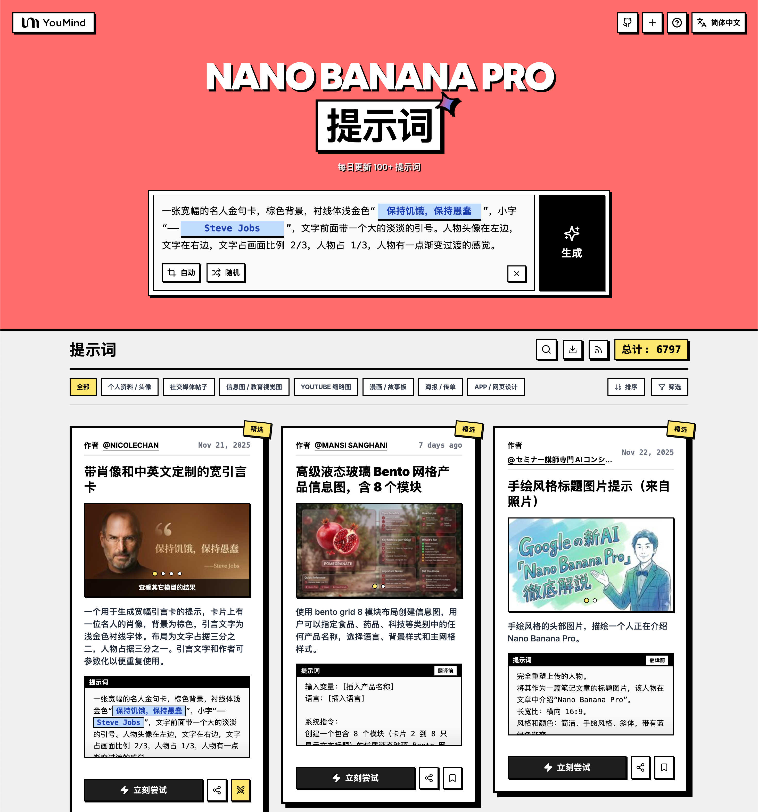

<a href="https://youmind.com/zh-TW/gpt-image-2-prompts">
  
</a>

> 💡 🎬 進階玩法：用 **Seedance 2** 把 GPT Image 2 生成的圖變成炸裂 AI 影片，2000+ 提示詞等你探索 👉 [awesome-seedance-2-prompts](https://github.com/YouMind-OpenLab/awesome-seedance-2-prompts)
# 🚀 GPT Image 2 提示詞大全

[](https://github.com/sindresorhus/awesome)
[](https://github.com/YouMind-OpenLab/awesome-gpt-image-2)
[](https://creativecommons.org/licenses/by/4.0/)
[](https://github.com/YouMind-OpenLab/awesome-gpt-image-2/actions)
[](docs/CONTRIBUTING.md)

> 🎨 OpenAI GPT Image 2 創意提示詞精選集合

> ⚠️ **版權聲明**：所有提示詞均收集自社區，僅供教育目的使用。如果您認為任何內容侵犯了您的權利，請[提交 issue](https://github.com/YouMind-OpenLab/awesome-gpt-image-2/issues/new?template=bug-report.yml)，我們將立即移除。

---

[](README.md) [](README_zh.md) [](README_zh-TW.md) [](README_ja-JP.md) [](README_ko-KR.md) [](README_th-TH.md) [](README_vi-VN.md) [](README_hi-IN.md) [](README_es-ES.md) [-Click%20to%20View-lightgrey)](README_es-419.md) [](README_de-DE.md) [](README_fr-FR.md) [](README_it-IT.md) [-Click%20to%20View-lightgrey)](README_pt-BR.md) [](README_pt-PT.md) [](README_tr-TR.md)

---

## 🌐 在網頁圖庫中查看

<div align="center">

[](https://youmind.com/zh-TW/gpt-image-2-prompts)

</div>

**[👉 瀏覽 YouMind GPT Image 2 提示詞圖庫](https://youmind.com/zh-TW/gpt-image-2-prompts)**

為什麼使用圖庫？

| Feature | GitHub README | youmind.com 圖庫 |
|---------|--------------|---------------------|
| 🎨 可視化佈局 | 線性列表 | 精美的瀑布流網格 |
| 🔍 搜索 | 僅 Ctrl+F | 全文搜索和篩選 |
| 🤖 AI 一鍵生圖 | - | AI 一鍵生圖 |
| 📱 移動端 | 基礎 | 完全響應式 |
| 🏷️ 分類 | - | 分類瀏覽 |


### 🏷️ 按分類瀏覽

- **使用情境**
  - [個人檔案 / 頭像](https://youmind.com/zh-TW/gpt-image-2-prompts?categories=profile-avatar)
  - [社群媒體貼文](https://youmind.com/zh-TW/gpt-image-2-prompts?categories=social-media-post)
  - [資訊圖表 / 教育視覺化內容](https://youmind.com/zh-TW/gpt-image-2-prompts?categories=infographic-edu-visual)
  - [YouTube 縮圖](https://youmind.com/zh-TW/gpt-image-2-prompts?categories=youtube-thumbnail)
  - [漫畫 / 分鏡腳本](https://youmind.com/zh-TW/gpt-image-2-prompts?categories=comic-storyboard)
  - [產品行銷](https://youmind.com/zh-TW/gpt-image-2-prompts?categories=product-marketing)
  - [電子商務主圖](https://youmind.com/zh-TW/gpt-image-2-prompts?categories=ecommerce-main-image)
  - [遊戲素材](https://youmind.com/zh-TW/gpt-image-2-prompts?categories=game-asset)
  - [海報／傳單](https://youmind.com/zh-TW/gpt-image-2-prompts?categories=poster-flyer)
  - [App / 網站設計](https://youmind.com/zh-TW/gpt-image-2-prompts?categories=app-web-design)
- **風格**
  - [攝影](https://youmind.com/zh-TW/gpt-image-2-prompts?categories=photography)
  - [電影感 / 電影劇照](https://youmind.com/zh-TW/gpt-image-2-prompts?categories=cinematic-film-still)
  - [動畫 / 漫畫](https://youmind.com/zh-TW/gpt-image-2-prompts?categories=anime-manga)
  - [插圖](https://youmind.com/zh-TW/gpt-image-2-prompts?categories=illustration)
  - [草圖 / 線稿](https://youmind.com/zh-TW/gpt-image-2-prompts?categories=sketch-line-art)
  - [漫畫 / 圖像小說](https://youmind.com/zh-TW/gpt-image-2-prompts?categories=comic-graphic-novel)
  - [3D 渲染](https://youmind.com/zh-TW/gpt-image-2-prompts?categories=3d-render)
  - [Q 版風格](https://youmind.com/zh-TW/gpt-image-2-prompts?categories=chibi-q-style)
  - [等距視角](https://youmind.com/zh-TW/gpt-image-2-prompts?categories=isometric)
  - [像素藝術](https://youmind.com/zh-TW/gpt-image-2-prompts?categories=pixel-art)
  - [油畫](https://youmind.com/zh-TW/gpt-image-2-prompts?categories=oil-painting)
  - [水彩](https://youmind.com/zh-TW/gpt-image-2-prompts?categories=watercolor)
  - [水墨 / 中式風格](https://youmind.com/zh-TW/gpt-image-2-prompts?categories=ink-chinese-style)
  - [復古 / 懷舊](https://youmind.com/zh-TW/gpt-image-2-prompts?categories=retro-vintage)
  - [賽博龐克 / 科幻](https://youmind.com/zh-TW/gpt-image-2-prompts?categories=cyberpunk-sci-fi)
  - [極簡主義](https://youmind.com/zh-TW/gpt-image-2-prompts?categories=minimalism)
- **主體**
  - [人像 / 自拍](https://youmind.com/zh-TW/gpt-image-2-prompts?categories=portrait-selfie)
  - [網紅 / 模特兒](https://youmind.com/zh-TW/gpt-image-2-prompts?categories=influencer-model)
  - [角色](https://youmind.com/zh-TW/gpt-image-2-prompts?categories=character)
  - [團體 / 情侶](https://youmind.com/zh-TW/gpt-image-2-prompts?categories=group-couple)
  - [產品](https://youmind.com/zh-TW/gpt-image-2-prompts?categories=product)
  - [食物 / 飲品](https://youmind.com/zh-TW/gpt-image-2-prompts?categories=food-drink)
  - [時尚單品](https://youmind.com/zh-TW/gpt-image-2-prompts?categories=fashion-item)
  - [動物 / 生物](https://youmind.com/zh-TW/gpt-image-2-prompts?categories=animal-creature)
  - [車輛](https://youmind.com/zh-TW/gpt-image-2-prompts?categories=vehicle)
  - [建築 / 室內設計](https://youmind.com/zh-TW/gpt-image-2-prompts?categories=architecture-interior)
  - [風景 / 大自然](https://youmind.com/zh-TW/gpt-image-2-prompts?categories=landscape-nature)
  - [城市景觀 / 街道](https://youmind.com/zh-TW/gpt-image-2-prompts?categories=cityscape-street)
  - [圖表](https://youmind.com/zh-TW/gpt-image-2-prompts?categories=diagram-chart)
  - [文字 / 字體排版](https://youmind.com/zh-TW/gpt-image-2-prompts?categories=text-typography)
  - [摘要 / 背景](https://youmind.com/zh-TW/gpt-image-2-prompts?categories=abstract-background)

---

## 📖 目錄

- [🌐 在網頁圖庫中查看](#-view-in-web-gallery)
- [🤔 什麼是 GPT Image 2？](#-what-is-gpt-image-2)
- [📊 統計數據](#-statistics)
- [🔥 精選提示詞](#-featured-prompts)
- [📋 所有提示詞](#-all-prompts)
- [🤝 如何貢獻](#-how-to-contribute)
- [📄 許可證](#-license)
- [🙏 致謝](#-acknowledgements)
- [⭐ Star 歷史](#-star-history)

---

## 🤔 什麼是 GPT Image 2？

**GPT Image 2**（代號 **"duct-tape"**）是 OpenAI 下一代圖像生成模型。社群測試回饋它在以下方面實現了質的飛躍：

- 🎯 **像素級文字渲染** — 中文、英文、日文均達到 native 水準，無錯字、無字形扭曲
- 🎨 **跨圖像素級一致性** — 同一角色、風格、IP 在多張圖間保持像素級一致
- ⚡ **商用級插畫質量** — 插畫風格輸出無需人工精修，即可直接用於商業場景
- 🌈 **真實藝術風格注入** — 不止是「模仿參考圖」，而是真正理解並再現藝術風格的靈魂
- 🔧 **故事板與產品系列** — 適合故事板、IP 形象、產品系列圖等需要多圖一致性的場景
- 📐 **多語言平面設計** — 社交卡片、Banner、海報一次生圖即可完成多語言文字排版

📚 **了解更多：** 查看社群測試 [報告要點](docs/FAQ.md)

### 🚀 Raycast 集成

部分提示詞支持使用 [Raycast Snippets](https://raycast.com/help/snippets) 語法的**動態參數**。尋找 🚀 Raycast Friendly 徽章！

**示例：**
```
A quote card with "{argument name="quote" default="Stay hungry, stay foolish"}"
by {argument name="author" default="Steve Jobs"}
```

在 Raycast 中使用時，您可以動態替換參數以快速迭代！

---

## 📊 統計數據

<div align="center">

| 指標 | 數量 |
|--------|-------|
| 📝 提示詞總數 | **3828** |
| ⭐ 精選 | **6** |
| 🔄 最後更新 | **2026年5月3日 星期日 凌晨1:48:47 [UTC]** |

</div>

---

## 🔥 精選提示詞

> ⭐ 由我們的團隊精心挑選，具有卓越的質量和創造力

### No. 1: VR 頭戴裝置爆炸圖海報


#### 📖 描述

生成一張高科技 VR 頭戴裝置爆炸圖，包含詳細的組件標註與宣傳文案。

#### 📝 提示詞

```
{
  "type": "產品爆炸圖海報",
  "subject": "VR 頭戴裝置",
  "style": "簡潔的高科技 3D 渲染，攝影棚燈光，發光細節",
  "background": "{argument name=\"background color\" default=\"柔和的紫藍色漸層\"}",
  "header": {
    "logo": "∞ {argument name=\"product name\" default=\"Meta Quest 3\"}",
    "subtitle": "{argument name=\"main catchphrase\" default=\"以全新的結構，定義全新的現實。\"}"
  },
  "layout": {
    "centerpiece": "垂直堆疊的 VR 頭戴裝置爆炸圖，展示 9 個不同的內部組件層：外殼、攝影機感測器、主機板與晶片、Pancake 透鏡、內部框架、電池組、側邊頭帶、頂部頭帶以及面部襯墊。",
    "callout_labels": {
      "count": 8,
      "left_side": [
        "Snapdragon® XR2 Gen 2\n以強大的處理效能，實現即時體驗。",
        "可調式 IPD 機構\n為廣大用戶提供舒適的配戴感。",
        "精密設計頭帶\n追求舒適與穩定性的工學設計。"
      ],
      "right_side": [
        "前飾板\n洗鍊的設計與最佳的重量平衡。",
        "追蹤攝影機\n實現高精度的位置追蹤與環境感知。",
        "Pancake 透鏡\n輕薄設計，提供寬廣視野與清晰影像。",
        "高效能電池\n支援長時間運作的最佳化電源設計。",
        "柔軟面部襯墊\n即使長時間配戴也能保持舒適。"
      ]
    },
    "footer": {
      "left_text_block": {
        "headline": "{argument name=\"bottom headline\" default=\"體驗，從結構進化。\"}",
        "body": "每一個零件都蘊含著支撐沉浸式體驗的尖端科技與匠心設計。Meta Quest 3 從內部結構開始，為您創造感受未來的體驗。"
      },
      "right_logo": "∞ Meta"
    }
  }
}
```

#### 🖼️ 生成圖片

##### Image 1

<div align="center">

</div>

#### 📌 詳情

- **作者:** [wory＠ホッピング中](https://x.com/wory37303852)
- **來源:** [Twitter Post](https://x.com/wory37303852/status/2045925660401795478#reversed-0)
- **發布時間:** 2026年4月19日
- **多語言:** en

**[👉 立即嘗試 →](https://youmind.com/zh-TW/gpt-image-2-prompts?id=13460)**

---

### No. 2: 手繪城市美食地圖


#### 📖 描述

生成一張手繪水彩風格的旅遊地圖，包含編號的在地特色美食、地標以及圖例。

#### 📝 提示詞

```
{
  "type": "手繪地圖資訊圖表",
  "style": "{argument name=\"art style\" default=\"復古羊皮紙上的水彩與墨水手繪插圖\"}",
  "title_section": {
    "text": "{argument name=\"city name\" default=\"成都\"} {argument name=\"map title\" default=\"吃貨暴走地圖\"}",
    "mascot": "戴著太陽眼鏡並比讚的卡通紅辣椒"
  },
  "border": "{argument name=\"border decoration\" default=\"綠葉與紅辣椒藤蔓\"}",
  "layout": {
    "background": "帶有黃色道路、藍色河流與綠色公園區域的質感米色羊皮紙",
    "sections": [
      {
        "title": "地標",
        "count": 6,
        "illustrations": ["傳統涼亭", "傳統寺院", "攀爬著熊貓的現代摩天大樓", "高聳電視塔", "傳統牌樓", "工業建築"],
        "labels": ["人民公園", "文殊院", "IFS", "339電視塔", "寬窄巷子", "東郊記憶"]
      },
      {
        "title": "美食景點",
        "count": 12,
        "illustrations": ["麻婆豆腐", "紅油水餃", "串串香", "三大炮", "蛋烘糕", "九宮格火鍋", "肥腸粉", "缽缽雞", "冒椒火辣", "蓋碗茶", "冰粉", "雙流老媽兔頭"],
        "labels": ["1 陳麻婆豆腐", "2 鍾水餃", "3 春熙路", "4 寬窄巷子·三大炮", "5 建設路·葉婆婆蛋烘糕", "6 玉林路·小龍坎火鍋", "7 香香巷·肥腸粉", "8 武侯祠大街·缽缽雞", "9 東郊記憶·冒椒火辣", "10 人民公園·鶴鳴茶社", "11 錦里古街·冰粉", "12 雙流老媽兔頭"]
      },
      {
        "title": "圖例",
        "position": "右下角",
        "count": 5,
        "items": ["紅點", "綠色房屋", "綠樹", "藍線", "黃色雙線"],
        "labels": ["美食地點", "地標景點", "公園綠地", "河流湖泊", "主要道路"]
      }
    ],
    "centerpiece": "坐著吃竹子的巨型熊貓",
    "bottom_right_extras": ["帶有 N、S、E、W 的復古羅盤玫瑰", "免責聲明文字『溫馨提示：吃辣需謹慎，腸胃要保護~』並附帶一個紅辣椒圖示"]
  }
}
```

#### 🖼️ 生成圖片

##### Image 1

<div align="center">

</div>

#### 📌 詳情

- **作者:** [皮皮特](https://x.com/mm_zzm44854)
- **來源:** [Twitter Post](https://x.com/mm_zzm44854/status/2045861258520568230#reversed-1)
- **發布時間:** 2026年4月19日
- **多語言:** en

**[👉 立即嘗試 →](https://youmind.com/zh-TW/gpt-image-2-prompts?id=13515)**

---

### No. 3: 採用混合風格的桃太郎說明用 Slides


#### 📖 描述

這是一個結合了「いらすとや (Irasutoya)」插圖簡約溫暖的美學，以及日本政府簡報高資訊密度特徵的提示詞。

#### 📝 提示詞

```
請為 {argument name="theme" default="桃太郎"} 製作一張說明用 Slides ({argument name="format" default="ポンチ絵 (ponchi-e) 圖表"})，將「いらすとや (Irasutoya)」的溫和氛圍與「霞關風格 (Kasumigaseki slides)」那種壓倒性的資訊密度融合在一起。
```

#### 🖼️ 生成圖片

##### Image 1

<div align="center">

</div>

##### Image 2

<div align="center">

</div>

#### 📌 詳情

- **作者:** [やまもん](https://x.com/yammamon)
- **來源:** [Twitter Post](https://x.com/yammamon/status/2045778624092254603)
- **發布時間:** 2026年4月19日
- **多語言:** ja

**[👉 立即嘗試 →](https://youmind.com/zh-TW/gpt-image-2-prompts?id=13983)**

---

### No. 4: 電子商務直播 UI 模型


#### 📖 描述

生成逼真的社群媒體直播介面並疊加在肖像上，包含可自訂的聊天訊息、禮物彈出視窗以及商品購買卡片。

#### 📝 提示詞

```
{
  "type": "直播 UI 模型",
  "subject": {
    "description": "{argument name=\"host name\" default=\"Elon Musk\"} 的肖像，微笑，穿著印有白色技術示意圖的黑色 T 恤",
    "background": "左側顯示帶有 '{argument name=\"left background logo\" default=\"SPACEX\"}' 文字的螢幕，右側顯示紅色的 '{argument name=\"right background logo\" default=\"Tesla T logo\"}' 和一輛深色汽車"
  },
  "ui_overlay": {
    "top_header": {
      "host_info": "頭像，名稱 '{argument name=\"host name\" default=\"Elon Musk\"}'，副標題 '55.6 萬本場點讚'，紅色 '關注' 按鈕",
      "rank_badge": "帶有 '全站第 1 名' 的金幣圖示",
      "viewer_stats": "3 個頂級觀眾頭像，分別顯示 '12.3w'、'8.6w'、'5.7w'，總計 '68.7 萬'，'X' 關閉按鈕",
      "right_links": "'更多直播 >'，'禮物展館 0/24' 帶有藍色 '經典' 標籤"
    },
    "mid_left_gifts": {
      "count": 2,
      "items": [
        "頭像 '科技愛好者'，'送小心心'，愛心圖示 x 1314",
        "頭像 '星辰大海'，'送火箭'，火箭圖示 x 666"
      ]
    },
    "bottom_left_chat": {
      "system_message": "等級 37 徽章 '宇宙漫遊者 加入了直播間'",
      "message_count": 7,
      "messages": [
        "小火箭: 馬斯克！未來可期！🚀",
        "future: 特斯拉 Model 2 什麼時候出？",
        "星空夢想家: SpaceX 今年能上火星嗎？",
        "AI 探索者: Neuralink 進展如何？",
        "帥氣的網友: 馬總好！",
        "Mars: 第一次來你的直播，超激動！",
        "用戶 123: 講講 AI 吧，會取代人類嗎？"
      ]
    },
    "bottom_right_product_card": {
      "hot_tag": "橘色 '熱賣 x 1888'",
      "image": "Tesla Cybertruck",
      "title": "{argument name=\"product name\" default=\"特斯拉 Cybertruck 電動皮卡\"}",
      "price": "{argument name=\"product price\" default=\"¥ 1,618,000\"}",
      "button": "紅色 '搶' 按鈕",
      "floating_animation": "半透明愛心沿著右側邊緣向上飄浮"
    },
    "bottom_bar": {
      "input_field": "'說點什麼...'",
      "icons": ["笑臉", "三個點", "購物車", "禮物盒", "分享"]
    }
  }
}
```

#### 🖼️ 生成圖片

##### Image 1

<div align="center">

</div>

#### 📌 詳情

- **作者:** [神经病不想好转](https://x.com/sjbbxhz)
- **來源:** [Twitter Post](https://x.com/sjbbxhz/status/2045684734714380687#reversed-0)
- **發布時間:** 2026年4月19日
- **多語言:** en

**[👉 立即嘗試 →](https://youmind.com/zh-TW/gpt-image-2-prompts?id=14036)**

---

### No. 5: 動漫武術對決


#### 📖 描述

生成一個動態的動漫風格動作場景，描繪兩名角色在傳統道場中伴隨元素光環進行戰鬥。

#### 📝 提示詞

```
一張極具動態感的動漫插圖，描繪兩名少女在傳統木造道場內進行激烈的武術對決。在前景中，一名留著 {argument name="character 1 hair" default="黑色高包頭配紅色髮帶"} 的少女擺出強而有力的低位武術架勢，奮力向前揮拳。她身穿 {argument name="character 1 outfit" default="白色中式上衣配紅色流蘇與寬鬆紅褲"}，強烈的紅色能量斬擊環繞著她揮動的四肢。在右側半空中，一名留著 {argument name="character 2 hair" default="淺紫色雙包頭"} 的少女優雅地躍起，自信地微笑著，身穿 {argument name="character 2 outfit" default="深綠色刺繡金邊洋裝與黑色緊身褲"}，伴隨著如水流般掃過的藍色能量軌跡。背景為古樸的木造寺廟內部，上方懸掛著一塊顯眼的招牌，寫著「{argument name="sign text" default="武術会"}」。場景充滿了爆炸性的動作張力、飛揚的塵土、碎裂的木質地板、閃耀的彩色粒子特效，以及將角色與細緻背景完美區隔的戲劇性低角度光影。
```

#### 🖼️ 生成圖片

##### Image 1

<div align="center">

</div>

#### 📌 詳情

- **作者:** [たねもみ 2.0 / Tanemomi Ver2.0](https://x.com/Tanemomi_Ver2)
- **來源:** [Twitter Post](https://x.com/Tanemomi_Ver2/status/2046063806846214265#reversed-0)
- **發布時間:** 2026年4月20日
- **多語言:** en

**[👉 立即嘗試 →](https://youmind.com/zh-TW/gpt-image-2-prompts?id=13467)**

---

### No. 6: 3D 石階演化資訊圖表


#### 📖 描述

將平面的演化時間軸轉換為逼真的 3D 石階資訊圖表，包含細緻的生物渲染圖與結構化的側邊欄。

#### 📝 提示詞

```
{
  "type": "演化時間軸資訊圖表",
  "instruction": "以 REFERENCE_0 作為結構基礎，將平面向量設計轉換為高度逼真的 3D 資訊圖表。將平滑的坡道替換為層次分明的石階，並將所有生物升級為照片級的 3D 模型。",
  "style": {
    "background": "{argument name=\"background style\" default=\"復古紋理羊皮紙\"}",
    "staircase": "{argument name=\"staircase material\" default=\"逼真的紋理石塊\"}",
    "subjects": "{argument name=\"organism style\" default=\"高度細緻的照片級 3D 渲染圖\"}"
  },
  "layout": {
    "main_title": "{argument name=\"main title\" default=\"人類演化\"}",
    "sections": [
      {
        "position": "左側邊欄",
        "count": 8,
        "labels": ["L0: 單細胞生命", "L1: 多細胞生物", "L2: 動物界", "L3: 脊索動物", "L4: 上陸革命", "L5: 哺乳綱", "L6: 人科演化", "L7: 智人紀元"]
      },
      {
        "position": "右上角",
        "title": "獲得的功能 / 失去的功能",
        "description": "帶有加號與減號圖示的圖例"
      },
      {
        "position": "底部中央",
        "title": "演化關鍵里程碑",
        "count": 6,
        "description": "包含 6 個展示猿類到人類演化剪影圖的時間軸"
      }
    ],
    "centerpiece": {
      "description": "蜿蜒的石階，共有 25 個編號階梯，展示特定生物。",
      "count": 25,
      "notable_elements": [
        "第 07 階：水母",
        "第 09 階：菊石",
        "第 10 階：三葉蟲",
        "第 24 階：直立行走的人類",
        "第 25 階：{argument name=\"future evolution concept\" default=\"帶有問號的發光宇宙剪影\"}"
      ]
    }
  }
}
```

#### 🖼️ 生成圖片

##### Image 1

<div align="center">

</div>

#### 📌 詳情

- **作者:** [知识猫图解](https://x.com/GeekCatX)
- **來源:** [Twitter Post](https://x.com/GeekCatX/status/2045792240044511277#reversed-1)
- **發布時間:** 2026年4月19日
- **多語言:** en

**[👉 立即嘗試 →](https://youmind.com/zh-TW/gpt-image-2-prompts?id=13491)**

---

## 📋 所有提示詞

> 📝 按發布日期排序（最新優先）

### No. 1: 個人檔案 / 頭像 - 笨拙的 MS Paint 風格重繪


#### 📖 描述

一個充滿創意與幽默的提示詞，強制 AI 以低畫質、滑鼠繪製的 MS Paint 風格重繪圖像。

#### 📝 提示詞

```
請用最笨拙、潦草且慘不忍睹的方式重繪附件中的圖像。請使用 {argument name="background color" default="white"} 作為背景，並讓它看起來像是用 {argument name="input device" default="mouse"} 在 {argument name="software" default="MS Paint"} 中繪製的一樣。它應該要隱約相似但又不太像，既要有點對應又要顯得困惑且尷尬，並帶有那種強調其荒謬低劣感的像素化質感。其實，算了，隨便你怎麼畫都行。
```

#### 🖼️ 生成圖片

##### Image 1

<div align="center">

</div>

#### 📌 詳情

- **作者:** [Anastasiia Gaidashenko](https://x.com/avgaydashenko)
- **來源:** [Twitter Post](https://x.com/avgaydashenko/status/2050481415637311699)
- **發布時間:** 2026年5月2日
- **多語言:** en

**[👉 立即嘗試 →](https://youmind.com/zh-TW/gpt-image-2-prompts?id=17566)**

---

### No. 2: 個人檔案 / 頭像 - 柳湖夕照漢服


#### 📖 描述

此提示詞可生成一張浪漫的直式肖像，描繪一位身穿飄逸漢服的女子在夕陽下的柳樹旁，非常適合用於歷史奇幻風格及優雅的東亞風角色藝術。

#### 📝 提示詞

```
一張寧靜的黃金時刻中國古代河畔肖像，{argument name="character name" default="一位優雅的年輕女子"} 站在一棵巨大的古老柳樹下，柳枝長長垂下。她身穿優雅飄逸的漢服，層次分明的珊瑚紅、蜜桃色與淡粉色絲綢上繡有精緻花卉，半透明的外袖與長絲帶在微風中飄動。她肩後撐著 1 把傳統油紙傘，傘面呈淡玫瑰粉色，可見竹製傘骨，在頭部周圍形成光環般的形狀。她的頭髮梳成華麗的髮髻，配有花卉髮簪與小花裝飾。畫面採用直式全身構圖，女子位於畫面右側偏中，粗壯且紋理分明的柳樹幹佔據左側，溫暖的夕陽低垂在地平線上，照耀著平靜的湖面，水面波光粼粼，遠處可見山巒與 1 座位於對岸的小亭子。前景點綴著野花與柔軟的草地，布料與柳葉在微風中輕輕擺動，營造出夢幻的氛圍感、體積光射線、浪漫的繪畫寫實風格、超細緻紋理、柔和的電影光感、溫暖的琥珀色與粉彩色調，呈現出空靈的歷史奇幻氛圍。
```

#### 🖼️ 生成圖片

##### Image 1

<div align="center">

</div>

##### Image 2

<div align="center">

</div>

#### 📌 詳情

- **作者:** [老范讲故事🎙️](https://x.com/lukfan)
- **來源:** [Twitter Post](https://x.com/lukfan/status/2050403017665716539#reversed-0)
- **發布時間:** 2026年5月2日
- **多語言:** en

**[👉 立即嘗試 →](https://youmind.com/zh-TW/gpt-image-2-prompts?id=17636)**

---

### No. 3: 個人檔案 / 頭像 - 動漫企鵝海軍上將惡搞圖


#### 📖 描述

一幅以戰損海軍要塞為背景的幽默動漫風格企鵝指揮官肖像，非常適合用於迷因藝術、惡搞海報及大膽的角色插畫。

#### 📝 提示詞

```
這是一幅簡潔且極具視覺衝擊力的動漫惡搞插畫，主角是一隻被塑造成強大海軍指揮官的圓潤國王企鵝，採半身構圖並置於畫面中央。企鵝頭戴 1 頂亮紅色速食店棒球帽，帽上印有黃色麥當勞風格的金色拱門標誌；戴著 1 副亮面黑色圓形墨鏡；臉上留著 1 撇巨大的新月形白色鬍鬚，線條誇張地橫跨臉部；肩上披著 1 件白色海軍上將大衣，配有深紅色肩章、華麗的金色流蘇、黑色內襯及金色滾邊。企鵝胸前有 3 道明顯的傷疤：1 道長斜線傷疤與 2 道較短的交叉傷疤。牠的鳥喙小而呈橘色，表情冷靜且帶有威懾力，呈現出一種滑稽的冷面笑匠感。背景：一座巨大的白色石造要塞牆，靈感來自動漫中的海軍總部，牆面上漆有巨大的黑色書法字，掛著兩面標有「MARINE」的白色旗幟，並有受損的城垛、煙霧、火花、瓦礫，前景則是洶湧的藍色海浪。要塞後方是晴朗的藍天與零星雲朵。構圖對稱且具海報感，企鵝佔據前景主導地位。風格：清晰的賽璐珞動漫風、大膽的黑色輪廓線、飽和的色彩、精緻的迷因級角色設計、充滿戲劇性與幽默感的跨界風格，輪廓清晰易辨，採用方形構圖。
```

#### 🖼️ 生成圖片

##### Image 1

<div align="center">

</div>

#### 📌 詳情

- **作者:** [挖矿小企鹅｜进群私信](https://x.com/Goupenguin)
- **來源:** [Twitter Post](https://x.com/Goupenguin/status/2050397339215626659#reversed-0)
- **發布時間:** 2026年5月2日
- **多語言:** en

**[👉 立即嘗試 →](https://youmind.com/zh-TW/gpt-image-2-prompts?id=17649)**

---

### No. 4: 個人檔案 / 頭像 - 暗黑電影感人像


#### 📖 描述

這是一個專業攝影提示詞，用於創作具有戲劇性火光、煙霧效果及時尚人物的電影感黑色電影風格人像。

#### 📝 提示詞

```
一張充滿電影感且情緒濃郁的人像照，主角為 {argument name="subject description" default="身穿深棕色高領西裝並配戴橢圓形墨鏡的時尚女性"}，手持 {argument name="prop" default="燃燒中的紅心國王撲克牌"} 並抽著細長雪茄，空氣中瀰漫著戲劇性的火光與煙霧，低調攝影風格，溫暖的橘色火光映照在臉上，背景為 {argument name="background" default="模糊的暗色背景"}，淺景深，超寫實，高對比度，電影攝影質感，35mm 鏡頭效果，柔和散景，細膩的皮膚紋理，焦點清晰，專業燈光，暗黑電影氛圍
```

#### 🖼️ 生成圖片

##### Image 1

<div align="center">

</div>

#### 📌 詳情

- **作者:** [Aijaz](https://x.com/iamsofiaijaz)
- **來源:** [Twitter Post](https://x.com/iamsofiaijaz/status/2050257705093447960)
- **發布時間:** 2026年5月1日
- **多語言:** en

**[👉 立即嘗試 →](https://youmind.com/zh-TW/gpt-image-2-prompts?id=17519)**

---

### No. 5: 個人檔案 / 頭像 - 拙劣的 MS Paint 風格重繪


#### 📖 描述

刻意使用笨拙的 Microsoft Paint 風格，結合像素化紋理與滑鼠繪製的質感，生成一張「拙劣」的圖像重繪。

#### 📝 提示詞

```
請將此附件圖像重繪為 {argument name="style" default="最笨拙、潦草且絕對傷眼的方式"}。請使用純白色背景，並使其看起來像是用滑鼠在 Microsoft Paint 中繪製的一樣。它應該與原圖有些相似，但又不完全相同——看起來既有連結感，又帶有一種令人困惑的尷尬感。圖像應具有低畫質、逐像素的顆粒感紋理，以充分體現其荒謬的醜陋感。總之，隨你怎麼畫都行。
```

#### 🖼️ 生成圖片

##### Image 1

<div align="center">

</div>

#### 📌 詳情

- **作者:** [mousepotato](https://x.com/iluciddreaming)
- **來源:** [Twitter Post](https://x.com/iluciddreaming/status/2050255428651749382)
- **發布時間:** 2026年5月1日
- **多語言:** zh

**[👉 立即嘗試 →](https://youmind.com/zh-TW/gpt-image-2-prompts?id=17569)**

---

### No. 6: 個人檔案 / 頭像 - 城市街頭時尚人像


#### 📖 描述

一個簡潔的城市街頭人像提示詞，包含風格化的人物主體、散景塗鴉背景以及柔和的自然光。

#### 📝 提示詞

```
電影感城市街頭人像，一位時尚年輕女性隨性地坐著，戴著 {argument name="hat type" default="芥末黃毛帽"}、圓框眼鏡，身穿寬鬆黑色連帽衫和破洞藍色牛仔褲，柔和自然光，淺景深，背景為色彩鮮豔且模糊的塗鴉牆（散景效果），居中構圖，直視鏡頭，冷靜自信的表情，細緻的面部特徵，自然的皮膚紋理，暖色調柔和調色，街頭服飾美學，編輯攝影風格，85mm 鏡頭，超寫實，4K
```

#### 🖼️ 生成圖片

##### Image 1

<div align="center">

</div>

#### 📌 詳情

- **作者:** [Taaruk](https://x.com/Taaruk_)
- **來源:** [Twitter Post](https://x.com/Taaruk_/status/2050252605050491014)
- **發布時間:** 2026年5月1日
- **多語言:** en

**[👉 立即嘗試 →](https://youmind.com/zh-TW/gpt-image-2-prompts?id=17529)**

---

### No. 7: 個人檔案 / 頭像 - 比特幣猴子 MS Paint 塗鴉


#### 📖 描述

一隻手繪風格的粗獷卡通猴子，戴著比特幣主題的配件並手持掌上遊戲機，非常適合用於迷因藝術或病毒式傳播的塗鴉風格社群貼文。

#### 📝 提示詞

```
這是一幅在純白背景上繪製的簡單童趣數位塗鴉，主體居中且獨立，呈現一隻可愛的卡通猴子站立並面向前方。猴子有著圓形的米色臉龐、棕色的毛髮輪廓、兩隻圓耳朵、小黑點眼睛以及厚實的波浪狀黑色微笑。牠戴著一頂灰色的 Ushanka 風格冬帽，帽上有棕色護耳，帽子正面有一個印有紅色比特幣符號的黃色圓形徽章。猴子身穿一件亮紫色開襟外套，內搭白色襯衫，脖子上掛著一條金項鍊，鍊墜是一個印有黑色比特幣符號的圓形金牌。一隻手臂向外伸出，拿著一台綠色螢幕、黑色控制按鈕的紫色掌上遊戲機；另一隻手臂則垂在身側。腿部短小簡單，腳掌為米色。整體以粗獷的 MS Paint 風格呈現，線條不均勻、色彩平塗、填色潦草、比例俏皮，並帶有天真的網路迷因美學，就像是病毒式傳播的 GPT Image 2 蠟筆素描。
```

#### 🖼️ 生成圖片

##### Image 1

<div align="center">

</div>

#### 📌 詳情

- **作者:** [zac.eth 🧙🏻‍♂️♦️](https://x.com/zacxbt)
- **來源:** [Twitter Post](https://x.com/zacxbt/status/2050249469858402419#reversed-0)
- **發布時間:** 2026年5月1日
- **多語言:** en

**[👉 立即嘗試 →](https://youmind.com/zh-TW/gpt-image-2-prompts?id=17721)**

---

### No. 8: 個人檔案 / 頭像 - 夜間海灘閃光燈人像


#### 📖 描述

一張照片級真實感的智慧型手機風格夜間海灘人像，非常適合生成看起來像是用閃光燈自然拍攝的休閒社群媒體照片。

#### 📝 提示詞

```
一張真實感十足的夜間海灘抓拍人像，一位年輕女性站在岸邊濕潤的沙灘上，取景範圍從大腿中部以上，面向鏡頭，姿勢放鬆，一隻手臂自然垂在身側。她留著中分長直深棕色頭髮，膚色白皙至中等，身穿一件合身的無肩帶緊身連身裙，裙身帶有柔和的復古碎花圖案，色調為柔和的奶油色、淡黃色、鼠尾草綠和灰藍色。搭配一條精緻的金色項鍊，墜著一個小圓墜，手指上戴著細緻的戒指。場景採用相機直閃補光，在皮膚上形成銳利且真實的高光，主體在極暗的背景下顯得清晰，身後可見一帶泡沫海浪。海灘與海洋應呈現自然且昏暗的質感，地平線融入漆黑的夜空。具備智慧型手機快照美學、真實的皮膚紋理、輕微的閃光燈強烈感、休閒社交照片構圖、淺景深環境細節、主體居中，營造出真實的夜間海灘氛圍。
```

#### 🖼️ 生成圖片

##### Image 1

<div align="center">

</div>

#### 📌 詳情

- **作者:** [Danna R.](https://x.com/daaaaanc)
- **來源:** [Twitter Post](https://x.com/daaaaanc/status/2050245437353754751#reversed-2)
- **發布時間:** 2026年5月1日
- **多語言:** en

**[👉 立即嘗試 →](https://youmind.com/zh-TW/gpt-image-2-prompts?id=17738)**

---

### No. 9: 個人檔案 / 頭像 - 奢華公寓鏡面自拍


#### 📖 描述

一個照片級真實的鏡面自拍場景，展示了一位身穿優雅白色單肩連身裙的女性，非常適合時尚、交友軟體個人檔案或生活風格的 AI 圖片生成。

#### 📝 提示詞

```
一張照片級真實的全身鏡面自拍，場景為室內溫暖、高檔的公寓客廳走廊。一位身材苗條的年輕女性站立其中，身穿一件合身的象牙白單肩緊身中長裙，腰部和臀部有柔軟的褶皺設計，風格簡約優雅，呈現出俐落的約會之夜造型。她的頭髮是深棕色的直髮，長度及肩，中分並自然垂落在兩側。她右手舉著智慧型手機，部分遮住了臉部，手機殼為黑色，上面裝飾著紅色雲朵圖案。她的左臂自然垂在身側，手腕上戴著銀色手鐲，手指上戴著精緻的戒指。構圖為垂直方向，真實且帶有隨性的奢華感，就像在牆面鏡前拍攝的真實個人穿搭自拍。場景包括右側的一張米色布藝沙發、沙發上的一個灰褐色與奶油色相間的圖案抱枕，以及放在沙發墊上的一個棕色小巧皮革手提包。她身後是一面有質感的古銅棕色裝飾牆；左側是昏暗的走廊，牆上掛著 3 幅裝飾畫，背景有深色的門框、奶油色的牆壁和拋光淺色瓷磚地板。使用溫暖的室內環境光、柔和的陰影、細膩的手機鏡頭真實感、自然的皮膚紋理、逼真的反射效果、乾淨的公寓風格，主體居中，聚焦於上半身與連身裙，呈現出一種低調奢華的美感。
```

#### 🖼️ 生成圖片

##### Image 1

<div align="center">

</div>

#### 📌 詳情

- **作者:** [Danna R.](https://x.com/daaaaanc)
- **來源:** [Twitter Post](https://x.com/daaaaanc/status/2050245437353754751#reversed-3)
- **發布時間:** 2026年5月1日
- **多語言:** en

**[👉 立即嘗試 →](https://youmind.com/zh-TW/gpt-image-2-prompts?id=17737)**

---

### No. 10: 個人檔案 / 頭像 - 艾菲爾鐵塔低角度自拍


#### 📖 描述

這是一個寫實的夏季旅遊自拍提示詞，旨在生成一張在艾菲爾鐵塔下，伴隨強烈陽光與時尚穿搭的休閒遊客照片。

#### 📝 提示詞

```
一張從巴黎艾菲爾鐵塔正下方低角度拍攝的寫實旅遊自拍，背景為晴朗無雲的明亮天氣，鐵塔在頭頂上方戲劇性地延伸，並在湛藍的天空中呈現完美的垂直對稱。前景中，一位留著 {argument name="hair color" default="中棕色"} 中長直髮的年輕女性非常靠近鏡頭，將手機拿在胸部下方略低的位置，呈現仰拍的自拍視角。她的表情自然放鬆，帶有休閒隨性的度假照片氛圍。她穿著一件 {argument name="top color" default="淡粉色"} 的合身羅紋平口上衣、{argument name="bottom color" default="白色"} 高腰牛仔褲，並配戴兩條細緻的疊戴銀色項鍊。她的肌膚在正午強烈的陽光下顯得溫暖，鐵塔結構投下清晰的自然陰影，肩膀與鎖骨處有細膩的高光。構圖從大腿中部到頭部，一隻手臂自然地向鏡頭延伸，呈現自然的自拍姿勢。強調寫實的智慧型手機攝影感、艾菲爾鐵塔鐵架結構的銳利建築細節、真實的遊客快照構圖、自然的身體比例、清爽的夏季造型以及高細節的寫實感。讓它看起來像是 {argument name="character name" default="一位時尚年輕女性"} 在 {argument name="location" default="巴黎"} 拍攝的真實手持度假自拍，而非攝影棚影像。
```

#### 🖼️ 生成圖片

##### Image 1

<div align="center">

</div>

#### 📌 詳情

- **作者:** [Danna R.](https://x.com/daaaaanc)
- **來源:** [Twitter Post](https://x.com/daaaaanc/status/2050245437353754751#reversed-0)
- **發布時間:** 2026年5月1日
- **多語言:** en

**[👉 立即嘗試 →](https://youmind.com/zh-TW/gpt-image-2-prompts?id=17736)**

---

### No. 11: 個人檔案 / 頭像 - 便利商店隨拍人像


#### 📖 描述

這是一個基於參考圖像的超寫實便利商店收銀員隨拍人像提示詞，強調真實感與自然光影。

#### 📝 提示詞

```
一位美麗的 {argument name="subject" default="年輕女性"}，年約 20 出頭，擁有與所提供參考圖像一致的五官、膚色及整體外貌，職業為 {argument name="occupation" default="便利商店收銀員"}。她穿著典型的 {argument name="store brand" default="7-Eleven"} 制服（白色襯衫搭配綠、紅、橘色飾邊，名牌上寫著「MEEM」，頭髮整齊紮起，與參考圖像中的造型一致）。

她站在收銀台後方服務顧客，表情親切自然，符合參考圖像中的性格與臉部結構。櫃台上擺放著 POS 機、條碼掃描器，以及糖果和飲料等小型商品。

隨拍瞬間：照片以顧客視角使用智慧型手機隱蔽拍攝，帶有輕微的前景模糊、不完美的構圖，呈現出未經擺拍的自然感。構圖應保留她與參考圖像完全一致的面貌，不得變形。

光影：明亮且均勻分佈的便利商店霓虹燈光，維持真實的膚色與符合參考圖像的色彩準確度。

環境：現代化便利商店內部，收銀台後方陳列著整齊的商品貨架，營造出乾淨、有序且明亮的氛圍。

攝影風格：超寫實隨拍攝影，淺景深，自然紋理，高細節，帶有輕微動態模糊以增加真實感，細膩的智慧型手機相機噪點，4K 畫質。

可選變化：

* 稍微傾斜的角度
* 玻璃展示櫃上的反光
* 她遞送收據或找零時的輕微動作
* 與參考圖像一致的溫和自然微笑
```

#### 🖼️ 生成圖片

##### Image 1

<div align="center">

</div>

#### 📌 詳情

- **作者:** [Meem](https://x.com/mehvishs25)
- **來源:** [Twitter Post](https://x.com/mehvishs25/status/2050234492351344979)
- **發布時間:** 2026年5月1日
- **多語言:** en

**[👉 立即嘗試 →](https://youmind.com/zh-TW/gpt-image-2-prompts?id=17544)**

---

### No. 12: 個人檔案 / 頭像 - MS Paint 風格塗鴉重製


#### 📖 描述

此提示詞可將經典肖像參考圖轉換為粗糙的 MS Paint 風格草圖，適用於迷因創作及刻意追求低品質的重繪效果。

#### 📝 提示詞

```
使用提供的參考圖像，以極其粗糙、如兒童塗鴉般的 MS Paint 風格，重現相同的構圖與辨識度高的輪廓。保留側臉姿勢、藍色頭巾、淡黃色長圍巾、珍珠耳環及棕色服裝，但將所有細節簡化為粗黑線條、雜亂的塗鴉填色、不均勻的比例，以及在純白背景上刻意呈現的低技巧手繪痕跡。使其看起來像是一幅快速完成的業餘數位草圖，並採用平塗色彩，不帶任何繪畫感陰影。
```

#### 🖼️ 生成圖片

##### Image 1

<div align="center">

</div>

#### 📌 詳情

- **作者:** [Zephyra Leigh](https://x.com/ZephyraLeigh)
- **來源:** [Twitter Post](https://x.com/ZephyraLeigh/status/2050208381760360478#reversed-1)
- **發布時間:** 2026年5月1日
- **多語言:** en

**[👉 立即嘗試 →](https://youmind.com/zh-TW/gpt-image-2-prompts?id=17622)**

---

### No. 13: 個人檔案 / 頭像 - 童趣彩虹護目鏡塗鴉


#### 📖 描述

此功能可生成類似 MS Paint 風格、充滿童趣的凌亂手繪圖，描繪戴著彩虹護目鏡的人物，周圍環繞著簡單的塗鴉物件，適用於素人藝術或刻意粗糙的插畫風格。

#### 📝 提示詞

```
這是一幅在簡單繪圖軟體中創作、背景為白色的粗糙童趣數位塗鴉，呈現出近距離自拍風格的場景，畫面左下方及中央有一位主角。人物留著凌亂的中褐色頭髮，身穿深藍色外套，露出淺膚色的頸部與胸口，戴著超大滑雪護目鏡或面罩式眼鏡，鏡片上有一道橫跨雙眼的鮮豔彩虹色帶，依序為紅、橙、黃、綠、藍、紫。臉部大部分被一個位於頭部與上半身中央的大型方形米色模糊或馬賽克遮擋。一隻蒼白的手舉在底部中央，彷彿正在比讚或拿著靠近鏡頭的東西。人物周圍有簡單的黑色輪廓背景塗鴉：頂部有 2 個小雲朵形狀，右上角有 1 個大型傾斜的飛機或火箭狀圖案，人物右側有 1 個灰色的圓形站立物，看起來像石頭、背包或包裹起來的人形，最右側則有 1 個高大的白色長方形物體，頂部畫著一個黃色太陽，下方有藍色的鋸齒狀塗鴉。請使用粗糙不均的手繪線條、塗出線外的凌亂上色、極簡陰影，呈現出天真的兒童畫美學與低細節的趣味構圖。
```

#### 🖼️ 生成圖片

##### Image 1

<div align="center">

</div>

#### 📌 詳情

- **作者:** [aBaZeD 𝕏](https://x.com/attivary)
- **來源:** [Twitter Post](https://x.com/attivary/status/2050191688703053856#reversed-1)
- **發布時間:** 2026年5月1日
- **多語言:** en

**[👉 立即嘗試 →](https://youmind.com/zh-TW/gpt-image-2-prompts?id=17713)**

---

### No. 14: 個人檔案 / 頭像 - 直升機機艙內的日落自拍


#### 📖 描述

生成一張在直升機機艙內拍攝的寫實風格手機自拍，畫面呈現溫暖的日落光影，窗外可見海洋，非常適合旅遊風格的社群媒體影像。

#### 📝 提示詞

```
一張在小型直升機機艙內拍攝的自然近距離自拍，由手機前鏡頭視角呈現，畫面左側坐著一名成年乘客。該人物的臉部被一個位於中央的大型矩形隱私模糊遮罩遮住，但上方仍可見反光的彩虹色包覆式太陽眼鏡。主角留著深色短髮，身穿深色外套，一隻手靠近胸前，彷彿正抓著帶子或衣領。直升機內部昏暗封閉，配有黑色天花板、頭頂的圓形通風口、弧形機艙框架、中央車頂線附近可見的電線，右側則是一個空的黑色皮革乘客座椅。最右側明亮的圓形窗戶外可見陽光照耀下的藍色水域，以及遠處的海岸線或低矮的城市天際線。溫暖的黃金時刻光線透過窗戶灑入，形成強烈對比，在機艙表面留下橙色亮光，營造出充滿氛圍感的電影級旅遊攝影風格。寫實手機攝影，略帶顆粒感的低光曝光，緊湊的構圖，自然的視角，呈現出休閒且真實的度假直升機之旅氛圍。
```

#### 🖼️ 生成圖片

##### Image 1

<div align="center">

</div>

#### 📌 詳情

- **作者:** [aBaZeD 𝕏](https://x.com/attivary)
- **來源:** [Twitter Post](https://x.com/attivary/status/2050191688703053856#reversed-0)
- **發布時間:** 2026年5月1日
- **多語言:** en

**[👉 立即嘗試 →](https://youmind.com/zh-TW/gpt-image-2-prompts?id=17711)**

---

### No. 15: 個人檔案 / 頭像 - 紅色背景上的 3D 男性頭像


#### 📖 描述

精緻的 3D 男性近距離頭像，採用大膽的紅色背景，非常適合用於個人資料圖片、品牌推廣或社群媒體角色藝術。

#### 📝 提示詞

```
一張置中的 3D 風格化年輕男性近距離肖像，背景為平滑且鮮豔的深紅色攝影棚背景。渲染效果如同精緻的動畫角色，具備逼真的光影與柔和的皮膚次表面散射效果。他擁有一頭濃密且有光澤的黑色頭髮，梳理成整齊的側分龐畢度髮型，帶有雕塑感的波浪線條，露出耳朵，兩側可見細金屬圓框眼鏡。畫面僅顯示頭部及少量上肩部，緊湊的裁切讓髮型填滿畫面頂部。角色穿著深色上衣，僅在底部邊緣隱約可見。採用對稱的正面構圖、極簡背景、高對比度、柔和的邊緣光，以及類似現代動畫個人頭像的高級 3D 插畫品質。臉部需清晰且細節豐富，表情中性，並保持整體設計的簡約與標誌性。
```

#### 🖼️ 生成圖片

##### Image 1

<div align="center">

</div>

#### 📌 詳情

- **作者:** [OpenClaw Tips](https://x.com/OpenClawTips)
- **來源:** [Twitter Post](https://x.com/OpenClawTips/status/2050184515356602677#reversed-1)
- **發布時間:** 2026年5月1日
- **多語言:** en

**[👉 立即嘗試 →](https://youmind.com/zh-TW/gpt-image-2-prompts?id=17626)**

---

### No. 16: 個人檔案 / 頭像 - MS Paint 自拍塗鴉


#### 📖 描述

此提示詞能將參考自拍轉化為有趣的極簡 MS Paint 風格卡通，同時保留主角與姿勢的可辨識度。

#### 📝 提示詞

```
使用提供的參考圖片，重現相同的兩位前景人物與自拍構圖，保留其服裝、髮型輪廓、手勢及相對位置，並將照片轉換為粗糙的手繪數位塗鴉。使其看起來像簡單的 MS Paint 卡通，具有粗黑輪廓、平塗填色、刻意粗糙的比例、極簡細節以及純淺灰色背景。移除水岸、天空及所有背景人物，僅保留兩位主角。將臉部區域處理為模糊的大型矩形區塊以進行匿名化。
```

#### 🖼️ 生成圖片

##### Image 1

<div align="center">

</div>

#### 📌 詳情

- **作者:** [TEDDY 🐻⚡️](https://x.com/iCrazyTeddy)
- **來源:** [Twitter Post](https://x.com/iCrazyTeddy/status/2050182764054352004#reversed-1)
- **發布時間:** 2026年5月1日
- **多語言:** en

**[👉 立即嘗試 →](https://youmind.com/zh-TW/gpt-image-2-prompts?id=17608)**

---

### No. 17: 個人檔案 / 頭像 - 照片級寫實便利商店收銀員


#### 📖 描述

這是一個詳細的提示詞，用於生成一張以智慧型手機視角拍攝、寫實且自然的日本便利商店店員服務顧客的照片。

#### 📝 提示詞

```
一張照片級寫實且自然的影像，主角為一位 {argument name="subject" default="年輕日本女性收銀員"}（20 歲出頭），正在 {argument name="location" default="便利商店"} 工作。她穿著典型的制服（帶有綠、紅、橘色裝飾的白襯衫，佩戴寫著「{argument name="name" default="Aiko"}」的名牌，頭髮整齊紮起）。她站在櫃檯後方，以自然友善的表情服務顧客。採用顧客視角的智慧型手機拍攝——前景略有模糊、構圖不完美、非擺拍感。櫃檯上有：POS 機、條碼掃描器、零食與飲料等小商品。明亮且均勻的便利商店照明；背景為整潔的貨架與乾淨的室內環境。淺景深、真實的膚色、高細節、細微的動態模糊、4K 畫質。可選：輕微傾斜、相機噪點、玻璃反射、正在遞交收據或找零。
```

#### 🖼️ 生成圖片

##### Image 1

<div align="center">

</div>

##### Image 2

<div align="center">

</div>

##### Image 3

<div align="center">

</div>

##### Image 4

<div align="center">

</div>

#### 📌 詳情

- **作者:** [WasifAI](https://x.com/doctorwasif)
- **來源:** [Twitter Post](https://x.com/doctorwasif/status/2050170361103200754)
- **發布時間:** 2026年5月1日
- **多語言:** en

**[👉 立即嘗試 →](https://youmind.com/zh-TW/gpt-image-2-prompts?id=17557)**

---

### No. 18: 個人檔案 / 頭像 - 動漫角色手機桌布


#### 📖 描述

為特定漫畫角色創作高品質、充滿魅力的手機桌布，呈現動態動作姿勢與 8K 解析度。

#### 📝 提示詞

```
請創作一張直式手機桌布，主題為 {argument name="series" default="火影忍者"} 漫畫系列，並聚焦於角色 {argument name="character name" default="角色名稱"}。桌布中的角色需展現極具魅力的戰鬥動作姿勢，並運用能體現該角色特質的色彩配置。請打造視覺效果酷炫且品質卓越的桌布，避免畫面僵硬、單調，並確保達到 8K 解析度。
```

#### 🖼️ 生成圖片

##### Image 1

<div align="center">

</div>

##### Image 2

<div align="center">

</div>

#### 📌 詳情

- **作者:** [Anissa](https://x.com/SimplyAnnisa)
- **來源:** [Twitter Post](https://x.com/SimplyAnnisa/status/2050169277475377201)
- **發布時間:** 2026年5月1日
- **多語言:** en

**[👉 立即嘗試 →](https://youmind.com/zh-TW/gpt-image-2-prompts?id=17599)**

---

### No. 19: 個人檔案 / 頭像 - 拙劣的 MS Paint 迷因肖像


#### 📖 描述

一幅刻意畫得粗糙的卡通肖像，主角是一位戴著太陽眼鏡和毛帽的蓄鬍男子，適合用於生成趣味十足、具業餘感的病毒式迷因藝術。

#### 📝 提示詞

```
一幅稚拙的數位塗鴉肖像，背景為素雅的淺灰色，構圖以胸部以上為中心並進行裁切。畫中是一位滑稽的成年男子，留著凌亂的淺金色鬍渣，深色亂髮大部分被一頂灰色羅紋針織毛帽遮住。毛帽右側別著一個小小的橘色圓形徽章，裡面寫著白色數字「10」。他戴著超大黑色粗框太陽眼鏡，完全遮住了雙眼。他的臉上有一個誇張且露齒的巨大笑容，方形的白色大牙齒佔據了下半臉的大部分，筆觸笨拙且不均勻，牙齦線處還有幾處細小的紅色標記。鼻子簡單且卡通化，左側耳朵明顯突出。他身穿一件厚重的黑色外套，內搭米白色或奶油色的毛衣。採用刻意雜亂、業餘、如同小學生水準的繪畫風格：鋸齒狀的黑色輪廓、粗糙的塗鴉、比例失調、天真的解剖結構、極簡的陰影、隨意的填色，並帶有手繪 MS Paint 或廉價平板電腦素描的質感。構圖保持簡單、幽默，並帶有一種迷人的「醜萌」感，就像一張畫得很爛的病毒式迷因頭像。
```

#### 🖼️ 生成圖片

##### Image 1

<div align="center">

</div>

#### 📌 詳情

- **作者:** [Lost 🎯](https://x.com/lostsol)
- **來源:** [Twitter Post](https://x.com/lostsol/status/2050157014777491609#reversed-0)
- **發布時間:** 2026年5月1日
- **多語言:** en

**[👉 立即嘗試 →](https://youmind.com/zh-TW/gpt-image-2-prompts?id=17620)**

---

### No. 20: 社群媒體貼文 - 兒童蠟筆風格插畫


#### 📖 描述

這是一個能將參考圖像轉換為迷人蠟筆插畫的提示詞，呈現出兒童手繪般稚拙且不完美的質感。

#### 📝 提示詞

```
將原始圖像重新繪製為 {argument name="drawing style" default="蠟筆風格"} 插畫，將整個場景轉化為 {argument name="artist age" default="十歲"} 兒童手繪的質感。保持形狀簡潔，運用略顯稚拙且不完美的線條，以捕捉兒童藝術自然的隨性美。捨棄原始配色，改用明亮、活潑且具童趣的蠟筆色彩，並搭配乾淨的白紙背景。整體風格應柔和、可愛且療癒。加入如星星、糖果、火箭、機器人等奇思妙想的元素，營造出充滿趣味的氛圍。最終成品應賞心悅目、色彩豐富，並充滿童心想像力。
```

#### 🖼️ 生成圖片

##### Image 1

<div align="center">

</div>

#### 📌 詳情

- **作者:** [程序员小灰](https://x.com/XiaohuiAI666)
- **來源:** [Twitter Post](https://x.com/XiaohuiAI666/status/2050481110455591242)
- **發布時間:** 2026年5月2日
- **多語言:** zh

**[👉 立即嘗試 →](https://youmind.com/zh-TW/gpt-image-2-prompts?id=17564)**

---

### No. 21: 社群媒體貼文 - 巴黎咖啡館電影感人像


#### 📖 描述

這是一個超寫實的電影感提示詞，用於生成一位女性在黃金時刻坐在巴黎咖啡館的人像，呈現柔和光影與時尚雜誌風格。

#### 📝 提示詞

```
一位年輕女性坐在巴黎咖啡館的超寫實人像，柔和的黃金時刻陽光灑在臉上，呈現自然透亮的肌膚、淡淡腮紅、極簡妝容，綠色雙眸，深色頭髮向後紮起並戴著太陽眼鏡，身穿舒適的灰色針織毛衣，手托著臉頰，表情放鬆，淺景深，電影感光影，窗後映照出經典巴黎建築的倒影，桌上有玻璃杯與細膩的前景模糊，50mm 鏡頭，高細節，時尚雜誌攝影風格。一位年輕女性在巴黎戶外咖啡館的自然生活人像，柔和日光，微濕的後梳深色髮型，極簡妝容搭配水光肌與紅潤臉頰，身穿寬鬆灰色毛衣，頭靠在手上，神情冷靜且親密，對稱構圖，玻璃窗反射出奧斯曼風格建築，桌上有水杯與手機，紀實美學，柔和陰影，真實色調，35mm 攝影，高解析度，電影感街拍時尚攝影。
```

#### 🖼️ 生成圖片

##### Image 1

<div align="center">

</div>

##### Image 2

<div align="center">

</div>

#### 📌 詳情

- **作者:** [Sairah](https://x.com/Sairah_0)
- **來源:** [Twitter Post](https://x.com/Sairah_0/status/2050432730962530809)
- **發布時間:** 2026年5月2日
- **多語言:** en

**[👉 立即嘗試 →](https://youmind.com/zh-TW/gpt-image-2-prompts?id=17596)**

---

### No. 22: 社群媒體貼文 - 辦公室崩潰：一切都好


#### 📖 描述

一張充滿幽默感的災難辦公室插圖，適用於職業倦怠迷因、諷刺作品或企業混亂主題的藝術創作。

#### 📝 提示詞

```
一張風格化且幽默的社論插圖，描繪了混亂的辦公室陷入火海的場景，採用溫暖的橘色、琥珀色和煙燻棕色調，呈現電影般的燈光效果與繪畫細節。場景中心是一位心力交瘁的上班族，坐在辦公桌前，身穿皺巴巴的橄欖綠襯衫，繫著鬆垮的黑色領帶，手裡拿著一個黑色咖啡杯靠近臉部。將臉部替換為暖膚色的長方形遮擋塊。他留著凌亂的深棕色頭髮，側面可見黑色長方形眼鏡。在他上方污漬斑斑的米色牆面上，放置一行兩列置中的粗體黑色無襯線引言 {argument name="headline text" default="this is fine. everything is fine."}，下方畫有一條手繪紅線。房間內充滿從天花板角落捲出的黑色濃煙，左上方有一個發光的紅色緊急警報燈，右上方有一個天花板煙霧偵測器。左側牆上掛著一張歪斜的海報，上面畫著一隻可愛的懸掛小狗，並寫著「HANG IN THERE!」。左下角前景處，展示一個被明亮火焰吞噬的黑色鐵絲垃圾桶，裡面有一張標示為「PLAN」的紙張，上面有 3 個勾選項目，分別寫著「do thing」、「do thing」和「do thing」。在桌面邊緣附近放置一個深色的辦公桌名牌，上面寫著「chaos coordinator」。桌上散落著許多散亂的文件、便利貼、一支筆、長尾夾和雜亂的辦公用品。放置一張位於中央的文件，上面用紅色手寫字體寫著「DEADLINES (yikes)」。在左下角附近貼一張綠色便利貼，寫著「call back someday maybe」。右側放置一台打開的灰色筆記型電腦，上面貼著一張黃色便利貼，寫著「good job me :)」。右下角前景處，展示一個翻倒的米色咖啡杯，深色咖啡灑在文件和一張簡單的紅色折線圖上。右側牆上增加一個標題為「TODAY:」的專案，包含 4 個檢查清單項目：「survive」、「coffee」、「pretend」和「check email (ugh)」。下方放置一盆枯萎的辦公室盆栽，牆上貼著一張寫有「IT'S FINE」的小便利貼。整體氛圍應在明顯的災難中顯得荒謬地平靜，充滿諷刺的企業職業倦怠感，並具備細緻的煙霧、餘燼、龜裂牆面以及精緻的數位插畫質感。
```

#### 🖼️ 生成圖片

##### Image 1

<div align="center">

</div>

#### 📌 詳情

- **作者:** [raph](https://x.com/__embed)
- **來源:** [Twitter Post](https://x.com/__embed/status/2050311051749503321#reversed-0)
- **發布時間:** 2026年5月1日
- **多語言:** en

**[👉 立即嘗試 →](https://youmind.com/zh-TW/gpt-image-2-prompts?id=17621)**

---

### No. 23: 社群媒體貼文 - 法國藏紅花軟糖廣告


#### 📖 描述

一個精緻的法國健康產品廣告，包含社會認同、藏紅花軟糖包裝、堆疊的柑橘類水果，以及適合補充品行銷的優雅高級品牌設計。

#### 📝 提示詞

```
一個乾淨且高級的健康廣告，背景為柔和溫暖的米色攝影棚，帶有自然的柔和陰影與極簡的編輯美學。在頂部正中央，以優雅的深棕色襯線字體放置品牌名稱 {argument name="brand name" default="naali"}。在上半部中央，展示一張帶有細微陰影的白色圓角推薦卡，內含兩則由細分隔線分開的社交風格評論。第一則評論有一個金色圓形頭像，縮寫為「ML」，使用者名稱為「marie.lbx」，帶有一個藍色驗證徽章，法文評論內容為：「Franchement je dormais pas bien depuis des semaines... 3 jours avec les gommes naali et je me sens enfin posée. 🧡」，下方顯示按讚數「1,847」及一個小金心。第二則評論有一個赤陶色圓形頭像，縮寫為「SC」，使用者名稱為「sofiacr__」，法文評論內容為：「Pareil pour moi, le safran c'est magique. Plus jamais sans 🌿✨」，下方顯示按讚數「892」及一個小金心。在左下方，放置一個霧面琥珀橘漸層色的金屬藏紅花軟糖罐，配有白色蓋子，採用正面拍攝。罐身顯眼地標示品牌名稱「naali」以及產品文字，包括「ANTI-STRESS」、「RELAXATION / HUMEUR POSITIVE」、「safran」、「Safran」、「Vitamines B3, B6, B9, B12」、「Goût mangue」以及「60 gommes」。在底部中央，將 4 個柑橘類水果堆疊成一個趣味的垂直平衡雕塑：頂部是一顆小柳橙，下方是兩顆橘子，最底部是一顆大黃檸檬，具有逼真的質感與光澤亮點。在檸檬附近的表面上放置 2 個半透明的橘色軟糖。在右側，加入一個金棕色的粗體奢華襯線標題 {argument name="headline text" default="Elles ont trouvé le calme."}，下方則是較小的深色副標題 {argument name="subheadline text" default="Maintenant à toi. Gommes au safran."}。使用來自左上方的柔和定向光、平滑的陰影、精緻的法國護膚補充品廣告風格、平衡的間距，以及奶油色、琥珀色、橘色、黃色與棕色的溫暖單色調，呈現出精緻且逼真的產品攝影質感。
```

#### 🖼️ 生成圖片

##### Image 1

<div align="center">

</div>

#### 📌 詳情

- **作者:** [Stephen Bishop](https://x.com/_stephenbishop_)
- **來源:** [Twitter Post](https://x.com/_stephenbishop_/status/2050304775972098473#reversed-1)
- **發布時間:** 2026年5月1日
- **多語言:** en

**[👉 立即嘗試 →](https://youmind.com/zh-TW/gpt-image-2-prompts?id=17628)**

---

### No. 24: 社群媒體貼文 - 極簡洗髮精廣告樣稿


#### 📖 描述

一款簡約高級的正方形護髮產品廣告，包含洗髮精瓶身、圓角文字面板及三個產品優勢標註，非常適合美妝品牌的社群媒體創意素材。

#### 📝 提示詞

```
{"type":"極簡美妝產品社群廣告","style":"乾淨高級的護膚風格攝影圖，帶有柔和自然陰影與現代圓角 UI 卡片","background":{"color":"暖象牙米色漸層","texture":"平滑霧面背景"},"layout":{"format":"正方形置中構圖","sections":[{"title":"問題橫幅","position":"頂部中央白色卡片內","count":1,"labels":["哪款洗髮精最適合油性頭皮且不會讓髮絲扁塌"]},{"title":"產品資訊面板","position":"中間中央白色卡片內","count":1,"labels":["hellohair Rebalance Shampoo","專為頭皮平衡配方設計。臨床實證顯示 28 天內能減少出油並強韌髮絲。"]},{"title":"優勢列表","position":"主卡片外底部","count":3,"labels":["平衡頭皮","減少出油","強韌髮絲"]},{"title":"品牌標記","position":"下方區域","count":2,"labels":["hellohair","O 圖示"]}],"centerpiece":"白色洗髮精瓶身從左下向右上斜放，疊加在綠色產品面板的下緣"},"subject":{"product":"{argument name=\"product name\" default=\"hellohair Rebalance Shampoo\"}","container":{"type":"圓柱形洗髮精瓶","color":"霧面白色","cap":"黑色亮面掀蓋","label":"小型黑色文字標誌與圓形 O 標誌"},"orientation":"斜向放置，瓶底朝左下，瓶蓋朝右上","branding":{"logo":"黑色圓形 O 符號","brand name":"{argument name=\"brand name\" default=\"hellohair\"}"}},"card":{"type":"大型圓角白色矩形","shadow":"極柔和擴散陰影","inner_elements":[{"type":"圓角文字氣泡","fill":"淺米色","text":"{argument name=\"question text\" default=\"哪款洗髮精最適合油性頭皮且不會讓髮絲扁塌\"}","font":"現代無襯線字體，深炭灰色，中等字重"},{"type":"圓角功能面板","fill":"深森林綠漸層，帶有細緻紋理","text_heading":"{argument name=\"headline text\" default=\"hellohair Rebalance Shampoo\"}","text_body":"{argument name=\"body text\" default=\"專為頭皮平衡配方設計。臨床實證顯示 28 天內能減少出油並強韌髮絲。\"}","font":"乾淨無襯線字體，暖白色"},{"type":"小型圓形標誌徽章","position":"卡片左下角","color":"黑色與奶油色"}]},"icons":{"benefit_icons_count":3,"style":"深綠色圓形勾選圖示，搭配白色勾號"},"typography":{"headline":"粗體現代無襯線字體","body":"標準無襯線字體","brand_footer":"優雅高對比襯線字體"},"lighting":"柔和攝影棚燈光，卡片與瓶身下方帶有輕柔陰影","mood":"值得信賴、高級、臨床有效、當代 DTC 護髮廣告"}
```

#### 🖼️ 生成圖片

##### Image 1

<div align="center">

</div>

#### 📌 詳情

- **作者:** [Stephen Bishop](https://x.com/_stephenbishop_)
- **來源:** [Twitter Post](https://x.com/_stephenbishop_/status/2050304775972098473#reversed-0)
- **發布時間:** 2026年5月1日
- **多語言:** en

**[👉 立即嘗試 →](https://youmind.com/zh-TW/gpt-image-2-prompts?id=17627)**

---

### No. 25: 社群媒體貼文 - 沙漠角色電影感海報


#### 📖 描述

一款電影感垂直角色海報提示詞，包含角色特寫與全身鏡頭，背景為廣闊的金色沙漠景觀。

#### 📝 提示詞

```
一張 9:16 電影感角色海報，標題為「{argument name="character name" default="NAME INPUT"}」。
頂部：她臉部的超大特寫，柔和的暖色調沙漠陽光照射，髮絲隨風飄動。
中心：角色全身鏡頭，行走在廣闊的金色沙丘上，黑色長袍隨風飄逸。
背景：無盡的沙漠、遠處的古老遺跡、熱浪、柔和的沙塵粒子。
細膩的雙重曝光：獵鷹、阿拉伯建築剪影、流動的沙礫質感。
色調：暖金、琥珀色、柔和陰影。
風格：電影感、極簡、優雅、高對比度、8K、傑作。
```

#### 🖼️ 生成圖片

##### Image 1

<div align="center">

</div>

#### 📌 詳情

- **作者:** [Mira](https://x.com/miratechtool)
- **來源:** [Twitter Post](https://x.com/miratechtool/status/2050290650696814637)
- **發布時間:** 2026年5月1日
- **多語言:** en

**[👉 立即嘗試 →](https://youmind.com/zh-TW/gpt-image-2-prompts?id=17536)**

---

### No. 26: 社群媒體貼文 - 拙劣 MS Paint 重繪提示詞


#### 📖 描述

一個在網路上瘋傳的提示詞，用於刻意將圖片重繪成笨拙、低畫質的 MS Paint 風格，以達到搞笑效果。

#### 📝 提示詞

```
請用最笨拙、潦草且極度拙劣的方式重繪附件中的圖片。使用白色背景，讓它看起來像是用滑鼠在 MS Paint 中畫出來的一樣。畫面應該要與原圖有些許相似，但又不太像，既要有點對應，又要呈現出一種令人困惑且尷尬的違和感，並帶有那種強調其荒謬低劣品質的像素感。算了，隨便啦，你想怎麼畫就怎麼畫吧。
```

#### 🖼️ 生成圖片

##### Image 1

<div align="center">

</div>

#### 📌 詳情

- **作者:** [Unicorn Meat 🍖](https://x.com/UnicornMeatETH)
- **來源:** [Twitter Post](https://x.com/UnicornMeatETH/status/2050283602709971217)
- **發布時間:** 2026年5月1日
- **多語言:** en

**[👉 立即嘗試 →](https://youmind.com/zh-TW/gpt-image-2-prompts?id=17530)**

---

### No. 27: 社群媒體貼文 - 尷尬的 MS Paint 風格肖像


#### 📖 描述

一個將參考照片重新繪製為刻意低畫質、像素化且笨拙的 MS Paint 風格的提示詞。

#### 📝 提示詞

```
請以最 {argument name="style description" default="笨拙、潦草且慘不忍睹"} 的方式重新繪製附件中的圖片。使用白色背景，並讓它看起來像是用 {argument name="software" default="滑鼠在 MS Paint 中"} 繪製的一樣。它應該要與原圖有些許相似，但又不太像，雖然勉強對得上，卻又帶有一種令人困惑且尷尬的違和感，並呈現出那種強調其荒謬拙劣感的低畫質像素風格。其實，你知道嗎？隨便啦，你想怎麼畫就怎麼畫。
```

#### 🖼️ 生成圖片

##### Image 1

<div align="center">

</div>

#### 📌 詳情

- **作者:** [ANKIT PATEL 🇮🇳 | AI](https://x.com/Ankit_patel211)
- **來源:** [Twitter Post](https://x.com/Ankit_patel211/status/2050254051473002802)
- **發布時間:** 2026年5月1日
- **多語言:** en

**[👉 立即嘗試 →](https://youmind.com/zh-TW/gpt-image-2-prompts?id=17605)**

---

### No. 28: 社群媒體貼文 - 夢幻俯視泳裝人像


#### 📖 描述

此提示詞可生成一張柔和、具電影感的俯視時尚人像，畫面為一名身處綠色水域中的匿名女性，非常適合用於編輯、專案靈感板或懷舊膠片風格的影像創作。

#### 📝 提示詞

```
一張帶有憂鬱氛圍、柔焦效果的俯視人像，主角為一名站在靜止綠色水域中的年輕女性，從正上方拍攝，她的頭部略微朝向鏡頭低垂。她留著淺白金色的頭髮，隨意地盤成一個略顯凌亂的髮髻，髮絲細碎，中間分線清晰可見。她的臉部被遮擋而無法辨識，營造出一種匿名的編輯攝影感。她穿著一件深 U 領連身泳裝，顏色為 {argument name="swimsuit color" default="柔和橄欖綠"}，肩帶與領口處飾有對比鮮明的 {argument name="trim color" default="焦橙色"} 滾邊。她的肩膀與上胸部浮出水面，雙臂垂直貼於身體兩側，手部在畫面底部角落隱約可見。請使用以軀幹與頭部為中心的緊湊垂直構圖，身體在 {argument name="water color" default="渾濁綠色"} 的均勻背景中保持對稱。將其渲染為夢幻的類比時尚攝影風格，具備強烈的模糊感、淺景深、柔和顆粒感、低對比度、柔和色調、細膩的暗角效果，以及懷舊的 35mm 膠片質感。光線呈現漫射且陰天的效果，沒有明顯的硬陰影，強調出一種憂鬱、私密且極簡的氛圍。
```

#### 🖼️ 生成圖片

##### Image 1

<div align="center">

</div>

##### Image 2

<div align="center">

</div>

#### 📌 詳情

- **作者:** [PromptlyAI](https://x.com/PromptlyAI_YT)
- **來源:** [Twitter Post](https://x.com/PromptlyAI_YT/status/2050247047497039983#reversed-0)
- **發布時間:** 2026年5月1日
- **多語言:** en

**[👉 立即嘗試 →](https://youmind.com/zh-TW/gpt-image-2-prompts?id=17615)**

---

### No. 29: 社群媒體貼文 - 兒童塗鴉風格照片轉換


#### 📖 描述

此提示詞可將參考照片轉換為幽默的兒童蠟筆畫風格，同時保留原始主體、姿勢及關鍵場景細節。

#### 📝 提示詞

```
使用 REFERENCE_0，重現與原圖完全相同的構圖、人物、姿勢、服裝、飲料及背景佈局，但將整張圖像轉換為在乾淨白紙上繪製的趣味兒童手繪蠟筆與彩色鉛筆畫。保持主體居中，臉部維持簡單的米色模糊遮擋。保留黑色 T 恤上的泰文以及 Café Amazon 杯子的品牌標誌。將所有環境細節簡化為線條不均、塗色隨意的稚拙塗鴉：左側 1 輛灰色汽車、1 個藍色無障礙停車標誌、2 盞路燈、3 棵可見的樹木、1 間黑色屋頂的 Amazon 店面、門口遠處的 1 個小人影、1 個帶扶手的路緣坡道，以及繪製成鬆散透視網格線的瓷磚地面。使其看起來刻意顯得可愛、粗糙且幽默，就像是原照片的兒童塗鴉速寫版本。
```

#### 🖼️ 生成圖片

##### Image 1

<div align="center">

</div>

#### 📌 詳情

- **作者:** [peterpriew 🔴✨🥷](https://x.com/PriewPeter)
- **來源:** [Twitter Post](https://x.com/PriewPeter/status/2050244682853294086#reversed-1)
- **發布時間:** 2026年5月1日
- **多語言:** en

**[👉 立即嘗試 →](https://youmind.com/zh-TW/gpt-image-2-prompts?id=17729)**

---

### No. 30: 社群媒體貼文 - 拙劣的 MS Paint 風格重繪


#### 📖 描述

一個熱門的幽默提示詞，強制 AI 以刻意低畫質、笨拙的 MS Paint 風格重繪圖像。

#### 📝 提示詞

```
請以最 {argument name="style" default="笨拙、潦草且慘不忍睹"} 的方式重繪附件中的圖像。使用白色背景，並讓它看起來像是用 {argument name="tool" default="MS Paint"} 搭配滑鼠繪製的。它應該要看起來似曾相識，但又不太像，既要有點神似，又要呈現出一種令人困惑且尷尬的違和感，並帶有那種強調其荒謬拙劣程度的低畫質像素感。算了，隨便你，你想怎麼畫就怎麼畫吧。
```

#### 🖼️ 生成圖片

##### Image 1

<div align="center">

</div>

#### 📌 詳情

- **作者:** [bigdare • repent](https://x.com/b1gdare)
- **來源:** [Twitter Post](https://x.com/b1gdare/status/2050226766464127197)
- **發布時間:** 2026年5月1日
- **多語言:** en

**[👉 立即嘗試 →](https://youmind.com/zh-TW/gpt-image-2-prompts?id=17521)**

---

### No. 31: 社群媒體貼文 - 刻意拙劣的 MS Paint 風格重繪


#### 📖 描述

指示 AI 以刻意低劣的品質重繪參考圖像，模仿用滑鼠在 MS Paint 中繪製的草圖效果。

#### 📝 提示詞

```
請以最笨拙、潦草且慘不忍睹的方式重繪附件中的圖像。使用白色背景，並讓它看起來像是用 {argument name="software" default="MS Paint"} 搭配滑鼠繪製的一樣。它應該要與原圖有些許相似，但又不太像，看起來既對得上又有一種令人困惑的尷尬感，並帶有那種強調其荒謬低劣品質的像素感。算了，隨便啦，你想怎麼畫就怎麼畫吧。
```

#### 🖼️ 生成圖片

##### Image 1

<div align="center">

</div>

#### 📌 詳情

- **作者:** [sndynto](https://x.com/sndynto)
- **來源:** [Twitter Post](https://x.com/sndynto/status/2050226097414111381)
- **發布時間:** 2026年5月1日
- **多語言:** en

**[👉 立即嘗試 →](https://youmind.com/zh-TW/gpt-image-2-prompts?id=17598)**

---

### No. 32: 資訊圖表 / 教育視覺化內容 - Tanuki 新茶日海報


#### 📖 描述

一款可愛的日本季節性編輯風格海報，主角為 Q 版狸貓採茶少女，搭配資訊豐富的文字區塊與茶主題圖板，非常適合作為活動視覺或社群媒體節日素材。

#### 📝 提示詞

```
{"type":"日本季節性活動海報插畫","theme":"八十八夜與新茶日慶祝活動","style":"簡潔編輯風格海報，結合可愛動漫角色藝術、柔和水彩風背景點綴、清晰的印刷排版、高細節、溫暖的春日光影","format":"直式 A4 海報","background":{"base":"米白色紙張紋理","accents":["角色後方淡藍色水彩雲朵形狀","標題附近散落的柔和綠色裝飾葉片","右下角及背景地平線的茶園景觀"]},"text":{"language":"日文","headline_block":{"top_left_small":"5.2 EVENT","tagline":"感受季節，溫柔生活。","main_headline":"八十八夜・新茶日 特輯","subheadline":"品味新季節，從這一口開始。"},"body_paragraphs":["5 月 2 日是「八十八夜」。從立春算起第 88 天，被視為新茶採收開始的重要節點。何不以香氣清新的新茶，讓自己放鬆一下呢？"],"right_badge":"曆法上夏日將至的清爽時節","bottom_notes":["總結","感受時令，過好每一天。"]},"character":{"subject":"1 位 Q 版擬人化狸貓少女","position":"右中，全身","expression":"溫柔開朗的微笑，擁有明亮琥珀色大眼與淡淡紅暈","proportions":"超變形 Q 版，大頭小身","features":{"animal_traits":["2 隻圓潤的狸貓耳朵，內側為奶油色絨毛","1 條蓬鬆的棕色狸貓尾巴，邊緣顏色較深"],"hair":{"color":"暖栗棕色","style":"短鮑伯頭搭配厚瀏海，髮尾微亂，兩側內層顏色較深"},"headwear":"頭上綁著綠色花卉頭巾","outfit_count":4,"outfit_pieces":["綠色小碎花和服上衣","深海軍藍圍裙，印有白色大「茶」字與葉子徽章","橄欖綠寬鬆工作褲","腰間掛著綠色小布袋"]},"pose":"赤腳站在茶樹叢中，雙手捧著裝滿新鮮茶葉的淺編織籃"},"layout":{"sections":[{"title":"POINT 01","position":"左中","count":1,"labels":["基礎知識"]},{"title":"POINT 02","position":"左中下","count":1,"labels":["歷史背景"]},{"title":"POINT 03","position":"左下","count":1,"labels":["與日常的連結"]},{"title":"底部圖片卡","position":"底部列","count":4,"labels":["清新的香氣","放鬆一下。","新茶飄香的季節。","美味新茶沖泡法（參考）"]}],"bottom_card_details":[{"label":"清新的香氣","image":"裝滿鮮綠色茶葉的籃子特寫"},{"label":"放鬆一下。","image":"茶托上的一杯翠綠茶飲，可見部分茶壺"},{"label":"新茶飄香的季節。","image":"陽光普照的茶園景觀，連綿的綠色茶行與遠山"},{"label":"美味新茶沖泡法（參考）","image":"包含 3 個編號沖泡小撇步的說明卡，附帶小茶壺與茶杯插圖"}]},"environment":{"setting":"春日茂盛的日本茶園","foreground":"角色腳邊茂密的翠綠茶樹","midground":"葉片繁茂的灌木與連綿茶田","background":"晴朗明亮天空下的柔和遠山與茶行"},"palette":{"dominant":["清新茶綠","橄欖綠","奶油白","暖棕色","炭黑色"],"accent":["柔和天藍","淺黃綠"]},"composition":"文字豐富的雜誌風格海報，左側為大型排版區塊，右側為可愛的狸貓採茶吉祥物，底部由四個小插圖板平衡整體視覺"}
```

#### 🖼️ 生成圖片

##### Image 1

<div align="center">

</div>

#### 📌 詳情

- **作者:** [Kazuch2ND@AI ART](https://x.com/Kazuch75240438)
- **來源:** [Twitter Post](https://x.com/Kazuch75240438/status/2050379751924404347#reversed-0)
- **發布時間:** 2026年5月2日
- **多語言:** en

**[👉 立即嘗試 →](https://youmind.com/zh-TW/gpt-image-2-prompts?id=17629)**

---

### No. 33: 資訊圖表 / 教育視覺化內容 - 科幻輕型貨船結構 HUD


#### 📖 描述

一款未來感太空船技術儀表板，展示線框頂視圖與側視圖、系統標註、圖表及貨物數據，適用於科幻 UI、遊戲概念設計或世界觀美術。

#### 📝 提示詞

```
{"type":"未來感太空船技術結構儀表板","style":"高對比科幻 HUD 介面，黑色背景搭配淡網格，細緻霓虹線條，藍圖風格線框渲染，極簡航空 UI，清晰向量圖形","subject":{"vehicle":"小型輕型貨船太空船","model":"{argument name=\"ship model\" default=\"RAVEN-03\"}","class":"輕型貨船","manufacturer":"Gradient Bang","views":[{"name":"頂視圖","position":"上方中央","render":"詳細的太空船線框輪廓，包含內部結構與發光的藍色引擎推進器"},{"name":"側視圖","position":"下方中央","render":"同一太空船的線框側視輪廓，處於起落架狀態，標示出船身中段的貨艙或動力艙，以及藍色後方推進器"}],"callouts":{"count":5,"items":[{"label":"01","color":"青色","target":"前部駕駛艙或機鼻區域"},{"label":"02","color":"黃綠色","target":"中央反應爐或動力核心模組"},{"label":"03","color":"青色","target":"後方機動或推進系統"},{"label":"04","color":"黃綠色","target":"船尾主引擎"},{"label":"05","color":"青色","target":"下方貨艙或腹部模組"}]},"specs":{"count":8,"items":["長度：28.7 公尺","船寬：14.2 公尺","高度：8.6 公尺","質量：32,650 公斤","船員：2 人","貨物容量：96 SCU","最大速度：420 公尺/秒","航程：1.3 AU"]}},"layout":{"header":{"position":"頂部全寬","elements":["Gradient Bang // 技術圖表","等級：輕型貨船","型號：Raven-03","結構版本：1.4.7","日期：2045 年 5 月 14 日","右上角 3 個小型方形控制圖示"]},"left_panel":{"position":"左側欄","sections":[{"title":"型號資訊","count":1,"content":"大型船名區塊，使用粗體萊姆綠文字顯示 {argument name=\"ship name\" default=\"RAVEN-03\"}，以及較小的副標題「輕型貨船」與 8 行規格列表"},{"title":"系統圖例","count":5,"labels":["01 駕駛艙","02 動力核心","03 機動推進器","04 主引擎","05 貨艙"]}]},"center_panel":{"position":"中央寬幅","sections":[{"title":"頂視圖","count":1},{"title":"側視圖","count":1}]},"right_panel":{"position":"右側欄","sections":[{"title":"動力分配","count":4,"labels":["42% 引擎","28% 武器","20% 維生系統","10% 預備電源"],"graphic":"藍色與黃綠色環形圖"},{"title":"護盾覆蓋","count":4,"labels":["前方 85%","左側 70%","右側 70%","後方 60%"],"graphic":"疊加在小型船隻輪廓上的雷達圖"},{"title":"貨艙","count":3,"labels":["72 / 96 SCU","75% 容量","16 格配置，2 SCU 單元尺寸"],"graphic":"貨物儲存格網格，大部分方格已填滿"}]},"footer":{"position":"底部全寬","elements":["狀態：運作中","位置：軌道 // 英仙座扇區","權限等級：綠色"]}},"color_palette":{"background":"深黑","grid":"深炭灰","primary_lines":"冷灰色","accent_1":"霓虹黃綠色","accent_2":"電光青藍色","text":"柔和白與灰色"},"composition":"16:9 寬螢幕介面截圖，平衡的三欄式佈局，左側數據欄、中央太空船結構圖、右側分析面板，乾淨的邊距，銳利的面板邊框，電影級螢幕顯示","quality":"超清晰、精確、精緻、遊戲 UI 概念美術、高細節"}
```

#### 🖼️ 生成圖片

##### Image 1

<div align="center">

</div>

#### 📌 詳情

- **作者:** [kwindla](https://x.com/kwindla)
- **來源:** [Twitter Post](https://x.com/kwindla/status/2050354473525211355#reversed-0)
- **發布時間:** 2026年5月1日
- **多語言:** en

**[👉 立即嘗試 →](https://youmind.com/zh-TW/gpt-image-2-prompts?id=17732)**

---

### No. 34: 資訊圖表 / 教育視覺化內容 - 混合快取執行流程圖


#### 📖 描述

一張精緻的垂直系統架構資訊圖，展示了具備雙快取分支的七步驟快取對話推論管線，適用於技術說明與產品簡報。

#### 📝 提示詞

```
請在淺灰色背景上建立一張簡潔的垂直技術流程資訊圖，採用極簡現代的產品圖表風格，使用圓角白色卡片、細彩色邊框、簡單的向量線條圖示、深藍色文字以及深藍色連接箭頭。構圖為單一置中的由上而下流程圖，包含 7 個編號的主要步驟，外加從步驟 4 分支到步驟 5 的 2 個平行快取群組面板，以及最左側一條從底部循環回頂部的粗深色返回箭頭。使用清晰的無襯線字體、寬裕的間距、細緻的柔和輔助色，無漸層、無陰影，並具備簡報 Slides 的清晰度。

在頂部中央放置步驟卡片 1，帶有藍色邊框，左側配有程式碼/對話圖示。標題文字：「1. {argument name="step 1 title" default="chat completions request"}」。下方副標題：「conversation_id + cache_salt + new suffix messages」。

下方放置步驟卡片 2，帶有藍色邊框，配有文件/清單圖示。標題：「2. Frontend conversation ledger」。副標題：「lease same id + track committed messages」。

下方放置步驟卡片 3，帶有青色邊框，配有資料庫與放大鏡圖示。標題：「3. Exact conversation cache lookup」。副標題：「conversation_id ␚ committed turn state」。

下方放置步驟卡片 4，帶有紫色邊框，配有分支排程器圖示。標題：「4. Scheduler cache attachment」。副標題：「set num_computed_tokens + attach committed state」。

從步驟 4 向下分支為 2 個並排的群組面板。

左側群組面板：一個淺綠色圓角容器，標題為「Full-attention KV cache group」。內部堆疊 2 張內層卡片。第一張內層卡片配有綠色區塊網格圖示，標題「Committed block refs」，副標題「share aligned full KV blocks」。下方第二張內層卡片配有綠色分層頁面圖示，標題「Tail COW copy」，副標題「copy unaligned KV tail」。在綠色面板底部加入小字註腳：「paged K/V tensors for transformer layers」。

右側群組面板：一個淺紫色圓角容器，標題為「Mamba terminal-state cache group」。內部堆疊 2 張內層卡片。第一張內層卡片配有紫色資料庫/網路圖示，標題「Committed terminal state」，副標題「exact state at committed length」。下方第二張內層卡片配有紫色波浪線圖示，標題「Request-owned terminal copy」，副標題「copy SSM + conv state」。在紫色面板底部加入小字註腳：「align-mode terminal state placement」。

將兩個群組面板的輸出合併至置中的步驟卡片 5，帶有藍色邊框，配有微晶片圖示。標題：「5. Hybrid model execution」。副標題：「run only the uncached suffix」。在此卡片底部區域內，並排包含 2 個藥丸狀標籤：「Transformer layers」與「Mamba layers」。

下方放置步驟卡片 6，帶有藍色邊框，配有閃亮圖示。標題：「6. Decode assistant tokens」。副標題：「stream response token by token」。

下方放置步驟卡片 7，帶有暖黃橘色邊框，配有資料庫與勾選圖示。標題：「7. Commit completed turn」。副標題：「publish pending state or discard on failure」。

在最左側加入一條粗深藍色循環箭頭，從左側上方進入步驟 1，並從底部步驟 7 返回上方。沿著此左側循環線，在下半部附近放置堆疊的註釋文字：「next request reuses committed conversation head」。

從步驟 7 加入 2 條向上指向快取群組面板的虛線發布箭頭：左側一條綠色虛線箭頭指向綠色快取面板，標記為「publish new state」；右側一條紫色虛線箭頭指向紫色快取面板，同樣標記為「publish new state」。

保持總數 7 張編號主卡片、2 個快取群組面板、4 張內層快取卡片以及 2 個藥丸標籤。維持類似會議簡報架構圖的直式比例。
```

#### 🖼️ 生成圖片

##### Image 1

<div align="center">

</div>

#### 📌 詳情

- **作者:** [kwindla](https://x.com/kwindla)
- **來源:** [Twitter Post](https://x.com/kwindla/status/2050354473525211355#reversed-1)
- **發布時間:** 2026年5月1日
- **多語言:** en

**[👉 立即嘗試 →](https://youmind.com/zh-TW/gpt-image-2-prompts?id=17731)**

---

### No. 35: 資訊圖表 / 教育視覺化內容 - 健康聰明零食資訊圖表


#### 📖 描述

這是一款正方形的健康資訊圖表，展示了 8 種健康零食點子與 4 個聰明吃零食的技巧，非常適合營養教育或社群媒體內容。

#### 📝 提示詞

```
{"type":"健康零食資訊圖表海報","style":"簡潔的平鋪式食物海報，搭配柔和的粉彩區塊、友善的健康品牌風格、細緻的紙張紋理、明亮的自然食物攝影，以及醒目的手繪風格標題字體","canvas":{"orientation":"square","background":"暖米白色"},"headline":{"top":"聰明零食","main":"{argument name=\"headline text\" default=\"健康選擇\"}","sub":"{argument name=\"tagline\" default=\"為身體充電，提升一整天的活力。 ♥\"}","decorations":["左上角 2 片綠葉插圖","標題周圍的短綠色裝飾線","右上角的小愛心塗鴉"]},"layout":{"sections":[{"title":"零食網格","position":"center","count":8,"labels":["蘋果 + 花生醬","希臘優格 + 莓果","杏仁","蔬菜 + 鷹嘴豆泥","爆米花","茅屋起司 + 鳳梨","水煮蛋","綜合水果"]},{"title":"聰明零食小撇步","position":"bottom","count":4,"labels":["正念飲食。","保持水分。","提前規劃。","平衡是關鍵。"]}],"grid":{"rows":2,"columns":4,"card_count":8},"bottom_tips":{"count":4,"icon_count":4}},"cards":[{"name":"蘋果 + 花生醬","icon":"綠色圓圈中的蘋果輪廓","background":"淡薄荷綠","photo":"白色碗中裝著切片紅蘋果與一小碗花生醬","description":"富含纖維、健康脂肪與蛋白質，讓你擁有飽足感。"},{"name":"希臘優格 + 莓果","icon":"黃色圓圈中的優格杯圖示","background":"淡奶油黃","photo":"白色碗中裝著希臘優格，上方點綴藍莓、草莓切片與燕麥脆片","description":"高蛋白質與抗氧化劑，有助於強健體魄與心靈。"},{"name":"杏仁","icon":"橄欖綠圓圈中的葉子輪廓","background":"極淡鼠尾草綠","photo":"白色碗中裝滿整顆杏仁","description":"富含健康脂肪、維生素 E 與鎂，提供持久能量。"},{"name":"蔬菜 + 鷹嘴豆泥","icon":"橘色圓圈中的胡蘿蔔輪廓","background":"柔和蜜桃粉","photo":"白色碗中裝著鷹嘴豆泥，搭配直立的芹菜條、胡蘿蔔條與紅椒條","description":"高纖維、維生素與礦物質，支持你的健康。"},{"name":"爆米花","icon":"紫色圓圈中的杯子蛋糕狀零食圖示","background":"柔和薰衣草紫","photo":"白色碗中裝滿原味爆米花","description":"一種全穀物零食，口感輕盈、酥脆且令人滿足。"},{"name":"茅屋起司 + 鳳梨","icon":"藍色圓圈中的起司塊圖示","background":"淡天藍色","photo":"白色碗中裝著茅屋起司，上方點綴黃色鳳梨塊","description":"高蛋白質與鈣質，有助於肌肉與骨骼健康。"},{"name":"水煮蛋","icon":"粉紅色圓圈中的雞蛋輪廓","background":"極淡腮紅粉","photo":"白色碗中裝著 2 顆對切的水煮蛋，撒上黑胡椒","description":"富含蛋白質的零食，能幫助你保持飽足感與專注力。"},{"name":"綜合水果","icon":"綠色圓圈中的蘋果輪廓","background":"淡黃綠色","photo":"白色碗中裝著綜合水果，包括奇異果、草莓、藍莓、葡萄與芒果丁","description":"天然甜味，富含維生素、纖維與水分。"}],"footer":{"left_badge":"聰明零食小撇步","tips":[{"icon":"stopwatch","title":"正念飲食。","text":"感到飢餓時才吃，而不是因為無聊。"},{"icon":"drinking glass","title":"保持水分。","text":"整天都要攝取充足的水分。"},{"icon":"clipboard","title":"提前規劃。","text":"隨手準備健康零食，讓聰明選擇變得更容易。"},{"icon":"heart","title":"平衡是關鍵。","text":"適量享受多樣化的食物與點心。"}]},"color_palette":{"greens":["森林綠","橄欖綠","萊姆綠","鼠尾草綠"],"pastels":["薄荷綠","奶油色","蜜桃色","薰衣草紫","天藍色","腮紅粉","淡黃綠色"],"text":"深綠色"},"branding":"適合社群媒體的活潑營養圖表，適用於健康教育、餐點規劃或健康生活方式內容"}
```

#### 🖼️ 生成圖片

##### Image 1

<div align="center">

</div>

#### 📌 詳情

- **作者:** [Liz Roberts](https://x.com/CoopandKCmom)
- **來源:** [Twitter Post](https://x.com/CoopandKCmom/status/2050283641042006515#reversed-0)
- **發布時間:** 2026年5月1日
- **多語言:** en

**[👉 立即嘗試 →](https://youmind.com/zh-TW/gpt-image-2-prompts?id=17606)**

---

### No. 36: 資訊圖表 / 教育視覺化內容 - 揉皺紙張家具概念設計


#### 📖 描述

這是一份詳盡的建築與產品設計提示詞，旨在將揉皺紙張的有機紋理轉化為如椅子和沙發等舒適的雕塑感家具。

#### 📝 提示詞

```
設計概念：{argument name="furniture type" default="揉皺椅 (The Crumple Chair)"} 核心理念：將 {argument name="inspiration" default="隨手丟棄的紙團"} 的「可控混亂」轉化為具有雕塑感且高度舒適的座椅體驗。

第一階段：觀察與形態分析
目標是將揉皺紙張的影像解構為可用的幾何數據。
摺痕映射：識別主要的「谷線」與「脊線」。這些線條代表了椅子潛在的結構肋條或接縫。
多面平面：將球體分解為一系列不規則的多邊形。紙張的每個平面都將成為椅子軟墊或外殼的潛在面板。
陰影研究：分析「拋擲」形態如何創造出深邃的凹槽。這些天然的口袋將引導使用者的重量被妥善承托。

第二階段：迭代形態探索
透過「數位揉皺」從球體過渡到座椅。
減法雕塑：將紙團想像成一塊實心體。使用布林運算「雕刻出」符合人體工學的座椅凹槽，同時保留外部鋸齒狀的紋理。
張力模擬：使用 3D 軟體（如 Rhino 或 Blender）模擬平面材料被壓縮的過程。這能確保摺痕看起來真實，而非「建模」出來的。
「拋擲」邏輯：實驗基於重力的模擬，將數位網格落下以觀察其自然沉降的狀態，模仿「拋擲」的起源。

第三階段：人體工學轉化與藍圖繪製
將原始美學精煉為功能性物件。
舒適核心：在揉皺形態上覆蓋標準人體工學模板（座椅角度：105°–110°）。調整內部的「摺痕」以提供腰部支撐與壓力緩解。
藍圖生成：建立技術正投影視圖（前視、側視、俯視）。規劃尺寸：座高：450mm，總寬：850mm。
表面平滑處理：在外殼外部保持銳利的「紙張邊緣」，同時軟化內部接觸點以提升親膚舒適度。

第四階段：結構整合與比例調整
使概念具備物理可行性。
骨架：設計隱藏式內部框架（建議使用 CNC 彎曲鋼條或 3D 列印晶格結構），沿著紙張摺痕最顯著的脊線分佈以提供剛性。
材料選擇：* 選項 A（高端）：{argument name="material" default="多面鑄鋁"}，表面進行白色粉體塗裝。選項 B（柔軟）：真空成型再生塑膠外殼，覆蓋具備「記憶摺痕」功能的科技布料，以保留皺褶外觀。

第五階段：最終原型與材料飾面
紋理複製：在材料上應用霧面、微孔飾面，以模擬厚磅紙張的觸感。
光影對比：在最終渲染中使用定向攝影棚燈光來強調「拋擲」產生的陰影，使椅子看起來就像一件巨大的、被丟棄的靈感作品。
設計提示：為了保持「拋擲」外觀的真實感，請避免對稱。
```

#### 🖼️ 生成圖片

##### Image 1

<div align="center">

</div>

##### Image 2

<div align="center">

</div>

##### Image 3

<div align="center">

</div>

#### 📌 詳情

- **作者:** [Shams](https://x.com/ShamsAmin56)
- **來源:** [Twitter Post](https://x.com/ShamsAmin56/status/2050281206139461780)
- **發布時間:** 2026年5月1日
- **多語言:** en

**[👉 立即嘗試 →](https://youmind.com/zh-TW/gpt-image-2-prompts?id=17552)**

---

### No. 37: 資訊圖表 / 教育視覺化內容 - 瞳孔顏色分析指南


#### 📖 描述

這是一個用於製作專業美容指南的提示詞，旨在分析主體在不同瞳孔顏色下的效果，並提供並排對比。

#### 📝 提示詞

```
請使用這張 {argument name="subject" default="Selena Gomez"} 的肖像照，製作一張瞳孔顏色分析圖。透過並排的瞳孔顏色對比，突顯出哪些顏色最適合該主體。

設計應以視覺為主，僅搭配簡短標籤。風格需呈現專業的「瞳孔顏色指南」，標示出「最佳」（綠色勾選）、「避免」（紅色叉號）以及適合的選項。請確保臉部、光線、髮型與表情完全一致，僅變更虹膜顏色。風格需保持簡潔現代的美容指南感。
```

#### 🖼️ 生成圖片

##### Image 1

<div align="center">

</div>

#### 📌 詳情

- **作者:** [Amy G](https://x.com/amynys)
- **來源:** [Twitter Post](https://x.com/amynys/status/2050198555974042025)
- **發布時間:** 2026年5月1日
- **多語言:** en

**[👉 立即嘗試 →](https://youmind.com/zh-TW/gpt-image-2-prompts?id=17523)**

---

### No. 38: 資訊圖表 / 教育視覺化內容 - 動漫花卉性格海報


#### 📖 描述

這是一張精緻的動漫風格女性肖像海報，畫中女子手捧淡紫色花束，並附有八種日本花語對照表，非常適合作為展現個人風格的藝術品或禮物。

#### 📝 提示詞

```
{"type":"動漫風格花卉性格海報","subject":{"gender_presentation":"年輕女性","pose":"四分之三背影，上半身微向左轉，頭部輕微低垂，雙手捧著一大束包裝好的花束","face":"臉部大部分被柔和的矩形模糊效果遮蓋","hair":{"color":"深褐色至黑色","length":"極長，垂至腰部以下","style":"直髮，絲滑質感，中分，柔順的層次感修飾頭部與背部"},"clothing":{"top":"柔軟針織露肩毛衣連身裙","color":"冷灰色","fit":"寬鬆且略顯 Oversize，長袖自然滑落至肩部"}},"bouquet":{"style":"浪漫的淡紫色與灰紫色混合花束，以半透明紙包裝","count":8,"items":["帶粉色調的白百合","深紫色馬蹄蓮","薰衣草色玫瑰","酒紅色玫瑰","淡腮紅粉玫瑰","粉色落新婦","滿天星","尤加利葉"]},"layout":{"background":"乾淨的淺灰色至米白色極簡背景","composition":"左側為大型女性插畫，右側為垂直花語列表，底部中央為總結引言框","sections":[{"title":"花卉列表","position":"右側垂直欄位","count":8,"labels":["01. ユリ（ピンク）","02. バラ（ラベンダー）","03. バラ（バーガンディ）","04. カラー（ダークパープル）","05. トルコキキョウ","06. アスチルベ（ピンク）","07. かすみ草","08. ユーカリ"]},{"title":"總結引言","position":"底部中央方框文字","count":1,"labels":["このブーケが表すあなたという人間の構造"]}],"right_column_format":"8 個項目皆包含圓形花卉縮圖、帶編號的日文標題，以及兩行以「花言葉」與「理由」開頭的簡短說明","bottom_box_format":"上方一行標題，下方一句日文引言"},"text":{"language":"日文","bottom_heading":"このブーケが表すあなたという人間の構造","bottom_quote":"「繊細な感性と芯の強さを併せ持ち、自分の美学を貫く人。」"},"style":{"medium":"精緻水彩與鉛筆動漫插畫","mood":"優雅、內省、女性化、詩意","palette":"柔和的淡紫色、薰衣草色、酒紅色、灰粉色、炭灰色、柔白色、鼠尾草綠","linework":"細膩的素描風格線條與柔和陰影","finish":"具備精緻日文排版與通透留白的編輯風格角色海報"}}
```

#### 🖼️ 生成圖片

##### Image 1

<div align="center">

</div>

#### 📌 詳情

- **作者:** [a](https://x.com/Chippy_ame)
- **來源:** [Twitter Post](https://x.com/Chippy_ame/status/2050176824081342683#reversed-0)
- **發布時間:** 2026年5月1日
- **多語言:** en

**[👉 立即嘗試 →](https://youmind.com/zh-TW/gpt-image-2-prompts?id=17658)**

---

### No. 39: 資訊圖表 / 教育視覺化內容 - 從名畫到時尚設計的提示詞


#### 📖 描述

這是一個精密的提示詞，能解析名畫或照片中角色的服裝與風格，進而打造出包含多視角與材質細節的專業時尚設計版面。

#### 📝 提示詞

```
解析圖像中核心角色的服裝並生成時尚設計圖。內容應包含服裝結構、配色方案、材質、配件、道具、正面、側面與背面視圖、細節特寫以及真實穿著效果，並以 3:2 的比例呈現。
```

#### 🖼️ 生成圖片

##### Image 1

<div align="center">

</div>

#### 📌 詳情

- **作者:** [code-littlev](https://x.com/codelittlev)
- **來源:** [Twitter Post](https://x.com/codelittlev/status/2050173546165633268)
- **發布時間:** 2026年5月1日
- **多語言:** zh

**[👉 立即嘗試 →](https://youmind.com/zh-TW/gpt-image-2-prompts?id=17555)**

---

### No. 40: 資訊圖表 / 教育視覺化內容 - 日式味噌拉麵手寫註解照片


#### 📖 描述

此工具可生成帶有日式手寫風格註解疊加層的逼真拉麵店美食照片，非常適合用於社群貼文、美食評論以及休閒餐廳回顧圖文。

#### 📝 提示詞

```
一張隨手拍攝的智慧型手機美食照，畫面中是一大碗 {argument name="dish name" default="味噌拉麵"} 放在鮮紅色的拉麵店吧台上，以真實餐廳環境為背景，從上方近距離拍攝。碗身為淡藍灰色並配有同色碟子，碗內盛滿濃郁的金褐色味噌湯頭，厚實的波浪麵條隱藏在配料下方，表面鋪滿豆芽、蔥花、幾片薄切叉燒，中央則堆疊著高聳的棕色筍乾。畫面右側放著一小碗半份米飯。在柔和模糊的背景中，呈現吧台上的餐廳用品，包括金屬水壺、調味罐、筷子和杯子，營造出正宗的拉麵店氛圍。在照片上疊加白色與深棕色的日式毛筆風格手寫註解，搭配俏皮的箭頭與雲朵狀對話框，彷彿直接寫在照片上一樣。在左上方加入一個大型日文手寫標題：{argument name="headline text" default="平井駅前『ねぎとん』みそラーメン"}。在碗的周圍加入 6 個標註說明：1) 左上方的標註指向叉燒，文字：{argument name="pork note" default="薄切りチャーシューたっぷり"}；2) 頂部中央的標註指向筍乾，文字：「トッピング: めんま」；3) 右上方靠近米飯碗的標註，文字：「半ライス 1杯無料なのもうれしい♡」；4) 右下方的標註指向湯頭，文字：「豚骨ベースに濃いめの味噌。背脂のコクも◎」；5) 左下方的標註指向蔬菜，文字：「もやし&青ねぎでシャキッと」；6) 左下方的一個虛線雲朵標註指向配料下方，文字：{argument name="special note" default="下には『あまとろネギ』が隠れていて、甘みと旨みが出るのが特徴"}。此外，在右上角加入一個額外的雲朵狀讚美標註，文字為：「『ちゃん系』インスパイアな一杯」，並在右下角加入一個雲朵狀標註，文字為：「多加水の平打ちぢちぢれ麺。もっちと食感」。整體風格保持令人垂涎、個人化、資訊豐富且像剪貼簿般的質感，將真實的美食攝影與整潔的手寫評論結合在一起。
```

#### 🖼️ 生成圖片

##### Image 1

<div align="center">

</div>

#### 📌 詳情

- **作者:** [Kurita Daisuke](https://x.com/KuritaDaisuke)
- **來源:** [Twitter Post](https://x.com/KuritaDaisuke/status/2050152206184362355#reversed-0)
- **發布時間:** 2026年5月1日
- **多語言:** en

**[👉 立即嘗試 →](https://youmind.com/zh-TW/gpt-image-2-prompts?id=17661)**

---

### No. 41: 資訊圖表 / 教育視覺化內容 - 法國 AI 報紙頭版


#### 📖 描述

一張逼真的報紙頭版，以 ChatGPT 對決 Gemini 為戲劇性標題並配有拳擊手套插圖，非常適合用於關於 AI 競爭的編輯模擬圖。

#### 📝 提示詞

```
一張逼真的法文報紙頭版特寫編輯攝影，略微傾斜地放置在深色桌面上，設計風格如同精緻的國家級日報。報頭是一個藍色大矩形，內有白色報紙字體寫著 {argument name="newspaper name" default="Le Parisien"}，下方有一條細紅線。中央主標題採用超大粗體黑色襯線字體，寫著 {argument name="main headline" default="ChatGPT Vs Gemini : Le match des images"}。正下方為較小的法文斜體襯線副標題，寫著 {argument name="subheadline" default="Deux intelligences artificielles s’affrontent dans une bataille visuelle sans précédent"}。在頁面中央，放置一張寬矩形特色圖片，精確呈現 2 隻未來感拳擊手套從左右兩側碰撞：左側手套為深石墨黑，帶有細微的發光電路圖案，手腕處有 OpenAI 結狀標誌，並寫有亮白色的 {argument name="left glove label" default="ChatGPT"}；右側手套為金屬銀藍色，帶有發光的藍色電路，並寫有發光藍白色的 {argument name="right glove label" default="Gemini"}。手套在中間戲劇性地碰撞，燈光效果如同高階科技廣告。主新聞周圍有 4 個較小的報紙預告區塊：頂部角落各 2 個，右側邊欄堆疊 2 個，每個區塊均包含密集的法文佔位符風格文章文字、細分隔線、如「Pag. 2」或「Page 4」的小頁碼參考，以及一些藍色全大寫區塊標籤，例如「LE AMIT」、「LE PARISIEN」和「CONFIANTS」。在圖片下方增加另一行斜體襯線文字，重複視覺對決的主題。採用真實的報紙排版比例、清晰的印刷紋理、米白色新聞紙上的黑色油墨、細微的紙張摺痕以及柔和的自然光，營造出可信的報紙頭版攝影效果。
```

#### 🖼️ 生成圖片

##### Image 1

<div align="center">

</div>

##### Image 2

<div align="center">

</div>

#### 📌 詳情

- **作者:** [Creative Diffusion](https://x.com/StableTom)
- **來源:** [Twitter Post](https://x.com/StableTom/status/2050150656288199039#reversed-2)
- **發布時間:** 2026年5月1日
- **多語言:** en

**[👉 立即嘗試 →](https://youmind.com/zh-TW/gpt-image-2-prompts?id=17724)**

---

### No. 42: 資訊圖表 / 教育視覺化內容 - 月光仙子服裝解析海報


#### 📖 描述

這是一張裝飾華麗的奇幻時尚海報，展示了一位身處月光哥德式場景中的仙子，並附有五個標註服裝細節的說明，非常適合編輯風格的角色服裝展示。

#### 📝 提示詞

```
{"type":"奇幻時尚資訊圖表海報","theme":"仙子浪漫服裝解析","style":"華麗哥德式編輯插畫，結合新藝術風格邊框，明亮的月光奇幻氛圍，高細節動漫繪畫，優雅的金色金銀絲細工與裝飾性字體","palette":{"primary":["深午夜藍","古董金","暖米色","象牙白","黑色"],"accents":["月光白","柔和琥珀色","柔和青色"]},"canvas":{"aspect_ratio":"4:5","border":"精緻對稱的金色裝飾邊框，帶有角落花飾、蝴蝶、百合花、星星與月相"},"background":{"setting":"廢棄的哥德式大教堂內部，向夜空敞開","key_elements":["角色身後中心有一輪巨大的滿月","高聳的拱形窗戶","石階","閃爍的塵埃與微小的發光亮點","底部角落與兩側中部各有 4 朵白百合","融入邊框的 4 隻裝飾性蝴蝶","頂部有一排月相"]},"subject":{"count":1,"description":"一位年輕空靈的仙子，側身跪在石台上，頭部後仰，雙眼緊閉，表情寧靜，身形纖細，姿勢柔和浪漫","hair":{"color":"{argument name=\"hair color\" default=\"金髮\"}","style":"長直髮，帶有柔和的層次與側分瀏海"},"outfit":{"dress":"短款緞面質感米色迷你裙，帶有柔和光澤，收腰設計，層次感裙擺，下擺處有白色花卉刺繡，腰間飾有小蝴蝶結","accessories":["羽毛主題頭飾，帶有 2 根長而彎曲的羽毛","花卉耳環","毛絨頸圈","上臂與手腕處的毛邊裝飾"],"legwear":"深色透膚絲襪，搭配蕾絲吊帶襪邊","footwear":"黑色短靴，帶有細緻的花卉圖案"},"wings":"大型蝴蝶狀翅膀，呈米色、奶油色與棕色，具有細緻的脈絡與飛蛾風格紋理"},"layout":{"header":{"title":"{argument name=\"headline text\" default=\"OUTFIT ANALYSIS\"}","subtitle_lines_count":2,"subtitle":"緞帶橫幅下方的居中日文編輯文案"},"callouts":{"count":5,"items":[{"number":1,"position":"左上","title":"羽根モチーフのヘッドアクセ","description":"聚焦於羽毛主題頭飾"},{"number":2,"position":"右上","title":"サテン調ベージュドレス","description":"聚焦於緞面米色連身裙"},{"number":3,"position":"左中","title":"ファートリムのディテール","description":"聚焦於毛邊裝飾細節"},{"number":4,"position":"右中","title":"ダークタイツ＆ガーター","description":"聚焦於深色絲襪與吊帶襪"},{"number":5,"position":"左下","title":"翅モチーフ＆黒ブーツ","description":"聚焦於翅膀圖案與黑色短靴"}],"connectors":"細虛線金色引導線，帶有發光點，將每個說明框連接至服裝細節"},"footer":{"title":"{argument name=\"footer title\" default=\"STYLE POINT\"}","body":"底部框架銘牌中居中的日文段落"}},"text_language":"內文為日文，兩個主要標題為英文","rendering":"超高細節，柔和光暈，精緻雜誌資訊圖表構圖，清晰的裝飾文字，電影級月光背光，細膩的輪廓光，奢華質感，無現代 UI 元素"}
```

#### 🖼️ 生成圖片

##### Image 1

<div align="center">

</div>

#### 📌 詳情

- **作者:** [伊集みかん](https://x.com/iju_mikan)
- **來源:** [Twitter Post](https://x.com/iju_mikan/status/2050141404803010983#reversed-2)
- **發布時間:** 2026年5月1日
- **多語言:** en

**[👉 立即嘗試 →](https://youmind.com/zh-TW/gpt-image-2-prompts?id=17656)**

---

### No. 43: 資訊圖表 / 教育視覺化內容 - 復古橘色穿搭分析海報


#### 📖 描述

一張日系復古流行時尚資訊圖表海報，展示了一位穿著橘色圓點迷你裙、手持吉他的金髮女性，適合用於重現編輯風格的角色穿搭解析。

#### 📝 提示詞

```
{"type":"復古時尚編輯海報","style":"1970 年代日系流行雜誌資訊圖表，愉悅的復古花朵力量美學，大膽的裝飾性字體，厚實的奶油色與橘色裝飾邊框，溫暖陽光的色彩分級，精緻的動漫風格插畫與繪畫般的寫實感","subject":{"gender_presentation":"年輕女性","pose":"坐在深青色門前的木製長椅上，雙腿交叉，懷抱並彈奏著一把木吉他","face":"臉部居中，刻意以柔和的矩形模糊塊遮擋","hair":{"color":"長金髮","style":"直髮，長度過肩"},"outfit":{"count":5,"pieces":["橘色無袖迷你連身裙，帶有白色大圓點與白色領口","搭配橘色底白色圓點的頭巾","橘色圓框太陽眼鏡","白色中筒靴，帶有微跟與側邊扣環細節","手腕上的小花手鍊"]},"props":{"count":3,"items":["奶油色木吉他，配有深色護板","木製長椅","左側花盆中的橘色花朵"]}},"layout":{"headline":{"top_banner_text":"OUTFIT ANALYSIS","main_text":"以快樂色彩，輕盈地成為主角。","sub_text":"享受復古流行，陽光下的少女風格。"},"callouts":{"count":5,"style":"奶油色圓角矩形，搭配橘色虛線邊框，花朵形狀的數字標籤，細長的彎曲連接線指向穿搭細節","items":[{"number":1,"title":"圓點橘色迷你連身裙"},{"number":2,"title":"白色領口細節與同款布料頭巾"},{"number":3,"title":"橘色太陽眼鏡與圓圈耳環"},{"number":4,"title":"以白色靴子打造輕盈平衡感"},{"number":5,"title":"吉他與花朵手鍊"}]},"bottom_panel":{"label":"STYLE POINT","body_text":"以鮮豔的橘色為主調，加入白色的留白感與飾品的玩心點綴。這是一套能同時享受復古可愛感與輕盈感的夏日印象風格。"},"decorations":{"count":8,"items":["頂部緞帶橫幅","邊框周圍的多朵雛菊","分佈在邊框與標註周圍的 3 隻瓢蟲","左下角的 LOVE PEACE 圖樣與和平符號","右下角的大型黃色笑臉","角落的波浪迷幻條紋","環繞 STYLE POINT 的小花圖示","帶有青色、橘色與奶油色層次的圓角海報邊框"]}},"palette":{"dominant_colors":["鮮豔橘色","奶油白","青綠色","陽光黃","暖棕色"]},"composition":"全身居中人物，資訊圖表文字面板圍繞排列，豐富的海報設計，垂直格式，高度易讀且具裝飾性，充滿玩心的夏日氛圍"}
```

#### 🖼️ 生成圖片

##### Image 1

<div align="center">

</div>

#### 📌 詳情

- **作者:** [伊集みかん](https://x.com/iju_mikan)
- **來源:** [Twitter Post](https://x.com/iju_mikan/status/2050141404803010983#reversed-3)
- **發布時間:** 2026年5月1日
- **多語言:** en

**[👉 立即嘗試 →](https://youmind.com/zh-TW/gpt-image-2-prompts?id=17655)**

---

### No. 44: 資訊圖表 / 教育視覺化內容 - 粉色仙子服裝分析海報


#### 📖 描述

一張精緻的動漫風格時尚解析海報，展示了一套粉色仙子服裝，並附有五個標註的設計細節，非常適合奇幻服裝展示與風格化的角色呈現。

#### 📝 提示詞

```
{"type":"精緻動漫時尚分析海報","subject":{"character":"全身仙子少女，站立於圓形石製基座中央","identity":{"gender_presentation":"女性化","age_appearance":"年輕成人"},"hair":{"color":"長金髮","style":"極長且柔順的波浪捲髮，中分，配有花冠與花朵側邊裝飾"},"face":{"visibility":"臉部被柔和的模糊區塊遮擋"},"outfit":{"theme":"柔和粉色仙子時尚","pieces":["粉色傘狀迷你裙","花冠與花朵髮飾","腰部緞帶與花朵裝飾","大型半透明蝴蝶翅膀","綁帶風格高跟鞋，腳踝處有翅膀狀裝飾"]},"pose":"優雅輕盈的站姿，一腿向前交叉，雙臂輕輕向外伸展，裙擺與頭髮隨微風輕柔飄動"},"scene":{"setting":"星空下的奇幻夜間花園","background_elements":["左上角的弦月","角色周圍發光的蝴蝶","飄落的櫻花花瓣","兩側及背景下方環繞的櫻花樹","夜空中閃爍的星光"]},"style":{"illustration":"高質感動漫奇幻插畫","mood":"浪漫、夢幻、優雅、細膩","palette":"海軍藍、淡粉色、暖金色、象牙白光芒","rendering":"柔和的發光照明、光澤布料高光、細緻的花卉裝飾、裝飾性金色花絲邊框"},"text":{"top_banner":"服裝分析","headline":"やさしいピンクをまとって、ふわりと咲く。","subheadline":"可憐なモチーフと軽やかなシルエットで魅せる、透明感あふれるフェアリースタイル。","bottom_banner":"風格重點","bottom_paragraph":"以淡粉色為主色調，結合花卉元素與透視感翅膀的統一搭配。柔和的甜美感與輕盈的透明感相互交織，打造出令人印象深刻的浪漫風格。"},"layout":{"orientation":"垂直海報","border":"厚實精緻的花卉邊框，四角與邊緣飾有金色捲草紋與粉色花朵","centerpiece":"中央單一全身角色","sections":[{"title":"1","position":"右上","count":1,"labels":["花冠與花卉飾品"]},{"title":"2","position":"左中","count":1,"labels":["粉色傘狀迷你裙"]},{"title":"3","position":"右中","count":1,"labels":["腰部緞帶與花飾"]},{"title":"4","position":"左下","count":1,"labels":["透視翅膀元素"]},{"title":"5","position":"右下","count":1,"labels":["綁帶風格高跟鞋"]}],"bottom_panel":{"title":"風格重點","position":"底部中央"},"connectors":"連接各個編號說明框與對應服裝區域的發光虛線"},"composition":{"symmetry":"高度對稱的裝飾性佈局","camera":"全身正面視角","spacing":"大型中央人物，周圍環繞五個文字框與底部摘要面板"}}
```

#### 🖼️ 生成圖片

##### Image 1

<div align="center">

</div>

#### 📌 詳情

- **作者:** [伊集みかん](https://x.com/iju_mikan)
- **來源:** [Twitter Post](https://x.com/iju_mikan/status/2050141404803010983#reversed-1)
- **發布時間:** 2026年5月1日
- **多語言:** en

**[👉 立即嘗試 →](https://youmind.com/zh-TW/gpt-image-2-prompts?id=17654)**

---

### No. 45: 資訊圖表 / 教育視覺化內容 - 哥德式紫色穿搭分析海報


#### 📖 描述

此為生成日系哥德風時尚資訊圖表海報，主角為身穿深紫色服裝、宛如吸血鬼般的動漫少女，非常適合用於風格化服裝展示與視覺穿搭解析。

#### 📝 提示詞

```
{"type":"哥德式時尚資訊圖表海報","theme":"優雅吸血鬼風格經典穿搭分析","style":"華麗日系雜誌風格時尚海報，暗黑奇幻，高細節動漫插畫，奢華哥德式裝飾邊框","palette":{"primary":"深紫色與黑色","accent":"白色荷葉邊、銀色飾品、月光藍夜空"},"canvas":{"orientation":"直式","aspect_ratio":"3:4"},"background":{"scene":"戲劇性的星空與雲層，角色背後有一輪巨大的發光新月，飛舞的蝙蝠，底部天際線為哥德式城堡尖塔與大教堂般的屋頂，蠟燭、玫瑰、花絲邊角、寶石與巴洛克風格邊框裝飾"},"text":{"top_banner":"OUTFIT ANALYSIS","headline":"深いパープルで、可憐に映える。","subheadline":"フリルとメリハリで楽しむ、華やかクラシカルスタイル。","bottom_banner":"STYLE POINT","bottom_body":"パープルと黒を軸に、白フリルで軽さを添えたコーディネート。甘さのあるディテールと引き締まった脚もとがバランスよく、華やかで印象的なスタイルに仕上がる。"},"subject":{"count":1,"description":"全身動漫少女，斜向漂浮在畫面中央，彷彿騎著掃帚，臉部帶有柔和的矩形模糊處理，長長的金色飄逸秀髮，小型蝙蝠翅膀髮飾，白色蕾絲頭紗，自信優雅的姿勢，一條腿彎曲，另一條腿伸展","outfit":{"dress":"深紫色哥德式連身裙，搭配白色荷葉邊胸衣與圍裙式前片，黑色褶邊，多層裙擺，束腰式腰部設計，泡泡袖，蝴蝶結，裙擺上有星星圖案裝飾","legwear":"黑色透膚大腿襪，搭配蕾絲吊帶","footwear":"黑色綁帶厚底短靴","accessories":"蝙蝠翅膀圖案，緞帶細節，心形尖端的惡魔尾巴，掃帚，紫色玫瑰飾品"}},"layout":{"centerpiece":"單一中心角色，背景為月光夜空","sections":[{"title":"1 パープルフリルワンピース","position":"左上","count":1,"labels":["深紫色與白色荷葉邊層疊的設計，同時襯托出華麗感與可愛氣息。"]},{"title":"2 ヘッドドレス&レースベール","position":"右上","count":1,"labels":["具有立體感的髮飾與透膚頭紗，讓臉部周圍更顯印象深刻。"]},{"title":"3 コルセット風ウエスト","position":"中右","count":1,"labels":["綁帶風格的剪裁與較高的腰線位置，讓身形輪廓更顯俐落。"]},{"title":"4 シアータイツ&レースアップブーツ","position":"右下","count":1,"labels":["透過透膚黑絲襪為足部創造層次感，優雅地收斂整體甜美裝束。"]},{"title":"5 翼モチーフ&箒アクセ","position":"左下","count":1,"labels":["大型翅膀圖案與掃帚配件的運用，為整體造型增添童趣與印象深刻的亮點。"]}],"count":5},"composition":"對稱的華麗海報構圖，裝飾性說明框透過發光的虛線引導線連結至服裝區域","rendering":"精緻動漫主視覺，銳利的線條，發光的高光，豐富的布料質感，光澤緞面，半透明蕾絲，電影般的月光氛圍，奇幻時尚編輯風格結尾"}
```

#### 🖼️ 生成圖片

##### Image 1

<div align="center">

</div>

#### 📌 詳情

- **作者:** [伊集みかん](https://x.com/iju_mikan)
- **來源:** [Twitter Post](https://x.com/iju_mikan/status/2050141404803010983#reversed-0)
- **發布時間:** 2026年5月1日
- **多語言:** en

**[👉 立即嘗試 →](https://youmind.com/zh-TW/gpt-image-2-prompts?id=17652)**

---

### No. 46: YouTube 縮圖 - 日文 GPT Image2 縮圖


#### 📖 描述

一款大膽的動漫風格日文 YouTube 縮圖，用於推廣 GPT Image2 的深度工作流程指南，適合重現關於圖像生成測試與製作方法的創作者技術類縮圖。

#### 📝 提示詞

```
{"type":"日文 YouTube 縮圖拼貼","style":"大膽的動漫科技宣傳縮圖，具備乾淨的數位插畫、高對比度、飽和色彩、粗邊框字體以及充滿活力的雜誌風格構圖","canvas":{"aspect_ratio":"16:9","resolution":"1200x630"},"background":{"frame":"薄荷綠外框，頂部與底部邊緣帶有青色裝飾條","main_scene":"溫馨現代臥室內景，配有木製床頭板、米色寢具、奶油色窗簾、床邊架及一個小鬧鐘"},"layout":{"sections":[{"title":"數據集製作!","position":"top-left","count":8,"labels":["背面視角","四分之三背面視角","正面視角","全身背面站姿","側面輪廓","後側面輪廓","四分之三正面視角","雙手交叉站立肖像"]},{"title":"局部修正!","position":"bottom-left","count":1,"labels":["角色編輯應用程式截圖，顯示身穿白色外套搭配藍色襯衫的動漫女性"]},{"title":"素材製作!","position":"lower-mid-left","count":1,"labels":["智慧型手機素材設計圖，顯示一隻手拿著紫色螢幕手機，上有大型眼睛符號及一條垂直排列的 5 個小型變體縮圖"]},{"title":"合成!","position":"upper-center-right","count":2,"labels":["動漫女性去背肖像","臥室背景底圖"]}],"connectors":{"count":2,"style":"帶有白色描邊的粉紅色曲線箭頭，從去背肖像與臥室底圖指向右側的最終合成圖"},"text_overlays":{"count":7,"items":["數據集製作!","局部修正!","素材製作!","合成!","「{argument name=\"headline text\" default=\"GPT Image2\"}」徹底驗證!","從去噪方法到 {argument name=\"feature text\" default=\"LoRA 訓練\"}","©{argument name=\"credit name\" default=\"スタジオ真榊\"}"]}},"subjects":{"main":{"type":"動漫女性","count":1,"appearance":{"age":"年輕成人","build":"纖細曲線","hair":{"color":"{argument name=\"hair color\" default=\"長黑髮\"}","style":"非常長的直髮，帶有柔和光澤，中分，髮絲垂落在肩膀上"},"face":"臉部上方有刻意模糊/遮蔽的矩形","outfit":["白色合身長袖圓領上衣","可見黑色細肩帶","黑色長褲"]},"pose":"坐在床邊，軀幹略微向左傾斜，雙手放在膝蓋附近，看向鏡頭方向"},"inset_character":{"type":"同一動漫女性參考圖","count":10,"notes":"所有嵌入圖皆使用相同角色設計，部分面板臉部已模糊處理"}},"typography":{"primary":"底部非常大的日文標題，白色字體配黑色描邊，GPT Image2 周圍有亮粉色強調","secondary":"橘色、白色、黑色與亮藍色混合強調的副標題","annotation":"每個嵌入區塊旁皆有帶白色描邊的充滿活力粉紅色手寫標籤"},"color_palette":{"count":8,"colors":["亮粉色","白色","黑色","青色","薄荷綠","橘色","米色","深棕色"]},"composition":"右半部由最終的動漫臥室插畫佔據，左半部塞滿了流程範例與截圖，底部超大標題橫跨幾乎整個寬度，旨在宣傳關於 GPT Image2 工作流程的深度驗證文章，內容涵蓋數據集製作、局部編輯、素材生成、合成、去噪與 LoRA 訓練"}
```

#### 🖼️ 生成圖片

##### Image 1

<div align="center">

</div>

#### 📌 詳情

- **作者:** [賢木イオ🍀AIイラスト](https://x.com/studiomasakaki)
- **來源:** [Twitter Post](https://x.com/studiomasakaki/status/2050184002955542800#reversed-0)
- **發布時間:** 2026年5月1日
- **多語言:** en

**[👉 立即嘗試 →](https://youmind.com/zh-TW/gpt-image-2-prompts?id=17706)**

---

### No. 47: YouTube 縮圖 - 《金剛：重生》電影海報


#### 📖 描述

一款戲劇性的大片風格巨型猿猴電影海報，具有濃厚的電影排版設計，非常適合用於電影海報生成與文字排版演示。

#### 📝 提示詞

```
一張超細緻的電影海報，描繪日落時分曼哈頓背景下的巨型怪獸重啟之作。一隻巨大的憤怒大猩猩（類似金剛）站在前景中一座嚴重毀損的摩天大樓頂端，張開大嘴咆哮，露出獠牙。這隻生物肌肉發達，全身覆蓋深褐色毛髮，胸部、手臂、肩膀和腿部有多處明顯的戰鬥傷痕與新鮮傷口。一隻手緊抓著斷裂的鋼鐵尖塔與破碎的建築頂冠，另一隻巨腳則踩碎了屋頂。下方的城市為紐約，中右側背景可清晰看見帝國大廈，密集的城市天際線逐漸融入戲劇性的金色薄霧中。天空佈滿深色風暴雲，被溫暖的橘色夕陽光芒劃破。畫面需包含 3 架軍用直升機：1 架位於右上角，正用強光探照燈照射大猩猩；1 架較小的直升機位於中右側天際線；另 1 架位於左下角，正用探照燈掃過煙霧繚繞的建築物。加入火焰、煙霧、發光的餘燼、街道級別的破壞，以及大規模城市混亂的氛圍。構圖採用精緻的現代好萊塢電影海報風格，怪獸置於中心，高聳於城市之上。在下三分之一處，加入標語文字：{argument name="tagline text" default="傳奇再次崛起。"} 在演職人員名單上方，放置兩行巨大的金屬浮雕標題：{argument name="movie title" default="KING KONG"} 以及下方的 {argument name="subtitle" default="REBORN"}。在其下方，加入一塊密集且逼真的電影演職人員名單區塊，包含多行製片人、導演、演員與編劇資訊，使用小型壓縮字體。最底部加入上映資訊：{argument name="release text" default="2026 年夏季"}。運用超逼真的光影、戲劇性的對比、大片海報構圖、體積煙霧、銳利細節、寫實毛髮以及頂級動作冒險災難片的視覺美學。
```

#### 🖼️ 生成圖片

##### Image 1

<div align="center">

</div>

##### Image 2

<div align="center">

</div>

#### 📌 詳情

- **作者:** [Creative Diffusion](https://x.com/StableTom)
- **來源:** [Twitter Post](https://x.com/StableTom/status/2050150656288199039#reversed-0)
- **發布時間:** 2026年5月1日
- **多語言:** en

**[👉 立即嘗試 →](https://youmind.com/zh-TW/gpt-image-2-prompts?id=17725)**

---

### No. 48: YouTube 縮圖 - 震撼的日本 AI 威脅縮圖


#### 📖 描述

此提示詞可生成一張極具衝擊力的日本 YouTube 縮圖，主題為 AI 即將摧毀影片剪輯工作，適用於爭議性、評論或趨勢分析類內容。

#### 📝 提示詞

```
製作一張極具侵略性的日式 YouTube 點擊誘餌風格縮圖，比例為 16:9，背景為深黑色與深紅色，充滿紅色閃電、煙霧雲層、發光火花、墨跡飛濺與爆炸能量。構圖包含 4 個主要文字區塊與 2 個圖形圖示元素。在頂部放置巨大的白色日文標題文字 {argument name="top headline text" default="動画編集ディレクター"}，使用超粗體塊狀字體，帶有粗糙的髒污紋理、黑色描邊與厚重陰影。在畫面中央，放置巨大的主標題漢字 {argument name="main title text" default="全滅"}，使用破碎字體，從頂部的紅色漸變至底部的黃色，帶有裂開的岩石紋理、黑色邊框、碎片殘骸與衝擊光暈，佔據畫面大部分空間。在下方中央，加入一個黑色傾斜橫幅，帶有白色邊框，內含亮黃色與紅色的日文文字 {argument name="warning text" default="このままだと仕事がなくなる…!?"}，字體粗大且具急迫感。在左側，添加一個垂直的黑色面板，列出 4 項警告事項，每項前均標有紅色 X 記號：「案件減少」、「単価下落」、「AIの台頭」、「オワコン化」。在右側，展示一名日本男性的半身寫實照片，胸部以上，微向左側，穿著黑色 T 恤，短黑髮，輪廓邊緣帶有強烈的紅色邊緣光；他的臉部被一個膚色的矩形馬賽克遮擋。在右下角，包含 2 個 Adobe 風格的應用程式圖示「Pr」與「Ae」，為深藍紫色圓角正方形，部分重疊，兩者皆呈現如碎玻璃般的裂痕，並被一個橫跨圖示的大型紅色斜線 X 劃掉。在左下角背景加入隱約的暗色城市天際線輪廓。整體風格：聳動、毀滅性、高對比、粗獷、充滿紋理，搭配強烈的紅/黑色調、厚重陰影、戲劇性光暈與精緻的病毒式縮圖構圖。
```

#### 🖼️ 生成圖片

##### Image 1

<div align="center">

</div>

#### 📌 詳情

- **作者:** [財頭 秦太郎 | YouTube動画デザイナー👨‍🎨](https://x.com/musclepain1130)
- **來源:** [Twitter Post](https://x.com/musclepain1130/status/2050120297945411681#reversed-0)
- **發布時間:** 2026年5月1日
- **多語言:** en

**[👉 立即嘗試 →](https://youmind.com/zh-TW/gpt-image-2-prompts?id=17672)**

---

### No. 49: YouTube 縮圖 - 日式豬排丼減肥法縮圖


#### 📖 描述

此提示詞用於生成吸睛的 YouTube 影片縮圖，主題為日式美食與健康，包含一碗熱騰騰的豬排丼以及 5 個體重控制小撇步。

#### 📝 提示詞

```
製作一張明亮且具備高衝擊力的日式 YouTube 縮圖，主題為減肥友善飲食，採用簡潔的分割構圖。左半部為白色背景，填滿垂直與斜向排列的超大粗體日文標題，以確保最佳可讀性：頂行以鮮豔的橘色搭配白色粗邊框與柔和陰影寫著「カツ丼」，下方為深褐色的「食べても」，接著是亮粉色搭配白色邊框與黃色底線裝飾的「太らない方法」，底部則是一個巨大的紅橘色「5」搭配白色邊框，旁邊為深褐色白色邊框的「選!」。在標題周圍加入小型黃色閃光裝飾與漫畫風格的強調符號。左下角放置 1 位腰部以上的女性插畫，她穿著黃色背心，棕色頭髮綁成馬尾，比出 OK 手勢，背景為淡黃色圓形。右半部展示一張在暖光下拍攝、令人垂涎的豬排丼特寫：1 個帶有藍色直條紋的陶瓷碗，盛裝著鋪在蛋與洋蔥飯上的金黃色炸豬排，醬汁油亮，熱氣騰騰，頂部點綴 1 片綠色香草葉。右上角加入 1 個帶有黃色虛線邊框的白色圓形徽章，內含手寫風格的日文「おいしく楽しく♪ 賢くコントロール!」，徽章周圍有黃色強調符號。底部橫跨整個畫面加入一條淡奶油色的資訊條，從左到右均勻排列 5 個圓形圖示與 5 個標籤：1 個沙拉碗圖示搭配「バランスの良い食事」，1 個體重計圖示搭配「カロリーを意識」，1 個走路的人圖示搭配「適度な運動」，1 個水杯圖示搭配「水分をしっかり」，以及 1 個時鐘圖示搭配「食べる時間を工夫」。採用亮面商業縮圖美學、溫暖的食物攝影、粗邊框字體、愉快的健康主題配色，並具備針對社群媒體點擊率優化的強烈對比度。
```

#### 🖼️ 生成圖片

##### Image 1

<div align="center">

</div>

#### 📌 詳情

- **作者:** [ふりー＠AI副業](https://x.com/freekwAI_gd)
- **來源:** [Twitter Post](https://x.com/freekwAI_gd/status/2050039335219830925#reversed-0)
- **發布時間:** 2026年5月1日
- **多語言:** en

**[👉 立即嘗試 →](https://youmind.com/zh-TW/gpt-image-2-prompts?id=17692)**

---

### No. 50: YouTube 縮圖 - 復古遊戲風格日本活動橫幅


#### 📖 描述

一款大膽且充滿街機風格的日本工作坊縮圖，具備清晰的排版，非常適合社群貼文、YouTube 封面及活動宣傳。

#### 📝 提示詞

```
請製作一張採用復古 8-bit 電玩風格的大膽日本活動縮圖，背景為乾淨的白色，並使用黑、白與鮮黃色的配色方案。構圖為一張極具視覺衝擊力的海報，充滿像素藝術裝飾、粗黑輪廓線、漫畫網點、陰影效果以及街機風格的貼紙。在畫面中央，放置一個巨大的標題「{argument name="main title" default="LOVART"}」，使用超大塊狀字體，亮黃色搭配粗黑輪廓、白色邊框與厚重陰影，稍微傾斜並佔據畫面大部分空間。在標題上方，加入一個帶有黑色輪廓的鋸齒狀白色橫幅，內含日文標題「{argument name="top banner text" default="AIデザイン運用勉強会"}」。在主標題下方，放置一條黑色緞帶，上面印有黃色與白色的日文文字「{argument name="subheading text" default="最新ツール実践 × プロの基礎力"}」。在左下方至中央處，加入一個大型圓角矩形日期面板，採用黃色底色搭配黑色輪廓與白色邊框，左側包含一個像素日曆圖示，並以巨大的黑色復古字體標示「{argument name="event date" default="5.10 (sat) 19:00 START"}」。在右下方，放置一個黑色尖刺標籤，上面寫著「speaker」，下方則是帶有黃色輪廓的大型名字「{argument name="speaker name" default="kats"}」。在版面周圍環繞 11 個裝飾性遊戲元素：左上方 1 個寫著「LEVEL UP!」的像素對話框、頂部附近 1 個黃色閃電、右上角 1 個帶有黑色問號的黃色問號方塊、右側 1 把像素劍、右側 1 個寫著「GAME ON!」的星爆圖案、左側 1 個穿著黃色夾克且舉起拳頭跳躍的 Q 版像素角色、左下方 1 個帶有三個黃色愛心的小型黑色「1UP」生命圖示、下方 1 個復古遊戲控制器，以及散佈在構圖中的 3 組閃耀星星。加入漫畫風格的裝飾，例如網點補丁、傾斜的黃色速度線、小型棋盤格條紋，以及副標題附近的像素游標。在右下角加入一個風格化的動漫風講者頭像，穿著黑色帽子與黑色連帽衫，並帶有黃色裝飾，臉部部分遮擋或簡化，整合得像實況主或活動主持人的徽章。確保所有日文與英文文字清晰、易讀且排版精準，整體呈現出高能量的 YouTube 縮圖或設計/AI 工作坊社群媒體活動橫幅的氛圍。
```

#### 🖼️ 生成圖片

##### Image 1

<div align="center">

</div>

#### 📌 詳情

- **作者:** [kats@AI＆Creative](https://x.com/katsedi10)
- **來源:** [Twitter Post](https://x.com/katsedi10/status/2050034358443225132#reversed-1)
- **發布時間:** 2026年5月1日
- **多語言:** en

**[👉 立即嘗試 →](https://youmind.com/zh-TW/gpt-image-2-prompts?id=17700)**

---

### No. 51: YouTube 縮圖 - 復古日式 Lovart 活動海報


#### 📖 描述

一張大膽的街機風格日式活動縮圖海報，具備清晰易讀的大型文字、遊戲圖示以及適合社群媒體宣傳的普普藝術版面設計。

#### 📝 提示詞

```
一張以淺灰色為背景、採用復古街機普普藝術風格的大膽日式活動縮圖海報。構圖中心為巨大的對角線字標，以超大白色塊狀字體書寫「LOVART」，搭配粗黑邊框、厚實的 3D 立體感、細緻的像素階梯狀內緣以及黃色網點陰影裝飾。上方放置一行亮黃色且帶有黑邊的大型日文標題文字：「AIデザイン運用時培会」。在主字標下方，加入兩行帶有黑邊且略微傾斜的粗體白色日文副標題：第一行為「最新ツール実銃 ×」，第二行為「プロの暗続力」。在下方中央處，放置一個帶有黃色投影的像素風格黑色文字標籤，寫著「speaker kats」。在右側與主標誌重疊處，加入一個亮黃色鋸齒狀星形徽章，內含三行堆疊的黑色文字：「5.10(sat)」、「19:00」、「START」。版面周圍散佈著 12 個趣味十足的遊戲風格裝飾圖示與形狀：2 個黃色五角星、2 對帶有綠色梗的紅櫻桃、2 個小型黃色遊戲控制器、1 個內含黃色手把符號的黑色圓圈、2 個實心黃色三角形、1 個黃色點狀三角形、1 個白色輪廓多邊形以及 1 個小型黑白螺旋正方形。整體採用黃、黑、白與淺灰色的高對比配色，搭配粗輪廓線、貼紙般的層次感、漫畫網點以及清晰易讀的日文字體。
```

#### 🖼️ 生成圖片

##### Image 1

<div align="center">

</div>

#### 📌 詳情

- **作者:** [kats@AI＆Creative](https://x.com/katsedi10)
- **來源:** [Twitter Post](https://x.com/katsedi10/status/2050034358443225132#reversed-0)
- **發布時間:** 2026年5月1日
- **多語言:** en

**[👉 立即嘗試 →](https://youmind.com/zh-TW/gpt-image-2-prompts?id=17698)**

---

### No. 52: YouTube 縮圖 - 超現實日本迷因風格縮圖（金字塔場景）


#### 📖 描述

此提示詞可生成具有戲劇性文字疊加與超現實微型細節的寫實風格日本病毒式縮圖，適合社群媒體或惡搞內容使用。

#### 📝 提示詞

```
一張在沙漠日落時分、充滿戲劇性與荒謬感的日本點擊誘餌風格海報，前景是大金字塔作為巨大的石製桌面。一名頭髮凌亂、身穿深海軍藍色和服式長袍的日本男子跪在黑色盤子後方，盤中盛裝著半透明的魷魚生魚片，他正用筷子精緻地擺盤。他的臉部區域被一個長方形模糊遮罩遮住，狂亂且被風吹拂的頭髮在橘色發光的天空、低垂的太陽與零星雲朵的襯托下呈現出銳利的剪影。盤中整齊地堆疊著淡粉色的魷魚片、一片巨大的綠色紫蘇葉以及一朵小巧的黃色裝飾花。右側放置著一個裝有調味料與小碟子的木製分隔托盤。在金字塔表面的左側邊緣，展示 1 個像紀念碑一樣直立的巨大人類大拇指指甲，指甲前方有 1 個由約 10 名穿著正式服裝的弦樂手與指揮組成的微型管弦樂團，彷彿正在石頭上進行演奏。視覺笑點在於：該男子本應在指甲裡指揮管弦樂團，結果卻在金字塔頂端裝飾鹽漬魷魚。運用超細緻的寫實合成技術、誇張的比例對比、電影般的日落邊緣光、粗獷質感、高對比度以及超現實幽默感。將巨大的日文標題文字融入構圖中，採用粗體、誇張的 YouTube 縮圖風格，搭配粗黑邊框、黃白字體、紅色筆觸裝飾、頂部標題後方的黑色墨跡飛濺，以及底部巨大的紅色吶喊字樣。包含 6 個文字區塊：左上角大型黃色文字「明日も親指の爪の中でオーケストラ指揮しなきゃ!」，下方紅色筆觸上的文字「と思ったら」，中下方大型白色與黃色文字「ピラミッドの頂上でイカの塩辛をデコレーションしてました〜。」，底部超大紅色文字「チクショー!!」，以及右下角黃色標籤文字「#まいにちチクショー」。整體構圖呈現出誇張的日本病毒式迷因縮圖風格，採用垂直構圖，畫面密集且極具吸引力。
```

#### 🖼️ 生成圖片

##### Image 1

<div align="center">

</div>

#### 📌 詳情

- **作者:** [めちょす](https://x.com/ratemoxx)
- **來源:** [Twitter Post](https://x.com/ratemoxx/status/2049797561863860524#reversed-0)
- **發布時間:** 2026年4月30日
- **多語言:** en

**[👉 立即嘗試 →](https://youmind.com/zh-TW/gpt-image-2-prompts?id=17392)**

---

### No. 53: YouTube 縮圖 - AI 時代 YouTube 縮圖


#### 📖 描述

一款大膽的分割畫面科技風 YouTube 縮圖，包含兩位主持人、發光的 AI 圖形，以及適合商業或工程內容的超大標題文字。

#### 📝 提示詞

```
一張關於 {argument name="topic text" default="駕馭工程學"} 在 AI 時代的高影響力 YouTube 縮圖，16:9 比例，採用分割畫面構圖，兩位男性主持人半身入鏡，分別位於左右兩側，皆面向前方，背景為辦公室或攝影棚場景。左側主持人深色頭髮、戴眼鏡、穿著藍白條紋襯衫，坐在辦公椅上，背景為模糊的書架與書籍。右側主持人短深髮、戴眼鏡、穿著淺藍色條紋襯衫，對著大型黑色麥克風說話，背景為柔和燈光的科技主題。畫面中央有一道發光的電光藍斜線將兩側分開。在中心處疊加一個未來感十足的圓形 AI 圖示，內部為微晶片介面風格的「AI」字樣，散發霓虹藍光。在右側加入細緻的 HUD 圖形：右上角有 3 個向上箭頭，右側中間有 1 個齒輪圖示，以及淡淡的點陣網格。在下半部放置兩行堆疊的標題，使用巨大的粗體壓縮大寫字體，搭配厚重的黑色輪廓、白色外描邊以及明亮的藍色霓虹光暈：上方較小的文字為 {argument name="top headline" default="AI 時代的關鍵"}；下方較大的文字為黃色至金色的漸層文字，內容為 {argument name="main headline" default="駕馭工程學"}。運用戲劇性的對比、冷色調藍色調色、精緻的縮圖質感、強烈的邊緣光、輕微的背景模糊，以及充滿活力的科技商業美學，旨在最大化點擊率。
```

#### 🖼️ 生成圖片

##### Image 1

<div align="center">

</div>

#### 📌 詳情

- **作者:** [min heo](https://x.com/minheo93698092)
- **來源:** [Twitter Post](https://x.com/minheo93698092/status/2049756288490631326#reversed-0)
- **發布時間:** 2026年4月30日
- **多語言:** en

**[👉 立即嘗試 →](https://youmind.com/zh-TW/gpt-image-2-prompts?id=17377)**

---

### No. 54: YouTube 縮圖 - 科技領袖電影感吸菸肖像


#### 📖 描述

此提示詞可生成兩位知名科技人物身穿品牌黑色服飾、於黃金時刻拍攝的戲劇性直式肖像，適用於編輯風格的 AI 攝影與社群媒體對比圖。

#### 📝 提示詞

```
一張高品質的電影感肖像，採用 9:16 直式比例，畫面顯示 {argument name="foreground person" default="Sam Altman"} 站在左前方戶外，背景為傳統華麗的深色木質中式建築，配有精緻的綠色格窗與雕刻建築細節。他面向鏡頭，身穿黑色拉鍊外套，胸前有清晰可見的白色 OpenAI 標誌。他的手臂向觀眾伸出，左下角前景處拿著 1 根香菸，極度靠近鏡頭，使香菸與手部顯得巨大、柔和且失焦，並帶有強烈的景深模糊效果。在他右後方稍遠處站著 {argument name="background person" default="Elon Musk"}，他看著鏡頭，手持 1 根香菸靠近嘴邊，身穿印有白色 xAI 標誌的黑色 T 恤，另一隻手插在口袋裡。運用來自側面的溫暖黃金時刻陽光，創造出銳利的陰影、逼真的皮膚紋理、高對比度，以及覆蓋臉部、衣物與木質外牆的深沉琥珀色調。構圖應呈現出自然隨興但精緻的質感，從大腿中部以上進行緊湊裁切，前景人物主導畫面，第二個人物則在他身後部分重疊。強調寫實攝影、電影級調色、淺景深、自然的臉部比例、細膩的煙霧氛圍，以及 {argument name="left chest logo" default="OpenAI"} 外套與 {argument name="right chest logo" default="xAI"} 襯衫上清晰的品牌細節。
```

#### 🖼️ 生成圖片

##### Image 1

<div align="center">

</div>

##### Image 2

<div align="center">

</div>

#### 📌 詳情

- **作者:** [Harboris](https://x.com/harboriis)
- **來源:** [Twitter Post](https://x.com/harboriis/status/2049679797681598900#reversed-0)
- **發布時間:** 2026年4月30日
- **多語言:** en

**[👉 立即嘗試 →](https://youmind.com/zh-TW/gpt-image-2-prompts?id=17374)**

---

### No. 55: YouTube 縮圖 - 帶有字幕的電視採訪場景


#### 📖 描述

用於生成寬螢幕電視採訪場景的提示詞，包含轉場效果、時間顯示和新聞跑馬燈等特定 UI 元素。

#### 📝 提示詞

```
{argument name="aspect ratio" default="16:9 橫向"}。 {argument name="model" default="一位模特兒女孩"} 正在接受娛樂記者關於 {argument name="interview topic" default="與另一位男明星的戀情"} 的採訪。在電視採訪過程中，螢幕上添加了顯示「{argument name="caption" default="這是個秘密❤"}」的字幕。螢幕採用脫口秀版面配置，左下角有子母畫面視窗，右上角有時間顯示。請為螢幕配置「突發新聞」或「獨家專訪」等字幕。該模特兒女孩擺出適當的姿勢，將食指放在嘴邊並眨一隻眼，說道：「這是個秘密❤」。
```

#### 🖼️ 生成圖片

##### Image 1

<div align="center">

</div>

#### 📌 詳情

- **作者:** [kai](https://x.com/kai_tetu)
- **來源:** [Twitter Post](https://x.com/kai_tetu/status/2048907847841481134)
- **發布時間:** 2026年4月27日
- **多語言:** ja

**[👉 立即嘗試 →](https://youmind.com/zh-TW/gpt-image-2-prompts?id=16533)**

---

### No. 56: YouTube 縮圖 - 紅色沙漠星球上的太空人


#### 📖 描述

此提示詞可生成電影級、寫實風格的科幻景觀，描繪一名孤獨的太空人俯瞰廣闊如火星般的沙漠，非常適合用於 storyboards、電影關鍵影格以及太空探索視覺素材。

#### 📝 提示詞

```
這是一張電影級的廣角鏡頭，描繪一名孤獨的太空人站在岩石邊緣背對鏡頭，眺望著火星般行星上一望無際的紅色沙漠平原。太空人位於畫面中下方，身穿寫實的白色 EVA 太空衣，配有細緻的灰色鑲板、維生背包、厚重的靴子與深色手套；由於是從背後拍攝，看不見頭盔正面。景觀廣闊而荒涼，覆蓋著鐵鏽紅色的塵土、散落的碎石與低矮的岩層；左側前景為崎嶇的懸崖邊緣，中景散布著岩石土丘，遠處地平線則延伸著朦朧的山脈。運用柔和的暖桃色與赤陶色調，搭配稀薄的大氣霧氣，以及傍晚時分柔和的光線，在太空人腳後投射出長長的陰影。整體氛圍孤獨、充滿敬畏與探索感，宛如一部關於首次接觸外星世界的科幻電影開場畫面。寫實風格、高細節、超廣角構圖、自然電影級調色、史詩級規模、極簡主義，無建築物、無載具、無文字、無 HUD、無其他人。
```

#### 🖼️ 生成圖片

##### Image 1

<div align="center">

</div>

#### 📌 詳情

- **作者:** [TikFilmer](https://x.com/TikFilmer)
- **來源:** [Twitter Post](https://x.com/TikFilmer/status/2048788047521829143#reversed-3)
- **發布時間:** 2026年4月27日
- **多語言:** en

**[👉 立即嘗試 →](https://youmind.com/zh-TW/gpt-image-2-prompts?id=16580)**

---

### No. 57: YouTube 縮圖 - 日系火熱成長縮圖


#### 📖 描述

一款大膽的日系 YouTube 風格縮圖，適用於社群媒體成長內容，非常適合關於從 0 成長到 1 萬粉絲的教學影片。

#### 📝 提示詞

```
{"type":"日系 YouTube 縮圖","style":"高衝擊力、華麗的成長行銷縮圖，戲劇化、光澤感、火熱、吸睛","canvas":{"aspect_ratio":"16:9","background":"黑色背景搭配橘色火花、發光粒子、光束與鏡頭光暈"},"headline":{"top_text":"{argument name=\"headline text\" default=\"最短路徑達成法\"}","main_text":["從 0","到 1 萬人","的成長法則"],"sub_text":"完整解析常見的 NG 行為","main_text_style":{"font":"超粗日系標題字體","colors":["白色","發光橘金色"],"effects":"厚實黑色陰影、強烈外發光、橘色文字帶有金屬熱感紋理、白色文字帶有輕微磨損質感"}},"graphics":{"count":6,"items":[{"type":"巨大向上箭頭","position":"右上角向斜上方延伸","color":"亮橘金色","effect":"強烈發光、火花路徑"},{"type":"長條圖","position":"右側人物後方","count":4,"labels":["5,000","7,000","10,000",""],"color":"橘金色光芒"},{"type":"鏡頭光暈星芒","position":"左上角","color":"金橘色"},{"type":"對角線能量束","position":"左下角至中心","color":"橘色"},{"type":"小火花粒子","position":"遍佈整個背景","color":"橘色與金色"},{"type":"小星星圖示","position":"人物頭頂上方","color":"黃色光芒"}]},"character":{"count":1,"subject":"可愛的綿羊吉祥物頭像","position":"右下角","appearance":{"body_color":"淺藍色蓬鬆羊毛","face":"奶油白色","outline":"深棕色線條","expression":"冷靜閉眼微笑","accessories":"右蹄拿著一支黃色指示棒"}},"bottom_panels":{"count":3,"style":"黑色圓角矩形框，搭配亮橘色發光邊框","items":[{"icon":"人群","text":"成長帳號的共通點","position":"左下角"},{"icon":"標靶與箭頭","text":"0 粉絲時期的策略","position":"底部中央"},{"icon":"上升趨勢圖與箭頭","text":"演算法攻略法","position":"右下角"}]},"color_palette":{"primary":["黑色","白色","橘色","金色"],"accent":["黃色","淺藍色"]},"composition":"超大尺寸的中央排版佔據畫面，重點強調「1 萬人」與「成長法則」，右側搭配吉祥物，底部對齊三個資訊提示框，整體設計呈現出病毒式傳播的日系社群媒體或 YouTube 成長教學縮圖風格","quality":"超清晰、高對比度、精緻的縮圖設計、電影級發光效果"}
```

#### 🖼️ 生成圖片

##### Image 1

<div align="center">

</div>

#### 📌 詳情

- **作者:** [えみ｜AI × クライアントワーク](https://x.com/emi_aifuku)
- **來源:** [Twitter Post](https://x.com/emi_aifuku/status/2048761642872348947#reversed-1)
- **發布時間:** 2026年4月27日
- **多語言:** en

**[👉 立即嘗試 →](https://youmind.com/zh-TW/gpt-image-2-prompts?id=16628)**

---

### No. 58: YouTube 縮圖 - 閃耀金 AI 獲利縮圖


#### 📖 描述

此提示詞可生成充滿戲劇性的黑金風格日系縮圖，專為 AI 圖像生成獲利內容設計，非常適合 YouTube 封面及社群媒體宣傳圖。

#### 📝 提示詞

```
製作一張閃耀的日系 YouTube 縮圖，採用奢華的黑金獲利風格，具備強烈的視覺衝擊力，旨在營造病毒式傳播、慶祝感與高價值氛圍。使用深黑色背景，並填滿強烈的金色光芒、閃光粒子、星芒、鏡頭光暈以及從中心向外放射的煙火線條。在整個畫面中散佈閃亮的金色紙花。在左下角與右下角背景處放置堆疊且傾斜的日圓鈔票，使其部分可見，並在金色燈光下閃閃發光。畫面中央放置巨大的金屬浮雕金色日文字體，具備厚實的 3D 斜面邊緣、強烈的高光、黑色陰影以及高級箔面質感。頂部標題應為「フォロワー100人未満でも」，使用粗體白色日文並加上深色描邊，置於頂部中央。中央主標題上行應為「画像生成で」，下方最大字體行則為「月100万」，兩者皆使用巨大的金色 3D 襯線體日文字，其中「100」應特別醒目且巨大。下方添加一個帶有金色飾邊與優雅裝飾邊角的黑色寬橫幅，內含副標題文字「0からの実績を完全公開・再現可能メソッド」，並將「完全公開」以金色標示。底部水平排列 3 個黑金配色的圓角矩形標註面板，面板需帶有華麗的金色邊框與細微光暈。左側面板包含金色上升趨勢圖示與文字「実績スクショ公開」。中央面板包含金色地圖標記圖示與文字「0→100ロードマップ」。右側面板包含金色火箭圖示與文字「今すぐ始める方法」。在這些底部面板周圍添加小型月桂葉或金色裝飾花紋。在構圖右側放置一隻可愛的 Q 版羊吉祥物，擁有蓬鬆的淺藍色羊毛、奶油色角與耳朵、簡約的中性表情與小巧的身軀，手中拿著一本標示為「BOOK」的紅色開卷。吉祥物應稍微覆蓋主文字區域的右側，並加上清晰的輪廓線，使其從閃爍的背景中脫穎而出。整體構圖需具備極高對比度、飽和的金色色調、光澤感與豐富的細節，並優化為一張能瞬間傳達財富、成功與 AI 圖像生成獲利資訊的吸睛社群媒體縮圖。
```

#### 🖼️ 生成圖片

##### Image 1

<div align="center">

</div>

#### 📌 詳情

- **作者:** [えみ｜AI × クライアントワーク](https://x.com/emi_aifuku)
- **來源:** [Twitter Post](https://x.com/emi_aifuku/status/2048761642872348947#reversed-2)
- **發布時間:** 2026年4月27日
- **多語言:** en

**[👉 立即嘗試 →](https://youmind.com/zh-TW/gpt-image-2-prompts?id=16627)**

---

### No. 59: YouTube 縮圖 - Cyber AI 網路研討會縮圖


#### 📖 描述

此提示詞可生成大膽的日式賽博風格直播縮圖，包含電氣感字體、吉祥物角色以及三個功能面板，適用於科技講座、AI 網路研討會或宣傳直播。

#### 📝 提示詞

```
建立一張搶眼的日式 YouTube 縮圖，採用深色未來賽博科技風格，16:9 橫向構圖，背景為深海軍藍至黑色的漸層，充滿發光的藍色電路板圖案、連接的網路節點、微小的數位方塊與電能線條。在頂部中央，放置一個白色的小型日文標題，內容為 {argument name="headline text" default="センスに頼らないAI時代の新常識"}。在中央處，加入一個巨大的雙行日文標題，採用金屬銀白色斜面字體，並帶有強烈的霓虹藍外發光效果，文字後方與穿插著閃電特效，內容為 {argument name="main title" default="AIツール 完全攻略"}。在主標題下方，放置一個黑色橫向橫幅，配有細緻的金邊與白色襯線日文字體，內容為 {argument name="subheadline text" default="Claude Code 解説LIVE 本日21:00〜"}。在右側，加入 1 隻可愛的 Q 版羊吉祥物，站在發光的藍色圓形平台上，擁有蓬鬆的淺藍色與薰衣草色毛髮、小角、簡單的豆豆眼、表情中性，邊緣帶有紫藍色光暈，手持一根短棍，身體後方環繞著紅橘色的火焰光環。在底部，放置 3 個發光的未來感圓角矩形面板，邊框為藍色霓虹燈，內部為深色，從左到右均勻排列。左側面板包含 1 個白色頭部與電路圖示，以及日文文字 {argument name="bottom left label" default="AI生成から次へ進化"}。中央面板包含 1 個白色上升趨勢圖表圖示，以及文字「AIでブランディング」。右側面板包含 1 個白色群組與齒輪圖示，以及文字「人もAIも動かす戦略」。使用極高對比度、光澤金屬文字效果、層次分明的藍色邊緣光、充滿活力的閃電、細膩的鏡頭光暈，呈現出高級且具備強烈視覺衝擊力的網路研討會縮圖美學。
```

#### 🖼️ 生成圖片

##### Image 1

<div align="center">

</div>

#### 📌 詳情

- **作者:** [えみ｜AI × クライアントワーク](https://x.com/emi_aifuku)
- **來源:** [Twitter Post](https://x.com/emi_aifuku/status/2048761642872348947#reversed-0)
- **發布時間:** 2026年4月27日
- **多語言:** en

**[👉 立即嘗試 →](https://youmind.com/zh-TW/gpt-image-2-prompts?id=16626)**

---

### No. 60: YouTube 縮圖 - 電視綜藝節目螢幕截圖


#### 📖 描述

用於重現日本綜藝節目電視螢幕複雜多層次美感的提示詞，包含 telop（字幕特效）和 wipe（子母畫面）等特定疊加效果。

#### 📝 提示詞

```
日本綜藝資訊節目的電視螢幕截圖（16:9）。風格類似於「[人物] 不知道的世界」等節目。

畫面構成：

主畫面：來自 {argument name="restaurant name" default="Mona Hanten"} 的 {argument name="food item" default="醬油拉麵"} 極致特寫（呈現出熱氣騰騰、叉燒、蔥花和溏心蛋的精緻細節）。

Telop 群組（節目特有的海量螢幕文字語法）：
- 頂部橫幅 telop（紅底白字）：「{argument name="show title" default="街頭中華料理的世界"}」
- 底部主 telop（帶陰影的粗體黃字）：「大阪小店大排長龍！傳說中的中華料理少女」
- 右下角 wipe（子母畫面）：主持人露出驚訝表情的剪影
- 左上角節目 Logo
- 右上角「VTR 播放中」telop

額外 telop（表演者的反應風格）：
「什麼，18 歲就有這種技能！？」(對話框 telop)

整體格式與綜藝節目的電視螢幕截圖完全一致。多層次 telop 的質感非常逼真。
```

#### 🖼️ 生成圖片

##### Image 1

<div align="center">

</div>

#### 📌 詳情

- **作者:** [萌奈のおすそわけ♥️AI動画クリエイター🩷AI & Web3 KOL🧡💛💚](https://x.com/xc5_)
- **來源:** [Twitter Post](https://x.com/xc5_/status/2048681792341958807)
- **發布時間:** 2026年4月27日
- **多語言:** ja

**[👉 立即嘗試 →](https://youmind.com/zh-TW/gpt-image-2-prompts?id=16536)**

---

### No. 61: YouTube 縮圖 - 復古美學教學指南


#### 📖 描述

一個創意提示詞，想像經典文學角色化身為 Bilibili 上的現代美妝部落客。

#### 📝 提示詞

```
{argument name="character" default="潘金蓮"} 在 {argument name="platform" default="Bilibili"} 上發布了一支美妝教學影片，標題為「{argument name="topic" default="如何運用古法遮瑕"}」，影片中彈幕寫著「嫂嫂的化妝技術太神了！」
```

#### 🖼️ 生成圖片

##### Image 1

<div align="center">

</div>

#### 📌 詳情

- **作者:** [Mr.pinecone](https://x.com/Mrpinecone888)
- **來源:** [Twitter Post](https://x.com/Mrpinecone888/status/2048398131969286552)
- **發布時間:** 2026年4月26日
- **多語言:** zh

**[👉 立即嘗試 →](https://youmind.com/zh-TW/gpt-image-2-prompts?id=16274)**

---

### No. 62: YouTube 縮圖 - 戲劇性足球電影感動作鏡頭


#### 📖 描述

這是一個高強度的提示詞，用於生成一張在黃金時刻拍攝的寫實電影感足球動作照，前景中包含一顆巨大的超大足球。

#### 📝 提示詞

```
一張戲劇性的電影感動作鏡頭，主角是一位 {argument name="child" default="12 歲男孩"}，留著凌亂的深色頭髮，正在 {argument name="setting" default="綠草如茵的體育場球場"} 上於黃金時刻的夕陽下用力踢球。足球在前景中被極度放大並特寫，像病毒式傳播的「巨大物體」照片一樣佔據了畫面下方，紋理極其細膩，黑白鑲板，對焦清晰。男孩被捕捉到踢球的瞬間，右腿伸展，泥土和草屑戲劇性地飛濺。他穿著一件 {argument name="clothing" default="乾淨的白色 T 恤"}，胸前印有醒目的黑色文字「GPT IMAGE 2.0」，搭配黑色運動短褲和帶有黑色條紋的白色襪子。動態低角度視角，色彩鮮豔飽和，超清晰度，高對比度，電影級燈光，溫暖的金色陽光穿透戲劇性的雲層，淺景深，8k 寫實，超細節，國家地理風格 --ar 3:4 --stylize 250 --v 6
```

#### 🖼️ 生成圖片

##### Image 1

<div align="center">

</div>

#### 📌 詳情

- **作者:** [Shami](https://x.com/ShamiWeb3)
- **來源:** [Twitter Post](https://x.com/ShamiWeb3/status/2048287581868302683)
- **發布時間:** 2026年4月26日
- **多語言:** en

**[👉 立即嘗試 →](https://youmind.com/zh-TW/gpt-image-2-prompts?id=16233)**

---

### No. 63: YouTube 縮圖 - 動漫 BL 宣傳縮圖


#### 📖 描述

此提示詞可生成帶有日文標題與兩位帥氣少年的精緻動漫風格宣傳橫幅，適用於部落格縮圖、社群貼文或文章標題圖。

#### 📝 提示詞

```
一張明亮、精緻且充滿夏日浪漫氛圍的動漫風格宣傳縮圖。構圖採視覺分割，左側為大型文字，右側為兩位帥氣少年。左側背景為天藍色，上方疊加帶有柔光與閃爍效果的半透明白色面板，頂部以藍色漸層呈現優雅的大型襯線字體「GPT」，下方則為從薰衣草色到紫色的漸層字體「BL」。在文字之間與下方加入三行深藍色書法體日文：「最新の画像生成で」、「作って」以及「遊んでみた」。加入細緻的裝飾元素，如小星星閃光、斜向光束、點狀紋理，以及中間文字下方的青色底線刷痕。右側展示兩位動漫少年的半身像，兩人隨意地靠在綠蔭下的鐵絲網旁。較高的少年留著凌亂的深棕色頭髮，身穿敞開的深藍色襯衫內搭白色 T 恤，佩戴層次感銀項鍊，手持一杯插著吸管的冰咖啡。較矮的少年留著凌亂的銀白色頭髮，身穿胸前帶有小徽章的白色 T 恤，雙肩背著黑色後背包，佩戴層次感銀項鍊與一隻小耳環。兩人的姿勢輕鬆親暱，深髮色少年將手臂搭在另一人肩上。整體採用明亮的藍白配色，搭配柔和陽光、鏡頭光暈、散景效果以及背景中隱約的城市景觀，營造出適合社群媒體標題或文章縮圖的質感。
```

#### 🖼️ 生成圖片

##### Image 1

<div align="center">

</div>

#### 📌 詳情

- **作者:** [日向_AI](https://x.com/himukai_an)
- **來源:** [Twitter Post](https://x.com/himukai_an/status/2047981800535085555#reversed-0)
- **發布時間:** 2026年4月25日
- **多語言:** en

**[👉 立即嘗試 →](https://youmind.com/zh-TW/gpt-image-2-prompts?id=16096)**

---

### No. 64: YouTube 縮圖 - 餐廳視角轉換對比


#### 📖 描述

一張社群媒體風格的對比圖，展示了僅改變攝影機視角前後的擁擠餐廳場景，適用於演示影像模型的視角控制能力。

#### 📝 提示詞

```
一張以黑色為背景的並排對比圖，展示了同一餐廳場景中攝影機角度的轉換。頂部為醒目的白色無襯線字體，寫著：「請向我展示某人站在吧台後方，俯瞰這間擁擠餐廳的視角。除了視角外，請勿更改場景中的任何內容」。下方垂直居中放置兩張堆疊的長方形照片：上方圖片左側以大號白色字體標註「原始來源 (Source)」，下方圖片左側標註「輸出結果 (Output)」。上方照片展示了一間燈光溫暖、高檔且擁擠的餐廳內部，視角從用餐區看向後方高大的吧台，牆面架上擺滿了發光的酒瓶，前方有調酒師與顧客，環境充滿琥珀色燈光，配有球形吊燈、木質天花板、米色柱子，前景則是坐滿了用餐的顧客。下方照片展示了完全相同的餐廳、相同的擁擠程度、相同的暖色燈光、裝潢、吧台架、球形吊燈以及整體構圖元素，但視角變成了站在吧台後方並向外俯瞰整個擁擠的餐廳；前景包含了帶有玻璃杯、金屬吧台工具、酒瓶的吧台檯面，左下角可見一台銷售終端 (POS) 螢幕，中景處擠滿了顧客與工作人員，用餐區則延伸至背景。請確保兩張圖片之間僅有攝影機位置發生了變化，場景中沒有進行任何其他改動。
```

#### 🖼️ 生成圖片

##### Image 1

<div align="center">

</div>

#### 📌 詳情

- **作者:** [Chesny](https://x.com/chesnyfcb)
- **來源:** [Twitter Post](https://x.com/chesnyfcb/status/2047714457774637213#reversed-1)
- **發布時間:** 2026年4月24日
- **多語言:** en

**[👉 立即嘗試 →](https://youmind.com/zh-TW/gpt-image-2-prompts?id=15789)**

---

### No. 65: YouTube 縮圖 - 動漫人群視角 (POV) 對比


#### 📖 描述

一張黑色背景的對比圖，展示了原始動漫人群場景與轉換後的地面視角版本，用於演示複雜的攝影機角度變化。

#### 📝 提示詞

```
{"type":"comparison graphic","style":"anime cinematic demonstration image on a black presentation background","canvas":{"aspect_ratio":"4:3","background":"solid black"},"text_elements":[{"text":"{argument name=\"headline text\" default=\"將攝影機視角移動至人群中的地面高度。\"}","position":"top center","style":"large white sans-serif"},{"text":"原始來源","position":"left of upper image","style":"large white sans-serif"},{"text":"輸出結果","position":"left of lower image","style":"large white sans-serif"}],"layout":{"sections":[{"title":"原始來源","position":"upper center","count":1,"labels":["俯瞰人群場景"]},{"title":"輸出結果","position":"lower center","count":1,"labels":["地面人群視角 (POV) 場景"]}],"image_frames":2},"images":[{"role":"source image","composition":"busy top-down view of a densely packed historical street crowd, seen from above","scene":"a chaotic crowd gathered around a wagon and a horse-drawn carriage, people pressed shoulder to shoulder, many wearing caps and muted early-20th-century or old-European clothing, bundles and sacks visible, one brown horse at the right edge, wooden wagon wheel and cart structure partially visible","camera":"high overhead bird's-eye angle looking down into the crowd","lighting":"soft daylight","color_palette":"muted earthy browns, dusty blues, beige, olive, warm gray","rendering":"hand-painted anime film still, detailed crowd illustration, slightly soft shading"},{"role":"output image","composition":"the same crowded historical street reimagined from inside the mass of people at near-ground height","scene":"view from within the crowd beside a carriage wheel, bodies filling the foreground and midground, a person in dark maroon clothing bent forward at left, a crouched figure in green near the bottom center, a woman in a light blue dress at right-center turning back, tightly packed figures, horse and cart implied nearby, dramatic sense of compression and closeness","camera":"very low ground-level POV from inside the crowd, upward and forward through people, emphasizing complex occlusion and depth","lighting":"soft daylight with warm cinematic shadows","color_palette":"muted earthy browns, dusty blues, beige, olive, warm gray","rendering":"hand-painted anime film still, cinematic perspective shift, detailed character crowding, soft painterly shading"}],"overall_goal":"展示同一動漫人群場景在攝影機角度轉換前後的對比，輸出結果將視角從俯瞰轉變為人群中沉浸式的低視角"}
```

#### 🖼️ 生成圖片

##### Image 1

<div align="center">

</div>

#### 📌 詳情

- **作者:** [Chesny](https://x.com/chesnyfcb)
- **來源:** [Twitter Post](https://x.com/chesnyfcb/status/2047714457774637213#reversed-0)
- **發布時間:** 2026年4月24日
- **多語言:** en

**[👉 立即嘗試 →](https://youmind.com/zh-TW/gpt-image-2-prompts?id=15788)**

---

### No. 66: 漫畫 / 分鏡腳本 - 史詩級 Yasuo 奇幻海報


#### 📖 描述

為角色主視覺圖、粉絲海報或頂級遊戲主題牆面藝術，生成一張電影級暗黑奇幻風格的 Yasuo 海報。

#### 📝 提示詞

```
一張戲劇性的直式奇幻海報，主角為來自《英雄聯盟》的 {argument name="character name" default="Yasuo"}，呈現為暗黑帝國戰爭美學下的孤獨浪人劍客。構圖為一張統一的海報，整合了兩種比例的人物：上方為佔據半個畫面的角色頭部與上半身巨大半側面特寫，下方中央則為站立在石座上的 1 個全身英雄姿態。他留著黑色長髮，紮成高高的武士髮髻，幾縷髮絲在風中飄動，神情嚴肅，身穿深海軍藍、炭灰與黑色層次分明的武士風格盔甲，並飾有華麗的金邊。他破舊的長披風與腰布向右飄揚，右手持 1 把向下傾斜、散發光芒的武士刀。一道明亮的金色風之能量絲帶從下方人物向上盤旋至中央，連接至上方的巨大肖像，伴隨著無數如餘燼般的火花與發光的筆觸軌跡。背景為廣闊的軍隊場景，可見 2 面戰旗、成排的士兵，以及遠處隱沒在煙霧與朦朧中的層疊寶塔式要塞城市。色調為憂鬱的午夜藍、灰燼灰、黑色與溫暖的金屬金，具備電影級的高對比光影、繪畫般的概念藝術細節、邊緣的水墨噴濺質感，以及神話般莊嚴、史詩般的氛圍。在兩側加入風格化的直式中文書法：右側為 3 個堆疊的文字元素，分別為「疾風劍豪」、大字「亞索」以及小字直排「YASUO」；左側為 1 句直排引言「死亡如風，常伴吾身。」底部加入 3 行大型襯線體金色標題文字：「YASUO」、「THE UNFORGIVEN」以及「LEAGUE OF LEGENDS」。整體呈現頂級角色主視覺海報質感，細節極致、風動感強烈、粒子發光、英雄姿態，融合暗黑奇幻與武俠武士風格。
```

#### 🖼️ 生成圖片

##### Image 1

<div align="center">

</div>

#### 📌 詳情

- **作者:** [乐鱼Joyfish](https://x.com/leyu37829)
- **來源:** [Twitter Post](https://x.com/leyu37829/status/2050487676248490196#reversed-0)
- **發布時間:** 2026年5月2日
- **多語言:** en

**[👉 立即嘗試 →](https://youmind.com/zh-TW/gpt-image-2-prompts?id=17734)**

---

### No. 67: 漫畫 / 分鏡腳本 - 包含兔子漫畫的中文 AI 對話截圖


#### 📖 描述

這張深色模式的中文行動裝置 AI 對話截圖，展示了一則可愛的四格兔子漫畫，非常適合用於製作應用程式演示畫面、社群貼文，或是包含生成式藝術的 UI 模型。

#### 📝 提示詞

```
{"type":"包含 AI 生成四格漫畫預覽的行動應用程式截圖","theme":"關於 iPhone 與 Android 之爭的兩隻兔子可愛鍵盤戰爭故事","device":"深色模式下的智慧型手機螢幕截圖","interface":{"app style":"類似 ChatGPT 的中文行動介面","top bar":{"count":4,"items":["漢堡選單圖示","中文對話標題","編輯/分享風格圖示群組","溢出選單圖示"]},"conversation":{"language":"中文","count":2,"blocks":[{"kind":"長篇助理訊息","content summary":"助理說明了平台對於直接使用特定角色身分的限制，隨後提議以同樣可愛且富有情感的兔子角色作為替代，並描述了一則四格漫畫。"},{"kind":"圖片附件預覽","content summary":"在中文文字下方內嵌顯示的四格漫畫卡片。"}]},"lower controls":{"count":4,"items":["標示為「信息來源」的來源按鈕","反應/動作圖示列","大型圓形向下箭頭按鈕","帶有「描述你的圖片」預留位置的訊息輸入欄"]}},"embedded image":{"type":"可愛粉彩漫畫卡片","layout":{"grid":"2x2 格，圓角設計，內含奶油色邊框","count":4,"panel titles":["The iPhone Struggle","Android Confusion","Careful Typing","Sweet Conclusion"]},"style":"柔和的故事書渲染風格、溫暖的室內光線、卡哇伊表情、精緻的數位插畫","characters":{"count":2,"subjects":[{"description":"一隻毛茸茸的小黑兔，有著泛紅的憤怒雙眼與表情豐富的耳朵"},{"description":"一隻毛髮柔軟的小白兔，表情溫柔，穿著藍色毛衣"}]},"panels":[{"title":"The iPhone Struggle","position":"左上","scene":"黑兔難過地坐在床邊，看著立在床頭櫃上的紅色智慧型手機，白兔則溫柔地拍拍牠以示安慰。","count":4,"visible elements":["黑兔","白兔","紅色手機","床頭燈與臥室場景"]},{"title":"Android Confusion","position":"右上","scene":"黑兔看起來很煩躁且氣鼓鼓的，俯身在桌上的平板或手機前，似乎對 Android 的相簿問題感到挫折。","count":4,"visible elements":["憤怒的黑兔","桌上的裝置","帶有中文文字的對話氣泡","頭部附近的小型挫折符號"]},{"title":"Careful Typing","position":"左下","scene":"黑兔在觸控螢幕上仔細編輯中文文字的特寫，將詞彙從「愛情」改為「愛」。","count":3,"visible elements":["帶有大型中文字的觸控螢幕","黑兔正在打字的爪子","專注的憤怒表情"]},{"title":"Sweet Conclusion","position":"右下","scene":"白兔在桌上的手機前從背後擁抱黑兔，周圍環繞著粉紅色愛心，呈現溫馨浪漫的結局。","count":5,"visible elements":["黑兔","穿藍色毛衣的白兔","桌上的手機","粉紅色愛心背景裝飾","兩個帶有中文對話的氣泡"]}},"text treatment":"漫畫格標題為英文，格內對話氣泡為中文。","color palette":"圖片外為深色應用程式 UI；漫畫使用奶油色、粉紅色、桃色、暖棕色、柔和藍色、黑色、白色與紅色點綴"},"composition":"截圖為垂直構圖，中文助理文字佔據上半部，漫畫卡片置於下方中央，隨後是來源與輸入控制項。","quality":"乾淨現代的 UI 截圖，文字清晰易讀，微型插畫預覽細緻"}
```

#### 🖼️ 生成圖片

##### Image 1

<div align="center">

</div>

#### 📌 詳情

- **作者:** [🍀🍥浅羽秋烨🍥🍀](https://x.com/LitGlim_masaki)
- **來源:** [Twitter Post](https://x.com/LitGlim_masaki/status/2050433914905489499#reversed-2)
- **發布時間:** 2026年5月2日
- **多語言:** en

**[👉 立即嘗試 →](https://youmind.com/zh-TW/gpt-image-2-prompts?id=17666)**

---

### No. 68: 漫畫 / 分鏡腳本 - ChatGPT 應用程式截圖與可愛四格漫畫


#### 📖 描述

生成一張逼真的 ChatGPT 行動應用程式截圖，展示柔和粉彩風格的四格睡前漫畫以及長篇中文對話說明，非常適合用於社群媒體樣機與 AI 應用程式展示視覺。

#### 📝 提示詞

```
一張深色模式下的 ChatGPT 行動應用程式智慧型手機截圖，顯示對話中嵌入的生成式圖像。頂部標題列為黑色介面，左側有選單圖示，中間顯示「ChatGPT」字樣，標題旁有一個粉紅色小愛心裝飾，右側有兩個圓角按鈕分別用於編輯/分享與更多選項，整體帶有淡淡的紫色光暈。主要的生成圖像為圓角 2x2 漫畫網格，共有 4 個分鏡，並以粉紅色圓圈標註 1、2、3、4。漫畫呈現夢幻的睡前美學，採用溫暖的粉彩粉色、薰衣草紫、奶油色與柔和的金色光影。在每個分鏡中，一隻長垂耳、耳邊繫著粉色小蝴蝶結、表情溫柔的毛茸茸白小狗，正在粉色床上安慰一隻灰色小貓玩偶。房間溫馨且充滿童趣，佈滿發光的仙女燈、星形散景、絨毛玩具、枕頭、窗外可見的弦月以及柔軟的毯子。分鏡 1 顯示白小狗坐在灰小貓身旁，翻開一本圖畫書或故事書，兩者都蓋著被子，上方有幾行中文對話文字與小對話框。分鏡 2 顯示小狗在被窩中更緊密地擁抱小貓並輕聲交談，右側可見一隻泰迪熊或兔子玩偶，上方有中文文字。分鏡 3 顯示小貓看起來較為憂傷並蜷縮著，小狗則保護性地環抱著牠，前景的床邊檯面上有一個杯子，上方有更多中文對話文字。分鏡 4 顯示兩個角色在被窩中睡眼惺忪地躺著，依偎在一起，小狗半閉著眼睛，小貓正在休息，周圍環繞著溫暖的閃光與睡前氛圍；上方出現中文對話文字。漫畫底部邊緣有一條淺色說明條，包含額外的中文文字與一個小兔子圖示；圖像區域左下角有一個大型中文按鈕標籤，寫著「編輯」。在對話中的漫畫下方，有一大段黑色背景上的白色中文文字，寫法如同情感豐富的社群媒體貼文，包含哭臉、月亮、閃光與愛心表情符號，分為多個短段落。最底部是 ChatGPT 的訊息輸入列，左側有加號按鈕，佔位文字為「問問 ChatGPT」，右側有麥克風圖示與紫色圓形語音按鈕。整體圖像應呈現真實的應用程式截圖質感，採用直式構圖，可愛的睡前四格插畫周圍環繞高對比的黑色 UI，並具備中文介面文字與精緻的行動產品攝影風格。
```

#### 🖼️ 生成圖片

##### Image 1

<div align="center">

</div>

#### 📌 詳情

- **作者:** [🍀🍥浅羽秋烨🍥🍀](https://x.com/LitGlim_masaki)
- **來源:** [Twitter Post](https://x.com/LitGlim_masaki/status/2050433914905489499#reversed-0)
- **發布時間:** 2026年5月2日
- **多語言:** en

**[👉 立即嘗試 →](https://youmind.com/zh-TW/gpt-image-2-prompts?id=17665)**

---

### No. 69: 漫畫 / 分鏡腳本 - 復古科幻傷亡報告頭版


#### 📖 描述

此提示詞可生成一張單色調的未來主義戰爭新聞頭版，包含醒目的傷亡標題與精細的星艦工業風插圖，非常適合用於世界觀構建的社論或科幻宣傳設計。

#### 📝 提示詞

```
一張復古未來主義風格的黑白科幻報紙頭版，設計如同傷亡報告公報，具有仿舊紙張紋理、網點顆粒、細緻的技術邊框線條，以及略顯磨損的影印質感。版面為橫向單頁印刷，頂部設有醒目的報頭標籤，顯示為 {argument name="section label" default="CASUALTY DESK"}。頁面左側三分之一處，以粗體無襯線字體呈現巨大的全大寫標題 {argument name="headline text" default="TWENTY-FIVE HULLS LOST AS THREE GARRISONS HOLD THEIR LINES"}，共分為 5 行堆疊。下方為兩塊密集的報紙風格內文，採用窄欄位排版，使用小型等寬或打字機風格字體，文中嵌入了幾個加粗的艦船與派系名稱。文章內容應呈現星際戰爭中軍事後勤報告的語感，提及確切時間、扇區、傷亡人數、駐軍、探測器、收費站位置及受損艦船。頁面右側三分之二為精細的單色墨水插圖：在右上方的天空中，有一艘巨大的楔形主力艦或無畏艦，從左下向右上斜向懸浮，艦身覆蓋著層疊的裝甲板、天線、龍門架與密集的結構細節。下方佔據右下半部的是一座工業檢查站或駐軍閘門，橫跨寬闊的道路或降落跑道，由粗獷主義風格的科幻框架、垂直塔柱、龍門塔與公用設施結構組成，透視線將視線引向遠方中心。在地平線附近的閘門下方，加入一艘小型中距離飛行器。在遠右側背景中，包含一組高聳的煉油廠式塔樓與工業建築。在右上與右下背景疊加淡淡的六角形網格圖案，使其微妙且部分融入紙張紋理中。僅使用灰階色調、黑色墨水線條、蝕刻概念藝術陰影與報紙印刷對比度。整體氛圍顯得淒涼、軍事化、檔案感且具社論風格，宛如來自遙遠未來太空帝國報紙的戰地記者專欄。
```

#### 🖼️ 生成圖片

##### Image 1

<div align="center">

</div>

#### 📌 詳情

- **作者:** [kwindla](https://x.com/kwindla)
- **來源:** [Twitter Post](https://x.com/kwindla/status/2050354473525211355#reversed-3)
- **發布時間:** 2026年5月1日
- **多語言:** en

**[👉 立即嘗試 →](https://youmind.com/zh-TW/gpt-image-2-prompts?id=17733)**

---

### No. 70: 漫畫 / 分鏡腳本 - 奢華香水廣告專案


#### 📖 描述

為高端香水廣告生成精緻的 12 格專案，展現優雅的法式美學與電影級燈光效果。

#### 📝 提示詞

```
生成一張高端香水廣告專案海報，垂直 9:16 比例，包含 12 個網格（3 行 4 列），具備電影級畫質，並保持一致的法式優雅風格。

[標題區]
品牌：{argument name="brand" default="CHANEL"}
產品：{argument name="product" default="COCO MADEMOISELLE"}
標語：{argument name="slogan" default="Her fragrance speaks before she does"}

[整體風格]
香檳金與柔和粉色調，搭配黑色對比，高端燈光效果，逆光結合丁達爾效應，空氣中帶有細微顆粒感與香氛氛圍，營造出電影般的奢華質感。

[專案內容]

1 (開場 - 清晨甦醒)
標題：晨光
視覺：陽光透過窗簾，女性在柔光中甦醒的側臉。
動作：雙眼微睜，呼吸平穩。
氛圍：寧靜、精緻。

2 (情感)
標題：鏡前時刻
視覺：她在鏡前整理頭髮，柔和燈光。
動作：輕觸耳後。
氛圍：自我欣賞。

3 (承諾)
標題：選擇香氛
視覺：梳妝台上的香水瓶，陽光反射。
動作：手緩緩伸向香水。
氛圍：儀式感。

4 (產品)
標題：噴灑瞬間
視覺：香水噴霧微粒，在逆光中閃耀。
動作：輕輕噴灑於頸部。
氛圍：釋放魅力。

5 (互動)
標題：電梯邂逅
視覺：電梯裡的一名男子側目。
動作：她微微轉頭。
氛圍：微妙的吸引力。

6 (細節)
標題：香氣軌跡
視覺：空氣中流動的光影，視覺化的香氣。
動作：香霧擴散。
氛圍：神秘感。

7 (揭幕)
標題：夜幕降臨
視覺：城市夜景，她從車上下來。
動作：裙擺輕微晃動。
氛圍：氣場強大。

8 (贈禮)
標題：流連目光
視覺：人群中的某人轉頭注視。
動作：慢動作捕捉眼神。
氛圍：被吸引。

9 (開箱)
標題：精緻細節
視覺：香水瓶特寫，玻璃反射光線。
動作：鏡頭緩慢推進。
氛圍：高端質感。

10 (展示)
標題：優雅漫步
視覺：走在街頭，流動的城市燈光。
動作：自信的步伐。
氛圍：掌控全場。

11 (身份)
標題：她是誰
視覺：她轉身微笑，背景模糊。
動作：輕微側臉。
氛圍：神秘、自信。

12 (主角)
標題：品牌定格
視覺：香水瓶置中，黑色背景，金色邊緣光。
動作：完美靜止。
氛圍：奢華、經典。
```

#### 🖼️ 生成圖片

##### Image 1

<div align="center">

</div>

#### 📌 詳情

- **作者:** [逐梦带你AI变现](https://x.com/AmbitiousXU)
- **來源:** [Twitter Post](https://x.com/AmbitiousXU/status/2050226631646835190)
- **發布時間:** 2026年5月1日
- **多語言:** zh

**[👉 立即嘗試 →](https://youmind.com/zh-TW/gpt-image-2-prompts?id=17576)**

---

### No. 71: 漫畫 / 分鏡腳本 - 低多邊形卡通風頹廢客廳


#### 📖 描述

此提示詞可生成一張幽默的 3D 卡通風格圖像，描繪一名瘦長的年輕人懶散地坐在椅子上，身旁擺放著吸食工具，非常適合用於迷因藝術、角色場景或獨立動畫風格的插畫。

#### 📝 提示詞

```
這是一個 3D 低多邊形卡通風格場景，描繪一名瘦弱且衣衫不整的年輕人，懶散地癱坐在木板牆房間內的一張毛絨藍色扶手椅上，鏡頭採用從桌面高度略微向上的中遠景視角。他留著凌亂的深棕色髒辮，皮膚蒼白，眼神迷離半睜，張著大嘴露出參差不齊的白牙，表情顯得誇張而滑稽。他的姿勢隨性且慵懶：一條腿伸得老長並擱在咖啡桌上，另一條腿彎曲在椅子上；一隻手拿著一個小型吸食道具靠近臉部，頂端有一點微小的紅光，另一隻手則拿著一個灰色遙控器。他穿著一件 {argument name="shirt color" default="寶藍色"} T 恤、{argument name="shorts color" default="芥末黃"} 短褲、長白襪，以及一雙超大號的紅色 Slides 涼鞋。他面前是一張長方形木製咖啡桌，桌上清晰可見 3 件物品：正前方有一堆鮮綠色的花苞，旁邊放著 1 張摺疊的白紙，右側則有 1 個裝著深色菸灰的圓形灰色菸灰缸。房間設計簡約且色調溫暖，配有垂直木牆板、深色木地板、柔和的室內燈光，右上角還有一小部分被裁切的牆面裝飾。整體風格幽默、邊緣粗糙且帶有手工感，宛如由手繪紙雕或低多邊形黏土紋理製作的獨立動畫情境喜劇，陰影柔和，表面略顯磨損，營造出一種隨性的頹廢休閒氛圍。
```

#### 🖼️ 生成圖片

##### Image 1

<div align="center">

</div>

##### Image 2

<div align="center">

</div>

#### 📌 詳情

- **作者:** [Ysi👻](https://x.com/CruizeYsi)
- **來源:** [Twitter Post](https://x.com/CruizeYsi/status/2050200810538057981#reversed-0)
- **發布時間:** 2026年5月1日
- **多語言:** en

**[👉 立即嘗試 →](https://youmind.com/zh-TW/gpt-image-2-prompts?id=17611)**

---

### No. 72: 漫畫 / 分鏡腳本 - 已審查的漫畫女學生肖像


#### 📖 描述

生成一張黑白漫畫風格的側臉肖像，主角為身穿水手服的女學生，臉部經過遮擋處理。此風格非常適合用於編輯、營造氛圍或製作風格化的動漫視覺內容。

#### 📝 提示詞

```
這是一幅黑白漫畫風格的插圖，描繪了一位穿著水手服的日本女高中生。畫面為半身側寫，她正站在教室或學校走廊的窗邊。她留著一頭長直髮（參數：{argument name="hair color" default="black"}），髮絲帶有光澤的墨色高光，幾縷髮絲輕柔地向右飄動，彷彿被微風吹拂。她的臉部被一個位於中央的大型灰色長方形馬賽克遮擋，蓋住了眼睛、鼻子和大部分臉部。她穿著傳統的校服（參數：{argument name="school uniform" default="navy sailor uniform"}），配有深色水手領、三條紋飾邊、長袖以及繫得整齊的領巾。構圖為垂直且緊湊的特寫，女孩佔據了畫面大部分空間，她微微低頭，姿態沉靜、內斂且帶有一絲憂鬱。背景呈現了 1 個窗框、1 個室外欄杆以及 1 個以細緻建築線條繪製的簡化校舍結構。採用乾淨的鋼筆墨水線條、高對比陰影、網點紙紋理、細膩的交叉排線、簡約的背景細節以及優雅的漫畫分鏡美學。僅限單色，白色紙張背景，細膩的電影感光影，充滿情感的生活切片氛圍，並具備高度細緻的頭髮與衣物褶皺。
```

#### 🖼️ 生成圖片

##### Image 1

<div align="center">

</div>

##### Image 2

<div align="center">

</div>

##### Image 3

<div align="center">

</div>

#### 📌 詳情

- **作者:** [人中の便・星](https://x.com/hoshi122221)
- **來源:** [Twitter Post](https://x.com/hoshi122221/status/2050191396628476321#reversed-0)
- **發布時間:** 2026年5月1日
- **多語言:** en

**[👉 立即嘗試 →](https://youmind.com/zh-TW/gpt-image-2-prompts?id=17703)**

---

### No. 73: 漫畫 / 分鏡腳本 - 塗鴉鉛筆山景


#### 📖 描述

一幅隨性的石墨鄉村素描，包含蜿蜒小路、農舍、樹木與山巒，非常適合重現熱門的手繪素描美學。

#### 📝 提示詞

```
一幅在白紙上以隨性塗鴉筆觸繪製的單色鉛筆風景素描，呈現出明顯的石墨質感、粗獷的排線以及富有表現力的交叉陰影。畫面展現了一處寧靜的鄉村山谷，右側前景有一棵巨大的茂密樹木，樹幹深邃且紋理分明，樹冠由草率的簇狀筆觸構成。一條狹窄的泥土路從底部中央開始，向中景輕柔彎曲，通往位於畫面左中方的一座小型斜頂農舍。在左側前景，添加一排沿著道路延伸的圍欄與鐵絲，路邊點綴著低矮的草叢與灌木，農舍附近則散佈著灌木與樹木。背景處繪製了一系列層疊的山巒，最高峰位於左中方，以斜向鉛筆筆觸輕柔地進行陰影處理。天空部分以輕盈的筆觸勾勒，包含 2 朵大型雲彩與 3 隻飛翔的小鳥。整體構圖保持通透、田園風且具備手繪感，擁有自然的透視效果與未完成的素描活力，全圖無色彩，宛如隨手繪製的風景速寫。
```

#### 🖼️ 生成圖片

##### Image 1

<div align="center">

</div>

#### 📌 詳情

- **作者:** [Elcon Ross](https://x.com/ElconRoss)
- **來源:** [Twitter Post](https://x.com/ElconRoss/status/2050180005934555479#reversed-0)
- **發布時間:** 2026年5月1日
- **多語言:** en

**[👉 立即嘗試 →](https://youmind.com/zh-TW/gpt-image-2-prompts?id=17625)**

---

### No. 74: 漫畫 / 分鏡腳本 - Sunny Friend 漫畫頁面


#### 📖 描述

這是一個色彩繽紛的五格動漫漫畫頁面，描繪了一個陰雨綿綿的週末，在一位充滿活力的橘髮朋友出現後變得明亮起來，非常適合創作日常系漫畫。

#### 📝 提示詞

```
{"type":"動漫漫畫頁面","style":"簡潔現代的漫畫插圖，色彩繽紛的日常風格，柔和陰影，閃亮雙眼，明亮高光，精緻數位藝術，黑色分鏡框，帶有日文對白的白色對話框，充滿活力且溫馨的氛圍","format":"包含 5 個編號分鏡的單頁","reading_direction":"由右至左的漫畫排版","setting":{"location":"雨天假日週末的小巧溫馨公寓房間","weather_start":"窗外持續的雨","weather_change":"突然出現的燦爛陽光與藍天"},"characters":[{"role":"女主角","appearance":"留著長直黑髮的動漫少女，皮膚白皙，穿著寬大的薰衣草色衛衣，休閒居家裝扮","emotion_arc":["失望","驚訝","興奮","感激","開朗"]},{"role":"來訪的朋友","name":"{argument name=\"character name\" default=\"高坂穂乃果\"}","appearance":"開朗的動漫少女，留著亮橘色側馬尾並繫著黃色緞帶，白色 T 恤外搭橘色拉鍊連帽衫，上有黃色星星圖案，穿著藍色牛仔短褲","energy":"陽光、活潑、充滿鼓勵"}],"layout":{"panels":[{"number":1,"position":"頂部全寬分鏡，分割構圖","count":2,"elements":["左側靠著的週天氣預報專案，顯示 7 天的天氣，帶有許多灰色雲朵與藍色雨傘圖示","女主角坐在窗邊，表情憂鬱地看著粉紅色智慧型手機","窗上的雨痕","桌上的馬克杯","背景中的圓形米色坐墊或玩偶"],"text_mood":"她嘆了口氣，因為長假預報全是雨天，無法出門玩"},{"number":2,"position":"中上右側分鏡","count":2,"elements":["朋友突然充滿活力地出現在門口，帶有閃亮特效","女主角驚訝地抬頭"],"text_mood":"朋友說雨天不適合她，並充滿活力地向她打招呼"},{"number":3,"position":"中上左側大分鏡","count":1,"elements":["朋友在戶外，背景是湛藍天空與烈日，雙臂伸展，眨眼，周圍閃閃發光，帶有戲劇性的溫暖光芒"],"text_mood":"朋友宣稱她會讓雨停下來"},{"number":4,"position":"中下分割分鏡","count":2,"elements":["女主角在室內雙手合十，眼神閃亮，深受感動且心存感激","旁邊的小場景顯示她跪在地板上準備出門，手拿掛在衣架上的白色連身裙，旁邊有粉紅色旅行袋、草帽、摺疊好的衣物與陽光灑落的窗戶"],"text_mood":"她稱讚朋友真的很陽光，並開始打扮準備出門"},{"number":5,"position":"底部全寬分割分鏡","count":2,"elements":["朋友在戶外的陽光下轉身，露出燦爛笑容並舉起手指，微風吹動她的連帽衫","女主角在門口開心地揮手道別，帶有一個小愛心符號"],"text_mood":"她們互相感謝並約定要玩得開心"}]},"props":{"count":10,"items":["週天氣預報專案","粉紅色智慧型手機","陶瓷馬克杯","雨天窗戶","米色圓形坐墊或玩偶","掛在衣架上的白色連身裙","粉紅色包包","草帽","摺疊衣物","閃亮特效"]},"text":{"language":"日文","visible_labels":["週間天気予報","土","日","月","火","水","木","金","はぁ…","パァァァッ!!","ひょこっ","ほ" ]},"color_palette":{"rainy_scene":"柔和灰、冷色藍、薰衣草色","sunny_scene":"明亮天藍、溫暖陽光、橘色、黃色閃光"},"camera":"多樣化的漫畫構圖，包含特寫、中景以及一個戲劇性的戶外英雄鏡頭","quality":"適合社群媒體分享或短篇角色漫畫的高解析度漫畫頁面"}
```

#### 🖼️ 生成圖片

##### Image 1

<div align="center">

</div>

#### 📌 詳情

- **作者:** [ゆあ](https://x.com/yua_artlove)
- **來源:** [Twitter Post](https://x.com/yua_artlove/status/2050179145611747780#reversed-0)
- **發布時間:** 2026年5月1日
- **多語言:** en

**[👉 立即嘗試 →](https://youmind.com/zh-TW/gpt-image-2-prompts?id=17693)**

---

### No. 75: 漫畫 / 分鏡腳本 - 在寵物床中依偎的可愛雪貂


#### 📖 描述

此提示詞可生成一張溫馨的俯視視角可愛插畫，描繪兩隻雪貂在軟墊床中依偎的模樣，非常適合用於可愛動物藝術、貼紙或社群媒體貼文。

#### 📝 提示詞

```
一張可愛的手繪動物插畫，採用柔和的水彩與彩色鉛筆繪本風格，以正上方俯視視角呈現。兩隻雪貂蜷縮在一起，舒適地躺在一個帶有高軟墊邊緣的方形寵物床內。左側的雪貂呈現奶油色，毛髮蓬鬆，有著粉紅色的鼻子、圓潤光亮的黑色眼睛，表情溫柔甜美；牠修長的身體保護性地環繞著另一隻雪貂。右側的雪貂為黑貂色，擁有深棕色的身體、溫暖的棕褐色底毛、奶油色的面罩、粉紅色的鼻子和明亮的黑色眼睛，微微笑著，露出細小的牙齒，一隻小爪子舉在胸前。牠們的身體形成一個溫馨的螺旋構圖，臉頰緊貼著臉頰。寵物床內部為柔軟的淺灰色軟墊，外部為深炭黑色，具有明顯的布料質感，角落處有柔和的陰影褶皺。周圍環繞著 4 個粉紅色的塗鴉愛心和 4 個閃亮或強調符號，呈現出俏皮的貼紙風格，增添了可愛的氛圍。背景使用溫暖的米白色紙張，帶有細微的米色渲染效果，邊緣細膩且富有質感，毛髮細節精緻，光線柔和，並點綴著迷人的粉彩色調，整體散發出可愛且親暱的感覺。
```

#### 🖼️ 生成圖片

##### Image 1

<div align="center">

</div>

#### 📌 詳情

- **作者:** [a](https://x.com/Chippy_ame)
- **來源:** [Twitter Post](https://x.com/Chippy_ame/status/2050176824081342683#reversed-3)
- **發布時間:** 2026年5月1日
- **多語言:** en

**[👉 立即嘗試 →](https://youmind.com/zh-TW/gpt-image-2-prompts?id=17660)**

---

### No. 76: 漫畫 / 分鏡腳本 - Anime AI Team Studio 會議


#### 📖 描述

一幅精緻的動漫風格團體場景，描繪五位角色在溫馨的工作室中圍繞著筆電與平板進行協作，非常適合用於 AI 合作夥伴、創意團隊或未來感腦力激盪的視覺素材。

#### 📝 提示詞

```
一幅溫馨且具電影感的動漫風格團體插畫，場景設定在夜晚舒適的創意工作室中，展示了 5 位年輕成人圍坐在木桌旁進行 AI 腦力激盪會議。畫面以桌子高度的視角呈現，構圖自然隨性，並非所有人都看向鏡頭。前景中央，一位穿著黑色連帽衫的短黑髮人士背對觀眾，正在使用一台開啟的筆電，螢幕上顯示著發光的藍色未來感 AI 介面，並帶有圓形的「AI」標誌。左側前景，一位穿著白色高領外套、飾有淡藍色邊緣的銀髮年輕男子側身而坐，面向團隊。左中位置，另一位穿著淺色外套與白襯衫的銀髮年輕男子正托著下巴沉思。後方中右側，一位身材高挑、氣質優雅且身穿飄逸白色多層次長袍的銀髮角色向前傾身，引導討論。右側，一位留著側馬尾的銀藍髮年輕女子穿著藍白連帽衫，單手托腮並使用著平板電腦。畫面需包含精確 2 台顯示發光藍色 AI 儀表板的筆電、精確 1 台正在使用中的平板電腦、精確 1 個靠近中央的白色陶瓷馬克杯、精確 1 個右前方帶有藍色愛心圖示的黑色外帶杯，以及精確 1 個位於桌子最右側邊緣的小碗零食方塊。背景左側展示一塊玻璃板或牆面，上面有手寫的日文腦力激盪筆記與圖表，包括「AI」、「アイデア」、「未来」以及重複出現的「画像生成」字樣。在團隊後方加入一株綠色盆栽，並以溫暖的吊燈或柔和的散景燈光點綴工作室。運用黃金時刻的室內光線、豐富的琥珀色高光、柔和陰影，呈現精緻的動漫插畫渲染效果，細膩刻畫髮絲與螢幕反光，營造出協作、智慧且放鬆的氛圍。在底部加入優雅的草寫文字疊加：「{argument name="character names" default="Mai, Luca, Koyo, Grace & Shun"}」。
```

#### 🖼️ 生成圖片

##### Image 1

<div align="center">

</div>

#### 📌 詳情

- **作者:** [Mai@十字キーの弊害](https://x.com/AtlasSilver)
- **來源:** [Twitter Post](https://x.com/AtlasSilver/status/2050175418100294016#reversed-0)
- **發布時間:** 2026年5月1日
- **多語言:** en

**[👉 立即嘗試 →](https://youmind.com/zh-TW/gpt-image-2-prompts?id=17701)**

---

### No. 77: 漫畫 / 分鏡腳本 - 瘋狂麥斯日記剪貼簿風格


#### 📖 描述

這是一個創意提示詞，用於生成以《瘋狂麥斯：憤怒道》為主題的剪貼簿風格圖像，包含拼貼畫與手寫筆記。

#### 📝 提示詞

```
我想要一張以 {argument name="subject" default="瘋狂麥斯：憤怒道"} 為主題的圖像，呈現 {argument name="style" default="個人日記"} 風格，並附帶註釋與剪貼照片的拼貼效果
```

#### 🖼️ 生成圖片

##### Image 1

<div align="center">

</div>

#### 📌 詳情

- **作者:** [OscarAI](https://x.com/Artedeingenio)
- **來源:** [Twitter Post](https://x.com/Artedeingenio/status/2050165375812169756)
- **發布時間:** 2026年5月1日
- **多語言:** en

**[👉 立即嘗試 →](https://youmind.com/zh-TW/gpt-image-2-prompts?id=17594)**

---

### No. 78: 漫畫 / 分鏡腳本 - 角色成長圖生成器


#### 📖 描述

根據單張參考圖片，為角色生成跨越不同年齡階段的完整成長圖表。

#### 📝 提示詞

```
請參考此圖片建立角色成長圖。

[當前角色資訊]
- 姓名：{argument name="name" default="Brankide"}
- 年齡：{argument name="age" default="5492 歲"}
- 身高：{argument name="height" default="207cm"}
- 職業：{argument name="job" default="精靈戰鬥指揮官"}
- 個性：{argument name="personality" default="冷酷無情"}

[格式]
請在邊緣標註身高比例。建立一個自然的成長過程，按時間順序分為 5 歲、青少年早期、青少年晚期、20 多歲以及當前年齡。請使用全身像，並清楚呈現身高上的差異。
```

#### 🖼️ 生成圖片

##### Image 1

<div align="center">

</div>

#### 📌 詳情

- **作者:** [음메 (@moo)](https://x.com/um_moo_)
- **來源:** [Twitter Post](https://x.com/um_moo_/status/2050160885763805472)
- **發布時間:** 2026年5月1日
- **多語言:** ko

**[👉 立即嘗試 →](https://youmind.com/zh-TW/gpt-image-2-prompts?id=17588)**

---

### No. 79: 漫畫 / 分鏡腳本 - 電影感種子生命週期專案


#### 📖 描述

一個複雜的 10 幀專案網格，呈現寫實自然紀錄片美學，視覺化種子隨風飄揚至長成參天大樹的旅程。

#### 📝 提示詞

```
一個 2x5 的 10 幀專案網格，適用於 15 秒的寫實 CGI 動畫短片，{argument name="aesthetic" default="BBC 地球脈動紀錄片美學"}，微距攝影，豐富的綠色調與黃金時刻光影，自然的柔和陰影，從微觀到宏觀的極致尺度轉換。主題：{argument name="theme" default="一顆種子隨風飄揚、在暴風雨中倖存，並緩慢成長為充滿生機的參天大樹的旅程"}。幀數：(1) 極致廣角秋季森林，一顆種子從高大的樹上釋放，背景為金色散景；(2) 微距追蹤鏡頭 - 種子在空中飄浮，經過昆蟲與葉片，精緻而渺小；(3) 慢動作衝擊 - 種子落在鬆軟的土壤上，泥土顆粒飛濺，一滴雨水落在旁邊；(4) 超現實地下微距 - 根部在黑暗中開始生長，細微而美麗；(5) 廣角戲劇性鏡頭 - 猛烈的暴風雨肆虐，萬物被連根拔起，但種子所在之處依然平靜；(6) 微距特寫 - 第一株綠芽破土而出，尖端掛著晨露，陽光灑落其上；(7) 加速生長序列 - 幼苗升起，季節更迭，光影變幻，充滿生命力；(8) 廣角鏡頭 - 幼樹已然挺立，鳥兒飛抵，葉片在風中輕輕搖曳；(9) 中景溫暖鏡頭 - 孩子們在樹蔭下玩耍，一隻鳥在枝頭築巢；(10) 鏡像廣角鏡頭 - 從最初那棵高大樹木的角度取景，新生的參天大樹如今取而代之，象徵生命的循環。
```

#### 🖼️ 生成圖片

##### Image 1

<div align="center">

</div>

#### 📌 詳情

- **作者:** [𝐌](https://x.com/Strength04_X)
- **來源:** [Twitter Post](https://x.com/Strength04_X/status/2050143161365012630)
- **發布時間:** 2026年5月1日
- **多語言:** en

**[👉 立即嘗試 →](https://youmind.com/zh-TW/gpt-image-2-prompts?id=17601)**

---

### No. 80: 漫畫 / 分鏡腳本 - 藍色原子筆「黑歷史」漫畫對戰頁


#### 📖 描述

一張粗糙的藍色原子筆惡搞漫畫頁，描繪了一位可愛劍士誇張的攻擊卻以滑稽失敗告終，非常適合重現懷舊的「黑歷史」筆記本塗鴉風格。

#### 📝 提示詞

```
一張繪製在米白色筆記本紙張上的手繪漫畫頁，完全由粗糙的藍色原子筆線條構成，充滿凌亂的青少年塗鴉感，包括不規則的邊框、潦草的陰影、誇張的動作效果，以及刻意營造的業餘「黑歷史筆記本」風格。全頁共有 6 個垂直排列的分鏡：頂部 1 個寬幅分鏡、第 2 個寬幅分鏡、第 3 個寬幅分鏡、1 個狹窄的橫向衝擊分鏡，以及底部並排的 2 個小分鏡。在頂部分鏡中，一位圓滾滾、外型像粉色球狀劍士的可愛英雄在左側做出誇張的蹲姿，身後插著一把長劍，眼神銳利；右側站著一名捲髮、穿著襯衫領帶與西裝褲的流氓或上班族男子，雙手插在口袋裡，背景是荒涼的岩石平原、潦草的雲朵與速度線。在第 2 個分鏡中，圓形劍士舉著劍斜向躍過空中，周圍環繞著垂直的動作線；分鏡中填滿了巨大的手寫日文音效字，共有 2 組文字：左側為「断タネ」，右側為「超時空」。在第 3 個分鏡中，英雄從左向右低空飛過，向右側的男子釋放出刺眼的能量斬或尖叫般的攻擊；分鏡橫跨著 1 個巨大的手寫日文吶喊：「ズギャアアアン!!!」。在第 4 個狹窄分鏡中，整個畫面充滿了煙霧、衝擊塗鴉與爆炸性的混亂，並有 1 個巨大的手寫日文效果字：「ドォォォン!!!」。在左下角的分鏡中，煙霧散去後，男子毫髮無傷，隨意地用兩根手指夾住或擋下了劍尖；手指旁有一行極小的手寫註解寫著「ピタ…」。在右下角的分鏡中，圓形英雄特寫出現，表情震驚且尖叫，雙眼圓睜，臉上有汗水與深色的條紋陰影；右側有 1 組垂直的手寫日文反應：「なっ!?」。請將人類角色的臉部以柔和的矩形模糊遮擋。整體風格：滑稽誇張的戰鬥漫畫惡搞、國中生筆記本塗鴉、混亂的構圖、單色藍墨水筆觸，無精緻的數位渲染，保留明顯的塗鴉痕跡與不完美的解剖結構。
```

#### 🖼️ 生成圖片

##### Image 1

<div align="center">

</div>

##### Image 2

<div align="center">

</div>

#### 📌 詳情

- **作者:** [平成ワロスちゃんねる](https://x.com/heisei_warosu)
- **來源:** [Twitter Post](https://x.com/heisei_warosu/status/2050142716290568275#reversed-0)
- **發布時間:** 2026年5月1日
- **多語言:** en

**[👉 立即嘗試 →](https://youmind.com/zh-TW/gpt-image-2-prompts?id=17707)**

---

### No. 81: 產品行銷 - 奢華香水展示專案


#### 📖 描述

一個為高端香水品牌設計的專業展示專案提示詞，將參考圖像重構成精緻的廣告版面。

#### 📝 提示詞

```
這是 {argument name="brand name" default="[名稱]"}。請將附上的圖像重構成一個由專業產品設計師為高端香水品牌創作的 {argument name="product" default="香水瓶"} 展示專案。將瓶身設計置於中心作為主視覺，並在精緻的網格版面中安排虛構的品牌標誌、日文標語、代表香氛概念的抽象圖形以及材質紋理樣本。將其設計為一個完整的雜誌跨頁廣告，強調產品的核心魅力與精緻優雅。請勿包含任何真實品牌名稱。請以我的母語撰寫所有描述。
```

#### 🖼️ 生成圖片

##### Image 1

<div align="center">

</div>

#### 📌 詳情

- **作者:** [妖精アーヤさん](https://x.com/aiehon_aya)
- **來源:** [Twitter Post](https://x.com/aiehon_aya/status/2050485450432012770)
- **發布時間:** 2026年5月2日
- **多語言:** ja

**[👉 立即嘗試 →](https://youmind.com/zh-TW/gpt-image-2-prompts?id=17547)**

---

### No. 82: 產品行銷 - 復古日系發行海報編輯


#### 📖 描述

此提示詞可將粗略的宣傳排版轉換為精緻的復古日系音樂海報，並升級為復古字體、裝飾邊框與仿舊印刷風格。

#### 📝 提示詞

```
使用提供的參考圖片，將其重新設計為精緻的復古日系音樂發行海報，同時保留相同的分割排版、右側的樂團插畫以及整體的構圖。將排版從簡單的預留文字升級為道地的復古海報風格：加入斑駁的印刷紋理、不均勻的油墨感以及略顯陳舊的網版印刷效果。保留左側的 3 個垂直文字欄位，但透過更強的層級與色彩區隔進行重新設計：日文服務公告欄位使用暖金色，平台列表使用柔和的藍綠色，日期與發行欄位則使用灰粉色。將左側日文欄位底部原本的發行開始訊息改為「配信中♪」，並以較大的粉色字體強調，同時加上音符。在左側文字區塊周圍加入細緻的金色裝飾邊框與角落裝飾。在右側面板，保留月亮區域的標題文字，但將其重新設計為粗體且帶有斑駁感的復古字體，內容為「MY MIDNIGHT KIDS’ COMPLEX」。為整張圖片套用統一的懷舊海報質感：細緻的紙張紋理、褪色的邊緣、輕微的刮痕、略微變暗的邊框，以及更豐富的復古藍綠色與金粉色調。
```

#### 🖼️ 生成圖片

##### Image 1

<div align="center">

</div>

#### 📌 詳情

- **作者:** [K.Imayui｜AI Director](https://x.com/ai_imayui)
- **來源:** [Twitter Post](https://x.com/ai_imayui/status/2050468903193870450#reversed-1)
- **發布時間:** 2026年5月2日
- **多語言:** en

**[👉 立即嘗試 →](https://youmind.com/zh-TW/gpt-image-2-prompts?id=17682)**

---

### No. 83: 產品行銷 - 現代品牌識別專案


#### 📖 描述

一個簡潔的提示詞，用於生成包含霓虹燈光與年輕美學的完整品牌風格指南或品牌識別專案。

#### 📝 提示詞

```
為一個名為 {argument name="brand name" default="Bubble Riot"} 的 {argument name="beverage type" default="康普茶品牌"} 建立一個現代品牌識別專案，並採用 {argument name="aesthetic style" default="大膽配色、霓虹燈光與高級年輕美學"}。
```

#### 🖼️ 生成圖片

##### Image 1

<div align="center">

</div>

#### 📌 詳情

- **作者:** [Pierrick Chevallier | IA](https://x.com/CharaspowerAI)
- **來源:** [Twitter Post](https://x.com/CharaspowerAI/status/2050251667984241098)
- **發布時間:** 2026年5月1日
- **多語言:** en

**[👉 立即嘗試 →](https://youmind.com/zh-TW/gpt-image-2-prompts?id=17567)**

---

### No. 84: 產品行銷 - 日式開運美妝廣告


#### 📖 描述

一款華麗的日式風格宣傳海報，包含動漫女性角色、開運商品、價格資訊以及專為電商或社群廣告設計的美容開運品牌視覺。

#### 📝 提示詞

```
{"type":"日式美妝宣傳海報","style":"奢華生活風格廣告，精緻動漫插畫，柔和華麗的燈光，優雅女性化設計，柔和米色與淡粉色調搭配金色點綴，細膩閃光與散景效果","aspect_ratio":"2:3 直式","subject":{"primary":"風格化動漫女性","appearance":{"age":"年輕成人","hair":{"color":"{argument name=\"hair color\" default=\"鮮豔洋紅色帶有紫色底色\"}","style":"長而有光澤的波浪捲髮，中分，自然垂落在肩膀與胸前"},"outfit":"白色裹身式深 V 領上衣或洋裝","accessories":["小巧耳釘","精緻金色項鍊搭配迷你墜飾","玫瑰石英珠手鍊搭配垂墜吊飾"],"pose":"右側半身像，一隻手輕觸鎖骨附近的頭髮，自信且優雅"}},"layout":{"background":"柔和奶油米色漸層，帶有閃爍光芒與淡淡的抽象羽毛狀光影","text_blocks":[{"position":"頂部","lines":1,"text":"{argument name=\"top tagline\" default=\"讓每一天更閃耀，我的開運習慣\"}","style":"玫瑰粉色精緻日文襯線字體"},{"position":"左上方主標題","lines":2,"text":"{argument name=\"main headline\" default=\"讓運氣成為助力，邁向理想未來。\"}","style":"超大日文襯線標題，第一行深粉色，第二行暖金色"},{"position":"左中上方內文","lines":2,"text":"隨身攜帶，心境平和，運勢提升。 支援您日常生活的開運小物。","style":"較小的深棕色日文文字"},{"position":"左中緞帶","lines":1,"text":"{argument name=\"ribbon text\" default=\"活出自我，更加幸福。\"}","style":"金色緞帶橫幅，搭配白色日文字體"}],"badge":{"count":1,"position":"右上角","shape":"六角形徽章，金色邊框","text":"{argument name=\"badge text\" default=\"人氣飆升！開運單品\"}","style":"粉色漸層填充，金色與白色日文文字"},"product_cards":{"count":3,"position":"左側欄","items":[{"name":"玫瑰石英手鍊","subtitle":"吸引愛與美","image":"淡粉色玫瑰石英珠手鍊，搭配金色吊飾，背景為淺色花卉圖案","description":"提升戀愛運與美容運的經典款。溫柔的粉色能療癒心靈，展現個人魅力。","price":"¥3,980 含稅"},{"name":"招財貓（金色）","subtitle":"強力招財","image":"小型金色招財貓擺飾，舉起手且肚子上有「開運」字樣，背景為暖色柔焦","description":"金運與生意興隆的象徵。擺放在家中或辦公室即可提升運勢！","price":"¥2,980 含稅"},{"name":"紫水晶簇","subtitle":"淨化並提升直覺力","image":"紫色紫水晶簇，放置於淺色中性表面","description":"淨化負面能量，招引好運。是居家空間的淨化聖品◎","price":"¥4,500 含稅"}]},"benefit_icons":{"count":3,"position":"底部頁尾上方","items":["隨身攜帶提升運勢","送禮首選","淨化療癒，生活更舒適"],"style":"圓形粉色圖示，搭配簡單白色符號與日文說明"},"footer":{"count":4,"sections":[{"position":"左下角圓形印章","text":"限時優惠！","style":"金色圓形徽章"},{"position":"左下角主要優惠","text":"全館免運費 此外！購買 2 件以上再享 9 折優惠","style":"豐富的粉色漸層條上覆蓋大型白色與粉色促銷文字"},{"position":"底部中央商店資訊","text":"開運小物專賣店 Lucky me 現在就從手機查看！ Lucky me 開運","style":"商店品牌區塊，具備優雅襯線 Logo 與搜尋列設計"},{"position":"右下角","text":"QR code","style":"白色邊框內的大型黑白 QR code"}]},"composition":"右側重的人物插畫，平衡左側堆疊的產品卡與大標題，呈現高級日式電商傳單美學"}
```

#### 🖼️ 生成圖片

##### Image 1

<div align="center">

</div>

#### 📌 詳情

- **作者:** [Yu _San](https://x.com/Yu_San_865)
- **來源:** [Twitter Post](https://x.com/Yu_San_865/status/2050243820781220048#reversed-0)
- **發布時間:** 2026年5月1日
- **多語言:** en

**[👉 立即嘗試 →](https://youmind.com/zh-TW/gpt-image-2-prompts?id=17671)**

---

### No. 85: 產品行銷 - 未來感 AI 時代城市海報


#### 📖 描述

一張電影級科幻海報，描繪了一位商務人士與全息 AI 俯瞰未來城市的場景，非常適合用於科技品牌推廣、主題演講視覺素材及 AI 產業宣傳活動。

#### 📝 提示詞

```
一張電影級的垂直科幻海報，場景設於日落時分，從背後視角俯瞰一座廣闊的未來超級城市。前景中，兩位主角並肩站立：一位身材高大的成年男性，身穿合身的深色商務西裝、黑色皮鞋與白色襯衫，以背影呈現；另一位是發著微光的半透明藍色女性人形 AI 全息影像，其纖細的身體由光粒子、線框與星座般的節點組成。人類自信地望向天際線，而全息 AI 則舉起一隻手，投射出由霓虹藍色建築輪廓與透明 UI 面板組成的發光全息城市藍圖。男子的左手握著一個發光的金色八角形裝置，設計如同羅盤或導航標誌，帶有明亮的放射狀線條。城市中密布著摩天大樓、空中交通、數位廣告看板，並點綴著藍色、青色與洋紅色的賽博龐克燈光；右側可見一輛飛行汽車。天空從地平線附近的溫暖橙色陽光過渡到上方的深藍夜色，伴隨著戲劇性的雲層與高科技的樂觀氛圍。添加 4 個主要的全息介面群組：AI 手上方的一個大型投影城市模型、中央偏中的分析面板（包含圖表與圓形圖）、右上方的透明數據螢幕，以及右下角類似廣告看板的螢幕，顯示巨大的「AI」文字。在頂部中央，放置一個巨大的未來感框架標題，採用粗體發光的中文金屬白金色字體：{argument name="headline text" default="智能体时代：想象定边界，行动决胜负。"}。整體構圖應具備前瞻性、企業感、啟發性與高級質感，並呈現超細膩的燈光效果、反射濕潤的屋頂表面、體積光、清晰對焦、史詩級規模以及精緻的 gpt-image-2 海報美學。
```

#### 🖼️ 生成圖片

##### Image 1

<div align="center">

</div>

#### 📌 詳情

- **作者:** [架构师张Sir](https://x.com/_Allen_2023_)
- **來源:** [Twitter Post](https://x.com/_Allen_2023_/status/2050225903322771924#reversed-0)
- **發布時間:** 2026年5月1日
- **多語言:** en

**[👉 立即嘗試 →](https://youmind.com/zh-TW/gpt-image-2-prompts?id=17730)**

---

### No. 86: 產品行銷 - 逼真的加拿大公民卡


#### 📖 描述

一張逼真的攝影棚風格政府身分證圖像，適用於文件模型、身分設計概念或安全卡視覺化。

#### 📝 提示詞

```
一張乾淨的攝影棚產品照，展示一張逼真的加拿大公民卡平放在淺灰色霧面表面上，置中並留有充足的留白。卡片呈橫向，邊角圓潤，具有細微的厚度和柔和的投影，以近乎俯視的角度拍攝，帶有輕微的透視感。設計為雙語加拿大身分證，背景為淡粉色、藍色和灰色的精細扭索紋（guilloche）安全底紋，並帶有淡淡的抽象波浪圖案。左上角有 2 面小型加拿大國旗，夾著粗體黑色無襯線標題文字：第一行為「CANADA – CANADIAN CITIZENSHIP CARD」，第二行為「CARTE DE CITOYENNETÉ CANADIENNE」。左側為 1 張護照風格的頭肩肖像照，主角是一位留著深褐色直髮、中分、穿著海軍藍圓領衫的女性，但臉部被一個實心矩形模糊塊遮蓋以保護隱私。肖像右側為黑色主身分資訊文字，混合大寫標籤與數值，整齊地左對齊排列。請精確使用以下可見的雙語欄位與數值：「Surname / Nom」後接「MARTIN」；「Given names / Prénoms」後接「ÉMILIE SOPHIE」；國籍行「CANADIAN / CANADIENNE」；「Citizenship Number / Numéro de citoyenneté」後接「1234-5678」；「Date of birth / Date de naissance」後接「14 APR 1996」；「Sex / Sexe」後接「F」；「Place of birth / Lieu de naissance」後接「MONTRÉAL, QC, CANADA」；「Issue date / Date d’émission」後接「20 MAY 2024」；「Expiry date / Date d’expiration」後接「20 MAY 2034」。右上角包含 2 個官方安全元素：深色的加拿大國徽圖案，下方為一個帶有楓葉的小型金屬方塊。右下角包含 1 個帶有彩虹光澤的大型虹彩全息楓葉安全特徵。右下角底部添加草寫簽名「Émilie S. Martin」，下方標註「Holder’s Signature / Signature du titulaire」。整體風格為高度逼真的政府簽發文件攝影，印刷文字清晰，身分證排版道地，具有細微的紙塑卡片質感，燈光中性，背景簡潔，無人手，無多餘物件。
```

#### 🖼️ 生成圖片

##### Image 1

<div align="center">

</div>

##### Image 2

<div align="center">

</div>

#### 📌 詳情

- **作者:** [$tan lee](https://x.com/stanleesells)
- **來源:** [Twitter Post](https://x.com/stanleesells/status/2050198709493805419#reversed-0)
- **發布時間:** 2026年5月1日
- **多語言:** en

**[👉 立即嘗試 →](https://youmind.com/zh-TW/gpt-image-2-prompts?id=17617)**

---

### No. 87: 產品行銷 - 鬍鬚油使用教學廣告


#### 📖 描述

一則精緻的男性理容社群貼文，展示如何使用鬍鬚護理產品，非常適合品牌行銷、教學指南及產品教育。

#### 📝 提示詞

```
製作一則大膽的正方形社群媒體廣告，用於鬍鬚生長產品的教學。使用鮮豔的寶藍色漸層背景，呈現高對比度、編輯風格的理容品牌質感。在畫面右側展示一位黑人男性的臉頰、下顎線、耳朵及鬍鬚區域的極致特寫，呈現細膩的皮膚紋理與短而粗的鬍鬚。他的左手拿著玻璃滴管靠近鬍鬚邊緣，一滴透明液體即將滴落在鬢角下方的皮膚上；另一隻手則從下方輕壓鬍鬚。在畫面中左側模糊的背景中，放置一個帶有藍色標籤、類似米諾地爾（minoxidil）包裝的白色瓶子，保持失焦狀態，使其作為產品呈現而不搶走焦點。在最上方，加入小型且字距寬鬆的英文大寫品牌文字：{argument name="brand name" default="SAUCY BEARD HAVEN"}。下方放置一個巨大的壓縮粗體白色大寫標題，橫跨幾乎整個寬度：{argument name="headline text" default="如何使用"}。在左下象限，加入 4 點教學項目符號，使用小型金色菱形圖示與簡潔的白色無襯線文字：1) {argument name="tip 1" default="直接塗抹 1ml 於鬍鬚皮膚上，而非鬍鬚本身"}, 2) {argument name="tip 2" default="輕柔按摩 1 至 2 分鐘"}, 3) {argument name="tip 3" default="每日使用兩次：早晨 + 夜間"}, 4) {argument name="tip 4" default="塗抹後 4 小時內請勿洗臉"}。在底部中央，包含一個小型圓形鬍鬚主題標誌，下方為深藍色名牌，文字為「SaucyBeardHaven」。燈光應呈現光澤感與商業質感，對焦於手部、滴管與鬍鬚邊緣，打造專為 Instagram 設計的高級男性理容廣告。
```

#### 🖼️ 生成圖片

##### Image 1

<div align="center">

</div>

#### 📌 詳情

- **作者:** [𝑱 𝑬 𝑭 𝑭 𝑹 𝑬 𝒀 🇬🇭](https://x.com/SAUCYGH)
- **來源:** [Twitter Post](https://x.com/SAUCYGH/status/2050198315636023748#reversed-1)
- **發布時間:** 2026年5月1日
- **多語言:** en

**[👉 立即嘗試 →](https://youmind.com/zh-TW/gpt-image-2-prompts?id=17719)**

---

### No. 88: 產品行銷 - 日本護膚品廣告對比


#### 📖 描述

透過並排對比兩款日本防曬美容廣告，展示精緻創意設計與強調轉化率的廣告設計之間的差異。

#### 📝 提示詞

```
請建立一張並排對比圖，在深炭灰色背景上展示 2 個垂直的日本護膚品廣告橫幅，每個橫幅均以簡潔的智慧型手機風格廣告模型呈現，採用白色與冰藍色的美容美學。左側橫幅應顯得優雅且視覺精緻，但銷售導向較弱：呈現一位濕髮、擁有透亮素肌的女性柔和背光特寫，臉部中央被一個矩形模糊區塊遮擋，背景為淡藍色水紋與漂浮水滴，右下角放置一瓶標示為 {argument name="product name" default="VITA LUMIÈRE"} 的白銀色防曬乳，搭配精緻的日文襯線與無襯線字體，底部設有一個大型藍色圓角 CTA 按鈕。標題請使用日文：「透明ツヤ肌をつくる ビタミンC×日焼け止めクリーム」，上方與下方加入小型輔助文案，中下方放置 3 個圓形功效圖示，並加入手寫風格的副標題「まるでスキンケア！つけるたび、素肌がうるおう。」，底部 CTA 按鈕文字為「今すぐ透明ツヤ肌を体感する」。右側橫幅應為同一產品與模特兒的強效直接回應版本，具備更清晰的層級結構、更醒目的文案與更具說服力的轉化元素：頂部使用更大的日文標題「紫外線も、くすみも、もう怖くない。」，同樣的模特兒臉部中央帶有矩形模糊區塊，產品瓶身在右側放大顯示，加入一個寫著「透明ツヤ肌をつくる」的藍色對話框徽章，胸前區域斜放同樣的手寫風格副標題，中下方排列 3 個大型亮面圓形功效徽章，分別寫著「肌トーンアップ効果」、「うるおい美容液成分80%」與「ビタミンC誘導体」，並在 CTA 按鈕上方加入一條粉紅色活動條，寫著「初回限定・送料無料キャンペーン中」。右側的 CTA 按鈕應更大且更顯眼，文字為「今すぐ透明ツヤ肌を体感する」。整體使用白色、冰藍色、銀色與淡淡全息高光的明亮冷色調，結合逼真的化妝品渲染、柔和的水花點綴、半透明氣泡，呈現高級日本美容廣告風格，標題與 CTA 之間需有高對比度，並清楚傳達右側廣告比左側更具說服力且針對轉化進行了優化。
```

#### 🖼️ 生成圖片

##### Image 1

<div align="center">

</div>

#### 📌 詳情

- **作者:** [クリュウ|AI使い倒す広告マーケター](https://x.com/naoe_kuryu)
- **來源:** [Twitter Post](https://x.com/naoe_kuryu/status/2050188402763661772#reversed-0)
- **發布時間:** 2026年5月1日
- **多語言:** en

**[👉 立即嘗試 →](https://youmind.com/zh-TW/gpt-image-2-prompts?id=17657)**

---

### No. 89: 產品行銷 - 奢華高級時裝品牌廣告


#### 📖 描述

一份詳細的提示詞，用於創作極簡主義、粗獷主義風格的高級時裝奢華廣告，呈現模特兒在電影感編輯風格場景中的形象。

#### 📝 提示詞

```
為 {argument name="brand" default="Balenciaga"} 創作一則高級時裝奢華廣告。

場景：極簡主義粗獷建築，擁有大型混凝土牆面與乾淨的幾何線條。地面微濕且具反射感，營造高級電影質感。柔和自然光搭配強烈陰影以增強深度。中性色調（灰色、黑色、米色）。
模特兒：
一位男性模特兒（輪廓分明的下顎線、俐落深色髮型、自信表情），採取低姿態蹲姿
一位女性模特兒（柔和五官、長波浪捲髮、自信表情），站在他身旁，單手隨意擺放
兩人皆配戴時尚太陽眼鏡，視線略微看向鏡頭外
服裝：
男性：寬鬆黑色 {argument name="clothing item" default="Balenciaga hoodie"}，印有品牌標誌，搭配寬版仿舊黑色長褲，厚底黑色運動鞋
女性：寬鬆黑色 {argument name="clothing item" default="Balenciaga t-shirt"} 或連帽衫，寬版工裝褲，厚底運動鞋
可見的 {argument name="brand" default="Balenciaga"} 品牌標識，現代奢華街頭風格
構圖：
低角度電影感鏡頭，展現氣勢與奢華感
構圖簡潔，左側留有負空間以供放置文字
超寫實、時尚編輯攝影風格，焦點清晰，4K 畫質
文字元素：
「35% OFF」以粗體白色現代字體呈現（左上角）
下方為「{argument name="brand" default="BALENCIAGA"}」，採用極簡排版
左下角小標語：「DEFINITION OF MODERN LUXURY.」（現代奢華的定義）
無按鈕，無「立即購買」字樣
風格：
奢華、編輯風格、高對比度、柔和色調、超細節、時尚雜誌品質、戲劇性光影、真實質感
```

#### 🖼️ 生成圖片

##### Image 1

<div align="center">

</div>

#### 📌 詳情

- **作者:** [auqib](https://x.com/auqibhabib)
- **來源:** [Twitter Post](https://x.com/auqibhabib/status/2050188079353430420)
- **發布時間:** 2026年5月1日
- **多語言:** en

**[👉 立即嘗試 →](https://youmind.com/zh-TW/gpt-image-2-prompts?id=17526)**

---

### No. 90: 產品行銷 - 商業廣告人像


#### 📖 描述

一款多功能的商業廣告提示詞，能在保持主體面部一致的同時，靈活自訂產品與場景氛圍。

#### 📝 提示詞

```
高品質商業廣告，主角為 {argument name="subject" default="年輕女性"}（保持面部與參考圖一致），自然妝容、肌膚透亮、眼神生動，以極具吸引力的方式手持主打產品（替換：{argument name="product" default="咖啡 / 冰淇淋 / 漢堡等"}）。
場景風格根據品牌調性設定：
奢華風：深色調、金色點綴、電影級燈光
趣味風：彩色粉嫩背景、俏皮塗鴉、明亮燈光
大膽風：高對比度、火焰/飛濺特效、動感能量
產品焦點清晰，呈現超細緻紋理（根據產品呈現熱氣 / 融化 / 多汁 / 光澤感等效果）。背景採用柔焦虛化或主題元素處理。
燈光：電影級質感、柔和高光 + 輪廓光，具備深度與光澤感。
構圖：特寫人像，產品位於前景，主體置中。
風格：超寫實、高端商業廣告、電影級調色、8K 解析度、焦點銳利、光澤質感、適合社群媒體發布。
```

#### 🖼️ 生成圖片

##### Image 1

<div align="center">

</div>

##### Image 2

<div align="center">

</div>

##### Image 3

<div align="center">

</div>

##### Image 4

<div align="center">

</div>

#### 📌 詳情

- **作者:** [Mira](https://x.com/miratechtool)
- **來源:** [Twitter Post](https://x.com/miratechtool/status/2050157494937288850)
- **發布時間:** 2026年5月1日
- **多語言:** en

**[👉 立即嘗試 →](https://youmind.com/zh-TW/gpt-image-2-prompts?id=17531)**

---

### No. 91: 產品行銷 - 巴黎秋季街拍風格照片


#### 📖 描述

此提示詞可生成一張精緻的奢華編輯風格時尚照片，呈現一位女性漫步於秋季巴黎街頭，非常適合電子商務、旅遊及生活風格廣告使用。

#### 📝 提示詞

```
一張高質感的生活風格電商照片，捕捉一位時尚女性在秋季寧靜的巴黎街道上漫步的背影，呈現出自然隨性的編輯攝影風格。她位於畫面偏左側，正邁步走在鵝卵石與人行道交錯的路上，頭部輕輕轉向優雅的奧斯曼式公寓建築，建築外觀裝飾著鍛鐵陽台與花箱。她身穿一件 {argument name="coat color" default="駝米色"} 的長版剪裁羊毛大衣、深色直筒長褲及深棕色皮革短靴，腰間背著一個 {argument name="bag color" default="暖棕褐色"} 的皮革結構感斜背包。她留著及肩波浪深棕色長髮，一手拿著摺疊的報紙或雜誌。街道前景與中景處清晰可見 6 根黑色金屬防撞柱，地面散落著乾燥的秋葉，右側則有高大的樹木，枝頭掛著金黃色的葉片。背景中，行人模糊地漫步在林蔭大道上；左側可見一家轉角咖啡館，招牌上寫著 {argument name="cafe sign" default="CAFÉ LE PARISIEN"}，遠處街道亦隱約可見相同的咖啡館名稱。採用溫暖的黃金時刻光線、淺景深、自然的膚色、柔和的背景散景、精緻的中性色調，展現奢華旅遊編輯風格，影像真實自然，採用直式構圖，4:5 比例，具備頂級廣告攝影品質。
```

#### 🖼️ 生成圖片

##### Image 1

<div align="center">

</div>

##### Image 2

<div align="center">

</div>

#### 📌 詳情

- **作者:** [Creative Diffusion](https://x.com/StableTom)
- **來源:** [Twitter Post](https://x.com/StableTom/status/2050150667600253191#reversed-2)
- **發布時間:** 2026年5月1日
- **多語言:** en

**[👉 立即嘗試 →](https://youmind.com/zh-TW/gpt-image-2-prompts?id=17718)**

---

### No. 92: 產品行銷 - 冰涼可樂飛濺廣告


#### 📖 描述

一張極具張力的飲料產品廣告攝影，呈現出帶有冰凍水花飛濺的冰鎮汽水罐，非常適合電子商務或廣告視覺應用。

#### 📝 提示詞

```
一張高階攝影棚廣告照片，畫面正中央直立著一個鋁製汽水罐，放置在潮濕且具反射效果的黑色表面上，採產品高度水平視角拍攝。罐身為深海軍藍至黑色金屬質感，佈滿厚重的冰冷凝結水珠，並帶有時尚現代的標籤。可見的標籤包含 4 個文字元素：頂部附近的一個白色水滴圖示、粗體壓縮大寫字母且帶有細微紅色輪廓的大字 {argument name="brand name" default="REFRESH"}、下方較小的文字行 {argument name="product subtitle" default="CHILLED COLA"}，以及最底部的文字行 {argument name="tagline text" default="ICE COLD"}。罐身兩側及後方爆發出戲劇性的皇冠狀水花，數十顆冰凍水珠懸浮在半空中，呈現出清晰的高速攝影風格，動態的弧線與散落的水珠，底部亦有細小的飛濺效果。燈光採用電影級商業攝影手法：兩側強烈的冷白色輪廓光，鋁罐上具有光澤的鏡面高光，深邃的陰影，水花中明亮的反射，以及向近黑色漸變的暗色調背景。強調罐身與水花的超銳利細節、頂級飲料廣告質感、清爽冰涼的氛圍、照片級微距產品攝影、垂直構圖、淺景深但主體水花清晰凍結，具備豪華電子商務主圖品質。
```

#### 🖼️ 生成圖片

##### Image 1

<div align="center">

</div>

#### 📌 詳情

- **作者:** [Creative Diffusion](https://x.com/StableTom)
- **來源:** [Twitter Post](https://x.com/StableTom/status/2050150667600253191#reversed-0)
- **發布時間:** 2026年5月1日
- **多語言:** en

**[👉 立即嘗試 →](https://youmind.com/zh-TW/gpt-image-2-prompts?id=17716)**

---

### No. 93: 產品行銷 - AI 拳擊手套對決


#### 📖 描述

兩款品牌拳擊手套碰撞的電影級特寫，非常適合用於科技對比圖表及對決風格的宣傳視覺。

#### 📝 提示詞

```
一張極具戲劇性的超寫實攝影棚影像，兩隻黑色皮革拳擊手套在畫面中央半空中碰撞，以深海軍藍至黑色的背景進行緊湊特寫。左側手套從左方進入，上面以大型發光的冰藍色無襯線字體標註 {argument name="left glove text" default="GPT-Image 2"}，手套與手腕處纏繞著未來感的藍色電路軌跡圖形。右側手套從右方進入，上面以大型粗體的暖金色無襯線字體標註 {argument name="right glove text" default="Nano Banana 2"}，並帶有棱角分明的金色裝飾條紋及袖口上的風格化金色徽章。捕捉碰撞瞬間，明亮的金屬火花與微小粒子在 2 隻手套之間向外迸發。強調光澤皮革質感、清晰的縫線、戲劇性的邊緣光、高對比度、細微的反射，以及頂級科技對決運動的美學。電影級構圖、居中碰撞、對稱平衡、超細節、銳利對焦、商業廣告風格。
```

#### 🖼️ 生成圖片

##### Image 1

<div align="center">

</div>

#### 📌 詳情

- **作者:** [IAFeed](https://x.com/iafeedfr)
- **來源:** [Twitter Post](https://x.com/iafeedfr/status/2050150566974673243#reversed-0)
- **發布時間:** 2026年5月1日
- **多語言:** en

**[👉 立即嘗試 →](https://youmind.com/zh-TW/gpt-image-2-prompts?id=17727)**

---

### No. 94: 電子商務主圖 - 頂級薰衣草膏產品攝影


#### 📖 描述

這是一個針對薰衣草膏管的高階產品攝影提示詞，運用動態模糊與半空中的精油飛濺效果，營造出動感且具光澤的視覺質感。

#### 📝 提示詞

```
一支頂級霧面薰衣草色軟管，標籤印有「M Lavender Balm」，直立於奶油般的淡紫色表面上。薰衣草花朵在動態模糊中環繞，薰衣草精油液滴在半空中飛濺。極簡的柔和紫色漸層背景，呈現光澤質感，溫暖夢幻的燈光，細節極致清晰。
```

#### 🖼️ 生成圖片

##### Image 1

<div align="center">

</div>

#### 📌 詳情

- **作者:** [𝐌](https://x.com/Strength04_X)
- **來源:** [Twitter Post](https://x.com/Strength04_X/status/2050098050274877567)
- **發布時間:** 2026年5月1日
- **多語言:** en

**[👉 立即嘗試 →](https://youmind.com/zh-TW/gpt-image-2-prompts?id=17542)**

---

### No. 95: 電子商務主圖 - 抽獎周邊商品頁面生成器


#### 📖 描述

這是一個用於生成角色周邊抽獎頁面的提示詞，包含 S、A、B、C 等不同獎項等級，設計風格仿照真實的電商網站。

#### 📝 提示詞

```
使用 {argument name="characters" default="這些角色"}，生成一張具有特殊抽獎周邊頁面風格的圖片。運用多個角色或同一角色的不同變體，按等級列出商品，例如 {argument name="prize ranks" default="S 賞 / A 賞 / B 賞 / C 賞"}。圖片應具備真實電商產品頁面的質感。
```

#### 🖼️ 生成圖片

##### Image 1

<div align="center">

</div>

#### 📌 詳情

- **作者:** [Anirole](https://x.com/anirole_jp)
- **來源:** [Twitter Post](https://x.com/anirole_jp/status/2049817816602427797)
- **發布時間:** 2026年4月30日
- **多語言:** ja

**[👉 立即嘗試 →](https://youmind.com/zh-TW/gpt-image-2-prompts?id=17336)**

---

### No. 96: 電子商務主圖 - 限量版設計師玩具發布


#### 📖 描述

這是一個專業的產品攝影提示詞，旨在將任何主體轉化為頂級收藏級藝術玩具，並包含包裝與配件設計。

#### 📝 提示詞

```
2x2 網格，請為歷史上 4 位著名科學家執行此操作：為 {argument name="toy type" default="TOY / FIGURE / DESIGNER OBJECT"} 設計一個收藏級發布視覺圖，以完美的英雄式構圖呈現，並包含可替換配件、表情變體、包裝設計、比例參考、貼紙細節、稀有度標示以及材質特寫。該物件應具備奢華感，介於藝術玩具文化與精品品牌之間。配件佈局：將 [ACCESSORY 1]、[ACCESSORY 2]、[ALT VERSION]、[PACKAGING FEATURE] 以及 [LIMITED EDITION DETAIL] 精心排列在人偶周圍。整體呈現應令人渴望、整潔且具備「開箱感」。視覺風格：潮流文化收藏品揭幕與頂級電商發布活動的結合。乾淨、光澤、具備觸感，展現設計師玩具的精緻感，同時兼具俏皮與昂貴的質感。構圖指南：英雄人偶保持主導地位。配件應保持平衡且優雅的間距。包裝應可見但不可喧賓奪主。整張圖像應呈現出讓收藏家想立即截圖的產品感。燈光與背景：柔和的商業燈光搭配細膩的鏡面高光，背景為 {argument name="background style" default="BACKGROUND STYLE"}，清晰的陰影，優質的色彩分離，超銳利細節，無浮水印。
```

#### 🖼️ 生成圖片

##### Image 1

<div align="center">

</div>

#### 📌 詳情

- **作者:** [Gadgetify](https://x.com/Gdgtify)
- **來源:** [Twitter Post](https://x.com/Gdgtify/status/2049766203392921897)
- **發布時間:** 2026年4月30日
- **多語言:** en

**[👉 立即嘗試 →](https://youmind.com/zh-TW/gpt-image-2-prompts?id=17270)**

---

### No. 97: 電子商務主圖 - 將 2D 平面圖轉換為 3D 房地產渲染圖


#### 📖 描述

此提示詞可將簡單的建築平面圖參考轉化為精美的 3D 等距視角房地產行銷視覺圖，同時完整保留原始佈局與標籤。

#### 📝 提示詞

```
使用提供的平面圖參考圖像，將 2D 黑白建築平面圖轉換為清晰、逼真的 3D 等距視角房地產平面渲染圖，同時保留原始佈局、房間尺寸、標籤以及 1F 和 2F 平面圖並排的構圖。增加真實的牆壁厚度、淺色木地板、柔和的中性牆面色彩、具備深度的門窗，並為每個房間配置合適的家具。保留所有可見的日文房間標籤，包括 1F、2F、洗面所、浴室、収納、階段下収納、ホール、玄関、トイレ、L.D.K (18.0帖)、洋室 (6.0帖)（共 2 間）、ウォークインクローゼット (3.0帖) 以及 主寝室 (6.0帖)。1F 配置包括：1 個廚房、1 組 4 人餐桌椅、1 個帶沙發與咖啡桌的客廳區域、1 間廁所、1 間帶浴缸的浴室、1 個洗面區域及小型植栽。2F 配置包括：總共 3 間臥室/工作間（1 間單人床臥室、1 間帶書桌椅的房間、1 間帶雙人床的主臥室），外加 2 個儲藏空間與 1 個帶層架的步入式衣櫥。採用明亮的型錄風格呈現，背景簡潔明亮，視角為略微抬高的俯視角度，適合用於房地產銷售手冊。
```

#### 🖼️ 生成圖片

##### Image 1

<div align="center">

</div>

#### 📌 詳情

- **作者:** [月島くん](https://x.com/wancoro_xx)
- **來源:** [Twitter Post](https://x.com/wancoro_xx/status/2049760825431511352#reversed-1)
- **發布時間:** 2026年4月30日
- **多語言:** en

**[👉 立即嘗試 →](https://youmind.com/zh-TW/gpt-image-2-prompts?id=17438)**

---

### No. 98: 電子商務主圖 - 時尚產品廣告拼貼


#### 📖 描述

一套精緻的編輯風格拼貼，包含六組超大產品與模特兒廣告構圖，非常適合美妝、護膚及時尚廣告提案。

#### 📝 提示詞

```
在淺灰色攝影棚背景上，創作一個簡潔的時尚與美妝產品廣告拼貼，包含 6 組視覺影像，以平衡的雜誌風格網格排列，搭配圓角矩形圖像區塊與寬裕的留白。在左上角加入優雅的襯線字體標題「GPT image 2.0」，下方搭配較小的手寫體副標題「Prompt Template」。每個面板應將超大的前景產品置於靠近鏡頭的位置，背景則為全身時尚模特兒，利用強制透視法使產品看起來比人物大得多。運用銳利的攝影棚燈光、柔和陰影、光澤感的商業修圖、高端廣告美學以及鮮豔的色彩風格。

面板 1：一隻手特寫，拿著一瓶帶有金屬瓶蓋的高長方形粉紅色唇蜜，標籤清晰可見；背景為一名身穿大膽單色紅色套裝的女性模特兒，穿著紅色夾克與亮面紅褲，以動感的傾斜姿勢站立，搭配粉紅色厚底高跟鞋。

面板 2：一隻手特寫，拿著一瓶帶有黑色瓶蓋的霧面護膚精華液，標籤走奢華極簡風格；背景為一名身穿紅色剪裁長褲套裝與紅色高跟鞋的女性模特兒，擺出時尚前衛的跨步或弓箭步姿勢。

面板 3：一隻手特寫，拿著一瓶帶有黑色瓶蓋與奢華品牌標誌的方形紅色指甲油；背景為一名身穿珊瑚色百褶中長裙、青色上衣或夾克，手提深色菱格紋包並穿著高跟涼鞋的女性模特兒，擺出步行姿勢。

面板 4：左下角較大的主視覺面板，一隻手特寫，拿著一瓶帶有藥妝風格品牌標誌的白色與綠色按壓式洗面乳；背景為一名身穿綠色運動褲、白色短版上衣、藍色夾克與白色運動鞋，蹲低並擺出廣角時尚姿勢的女性模特兒。

面板 5：一隻手特寫，拿著一瓶帶有白色文字的紅色玻璃護膚精華滴管瓶；背景為一名身穿青色緞面襯衫與飄逸珊瑚色或紅色裙子的女性模特兒，擺出動態姿勢。

面板 6：一隻手特寫，拿著一雙帶有黑色勾勾標誌的白色低筒運動鞋；背景為一名身穿白色短版夾克、白色上衣與深色百褶裙的女性模特兒，擺出優雅的編輯風格姿勢。

整體構圖應呈現出適合代理商使用的社群媒體廣告模板：現代、高級、極簡、時尚、商業化且極具質感。保持背景乾淨，臉部刻意柔化或弱化，並強調超大產品與後方時尚模特兒之間的對比。
```

#### 🖼️ 生成圖片

##### Image 1

<div align="center">

</div>

#### 📌 詳情

- **作者:** [Samuel Ferrero](https://x.com/samuel_ferrero)
- **來源:** [Twitter Post](https://x.com/samuel_ferrero/status/2049745577974366444#reversed-0)
- **發布時間:** 2026年4月30日
- **多語言:** en

**[👉 立即嘗試 →](https://youmind.com/zh-TW/gpt-image-2-prompts?id=17457)**

---

### No. 99: 電子商務主圖 - 奢華護膚品商業攝影


#### 📖 描述

一份專業的護膚品行銷提示詞，包含模特兒、精華液瓶身、圖形疊加效果以及充滿活力的燈光設計。

#### 📝 提示詞

```
一張高解析度的商業行銷攝影作品，主角為 {argument name="model description" default="一位留著柔順深色長髮、髮型呈現自然波浪感的年輕女性"}。她穿著 {argument name="outfit" default="極簡風格的米色緞面背心"}，置身於乾淨的霧面象牙白攝影棚背景中。構圖將一瓶奢華的「{argument name="product name" default="LumiSkin 維他命 C 精華液"}」滴管瓶置於前景顯眼處，由她輕柔地持於胸前，並向鏡頭方向傾斜以強調產品。

視覺活力透過鮮豔的橘色圖形元素增強，包括流動的液體線條與圓形光暈元素，傳達出光澤感與保濕力。懸浮的半透明標註以大膽、現代的無襯線字體突顯關鍵特色，如「亮白提升」與「24 小時光澤保濕」。

燈光柔和且具有方向性，在模特兒的肌膚上營造出溫潤光澤，同時在玻璃精華液瓶身上產生清脆的反射光，強調其頂級質感。瓶內的精華液呈現濃郁的琥珀色，在光線下顯得格外動人。左上角有一行醒目的大標題寫著：「Why your skin loves it」，採用亮橘色，增加了對比度與視覺層次感。

整體美學風格乾淨、明亮且高端，透過淺景深效果，使產品與模特兒自信自然的表情保持清晰對焦，背景則平滑地虛化，營造出精緻的雜誌編輯風格。
```

#### 🖼️ 生成圖片

##### Image 1

<div align="center">

</div>

#### 📌 詳情

- **作者:** [Meem](https://x.com/mehvishs25)
- **來源:** [Twitter Post](https://x.com/mehvishs25/status/2049682097846338006)
- **發布時間:** 2026年4月30日
- **多語言:** en

**[👉 立即嘗試 →](https://youmind.com/zh-TW/gpt-image-2-prompts?id=17276)**

---

### No. 100: 電子商務主圖 - OOTD 時尚資訊圖表


#### 📖 描述

一款簡約 4:5 時尚編輯風格資訊圖表，左側展示全身穿搭，右側排列四個帶有價格的產品卡片，非常適合社群媒體風格專案與購物貼文。

#### 📝 提示詞

```
{
  "type": "時尚穿搭資訊圖表",
  "aspect_ratio": "4:5",
  "style": "簡約編輯風格產品專案，韓系街頭時尚美學，明亮柔和的自然光，柔和米色與粉藍色調，極簡室內場景",
  "title_text": "{argument name=\"headline text\" default=\"OOTD\"}",
  "layout": {
    "background": "溫暖的米白色，帶有細緻的米色室內建築細節",
    "split": "左側模特兒全身照，右側垂直產品堆疊",
    "sections": [
      {
        "title": "模特兒造型",
        "position": "左側",
        "count": 1,
        "labels": ["全身穿搭照"]
      },
      {
        "title": "產品卡片",
        "position": "右側",
        "count": 4,
        "labels": ["草莓圖案 T 恤", "寬版牛仔褲", "迷你斜背包", "厚底運動鞋"]
      }
    ]
  },
  "scene": {
    "setting": "極簡室內攝影棚角落，配有柔和米色牆面、淺奶油色地板、溫柔的陽光與陰影，最左側有一盆橄欖樹",
    "decor": {
      "count": 4,
      "items": ["左上角小型衣架圖示", "右上角小型購物袋圖示", "右下角三個分頁圓點", "左下角微型購物袋圖示"]
    }
  },
  "subject": {
    "type": "年輕女性",
    "pose": "站姿放鬆，面向前方，一隻手下垂拿著小包，雙腳微開",
    "hair": "{argument name=\"hair style\" default=\"深棕色中長髮，自然波浪捲，中分造型\"}",
    "face": "淡化臉部細節，呈現柔和的時尚雜誌風格",
    "outfit": {
      "count": 4,
      "pieces": [
        "寬鬆白色 T 恤，胸前帶有小型薰衣草紫草莓圖案",
        "淺色高腰寬版牛仔褲",
        "白色迷你結構感斜背包，配有金色五金配件",
        "白色厚底運動鞋"
      ]
    }
  },
  "product_cards": [
    {
      "name": "{argument name=\"shirt label\" default=\"草莓圖案 T 恤\"}",
      "price": "$35",
      "image": "白色 T 恤領口與胸部區域特寫，展示小型紫色草莓圖案",
      "card_style": "圓角白色卡片，邊緣帶有細緻暖金色輪廓，左側為圖片區，右側為襯線字體文字"
    },
    {
      "name": "寬版牛仔褲",
      "price": "$75",
      "image": "淺藍色牛仔褲腰部與大腿上部特寫",
      "card_style": "圓角白色卡片，邊緣帶有細緻暖金色輪廓，左側為圖片區，右側為襯線字體文字"
    },
    {
      "name": "迷你斜背包",
      "price": "$450",
      "image": "白色結構感迷你包特寫，包含頂部提把、肩帶與金色扣環",
      "card_style": "圓角白色卡片，邊緣帶有細緻暖金色輪廓，左側為圖片區，右側為襯線字體文字"
    },
    {
      "name": "{argument name=\"shoe label\" default=\"厚底運動鞋\"}",
      "price": "$110",
      "image": "白色低筒厚底運動鞋特寫，略微側向角度",
      "card_style": "圓角白色卡片，邊緣帶有細緻暖金色輪廓，左側為圖片區，右側為襯線字體文字"
    }
  ],
  "typography": {
    "headline": "頂部居中的大型粉藍色泡泡字體",
    "product_text": "優雅的黑色襯線字體，排列產品名稱與價格"
  },
  "rendering": {
    "quality": "高解析度精緻時尚圖像",
    "composition": "平衡且通透，留白充足，具備型錄般的清晰度"
  }
}
```

#### 🖼️ 生成圖片

##### Image 1

<div align="center">

</div>

#### 📌 詳情

- **作者:** [simeon-sanai](https://x.com/Naiknelofar788)
- **來源:** [Twitter Post](https://x.com/Naiknelofar788/status/2049548099547537544#reversed-1)
- **發布時間:** 2026年4月29日
- **多語言:** en

**[👉 立即嘗試 →](https://youmind.com/zh-TW/gpt-image-2-prompts?id=17104)**

---

### No. 101: 電子商務主圖 - 極簡風 KFC 商業廣告


#### 📖 描述

這是一個為極簡風 KFC 廣告設計的高端時尚與產品攝影風格提示詞，呈現乾淨、現代的視覺美感。

#### 📝 提示詞

```
極簡風格商業廣告，主體為超大尺寸的 {argument name="brand" default="KFC"} 炸雞桶，設計極致簡約。一位身穿全白服裝的年輕女性隨性地倚靠在巨大的炸雞桶旁，姿勢放鬆且自信，閉著雙眼，手中拿著一塊炸雞。背景為柔和的漸層 {argument name="background color" default="blue"} 色，後方有巨大的粗體白色「KFC」文字。地面具有光澤反射感，採用柔和的攝影棚燈光，呈現現代高端時尚與產品攝影質感。右上角有小字「Designed by Mr Das」。底部中央為小型白色字體的標語：「{argument name="tagline" default="Crispy, juicy, irresistible."}」
```

#### 🖼️ 生成圖片

##### Image 1

<div align="center">

</div>

#### 📌 詳情

- **作者:** [Mr Das](https://x.com/MrDasOnX)
- **來源:** [Twitter Post](https://x.com/MrDasOnX/status/2049527944905982314)
- **發布時間:** 2026年4月29日
- **多語言:** en

**[👉 立即嘗試 →](https://youmind.com/zh-TW/gpt-image-2-prompts?id=17008)**

---

### No. 102: 電子商務主圖 - 植物護膚禮盒廣告


#### 📖 描述

此提示詞可生成精緻的電商護膚品主視覺圖，包含打開的禮盒、植物風格設計，以及適合商業廣告的高級 SPA 感品牌視覺。

#### 📝 提示詞

```
創作一張精緻的電商產品廣告，採用簡約的植物護膚風格。畫面中心為一個打開的禮盒，放置在淺色石質桌面上，產品名稱為 {argument name="product name" default="MONSTER 皮膚精華"}。包裝採用淡鼠尾草綠與米白色調，呈現極簡奢華美學，具備柔和霧面質感，盒蓋內側與面膜包裝袋上印有精緻的水彩葉片插畫。盒蓋直立打開，展示優雅的排版：大字體的品牌名稱 {argument name="brand text" default="MONSTER 皮膚精華"}、副標題 {argument name="headline text" default="7天舒緩肌膚"}、下方較小的中文文案，以及中央水平排列的 3 個小型圓形功能圖示。禮盒內部左側堆疊 4 包平整的面膜袋，右側直立排列 5 支纖細的玻璃精華安瓶，每支均配有銀色瓶蓋與垂直標籤文字。禮盒前緣印有相同的小型精緻品牌標誌。畫面右側放置 3 個垂直堆疊的線條藝術功效圖示，並附雙語標籤：葉片圖示搭配 {argument name="benefit one" default="舒緩修護"} 及英文副標題「SOOTHING REPAIR」、波浪水紋圖示搭配 {argument name="benefit two" default="水潤保濕"} 及英文副標題「HYDRATING」，以及天平圖示搭配中文標籤「平衡肌膚」及英文副標題「BALANCE」。場景周圍營造寧靜的自然 SPA 環境：左上與右上角有柔焦的綠色枝葉延伸，兩側擺放覆蓋苔蘚的石頭，前景點綴細緻葉片，背景為溫暖的象牙白，並帶有柔和的漫射日光。採用平衡的正面構圖，光影柔和，具備高端商業攝影質感，包裝細節清晰，色調為柔和的綠色，整體呈現冷靜、值得信賴的高級護膚廣告風格。
```

#### 🖼️ 生成圖片

##### Image 1

<div align="center">

</div>

#### 📌 詳情

- **作者:** [Y Y](https://x.com/Monster_24y)
- **來源:** [Twitter Post](https://x.com/Monster_24y/status/2049464333575528534#reversed-0)
- **發布時間:** 2026年4月29日
- **多語言:** en

**[👉 立即嘗試 →](https://youmind.com/zh-TW/gpt-image-2-prompts?id=17135)**

---

### No. 103: 電子商務主圖 - 高端長褲廣告海報


#### 📖 描述

一個精緻的時尚廣告提示詞，專注於高腰長褲，具備簡潔現代的排版與產品細節卡片。

#### 📝 提示詞

```
奢華時尚廣告海報，超高級編輯風格（Gucci 美學），柔和溫暖的米色漸層背景，帶有細膩的陰影與深度。一位自信優雅的年輕女性自然地站在極簡風格凳子旁，身穿飄逸的高腰寬褲（濃郁暖棕色）與絲滑奶油色襯衫，柔和捲髮，極簡金飾，電影級柔光，真實皮膚紋理，高端時尚攝影。簡潔現代的排版，具備強烈的層次感與間距：左側：大型垂直文字「TROUSERS」，採用高級襯線字體（Didot / Bodoni 風格），高字距，略帶褪色的棕色調。小型垂直副標題：「EFFORTLESS STYLE. PERFECT FIT.」，採用纖細無襯線字體，極簡優雅。右側產品卡片：圓角柔和卡片，展示腰部細節特寫（與模特兒服裝相同），標題：「HIGH WAIST」（襯線字體），副標題：Flattering Fit, All-Day Comfort（淺色無襯線字體），柔和陰影與細緻邊框。下方：顏色樣板（海軍藍、米色、灰褐色、黑色），完美對齊，間距均勻。尺寸行（XS S M L）設計為高級膠囊按鈕，「S」為填色，其餘為外框。移除諸如高度等不必要的文字，保持排版簡潔且具呼吸感。整體外觀：高級時尚雜誌美學，簡潔間距，網格對齊，柔和陰影，細緻漸層，超真實，銳利，4K，奢華品牌質感。
```

#### 🖼️ 生成圖片

##### Image 1

<div align="center">

</div>

#### 📌 詳情

- **作者:** [auqib](https://x.com/auqibhabib)
- **來源:** [Twitter Post](https://x.com/auqibhabib/status/2049403600594747482)
- **發布時間:** 2026年4月29日
- **多語言:** en

**[👉 立即嘗試 →](https://youmind.com/zh-TW/gpt-image-2-prompts?id=17023)**

---

### No. 104: 電子商務主圖 - 電子商務科技資訊圖表


#### 📖 描述

一份專業的筆記型電腦資訊圖表廣告提示詞，包含模特兒、產品特寫以及簡潔的行銷排版。

#### 📝 提示詞

```
適用於「{argument name="product name" default="Apple MacBook Air M3"}」筆記型電腦的高影響力電子商務資訊圖表。
長寬比：1:1 正方形構圖。
前景：
一隻手拿著打開的超薄銀色 MacBook 朝向鏡頭的極致特寫。螢幕背面可見 Apple 標誌。螢幕略微傾斜，顯示出充滿活力的漸層桌布。手部與筆電邊緣帶有細微的微距鏡頭模糊效果，以營造深度與真實感。
中心主體（中景）：
一位 {argument name="model description" default="面帶微笑、有雀斑且留著粉彩色波浪捲髮的年輕女性"}。她穿著一件鮮豔的 {argument name="outfit" default="萊姆綠針織毛帽與黑白條紋迷幻風格長袖上衣"}。她自信地站在 MacBook 後方，看向鏡頭，彷彿正在展示產品。
背景與燈光：
乾淨的攝影棚背景，帶有柔和的淺灰色漸層。加入對角線彩虹稜鏡鏡頭光暈與柔和漏光，營造高級的 Apple 風格美學。背景中有數台模糊的 MacBook 以不同角度懸浮，創造出深度與動態感。燈光柔和、擴散且專業，突顯筆電的金屬質感。
排版與佈局（簡潔無襯線字體，白色）：
頂部中央（背景）：巨大的粗體文字：「MACBOOK」（放置於模特兒後方，部分被遮擋）
右上角：「Apple MacBook Air M3」
中左側：「搭載 M3 晶片的強大效能」
中右側：大型粗體「18」，搭配文字「小時電池續航力。」
右下角：大型粗體「1」，搭配文字「年保固。」
左下角（選用徽章）：「M3 晶片。極致快速。高效節能。」

風格：
8K 解析度，超乾淨商業產品攝影，鮮豔且極簡的色調，淺景深，焦點清晰對準 MacBook，高級 Apple 風格廣告美學，光澤金屬反射，現代科技品牌感。
```

#### 🖼️ 生成圖片

##### Image 1

<div align="center">

</div>

#### 📌 詳情

- **作者:** [Johnn](https://x.com/john_my07)
- **來源:** [Twitter Post](https://x.com/john_my07/status/2049374896053211469)
- **發布時間:** 2026年4月29日
- **多語言:** en

**[👉 立即嘗試 →](https://youmind.com/zh-TW/gpt-image-2-prompts?id=17027)**

---

### No. 105: 電子商務主圖 - 波西米亞風時尚廣告翻新參考


#### 📖 描述

此提示詞透過將參考圖像的版面配置與視覺風格套用到不同的服飾產品圖像，並結合全新的行銷文案，重新製作出生活風格電商時尚海報。

#### 📝 提示詞

```
以 REFERENCE_0 作為版面配置、場景與廣告風格模板，並以 REFERENCE_1 作為產品來源，重新製作相同的 2 格時尚行銷拼貼，但將原有的連身裙替換為 REFERENCE_1 中的襯衫。保留 REFERENCE_0 的海灘與池畔生活風格構圖：左上角 1 張大型特寫裁切、右上角海灘場景的 1 張全身站立照、左下角 1 張池畔坐姿照，以及右側垂直排列的 3 個圓形布料/細節標註。保留整體高級波西米亞夏季活動的視覺風格、柔和的自然陽光、沙灘、遮陽傘、躺椅、籃子配件與度假氛圍。將產品重新設計為真實的生活穿搭：在全身照與坐姿照中，將 REFERENCE_1 中的紅色刺繡 V 領襯衫搭配牛仔短褲，並確保所有畫面中的模特兒與造型保持視覺一致。將參考資料中的所有標題與特色文案替換為全新的英文時尚廣告文字（請勿直接複製原文）：使用大型標題 {argument name="headline text" default="Holiday"}，上方搭配較小的手寫品牌字樣，並加入簡短的 3 行描述性副標題，以及對應 3 個圓形標註的特色說明。3 個特色標題應強調領口、袖長與刺繡細節。保留精緻的電商海報設計、圓角白色卡片邊緣、優雅的排版層級，以及右下角的手寫粉色標語 {argument name="tagline" default="Boho Chic Style"}。
```

#### 🖼️ 生成圖片

##### Image 1

<div align="center">

</div>

##### Image 2

<div align="center">

</div>

#### 📌 詳情

- **作者:** [橙小禾](https://x.com/linarich0015)
- **來源:** [Twitter Post](https://x.com/linarich0015/status/2049104334202319181#reversed-0)
- **發布時間:** 2026年4月28日
- **多語言:** en

**[👉 立即嘗試 →](https://youmind.com/zh-TW/gpt-image-2-prompts?id=16887)**

---

### No. 106: 電子商務主圖 - 奢華護膚品編輯排版網格


#### 📖 描述

一款適用於頂級護膚品牌推廣的 12 格電影感美妝拼貼，非常適合化妝品廣告、行銷活動專案以及奢華產品行銷。

#### 📝 提示詞

```
創作一個 4 x 3 的奢華護膚品行銷活動拼貼，包含 12 個網格，採用暖象牙白、奶油色、香檳金與柔和米色的色調。整體氛圍極致精緻、簡約、感性且高端，運用乳白色漫射光、柔和的電影感陰影、水潤光澤的肌膚，呈現頂級美容雜誌的質感。第 1 格：一個磨砂玻璃護膚品按壓瓶，放置在透明架上，瓶身為霧面奶油色，配有金屬金色按壓頭與瓶頸，優雅的襯線字體品牌名稱顯示為 {argument name="brand name" default="BLOOMGLOW"}，產品名稱顯示為 {argument name="product name" default="RADIANCE MOISTURIZING EMULSION"}，背景為奶油米色牆面，伴隨斜射陽光。第 2 格：在光滑奶油色表面上厚塗白色乳液的微距特寫，呈現雕塑般的質感與柔和高光。第 3 格：女性頭部與頸部的背面特寫，深色頭髮梳成乾淨的低髮髻，肌膚透亮，露出耳朵，構圖簡約。第 4 格：被陽光照亮的透明奶油色窗簾，投射出葉片或花朵的陰影輪廓。第 5 格：女性裸露肩膀與上背部的特寫，肌膚水潤透亮，一隻手輕觸肩膀，一抹乳液沿著背部滑落，呈現親密的護膚編輯視角。第 6 格：一顆晶瑩剔透的乳液水滴停留在奶油色霧面表面上，微距產品紋理研究。第 7 格：同一位女性的下臉部、下顎線、頸部與鎖骨特寫，手指輕觸頸部，呈現清新水潤的光澤與柔和陰影。第 8 格：另一抹白色乳霜的微距塗抹，比第 2 格更平滑寬闊，帶有反射性的濕潤高光。第 9 格：淡香檳色調的陽光波光粼粼水面，呈現抽象的液體紋理與閃爍反射。第 10 格：同一款護膚瓶斜放在柔軟皺褶的緞面或絲綢布料上，伴隨柔和陽光與細膩陰影，品牌標誌清晰可見。第 11 格：雙手特寫，用一隻手的手指將一團橢圓形白色乳液塗抹在另一隻手背上，指甲修剪整齊且呈現自然光澤。第 12 格：女性光澤的頸部與肩膀，鎖骨處有高光點綴，肌膚水潤透亮，頂部邊緣可見部分深色頭髮。保持構圖簡潔平衡，12 個面板之間以細白線分隔。風格關鍵字：極簡奢華、奶油柔光、頂級化妝品廣告、觸感紋理、保濕、肌膚光澤、電影感美容編輯、低調奢華、透氣水潤光感。無雜亂元素，無鮮豔色彩，除瓶身、布料、水、窗簾與護膚品紋理外，不包含其他道具。
```

#### 🖼️ 生成圖片

##### Image 1

<div align="center">

</div>

#### 📌 詳情

- **作者:** [gate回声虚空85返](https://x.com/cesar_t12)
- **來源:** [Twitter Post](https://x.com/cesar_t12/status/2049049606571573409#reversed-0)
- **發布時間:** 2026年4月28日
- **多語言:** en

**[👉 立即嘗試 →](https://youmind.com/zh-TW/gpt-image-2-prompts?id=16882)**

---

### No. 107: 電子商務主圖 - 日系雨具型錄排版


#### 📖 描述

此提示詞可生成精緻的日系編輯風格產品頁面，展示藍色雨衣與配套雨帽，非常適合時尚型錄、品牌形象手冊或電商行銷視覺。

#### 📝 提示詞

```
在柔和溫暖的淺灰色背景上，製作一個簡約、高質感的日系時尚型錄頁面，以平鋪攝影的方式呈現一套協調的雨具組合。畫面中心為一件女性連帽雨衣，色調為柔和的霧霾藍，正面朝上且袖子微微向內彎曲擺放。雨衣長度至大腿中部，配有全開式拉鍊、領口附近的按扣防風門襟細節、結構感十足的大兜帽、兜帽與腰部的可調節抽繩、兩個垂直拉鍊口袋、細緻的接縫結構，以及略長的弧形後下擺，底部開口處可見深色內襯。在右上方放置 1 頂同色系的霧霾藍寬簷雨帽，略微傾斜，帽簷內側為深色對比設計，帽冠上有一個小巧的黑色標籤。使用柔和的漫射攝影棚燈光，搭配細膩真實的陰影，營造出高級產品攝影的質感。

在產品周圍加入編輯風格的排版與標註，呈現極簡的日系版面。左上方放置一句日文標語「雨の日も、わたしらしく。」（即使在雨天，也要活出自我。），上方為大字體的襯線英文標題「OUTDOOR SET UP」。下方加入一小段垂直排列的日文內文，描述這款時尚且具機能性的雨衣與雨帽套裝。左下方加入襯線字體的副標題「DETAILS」，並垂直堆疊 2 張圓形細節特寫圖：上方圓形展示兜帽與前襟抽繩五金的特寫；下方圓形展示水珠在藍色防水布料上凝結的質感。每個圓形右側放置簡短的日文說明文字。頁面右側加入 2 個襯線英文的產品標註，並附上細引線：「HAT」標註於右上方雨帽，下方附帶簡短日文說明；「COAT」標註於右下方雨衣，下方附帶簡短日文說明。整體排版保持通透平衡，運用優雅的留白、精緻的雜誌風格、真實的服裝紋理，以及現代戶外奢華美學。
```

#### 🖼️ 生成圖片

##### Image 1

<div align="center">

</div>

#### 📌 詳情

- **作者:** [aichof(アイチョフ)](https://x.com/aichof21)
- **來源:** [Twitter Post](https://x.com/aichof21/status/2049045982357454871#reversed-1)
- **發布時間:** 2026年4月28日
- **多語言:** en

**[👉 立即嘗試 →](https://youmind.com/zh-TW/gpt-image-2-prompts?id=16892)**

---

### No. 108: 電子商務主圖 - 寵物服飾替換效果圖


#### 📖 描述

此工具可生成簡潔的電商風格對比效果圖，展示寵物毛衣的參考圖與貓咪穿著同款服飾的成品照，適用於寵物服飾商品頁面及宣傳視覺。

#### 📝 提示詞

```
建立一張背景為極淺灰色的簡潔電商效果圖，採用簡單的雙圖對比佈局。在右上角放置 1 張小型圓角參考圖，顯示一隻白色蓬鬆小狗的背影，牠站在柔軟的淺藍色布料上，穿著一件米色針織寵物毛衣，領口與袖口有淺藍色滾邊。毛衣上有一個大型卡通狗臉貼布（棕、黑、白色），以及紅色的草寫「Smile」字樣、一顆小紅櫻桃、一顆藍色星星和一輪黃色新月。在該參考圖下方，放置 1 個圓角淺灰色文字氣泡，內含黑色無襯線字體的日文說明：「画像内のペットを猫に差し替え、元の画像と同じ衣装を着せた状態にする。猫は正面または側面が見える向きで、全身がはっきり見えるようにする。」在左下角放置 1 張較大的圓角成品圖，帶有細微的深色邊框，顯示一隻全身灰虎斑白貓站在相同的柔軟淺藍色布料背景上。貓咪身體微向左側，但正視鏡頭，耳朵豎立，眼睛圓大，胸部與四肢為白色，背部與尾巴有灰色條紋，神情冷靜且機警。貓咪穿著與參考圖相同的米色針織寵物毛衣，領口、袖口與下擺有淺藍色羅紋滾邊，合身地包覆軀幹。毛衣上的圖案與參考圖一致：紅色的草寫「Smile」字樣、櫻桃圖案、藍色星星、黃色新月，以及側面大型的立體卡通狗臉貼布。光線柔和且均勻，呈現出網店攝影棚產品照的質感，具備真實的布料紋理、極少的陰影，以及精緻的寵物服飾型錄美學。
```

#### 🖼️ 生成圖片

##### Image 1

<div align="center">

</div>

#### 📌 詳情

- **作者:** [中国輸入代行ラクファースト【RAKU FIRST公式】](https://x.com/RakuFirst)
- **來源:** [Twitter Post](https://x.com/RakuFirst/status/2048987964513149244#reversed-3)
- **發布時間:** 2026年4月28日
- **多語言:** en

**[👉 立即嘗試 →](https://youmind.com/zh-TW/gpt-image-2-prompts?id=16915)**

---

### No. 109: 電子商務主圖 - 日系電商風扇主圖


#### 📖 描述

此工具可為小型 USB 充電式風扇生成簡約的日系電商風格產品圖，適用於 Amazon 或其他電商平台的商品主圖及宣傳樣機。

#### 📝 提示詞

```
{"type":"電商產品主圖樣機","style":"簡約日系電商視覺風格，極簡、明亮、商業攝影棚合成","background":{"color":"#FFFFFF"},"product":{"category":"小型 USB 充電式風扇","design":"輕便型可攜式桌上風扇，具備圓形網罩、中心與側邊旋鈕處有玫瑰金裝飾環，平底夾式底座，可作為桌上型、夾式或吊掛式風扇使用，風扇頭可垂直傾斜與旋轉","main_color":"{argument name=\"main product color\" default=\"白色\"}","variant_count":4,"variants":["白色","海軍藍","粉紅色","黑色"]},"layout":{"canvas":"方形構圖，保留寬廣的白色留白","sections":[{"title":"右上角顏色陣列","position":"右上","count":4,"labels":["白色","海軍藍","粉紅色","黑色"],"description":"四個小型產品渲染圖以 2x2 網格排列"},{"title":"說明文字區塊","position":"中右上","count":6,"labels":["Amazon 商品主圖","白背景（#FFFFFF）","台式、夾式、吊掛 3WAY 對應 USB 充電式小型風扇，可上下 360 度旋轉","中央放置大型白色款","周圍放置海軍藍、粉紅色、黑色小型款","顯示 4 種顏色變化"],"description":"圓角淺灰色備註框，內含六行日文說明"},{"title":"主產品卡片","position":"左下","count":9,"labels":["台式・夾式","吊掛","上下 360° 旋轉","3WAY 對應","USB 充電式","小型風扇","4","COLOR","白色 海軍藍 粉紅色 黑色"],"description":"大型圓角矩形產品功能卡，包含主打產品與功能圖示"}],"centerpiece":"超大尺寸的 {argument name=\"main product color\" default=\"白色\"} 風扇，顯眼地放置在底部產品卡片內，稍微向右傾斜並帶有柔和陰影"},"feature_icons":{"count":3,"items":[{"label":"台式・夾式","description":"小型圓形嵌入圖，顯示風扇夾在木製桌緣"},{"label":"吊掛","description":"小型圓形嵌入圖，顯示風扇從上方吊掛"},{"label":"上下 360° 旋轉","description":"小型圓形嵌入圖，顯示風扇周圍有 360 度弧形箭頭"}]},"text":{"headline":"{argument name=\"headline text\" default=\"3WAY 對應\"}","subheadline":"{argument name=\"subheadline text\" default=\"USB 充電式\"}","product_label":"{argument name=\"product label\" default=\"小型風扇\"}","color_count":"4 COLOR"},"visual_details":{"materials":"霧面塑膠機身，搭配細緻的玫瑰金金屬質感裝飾","lighting":"柔和的高調攝影棚燈光，輕柔的灰色陰影，清晰的產品去背效果","graphics":"青色強調標籤與徽章，細灰色邊框，簡約的日系電商排版","composition_notes":"將白色風扇置於中心最大化顯示，海軍藍置於左下，粉紅色置於右上，黑色置於右下（位於產品卡片內）；整體排版保持通透與高級感"}}
```

#### 🖼️ 生成圖片

##### Image 1

<div align="center">

</div>

#### 📌 詳情

- **作者:** [中国輸入代行ラクファースト【RAKU FIRST公式】](https://x.com/RakuFirst)
- **來源:** [Twitter Post](https://x.com/RakuFirst/status/2048987964513149244#reversed-0)
- **發布時間:** 2026年4月28日
- **多語言:** en

**[👉 立即嘗試 →](https://youmind.com/zh-TW/gpt-image-2-prompts?id=16912)**

---

### No. 110: 遊戲素材 - 視覺小說「被拒絕的路線」UI


#### 📖 描述

一個創意提示詞，用於生成遊戲風格的選擇介面，展示角色各種「如果……會怎樣」或被拒絕的劇情路線。

#### 📝 提示詞

```
請以遊戲 UI 風格建立一張圖片，列出 {argument name="character" default="此角色"} 的「被拒絕路線合集」。將非正史的「如果」情境（例如：{argument name="scenario examples" default="分手、拒絕、誤會、叛變等"}）排列為多張卡片，每張卡片包含一個簡短標題和一句話描述。為每條路線變更角色的表情與氛圍。設計風格請參考社交遊戲或視覺小說中的情境選擇介面。
```

#### 🖼️ 生成圖片

##### Image 1

<div align="center">

</div>

#### 📌 詳情

- **作者:** [Anirole](https://x.com/anirole_jp)
- **來源:** [Twitter Post](https://x.com/anirole_jp/status/2050184426852671944)
- **發布時間:** 2026年5月1日
- **多語言:** ja

**[👉 立即嘗試 →](https://youmind.com/zh-TW/gpt-image-2-prompts?id=17580)**

---

### No. 111: 遊戲素材 - AI 圖像瑕疵移除指南


#### 📖 描述

關於如何使用 GPT Image 2 並參考角色設定圖，移除角色圖像中多餘髮絲瑕疵的技術說明。

#### 📝 提示詞

```
請移除圖像 1 中角色頸後的髮絲。請參考圖像 2 中的角色設定圖背視圖，以確保角色外觀正確。請移除圖像 1 中角色頭部上方、手部位置附近的藍色髮絲。請參考圖像 2 中的角色設定圖背視圖，以確保角色外觀正確。
```

#### 🖼️ 生成圖片

##### Image 1

<div align="center">

</div>

##### Image 2

<div align="center">

</div>

#### 📌 詳情

- **作者:** [VoxelPlot](https://x.com/voxelplot)
- **來源:** [Twitter Post](https://x.com/voxelplot/status/2050172895716888837)
- **發布時間:** 2026年5月1日
- **多語言:** en

**[👉 立即嘗試 →](https://youmind.com/zh-TW/gpt-image-2-prompts?id=17604)**

---

### No. 112: 遊戲素材 - 牛奶粉彩 Q 版音樂相機雙子


#### 📖 描述

此提示詞可生成兩位戴著耳機的 Q 版女孩，被復古相機、齒輪與音符環繞的柔和粉彩風可愛動漫插畫，非常適合用於可愛角色設計或裝飾性海報視覺。

#### 📝 提示詞

```
一張可愛的牛奶粉彩動漫插畫，兩位 Q 版雙子女孩緊鄰坐在大型復古相機後方，構圖平衡完美。左側女孩留著 {argument name="hair color" default="奶油金"} 短鮑伯頭，戴著巨大的粉色蝴蝶結、超大圓形粉彩耳機，臉頰有小紅暈，並擁有簡約的橢圓形深色眼睛。右側女孩留著 {argument name="second hair color" default="柔桃色"} 短髮，側邊有一撮小髮束與絲帶狀裝飾，戴著同款超大粉彩耳機，同樣有紅暈與簡約的 Q 版五官。兩位角色將手靠在相機上方，彷彿正探頭窺視，表情冷靜且帶點好奇。相機造型巨大、細節豐富且充滿奇趣，以粉藍色搭配粉紅與奶油色點綴，中央有一個大鏡頭與兩側較小的圓形鏡頭，呈現出玩具般的機械感。背景為深海軍藍色的半圓形，漂浮著白色與粉彩色的音符。場景周圍環繞著許多相互咬合的齒輪、轉盤、圓環、圓點與小型裝飾圖案，對稱排列如同音樂盒或發條光環。使用柔和的奶油色背景，並採用粉青色、嬰兒藍、粉紅色、桃色、象牙白與海軍藍組成的有限色盤。線條應乾淨圓潤，呈現扁平的動漫圖形風格，搭配柔和陰影、細膩質感與夢幻的復古未來主義可愛氛圍。強調精緻的貼紙質感、高視覺清晰度以及甜美的「牛奶粉彩」美學。
```

#### 🖼️ 生成圖片

##### Image 1

<div align="center">

</div>

#### 📌 詳情

- **作者:** [あいびぃ](https://x.com/ivy432hz)
- **來源:** [Twitter Post](https://x.com/ivy432hz/status/2050162543759614138#reversed-0)
- **發布時間:** 2026年5月1日
- **多語言:** en

**[👉 立即嘗試 →](https://youmind.com/zh-TW/gpt-image-2-prompts?id=17704)**

---

### No. 113: 遊戲素材 - 電影級雙人演唱會表演


#### 📖 描述

一個複雜的電影級提示詞，用於呈現高能量的偶像舞台表演，包含細膩的編舞與燈光轉場。

#### 📝 提示詞

```
超寫實電影級演唱會表演，高能量，大膽魅力，強勢的雙人組合，宛如頂級全球流行偶像舞台。節奏強勁、動作俐落，同步中帶有態度對比（男性 = 強壯/穩重，女性 = 銳利/俏皮）。
👥 主角（雙人組合）
男舞者：
西方男性，短款造型深棕色頭髮，下顎線分明，留有細微鬍渣，穿著合身無袖表演上衣或不對稱街頭風連帽衫，黑色工裝褲搭配霓虹裝飾，肌肉線條明顯，展現強大且穩重的能量，冷靜的統治力。
女舞者：
西方女性，金色捲髮（蓬鬆、彈性十足的捲度），高馬尾或半紮髮造型，黑色與金屬粉色科技機能風外套，合身工裝褲，充滿自信、強勢、表現力十足，流行天后氣場（如同高級時尚舞台表演者），銳利且具魅力的存在感。
化學反應：
強勢雙人組，帶有輕微競爭感，挑逗性互動，舞台統治力，充滿電流般的化學反應，而非浪漫的柔情。
🎤 舞台設計
黑暗演唱會舞台，光亮反光地板
LED 牆：紅/粉色故障藝術視覺效果 + 脈衝式賽博圖形
燈光：
紅色聚光燈（聚焦女性）
白色/藍色聚光燈（聚焦男性）
節拍落下時的頻閃燈光
氛圍：煙霧 + 輕微霧氣
伴舞：2–4 個剪影（可選，低關注度）
⏱️ 時間軸（10 秒 – 強勁有力）
0–1 秒
全黑 → 節拍落下
雙人背對背剪影
閃光揭幕，低角度電影級推鏡
1–2 秒
右側跨步觸碰（同步）
→ 男性沉穩律動，女性俐落輕快打點
直視鏡頭（強勢感）
2–3 秒
左側跨步觸碰 → 胸部律動（強勁同步打點）
隨撞擊點閃爍燈光
女性加入輕微自信歪頭 + 捲髮彈跳
3–4 秒
手臂波浪（鏡像風格）：
男性右 → 左
女性左 → 右
攝影機半圓軌道環繞
4–5 秒
指向並滑步靠近對方
→ 幾乎碰撞 → 凍結張力瞬間 🔥
5–6 秒
臀部律動對比：
女性流暢且具表現力
男性受控且穩重
→ 交叉雙臂後打開（大型同步打點）
6–7 秒
態度交流：轉頭 + 手勢
→ 男性冷酷專注凝視
→ 女性冷笑，天后自信
7–8 秒
向相反方向側滑
→ 快速交替肩部律動
快速剪輯 + 微距縮放衝擊
8–9 秒
身體律動同步（不同風格）
→ 頭頂上方大範圍指揮性手臂畫圓
背光掃過舞台
9–10 秒
最後胸部打點 → 凍結
兩人同時指向鏡頭
最終姿勢：
男性略在後方，穩重站姿
女性在前，抬下巴，自信冷笑
聚光燈鎖定，背景黑暗
🎥 攝影風格
低角度統治力鏡頭
節拍落下時的快速推近變焦
展現雙人動態的環繞鏡頭
快速電影級 MV 剪輯
輕微手持晃動以增加衝擊真實感
⚡ 能量導向
非可愛風 — 強勢情侶舞台統治力
女性：俏皮、銳利、自信的天后能量
男性：冷靜、強壯、受控的存在感
互動：挑逗 + 競爭張力
✨ 額外細節
金色捲髮的彈跳物理效果
舞台燈光下的真實汗水光澤
布料運動（科技機能風 + 工裝流動感）
地板反光
```

#### 🖼️ 生成圖片

##### Image 1

<div align="center">

</div>

#### 📌 詳情

- **作者:** [Sharon Riley](https://x.com/Just_sharon7)
- **來源:** [Twitter Post](https://x.com/Just_sharon7/status/2050148909700501927)
- **發布時間:** 2026年5月1日
- **多語言:** en

**[👉 立即嘗試 →](https://youmind.com/zh-TW/gpt-image-2-prompts?id=17545)**

---

### No. 114: 遊戲素材 - 動漫棒球少女房間導覽


#### 📖 描述

一張精緻的動漫風格角色房間介紹海報，展示了一位熱愛棒球的男孩風少女在臥室中的模樣，非常適合用於角色介紹頁面及社群媒體展示。

#### 📝 提示詞

```
{"type":"動漫角色房間介紹海報","style":"乾淨精緻的動漫插畫，明亮的夏季臥室光影，柔和的陰影，通透的粉藍色調，細節豐富的房間道具，以角色為中心的編輯排版，搭配手寫風格的註解","subject":{"character":{"name":"{argument name=\"character name\" default=\"高梨 真央\"}","romanized_name":"Takanashi Mao","concept":"一位內心少女但外表男孩風、熱愛棒球的妹妹","appearance":{"gender_presentation":"少女","build":"纖細、運動型","hair":{"color":"{argument name=\"hair color\" default=\"深海軍藍黑\"}","style":"短鮑伯頭搭配長側瀏海，略顯凌亂，帶有光澤感"},"outfit":{"count":4,"pieces":["白色水手風短袖校服襯衫，搭配海軍藍領子與亮藍色領巾","海軍藍百褶裙","黑色及膝襪","深色樂福鞋或室內校鞋"]},"pose":"隨性地站在房間中央，一手拿著藍色罐裝飲料靠近肩膀，另一手撐在身後的書桌上，單膝微彎，表情自信放鬆"}},"layout":{"format":"單頁房間導覽與個人資料表","sections":[{"title":"高梨真央的房間","subtitle":"Room Tour","position":"左上","count":1,"labels":["高梨真央的房間"]},{"title":"Profile","position":"左上方","count":6,"labels":["年齡","生日","身高","血型","所屬","位置"]},{"title":"callout notes","position":"圍繞房間的藍色箭頭","count":7,"labels":["棒球就是我的一切！","本月目標！夏季大賽優勝！！","也超愛打遊戲！","讀書有點不在行……","今天也要揮棒 1000 次！","零食和碳酸飲料是能量來源！","床底下有練習服和球衣！"]},{"title":"Mao’s Memo","position":"左下方","count":4,"labels":["不服輸","被誇獎會害羞","未來的夢想是成為職業棒球選手！","不過，在此之前要先拿下夏季大賽優勝！"]}],"centerpiece":"全身角色站在臥室中","footer_quote":"{argument name=\"quote\" default=\"『交給我吧！……啊，不過，那個……結束之後，給我一點獎勵也可以喔？』\"}"},"environment":{"room":"整潔但充滿生活感的少女臥室，帶有強烈的棒球主題","walls":{"color":"溫暖淺米色","decor":{"count":5,"items":["大型且具張力的棒球海報，展示了球員在球場燈光下揮棒的英姿，並有巨大的漢字『球入魂』","貼有待辦事項與手寫練習筆記的白板","牆上掛著的小型團體合照","牆上掛著的小型棒球快照","架子旁的小型相框或獎牌"]}},"furniture":{"count":8,"items":["單人床，配有白色寢具與藍色枕頭","木質書桌","藍色辦公椅","高書架","圓形藍色地毯","矮茶几","帶有淡色窗簾的窗戶","裝有衣物的洗衣籃"]},"desk_area":{"count":9,"items":["銀色檯燈","顯示著色彩繽紛棒球主題遊戲畫面的平板電腦","堆疊的書籍與漫畫","筆筒","紙張或筆記本","小型相框照片卡","書桌旁的藍色罐裝飲料","架上的收納夾","右側架子上的獎盃"]},"floor_and_foreground":{"count":10,"items":["斜放在地板上的棒球棒","地板上靠近球棒的棒球","床底下標有 TAKANASHI 7 的大型行李袋","床上的棒球手套","茶几上的零食包","桌上的第二罐藍色罐裝飲料","桌上的遊戲手把","桌上的運動雜誌","地板上揉皺的小紙團","書桌旁堆疊的書籍"]}},"text_details":{"headline":"{argument name=\"headline text\" default=\"高梨真央的房間\"}","top_caption":"活力充沛、距離感親近，但其實是個少女的男孩風妹妹","profile_values":{"age":"XX 歲","birthday":"7 月 22 日","height":"159cm","blood_type":"O 型","club":"棒球社（先發）","position":"王牌投手兼第 4 棒"}},"composition":"直式海報，全身可見，角色位於中心偏左，房間細節分佈於四角，精緻且適合社群媒體的資訊圖表美學","quality":"高細節，清晰的線條，柔和的繪畫感陰影，易讀的日文排版，具備棒球少女個性的敘事感"}
```

#### 🖼️ 生成圖片

##### Image 1

<div align="center">

</div>

#### 📌 詳情

- **作者:** [デリカリカの日常](https://x.com/delicalica)
- **來源:** [Twitter Post](https://x.com/delicalica/status/2050128819756101809#reversed-0)
- **發布時間:** 2026年5月1日
- **多語言:** en

**[👉 立即嘗試 →](https://youmind.com/zh-TW/gpt-image-2-prompts?id=17674)**

---

### No. 115: 遊戲素材 - 甜美粉色公主角色設定表


#### 📖 描述

一張柔和粉色系的動漫角色設定表，展示了一位甜美公主風格的少女，包含詳細標註、特寫細節以及五種面部表情，非常適合用於角色卡與參考圖生成。

#### 📝 提示詞

```
{"type":"動漫公主角色設定表","style":"柔和粉色少女美學，夢幻浪漫設計，光澤閃耀，蕾絲與緞帶奇幻時尚，高細節角色卡佈局","character":{"name":"{argument name=\"character name\" default=\"蘇晚星\"}","gender_presentation":"甜美年輕女性","age":"22","height":"165 cm","role":"村莊女孩 / 草藥師","personality_summary":"溫柔、治癒、堅韌、善良、開朗","appearance":{"hair":{"color":"{argument name=\"hair color\" default=\"柔和栗棕色\"}","style":"短波浪鮑伯頭，側分，蓬鬆質感，一側配有粉色花朵髮夾"},"outfit":{"theme":"{argument name=\"outfit theme\" default=\"粉色草莓仙子公主裙\"}","dress":"露肩高低裙擺連身裙，採用層疊的腮紅粉色雪紡與蕾絲，裝飾有許多蝴蝶結、布藝花朵、花瓣貼花、荷葉邊以及半透明緞帶飄帶","neck":"花卉蕾絲頸圈，配有粉色花朵","legs":"白色過膝襪，配有粉色花卉吊襪帶與緞帶簇","shoes":"粉色厚底高跟鞋，配有大蝴蝶結與腳踝緞帶"},"pose":"全身站立姿勢位於中心，一隻手輕輕抬起靠近嘴唇，另一隻手提起裙擺一側，優雅交叉雙腿"}},"layout":{"background":"全頁粉色奇幻背景，帶有散景光點、愛心、閃光、草莓、蝴蝶、發光霧氣、緞帶捲曲以及蕾絲邊框","centerpiece":"一個全身角色肖像佔據頁面大部分空間","sections":[{"title":"甜美女主","position":"top left","count":1,"labels":["甜美女孩"]},{"title":"角色檔案","position":"left upper-middle","count":5,"labels":["姓名：蘇晚星 / Su Wanxing","年齡：22歲","身高：165cm","身份：山村女孩 / 草藥師","性格：溫柔堅韌、善良通透、治癒系女孩"]},{"title":"性格標籤","position":"left middle","count":5,"labels":["溫柔治癒","堅韌獨立","善良通透","樂觀開朗","細心體貼"]},{"title":"興趣愛好","position":"left lower-middle","count":5,"labels":["草藥研究 / Herbal study","親近自然 / Nature","照顧小動物 / Animals","製作草藥茶 / Herbal tea","手工編織 / Handcraft"]},{"title":"細節展示","position":"right upper side","count":3,"labels":["甜美臉龐","精緻蝴蝶結","腿部細節"]},{"title":"表情展示","position":"bottom row","count":5,"labels":["1. 甜美微笑 / Sweet Smile","2. 元氣開心 / Cheerful","3. 專注認真 / Focused","4. 俏皮眨眼 / Playful Wink","5. 溫柔關心 / Caring"]}],"quote":{"text":"{argument name=\"quote\" default=\"山野有星光，人間有溫柔。\"}","position":"left lower area"},"decorations":{"count":8,"items":["左上角的大緞帶蝴蝶結","橫跨右上角的捲曲緞帶","散落在頁面周圍的小草莓","細小的蝴蝶與花瓣","發光的愛心與閃光粒子","右下角帶有蝴蝶結的粉色泰迪熊","右下角帶有鮮奶油的粉色甜點飲料","檔案框周圍的蕾絲邊框與裝飾框架"]}},"color_palette":{"count":5,"colors":["腮紅粉","玫瑰粉","珍珠白","柔和奶油色","淺草莓紅"]},"rendering":"高解析度精緻動漫插畫，光澤高光，柔和景深，發光肌膚，細膩布料質感，優雅角色設計表，肖像海報構圖"}
```

#### 🖼️ 生成圖片

##### Image 1

<div align="center">

</div>

#### 📌 詳情

- **作者:** [litreily](https://x.com/Litreily)
- **來源:** [Twitter Post](https://x.com/Litreily/status/2050124334589731094#reversed-3)
- **發布時間:** 2026年5月1日
- **多語言:** en

**[👉 立即嘗試 →](https://youmind.com/zh-TW/gpt-image-2-prompts?id=17696)**

---

### No. 116: 遊戲素材 - 甜美公主角色卡


#### 📖 描述

一張粉嫩色系的中國風甜美公主角色設定圖，包含全身時尚肖像、標註性格的面板、細節特寫，以及五個表情縮圖，適合用於社群媒體或角色品牌推廣。

#### 📝 提示詞

```
{"type":"甜美公主角色卡海報","theme":"柔粉色夢幻可愛偶像風時尚專案","language":"中文","canvas":{"orientation":"vertical","aspect_ratio":"2:3"},"subject":{"gender_presentation":"年輕女性","role":"甜美公主女孩","pose":"全身站立於中心，雙膝微內扣，雙手輕合於身前，姿勢羞澀柔美","hair":{"color":"深棕色","length":"短鮑伯頭","style":"柔和波浪鮑伯頭，側分並配有珍珠或花朵小髮夾"},"outfit":{"count":5,"pieces":["白色露肩荷葉邊襯衫，飾有粉色小蝴蝶結和珍珠滾邊","高腰粉色百褶迷你裙","白色膝下蕾絲襪或腿套","白色厚底瑪莉珍鞋，飾有蝴蝶結","精緻項鍊或小胸針"]},"vibe":"純真、甜美、細膩、柔和、浪漫"},"layout":{"background":"模糊的粉色夢幻臥室或精品店內景，帶有散景燈光、緞帶、珍珠、蕾絲、閃光及草莓甜點裝飾","centerpiece":"中間有一張大型全身肖像","sections":[{"title":"甜美女王","position":"top center","count":1,"labels":["Sweet Girl"]},{"title":"性格","position":"upper left","count":4,"labels":["軟萌可愛","細膩溫柔","元氣滿滿","偶爾小傲嬌"]},{"title":"愛好","position":"mid left","count":4,"labels":["甜點","拍照","收集蝴蝶結","散步看晚霞"]},{"title":"小飾品","position":"lower left upper","count":3,"labels":["珍珠耳釘","絲帶蝴蝶結","愛心小掛飾"]},{"title":"故事","position":"lower left","count":1,"labels":["像春日奶油草莓蛋糕一樣甜的女孩，總是把溫柔和小驚喜藏進笑容裡。她喜歡記錄平凡日常，也會在戀愛感時悄悄鼓起膽。雖然偶爾會小生氣，但很快又會因為一句誇獎而害羞地紅了耳尖。"]},{"title":"甜美臉蛋","position":"upper right","count":1,"labels":["大眼清澈 笑容治癒"]},{"title":"精緻細節","position":"mid right","count":1,"labels":["荷葉邊+蝴蝶結 甜度滿分"]},{"title":"甜美腿線","position":"lower right","count":1,"labels":["蕾絲襪+小皮鞋 可愛加倍"]},{"title":"表情包","position":"bottom center","count":5,"labels":["開心","俏皮","委屈","害羞","生氣"]}],"insets":{"count":4,"items":["右上角 1 個圓形頭肩肖像","右中 1 個圓形軀幹細節特寫","右下 1 個圓形腿部與鞋子細節特寫","左下 1 個草莓蛋糕裝飾插圖"]}},"style":{"overall":"高度精緻的 gpt-image-2 社群媒體專用角色設定表","rendering":"柔焦魅力攝影結合平面設計排版","color_palette":{"primary":"腮紅粉","secondary":"白色","accents":["粉玫瑰色","珍珠","草莓紅"]},"materials":"蕾絲、緞帶、珍珠、半透明光澤 UI 面板","lighting":"明亮擴散的攝影棚光效，帶有夢幻光暈與閃光","graphic_elements":{"count":10,"items":["大型光澤中文標題字體","描邊愛心框","緞帶蝴蝶結","閃亮星星","珍珠串","點狀引導箭頭","柔和發光邊框","草莓圖示","漂浮光點","可愛貼紙風格標籤"]}},"text_customization":{"headline":"{argument name=\"headline text\" default=\"甜美女王\"}","subtitle":"{argument name=\"subtitle text\" default=\"Sweet Girl\"}","character_style":"{argument name=\"character style\" default=\"soft sweet princess\"}","main_color":"{argument name=\"main color\" default=\"blush pink\"}","outfit_focus":"{argument name=\"outfit focus\" default=\"white ruffled blouse and pink pleated skirt\"}"},"quality":"超細節、可愛商業海報、光澤雜誌排版、統一的粉色系排版、優雅柔和修圖"}
```

#### 🖼️ 生成圖片

##### Image 1

<div align="center">

</div>

#### 📌 詳情

- **作者:** [litreily](https://x.com/Litreily)
- **來源:** [Twitter Post](https://x.com/Litreily/status/2050124334589731094#reversed-0)
- **發布時間:** 2026年5月1日
- **多語言:** en

**[👉 立即嘗試 →](https://youmind.com/zh-TW/gpt-image-2-prompts?id=17695)**

---

### No. 117: 遊戲素材 - 等距視角拆解式城市資產圖集


#### 📖 描述

一份詳盡的等距視角環境圖集，包含模組化復古城市建築與室內設計，非常適合概念藝術、遊戲資產設計及建築世界觀建構。

#### 📝 提示詞

```
一張大型等距視角拆解式環境圖集，在純白背景上展示了密集的模組化復古城市建築與房間剖面，呈現出如同高細節遊戲資產拆解圖或建築組件目錄般的質感。圖像包含 20 個主要的組裝結構或房間模組，每個模組皆拆解為懸浮零件：1 間藍色屋頂的小型三角牆房屋、1 座深藍色方形建築、1 間鏽紅色小屋、1 座風化的圓柱形塔樓、1 間帶有藍色屋頂的兩層白色房屋、1 間溫暖木質鑲板轉角房、1 間精簡書房或辦公室、1 間臥室、1 間帶陽台的餐廳、1 間咖啡廳或廚房、1 間狹窄店面、1 間小型照明壁龕房、1 個大型混凝土樓梯間區塊、1 間小型磁磚洗手間、1 個中型混凝土樓梯與平台區塊、1 個大型混凝土樓梯平台區塊、1 個狹窄混凝土走廊或服務區塊、1 間大型空置混凝土房，以及 1 個藍色自動販賣機區域。所有模組周圍環繞著數百個整齊排列的拆解組件：屋頂板、波浪狀遮陽棚、牆面區段、門、百葉窗、窗戶、樓梯段、欄杆、陽台、招牌、管道、天線、電線桿、燈具、通風口、儀表、水箱、花盆、花箱、長椅、板條箱、空調、櫥櫃、圍欄、街道護欄、水桶、罐子、公用設施箱以及小型街道道具。風格具有繪畫感但精確，溫暖的室內琥珀色燈光與磨損的混凝土、氧化金屬、剝落的油漆、鏽紅色與深藍色屋頂、青綠色飾邊及老舊的城市紋理形成對比。強調微縮模型般的真實感、等距視角、拆解式組裝呈現、每個結構周圍均勻分佈的懸浮零件、清晰可辨的輪廓分離、柔和的攝影棚陰影、極致細膩的細節、概念藝術的精緻度，以及為 {argument name="city style" default="懷舊日本復古城市街區"} 打造的全面環境資產圖集氛圍。包含精確 20 個主要模組，下緣排列著許多小型道具與盆栽，並保持整體構圖在畫布上的平衡。使用清脆的白色背景，無邊框，無人物，除 1 輛自行車外無任何車輛，且不包含任何文字標籤。
```

#### 🖼️ 生成圖片

##### Image 1

<div align="center">

</div>

#### 📌 詳情

- **作者:** [SEIIIRU😈動画生成AIを使う映像クリエイター](https://x.com/seiiiiiiiiiiru)
- **來源:** [Twitter Post](https://x.com/seiiiiiiiiiiru/status/2050123082069930009#reversed-1)
- **發布時間:** 2026年5月1日
- **多語言:** en

**[👉 立即嘗試 →](https://youmind.com/zh-TW/gpt-image-2-prompts?id=17668)**

---

### No. 118: 遊戲素材 - 復古日本運河場景模型（黃昏時分）


#### 📖 描述

此提示詞可生成一張細節豐富、寬幅的日本懷舊運河街區定場鏡頭，非常適合用於電影概念藝術、遮罩繪畫或動畫世界觀構建。

#### 📝 提示詞

```
一張高度細緻的電影級等距視角街景插圖，呈現藍色時刻下密集的日本復古運河街區，渲染效果如同超寫實的手工微縮模型，具備真實的紋理與細膩的生活感細節。構圖從略微仰視的角度，展示了一群緊密排列、約 {argument name="building count" default="18"} 棟沿著彎曲河岸不規則堆疊的小型多層建築。畫面中心是一棟帶有深色瓦片的青藍色房屋作為視覺焦點，周圍環繞著狹窄的樓梯、陽台、屋頂棚屋、水管、衛星天線、電線桿、錯綜複雜的架空電線、冷氣室外機、盆栽、懸掛的燈籠以及斑駁的混凝土牆。許多窗戶與店鋪內部透出溫暖的琥珀色光芒，與冷冽的黃昏氛圍形成對比。運河沿著畫面底部流過，水面深邃且具有倒影，石階向下延伸至水線，一條帶有欄杆的狹窄步道沿著河岸曲線延伸。在右下方附近包含精確 2 台自動販賣機，左側與右側邊緣附近各包含精確 2 輛腳踏車，並在最右側包含精確 1 座小型運河橋。店面擠滿了垂直的日式招牌與褪色的青色、紅色、奶油色及藍色外牆，並帶有可見的招牌文字，如：山城商店、たばこ、パン ベーカリー、久保田、スナック、トリノオト、久堂、ワカミ 以及 食堂。加入屋頂花園、晾衣桿、藤蔓、花盆、小燈籠、窗簾、海報與磨損的扶手，讓每個角落都充滿生活氣息。使用充滿情緒的 {argument name="time of day" default="黃昏藍色時刻"} 氛圍、柔和的體積環境光、複雜的寫實表面細節、淺而可信的景深，以及懷舊的 {argument name="setting style" default="昭和時代日本城市巷弄"} 風格。整體色調融合了冷靛色的陰影與溫暖的橘色室內光，以及柔和的風化漆面。使其呈現出一種既魔幻又寫實的運河區，密集、舒適、雜亂且層次豐富，採用寬幅 {argument name="aspect ratio" default="16:9"} 比例，具備極高的細節，適合用於概念藝術主視覺或以 {argument name="city inspiration" default="虛構的東京舊水岸區"} 為背景的動畫電影定場鏡頭。
```

#### 🖼️ 生成圖片

##### Image 1

<div align="center">

</div>

#### 📌 詳情

- **作者:** [SEIIIRU😈動画生成AIを使う映像クリエイター](https://x.com/seiiiiiiiiiiru)
- **來源:** [Twitter Post](https://x.com/seiiiiiiiiiiru/status/2050123082069930009#reversed-0)
- **發布時間:** 2026年5月1日
- **多語言:** en

**[👉 立即嘗試 →](https://youmind.com/zh-TW/gpt-image-2-prompts?id=17368)**

---

### No. 119: 遊戲素材 - 復古像素貓咪遊戲海報


#### 📖 描述

此提示詞可將貓咪的參考照片轉化為像素藝術風格的橫向捲軸遊戲海報，適用於趣味簡報視覺效果或復古遊戲封面模擬。

#### 📝 提示詞

```
使用提供的參考圖片，將貓咪與辦公桌場景轉化為復古 16 位元橫向捲軸電玩模擬海報。保留參考貓咪的特徵作為主角，並以精細的像素藝術重新繪製所有內容。建立一個垂直海報構圖，頂部放置 1 個大標題「CAT QUEST」，下方加上 1 個寫著「ADVENTURE」的副標題緞帶，並在下方設置 1 行 HUD，包含 4 個元素：1 個 1UP 圖示、標記為「x3」的心型計數器、1 個水平狀態列，以及顯示「Q-1 0750」的關卡/分數顯示。將參考的辦公室場景轉化為 2 層平台的遊戲關卡，利用桌子、筆電、圖表、書籍、植物與房間裝飾作為遊戲環境道具。總共展示 2 個可操作貓咪的精靈圖（sprite）姿勢，一個位於上層平台，另一個位於下層平台，兩者皆為側面行走/奔跑的視角。在上、下層平台各加入 2 隻灰色老鼠敵人。在上層平台周圍加入可收集的金幣特效，並在下層平台加入一個小型問號方塊風格的道具。在底部加入 3 個堆疊的選單按鈕，分別標示為「EXPLORE」、「COLLECT」與「LEVEL UP!」，並加上 1 行頁尾標語「AN EPIC RETRO PLATFORMING ADVENTURE!」。呈現出磨損的印刷遊戲海報質感，邊緣帶有舊化效果，運用溫暖的街機色彩，營造出懷舊的家用主機遊戲封面美學。
```

#### 🖼️ 生成圖片

##### Image 1

<div align="center">

</div>

#### 📌 詳情

- **作者:** [ほげた@基盤準備中](https://x.com/hogeizm)
- **來源:** [Twitter Post](https://x.com/hogeizm/status/2050122640447406143#reversed-3)
- **發布時間:** 2026年5月1日
- **多語言:** en

**[👉 立即嘗試 →](https://youmind.com/zh-TW/gpt-image-2-prompts?id=17461)**

---

### No. 120: 遊戲素材 - 將貓咪照片轉換為像素風精靈圖表


#### 📖 描述

此提示詞可將參考用的貓咪辦公場景圖片，轉換為適用於 Slides 簡報與簡易視覺模型的可重複使用像素藝術素材表。

#### 📝 提示詞

```
使用提供的參考圖片，將插入的真實貓咪照片與可見的桌面場景轉換為適用於 PowerPoint 的透明背景像素風精靈圖表。提取場景元素並將其重新繪製為整潔的復古遊戲風格素材，排列在深色工作區的整齊網格中。請包含精確 7 個貓咪精靈，呈現參考貓咪的不同視角與姿勢：1 個前左坐姿、1 個正面坐姿、1 個背面坐姿、1 個側背坐姿、1 個四分之三側坐姿、1 個側身行走以及 1 個側臥姿勢。同時將參考圖中的周邊道具作為獨立的像素藝術項目包含在內：1 台筆記型電腦、2 個牆面圖表/文件面板、1 個筆筒、1 個盆栽、3 疊書本以及 2 個不同長度的桌面組件。請確保貓咪與參考圖中的虎斑白貓保持一致，並將所有元素簡化為清晰的低解析度像素藝術，以便於在 Slides 中進行剪裁與重複使用。
```

#### 🖼️ 生成圖片

##### Image 1

<div align="center">

</div>

#### 📌 詳情

- **作者:** [ほげた@基盤準備中](https://x.com/hogeizm)
- **來源:** [Twitter Post](https://x.com/hogeizm/status/2050122640447406143#reversed-2)
- **發布時間:** 2026年5月1日
- **多語言:** en

**[👉 立即嘗試 →](https://youmind.com/zh-TW/gpt-image-2-prompts?id=17458)**

---

---

## 📚 更多提示詞

<div align="center">

### 🎯 3708 更多提示詞未在此顯示

Due to GitHub's content length limitations, we can only display the first 120 regular prompts in this README.

**[👉 在網頁圖庫中查看所有提示詞](https://youmind.com/zh-TW/gpt-image-2-prompts)**

The gallery features:

✨ 精美的瀑布流網格佈局

🔍 全文搜索和篩選

🌍 支持 17 種語言

📱 移動端優化體驗

</div>

---

## 🤝 如何貢獻

我們歡迎貢獻！您可以通過以下方式提交提示詞：

### 🐛 GitHub Issue

1. Click [**提交新提示詞**](https://github.com/YouMind-OpenLab/awesome-gpt-image-2/issues/new?template=submit-prompt.yml)
2. 填寫表單，包含提示詞詳情和圖片
3. 提交並等待團隊審核
4. 如果通過審核（我們會添加 `approved` 標籤），它將自動同步到 CMS
5. 您的提示詞將在 4 小時內出現在 README 中

**注意：** 我們僅接受通過 GitHub Issues 提交的內容，以確保質量控制。

查看 [CONTRIBUTING.md](docs/CONTRIBUTING.md) 了解詳細指南。

---

## 📄 許可證

根據 [CC BY 4.0](https://creativecommons.org/licenses/by/4.0/) 許可。

---

## 🙏 致謝

- [Payload CMS](https://payloadcms.com/)
- [youmind.com](https://youmind.com)

---

## ⭐ Star 歷史

[](https://star-history.com/#YouMind-OpenLab/awesome-gpt-image-2&Date)

---

<div align="center">

**[🌐 在網頁圖庫中查看](https://youmind.com/zh-TW/gpt-image-2-prompts)** •
**[📝 提交提示詞](https://github.com/YouMind-OpenLab/awesome-gpt-image-2/issues/new?template=submit-prompt.yml)** •
**[⭐ 給倉庫點星](https://github.com/YouMind-OpenLab/awesome-gpt-image-2)**

<sub>🤖 此 README 自動生成。最後更新： 2026-05-03T01:48:47.564Z</sub>

</div>
