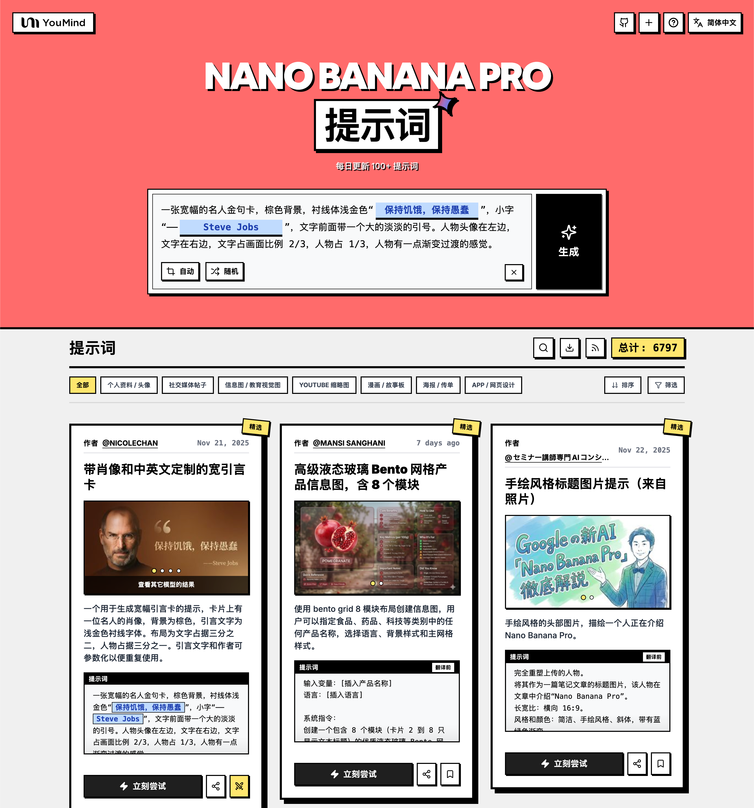

<a href="https://youmind.com/zh-TW/gpt-image-2-prompts">
  
</a>

> 💡 🎬 進階玩法：用 **Seedance 2** 把 GPT Image 2 生成的圖變成炸裂 AI 影片，2000+ 提示詞等你探索 👉 [awesome-seedance-2-prompts](https://github.com/YouMind-OpenLab/awesome-seedance-2-prompts)
# 🚀 GPT Image 2 提示詞大全

[](https://github.com/sindresorhus/awesome)
[](https://github.com/YouMind-OpenLab/awesome-gpt-image-2)
[](https://creativecommons.org/licenses/by/4.0/)
[](https://github.com/YouMind-OpenLab/awesome-gpt-image-2/actions)
[](docs/CONTRIBUTING.md)

> 🎨 OpenAI GPT Image 2 創意提示詞精選集合

> ⚠️ **版權聲明**：所有提示詞均收集自社區，僅供教育目的使用。如果您認為任何內容侵犯了您的權利，請[提交 issue](https://github.com/YouMind-OpenLab/awesome-gpt-image-2/issues/new?template=bug-report.yml)，我們將立即移除。

---

[](README.md) [](README_zh.md) [](README_zh-TW.md) [](README_ja-JP.md) [](README_ko-KR.md) [](README_th-TH.md) [](README_vi-VN.md) [](README_hi-IN.md) [](README_es-ES.md) [-Click%20to%20View-lightgrey)](README_es-419.md) [](README_de-DE.md) [](README_fr-FR.md) [](README_it-IT.md) [-Click%20to%20View-lightgrey)](README_pt-BR.md) [](README_pt-PT.md) [](README_tr-TR.md)

---

## 🌐 在網頁圖庫中查看

<div align="center">

[](https://youmind.com/zh-TW/gpt-image-2-prompts)

</div>

**[👉 瀏覽 YouMind GPT Image 2 提示詞圖庫](https://youmind.com/zh-TW/gpt-image-2-prompts)**

為什麼使用圖庫？

| Feature | GitHub README | youmind.com 圖庫 |
|---------|--------------|---------------------|
| 🎨 可視化佈局 | 線性列表 | 精美的瀑布流網格 |
| 🔍 搜索 | 僅 Ctrl+F | 全文搜索和篩選 |
| 🤖 AI 一鍵生圖 | - | AI 一鍵生圖 |
| 📱 移動端 | 基礎 | 完全響應式 |
| 🏷️ 分類 | - | 分類瀏覽 |


### 🏷️ 按分類瀏覽

- **使用情境**
  - [個人檔案 / 頭像](https://youmind.com/zh-TW/gpt-image-2-prompts?categories=profile-avatar)
  - [社群媒體貼文](https://youmind.com/zh-TW/gpt-image-2-prompts?categories=social-media-post)
  - [資訊圖表 / 教育視覺化內容](https://youmind.com/zh-TW/gpt-image-2-prompts?categories=infographic-edu-visual)
  - [YouTube 縮圖](https://youmind.com/zh-TW/gpt-image-2-prompts?categories=youtube-thumbnail)
  - [漫畫 / 分鏡腳本](https://youmind.com/zh-TW/gpt-image-2-prompts?categories=comic-storyboard)
  - [產品行銷](https://youmind.com/zh-TW/gpt-image-2-prompts?categories=product-marketing)
  - [電子商務主圖](https://youmind.com/zh-TW/gpt-image-2-prompts?categories=ecommerce-main-image)
  - [遊戲素材](https://youmind.com/zh-TW/gpt-image-2-prompts?categories=game-asset)
  - [海報／傳單](https://youmind.com/zh-TW/gpt-image-2-prompts?categories=poster-flyer)
  - [App / 網站設計](https://youmind.com/zh-TW/gpt-image-2-prompts?categories=app-web-design)
- **風格**
  - [攝影](https://youmind.com/zh-TW/gpt-image-2-prompts?categories=photography)
  - [電影感 / 電影劇照](https://youmind.com/zh-TW/gpt-image-2-prompts?categories=cinematic-film-still)
  - [動畫 / 漫畫](https://youmind.com/zh-TW/gpt-image-2-prompts?categories=anime-manga)
  - [插圖](https://youmind.com/zh-TW/gpt-image-2-prompts?categories=illustration)
  - [草圖 / 線稿](https://youmind.com/zh-TW/gpt-image-2-prompts?categories=sketch-line-art)
  - [漫畫 / 圖像小說](https://youmind.com/zh-TW/gpt-image-2-prompts?categories=comic-graphic-novel)
  - [3D 渲染](https://youmind.com/zh-TW/gpt-image-2-prompts?categories=3d-render)
  - [Q 版風格](https://youmind.com/zh-TW/gpt-image-2-prompts?categories=chibi-q-style)
  - [等距視角](https://youmind.com/zh-TW/gpt-image-2-prompts?categories=isometric)
  - [像素藝術](https://youmind.com/zh-TW/gpt-image-2-prompts?categories=pixel-art)
  - [油畫](https://youmind.com/zh-TW/gpt-image-2-prompts?categories=oil-painting)
  - [水彩](https://youmind.com/zh-TW/gpt-image-2-prompts?categories=watercolor)
  - [水墨 / 中式風格](https://youmind.com/zh-TW/gpt-image-2-prompts?categories=ink-chinese-style)
  - [復古 / 懷舊](https://youmind.com/zh-TW/gpt-image-2-prompts?categories=retro-vintage)
  - [賽博龐克 / 科幻](https://youmind.com/zh-TW/gpt-image-2-prompts?categories=cyberpunk-sci-fi)
  - [極簡主義](https://youmind.com/zh-TW/gpt-image-2-prompts?categories=minimalism)
- **主體**
  - [人像 / 自拍](https://youmind.com/zh-TW/gpt-image-2-prompts?categories=portrait-selfie)
  - [網紅 / 模特兒](https://youmind.com/zh-TW/gpt-image-2-prompts?categories=influencer-model)
  - [角色](https://youmind.com/zh-TW/gpt-image-2-prompts?categories=character)
  - [團體 / 情侶](https://youmind.com/zh-TW/gpt-image-2-prompts?categories=group-couple)
  - [產品](https://youmind.com/zh-TW/gpt-image-2-prompts?categories=product)
  - [食物 / 飲品](https://youmind.com/zh-TW/gpt-image-2-prompts?categories=food-drink)
  - [時尚單品](https://youmind.com/zh-TW/gpt-image-2-prompts?categories=fashion-item)
  - [動物 / 生物](https://youmind.com/zh-TW/gpt-image-2-prompts?categories=animal-creature)
  - [車輛](https://youmind.com/zh-TW/gpt-image-2-prompts?categories=vehicle)
  - [建築 / 室內設計](https://youmind.com/zh-TW/gpt-image-2-prompts?categories=architecture-interior)
  - [風景 / 大自然](https://youmind.com/zh-TW/gpt-image-2-prompts?categories=landscape-nature)
  - [城市景觀 / 街道](https://youmind.com/zh-TW/gpt-image-2-prompts?categories=cityscape-street)
  - [圖表](https://youmind.com/zh-TW/gpt-image-2-prompts?categories=diagram-chart)
  - [文字 / 字體排版](https://youmind.com/zh-TW/gpt-image-2-prompts?categories=text-typography)
  - [摘要 / 背景](https://youmind.com/zh-TW/gpt-image-2-prompts?categories=abstract-background)

---

## 📖 目錄

- [🌐 在網頁圖庫中查看](#-view-in-web-gallery)
- [🤔 什麼是 GPT Image 2？](#-what-is-gpt-image-2)
- [📊 統計數據](#-statistics)
- [🔥 精選提示詞](#-featured-prompts)
- [📋 所有提示詞](#-all-prompts)
- [🤝 如何貢獻](#-how-to-contribute)
- [📄 許可證](#-license)
- [🙏 致謝](#-acknowledgements)
- [⭐ Star 歷史](#-star-history)

---

## 🤔 什麼是 GPT Image 2？

**GPT Image 2**（代號 **"duct-tape"**）是 OpenAI 下一代圖像生成模型。社群測試回饋它在以下方面實現了質的飛躍：

- 🎯 **像素級文字渲染** — 中文、英文、日文均達到 native 水準，無錯字、無字形扭曲
- 🎨 **跨圖像素級一致性** — 同一角色、風格、IP 在多張圖間保持像素級一致
- ⚡ **商用級插畫質量** — 插畫風格輸出無需人工精修，即可直接用於商業場景
- 🌈 **真實藝術風格注入** — 不止是「模仿參考圖」，而是真正理解並再現藝術風格的靈魂
- 🔧 **故事板與產品系列** — 適合故事板、IP 形象、產品系列圖等需要多圖一致性的場景
- 📐 **多語言平面設計** — 社交卡片、Banner、海報一次生圖即可完成多語言文字排版

📚 **了解更多：** 查看社群測試 [報告要點](docs/FAQ.md)

### 🚀 Raycast 集成

部分提示詞支持使用 [Raycast Snippets](https://raycast.com/help/snippets) 語法的**動態參數**。尋找 🚀 Raycast Friendly 徽章！

**示例：**
```
A quote card with "{argument name="quote" default="Stay hungry, stay foolish"}"
by {argument name="author" default="Steve Jobs"}
```

在 Raycast 中使用時，您可以動態替換參數以快速迭代！

---

## 📊 統計數據

<div align="center">

| 指標 | 數量 |
|--------|-------|
| 📝 提示詞總數 | **14393** |
| ⭐ 精選 | **6** |
| 🔄 最後更新 | **2026年8月6日 星期四 凌晨1:24:37 [UTC]** |

</div>

---

## 🔥 精選提示詞

> ⭐ 由我們的團隊精心挑選，具有卓越的質量和創造力

### No. 1: VR 頭戴裝置爆炸圖海報


#### 📖 描述

生成一張高科技 VR 頭戴裝置爆炸圖，包含詳細的組件標註與宣傳文案。

#### 📝 提示詞

```
{
  "type": "產品爆炸圖海報",
  "subject": "VR 頭戴裝置",
  "style": "簡潔的高科技 3D 渲染，攝影棚燈光，發光細節",
  "background": "{argument name=\"background color\" default=\"柔和的紫藍色漸層\"}",
  "header": {
    "logo": "∞ {argument name=\"product name\" default=\"Meta Quest 3\"}",
    "subtitle": "{argument name=\"main catchphrase\" default=\"以全新的結構，定義全新的現實。\"}"
  },
  "layout": {
    "centerpiece": "垂直堆疊的 VR 頭戴裝置爆炸圖，展示 9 個不同的內部組件層：外殼、攝影機感測器、主機板與晶片、Pancake 透鏡、內部框架、電池組、側邊頭帶、頂部頭帶以及面部襯墊。",
    "callout_labels": {
      "count": 8,
      "left_side": [
        "Snapdragon® XR2 Gen 2\n以強大的處理效能，實現即時體驗。",
        "可調式 IPD 機構\n為廣大用戶提供舒適的配戴感。",
        "精密設計頭帶\n追求舒適與穩定性的工學設計。"
      ],
      "right_side": [
        "前飾板\n洗鍊的設計與最佳的重量平衡。",
        "追蹤攝影機\n實現高精度的位置追蹤與環境感知。",
        "Pancake 透鏡\n輕薄設計，提供寬廣視野與清晰影像。",
        "高效能電池\n支援長時間運作的最佳化電源設計。",
        "柔軟面部襯墊\n即使長時間配戴也能保持舒適。"
      ]
    },
    "footer": {
      "left_text_block": {
        "headline": "{argument name=\"bottom headline\" default=\"體驗，從結構進化。\"}",
        "body": "每一個零件都蘊含著支撐沉浸式體驗的尖端科技與匠心設計。Meta Quest 3 從內部結構開始，為您創造感受未來的體驗。"
      },
      "right_logo": "∞ Meta"
    }
  }
}
```

#### 🖼️ 生成圖片

##### Image 1

<div align="center">

</div>

#### 📌 詳情

- **作者:** [wory＠ホッピング中](https://x.com/wory37303852)
- **來源:** [Twitter Post](https://x.com/wory37303852/status/2045925660401795478#reversed-0)
- **發布時間:** 2026年4月19日
- **多語言:** en

**[👉 立即嘗試 →](https://youmind.com/zh-TW/gpt-image-2-prompts?id=13460)**

---

### No. 2: 手繪城市美食地圖


#### 📖 描述

生成一張手繪水彩風格的旅遊地圖，包含編號的在地特色美食、地標以及圖例。

#### 📝 提示詞

```
{
  "type": "手繪地圖資訊圖表",
  "style": "{argument name=\"art style\" default=\"復古羊皮紙上的水彩與墨水手繪插圖\"}",
  "title_section": {
    "text": "{argument name=\"city name\" default=\"成都\"} {argument name=\"map title\" default=\"吃貨暴走地圖\"}",
    "mascot": "戴著太陽眼鏡並比讚的卡通紅辣椒"
  },
  "border": "{argument name=\"border decoration\" default=\"綠葉與紅辣椒藤蔓\"}",
  "layout": {
    "background": "帶有黃色道路、藍色河流與綠色公園區域的質感米色羊皮紙",
    "sections": [
      {
        "title": "地標",
        "count": 6,
        "illustrations": ["傳統涼亭", "傳統寺院", "攀爬著熊貓的現代摩天大樓", "高聳電視塔", "傳統牌樓", "工業建築"],
        "labels": ["人民公園", "文殊院", "IFS", "339電視塔", "寬窄巷子", "東郊記憶"]
      },
      {
        "title": "美食景點",
        "count": 12,
        "illustrations": ["麻婆豆腐", "紅油水餃", "串串香", "三大炮", "蛋烘糕", "九宮格火鍋", "肥腸粉", "缽缽雞", "冒椒火辣", "蓋碗茶", "冰粉", "雙流老媽兔頭"],
        "labels": ["1 陳麻婆豆腐", "2 鍾水餃", "3 春熙路", "4 寬窄巷子·三大炮", "5 建設路·葉婆婆蛋烘糕", "6 玉林路·小龍坎火鍋", "7 香香巷·肥腸粉", "8 武侯祠大街·缽缽雞", "9 東郊記憶·冒椒火辣", "10 人民公園·鶴鳴茶社", "11 錦里古街·冰粉", "12 雙流老媽兔頭"]
      },
      {
        "title": "圖例",
        "position": "右下角",
        "count": 5,
        "items": ["紅點", "綠色房屋", "綠樹", "藍線", "黃色雙線"],
        "labels": ["美食地點", "地標景點", "公園綠地", "河流湖泊", "主要道路"]
      }
    ],
    "centerpiece": "坐著吃竹子的巨型熊貓",
    "bottom_right_extras": ["帶有 N、S、E、W 的復古羅盤玫瑰", "免責聲明文字『溫馨提示：吃辣需謹慎，腸胃要保護~』並附帶一個紅辣椒圖示"]
  }
}
```

#### 🖼️ 生成圖片

##### Image 1

<div align="center">

</div>

#### 📌 詳情

- **作者:** [皮皮特](https://x.com/mm_zzm44854)
- **來源:** [Twitter Post](https://x.com/mm_zzm44854/status/2045861258520568230#reversed-1)
- **發布時間:** 2026年4月19日
- **多語言:** en

**[👉 立即嘗試 →](https://youmind.com/zh-TW/gpt-image-2-prompts?id=13515)**

---

### No. 3: 採用混合風格的桃太郎說明用 Slides


#### 📖 描述

這是一個結合了「いらすとや (Irasutoya)」插圖簡約溫暖的美學，以及日本政府簡報高資訊密度特徵的提示詞。

#### 📝 提示詞

```
請為 {argument name="theme" default="桃太郎"} 製作一張說明用 Slides ({argument name="format" default="ポンチ絵 (ponchi-e) 圖表"})，將「いらすとや (Irasutoya)」的溫和氛圍與「霞關風格 (Kasumigaseki slides)」那種壓倒性的資訊密度融合在一起。
```

#### 🖼️ 生成圖片

##### Image 1

<div align="center">

</div>

##### Image 2

<div align="center">

</div>

#### 📌 詳情

- **作者:** [やまもん](https://x.com/yammamon)
- **來源:** [Twitter Post](https://x.com/yammamon/status/2045778624092254603)
- **發布時間:** 2026年4月19日
- **多語言:** ja

**[👉 立即嘗試 →](https://youmind.com/zh-TW/gpt-image-2-prompts?id=13983)**

---

### No. 4: 電子商務直播 UI 模型


#### 📖 描述

生成逼真的社群媒體直播介面並疊加在肖像上，包含可自訂的聊天訊息、禮物彈出視窗以及商品購買卡片。

#### 📝 提示詞

```
{
  "type": "直播 UI 模型",
  "subject": {
    "description": "{argument name=\"host name\" default=\"Elon Musk\"} 的肖像，微笑，穿著印有白色技術示意圖的黑色 T 恤",
    "background": "左側顯示帶有 '{argument name=\"left background logo\" default=\"SPACEX\"}' 文字的螢幕，右側顯示紅色的 '{argument name=\"right background logo\" default=\"Tesla T logo\"}' 和一輛深色汽車"
  },
  "ui_overlay": {
    "top_header": {
      "host_info": "頭像，名稱 '{argument name=\"host name\" default=\"Elon Musk\"}'，副標題 '55.6 萬本場點讚'，紅色 '關注' 按鈕",
      "rank_badge": "帶有 '全站第 1 名' 的金幣圖示",
      "viewer_stats": "3 個頂級觀眾頭像，分別顯示 '12.3w'、'8.6w'、'5.7w'，總計 '68.7 萬'，'X' 關閉按鈕",
      "right_links": "'更多直播 >'，'禮物展館 0/24' 帶有藍色 '經典' 標籤"
    },
    "mid_left_gifts": {
      "count": 2,
      "items": [
        "頭像 '科技愛好者'，'送小心心'，愛心圖示 x 1314",
        "頭像 '星辰大海'，'送火箭'，火箭圖示 x 666"
      ]
    },
    "bottom_left_chat": {
      "system_message": "等級 37 徽章 '宇宙漫遊者 加入了直播間'",
      "message_count": 7,
      "messages": [
        "小火箭: 馬斯克！未來可期！🚀",
        "future: 特斯拉 Model 2 什麼時候出？",
        "星空夢想家: SpaceX 今年能上火星嗎？",
        "AI 探索者: Neuralink 進展如何？",
        "帥氣的網友: 馬總好！",
        "Mars: 第一次來你的直播，超激動！",
        "用戶 123: 講講 AI 吧，會取代人類嗎？"
      ]
    },
    "bottom_right_product_card": {
      "hot_tag": "橘色 '熱賣 x 1888'",
      "image": "Tesla Cybertruck",
      "title": "{argument name=\"product name\" default=\"特斯拉 Cybertruck 電動皮卡\"}",
      "price": "{argument name=\"product price\" default=\"¥ 1,618,000\"}",
      "button": "紅色 '搶' 按鈕",
      "floating_animation": "半透明愛心沿著右側邊緣向上飄浮"
    },
    "bottom_bar": {
      "input_field": "'說點什麼...'",
      "icons": ["笑臉", "三個點", "購物車", "禮物盒", "分享"]
    }
  }
}
```

#### 🖼️ 生成圖片

##### Image 1

<div align="center">

</div>

#### 📌 詳情

- **作者:** [神经病不想好转](https://x.com/sjbbxhz)
- **來源:** [Twitter Post](https://x.com/sjbbxhz/status/2045684734714380687#reversed-0)
- **發布時間:** 2026年4月19日
- **多語言:** en

**[👉 立即嘗試 →](https://youmind.com/zh-TW/gpt-image-2-prompts?id=14036)**

---

### No. 5: 動漫武術對決


#### 📖 描述

生成一個動態的動漫風格動作場景，描繪兩名角色在傳統道場中伴隨元素光環進行戰鬥。

#### 📝 提示詞

```
一張極具動態感的動漫插圖，描繪兩名少女在傳統木造道場內進行激烈的武術對決。在前景中，一名留著 {argument name="character 1 hair" default="黑色高包頭配紅色髮帶"} 的少女擺出強而有力的低位武術架勢，奮力向前揮拳。她身穿 {argument name="character 1 outfit" default="白色中式上衣配紅色流蘇與寬鬆紅褲"}，強烈的紅色能量斬擊環繞著她揮動的四肢。在右側半空中，一名留著 {argument name="character 2 hair" default="淺紫色雙包頭"} 的少女優雅地躍起，自信地微笑著，身穿 {argument name="character 2 outfit" default="深綠色刺繡金邊洋裝與黑色緊身褲"}，伴隨著如水流般掃過的藍色能量軌跡。背景為古樸的木造寺廟內部，上方懸掛著一塊顯眼的招牌，寫著「{argument name="sign text" default="武術会"}」。場景充滿了爆炸性的動作張力、飛揚的塵土、碎裂的木質地板、閃耀的彩色粒子特效，以及將角色與細緻背景完美區隔的戲劇性低角度光影。
```

#### 🖼️ 生成圖片

##### Image 1

<div align="center">

</div>

#### 📌 詳情

- **作者:** [たねもみ 2.0 / Tanemomi Ver2.0](https://x.com/Tanemomi_Ver2)
- **來源:** [Twitter Post](https://x.com/Tanemomi_Ver2/status/2046063806846214265#reversed-0)
- **發布時間:** 2026年4月20日
- **多語言:** en

**[👉 立即嘗試 →](https://youmind.com/zh-TW/gpt-image-2-prompts?id=13467)**

---

### No. 6: 3D 石階演化資訊圖表


#### 📖 描述

將平面的演化時間軸轉換為逼真的 3D 石階資訊圖表，包含細緻的生物渲染圖與結構化的側邊欄。

#### 📝 提示詞

```
{
  "type": "演化時間軸資訊圖表",
  "instruction": "以 REFERENCE_0 作為結構基礎，將平面向量設計轉換為高度逼真的 3D 資訊圖表。將平滑的坡道替換為層次分明的石階，並將所有生物升級為照片級的 3D 模型。",
  "style": {
    "background": "{argument name=\"background style\" default=\"復古紋理羊皮紙\"}",
    "staircase": "{argument name=\"staircase material\" default=\"逼真的紋理石塊\"}",
    "subjects": "{argument name=\"organism style\" default=\"高度細緻的照片級 3D 渲染圖\"}"
  },
  "layout": {
    "main_title": "{argument name=\"main title\" default=\"人類演化\"}",
    "sections": [
      {
        "position": "左側邊欄",
        "count": 8,
        "labels": ["L0: 單細胞生命", "L1: 多細胞生物", "L2: 動物界", "L3: 脊索動物", "L4: 上陸革命", "L5: 哺乳綱", "L6: 人科演化", "L7: 智人紀元"]
      },
      {
        "position": "右上角",
        "title": "獲得的功能 / 失去的功能",
        "description": "帶有加號與減號圖示的圖例"
      },
      {
        "position": "底部中央",
        "title": "演化關鍵里程碑",
        "count": 6,
        "description": "包含 6 個展示猿類到人類演化剪影圖的時間軸"
      }
    ],
    "centerpiece": {
      "description": "蜿蜒的石階，共有 25 個編號階梯，展示特定生物。",
      "count": 25,
      "notable_elements": [
        "第 07 階：水母",
        "第 09 階：菊石",
        "第 10 階：三葉蟲",
        "第 24 階：直立行走的人類",
        "第 25 階：{argument name=\"future evolution concept\" default=\"帶有問號的發光宇宙剪影\"}"
      ]
    }
  }
}
```

#### 🖼️ 生成圖片

##### Image 1

<div align="center">

</div>

#### 📌 詳情

- **作者:** [知识猫图解](https://x.com/GeekCatX)
- **來源:** [Twitter Post](https://x.com/GeekCatX/status/2045792240044511277#reversed-1)
- **發布時間:** 2026年4月19日
- **多語言:** en

**[👉 立即嘗試 →](https://youmind.com/zh-TW/gpt-image-2-prompts?id=13491)**

---

## 📋 所有提示詞

> 📝 按發布日期排序（最新優先）

### No. 1: 個人檔案 / 頭像 - 精靈 Cosplayer 鏡面自拍


#### 📖 描述

生成一張逼真的室內奇幻精靈 Cosplay 鏡面自拍，具有強烈的前景足部透視感與柔和的自然光。

#### 📝 提示詞

```
創作一張逼真的直式智慧型手機鏡面自拍，畫面中是一位成年的奇幻精靈 Cosplayer，坐在灰色地毯上的柔軟白布上，背景為簡約的米色房間。主角為 {argument name="character name" default="一位精靈公主 Cosplayer"}，身穿精緻的白色垂墜感奇幻服裝，搭配金色鏈條細節、纖細的手臂飾品、金色腿環以及淡藍色花朵配件。她擁有 {argument name="hair color" default="長銀灰色"} 的雙馬尾髮型、尖尖的精靈耳朵，以及藍白相間的花冠。讓她呈現坐姿，一隻膝蓋彎曲靠近身體，另一條腿向鏡頭方向延伸，在左下角前景創造出強烈的前景透視感，露出大面積的赤腳腳底與腳趾；另一隻腳則在底部邊緣隱約可見。她手持淺灰色智慧型手機遮住臉部，另一隻手輕觸耳邊的頭髮。運用柔和的自然窗光、柔和的中性色調，呈現淺景深的休閒室內寫實感，畫面最左側可見鏡子邊緣，後牆有踢腳板，整體帶有隨性的 Cosplay 攝影美學。構圖保持親密但不露骨，呈現真實的皮膚紋理、布料褶皺與地毯細節，且不添加任何文字或浮水印。
```

#### 🖼️ 生成圖片

##### Image 1

<div align="center">

</div>

#### 📌 詳情

- **作者:** [underwood](https://x.com/underwoodxie96)
- **來源:** [Twitter Post](https://x.com/underwoodxie96/status/2083457147283861843#reversed-0)
- **發布時間:** 2026年8月1日
- **多語言:** en

**[👉 立即嘗試 →](https://youmind.com/zh-TW/gpt-image-2-prompts?id=30529)**

---

### No. 2: 個人檔案 / 頭像 - 成熟男士精緻水彩肖像


#### 📖 描述

這是一個精緻的編輯風格水彩肖像提示詞，描繪了一位具有寫實面部細節與優雅水彩渲染的成熟專業男士。

#### 📝 提示詞

```
一幅精緻的水彩風格肖像，主角為 {argument name="subject" default="一位自信、成熟的男士，留著俐落的灰白短髮與修剪整齊的鬍鬚"}，並配戴 {argument name="accessories" default="黑色長方形眼鏡"}。他身穿炭灰色西裝外套搭配黑色襯衫，神情冷靜且專業，若有所思地望向遠方。這幅藝術作品將寫實的面部細節與溫暖的米色、灰色及深褐色優雅水彩渲染相結合，呈現於乾淨的米白色背景上，營造出精緻且現代的編輯美學。請使用上傳的參考圖片進行面部特徵、表情對齊以及眼鏡的細節調整。長寬比為 10:21。
```

#### 🖼️ 生成圖片

##### Image 1

<div align="center">

</div>

#### 📌 詳情

- **作者:** [Karlos](https://x.com/de_mon010)
- **來源:** [Twitter Post](https://x.com/de_mon010/status/2083452368050393371)
- **發布時間:** 2026年8月1日
- **多語言:** en

**[👉 立即嘗試 →](https://youmind.com/zh-TW/gpt-image-2-prompts?id=30444)**

---

### No. 3: 個人檔案 / 頭像 - 芭蕾舞室伸展人像


#### 📖 描述

生成一張逼真的直式芭蕾舞室人像，展示一位舞者在把桿上進行高難度腿部伸展的優雅姿態。

#### 📝 提示詞

```
創作一張逼真的直式人像攝影，主角為 {argument name="subject" default="一位年輕的東亞芭蕾舞者"}，場景設定在明亮的芭蕾舞室中練習。畫面呈現全身照，她正展現優雅的站立針式伸展：一隻腳以腳尖或半腳尖站立於灰色的舞室地板上，另一條腿向上垂直伸展至頭部旁，一隻手握住舉起的芭蕾舞鞋，另一隻手輕放在右側的木製芭蕾把桿上。她穿著 {argument name="leotard color" default="海軍藍細肩帶緊身衣"}、淺粉色緊身褲和淺粉色芭蕾舞鞋。她的頭髮整齊地梳成俐落的黑色芭蕾舞髮髻，表情冷靜且專注，視線微微看向右側而非鏡頭。舞室內有柔和的自然光、淺米色牆面、光亮的灰色地板，背景有水平延伸的木製把桿，以及一面模糊的牆面標誌，上面寫著 {argument name="studio wall text" default="Madame YUKO Ballet Studio"} 並附有一個小型的芭蕾舞者剪影。請使用淺景深、乾淨的專業攝影風格、柔和的膚色、細膩的高光、逼真的解剖結構、優雅的姿勢以及寧靜的排練氛圍。將舞者置於 9:16 直式構圖的中央，畫面中不應包含其他人、浮水印或戲劇性的舞台燈光。
```

#### 🖼️ 生成圖片

##### Image 1

<div align="center">

</div>

##### Image 2

<div align="center">

</div>

##### Image 3

<div align="center">

</div>

##### Image 4

<div align="center">

</div>

#### 📌 詳情

- **作者:** [バースバイブ遊](https://x.com/m19940000)
- **來源:** [Twitter Post](https://x.com/m19940000/status/2083447969941180791#reversed-0)
- **發布時間:** 2026年8月1日
- **多語言:** en

**[👉 立即嘗試 →](https://youmind.com/zh-TW/gpt-image-2-prompts?id=30522)**

---

### No. 4: 個人檔案 / 頭像 - 寫實韓系鏡面自拍


#### 📖 描述

為社群媒體風格影像生成一張精緻的直式浴室鏡面自拍肖像，主角為時尚的年輕東亞女性。

#### 📝 提示詞

```
建立一張高度寫實的直式鏡面自拍肖像，主角為 {argument name="character description" default="一位 20 多歲、擁有精緻韓系東亞五官的女性，膚色白皙自然，面部結構立體柔和，深褐色大眼，妝容為淡粉色眼影、自然的臥蠶、纖長睫毛、柔和的玫瑰藕粉色唇彩，帶有淡淡腮紅，且具備清晰寫實的肌膚紋理"}。她留著 {argument name="hair style" default="蓬鬆的長黑波浪捲髮，中分並帶有空氣感八字瀏海，些許髮絲自然垂落在肩上"}。她站在室內小型磁磚浴室或更衣室的鏡子前，眼神略微向下並看向側邊，表情冷靜、害羞且上鏡，手持一台白色/銀色三鏡頭智慧型手機進行自拍。構圖為腰部以上，直式 4:5 比例，呈現親密的社群媒體美學；手機遮住她右臉的一部分，手部與手指清晰可見，指甲修剪整齊並塗有光澤感的棕色指甲油，戴著精緻的戒指。穿搭：合身的 {argument name="top color and style" default="純白色短袖圓領 T 恤"}，紮入高腰白色下裝，可見鈕扣與皮帶環。配件包含 4 個清晰可見的單品：一條帶有細小墜飾的細項鍊、一枚金戒指、一條金屬鍊條手鍊，以及右側可見的金屬扣環黑色肩背包背帶。背景：鏡中反射出米色與奶油色的方形馬賽克牆磚，左側邊緣有溫潤的木質邊框，右上角有鍍鉻毛巾桿，鏡面上方有淡淡的手寫文字 {argument name="mirror quote" default="Be your own kind of beautiful"} 以及一顆小愛心。燈光為柔和的室內暖光，肌膚與髮絲帶有細膩光澤，呈現寫實的智慧型手機拍攝畫質，具備自然的淺景深，無過度修圖，無額外人物，無浮水印，無變形的手部或手機。
```

#### 🖼️ 生成圖片

##### Image 1

<div align="center">

</div>

##### Image 2

<div align="center">

</div>

##### Image 3

<div align="center">

</div>

##### Image 4

<div align="center">

</div>

#### 📌 詳情

- **作者:** [serein ｜买美股上币安](https://x.com/you1873118)
- **來源:** [Twitter Post](https://x.com/you1873118/status/2083427186766434319#reversed-0)
- **發布時間:** 2026年8月1日
- **多語言:** en

**[👉 立即嘗試 →](https://youmind.com/zh-TW/gpt-image-2-prompts?id=30512)**

---

### No. 5: 個人檔案 / 頭像 - 粉彩動漫女僕學姊


#### 📖 描述

生成一張柔和的直式動漫插圖，描繪一位戴著眼鏡、粉色頭髮的女僕角色，並配有可愛的粉彩邊框。

#### 📝 提示詞

```
創作一張 9:16 直式柔和粉彩動漫插圖，主角為 {argument name="character name" default="學姊醬"}，一位成年年輕女性，正坐在蓬鬆的白色坐墊上，姿勢害羞且微微前傾，雙膝分開但姿態端莊，雙手交疊放在身前的坐墊上。她留著 {argument name="hair color" default="淡粉色"} 短鮑伯頭，兩側有修飾臉型的長瀏海，別著一個小巧的側邊髮夾，擁有一雙灰色帶紫的大眼睛、細圓框眼鏡，表情帶有剛睡醒般的慵懶與些許羞澀。為她穿上精緻的黑白荷葉邊女僕裝：畫面中需清晰呈現 7 個主要服裝部件，包括白色荷葉邊女僕頭飾、帶有白色荷葉邊裝飾的黑色泡泡袖連身裙、白色圍裙、胸前的小灰蝴蝶結、層疊的荷葉邊裙擺、白色過膝襪配吊帶，以及白色腕飾。採用細膩的線條、平滑的賽璐珞陰影、柔和的腮紅色彩，呈現高品質的日系動漫風格，營造溫柔浪漫的氛圍。構圖採置中處理，呈現從頭部到大腿/腳部的全身像（底部略微裁切），強調荷葉邊與蕾絲細節，無任何露骨內容。背景為極淡的粉紅色，配有細緻的粉色矩形裝飾邊框，並包含 8 個簡單裝飾：4 個角落的花紋捲飾、左上角 1 個虛線愛心、右下角 1 個小愛心，以及右側 2 個閃亮星星。整體風格乾淨通透，光影柔和，陰影細膩，無文字，無浮水印，色調維持 {argument name="palette" default="粉色、白色、黑色與柔灰色"}。
```

#### 🖼️ 生成圖片

##### Image 1

<div align="center">

</div>

#### 📌 詳情

- **作者:** [りぉみ](https://x.com/riomimimimi)
- **來源:** [Twitter Post](https://x.com/riomimimimi/status/2083412462385443219#reversed-0)
- **發布時間:** 2026年8月1日
- **多語言:** en

**[👉 立即嘗試 →](https://youmind.com/zh-TW/gpt-image-2-prompts?id=30519)**

---

### No. 6: 個人檔案 / 頭像 - RAW 智慧型手機生活感人像


#### 📖 描述

這是一組專為模擬年輕女性在城市街道上，隨性且未經修飾的智慧型手機攝影風格所設計的提示詞，強調照片的真實感與自然瑕疵。

#### 📝 提示詞

```
一張 RAW 格式、超逼真的智慧型手機攝影照片，主角是 {argument name="subject" default="一位美麗的年輕東亞女性"}，正隨性地站在 {argument name="location" default="一條安靜且綠樹成蔭的城市街道"} 上。她擁有白皙如瓷的肌膚、一雙靈動的大棕色眼睛、小巧筆挺的鼻子、自然柔嫩的粉色雙唇，以及精緻年輕的五官。她留著中長度的栗棕色頭髮，紮成低側馬尾，柔軟的八字瀏海輕柔地修飾著臉龐。她對著鏡頭做出 {argument name="expression" default="微微鼓起臉頰的表情"}，眼神俏皮而自然。她穿著一件合身的淺米色圓領短袖 T 恤，自然地勾勒出輪廓，戴著一條精緻的銀色項鍊（綴有小星星吊墜）和一條細金手鍊，肩上背著一個帶有金屬鍊條的小型黑色皮革肩背包。她的上臂隱約可見一個極簡線條風格的刺青。背景呈現出寧靜的城市街道，有茂密的綠樹、優雅的住宅建築、安靜的人行道、停放的機車，以及遠處行走的行人，營造出真實的日常城市氛圍。由朋友以現代智慧型手機從站立視角隨手拍攝。自然午後日光，柔和的漫射光，真實的皮膚紋理，細微的智慧型手機 HDR 處理，輕微的感光元件雜訊，自動白平衡，真實的曝光，輕微的 26mm 等效手機鏡頭透視變形，隨性構圖，略顯不完美的取景，無專業燈光，無美顏濾鏡，無 AI 生成感，日常生活攝影，超寫實，RAW 智慧型手機相機畫質，8K。
```

#### 🖼️ 生成圖片

##### Image 1

<div align="center">

</div>

##### Image 2

<div align="center">

</div>

#### 📌 詳情

- **作者:** [𝗦𝗮𝗻𝗶𝗮](https://x.com/saniaspeaks_)
- **來源:** [Twitter Post](https://x.com/saniaspeaks_/status/2083403260719722975)
- **發布時間:** 2026年8月1日
- **多語言:** en

**[👉 立即嘗試 →](https://youmind.com/zh-TW/gpt-image-2-prompts?id=30451)**

---

### No. 7: 個人檔案 / 頭像 - 熱帶海灣比基尼人像與白花


#### 📖 描述

這是一個明亮開放的寫實人像提示詞，描繪了一位身穿象牙白比基尼的女性，站在擁有清澈翡翠色海水的熱帶海灣中。

#### 📝 提示詞

```
主題：邁向翡翠海灣

主體：
一張明亮開放的寫實海灘人像，主角為一名 20 多歲的女性，身穿 {argument name="outfit" default="象牙白比基尼"}，站在寧靜熱帶海灣的淺灘中，雙臂向兩側伸展，一條腿向後彎曲。場景包含極度透明的翡翠藍海水、白色沙灘，以及右側背景中逐漸靠近的懸崖峭壁。

角色與表情：
面向前方，{argument name="expression" default="溫柔微笑"} 並注視著鏡頭。小巧的鵝蛋臉、圓潤的臉頰、杏仁狀的雙眼，以及光澤感的珊瑚粉色嘴唇。透明感的日系妝容，搭配淡粉色腮紅與自然的臥蠶。棕色長髮及胸，留著薄瀏海，髮尾帶有柔和的波浪捲。一朵 {argument name="accessory" default="小白花"} 裝飾在她的髮側。

姿勢與服裝：
象牙白三角比基尼，配有細肩帶、小荷葉邊、中央蝴蝶結與側邊綁帶。布料具有精緻的褶皺與輕微光澤。她將雙臂向斜上方伸展，挺起胸膛，軀幹微微傾斜。單腳站在淺水中，另一隻膝蓋在身後彎曲，彷彿正準備跳躍。

背景與光線：
透明的淺灘從前景延伸至中景，水面有細微的漣漪與倒影。右側為覆蓋著植被的深灰色岩壁，左側為帶有小型礁石的地平線。藍天白雲。來自左上方的強烈夏季陽光，在皮膚、水面與髮絲上形成高光。

構圖與攝影：
垂直 3:4 畫幅。人物位於構圖中央偏右，呈現全身構圖。伸展的雙臂延伸至畫面邊緣，上方藍天留有空間。自然的透視感，焦點集中在臉部與軀幹，具備中等景深。

質感與風格：
高解析度寫實度假攝影。細膩呈現皮膚、水珠、沙粒與岩石的紋理。以藍色與綠松石色為基調的清爽夏季色彩，與象牙白及膚色和諧融合。自然呈現，無過度濾鏡。

負面提示詞：
手臂或手指變形；腿部關節或重心不自然；比基尼綁帶或荷葉邊缺失。
```

#### 🖼️ 生成圖片

##### Image 1

<div align="center">

</div>

#### 📌 詳情

- **作者:** [Prompt アトリエ｜AI画像プロンプト](https://x.com/CyberTotal2026)
- **來源:** [Twitter Post](https://x.com/CyberTotal2026/status/2083391015378186710)
- **發布時間:** 2026年8月1日
- **多語言:** ja

**[👉 立即嘗試 →](https://youmind.com/zh-TW/gpt-image-2-prompts?id=30496)**

---

### No. 8: 個人檔案 / 頭像 - 沙龍清新美妝人像


#### 📖 描述

這是一份專業級的攝影提示詞，用於生成髮廊內女性人像，重點在於光影、髮絲質感與真實的皮膚細節。

#### 📝 提示詞

```
9:16 比例，一張真實的美妝人像，拍攝地點為 {argument name="location" default="髮廊窗邊"}。
僅描繪一位虛構的成年東亞女性，非真實人物。
外觀設定為 {argument name="age" default="20 多歲"}。
將女性臉部中心置於螢幕寬度約 50% 處，包含頭髮、肩膀與胸部的上半身視覺中心亦置於約 50% 處，以營造自然的居中構圖。
頭頂上方保留約 2-3% 的邊距，臉部佔據從頂部起約 18-47% 的空間，長髮與肩膀則包含在從中心到下邊緣的範圍內。
請勿不自然地裁切額頭、下巴、主要髮絲、肩膀或胸前的針織上衣。
在下邊緣處，於頭髮與針織衫自然延伸的位置裁切，確保背景比人物更不顯眼。

女性端坐在沙龍椅上，上半身朝向前方。
臉部幾乎正對鏡頭，僅向螢幕右側微微轉動。
表情沉穩，深褐色雙眼直視鏡頭，雙唇微張。
笑容不宜過多，傳達出剛完成沙龍護理後的滿足感與內斂自信。
保持頸部修長、肩膀放鬆，姿勢自然優雅。

臉型為自然的鵝蛋臉。
雙眼高度與大小一致，瞳孔內帶有細長的窗戶反光。
眉毛為與髮色相襯的柔和深褐色。
眼周呈現淺棕色與玫瑰米色調，睫毛纖細，帶有細緻的眼線。
臉頰帶有淡淡的粉色紅暈，雙唇呈現透明的玫瑰粉色。
皮膚明亮健康，保留臉頰、鼻頭與額頭的細緻毛孔與自然的膚色變化。
請勿過度強調鼻樑或顴骨，並避免過於均勻的陶瓷肌質感。

頭髮為長度及胸的 {argument name="hair color" default="深褐色"} 長髮。
整體加入鬆散的 S 型波浪捲，自然地垂落在雙肩上。
瀏海為輕薄的空氣瀏海，可隱約看見部分眉毛與額頭。
從臉頰到下巴處修剪出細緻的層次，髮尾呈現不規則的內扣與外翹。
髮絲表面捕捉窗戶光線，帶有細膩的暖色高光，內部則維持深褐色的陰影。
請勿重複出現相同形狀的髮束，保留少量自然飛翹的髮絲。

服裝為素色 {argument name="clothing color" default="乾燥玫瑰色"} 或藕粉色的薄針織上衣。
領口為不過寬的船型圓領。
呈現真實的細針織紋理，鎖骨周圍有自然的皺褶，並在肩膀與胸前形成柔和的垂墜感。
領口處佩戴一條細金項鍊。
無任何標誌、文字、圖案、過度裝飾或透明感。

前景為女性的頭髮、臉部與針織衫胸部區域。
中景為沙龍椅與窗框。
背景左側放置一面長圓角矩形鏡子、一盞小型暖光燈以及模糊的棕色沙龍椅。
背景右側柔焦處理大窗戶、淺灰色混凝土柱、窗外樹枝與藍灰色城市景觀。
鏡中倒影請勿出現不自然的人影、臉孔、手部、相機或文字。
透過椅子、鏡子與燈光細膩地傳達沙龍氛圍。

相機高度約與女性視線齊平。
從正前方近距離拍攝，垂直構圖包含從上胸部到頭頂的範圍。
焦距感約為 55-70mm。
避免廣角造成的臉部拉伸、鼻子誇張化或肩膀變形。
清晰對焦於雙眼、睫毛、雙唇與臉周髮束，並運用淺景深將胸部、背景鏡子、椅子與窗外景物優雅地虛化。

主光源為來自右側大窗戶的柔和午後自然光。
光線照亮瀏海右側、額頭、臉頰、鼻樑、雙唇與髮絲表面，在左側頭髮與臉頰留下淡淡的暖色陰影。
背景左側的沙龍燈光作為微弱的暖色補光。
避免生硬的陰影、過曝的高光或過強的輪廓光。
色溫自然融合窗戶的中性光與室內淡淡的暖意。
整體色調為藕粉色、深褐色、象牙白、淺灰色與窗外低飽和度的藍色。

真實描繪皮膚毛孔、雙唇的自然水潤感、眼睛的通透感、細緻睫毛、瀏海的單根髮絲、波浪捲的流動感、針織紋理以及鏡面與窗戶的反光。
品質乾淨精緻，適用於商業髮廊、護髮、化妝品、美容或時尚視覺素材。
無文字、標誌、品牌名稱、簽名或浮水印。
避免多餘的人物、多餘的臉孔、錯誤的鏡中倒影、多餘的手臂或手指、不對稱的眼睛、扭曲的嘴部、融合的頭髮、重複的髮束、融化的針織衫、損壞的椅子、玩偶般的皮膚、過度美化、過強的 HDR 或插畫風格。
```

#### 🖼️ 生成圖片

##### Image 1

<div align="center">

</div>

#### 📌 詳情

- **作者:** [AiPhotoDesigner](https://x.com/AiPhotoDesigner)
- **來源:** [Twitter Post](https://x.com/AiPhotoDesigner/status/2083338425130737915)
- **發布時間:** 2026年7月31日
- **多語言:** ja

**[👉 立即嘗試 →](https://youmind.com/zh-TW/gpt-image-2-prompts?id=30475)**

---

### No. 9: 個人檔案 / 頭像 - 皇家藍夏日海洋美妝攝影


#### 📖 描述

一張充滿活力的海邊美妝人像，展現了她緞面連身裙與太陽眼鏡所呈現的深邃皇家藍色調。此攝影作品以大海與天空為背景，捕捉了清新的夏日氛圍，並透過清晰的對焦與自然陽光增強畫面質感。

#### 📝 提示詞

```
主題：映照群青色的雙眸

主要拍攝對象：一張寫實的直式美妝人像，主角為一名 20 多歲的女性，手部動作為 {argument name="sunglasses color" default="藍色圓形太陽眼鏡"}，背景為仲夏海洋。隨風飄動的短髮、鮮豔的 {argument name="dress color" default="皇家藍"} 緞面連身裙、藍色飾品以及波光粼粼的海面是核心元素。

人物/表情：臉部幾乎正對鏡頭，下巴微抬，冷靜地注視著鏡頭。小巧的鵝蛋臉，下巴線條流暢，珊瑚粉色雙唇。精緻自然的日系妝容。明亮的灰米色 {argument name="hairstyle" default="短鮑伯頭"}，輕盈的瀏海在微風中飄動。透過藍色鏡片可隱約看見雙眼。

服裝/姿勢：閃亮的皇家藍緞面連身裙，細肩帶與包裹式 V 領設計，帶有柔軟的垂墜感。右手抬起，拇指與食指輕觸太陽眼鏡的外框。佩戴鑲有藍色小寶石的金色耳環與細項鍊。

背景/光線：背景為鮮豔的藍色海洋，地平線上可見模糊的島嶼剪影。白色海鷗在淺景深中飛翔。左上方的強烈夏日陽光在髮絲與肌膚上形成高光。水面上有閃爍的波光。

構圖/相機：直式 3:4 比例。從頭部到胸部的特寫半身照。主角位於畫面中央。相機位置略低。海洋與海鷗呈現高度模糊效果。

質感/風格：高畫質寫實時尚攝影。自然的肌膚紋理、細緻的髮絲、透明的藍色鏡片以及平滑的緞面光澤。明亮清晰的夏日自然光。

負面提示：請勿將圓形藍色鏡片更改為黑色或方形；保持手部接觸太陽眼鏡的動作；請勿將髮型更改為長髮。
```

#### 🖼️ 生成圖片

##### Image 1

<div align="center">

</div>

#### 📌 詳情

- **作者:** [Prompt アトリエ｜AI画像プロンプト](https://x.com/CyberTotal2026)
- **來源:** [Twitter Post](https://x.com/CyberTotal2026/status/2083337545199632641)
- **發布時間:** 2026年7月31日
- **多語言:** ja

**[👉 立即嘗試 →](https://youmind.com/zh-TW/gpt-image-2-prompts?id=30491)**

---

### No. 10: 個人檔案 / 頭像 - 明亮臥室人像


#### 📖 描述

一張寫實的臥室編輯風格人像，拍攝一位身穿白色緞面裙的年輕女性，背景為陽光灑落的窗邊，適用於時尚或生活風格的視覺生成。

#### 📝 提示詞

```
創作一張寫實的直式人像照片，主角是一位年輕的東亞女性，留著 {argument name="hair color" default="深棕色"} 的短鮑伯頭，戴著透明的大框眼鏡，化著柔和的自然妝容，眼神平靜地直視鏡頭。她坐在臥室床邊的米色椅子上，身體微微前傾，雙臂自然垂在膝蓋之間，身穿一件 {argument name="outfit" default="白色緞面細肩帶連身裙"}，領口為低 V 領設計，並搭配精緻的首飾：確切為 2 件可見飾品，包含一條細項鍊和一對小巧的垂墜耳環。房間左側有一扇大窗戶，掛著白色薄紗窗簾，窗外可見藍天白雲與綠色樹梢；右側為白色寢具，背景則是高大的白色嵌入式書架，架上擺滿了直立的書籍及少量裝飾品。運用窗戶透入的柔和日光，呈現細膩陰影、真實的皮膚紋理與淺景深，展現高端編輯攝影質感，營造親密的室內生活氛圍。採用 3:4 直式構圖，主體從大腿以上置中，臉部與眼鏡清晰對焦，色彩自然，無文字，無浮水印。
```

#### 🖼️ 生成圖片

##### Image 1

<div align="center">

</div>

#### 📌 詳情

- **作者:** [Nailai7981](https://x.com/VIBEQUIRKLABS)
- **來源:** [Twitter Post](https://x.com/VIBEQUIRKLABS/status/2083329732184350903#reversed-0)
- **發布時間:** 2026年7月31日
- **多語言:** en

**[👉 立即嘗試 →](https://youmind.com/zh-TW/gpt-image-2-prompts?id=30526)**

---

### No. 11: 個人檔案 / 頭像 - 火車旅行人像 9:16 電影感提示詞


#### 📖 描述

這是一份適用於年輕女性坐在火車窗邊的垂直格式寫實人像提示詞，著重於自然光線、期待的神情以及高保真質感。

#### 📝 提示詞

```
垂直 9:16 比例，於日間火車靠窗座位拍攝的寫實旅行人像。一位虛構的成年日本女性，年齡設定為 {argument name="age group" default="24-30 歲"}。從頭頂到胸部以下的半身特寫鏡頭。將人物置於畫面中心偏左，身體朝向右側多於正面。臉部朝向右上方的窗戶，未直視鏡頭。右手食指根部輕放於下巴右側，拇指置於下巴下方，其餘手指自然彎曲。表情為 {argument name="expression" default="帶著期待的靦腆微笑，微露牙齒"}，彷彿正在想像窗外的目的地。
深棕色長髮近乎黑色。左側分線，臉頰兩側的髮絲自然垂落，未塞至耳後，髮尾向內捲曲至胸前。深棕色眼眸中映出垂直的窗框光影，細棕色眼線，淺珊瑚米色妝容，自然玫瑰色雙唇。皮膚在明亮的自然光下，保留了毛孔、細小汗毛與唇紋的質感。
服裝為 {argument name="outfit" default="象牙白薄針織外套內搭淺灰色細羅紋背心"}。針織外套敞開，露出小巧的圓形同色鈕扣與自然的布料褶皺。整體曝光優雅且日常。背景可見部分火車窗框與藍色座椅，窗外景色為淡藍、白與米色交織的流動城市模糊影像。柔和的窗光從右前方射入，左側帶有微弱的溫暖室內反射光。
85mm 等效焦距，f/2.0 光圈，與坐著的人物視線齊平。精確對焦於近處的眼睛、睫毛與指尖；背景與遠處髮絲呈現平滑的虛化效果。無文字、路線名稱、標誌、廣告、可辨識的標示、多餘的手指、手指戳入下巴、變形的窗戶、不對稱的眼睛、過度的皮膚平滑處理、強烈的 HDR 或 CG 感。
```

#### 🖼️ 生成圖片

##### Image 1

<div align="center">

</div>

#### 📌 詳情

- **作者:** [AiPhotoDesigner](https://x.com/AiPhotoDesigner)
- **來源:** [Twitter Post](https://x.com/AiPhotoDesigner/status/2083268130432811307)
- **發布時間:** 2026年7月31日
- **多語言:** ja

**[👉 立即嘗試 →](https://youmind.com/zh-TW/gpt-image-2-prompts?id=30493)**

---

### No. 12: 個人檔案 / 頭像 - 3D 皮克斯風格卡通肖像


#### 📖 描述

一個用於創作皮克斯品質 3D 卡通肖像的詳細提示詞，描繪了一位充滿喜悅的女性，具備高階數位插畫質感與電影級燈光效果。

#### 📝 提示詞

```
創作一張超高品質、細節豐富的 3D 卡通肖像，主角是一位充滿感染力的開朗年輕女性，擁有誇張的大頭與比例完美的小巧身軀。她留著 {argument name="hair style" default="時尚短款凌亂深棕色精靈短髮"}，髮絲層次柔軟細膩；擁有一雙閃閃發光、俏皮向上凝視的深棕色大眼，搭配纖長捲翹的睫毛、自然濃密的眉毛、透亮的瓷白肌膚、紅潤的臉頰，以及露齒燦笑的耀眼笑容，瞬間散發出幸福感。
她戴著優雅的珍珠耳釘，身穿一件 {argument name="outfit" default="閃耀玫瑰粉色緞面襯衫"}，襯衫帶有細緻的亮粉光澤與捲起的袖口，搭配一條質感奢華、垂墜感十足的黑色中長裙，以及亮面芥末黃設計師高跟鞋。她俏皮地抓著襯衫兩側，以自信活潑的姿勢站立，單膝微彎，呈現出充滿活力且迷人的輪廓。
背景中是一個巨大的半透明單色肖像，同樣是那張充滿喜悅的臉龐，柔和地融入在 {argument name="background" default="由火橘色、金黃色與暖琥珀色組成的絕美水彩質感背景"} 中，伴隨著發光粒子、潑墨效果、夢幻的散景光點與細膩的光束，營造出深度與視覺張力。
右下角呈現優雅的手寫白色書法字體「You Look Beautiful」，周圍環繞著精緻的蝴蝶、小愛心、閃爍的星星、花卉裝飾與優美的渦卷紋樣，完美融入整體構圖。
風格：皮克斯品質 3D 卡通、迪士尼風格魅力、高階數位插畫、電影級燈光、體積光效果、HDR 調色、亮面渲染、超寫實質感、生動的面部特徵、鮮豔暖色調、奢華海報設計、完美構圖、清晰對焦、雜誌封面美學、社群媒體優化、極具分享價值、情感療癒、傑作、獲獎藝術作品、8K 超高畫質、銳利細節、垂直 3:4 比例。
```

#### 🖼️ 生成圖片

##### Image 1

<div align="center">

</div>

##### Image 2

<div align="center">

</div>

#### 📌 詳情

- **作者:** [Jahan Zaib](https://x.com/jzaib4269)
- **來源:** [Twitter Post](https://x.com/jzaib4269/status/2083198616253223207)
- **發布時間:** 2026年7月31日
- **多語言:** en

**[👉 立即嘗試 →](https://youmind.com/zh-TW/gpt-image-2-prompts?id=30463)**

---

### No. 13: 個人檔案 / 頭像 - Q 版奇美拉惡魔少女


#### 📖 描述

生成一張充滿奇幻色彩、水彩動漫風格的全身奇美拉少女角色設定圖，並附帶可愛又詭異的夥伴細節。

#### 📝 提示詞

```
在乾淨的白色背景上，以精緻的水彩與墨線動漫風格創作一張全身 Q 版奇幻角色插圖。主角是 {argument name="character name" default="Kurumi"}，一位可愛的肉食性奇美拉惡魔少女，擁有嬌小如孩童的身軀、比例誇張的大頭、溫暖的紅暈、開心的露齒笑容，以及一雙閃閃發光的大型 {argument name="eye color" default="blue"} 眼睛。她留著一頭飄逸的 {argument name="hair color" default="blonde"} 長髮，髮絲自然垂落，頭上長著兩支巨大的黑色扭曲羊角，耳朵寬大，外側覆蓋深色毛髮，內側則為紅褐色。背後有一對小巧的紫黑色蝙蝠翅膀，手臂覆蓋斑點獸毛並長有小爪子，雙腿同樣毛茸茸且帶有深色肉墊與爪子，身後有一條長長的條紋貓科尾巴，尾端向右捲曲並掛著金色花朵與星星吊飾。為她穿上黑色荷葉邊露肩短版上衣、深色牛仔迷你裙（帶有磨損邊緣）、繫著圓形金扣的黑色腰帶，並配戴帶有星星吊飾的垂墜鏈條、星星耳環以及一條小星星項鍊。在角色周圍精確添加 12 個奇幻裝飾元素：頭頂上方 1 個懸浮的小皇冠、左上方 1 隻飛行的小蝙蝠、身體周圍 5 個散落的金色星星與閃光、右下方 1 隻黃色眼睛的小黑貓、左下方 1 個戴著歪斜高尖巫師帽（帽上有金星）的小稻草人幽靈娃娃、娃娃後方 1 個木箱、右下方 1 座藍色屋頂的小塔，以及腳邊遠處 1 個微型城堡剪影。採用柔和的素描線條、半透明的水彩渲染、溫暖的米色陰影、細膩的紙張質感，營造出奇幻繪本的魅力。在右下角附近加上手寫簽名 {argument name="signature text" default="Kurumi"}。保持構圖垂直、居中、通透，風格偏向可愛而非恐怖，且不包含任何邊框、UI 元素或額外文字。
```

#### 🖼️ 生成圖片

##### Image 1

<div align="center">

</div>

#### 📌 詳情

- **作者:** [レティシア・ノエル](https://x.com/N7S6P1)
- **來源:** [Twitter Post](https://x.com/N7S6P1/status/2083174309405823307#reversed-0)
- **發布時間:** 2026年7月31日
- **多語言:** en

**[👉 立即嘗試 →](https://youmind.com/zh-TW/gpt-image-2-prompts?id=30513)**

---

### No. 14: 個人檔案 / 頭像 - 唐風春日幻想肖像


#### 📖 描述

這是一個精細的電影級提示詞，用於創作一幅傳統唐代風格的春日庭園少女肖像，展現細膩的絲綢質感與柔和的自然光影。

#### 📝 提示詞

```
9:16 垂直構圖，唐代幻想春日仕女肖像。一位 20 至 28 歲的東亞成年女性，身材修長，胸部豐滿自然，腰腹線條柔和清晰；氣質明亮親切，帶有成熟感。面部明亮圓潤，長度略短，下庭比例完整，顴骨自然不突兀；眉毛細長微彎，雙眼圓潤平滑，鼻樑短直，嘴唇上薄下厚。髮頂微隆，兩側不蓬鬆，無厚重瀏海；佩戴單側金質花枝，垂墜長珍珠流蘇。上衣為淺桃色單層薄紗短衫，無內襯、無抹胸，胸前無第二層布料；下擺位於自然腰線以上，露出纖細腰腹。交領低領口形成柔和的垂直線條，領邊平穩，腋下兩側包覆完整，最大限度地呈現上胸部、自然的乳溝以及圓潤的胸部外輪廓。乳頭區域利用同層薄紗的自然重疊褶皺與緻密的海棠暗紋遮蓋，不添加額外布料。下身搭配珍珠白高腰長裙與精緻淺金腰帶。人物側身立於花階之上，一手輕觸海棠花枝，另一手自然垂於身側，回眸對鏡頭微笑。背景為海棠花階、朱紅宮牆、深色石階與遠處宮門；上午的陽光從斜後方穿過花枝，主體正面由柔和的反射光照亮。三分之二身位，寫實修圖風格。
```

#### 🖼️ 生成圖片

##### Image 1

<div align="center">

</div>

#### 📌 詳情

- **作者:** [Mr.pinecone](https://x.com/Mrpinecone888)
- **來源:** [Twitter Post](https://x.com/Mrpinecone888/status/2083169807680311609)
- **發布時間:** 2026年7月31日
- **多語言:** zh

**[👉 立即嘗試 →](https://youmind.com/zh-TW/gpt-image-2-prompts?id=30484)**

---

### No. 15: 個人檔案 / 頭像 - 寫實城市自拍


#### 📖 描述

生成一張年輕女性走在陽光普照的日本城市街道上，自然且具 Instagram 風格的生活感自拍。

#### 📝 提示詞

```
創作一張高度寫實的休閒智慧型手機自拍，看起來就像是在日本城市戶外拍攝的真實 Instagram Story 生活照。主角是一位開朗的年輕女性，{argument name="character name" default="未命名"}，留著 {argument name="hair color" default="短金髮配上修飾臉型的柔和瀏海"}，畫著溫暖自然的妝容，擁有清透發光的肌膚、小巧的圓圈耳環，並對著手機鏡頭露出溫柔的閉口微笑。她將手機舉高並以略微廣角的方式拍攝，手臂向左下方前景延伸，營造出自然的自拍變形感與親密的隨拍氛圍。她穿著簡單的白色圓領 T 恤，紮進淺藍色高腰牛仔短褲中，戴著細銀項鍊、白色手錶或手環，單肩背著米色帆布托特包。她的另一隻手拿著 2 件清晰可見的物品：一杯裝在透明塑膠杯中、蓋著圓頂蓋並插著黑色吸管的冰咖啡，以及一個白色塑膠購物袋。場景設定在斑馬線附近的陽光人行道上，背景可見城市店面、茂密的行道樹、帶有溫暖室內燈光的咖啡廳露台、磁磚路面、導盲磚，以及右側停放著 1 輛腳踏車。背景包含幾位模糊處理的遠處行人。使用午後黃金時段的陽光、自然的陰影、寫實的皮膚紋理、細微的鏡頭變形、智慧型手機 HDR 質感、淺景深但不過於人工的景深效果，以及隨性日常的時尚攝影氛圍。整體氛圍應為 {argument name="overall mood" default="自然、友善、時尚且不造作"}。請勿包含文字疊加、浮水印、選美比賽般的姿勢、攝影棚燈光或任何奇幻元素。
```

#### 🖼️ 生成圖片

##### Image 1

<div align="center">

</div>

##### Image 2

<div align="center">

</div>

##### Image 3

<div align="center">

</div>

##### Image 4

<div align="center">

</div>

#### 📌 詳情

- **作者:** [ギン](https://x.com/takkun_life_ea)
- **來源:** [Twitter Post](https://x.com/takkun_life_ea/status/2083164541844865477#reversed-0)
- **發布時間:** 2026年7月31日
- **多語言:** en

**[👉 立即嘗試 →](https://youmind.com/zh-TW/gpt-image-2-prompts?id=30515)**

---

### No. 16: 個人檔案 / 頭像 - 霓虹雙色光美妝人像


#### 📖 描述

一張採用鮮明雙色光佈局的攝影棚特寫美妝人像。主角是一位年輕女性，背景為紫色，她轉頭回眸，一側受冷藍紫色光照射，另一側則受暖粉色光照射。

#### 📝 提示詞

```
主體：紫光中的回眸

主要主體：重現面部特徵，轉身回眸，視線與鏡頭接觸，右手撫頸，極細黑色肩帶，棕色頭髮，左側為 {argument name="left light color" default="藍紫色光"}，右側為 {argument name="right light color" default="粉色光"}。這是一張 20 多歲女性的垂直構圖超寫實美妝人像，從肩膀到頭頂的極致特寫，背景為深色攝影棚內的純色 {argument name="background color" default="紫色背景"}。人物背對右側，轉頭越過左肩看向鏡頭。前景可見寬大的左肩輪廓。

人物/表情：鵝蛋臉，下巴線條流暢，小巧鼻樑，玫瑰米色雙唇。頭部轉動約 40 度，深棕色雙眼直視鏡頭。表情寧靜，雙唇微啟。膚色為明亮的中性象牙白，鼻樑、顴骨和肩膀處有高光。中棕色頭髮，留有薄瀏海。

服裝/姿勢：黑色緞面或霧面彈性細肩帶背心，僅有一條極細肩帶。人物上半身扭轉，將左肩靠近鏡頭。右手觸碰頸部右側。

背景/光影：背景從薰衣草紫過渡到中紫色，再到深紅紫色。主光為來自右前方的柔和粉色至紅紫色光。輔助光為來自左前方的冷青藍色至藍紫色光。髮絲邊緣帶有洋紅色輪廓光。

構圖/相機：垂直 3:4 緊湊特寫。相機處於視線水平。中長焦鏡頭視角。焦點嚴格對準前景的眼睛、鼻子和嘴唇。

質感/風格：高解析度超寫實攝影棚美妝攝影。細緻的毛孔、髮絲和柔和的光影漸層。眼中的眼神光細小且自然。

負面提示：請勿更改雙色光或紫色背景；避免出現多餘的手指/肢體；無文字、標誌或浮水印。
```

#### 🖼️ 生成圖片

##### Image 1

<div align="center">

</div>

#### 📌 詳情

- **作者:** [Prompt アトリエ｜AI画像プロンプト](https://x.com/CyberTotal2026)
- **來源:** [Twitter Post](https://x.com/CyberTotal2026/status/2083160759501033747)
- **發布時間:** 2026年7月31日
- **多語言:** ja

**[👉 立即嘗試 →](https://youmind.com/zh-TW/gpt-image-2-prompts?id=30488)**

---

### No. 17: 個人檔案 / 頭像 - 陽光灑落的公園長椅人像


#### 📖 描述

一張明亮通透的戶外人像，拍攝一位坐在木製公園長椅上的年輕女性。她身穿細節精緻的白色雪紡服裝，溫暖的陽光穿過樹葉，在她的肌膚與衣物上映照出美麗的光斑。

#### 📝 提示詞

```
主題：陽光灑落的長椅

主體：一張明亮的人像，拍攝一位 20 多歲的女性坐在 {argument name="background" default="綠意盎然的公園"} 中的深色木製長椅上，以垂直構圖拍攝，範圍從頭部到交叉的膝蓋。主體佔據畫面中心大部分區域。她面向前方，頭部微微向左傾斜，雙手支撐在長椅座墊上。右腿疊在左腿上，呈現出柔和的坐姿。

角色/表情：小巧的鵝蛋臉，象牙白膚色，棕色眼睛，玫瑰色臉頰。帶著冷靜的微笑注視著鏡頭。淺棕色頭髮梳成 {argument name="hairstyle" default="低編髮盤髮"}，留著稀疏的瀏海。頭髮上有金色背光，肌膚上有圓形陽光光斑。

服裝/姿勢：一件白色 {argument name="dress type" default="裹身式迷你連身裙"}，深 V 領口，腰間有緞帶繫結。外搭一件白色透明雪紡長版開衫，從肩部滑落。精緻的泡泡袖配有荷葉邊袖口。雙手自然地放在長椅座墊上。

背景/光線：前景為帶有明顯紋理的深棕色木製長椅。右側放著一個象牙白方形包包。背景是擁有深綠色草坪與大樹的公園。來自左後上方的強烈溫暖自然光，透過樹葉形成陽光光斑。背景樹木呈現圓形散景。

構圖/相機：垂直 2:3 比例，從胸部高度拍攝的膝上人像。臉部位於上方中心。使用人像鏡頭，具備淺景深效果。

質感/風格：高解析度寫實戶外時尚攝影。象牙白、溫暖膚色、深棕色與鮮豔綠色為主要色調。肩膀與膝蓋處有高光。呈現細膩的布料質感與木製長椅紋理。

負面提示：避免臉部或笑容變形、多餘的手指、肢體融合、不自然的陰影、標誌或浮水印。
```

#### 🖼️ 生成圖片

##### Image 1

<div align="center">

</div>

#### 📌 詳情

- **作者:** [Prompt アトリエ｜AI画像プロンプト](https://x.com/CyberTotal2026)
- **來源:** [Twitter Post](https://x.com/CyberTotal2026/status/2083148417295909208)
- **發布時間:** 2026年7月31日
- **多語言:** ja

**[👉 立即嘗試 →](https://youmind.com/zh-TW/gpt-image-2-prompts?id=30489)**

---

### No. 18: 個人檔案 / 頭像 - 頂級奢華攝影棚時尚肖像


#### 📖 描述

這是一款高端攝影棚肖像提示詞，旨在保持臉部特徵的同時，將拍攝對象置於奢華時尚廣告場景中，並呈現戲劇性的深紅色燈光效果。

#### 📝 提示詞

```
請使用我上傳的照片作為精確的臉部參考，創作一張頂級攝影棚肖像。請以最高精確度保留我的個人特徵，包括臉型、髮型、鬍鬚、眉毛、膚色、嘴唇、下顎線以及所有獨特的臉部細節。請勿改變我的年齡或可辨識的外貌。我穿著 {argument name="clothing" default="合身黑色羅紋針織衫與霧面黑色長方形墨鏡"}。中長度且具自然蓬鬆感的質感髮型。姿勢為身體稍微側轉，自信地看向鏡頭外。背景為 {argument name="background" default="深緋紅色漸層背景"}，搭配 {argument name="lighting" default="戲劇性的電影感紅色輪廓光"} 勾勒髮絲與肩膀，臉部配以柔和的主光與細緻陰影，呈現極致乾淨的奢華時尚雜誌美學，高對比度，淺景深，銳利的臉部細節，真實的皮膚紋理，頂級時尚廣告質感，居中構圖，85mm 鏡頭，f/1.8，照片級真實感，8K，IMAX 品質，無文字，無浮水印，無標誌。
```

#### 🖼️ 生成圖片

##### Image 1

<div align="center">

</div>

#### 📌 詳情

- **作者:** [Snow](https://x.com/iamrealsnow)
- **來源:** [Twitter Post](https://x.com/iamrealsnow/status/2083130840968733095)
- **發布時間:** 2026年7月31日
- **多語言:** en

**[👉 立即嘗試 →](https://youmind.com/zh-TW/gpt-image-2-prompts?id=30441)**

---

### No. 19: 個人檔案 / 頭像 - 舒適晨間枕頭人像


#### 📖 描述

生成一張溫暖、自然的臥室人像，描繪一位穿著睡衣、手持繪有奇趣塗鴉枕頭的年輕女性，適合生活風格或社群媒體視覺素材。

#### 📝 提示詞

```
創作一張柔和、自然的生活風格人像，描繪一位 {argument name="character description" default="二十多歲的東亞年輕女性"} 在舒適的復古臥室中度過慵懶週末早晨的畫面。她站在門口或衣櫥角落中央，面對鏡頭，表情平靜且帶有一絲俏皮的睡意，眼神清澈，妝容淡雅，皮膚紋理真實。她的 {argument name="hair style" default="黑色長髮隨意紮成低馬尾，幾縷髮絲散落在臉龐"} 顯得隨性且略帶凌亂。她穿著寬鬆的純白色短袖 V 領 T 恤和 {argument name="pants" default="藍黑色格紋寬鬆睡褲"}。她雙手舉過頭頂，水平拿著一個大型奶油色枕頭，像是一個柔軟的靠墊橫放在頭頂上方。使用來自左側溫暖的漫射晨光，畫面左側邊緣有半透明的白色窗簾，營造出朦朧柔和的光暈。房間小巧溫馨，配有深色木質飾邊、米白色牆壁，背景掛著衣物，包括一件深色條紋毛衣、一件鉤針編織背心和丹寧布料，地板附近還有一個深色行李箱或收納盒。在照片上疊加精緻的白色手繪塗鴉：總共 13 個可見的塗鴉元素，包括手寫文字 {argument name="doodle text" default="morning chaos"}、文字旁及右上方的四顆小星星、兩顆愛心、一個小兔子塗鴉、一個新月、左側一條虛線弧線、右側一條虛線弧線，以及兩個小閃光標記。將影像風格設定為親密、自然的底片攝影，具備柔焦、細微顆粒感、粉嫩暖色調、4:5 垂直構圖，無強烈對比，無精修美顏，無額外人物，無浮水印，且除了塗鴉短語外無其他可讀文字。
```

#### 🖼️ 生成圖片

##### Image 1

<div align="center">

</div>

##### Image 2

<div align="center">

</div>

##### Image 3

<div align="center">

</div>

##### Image 4

<div align="center">

</div>

#### 📌 詳情

- **作者:** [serein ｜买美股上币安](https://x.com/you1873118)
- **來源:** [Twitter Post](https://x.com/you1873118/status/2083128698803532156#reversed-0)
- **發布時間:** 2026年7月31日
- **多語言:** en

**[👉 立即嘗試 →](https://youmind.com/zh-TW/gpt-image-2-prompts?id=30511)**

---

### No. 20: 個人檔案 / 頭像 - 東方刺繡工坊藝術人像


#### 📖 描述

一個精緻的提示詞，用於創作東方女性在傳統刺繡工坊的藝術人像，運用圓形框架與絲線紋理。

#### 📝 提示詞

```
9:16 垂直構圖，東方古風刺繡工坊內的藝術化妝人像，採用高精度寫實攝影，以巨大的圓形繡框作為前景框架。{argument name="subject" default="一位明顯成年的東方年輕女性，視覺年齡約 25–28 歲"} 站在巨大的繡框後方，透過正在刺繡的花卉圖案呈現臉部與上半身。彩色絲線從邊緣向中心延伸，一根繡花針停留在指尖附近，捕捉創作的瞬間。一隻手握著纖細的金針，另一隻手輕觸垂落的絲線，身體微微前傾，目光穿過繡框直視鏡頭——眼神專注而柔和，結合了貴族般的儀態與女性創作者的靜謐力量。角色擁有成熟、自然的東方古典骨相，柔和的鵝蛋臉，杏眼清澈且帶有靜謐的光澤，嘴唇飽滿。妝容採用瓷白底妝，保留真實皮膚質感。眼影為蜜桃粉與梅瑰色，帶有金色細閃。唇妝為蜜桃紅玫瑰玻璃釉面。黑髮梳成豐盈的古典髮髻，配有金針、白玉髮簪與珍珠。服裝採用 {argument name="clothing colors" default="珍珠白、柔蓮紫與淺金色"}。工坊內擺滿木製線軸與金屬針，巨大的繡框營造出繡有牡丹與蝴蝶的天然景框。柔和的暖白光從天窗灑下，彩色絲線將色澤反射在她的臉上。側光突顯了她的鎖骨與腰部，而昏暗的工坊背景則增強了皮膚與服裝的亮度。
```

#### 🖼️ 生成圖片

##### Image 1

<div align="center">

</div>

#### 📌 詳情

- **作者:** [Mr.pinecone](https://x.com/Mrpinecone888)
- **來源:** [Twitter Post](https://x.com/Mrpinecone888/status/2083096555947704665)
- **發布時間:** 2026年7月31日
- **多語言:** zh

**[👉 立即嘗試 →](https://youmind.com/zh-TW/gpt-image-2-prompts?id=30468)**

---

### No. 21: 社群媒體貼文 - 陽光灑落的度假風時尚人像


#### 📖 描述

這是一份高度細緻、分段式的專業度假時尚攝影提示詞，描繪了一位身穿白色比基尼的女性在海邊木棧道上的場景。

#### 📝 提示詞

```
主題：
{argument name="theme" default="午後碧海邊的悠閒時光"}

主體：
一張直式度假人像，描繪一位女性身穿 {argument name="clothing" default="白色泳裝"}，慵懶地坐在延伸至清澈湛藍海面上的黑色木棧道上，沐浴在陽光中。她一條腿垂向水面，另一條膝蓋彎曲支撐。

人物/表情：
一位 20 多歲的女性。臉部微微斜向上仰，戴著一副棕色大墨鏡。表情寧靜，雙唇微啟。肌膚自然且富有光澤，塗抹著淡珊瑚色唇彩，透出健康的紅潤感。她的頭髮為 {argument name="hair style" default="烏黑亮麗的長髮"}，長度及胸，在微風中向後散開。

服裝/姿勢：
象牙白比基尼上衣，配有細肩帶、荷葉邊和中央蝴蝶結綁帶。下身搭配同款荷葉邊短褲，肩上隨意披著一件白色細條紋罩衫。她上半身向後傾斜，一隻手撐在木棧道上。一側膝蓋高高彎曲，另一條腿伸展，腳尖靠近水面。雙腳腳踝上戴著精緻的銀色腳鍊。

背景/光線：
畫面大部分由從綠松石色過渡到深藍色的清澈海面佔據。透過海水可以看到淺灘和細微的漣漪，強烈的夏日陽光在水面上形成白色的波光。木棧道上放著一頂帶有蕾絲邊的草帽和一塊柔和的芥末米色布料。來自高處明亮的自然光，投射出輪廓鮮明的柔和陰影。

構圖/相機：
直式 3:4 比例。主體位於畫面右下方，從左上角到頂部留出廣闊的海面空間。全身構圖，從頭到腳完整呈現，木棧道的邊角從右下角斜向中心延伸。採用略微俯視的斜角視角。影像清晰，主體細節與水面紋理銳利，遠處海面則呈現柔和的虛化效果。

質感/風格：
高解析度寫實度假時尚攝影。精準呈現自然的肌膚紋理、輕薄布料、細緻荷葉邊以及波光粼粼的水面。以鮮豔的藍色和柔和的象牙色為中心的明亮清新色調。

負面提示詞：
變形的手或腳；腿部與水面接觸不自然；墨鏡變形
```

#### 🖼️ 生成圖片

##### Image 1

<div align="center">

</div>

#### 📌 詳情

- **作者:** [Prompt アトリエ｜AI画像プロンプト](https://x.com/CyberTotal2026)
- **來源:** [Twitter Post](https://x.com/CyberTotal2026/status/2083450154984833158)
- **發布時間:** 2026年8月1日
- **多語言:** ja

**[👉 立即嘗試 →](https://youmind.com/zh-TW/gpt-image-2-prompts?id=30471)**

---

### No. 22: 社群媒體貼文 - 90 年代復古動漫 DJ 女孩


#### 📖 描述

一張充滿城市流行（city-pop）風格的動漫插畫，描繪了音樂節上的 DJ 女孩，採用高角度魚眼視角與霓虹燈光效果。

#### 📝 提示詞

```
90 年代復古動漫風格插畫；從 DJ 台向上仰望的低角度魚眼鏡頭；一位俏皮的女孩留著長長的灰棕色高馬尾，銳利的綠色雙眼對著鏡頭露出狡黠的微笑；她穿著白色短版連帽衫（帽子放下，露出腰部），一隻手臂在發光的唱盤設備（配有紅色唱片墊）上動態伸展；背景是星光熠熠的夜間音樂節，頭頂掛滿金色星形花環，巨大的彩色煙火在空中綻放，呈現洋紅色、綠色與橙色，遠處還有城市燈火與散景效果的摩天輪；大膽的平塗色塊，運用深紅、海軍藍、青色與亮粉色；強烈的紅色輪廓光突顯她的臉龐與白色連帽衫；線條粗獷清晰；絲網印刷質感；動態荷蘭式傾斜構圖；1980 年代城市流行（city-pop）專輯封面氛圍。風格一致，視覺連貫性完美，EDM，Stories 風格動畫，手持攝影，音樂感，Tech-house，派對，彈跳，晃動鏡頭，動態感，風吹效果，透視縮短，手部舞蹈，非語言，鏡頭左右搖擺，不穩定鏡頭，魚眼鏡頭節奏性地上下前後移動，DJ 表演，以舞蹈動作為主，抖肩（shimmy），雙手向上舉起，鏡頭追蹤與旋轉，魚眼鏡頭，流暢優雅的動作，手指沿著身體線條滑動並配合鏡頭追蹤手部，面向觀眾的瞬間手勢，閃爍/抖動的線條藝術，閃爍/抖動的點描陰影，閃爍/抖動的藝術媒介，閃爍/抖動的筆觸質感，傳統繪畫媒介，半素描風格。
```

#### 🖼️ 生成圖片

##### Image 1

<div align="center">

</div>

#### 📌 詳情

- **作者:** [ICREAT AI](https://x.com/icreat_ai)
- **來源:** [Twitter Post](https://x.com/icreat_ai/status/2083437572475507181)
- **發布時間:** 2026年8月1日
- **多語言:** en

**[👉 立即嘗試 →](https://youmind.com/zh-TW/gpt-image-2-prompts?id=30447)**

---

### No. 23: 社群媒體貼文 - 夢幻鄉村風花園人像


#### 📖 描述

一張寧靜且細節豐富的編輯風格人像，拍攝一位身處植物園的女性，呈現韓系鄉村風（Cottagecore）美學與雜誌級攝影質感。

#### 📝 提示詞

```
一張夢幻般的超寫實人像，主角為 {argument name="subject" default="一位美麗的年輕東亞女性"}，正漫步於 {argument name="location" default="明媚春日下午的茂密植物園"}。她留著一頭柔順的深棕色長髮，搭配輕盈的空氣瀏海，髮間點綴著黑色緞帶蝴蝶結；擁有透亮的瓷白肌膚、溫柔的棕色雙眸、自然精緻的眉型、紅潤的臉頰以及珊瑚粉色的雙唇。她身穿一件 {argument name="outfit" default="寬鬆的粉彩碎花無袖連身裙，飾有精緻的荷葉邊滾邊"}，頸間佩戴珍珠頸鍊，耳垂掛著小巧的珍珠耳環，手腕上套著米色透明歐根紗髮圈。她一手提著迷人的編織藤編包，包身飾有珍珠串珠提把與白色蕾絲細節。她將頭髮輕輕撥至耳後，神情優雅而平靜，若有所思地望向遠方。背景為起伏的綠色草坪、盛開的野花、高聳的松樹、蔥鬱的山丘與柔和的藍天，營造出寧靜的鄉村氛圍。溫暖的自然日光，微風拂動髮絲，電影級構圖，淺景深，奶油般柔美的散景，超寫實 DSLR 攝影，韓系鄉村風美學，奢華生活風格編輯，Vogue 風格時尚人像，85mm 鏡頭，f/1.4，HDR，8K，高細節肌膚紋理，粉彩調色，寧靜的春日氛圍，雜誌級攝影品質。
```

#### 🖼️ 生成圖片

##### Image 1

<div align="center">

</div>

##### Image 2

<div align="center">

</div>

#### 📌 詳情

- **作者:** [Aqsa](https://x.com/Aqsahere_)
- **來源:** [Twitter Post](https://x.com/Aqsahere_/status/2083433577211904223)
- **發布時間:** 2026年8月1日
- **多語言:** en

**[👉 立即嘗試 →](https://youmind.com/zh-TW/gpt-image-2-prompts?id=30452)**

---

### No. 24: 社群媒體貼文 - 低角度城市夏季時尚攝影


#### 📖 描述

一張極致低角度的時尚人像照，拍攝一位身著白色夏季服裝的年輕女性，背景為藍天下的城市十字路口。廣角視角強調了城市環境的規模感以及主體動態的姿勢。

#### 📝 提示詞

```
主題：藍天下的白色身影

主要拍攝對象：一張寫實的垂直時尚人像，拍攝一位 20 多歲的女性，在盛夏時節於 {argument name="location" default="日本寬闊的城市十字路口"} 地面高度的攝影機前，單膝跪地，另一膝高高抬起。特色包含 {argument name="outfit color" default="白色服裝"}、濃郁的藍天，以及前景中顯得巨大的雙腳與涼鞋。

角色/表情：冷靜的目光俯視著低角度攝影機。柔和的鵝蛋臉、棕色眼睛與珊瑚粉色嘴唇。自然的日系妝容。{argument name="hair color" default="淺棕色"} 中長髮，帶有輕薄瀏海與細微的動態感。

服裝/姿勢：白色羅紋短版細肩帶背心，邊緣帶有蕾絲裝飾。白色高腰裹身式迷你裙褲，帶有褶皺設計。白色厚底綁帶涼鞋。右膝著地，左膝向攝影機方向抬起。左手放置在抬起的膝蓋上。

背景/光線：寬闊的城市十字路口，背景有辦公大樓、行道樹、電線桿與複雜的電線。充滿活力的藍天與蓬鬆的白色積雲。強烈的夏季陽光在柏油路上投下銳利的陰影。

構圖/攝影：垂直 3:4 比例。極致低角度廣角特寫，攝影機位於柏油路高度。前景的雙腿與雙腳透過廣角透視被強調。建築物向天空匯聚。

質感/風格：高畫質寫實攝影。自然的皮膚質感與細膩光澤，細緻的羅紋布料、蕾絲與粗糙的柏油路面。以藍色與白色為主的夏季色彩基調。

負面提示：禁止水平翻轉；保持手與膝蓋的接觸；避免腳趾或涼鞋綁帶變形。
```

#### 🖼️ 生成圖片

##### Image 1

<div align="center">

</div>

#### 📌 詳情

- **作者:** [Prompt アトリエ｜AI画像プロンプト](https://x.com/CyberTotal2026)
- **來源:** [Twitter Post](https://x.com/CyberTotal2026/status/2083421717976711179)
- **發布時間:** 2026年8月1日
- **多語言:** ja

**[👉 立即嘗試 →](https://youmind.com/zh-TW/gpt-image-2-prompts?id=30490)**

---

### No. 25: 社群媒體貼文 - 韓系高級時裝攝影棚拍攝


#### 📖 描述

一個專業的攝影棚人像提示詞，專為韓系時尚模特兒設計，強調戲劇性的聚光燈效果與高對比度的編輯風格。

#### 📝 提示詞

```
一張超寫實的高級時裝攝影棚照片，主角是一位美麗的 {argument name="model type" default="年輕韓國女性"}，年約 20 出頭，展現出自信且大膽的時尚態度。她擁有無瑕的白皙肌膚、柔順的黑色長髮、精緻的五官、深邃且富有表現力的深棕色雙眼，並化著自然的奢華妝容，搭配柔和的亮面唇彩。她身穿一件 {argument name="outfit" default="俐落貼身的黑色緞面迷你裙，配有優雅的鏤空細節"}，領口設計高雅，搭配同色系高跟鞋，整體造型既精緻又迷人。她的姿勢自信有力，直視鏡頭，傳達出優雅與魅力，而非誇張的動作。
攝影棚環境為 {argument name="lighting style" default="幾乎全暗，僅由單一柔和聚光燈與細微的邊緣光照明"}，完美勾勒出她的臉部輪廓與身形。極簡燈光、深邃陰影、高對比度、黑色無縫背景，無道具、無干擾，100% 聚焦於模特兒本身。奢華時尚廣告美學、電影感氛圍、清晰的肌膚紋理、真實的布料反光、頂級編輯風格、Vogue 品質攝影。
使用全片幅 DSLR 相機搭配 85mm f/1.4 人像鏡頭拍攝，淺景深，極致銳利的臉部細節，自然的肌膚質感，照片級寫實，HDR，8K 解析度，大師級品質，奢華時尚編輯風格，戲劇性構圖，攝影棚完美呈現。
```

#### 🖼️ 生成圖片

##### Image 1

<div align="center">

</div>

##### Image 2

<div align="center">

</div>

##### Image 3

<div align="center">

</div>

##### Image 4

<div align="center">

</div>

#### 📌 詳情

- **作者:** [Johnn](https://x.com/john_my07)
- **來源:** [Twitter Post](https://x.com/john_my07/status/2083396021313495211)
- **發布時間:** 2026年8月1日
- **多語言:** en

**[👉 立即嘗試 →](https://youmind.com/zh-TW/gpt-image-2-prompts?id=30454)**

---

### No. 26: 社群媒體貼文 - 電影感俯拍街頭情侶照


#### 📖 描述

一張高角度街頭攝影作品，捕捉情侶間不經意的浪漫瞬間，展現精緻的穿搭細節，並融合紀實攝影風格與生活美學。

#### 📝 提示詞

```
一張電影感的俯拍街頭照片，一對年輕情侶走在斑馬線上，互動自然隨興，男生開心地笑著，手臂搭在女生的肩膀上，充滿俏皮浪漫的氛圍。男生穿著 {argument name="male outfit" default="黑色鴨舌帽、淺藍色寬鬆襯衫、肩上披著深色毛衣、寬鬆黑褲、運動鞋"}，手提 {argument name="accessory" default="一個牛皮紙購物袋"}。女生穿著寬鬆的深色衛衣，肩上繫著一件橘色毛衣，搭配綠色短褲、黑色襪子與白色運動鞋，手拿一顆小橘子。柔和日光，低飽和色調，真實皮膚質感，紀實攝影，細膩底片顆粒感，{argument name="lifestyle aesthetic" default="韓系/日系生活美學"}，情感敘事，高角度俯拍構圖，自然動態，超寫實，傑作。
```

#### 🖼️ 生成圖片

##### Image 1

<div align="center">

</div>

##### Image 2

<div align="center">

</div>

##### Image 3

<div align="center">

</div>

#### 📌 詳情

- **作者:** [Taaruk](https://x.com/Taaruk_)
- **來源:** [Twitter Post](https://x.com/Taaruk_/status/2083391116888637596)
- **發布時間:** 2026年8月1日
- **多語言:** en

**[👉 立即嘗試 →](https://youmind.com/zh-TW/gpt-image-2-prompts?id=30450)**

---

### No. 27: 社群媒體貼文 - 城市夜景歡樂街拍人像


#### 📖 描述

一個用於生成逼真肖像的高保真提示詞，描繪一位女性在城市夜間街道上大笑，並具備電影級燈光與散景效果。

#### 📝 提示詞

```
請僅使用上傳的參考圖像作為身份參考。精確保留主體的面部特徵、臉型、眼型、鼻子、嘴唇、膚色、髮型、比例以及整體可辨識的外觀，並保持高度準確性。請勿更改或風格化面部。

{argument name="subject" default="一位美麗的年輕女性"}，與上傳的參考圖像完全一致，站在 {argument name="location" default="熱鬧的城市夜間街道"} 上，穿著 {argument name="outfit" default="合身的白色細肩帶迷你連身裙，裙擺帶有荷葉邊"}，並背著一個奶油色肩背包。她正開心地大笑，雙眼緊閉，頭部微微後仰，身體向前傾，呈現出充滿活力的姿勢。柔順的黑色長髮在風中自然飄動。溫暖的電影感路燈、發光的散景效果、身後經過的機車帶有動態模糊、濕潤的地面反射著多彩的城市燈光、柔和的橘色與金色調、淺景深、隨拍街頭攝影、夢幻氛圍、超逼真的自然皮膚紋理、真實的面部細節、85mm 鏡頭、f/1.8 光圈、電影級構圖、高細節、照片級真實感、8K、HDR、傑作。
```

#### 🖼️ 生成圖片

##### Image 1

<div align="center">

</div>

##### Image 2

<div align="center">

</div>

##### Image 3

<div align="center">

</div>

#### 📌 詳情

- **作者:** [Meem](https://x.com/mehvishs25)
- **來源:** [Twitter Post](https://x.com/mehvishs25/status/2083383385167380969)
- **發布時間:** 2026年8月1日
- **多語言:** en

**[👉 立即嘗試 →](https://youmind.com/zh-TW/gpt-image-2-prompts?id=30453)**

---

### No. 28: 社群媒體貼文 - 雨中海岸女學生場景


#### 📖 描述

這是一個電影級寫實風格的提示詞，用於生成一位站在藍色時刻濕潤海濱道路上的日本女學生。

#### 📝 提示詞

```
創作一張電影級寫實風格的廣角鏡頭，畫面中為 {argument name="character name" default="一位日本女高中生"} 站在雨後藍色時刻濕潤的海濱道路左側。她全身入鏡，身體微向鏡頭，面帶溫柔微笑，留著黑色長直髮並有瀏海，身穿海軍藍色校服西裝外套、白色襯衫、紅色領結、藍色格紋百褶裙、海軍藍色過膝襪以及黑色樂福鞋。背景是一條向右彎曲的寧靜海岸公路，左側金屬護欄後方為海洋，地平線附近有一座巨大的深色岩石海蝕柱，畫面中精確呈現 2 盞亮起的路燈，將溫暖的橘色光影投射在雨後濕滑的柏油路面上。加入遠處的電線桿、右側遠處的一個小型深色路邊遮蔽處、路邊低矮的綠色植物、深藍色多雲的黃昏天空，以及平靜憂鬱的氛圍。採用寫實的日本真人影視攝影風格，16:9 橫向構圖，淺而自然的景深，柔和的電影級光影，濕潤路面的反射效果，冷藍色調與溫暖燈光形成對比，無文字，無浮水印，畫面中無其他人物或車輛。
```

#### 🖼️ 生成圖片

##### Image 1

<div align="center">

</div>

#### 📌 詳情

- **作者:** [sotab](https://x.com/so_tab)
- **來源:** [Twitter Post](https://x.com/so_tab/status/2083376352955396533#reversed-0)
- **發布時間:** 2026年8月1日
- **多語言:** en

**[👉 立即嘗試 →](https://youmind.com/zh-TW/gpt-image-2-prompts?id=30514)**

---

### No. 29: 社群媒體貼文 - 夏日午後與 Q 版角色


#### 📖 描述

這是一張充滿魅力且高畫質的照片風格肖像，描繪了一位年輕女性在夏日傳統日式緣側（engawa）上的情景。她身邊圍繞著幾個小巧的 3D Q 版（chibi）分身，正在進行各種夏日活動，畫面融合了奇幻的手繪線條藝術與明亮的夏日色彩。

#### 📝 提示詞

```
主題：緣側上的清涼夏日時光

主要對象：一位 20 多歲的女性坐在明亮的夏日緣側上，臉上帶著微笑，手持透明彈珠汽水瓶靠近臉龐。她身邊圍繞著幾個髮型與穿搭相同的 Q 版角色，每個角色都在做不同的動作，例如拿著扇子、指點、繪畫或擁抱。左上方掛著一個玻璃風鈴，右下方則放著一個金魚缸與一把圓形花卉扇子。

角色 / 表情：臉部微向左轉，直視鏡頭並露出溫柔友善的微笑。柔和的鵝蛋臉，杏仁狀的淺棕色眼睛，以及自然的細眉。她留著棕色長髮，梳成高半馬尾，配上薄瀏海與小巧的 {argument name="hair ornament" default="淺藍色花朵裝飾"}。

服裝 / 姿勢：身穿 {argument name="top color" default="淺藍色"} 無袖針織上衣，V 領設計並帶有蕾絲風格紋路，搭配白色長款傘裙。她右手拿著汽水瓶，左手撐在地板上支撐身體。

背景 / 光影：{argument name="background" default="傳統木造房屋緣側"}，背景為敞開的障子門與翠綠的庭園。來自左上方的柔和自然光，在皮膚、頭髮與地板上投射出溫暖的光斑。

構圖 / 攝影：垂直 3:4 長寬比。膝蓋以上至全身的肖像，人物居中。Q 版角色有節奏地散落在她周圍。淺景深效果。

質感 / 風格：主要人物與緣側呈現高畫質寫實風格。小角色則渲染為精緻的 3D Q 版模型。畫面疊加了白色、粉色與黃色的手繪線條藝術，包含愛心、太陽等塗鴉，以及「SUMMER」與「HAPPY」等文字。

負面提示：請勿將主要對象與 Q 版角色的臉部混淆；保持手部與瓶子的抓握自然；不可遺漏風鈴或金魚缸。
```

#### 🖼️ 生成圖片

##### Image 1

<div align="center">

</div>

#### 📌 詳情

- **作者:** [Prompt アトリエ｜AI画像プロンプト](https://x.com/CyberTotal2026)
- **來源:** [Twitter Post](https://x.com/CyberTotal2026/status/2083368866047303850)
- **發布時間:** 2026年8月1日
- **多語言:** ja

**[👉 立即嘗試 →](https://youmind.com/zh-TW/gpt-image-2-prompts?id=30486)**

---

### No. 30: 社群媒體貼文 - 動態跳躍夏季人像


#### 📖 描述

這是一個高細節的提示詞，用於生成一張寫實風格的時尚人像，描繪一位身穿白裙的女性在明亮的夏日天空下，於海邊跳躍的場景。

#### 📝 提示詞

```
主體：
{argument name="subject" default="躍入藍天的白色身影"}

主要主體：
一張垂直構圖的真人時尚人像，描繪一位身穿 {argument name="clothing" default="白色迷你連身裙"} 的女性，在 {argument name="location" default="海邊步道"} 上於湛藍天空下高高躍起。她迎風優雅地拱起身體，一條腿向後彎曲，雙臂上下伸展。

人物/表情：
20 多歲的女性。臉部微微斜向上仰，閉著雙眼，表情平靜而釋放。輪廓柔和，眉毛自然，細緻的眼線，淺珊瑚色的臉頰與唇色，呈現透明、素雅的日系妝容。烏黑長髮隨強風向畫面左側大幅散開。

服裝/姿勢：
象牙白細肩帶迷你連身裙。胸前有立體蕾絲與精緻刺繡，軀幹部分採用貼合身形的馬甲式剪裁，裙擺設計有輕盈的荷葉邊與多層半透明布料。腳穿白色短靴。右腳蹬地跳起，另一條腿深彎向後抬起。一隻手臂在頭頂上方劃出弧線，另一隻手臂向畫面左下方伸展。

背景/光影：
夏季海邊步道。中景為黑色金屬圍欄與花壇，遠處可見白色吊橋、海面與城市建築。左側邊緣有綠樹入鏡，腳下鋪設紅褐色磚塊。深藍色天空雲層稀少，自然光強烈。明亮的直射光照在人物皮膚與白色服裝上，在地面投下清晰的陰影。

構圖/攝影：
垂直 3:4 比例。動態低角度構圖，呈現全身。人物從畫面中央延伸至右側，佔據較大比例，頂部與左側留有寬闊的藍天餘白。輕微的廣角透視強調跳躍的高度與修長的腿部。人物與服裝清晰銳利，遠處的橋樑與建築則略顯柔和模糊。

質感/風格：
高解析度真人時尚攝影。精準呈現自然的皮膚紋理、細緻蕾絲、輕薄布料的層次感以及隨風飄動的髮絲。藍天與白色服裝形成鮮明對比，色調清新夏日，呈現自然的攝影質感，無過度的 HDR 或強烈濾鏡效果。

負面提示詞：
崩壞的跳躍姿勢；肢體或關節的不自然變形；裙擺與腿部的不自然融合
```

#### 🖼️ 生成圖片

##### Image 1

<div align="center">

</div>

#### 📌 詳情

- **作者:** [Prompt アトリエ｜AI画像プロンプト](https://x.com/CyberTotal2026)
- **來源:** [Twitter Post](https://x.com/CyberTotal2026/status/2083360816573649178)
- **發布時間:** 2026年8月1日
- **多語言:** ja

**[👉 立即嘗試 →](https://youmind.com/zh-TW/gpt-image-2-prompts?id=30472)**

---

### No. 31: 社群媒體貼文 - 霓虹連帽街頭人像


#### 📖 描述

這是一個逼真的都市夜間人像提示詞，用於創作一位戴著耳機、身穿連帽街頭時尚服飾的女性，並呈現電影級的霓虹燈光效果。

#### 📝 提示詞

```
創作一張逼真的直式街頭時尚人像，主角是一位年輕的東亞女性，站在霓虹燈閃爍的都市夜景中，位於戶外手扶梯底部。她穿著一件寬鬆的 {argument name="hoodie color" default="淡嬰兒藍"} 拉鍊連帽衫並戴上兜帽，內搭一件合身的 {argument name="crop top color" default="白色"} 羅紋短版背心，下身穿著寬鬆的灰色高腰運動褲，脖子上掛著白色全罩式耳機。她留著一頭波浪狀的 {argument name="hair color" default="深棕色"} 長髮，配上柔和的瀏海，妝容自然水潤，塗著亮面紅唇，擁有溫暖的棕色雙眸，神情冷靜且略帶惆悵，直視鏡頭。構圖從大腿中部到頭部進行近距離拍攝，稍微偏右置中，雙手插在連帽衫口袋中，肩膀放鬆。背景呈現 3 個顯眼的都市光區：左後方上升的深色手扶梯與樓梯、左側扶手與牆面上的紅色霓虹反射，以及右側帶有中文字的明亮青藍色店面招牌；包含濕潤的地面、散落的碎片、玻璃欄杆以及淺景深散景效果。採用電影級夜間攝影風格，真實的皮膚紋理，柔和的正面主光，左側紅色輪廓光，右側冷藍色環境光，高細節，35mm 人像視角，f/1.8 淺景深，自然比例，無文字疊加，無浮水印，無額外人物。
```

#### 🖼️ 生成圖片

##### Image 1

<div align="center">

</div>

#### 📌 詳情

- **作者:** [Nailai7981](https://x.com/VIBEQUIRKLABS)
- **來源:** [Twitter Post](https://x.com/VIBEQUIRKLABS/status/2083359303193477239#reversed-0)
- **發布時間:** 2026年8月1日
- **多語言:** en

**[👉 立即嘗試 →](https://youmind.com/zh-TW/gpt-image-2-prompts?id=30533)**

---

### No. 32: 社群媒體貼文 - 夏季水手服噴泉人像


#### 📖 描述

生成一張明亮且寫實的人像，描繪一位穿著淺藍色水手服的年輕女性，在陽光普照的廣場噴泉中戲水的歡樂模樣。

#### 📝 提示詞

```
創作一張明亮、寫實的全身時尚照片，主角是一位開朗的年輕日本女性，{argument name="character name" default="Hina"}，身穿清爽的夏季日式水手風格校服，地點位於公共廣場的噴泉中。她留著及肩深棕色短髮，配有柔和的瀏海，擁有親切開朗的笑容、清澈年輕的五官，姿勢俏皮，雙臂微微伸展以保持平衡。她的服裝為一件挺括的白色短袖水手衫，搭配淺水藍色的領子與袖條、同色系的領結，以及高腰淺水藍色百褶迷你裙（裙擺帶有白色條紋裝飾）；請加上白色短襪與亮面黑色樂福鞋。她正踩在淺水中，一隻腳抬起並濺起水花，周圍環繞著許多垂直噴射的噴泉水柱與閃爍的水滴。場景設定為陽光明媚的夏日白天，地面為濕潤且帶有倒影的石板路，背景有模糊的人群、綠樹，以及噴泉後方柔焦的古典城市建築。風格應為寫實的日本偶像照片 / 清新夏季人像，膚色柔和自然，光線明亮通透，淺景深，主體清晰對焦，閃耀的高光，柔和的散景，2:3 垂直構圖，無文字，無浮水印，無多餘肢體，保持制服端莊整潔。
```

#### 🖼️ 生成圖片

##### Image 1

<div align="center">

</div>

##### Image 2

<div align="center">

</div>

##### Image 3

<div align="center">

</div>

##### Image 4

<div align="center">

</div>

#### 📌 詳情

- **作者:** [まるこ♂🌷](https://x.com/maruko201002)
- **來源:** [Twitter Post](https://x.com/maruko201002/status/2083353791425069314#reversed-0)
- **發布時間:** 2026年8月1日
- **多語言:** en

**[👉 立即嘗試 →](https://youmind.com/zh-TW/gpt-image-2-prompts?id=30532)**

---

### No. 33: 社群媒體貼文 - 奇幻生物草地大集合


#### 📖 描述

一份詳細的提示詞，用於生成一幅充滿奇思妙想、手繪風格的友善奇幻生物群像，背景為茂盛的山間草地。

#### 📝 提示詞

```
目標：創作一幅細節豐富、手繪風格的奇幻生物群像，呈現奇幻故事書動畫質感。畫面中心為 {argument name="central creature" default="一隻巨大的奶油白色毛茸茸兔子，有著長長的直立耳朵、小小的黑色橢圓眼睛和溫柔的微笑"}，周圍環繞著許多友善的虛構動物。

畫布：寬幅 3:2 風景插畫，全版出血，高細節，無邊框，無文字。構圖為緊湊且對稱的群像，中心兔子稍微靠前並置中，後方由大型生物環繞，前景則分佈著小型生物。

場景：一片茂盛的魔法草地，邊緣有一座淺淺的倒影池塘，池邊長滿蘆葦、青草、長滿苔蘚的岩石、熱帶葉片、粉色蓮花狀花朵、紫色花卉，以及散落在水邊的小花瓣。背景左上方放置一棵被風吹拂的樹，後方有仙人掌般的植物和灌木叢，遠處有柔和的藍色丘陵、淡藍色的天空與蓬鬆的白雲，右側則有一座遠處的雪山。使用 {argument name="background setting" default="一片明亮的阿爾卑斯奇幻草地，配有池塘、開花植物、孤樹和雪山"}。

生物集合：包含精確 26 隻可見生物，排列如下：1 隻中心巨型奶油兔；2 隻右後方巨大的藍色犀牛狀三角龍，皮膚呈顆粒狀，有角、喙和帶刺的頸盾；3 隻左後方巨大的灰色毛茸茸巨魔，有著橘色眼睛和露齒的笑容；4 隻左中下方的棕色鬃毛獅子；5 隻坐在兔子右側的白灰色虎斑貓；6 隻被兔子抱在胸前的小黑貓；7 隻前排中央的矮胖黃色小三角龍，兩側有長角；8 隻右下方巨大的黃色六角恐龍狀生物，面帶微笑，四肢末端為黑色；9 隻中右側明亮的藍色微笑小恐龍；10 隻最右側前景的紅色帶刺狐狸蜥蜴生物；11 隻左中前景的灰色鴨嘴鳥類生物，喙部張開；12 隻左中下方的藍色青蛙狀生物，有著黃色眼睛；13 隻藍色青蛙附近岩石上的小綠蛙；14 隻最左側前景的紅色長條蠑螈龍，有鬍鬚和寬大的嘴；15 隻左下方長頸的小綠蜥蜴；16 隻左下中央圓滾滾的棕色蠑螈；17 隻旁邊圓滾滾的灰色蟾蜍；18 隻坐在下中央的黃色斑點壁虎；19 隻右下中央微小的白色海豹狀生物，有粉色耳朵；20 隻站在黃色六角恐龍附近紫色花叢旁的迷你企鵝狀鳥類；21 隻棲息在左側花叢附近的微小白鳥；22 隻在灰色巨魔附近花叢中探頭的小老鼠狀生物；23 隻棲息在巨魔肩膀上的小貓頭鷹狀生物；24 隻在右側天空或草地區域飛行的翼龍狀爬行動物；25 隻最右側長肢的橘色飛行昆蟲生物；26 隻在左側青蛙群後方葉叢中探頭的小型灰色河馬狀頭部。

視覺風格：保留溫暖、懷舊的手繪動畫概念藝術質感，筆觸清晰，具備水彩與水粉紋理、柔和的墨水線條、繪畫感強的植被、自然材質渲染、表情可愛且具備友善的奇幻比例。使用 {argument name="color palette" default="柔和的天空藍、苔蘚綠、溫暖黃、大地棕、珊瑚紅以及粉色花朵點綴"}。光線為左上方投射的明亮自然日光，帶有柔和的陰影與細膩的空間深度。氛圍為 {argument name="mood" default="歡快、神奇、溫柔且引人入勝"}。

限制：所有生物應保持可愛且平易近人，避免恐怖感，形狀圓潤且眼神生動。維持緊湊但清晰的群像構圖，最大的生物位於後排，最小的生物位於前景池塘邊。請勿添加任何文字、標誌、浮水印、人類、建築或現代物品。
```

#### 🖼️ 生成圖片

##### Image 1

<div align="center">

</div>

#### 📌 詳情

- **作者:** [Nisho 👦🏻🙀](https://x.com/AiMeowing)
- **來源:** [Twitter Post](https://x.com/AiMeowing/status/2083332417650385211#reversed-0)
- **發布時間:** 2026年7月31日
- **多語言:** en

**[👉 立即嘗試 →](https://youmind.com/zh-TW/gpt-image-2-prompts?id=30539)**

---

### No. 34: 資訊圖表 / 教育視覺化內容 - 英語單字學習卡模板


#### 📖 描述

這是一個詳細的提示詞，用於製作具有鮮明編輯插畫風格的專業教育閃卡。它具備針對定義、發音、例句和搭配詞的組織化佈局，並採用溫暖的教室風格配色。

#### 📝 提示詞

```
請製作一張精美的 4:5 直式英語單字學習卡，適合 A2–B1 程度的學習者。

卡片類型：綜合單字卡
主題：{argument name="card theme" default="鮮明編輯插畫"}
調色盤：陽光教室
顏色：{argument name="color scheme" default="主色鈷藍 #2563EB、副色珊瑚紅 #FF6B5C、副色檸檬黃 #FFD84D、副色天空藍 #7DD3FC、深色文字 #17324D、溫暖奶油色背景 #FFF9E8"}。

請精確顯示以下文字：

{argument name="word" default="library"}
/ˈlaɪ.brər.i/
noun

圖書館

Places where people can read or borrow books and other materials.

We borrowed two books from the library.
We borrowed two books from the library.

COMMON COLLOCATIONS
Go to the library (go to the library)
Borrow from the library (borrow from the library)
Public library (public library)
Library card (library card)

GRAMMAR
Countable noun (a countable noun)
Plural form: libraries (plural: libraries)

RELATED WORDS
Librarian (librarian) · Shelf (shelf) · Catalogue (catalogue)

請創作一幅溫暖、現代的圖書館平面向量剖面插畫。呈現一位學習者向圖書館員借閱兩本書的場景，自然地融入書架和圖書館借書證。人物角色設計需保持親切感，並具備編輯風格而非兒童繪本感。

請將資訊編排得如同專業出版的學習者字典頁面：醒目的詞條、精簡的發音行、清晰的定義、高亮顯示的例句，以及整齊分組的學習模組。請保留充足的留白。

使用純平色與乾淨的線條藝術。請勿使用漸層、陰影、3D、光澤效果、照片寫實主義、視覺雜訊、標誌或浮水印。確保所有內文文字為深色且易於閱讀。請精確複製所提供的英文、IPA 和簡體中文內容，切勿添加額外文字。
```

#### 🖼️ 生成圖片

##### Image 1

<div align="center">

</div>

#### 📌 詳情

- **作者:** [Mr.pinecone](https://x.com/Mrpinecone888)
- **來源:** [Twitter Post](https://x.com/Mrpinecone888/status/2083426163700158580)
- **發布時間:** 2026年8月1日
- **多語言:** zh

**[👉 立即嘗試 →](https://youmind.com/zh-TW/gpt-image-2-prompts?id=30478)**

---

### No. 35: 資訊圖表 / 教育視覺化內容 - 極簡主義編輯風格平面設計提示詞


#### 📖 描述

一套精緻的極簡主義提示詞，用於創作具有高對比度影像、幾何色塊與強烈排版風格的專業編輯級平面設計。

#### 📝 提示詞

```
生成一張以 {argument name="subject" default="任何主題"} 為中心的極簡主義編輯風格平面圖像。畫面需保留大面積的留白以營造「呼吸感」，核心主題以高對比度的黑白圖示呈現於視覺中心，邊緣銳利。主題的一部分與 {argument name="color block" default="純色"} 的矩形色塊重疊，創造出舞台般的層次感。資訊層在底部使用厚重的深色文字區塊，透過文字截斷圖像來產生視覺衝擊，進而襯托出圖像主體。主標題採用粗體、無襯線的淺色字體，以緊湊的多行佈局呈現，並保持清晰的間距與強烈的行距。頂部以放大的引號或主題符號作為節奏錨點，底部則以纖細、輕盈的註記提供對比，最後以一個微型 Logo 收尾。色彩提取自主題的素材與氛圍：背景保持高亮度與潔淨，主體結構採用黑白色調，色塊則選用中高飽和度的情感色彩。整體基調明亮、直接且現代，兼具公開聲明的張力與出版品的秩序感。請避免使用複雜場景、裝飾性紋理、復古濾鏡以及鬆散的排版。
```

#### 🖼️ 生成圖片

##### Image 1

<div align="center">

</div>

##### Image 2

<div align="center">

</div>

##### Image 3

<div align="center">

</div>

##### Image 4

<div align="center">

</div>

#### 📌 詳情

- **作者:** [小小东](https://x.com/xiaoxiaodong01)
- **來源:** [Twitter Post](https://x.com/xiaoxiaodong01/status/2083191399873491263)
- **發布時間:** 2026年7月31日
- **多語言:** zh

**[👉 立即嘗試 →](https://youmind.com/zh-TW/gpt-image-2-prompts?id=30482)**

---

### No. 36: 資訊圖表 / 教育視覺化內容 - 復古成語「掩耳盜鈴」海報


#### 📖 描述

生成一張復古風格的教育海報，描繪成語「掩耳盜鈴」，畫面中一名男子在掩住耳朵的同時試圖偷走一口鳴響的鐘。

#### 📝 提示詞

```
目標：為 {argument name="idiom title" default="掩耳盜鈴"} 創作一張直式復古成語視覺化海報，以字面意思呈現該成語：一名男子在試圖偷走一口鳴響的鐘時掩住了耳朵。

畫布：直式 3:4 海報，採用仿舊米色宣紙背景，帶有細微的污漬與紋理，呈現古董教育印刷品的質感。

版面：頂部中央為大型黑色書法標題。正下方加入小型襯線體英文副標題：「COVERING EARS DOES NOT STOP SOUND」。再下方放置一個紅色小方框標籤，內文為「成語事故現場 02」，兩側延伸出細長的紅色水平分隔線。

主場景：以細膩的單色水墨雕版風格繪製古中國庭院。左側懸掛著一口大型青銅寺鐘，由粗壯的橫木樑透過金屬環與鏈條懸吊。鐘身華麗、深沉、厚重且富有質感，帶有凸起的鉚釘、雕花飾板與扇形下緣。一條繩索繫在鐘的鐘舌或下緣，向右下方斜向延伸。

人物：右下方繪製一名身著深色傳統服飾的成年古裝男子，他蹲著並向後傾斜身體拉動繩索。他雙手掩耳，同時仍試圖偷走或移動鐘。他留著小髮髻，身穿寬鬆的黑色長袍與長褲，腰間繫帶，腳穿靴子，姿勢帶有緊張的戲劇感。

聲音視覺化：繪製許多細長的紅色同心圓聲波，從鐘身向整個庭院輻射，穿過男子身旁，以強調掩耳無法阻止聲音。

背景：包含石板鋪成的庭院地面、帶有淡淡裝飾飾板的淺色庭院牆面、右側的傳統瓦片屋頂與木門結構、牆後稀疏的樹枝，以及左側雕刻精細的木質建築細節。保持環境的歷史中國風與些許戲劇性。

標註元素：包含 3 個紅色的編號標註：「01」位於鳴響的鐘與聲波附近，「02」位於掩耳男子附近，「03」位於左中下方的石地上。使用細紅線與小圓圈作為標註引導線。

視覺風格：高度細緻的鋼筆墨水線條藝術，採用柔和的黑色與深褐色調，僅在聲波、標註與小標籤處使用節制的紅色點綴。圖像應呈現出古老中國故事書圖解與現代資訊圖表海報相結合的質感。無寫實風格，無鮮豔色彩，無額外角色，無浮水印。
```

#### 🖼️ 生成圖片

##### Image 1

<div align="center">

</div>

#### 📌 詳情

- **作者:** [楊哥 | Yang Onchain](https://x.com/YangOnchain)
- **來源:** [Twitter Post](https://x.com/YangOnchain/status/2083073278525247491#reversed-0)
- **發布時間:** 2026年7月31日
- **多語言:** en

**[👉 立即嘗試 →](https://youmind.com/zh-TW/gpt-image-2-prompts?id=30401)**

---

### No. 37: 資訊圖表 / 教育視覺化內容 - AI 圖像退化拼貼


#### 📖 描述

創作一種黑暗紀錄片風格的拼貼畫，展示重複的奇幻圖像生成在過程中逐漸退化的過程。

#### 📝 提示詞

```
目標：創作一種黑暗社群媒體風格的證據拼貼畫，以奇幻城堡場景為重複主題，說明 AI 圖像迭代退化與重複圖案堆疊的過程。

畫布：高垂直螢幕截圖格式，約 490 × 957 px，炭黑色背景，窄邊距，呈現貼文版面外觀。

佈局：頂部放置一個 2 × 2 的網格，包含 4 張精確的小型橫向縮圖，並以深色細線分隔。網格下方加入一個看起來像「**」或兩個小白點的微小雙字標記。下方放置 1 張幾乎橫跨整個寬度的大型奇幻橫向圖像。在大圖下方，加入 3 行左對齊的白色短標題文字。底部放置 1 張最終的大型奇幻橫向圖像，同樣橫跨幾乎整個寬度。可見圖像面板總數：共 6 個，包含 4 個小型縮圖、1 個中間大型面板及 1 個底部大型面板。

奇幻圖像主題：每個面板應描繪一條相似的史詩級哥德式奇幻大道，通往一座漂浮的黑色尖塔城堡或堡壘，路面為潮濕且具反射效果的鵝卵石，兩側有華麗的燈柱與欄杆，伴隨紅橙色的秋季樹木、朦朧的藍色大氣深度、瀑布或垂直光束，以及城堡上方天空中發光的漩渦彩虹。風格應類似於高度細節化的數位奇幻概念藝術，具備戲劇性的透視感、繪畫般的燈光效果與華麗的建築細節。

退化概念：4 張縮圖應看起來非常相似，彷彿同一場景被重複生成。中間的大型圖像應更銳利且宏偉，但已顯示出重複的紋理圖案與疊加效果。底部圖像應呈現明顯的退化感：充滿雜訊、模糊、過度飽和、斑點、細節扭曲、邊緣重疊、粗糙紋理以及過度堆疊的筆觸感偽影，但仍可辨識出是同一條奇幻城堡大道。

文字內容：在中間圖像下方使用 3 行小型粗體白色無襯線文字，內容如下：「Here every prompt was different, this is the 5 generation:」、「Same effect, it keeps data from the previous pictures.」、「The destruction is even worse, because of the differences of the image data each step.」

視覺風格：深色 UI 螢幕截圖美學，無裝飾邊框，緊湊間距，高對比度白色文字，圖像裁切為橫向矩形。讓拼貼畫呈現出類似論壇或推文截圖的風格，記錄模型故障的過程。

可自訂細節：使用 {argument name="main scene" default="floating gothic castle avenue under a rainbow vortex"}、{argument name="caption line one" default="Here every prompt was different, this is the 5 generation:"}、{argument name="caption line two" default="Same effect, it keeps data from the previous pictures."}、{argument name="caption line three" default="The destruction is even worse, because of the differences of the image data each step."} 以及 {argument name="background color" default="charcoal black"}。
```

#### 🖼️ 生成圖片

##### Image 1

<div align="center">

</div>

#### 📌 詳情

- **作者:** [Samuel Ferrero.](https://x.com/MiMundoConIA)
- **來源:** [Twitter Post](https://x.com/MiMundoConIA/status/2083055816194867597#reversed-1)
- **發布時間:** 2026年7月31日
- **多語言:** en

**[👉 立即嘗試 →](https://youmind.com/zh-TW/gpt-image-2-prompts?id=30527)**

---

### No. 38: 資訊圖表 / 教育視覺化內容 - 民族方言資訊圖表美學版面


#### 📖 描述

這是一個專注於設計的提示詞，用於製作美觀的資訊圖表 Slides 或社群媒體卡片。它針對民族方言主題的版面設計，每張卡片包含 3-5 個知識點，強調專業排版與收藏級的構圖。

#### 📝 提示詞

```
主題：{argument name="theme" default="10 個少數民族，如何用方言說早安"} 
共 10 張，每張都有主題名稱與不同的版面設計 
每張圖片必須包含 3-5 個知識點，並採用不同的資訊呈現方式 
專業的收藏級排版與字體 
長寬比 3:4 
不要使用序號邏輯
```

#### 🖼️ 生成圖片

##### Image 1

<div align="center">

</div>

##### Image 2

<div align="center">

</div>

##### Image 3

<div align="center">

</div>

##### Image 4

<div align="center">

</div>

#### 📌 詳情

- **作者:** [小小东](https://x.com/xiaoxiaodong01)
- **來源:** [Twitter Post](https://x.com/xiaoxiaodong01/status/2083008371448528896)
- **發布時間:** 2026年7月31日
- **多語言:** zh

**[👉 立即嘗試 →](https://youmind.com/zh-TW/gpt-image-2-prompts?id=30385)**

---

### No. 39: 資訊圖表 / 教育視覺化內容 - 奢華白酒包裝設計專案


#### 📖 描述

一份針對高端中國白酒包裝設計專案的詳盡專業提示詞，包含 3D 透視圖、結構爆炸圖以及奢華禮盒的材質規格說明。

#### 📝 提示詞

```
請為一款 500ml {argument name="product type" default="高端醬香型白酒"} 設計一份非官方概念的專業包裝設計提案專案。產品類別為高端烈酒 / 醬香型白酒 / 玻璃瓶液體禮盒包裝，目標客群為高淨值人群送禮、個人收藏、企業贈禮及商務宴請。銷售與運輸場景涵蓋精品零售展示、節日送禮、電商快遞及二次外箱運輸。風格採用 Auto Mode 衍生組合：主風格為「古法非遺」，輔以「現代國際化」的資訊層級與模組化秩序，強調釀造工藝、年份陳釀、產地文化與現代高端品牌表達，避免陳腔濫調的黑金、紅金、宮廷堆砌及過度的傳統符號。整體視覺以「古法工藝的當代表達」為核心概念：採用克制且高級的配色方案，如 {argument name="color scheme" default="窯土棕、宣紙米白、深靛藍與氧化銅金屬色點綴"}，營造出既不老氣的東方氛圍，又不冰冷的國際化高端質感。

主包裝採用垂直硬盒禮盒結構。建議數值/打樣確認：採用特種紙裱糊硬紙板禮盒，結構為天地蓋加肩部結構，內含一瓶 500ml 白酒玻璃瓶；盒身為高硬度紙板結構，比例修長穩重，頂蓋垂直開啟，內部托盤清晰支撐瓶身，適合高端禮品展示。瓶身定義為 500ml 透明或淺煙灰色玻璃瓶，高度與直徑參考常見高端白酒比例。建議數值/打樣確認：瓶高約 280–320 mm，最大瓶徑約 85–95 mm，毛重建議在 1.2–1.5 kg 等級。內部包裝必須採用適合玻璃瓶的保護邏輯：底部主承重支撐 + 瓶身穩定限位 + 獨立瓶頸控制結構，避免受力僅集中在瓶蓋；內托建議採用模塑環保紙漿托或高密度紙托結構，托盤底部貼合瓶身輪廓，在肩部與頸部進行局部定位，並在頂部預留安全間隙與手指空間，確保運輸過程中瓶身不晃動、不與玻璃碰撞，且不受頂蓋擠壓。禮盒與電商運輸保護必須有明確區分：除主禮盒外，在輔助模組中增加獨立電商運輸外箱建議，使用 B 瓦楞或加強型瓦楞外箱，搭配緩衝墊與底部加固，說明禮盒之外的實際快遞解決方案。

品牌識別與圖形語言必須具備高端醬香型白酒的氣質：品牌 Logo 區域採用克制且具辨識度的垂直或居中構圖。產品名稱應使用概念性佔位文字，如「{argument name="brand copy" default="醬香典藏"}」，英文輔助資訊僅作為簡短佔位，例如「SAUCE-AROMA BAIJIU」、「HERITAGE CRAFT」、「500 mL」等。文字必須精簡準確、清晰易讀，避免出現大段虛構參數。字體風格結合東方書寫美學與現代高端襯線/無襯線字體，平衡傳統工藝感與國際精緻度。材質表達需真實：特種紙裱紙板，帶有細膩纖維紋理或宣紙感，局部使用克制的熱銅/啞金、壓印、凹印、局部 UV 或微浮雕工藝，但僅限於 Logo、產品名稱、工藝圖案或印章處。可加入少量圖形 DNA，如釀造工具、發酵麴塊、山水地貌線條或窖藏痕跡的抽象紋理，但必須抽象且高級，不得使用寫實插畫或陳舊的龍鳳圖騰。

提案專案需為橫向 16:9 或類似比例的構圖，背景為乾淨的白色或極淺暖灰色攝影棚背景。中央放置一張大型主包裝 45° 透視渲染圖，佔據視覺 45%–60% 作為核心焦點。主包裝需展示盒體外觀與高級材質紋理，可局部露出瓶身或呈現開盒狀態，並允許少量高級場景點綴，如封口貼、產地紋樣紙、宣紙標籤或抽象銅質細節，但絕不能喧賓奪主。周圍環繞 7–9 個輔助模組，尺寸顯著小於主包裝，整齊排列以展示：正/背/側面三視圖、開箱效果、內托爆炸圖、瓶身放置示意圖、獨立電商外箱結構、生產意圖刀模線、材質與工藝樣板、以及尺寸/資訊標籤。輔助模組應具備專業提案專案的清晰秩序，避免雜亂或技術圖紙搶佔主包裝風采。

必須包含一份具備生產意圖的視覺化刀模線/結構圖，並附簡潔專業的圖例：紅色實線為裁切，藍色虛線為壓痕/折疊，綠色為出血位，紫色為安全邊距，灰色為參考線，黃色為膠位，淺棕色為內托/緩衝，金色為燙金版，亮白色為局部 UV。若無真實開窗，則 PET 開窗非必要，若出現透明視窗，必須標註為佔位結構。所有尺寸、工藝、公差、條碼、QR Code、追蹤碼、物流標籤及食品/酒類相關標誌均為佔位符，不生成可掃描代碼或虛假認證。技術註釋建議數值：單位為 mm，出血 3 mm，安全邊距 5 mm，尺寸公差 ±1 mm，模切公差 ±0.5 mm，印刷套印公差 ±0.3 mm，但在視覺上必須呈現為概念提案專案，而非密集的工程藍圖。

燈光與渲染要求結合超寫實 3D 包裝渲染與高端紙張攝影：紙張纖維、壓印、邊角、紙板厚度、開合縫隙、托盤接觸點與瓶身玻璃反射均需真實可信。相機使用專業產品攝影視角，略高於桌面，以 45° 向下俯視，確保主結構清晰可讀。整體畫面乾淨、昂貴、克制，具備國際頂尖設計公司獲獎級別包裝提案的質感。關鍵字：高端醬香型白酒包裝提案專案, 古法工藝靈感奢華烈酒禮盒, 超大主視覺硬盒模型, 模塑紙漿內托結構, 電商保護外箱, 生產意圖刀模線視覺化, 優雅東方當代包裝, 高端中國烈酒品牌概念, 觸感特種紙, 真實壓印與燙金細節, 照片級包裝設計展示, 乾淨攝影棚背景, 超細節, 高解析度。
```

#### 🖼️ 生成圖片

##### Image 1

<div align="center">

</div>

#### 📌 詳情

- **作者:** [Mr.pinecone](https://x.com/Mrpinecone888)
- **來源:** [Twitter Post](https://x.com/Mrpinecone888/status/2083004581110497696)
- **發布時間:** 2026年7月31日
- **多語言:** zh

**[👉 立即嘗試 →](https://youmind.com/zh-TW/gpt-image-2-prompts?id=30382)**

---

### No. 40: 資訊圖表 / 教育視覺化內容 - 現代檸檬用途 PPT 封面


#### 📖 描述

生成一張關於檸檬用途的清新風格 16:9 中文簡報封面，包含模組化卡片、檸檬攝影素材以及簡約現代的 PPT 風格。

#### 📝 提示詞

```
目標：製作一張簡約現代的中文 PPT 封面，主題為 {argument name="topic" default="檸檬的妙用"}，採用國際瑞士風格的模組化網格、清新的檸檬黃點綴、柔和的粉彩區塊，以及明亮的健康與生活風格雜誌質感。

畫布：16:9 寬螢幕簡報投影片，米白色背景，寬敞的留白邊距，清晰的向量字體，無浮水印。採用不對稱平衡設計：左側為大面積文字排版，右側為大型圓角照片構圖。

佈局：左側包含標題堆疊與四張功能卡片。右側包含一個佔據約一半版面的大型圓角檸檬攝影面板。右下角設有黑黃相間的頁碼標籤條。底部邊緣添加細緻的垂直基準線與網格刻度。

文字內容：主標題使用超大粗體黑色中文字：{argument name="headline text" default="檸檬的妙用"}。下方添加一條短霓虹黃色底線，接著是副標題：{argument name="subtitle text" default="10 頁現代資訊演示"}。副標題下方放置一個圓角霓虹黃色藥丸形狀標籤，內含 4 個以置中圓點分隔的類別詞彙：{argument name="category text" default="清潔 · 飲食 · 保鮮 · 美容"}。底部頁碼標籤顯示一個黑色「01」在霓虹黃色圓角矩形區塊上，以及「封面」二字以白色顯示在黑色圓角矩形區塊上。

功能卡片：在類別標籤下方橫向排列 4 張圓角粉彩卡片，每張卡片包含一個簡單的黑色線條圖示、粗體中文標籤與兩行說明：1) 噴霧瓶閃亮圖示，標籤「清潔」，說明「天然去污 / 安全環保」；2) 碗裝檸檬切片圖示，標籤「飲食」，說明「增添風味 / 豐富營養」；3) 冰箱圖示，標籤「保鮮」，說明「延長保鮮 / 減少浪費」；4) 臉部輪廓閃亮圖示，標籤「美容」，說明「自然呵護 / 煥亮肌膚」。卡片顏色由左至右分別為：淡檸檬黃、薰衣草紫、淡藍色、淡檸檬黃。

右側影像構圖：使用淺色石材表面上新鮮檸檬的寫實高調攝影：右上角為一顆完整的大黃檸檬與綠葉，前景中央為一顆可見多汁放射狀果肉的半顆檸檬，右下角為一片檸檬角，背景為輕微模糊的黃檸檬。疊加現代圓角半透明幾何面板：左上角為一個垂直的薰衣草紫圓角矩形，內含一個微小的手繪檸檬塗鴉；照片左下方疊加一個大型半透明霓虹黃色圓角正方形/矩形，並有綠葉穿插其間。照片邊角需保持高度圓潤。

裝飾細節：左上角添加一個 3×3 的點狀圖案，共 9 個點，交替使用檸檬黃、薰衣草紫與淡藍色。所有圖示保持單線黑色，字體粗體且現代，具備強烈的對齊感與充足的留白。避免額外的文字或多餘的卡片。
```

#### 🖼️ 生成圖片

##### Image 1

<div align="center">

</div>

##### Image 2

<div align="center">

</div>

##### Image 3

<div align="center">

</div>

##### Image 4

<div align="center">

</div>

#### 📌 詳情

- **作者:** [小小东](https://x.com/xiaoxiaodong01)
- **來源:** [Twitter Post](https://x.com/xiaoxiaodong01/status/2082993053535780888#reversed-0)
- **發布時間:** 2026年7月31日
- **多語言:** en

**[👉 立即嘗試 →](https://youmind.com/zh-TW/gpt-image-2-prompts?id=30392)**

---

### No. 41: 資訊圖表 / 教育視覺化內容 - 動漫風大黃起司蛋糕食譜海報


#### 📖 描述

製作一張直式日本動漫風格烹飪資訊圖表，包含女僕廚師、光澤感大黃起司蛋糕、食材清單以及六個食譜步驟。

#### 📝 提示詞

```
目標：為 {argument name="dessert name" default="ルバーブのチーズケーキ"} 製作一張直式日本食譜海報，結合精緻的動漫烹飪插畫與美食雜誌風格的資訊圖表排版。

畫布：9:16 直式海報，溫暖的電影感廚房光影，深棕色與金色調，高細節半寫實動漫渲染。使用鄉村風歐洲廚房背景，包含磚牆、銅鍋、懸掛的廚具、左上方的窗光、蒸汽、木質檯面以及優雅的細金色裝飾邊框。

主要排版：左上方放置大型日文標題「ルバーブの チーズケーキ」，下方為優雅的英文草寫副標題“Rhubarb Cheesecake”，接著是一行小型的白色襯線體日文標語。右上角顯示 {argument name="character name" default="Mei-chan"}，一位可愛的年輕動漫女僕廚師，留著栗棕色短鮑伯頭，綠色眼睛，戴著白色荷葉邊女僕髮帶，穿著棕色女僕裝、白色圍裙，配有綠色緞帶胸針，帶著溫柔友善的微笑。她站在爐台前，用木勺攪拌著銅鍋中鮮紅色的大黃果醬；鍋中冒著熱氣。

中心前景：一個巨大的成品起司蛋糕佔據海報中心，放置在金邊白盤上。蛋糕有清晰的 3 層結構：酥脆的棕色餅乾底、厚實平滑的淺色奶油起司層，以及帶有可見大黃果肉塊、具光澤感的紅寶石色大黃果凍頂層。在中心加上一小株綠色香草裝飾。讓蛋糕看起來寫實且令人垂涎，果凍層需有閃亮的光澤感。

左側食譜區：加入一張帶有金邊的華麗羊皮紙食材卡。包含 2 個食材區塊：「Crust」（餅乾底）與「Rhubarb gelée」（大黃果凍），內容主要以日文撰寫並標註少量份量。包含清晰的日文標題「材料」以及精簡的食譜風格排版。附近加入一個小型深色半透明筆記框，帶有裝飾邊框，描述將大黃燉煮成光澤果醬的過程。

額外文字說明：在蛋糕左側加入 1 個垂直的深色半透明說明框，包含關於濃郁滑順起司蛋糕與酸甜大黃風味的日文品嚐筆記。保持優雅易讀，但字體需較小。

底部教學區：在底部加入 6 個編號步驟卡，每張卡片包含一個小型矩形過程照片/插圖，下方為日文說明。六個步驟必須為：1) 將大黃切丁與糖放入鍋中，2) 紅色大黃果醬燉煮中，3) 攪拌淺色奶油起司混合物，4) 將內餡倒入餅乾底上，5) 將起司蛋糕放入圓形烤模中定型，6) 在頂部淋上光澤紅潤的大黃果凍。每張卡片皆有金邊、黑色背景、左上角的白色數字標籤以及細小的日文解釋文字。

頁尾：在步驟卡下方，加入一個「Chef’s Tip」（主廚小撇步）區域，包含金色草寫英文標題、日文提示文字、左側 1 個比出勝利手勢的女僕角色 Q 版畫像，以及右側 1 束帶有綠葉的新鮮大黃莖。

文字風格：標題使用高對比度的白色日文襯線體，英文強調部分使用金色草寫，搭配細緻的裝飾分隔線，呈現復古食譜風格。保留主標題文字為 {argument name="headline text" default="ルバーブのチーズケーキ"}，英文副標題為 {argument name="subtitle text" default="Rhubarb Cheesecake"}。

限制：請勿添加任何標誌、浮水印、QR Code 或社群媒體帳號。所有文字皆須融入設計中。保持底部步驟為 6 個、食材卡 1 張、垂直蛋糕說明框 1 個、Q 版畫像 1 個、大黃束 1 束，以及蛋糕層數 3 層。整體影像需呈現出優雅的 {argument name="featured ingredient" default="大黃"} 動漫食譜海報風格。
```

#### 🖼️ 生成圖片

##### Image 1

<div align="center">

</div>

##### Image 2

<div align="center">

</div>

#### 📌 詳情

- **作者:** [トクツー](https://x.com/TK2Works)
- **來源:** [Twitter Post](https://x.com/TK2Works/status/2082963468425314687#reversed-0)
- **發布時間:** 2026年7月30日
- **多語言:** en

**[👉 立即嘗試 →](https://youmind.com/zh-TW/gpt-image-2-prompts?id=30406)**

---

### No. 42: 資訊圖表 / 教育視覺化內容 - 蒸汽龐克風格時鐘少女與日文看板


#### 📖 描述

生成一張溫暖且寫實的日系 AI 藝術肖像，描繪一位以時鐘為主題的女性，手持教育性質的壓克力看板。

#### 📝 提示詞

```
創作一張 3:4 直式、寫實風格的 AI 藝術肖像，呈現一位身處溫暖蒸汽龐克時鐘主題場景中的年輕日本女性。她站在畫面右側，帶著溫柔的微笑看向觀者的右方，留著一頭半紮的深棕色波浪長髮與直瀏海，並配戴小型古董時鐘與齒輪髮飾。她身穿一件米白色馬甲連身裙，上面印有黑色羅馬數字與時鐘刻度，搭配金色滾邊、精緻荷葉邊，以及一條帶有小型時鐘墜飾的黑色頸圈，胸前掛著 2 個大型圓形古董時鐘裝飾，並連接著金色鏈條。背景為柔和模糊的金色散景燈光與黃銅色調，右上方有一個巨大的復古時鐘面，運用淺景深與電影般的暖色調光影。

在左側，她手持一塊透明壓克力看板，看板邊角圓潤，四角有明顯的螺絲帽，上面以黑色、紫色、藍色手寫日文，並附有一個小小的黃色閃亮塗鴉。看板應清晰可讀，並呈現真實的手部握住看板左緣的細節。壓克力板上需包含 5 個明顯的螺絲帽：四角各一個，上緣中間一個。看板文字應為：
「AI が勝手に考えた
今日のテーマ♡
“ジャネーの法則”

子どもは初めての経験が多くて
記憶に残りやすいのに対し、
大人は慣れた日常が多くて
感動が減るため、時間が
早く過ぎると感じます。
体感上の人生の半分は
『20歳』で終わると
言われています。

おすすめ
・新しいことにチャレンジする
・いつもと違う道を通ってみる

衣装のポイント3
時計の歯車と数字で
時間の流れを表現！

※間違えてたらごめんなさい」

在看板右下方，繪製 1 個簡單的小女孩笑臉塗鴉。整體影像應呈現出精緻的日系社群媒體 AI 藝術風格：優雅、可愛、具教育意義、溫暖、細節豐富、高解析度，並具備寫實的皮膚質感與壓克力光澤反射。請使用可自訂的主題參數：{argument name="character description" default="一位留著深棕色波浪長髮、妝容柔和的年輕日本女性"}、服裝主題：{argument name="outfit theme" default="印有羅馬數字與古董時鐘裝飾的米白色蒸汽龐克連身裙"}、看板標題：{argument name="board title" default="ジャネーの法則"}、背景：{argument name="background setting" default="充滿金色散景與巨大時鐘面的溫暖古董鐘錶工坊"}，以及氛圍：{argument name="mood" default="溫柔的早晨問候，優雅且充滿希望"}。
```

#### 🖼️ 生成圖片

##### Image 1

<div align="center">

</div>

#### 📌 詳情

- **作者:** [ai_ohayou_mio](https://x.com/AI_ohayou_mio)
- **來源:** [Twitter Post](https://x.com/AI_ohayou_mio/status/2082941024155091272#reversed-0)
- **發布時間:** 2026年7月30日
- **多語言:** en

**[👉 立即嘗試 →](https://youmind.com/zh-TW/gpt-image-2-prompts?id=30419)**

---

### No. 43: 資訊圖表 / 教育視覺化內容 - 復古蘇聯學生宣傳海報


#### 📖 描述

生成一張具有做舊結構主義風格的海報，包含神情堅定的學生、俄語標語字體、書籍以及蘇聯城市小插圖。

#### 📝 提示詞

```
目標：創作一張關於生產力與自律的復古蘇聯風格宣傳海報，將大膽的結構主義字體與寫實的年輕學生肖像相結合。

畫布：垂直海報，3:4 長寬比，陳舊的棕褐色紙張紋理，邊緣磨損，墨跡褪色，帶有顆粒感、刮痕和細微污漬。使用磚紅色、海軍藍、奶油色、棕褐色和柔和灰色的有限調色板。

佈局：左側三分之二處由巨大的對角線俄語標題字體主導，從左下角向右上角傾斜。右半部分為一名年輕女性的半身像（大腿中部以上），與文字略有重疊。右上角背景填充了一個巨大的紅色幾何對角線建築形狀。左下角包含一個小型城市景觀小插圖和一個紅色橫幅。

文字內容：使用 5 個大型俄語標題區塊，採用粗體壓縮塊狀字體：1) 頂部紅色單詞“ПРОСТО”，上方帶有一顆小紅星和細速線，2) 海軍藍橫幅“ЕЩЕ ОДИН ДЕНЬ”，3) 紅色橫幅“КОГДА ТЫ”，4) 海軍藍文字“НЕ СТАЛА”，5) 大型海軍藍橫幅“СОДЕРЖАНКОЙ”。在左下角前景包含 1 個小型紅色橫幅，內有 4 行堆疊的俄語文字：“ТРУД”、“ЗНАНИЯ”、“САМОСТОЯТЕЛЬНОСТЬ”、“БУДУЩЕЕ”。主要可自定義標語：{argument name="main Russian slogan" default="ПРОСТО ЕЩЕ ОДИН ДЕНЬ КОГДА ТЫ НЕ СТАЛА СОДЕРЖАНКОЙ"}。

主體細節：一位嚴肅的年輕女性，約 20 歲出頭，淺膚色，留著長波浪深棕色頭髮，藍灰色眼睛，自然妝容，表情冷靜堅定，目光略微向上並看向觀眾左側。她穿著磚紅色翻領襯衫，袖子捲起，紮進高腰深海軍藍裙子裡。她雙臂抱著 3 本書：1 本深海軍藍封面的書，後面是 1 本米色頁面的書，以及 1 本邊緣可見的薄棕色書。使用 {argument name="woman appearance" default="young woman with long wavy dark brown hair and blue-gray eyes"} 和 {argument name="outfit colors" default="brick-red blouse and dark navy skirt"} 自定義她的外觀。

背景細節：在左下角背景中，繪製一個柔和的蘇聯時代城市天際線，以 1 座高大的斯大林式摩天大樓為中心地標，周圍環繞著較小的建築、橋樑或堤岸以及多雲的天空。前景橫幅顏色為 {argument name="banner color" default="faded red"}。整體海報風格為 {argument name="poster style" default="aged Soviet constructivist propaganda poster"}。

視覺風格：寫實繪畫肖像與絲網印刷海報圖形相結合，英雄式構圖，強烈的對角線動態，做舊石版畫紋理，色彩略微褪色，字體清晰但帶有風化感，無現代 UI 元素，無浮水印。
```

#### 🖼️ 生成圖片

##### Image 1

<div align="center">

</div>

#### 📌 詳情

- **作者:** [A1ejandro](https://x.com/a_galaktionov)
- **來源:** [Twitter Post](https://x.com/a_galaktionov/status/2082733347785089420#reversed-0)
- **發布時間:** 2026年7月30日
- **多語言:** en

**[👉 立即嘗試 →](https://youmind.com/zh-TW/gpt-image-2-prompts?id=30321)**

---

### No. 44: 資訊圖表 / 教育視覺化內容 - Y2K 天台舞蹈教學圖表


#### 📖 描述

根據單張派對參考照片，生成一張 16 格的 Y2K 閃光燈風格舞蹈教學圖表。

#### 📝 提示詞

```
以提供的參考圖像作為主體、服裝、天台派對場景及 Y2K 閃光燈攝影風格的基礎，將其轉換為一張寬幅的 16 格舞蹈教學圖表，標題為 {argument name="headline text" default="SATURDAY NIGHT."}。保持相同的人物特徵、閃亮 Y2K 服裝、夜間天台天際線、直打閃光燈的數位相機質感以及派對氛圍，但在各個分格中生成不同的舞蹈動作，而非重複單一動作。

畫布與版面：建立一個橫向的黑色海報/圖表版面，包含精確的 16 個矩形框架，以 4 欄 × 4 列的網格排列。每個框架應看起來像是同一場天台拍攝活動中的閃光燈快照，並以細黑邊框分隔。加入粗體白色斜體全大寫字體。

分格順序：包含以下精確的 16 個編號舞蹈步驟分格，每個分格左上角有小標題，右上角有時間戳記，底部有簡短的說明文字：
1. “01 ARM UP HIT” — 時間戳記 “0:00” — 說明 “手臂上舉，擊打並彈出。”
2. “02 SHOULDER POP” — 時間戳記 “0:01” — 說明 “雙肩彈動。”
3. “03 HANDS UP” — 時間戳記 “0:02” — 說明 “雙手向上揮拳。”
4. “04 HIP SWING” — 時間戳記 “0:03” — 說明 “臀部左右擺動。”
5. “05 STEP BOUNCE” — 時間戳記 “0:04” — 說明 “快速彈跳步。”
6. “06 BODY WAVE” — 時間戳記 “0:05” — 說明 “快速身體波浪。”
7. “07 SPIN STEP” — 時間戳記 “0:06” — 說明 “四分之一轉身步。”
8. “08 HAIR WHIP” — 時間戳記 “0:07” — 說明 “甩髮向鏡頭。”
9. “09 LOW DROP” — 時間戳記 “0:08” — 說明 “低姿下蹲，彈起。”
10. “10 SIDE SLIDE” — 時間戳記 “0:09” — 說明 “側向滑步。”
11. “11 ARM CROSS” — 時間戳記 “0:10” — 說明 “交叉並向外揮拳。”
12. “12 CLAP HIT” — 時間戳記 “0:11” — 說明 “俐落拍手。”
13. “13 COIL” — 時間戳記 “0:12” — 說明 “蓄力捲曲。”
14. “14 SPIN” — 時間戳記 “0:13” — 說明 “爆發性全轉。”
15. “15 POWER HIT” — 時間戳記 “0:14” — 說明 “強力擊打，寬站姿。”
16. “16 FREEZE” — 時間戳記 “0:15” — 說明 “定格並微笑。”

底部頁尾：在網格下方加入一行置中的白色說明文字：{argument name="footer text" default="2003 年數位相機閃光燈照片，Y2K 派對，128 BPM 快節奏舞蹈，保持一致的人物特徵與閃亮 Y2K 服裝。"}

風格限制：營造出 2000 年代初期數位相機派對舞蹈分解圖的感覺，適度呈現頭髮與肢體的動態模糊、強烈的閃光燈高光、黑暗的天際線背景，並確保每個分格中的主體特徵一致。請勿添加額外的分格、步驟、標誌、浮水印或無關的文字。
```

#### 🖼️ 生成圖片

##### Image 1

<div align="center">

</div>

#### 📌 詳情

- **作者:** [Syed Abuthahir ∞](https://x.com/abulu8)
- **來源:** [Twitter Post](https://x.com/abulu8/status/2082562306366685490#reversed-1)
- **發布時間:** 2026年7月29日
- **多語言:** en

**[👉 立即嘗試 →](https://youmind.com/zh-TW/gpt-image-2-prompts?id=30327)**

---

### No. 45: 資訊圖表 / 教育視覺化內容 - 文夕大火歷史簡報封面


#### 📖 描述

一張關於 1938 年長沙文夕大火、風格莊重的 16:9 檔案式簡報封面，適用於歷史講座 Slides 或紀錄片視覺素材。

#### 📝 提示詞

```
目標：製作一張 16:9 的電影感歷史 PowerPoint 封面投影片，主題為 {argument name="historical event" default="1938 年長沙文夕大火"}，運用厚重的檔案拼貼美學，營造莊重、沉痛且具反思性的氛圍。

畫布：寬螢幕簡報投影片，1200×675 或 16:9 比例。使用泛黃的舊紙張作為背景，帶有隱約的網格線、刮痕、污漬、摺痕、灰塵及磨損的印刷質感。整體色調為深褐色、炭黑色、磚紅色、煙灰色與深青色。

版面配置：設計一張緊湊的海報風格投影片，包含 5 個主要視覺區域：1) 最左側一條狹長的磚紅色垂直帶，帶有模糊的城市意象與垂直排列的中文字；2) 佔據投影片左側與中央的巨大標題；3) 橫跨下半部與右側中央的燃燒廢墟城市全景；4) 右上角的撕裂紙張地圖拼貼；5) 右下角的深青色撕裂紙張資訊區塊。

文字內容：左上方放置小型雙語/地點文字：「长沙 CHANGSHA」，接著是「1938」，以及「WENXI FIRE」，並以細水平線分隔。主標題必須是巨大的中文字「文夕大火」，其中「文夕」採用斑駁的黑色字體，「大火」採用斑駁的深紅色字體。標題下方放置一條米色標籤帶，寫著「1938 年長沙的傷害、餘痛與重生」。下方加上較小的副標題：「一場由戰時決策失控引發的城市災難」。再下方加上一個黑色小長方形標籤，寫著「課件視覺圖組」。右上角加上粗體的「1938」並配上紅色小標籤「WENXI FIRE」，以及一個垂直的框線式中文印章標籤，寫著「長沙文夕大火」。右下角加上大型頁碼指示「01 / 10」。在青色面板上加入一段簡短的垂直手寫風格中文註記，營造細膩的氛圍感。

主體細節：城市場景應呈現舊長沙街道的廢墟、行走者的暗影、受損的傳統與早期現代建築、電線桿、瓦礫堆，以及一棟燃燒中的大型建築，伴隨橘色火焰與濃厚的黑煙升向天際。在城市照片與紙張背景的交界處加入撕裂的拼貼邊緣。畫面需包含 1 處顯眼的火苗、1 處大型煙柱、左下角前景 1 處瓦礫堆、右上角 1 個撕裂的地圖碎片，以及右下角 1 個青色撕裂紙張區塊。

視覺風格：厚重的歷史美學、檔案紀錄片海報、中國現代主義編輯設計、斑駁的凸版印刷字體、舊報紙拼貼、顆粒狀網點、刮痕、低對比度、沉痛的紀念氛圍。使用帶有粗糙墨跡侵蝕與印刷磨損感的粗體幾何中文字。構圖需具戲劇性且易於閱讀。

限制：切勿使其看起來現代、光亮或整潔。避免使用多餘的裝飾圖示、人物肖像、浮水印或隨機的英文填充文字。保留精確的 Slides/頁面感與莊重的歷史基調。
```

#### 🖼️ 生成圖片

##### Image 1

<div align="center">

</div>

##### Image 2

<div align="center">

</div>

##### Image 3

<div align="center">

</div>

##### Image 4

<div align="center">

</div>

#### 📌 詳情

- **作者:** [小小东](https://x.com/xiaoxiaodong01)
- **來源:** [Twitter Post](https://x.com/xiaoxiaodong01/status/2082487297149448201#reversed-0)
- **發布時間:** 2026年7月29日
- **多語言:** en

**[👉 立即嘗試 →](https://youmind.com/zh-TW/gpt-image-2-prompts?id=30424)**

---

### No. 46: 資訊圖表 / 教育視覺化內容 - 人像光影研究網格


#### 📖 描述

一份全面的提示詞，用於創建 3x3 光影參考網格，以測試單一主體在不同攝影棚燈光設置下的效果。

#### 📝 提示詞

```
一個 3x3 的照片網格，以 {argument name="background color" default="dark grey"} 背景呈現為單一圖像。九個網格單元中的每一個都包含來自上傳圖像的同一主體之不同人像，並在所有面板中保持完美的人物一致性、服裝和姿勢。在每張個人像下方，清晰地顯示帶有編號和名稱的簡潔無襯線文字標籤。
網格佈局和燈光設置如下：
- 上排，從左至右：
環形光 (Loop Lighting)（討喜的 3/4 側光，鼻子在臉頰上投下小小的環形陰影）
硬光正面閃光 (Hardlight Frontal Flash)（直接正面照射，強烈的閃光燈，帶有深邃的正面陰影）
分割光 (Split Lighting)（戲劇性的光線僅照射臉部一側，使另一側完全處於黑暗中）
- 中排，從左至右：
蝴蝶光 (Butterfly Lighting)（經典的對稱正面光，位置略高，鼻子下方有小陰影）
圖案光 (Gobo Pattern)（百葉窗效果）（光線透過百葉窗投射，在臉部和衣服上形成線性陰影，背景上也能看到陰影）
底光 (Under-Lighting)（仰光）（光線從下方照射，產生反向陰影和情緒化的外觀）
- 下排，從左至右：
黃金時刻 / 暖光 (Golden Hour / Warm Light)（沐浴在側角度柔和、金色、溫暖的光線中）
戲劇性聚光燈 (Dramatic Spotlight)（強烈、狹窄的圓形光束，具有深邃的明暗對比效果和極致的暗部細節）
中性色溫輪廓光 (Neutral Kelvin Rim Light)（強烈的背光且無正面補光，在頭髮和肩膀周圍形成明顯的發光輪廓，使臉部處於黑暗中，背景為黑色）。
所有面板中的視角和特徵保持不變，僅有指定的燈光會根據標籤進行變更。
```

#### 🖼️ 生成圖片

##### Image 1

<div align="center">

</div>

##### Image 2

<div align="center">

</div>

#### 📌 詳情

- **作者:** [H A J R A](https://x.com/codewithhajra)
- **來源:** [Twitter Post](https://x.com/codewithhajra/status/2082439483140505762)
- **發布時間:** 2026年7月29日
- **多語言:** en

**[👉 立即嘗試 →](https://youmind.com/zh-TW/gpt-image-2-prompts?id=30232)**

---

### No. 47: 資訊圖表 / 教育視覺化內容 - 中文 AI 繪圖課程封面


#### 📖 描述

為兒童 AI 繪圖課程生成一張高品質的電影感 PPT 封面，結合中文字體、金色光影與未來教育美學。

#### 📝 提示詞

```
目標：為兒童 AI 影像創作教育訓練課程製作一張 16:9 的電影感簡報封面，採用優雅的東方奢華美學，以深邃墨黑為背景，搭配暖金色高光與戲劇性的紅色點綴。

畫布：寬螢幕 PowerPoint 風格標題頁，16:9 比例，高解析度。構圖採視覺分割：左半部為留白的深色空間以放置文字，右半部為發光的未來藝術傳送門場景。

版面配置：在左側中央放置兩行精緻的襯線書法體中文標題：{argument name="main title" default="小孩 AI 繪圖\n培訓版"}。下方加入較小的細體白色中文副標題：{argument name="subtitle" default="讓孩子用 AI 打開想像力 · 創造力 · 未來視覺表達"}。再下方加入一條細水平分隔線，左側帶有短促的紅橙色亮點，接著是一行簡短的課程說明：{argument name="course description" default="兒童 AI 創意繪畫課程介紹"}。在左上角加入一行垂直排列的四字座右銘，字體為淡金色，下方蓋有一個紅色小印章：{argument name="vertical motto" default="想像力\n表達力\n創造力\n未來力"}。

右側場景：畫面右下方中央處站立一名兒童剪影，面向一道垂直發光的金白色光門，並伸出一隻手向上觸摸，彷彿觸碰未來。光門應散發強烈光暈，在光亮的地板上產生倒影，並沿著底部邊緣產生放射狀水平光斑。在傳送門後方與周圍，包含半透明的紅琥珀色面板、細長的垂直玻璃矩形、淡淡的網格線，傳送門後方有一顆巨大的暗紅色行星/月球，最右側為深紅色背景區。

漂浮視覺元素：在傳送門右側加入 3 張小型藝術作品縮圖：上方中間為一張深紅色雲霧/風景圖，其右下方為一張淺色水墨山水圖，下方為一張較大的淡色山水風景圖。加入抽象的圓形與方形：一個實心小紅圓、一個奶油色圓、一個巨大的淡色圓形輪廓，以及幾個細線條方形。加入一條發光的金色粒子絲帶，從左下方掃向兒童，如同流動的星塵或絲綢。

視覺風格：現代東方高級設計，電影級光影，金箔與漆紅色調，左下角深色背景中隱約可見水墨山水與松樹剪影，柔和霧氣、塵埃粒子、鏡頭光暈、高對比度、優雅的留白，具備博物館海報質感。字體應清晰、精緻且易讀，主標題採用象牙白至金色的漸層，輔助文字則為柔和的白色/金色。

限制：保持投影片簡潔且適合簡報，不包含任何 Logo、浮水印，除指定的 4 組文字外不添加額外文字，避免卡通風格，避免雜亂。維持左側強烈的留白感，以及右側充滿魔法感的教育科技氛圍。
```

#### 🖼️ 生成圖片

##### Image 1

<div align="center">

</div>

##### Image 2

<div align="center">

</div>

##### Image 3

<div align="center">

</div>

##### Image 4

<div align="center">

</div>

#### 📌 詳情

- **作者:** [小小东](https://x.com/xiaoxiaodong01)
- **來源:** [Twitter Post](https://x.com/xiaoxiaodong01/status/2082083429764800903#reversed-0)
- **發布時間:** 2026年7月28日
- **多語言:** en

**[👉 立即嘗試 →](https://youmind.com/zh-TW/gpt-image-2-prompts?id=30157)**

---

### No. 48: 資訊圖表 / 教育視覺化內容 - 藝術感空心線條字體重繪


#### 📖 描述

一個專門用於將文字轉換為藝術感空心線條圖形的提示詞，這些線條如同路線圖般穿梭於構圖之中。

#### 📝 提示詞

```
將主題關鍵字拆解為巨大的空心單線字體與引導筆觸。線條需橫跨整個畫面，並在主體的前景與背景之間穿梭。字體內部保持透明，以便露出背景與主體。運用統一的線條粗細、直角轉折、長弧線、箭頭端點以及圓點節點，形成一條從頂部標題到中心主體，再延伸至底部資訊區的閱讀路徑，使其既像文字又像路線圖。少量內文應拆分為簡潔的無襯線字體區塊，放置於字體留白處或主體兩側，並具備清晰的層級感。底部可放置小型資訊標籤與簽名。所有文字皆應服務於節奏與比例，且不可喧賓奪主。

文字：{argument name="text" default="I give my heart to the moon"}
```

#### 🖼️ 生成圖片

##### Image 1

<div align="center">

</div>

#### 📌 詳情

- **作者:** [小小东](https://x.com/xiaoxiaodong01)
- **來源:** [Twitter Post](https://x.com/xiaoxiaodong01/status/2082042031321620601)
- **發布時間:** 2026年7月28日
- **多語言:** zh

**[👉 立即嘗試 →](https://youmind.com/zh-TW/gpt-image-2-prompts?id=30254)**

---

### No. 49: 資訊圖表 / 教育視覺化內容 - 日式蔬菜炒菜食譜海報


#### 📖 描述

生成一張精緻的日式食譜資訊圖表，內容為四種蔬菜蒜香精力炒菜，適用於食譜頁面、社群貼文或可列印的食譜卡。

#### 📝 提示詞

```
目標：製作一張直式日式食譜資訊圖表海報，主題為 {argument name="recipe title" default="4種野菜のスタミナガーリック炒め"}，採用溫暖的手繪食譜風格，並確保日文字體清晰易讀。

畫布：直式 2:3 版面，米白色紙張背景，圓角設計，邊緣為細雙線綠色裝飾邊框，角落飾有小型葉片花紋。使用柔和的水彩風格食物插圖、親切的圓體日文字體、深棕色主標題文字、綠色區塊緞帶、橘色點綴、虛線分隔線及細緻的閃光效果。

頂部標題：大型置中標題文字：{argument name="recipe title" default="4種野菜のスタミナガーリック炒め"}。正下方為橘色副標題：{argument name="subtitle" default="（バター不使用版）"}。下方加入一行日文標語：「シャキッ！ほくっ！にんにく香る、食べごたえ抜群のスタミナおかず♪」。左上方放置大型高麗菜插圖，右上方附近放置小型蒜頭圖示，以及一個裝有炒高麗菜、青椒、馬鈴薯片和蒜頭的黑色平底鍋插圖。

主要版面：使用五個獨立的內容區塊，排列方式如同食譜卡：左上方為材料區，右上方為下準備區，左中部為製作步驟區，右中部為技巧提示區，底部為享用備忘錄區。

材料區：綠色緞帶標題「材料（2人分）」。列出 10 種材料，並附上虛線引導線與份量：1) キャベツ — 1/4玉（約250g）, 2) じゃがいも — 2個（約300g）, 3) ピーマン — 2個, 4) にんにく — 2かけ, 5) サラダ油 — 大さじ1, 6) ごま油 — 小さじ1, 7) しょうゆ — 大さじ1, 8) 鶏ガラスープの素 — 小さじ1, 9) 塩 — 少々, 10) こしょう — 少々。此區塊底部加入三個小型插圖：青椒、切開的馬鈴薯及蒜瓣。

下準備區：綠色緞帶標題「下準備」，附說明文字：「じゃがいもはあらかじめ火を通しておくと、炒め時間が短くなり、味がしみ込みやすくなります。」在圓角子卡片中包含 2 種準備方法。第一個綠色子卡片標題為「レンジで加熱する場合」，附微波爐圖示及 3 個編號步驟：1) じゃがいもは皮をむき、1.5cm幅の半月切りにする。 2) 耐熱容器に入れ、ふんわりとラップをかける。 3) 600Wで約5〜6分加熱する。附註：「※竹串がスッと通るくらいが目安です。」第二個橘色子卡片標題為「ゆでる場合」，附鍋子圖示及 3 個編號步驟：1) じゃがいもは皮をむき、1.5cm幅の半月切りにする。 2) 鍋に水とじゃがいもを入れ、沸騰したら中火で3〜4分ゆでる。 3) ザルに上げて水気を切る。附註：「※固めに火を通すのがポイント！」

製作步驟區：橘色緞帶標題「作り方」。顯示 7 個編號橘色圓圈，內含日文步驟文字：1) キャベツはざく切り、ピーマンは縦にひと口大の細切りにする。にんにくは薄切りにする。 2) フライパンにサラダ油を中火で熱し、にんにくを炒める。香りが立ってきたら、じゃがいもを加えて焼き目がつくまで炒める。 3) ピーマンを加えてさっと炒める。 4) キャベツを加え、強めの中火でシャキッとするまで炒める。 5) 鶏ガラスープの素を加えて全体を炒め合わせる。 6) しょうゆを鍋肌から回し入れ、さっと絡める。ごま油を回しかけて香りをプラス。 7) 塩・こしょうで味をととのえ、全体をさっと混ぜて完成！此區塊右下方加入一個小型平底鍋插圖，蔬菜飛舞，並附上手寫筆記「強火でサッと炒めてシャキッ！」。

技巧提示區：黃橘色標題「スタミナを盛る裏技」，附閃光裝飾。包含 3 個提示列，每列右側附橘色勾選圖示及小型插圖：1) 「にんにくは「香りを立てる」！」（附蒜頭圖示），2) 「じゃがいもは「焼き目」をつける！」（附馬鈴薯圖示），3) 「仕上げのごま油でコクUP！」（附標示「ごま油」的香油瓶圖示）。每個提示下方附簡短的日文說明文字。

底部享用備忘錄區：綠色緞帶標題「いただき方のメモ」。包含文字「熱々のうちにどうぞ！ごはんが進む味つけで、スタミナ満点♪」及 3 個綠色勾選符號項目：1) 白ごはんとの相性抜群！ 2) お弁当のおかずにも◎ 3) 冷めてもおいしいので、作り置きにもおすすめです。底部加入三個食物插圖：一碗白飯、一份盛盤的蔬菜蒜香炒菜，以及一個對話框寫著「にんにくの香りと野菜の甘みで、やみつきになるおいしさです♪」，並附上一顆小愛心。

視覺限制：確保所有日文文字清晰易讀，維持平衡的雜誌食譜版面，不使用照片，無浮水印，無額外區塊，且不增加額外的材料或步驟。
```

#### 🖼️ 生成圖片

##### Image 1

<div align="center">

</div>

#### 📌 詳情

- **作者:** [よしこう🍊金融系Webライター](https://x.com/jijian0426)
- **來源:** [Twitter Post](https://x.com/jijian0426/status/2081937254751355109#reversed-0)
- **發布時間:** 2026年7月28日
- **多語言:** en

**[👉 立即嘗試 →](https://youmind.com/zh-TW/gpt-image-2-prompts?id=30159)**

---

### No. 50: YouTube 縮圖 - 甜點直播品牌封面系統


#### 📖 描述

一套用於製作烘焙直播行銷設計矩陣的綜合提示詞，包含特定的顏色十六進位代碼與廚房質感細節。

#### 📝 提示詞

```
建立一套以行銷與營運設計為核心的直播封面系統主圖，主題為「{argument name="livestream theme" default="每週三晚上 8 點，跟隨甜點師將失敗的蛋糕變身為下一個驚喜"}」。視覺呈現並非單一封面，而是一個由六張垂直封面組成的矩陣，具備統一的頻道風格，如同釘在烘焙工作台專案背板上一樣。每張封面展示從失敗場景（例如：塌陷的奶油、裂開的戚風、焦黑的焦糖、失敗的餅乾）到成品轉變的瞬間，保持輕鬆、專業且真實的氛圍。構圖以一張放大的主封面為中心，其餘封面環繞排列，邊緣標註小型的集數、時長與欄目徽章。每張封面的燈光略有差異，但統一採用廚房暖白光與不鏽鋼表面的反射效果。色彩系統必須包含以下十六進位代碼：奶油白 #F3E9DA、奶油金 #D9B46B、焦糖棕 #9A6644、不鏽鋼灰 #B8BABC、莓果深紅 #8F4B4E、薄荷灰綠 #9AA99B。材質重點包含 {argument name="material details" default="奶油質感、烘焙紙、攪拌盆反射、糖霜顆粒與頻道卡片覆膜"}。需要少量中文文字呈現系列名稱、集數與時間，搭配簡短的英文副標題，並採用適合社群平台發布的統一排版。
```

#### 🖼️ 生成圖片

##### Image 1

<div align="center">

</div>

#### 📌 詳情

- **作者:** [Mr.pinecone](https://x.com/Mrpinecone888)
- **來源:** [Twitter Post](https://x.com/Mrpinecone888/status/2083386473697677542)
- **發布時間:** 2026年8月1日
- **多語言:** zh

**[👉 立即嘗試 →](https://youmind.com/zh-TW/gpt-image-2-prompts?id=30467)**

---

### No. 51: YouTube 縮圖 - 世界盃球迷少女肖像


#### 📖 描述

一張「甜酷」風格的世界盃足球迷手機快照，呈現潮流體育場美學與球隊配色妝容。

#### 📝 提示詞

```
生成一張 9:16 直式高畫質寫實攝影肖像，主題為現實世界中的世界盃足球迷，整體風格為甜酷、上鏡，具有強烈的短影音封面感。手機近距離拍攝視角，低角度微仰拍，人物自然前傾，一隻手輕拉袖口靠近鏡頭，另一隻手放在大腿側邊，形成自然的視覺前景。頭部向一側傾斜，下巴微抬，雙眼自然向下注視鏡頭，嘴角帶著甜美的微笑。

成年 {argument name="subject" default="年輕日本女性"}，五官精緻耐看，皮膚真實細膩，自然光感。身材纖細勻稱，頸部與肩部線條優美，鎖骨明顯。髮型為側編高馬尾，搭配足球串珠髮圈、壓克力耳環與細鍊項鍊。妝容為 {argument name="makeup style" default="粉嫩感"}，眼下貼有足球亮片貼紙，臉頰上有球隊配色條紋與手繪足球圖案。

身穿 {argument name="clothing" default="淺粉色與銀白色露肩短版上衣"}，搭配高腰 A 字迷你裙與輕薄透明的應援外套，服裝上點綴著足球圖案、數字布章、獎盃與草地印花。手腕佩戴足球串珠與矽膠應援手環。

背景為真實的世界盃體育場室內觀賽區，包含座位、欄杆、標誌與球迷人群。背景呈現輕微模糊效果，畫面清新且吸睛。
```

#### 🖼️ 生成圖片

##### Image 1

<div align="center">

</div>

#### 📌 詳情

- **作者:** [Mr.pinecone](https://x.com/Mrpinecone888)
- **來源:** [Twitter Post](https://x.com/Mrpinecone888/status/2083098019399074102)
- **發布時間:** 2026年7月31日
- **多語言:** zh

**[👉 立即嘗試 →](https://youmind.com/zh-TW/gpt-image-2-prompts?id=30507)**

---

### No. 52: YouTube 縮圖 - 可愛小老虎牆面塗鴉


#### 📖 描述

生成一張照片級逼真的可愛老虎吉祥物，站在俏皮的手繪牆面塗鴉旁，打造病毒式傳播的縮圖風格視覺效果。

#### 📝 提示詞

```
建立一張照片級逼真的可愛吉祥物縮圖，主角為 {argument name="character species" default="一隻幼年小老虎"}，站在陽光充足的房間裡，身旁是一幅牠自己的牆面塗鴉。主角是一隻毛絨絨的 3D 動畫橘色小老虎，擁有柔軟蓬鬆的毛髮、黑色條紋、奶油色的口鼻部與腹部、超大且有光澤的藍色眼睛、圓潤的小耳朵、濃密的眉毛、小巧的棕色鼻子以及開心的笑容。牠俏皮地單腳站立，另一條腿向後抬起，一隻爪子摸著後腦勺，另一隻爪子向外伸展，彷彿在展示那幅塗鴉。在右側牆面上，展示一幅大型黑色手繪草圖，風格為隨性的鉛筆/麥克筆塗鴉，畫中的老虎雙臂高舉跳躍，有著閃亮的大眼睛、興奮張開的嘴巴、捲曲的條紋尾巴以及充滿活力的動態線條。在塗鴉周圍加上 9 個小塗鴉裝飾：2 個愛心、2 個閃亮星星、4 個短促的驚嘆號/放射狀線條，以及 1 個靠近尾巴的彎曲動態標記。背景為極簡風格的米白色室內牆面，配有白色踢腳板與淺色木地板，溫暖的斜射陽光在牆面與地板上投下柔和的陰影。採用 1:1 正方形構圖，低視角攝影，可愛的病毒式縮圖美學，高細節，觸感真實的毛髮，融合 Pixar 風格的魅力與真實光影，背景乾淨，無文字，無浮水印。
```

#### 🖼️ 生成圖片

##### Image 1

<div align="center">

</div>

#### 📌 詳情

- **作者:** [トライガー｜話題のAIを試す](https://x.com/tryger_ai)
- **來源:** [Twitter Post](https://x.com/tryger_ai/status/2082128696245440939#reversed-0)
- **發布時間:** 2026年7月28日
- **多語言:** en

**[👉 立即嘗試 →](https://youmind.com/zh-TW/gpt-image-2-prompts?id=30176)**

---

### No. 53: YouTube 縮圖 - 哈利波特演員在霍格華茲的自拍


#### 📖 描述

一個用於製作第一人稱視角自拍的提示詞，畫面包含哈利波特、妙麗和鄧不利多在霍格華茲圖書館內的寫實場景。

#### 📝 提示詞

```
超寫實攝影，第一人稱視角的廣角自拍。
一位年輕女性站在前景中央進行自拍，與 {argument name="characters" default="哈利波特、妙麗・格蘭傑、榮恩・衛斯理、金妮・衛斯理和鄧不利多教授"} 合影。每個人都自然地微笑著，身穿 {argument name="outfit" default="葛來分多長袍"}，配有濃郁的焦橙色和深紅色點綴、奢華的圍巾以及優雅的巫師制服。
場景設定在 {argument name="setting" default="霍格華茲圖書館"} 內，充滿了高聳的木製書架、漂浮的蠟燭、發光的壁爐、古董家具、魔法文物和溫暖的琥珀色燈籠。柔和的橙色燭光充滿房間，營造出懷舊的金色氛圍與舒適的電影級光影。
背景呈現淺景深與奶油般的散景效果，同時每張臉孔都保持極致清晰。
使用 Kodak Portra 400 色彩科學拍攝，24mm 廣角鏡頭，自然的膚色，超寫實的面部細節，電影級橙色調色，細微的底片顆粒感，HDR 光影，照片級真實，8K 解析度。
長寬比：2:3
```

#### 🖼️ 生成圖片

##### Image 1

<div align="center">

</div>

#### 📌 詳情

- **作者:** [Ruzaina](https://x.com/RuzainaMeer)
- **來源:** [Twitter Post](https://x.com/RuzainaMeer/status/2082052362428989936)
- **發布時間:** 2026年7月28日
- **多語言:** en

**[👉 立即嘗試 →](https://youmind.com/zh-TW/gpt-image-2-prompts?id=30498)**

---

### No. 54: YouTube 縮圖 - 職業足球員媒體日肖像


#### 📖 描述

這是一個高細節的提示詞，用於創作一張具有電影級光影效果、優質且充滿運動感的職業足球員媒體日肖像。

#### 📝 提示詞

```
超逼真頂級 {argument name="subject" default="世界級職業足球員的媒體日肖像"}，乾淨的攝影棚頭像，健壯體格，穿著 {argument name="clothing" default="俐落的白色開領襯衫"}，面料質感細膩奢華，髮型整齊後梳，眉毛修剪完美，膚質自然無瑕，自信放鬆的微笑，直視鏡頭，佩戴小銀圈耳環，極簡灰色無縫攝影棚背景，{argument name="lighting" default="柔和的電影級主光，側面帶有細膩的暖紅色輪廓光"}，另一側為冷色調中性補光，奢華編輯風格燈光，對稱構圖，淺景深，高端時尚廣告美學，歐洲冠軍聯賽媒體日風格，頂級運動品牌質感，超清晰臉部細節，真實皮膚毛孔，乾淨的調色，Hasselblad X2D，85mm 人像鏡頭，f/2，ISO 100，HDR，照片級真實感，8K，傑作，雜誌封面品質。
```

#### 🖼️ 生成圖片

##### Image 1

<div align="center">

</div>

##### Image 2

<div align="center">

</div>

#### 📌 詳情

- **作者:** [Taaruk](https://x.com/Taaruk_)
- **來源:** [Twitter Post](https://x.com/Taaruk_/status/2082034634813292804)
- **發布時間:** 2026年7月28日
- **多語言:** en

**[👉 立即嘗試 →](https://youmind.com/zh-TW/gpt-image-2-prompts?id=30134)**

---

### No. 55: YouTube 縮圖 - Aria Monroe 都市動作場景


#### 📖 描述

一段電影級的韓式動作風格影片提示詞，主角為一名在陽光普照的都市巷弄中的女性。

#### 📝 提示詞

```
電影級韓式動作場景，背景為一條陽光普照的狹窄都市巷弄，兩側排列著磚造建築、空調外機、木製棧板，以及一家顯眼的 GS25 便利商店。一位年輕且運動神經發達的女性，留著紮成高馬尾的金色長髮，身穿粉紅色貼身長袖運動短版上衣（深方領設計），搭配同色系緊身運動緊身褲與乾淨的粉紅色運動鞋。她的臉部、頸部與上胸部帶著些許汗水光澤，突顯出她剛結束訓練的狀態，神情則保持冷靜、專注且堅定。她面對著一群身穿黑色運動服與連帽衫、來勢洶洶的年輕男子。她毫不猶豫地向前衝刺，運用精準且強而有力的武術技巧，展現出快如閃電的拳擊、迴旋踢、肘擊、膝擊、掃腿以及執行完美的摔技，以流暢且寫實的編排將攻擊者逐一擊倒。手持攝影機緊跟著她在狹窄巷弄中穿梭，透過動態運鏡、細微的鏡頭晃動、寫實的動態模糊以及快速的視角切換，強化了每一次撞擊的張力。隨著戰鬥升級，身體撞擊地面的聲音與電影般的節奏感交織。背景中，三名穿著整潔制服的韓國女學生站在 GS25 入口附近，震驚地沉默觀看著這場對峙。明亮的自然日光在磚牆與堆疊的木棧板上投下清晰的陰影，突顯出灰塵、碎屑與寫實的環境細節。場景最後，最後一名攻擊者倒在堆疊的棧板旁。女子停下腳步，冷靜地調整戰鬥姿勢，拉直粉紅色運動短版上衣，隨後自信地沿著陽光普照的巷弄離去。超寫實真人風格、韓式動作片美學、高能量編排、銳利的臉部細節、符合物理規律的動作、電影級手持攝影、自然光照明、寫實質感，具備劇情長片品質。
```

#### 🖼️ 生成圖片

##### Image 1

<div align="center">

</div>

#### 📌 詳情

- **作者:** [KeorUnreal](https://x.com/KeorUnreal)
- **來源:** [Twitter Post](https://x.com/KeorUnreal/status/2081477878349246776)
- **發布時間:** 2026年7月26日
- **多語言:** en

**[👉 立即嘗試 →](https://youmind.com/zh-TW/gpt-image-2-prompts?id=29901)**

---

### No. 56: YouTube 縮圖 - Telemann 巴洛克醜聞海報


#### 📖 描述

一張戲劇性的西班牙語調查風格縮圖海報，揭露 Telemann 才是隱藏巴洛克傑作的真正作曲家。

#### 📝 提示詞

```
目標：創作一張戲劇性的調查風格 YouTube 縮圖式歷史音樂海報，主題為隱藏的巴洛克時期著作權醜聞，核心人物為 {argument name="composer name" default="Telemann"}。

畫布：寬螢幕 16:9 水平構圖，深黑色背景搭配粗獷的拼貼質感，高對比度，電影級光影，點綴霓虹洋紅色與青色，並加入陳舊羊皮紙與撕裂紙張圖層。使其看起來像是一篇 Substack 專欄的聳動編輯封面。

版面配置：左側三分之一處包含主要的西班牙語標題，使用非常巨大的斑駁白色大寫字體：「NOS MINTIERON。」上方以小型洋紅色間距文字標示「UNA COLUMNA DE SUBSTACK」，並附有一個包含「T」字的小型金色太陽光芒徽章。標題下方加入較小的堆疊西班牙語文字：「DURANTE AÑOS, LOS EXPERTOS」，接著以洋紅色強調「OCULTARON LA VERDAD」，最後是「SOBRE UNA OBRA MAESTRA DEL BARROCO。」左下方放置一張撕裂的米色便條，上面有洋紅色圈起的 X 圖示以及文字「UN AFICIONADO SE LLEVÓ EL CRÉDITO。」左下角加上巨大的洋紅色筆刷字體「TELEMANN」，下方為小型白色文字「ERA EL VERDADERO COMPOSITOR。」

中心主體：一幅細緻的 18 世紀巴洛克作曲家雕版肖像，正面四分之三視角，戴著粉狀捲髮假髮，表情嚴肅，穿著飾有金線刺繡的華麗深色外套。在頭髮左側加入青色輪廓光，右側加入洋紅色輪廓光，頭部後方帶有細緻的金色光環或放射狀測量弧線。肖像旁包含手寫縮寫「G. P. T.」以及一個小小的金色皇冠草圖。

右側拼貼：精確使用 7 個主要證據元素：1) 右上方一張撕裂的陳舊樂譜頁，上面有樂譜、黑色審查條、紅色修正標記以及蓋有「CORRECCIONES」字樣的紅色印章；2) 頁面上紅褐色手寫文字「Editado por un aficionado」；3) 頁面上方的放大鏡，顯示手寫文字「no por él.」，下方有畫底線的短語與一個 X；4) 中間一條發出溫暖金光的撕裂羊皮紙條，以優雅的黑色書法簽署「G. P. Telemann」，上方有一個小太陽光芒圖案；5) 底部附近深色紙張上的手寫便條，寫著「La verdad estaba en la partitura」；6) 一個蓋有「T」字印章的紅色火漆印，旁邊有一支大型灰色羽毛筆；7) 從最右側邊緣切入的木製小提琴琴身。

額外視覺細節：加入細微的五線譜線條、墨水刮痕、灰塵、裂紋、洋紅色油漆噴濺、下中心附近的青色波形圓圈、撕裂邊緣以及層疊的紙張陰影。在羊皮紙上使用戲劇性的暖色高光，並在肖像上使用冷色調霓虹點綴。西班牙語文字必須清晰可辨，並按所述位置放置。

風格限制：深色調查紀錄片縮圖，頹廢編輯拼貼風格，寫實雕版肖像混合現代平面設計，無額外標誌，無浮水印，除指定的西班牙語短語外，不得包含任何額外文字。
```

#### 🖼️ 生成圖片

##### Image 1

<div align="center">

</div>

#### 📌 詳情

- **作者:** [Juan José Arango E.](https://x.com/jjarangoes)
- **來源:** [Twitter Post](https://x.com/jjarangoes/status/2081395991983407297#reversed-0)
- **發布時間:** 2026年7月26日
- **多語言:** en

**[👉 立即嘗試 →](https://youmind.com/zh-TW/gpt-image-2-prompts?id=29950)**

---

### No. 57: YouTube 縮圖 - 亞洲數位網紅肖像


#### 📖 描述

生成在充滿科技感的創作者房間中，帶有霓虹燈光、超寫實且外觀一致的虛擬數位網紅肖像。

#### 📝 提示詞

```
每次輸出生成一張獨立的超寫實肖像。針對同一位虛擬 {argument name="ethnicity" default="亞洲"} 數位網紅生成四張獨立的圖像檔案，年齡約為 {argument name="age" default="28"} 歲，在整批圖像中保持相同的臉部特徵、帶有細微藍色挑染的及肩黑髮，以及 {argument name="outfit style" default="黑色未來感街頭服飾"}。
她正在一個精緻且略帶科技感的創作者房間中進行直播。胸部以上肖像，直視鏡頭，自信友善的表情，配備專業麥克風、耳機，背景有模糊的雙螢幕、小型科幻收藏品，以及充滿品味的青色、紫色和洋紅色霓虹燈。臉部有柔和的暖色主光，呈現真實的皮膚毛孔、自然的雙眼、細緻的髮絲，並採用淺景深與頂級 50mm 肖像攝影風格。
每張輸出僅調整她的表情、頭部角度、細微的手勢以及霓虹燈光的平衡。每張圖像僅限一位女性與一個肖像。禁止使用網格、拼貼、聯絡表、分割畫面、多重面板、文字、標誌、浮水印、重複人物，或呈現動漫與 CGI 外觀。
```

#### 🖼️ 生成圖片

##### Image 1

<div align="center">

</div>

##### Image 2

<div align="center">

</div>

##### Image 3

<div align="center">

</div>

##### Image 4

<div align="center">

</div>

#### 📌 詳情

- **作者:** [PSS](https://x.com/PromptSin)
- **來源:** [Twitter Post](https://x.com/PromptSin/status/2080744907069632859)
- **發布時間:** 2026年7月24日
- **多語言:** en

**[👉 立即嘗試 →](https://youmind.com/zh-TW/gpt-image-2-prompts?id=29711)**

---

### No. 58: YouTube 縮圖 - Cyberpunk Flova AI Agent 海報


#### 📖 描述

為 AI Agent 影片製作工作流程活動，生成一張高密度的 Cyberpunk 風格動漫宣傳橫幅。

#### 📝 提示詞

```
目標：為 {argument name="brand name" default="Flova"} 製作一張充滿活力的 Cyberpunk 風格宣傳海報，宣傳一款能協助從企劃到影片完成的科幻系列製作 AI Agent。

畫布：16:9 寬螢幕 YouTube 縮圖風格橫幅，背景為黑暗的未來東京夜景，充滿霓虹光軌、動態模糊、發光的 HUD 面板、火花以及電影般的對比度。使用黑色、電光藍、紫色、橘色和黃色的配色，並加入強烈的泛光和速度線效果。

主要佈局：在左側中央放置一個大型彩虹漸層三角形播放按鈕標誌，隨後是佔據中心位置、巨大且粗體的白色斜體字樣「Flova」。在頂部添加一行大型日文標題：「AI と一緒に、世界を創る時代へ。」，其中「AI」部分需特別放大並顯示為白色，下方加上較小的副標題：「企画から映像完成まで、すべて AI Agent がサポート!」。在右上角添加一個發光的紫色圓角矩形標誌，上面寫著「AI Agent」，下方寫著「Create the Future with AI」。

主角：在右半部，展示一位動態感十足的動漫風格 Cyberpunk 女性 Agent，她正飛越或俯衝向觀眾，背景是未來城市。她擁有銳利的金色雙眼、被動態吹拂的淺棕色短髮，戴著光澤感十足的黑金配色裝甲頭盔（頭盔上有貓耳般的機械突起，前額有一個白色小花標誌），身穿黑色戰術 Cyber 裝甲，露出機械細節，一隻戴著手套的手戲劇性地伸向鏡頭。畫面需呈現透視縮短效果，銳利且具電影感，身後伴隨著火花與城市燈光軌跡。

文字內容：在標誌下方添加一行大字：「2029 IF TOKYO Episode4」，其中「Episode4」為紫色。添加一個黃色小標籤：「[ ARCHIVE 004 ]」。添加一個粗體的中央日文標題：「複数の SUZUNE 反応」，其中「SUZUNE」使用大型黃色斑駁字體，下方加上較小的副標題：「地下鉄駅で発生した、謎の複数シグナルの真相とはー」。在右下角添加一個巨大的黃色標註：「シリーズ制作を 最強に加速させる!」。

左側功能面板：添加一個發光的青色方框清單，標題為「Flova でできること」。必須包含 6 個已勾選的項目：「プロンプト作成」、「Storyboard 編集」、「GPT Image 2 選択」、「Seedance 2.0 生成」、「修正＆再生成」、「Skills 保存＆再利用」。在此面板下方，顯示 4 個帶有標籤的小方形 App 圖示：「Project」、「Chat」、「History」和「Skills」。

底部優惠卡片：在下方中央添加 2 張霓虹信用卡，中間以一個巨大的白色乘號分隔。第一張紫色卡片上方寫著「新規登録で」，中間有巨大的「100」和「Free Credits」。第二張藍色卡片上方寫著「お友達招待で」，中間有巨大的「200」和「Credits」。

視覺風格：超細節動漫主視覺結合光澤感科技廣告設計、大膽的日文字體、斑駁的電影標題字樣、明亮的邊緣光、全息 UI 疊加、鏡頭光暈、快速的對角線構圖，以及強烈的動作海報感。保持設計密度但具備可讀性，所有列出的文字需清晰放置，除指定的品牌元素外，不得添加額外的標誌或浮水印。
```

#### 🖼️ 生成圖片

##### Image 1

<div align="center">

</div>

#### 📌 詳情

- **作者:** [SZOU☆WEB3チャンネル | ISC | TRONglobalfriends](https://x.com/szounft)
- **來源:** [Twitter Post](https://x.com/szounft/status/2080523827071549934#reversed-0)
- **發布時間:** 2026年7月24日
- **多語言:** en

**[👉 立即嘗試 →](https://youmind.com/zh-TW/gpt-image-2-prompts?id=29734)**

---

### No. 59: YouTube 縮圖 - Cyber Blue Qwen 技術評測海報


#### 📖 描述

一張充滿活力的直式技術評測縮圖，畫面中有一位表情驚訝的主持人，手持發光的藍色代幣，並搭配醒目的中文與模型名稱排版。

#### 📝 提示詞

```
創作一張 4:5 的直式科技網紅海報，採用光澤感的 Cyber Blue 風格。畫面右側有一位留著黑色短髮、戴著黑色長方形眼鏡的年輕東亞男性，身穿素色黑色 T 恤，表情驚訝且嘴巴微張，向鏡頭前傾。他的左手在左下方前景處拿著一個巨大的發光藍色圓形代幣，使其看起來比例誇張；代幣具有透明玻璃邊緣、霓虹藍色高光，正面有一個由三個獨立方塊組成的凸起白色幾何標誌。他的右手從右側指向該代幣。使用極致廣角自拍視角、強烈的景深扭曲、清晰的高對比度照明，背景為深黑色，充滿電光藍色的光束、鏡頭光暈與動態線條。加入 3 個清晰可見的文字元素：左上方背景處有一個巨大的 3D 金屬藍色中文標題 {argument name="background Chinese headline" default="大力"}，底部有一個醒目的斜體白藍色標題 {argument name="model title" default="Qwen3.8"}，右下方則有粗體的白色中文文字 {argument name="test label" default="實測"}。所有字體皆需呈現立體擠出、光澤、斜角效果，並帶有藍色邊緣光。整體構圖應具備高能量的 YouTube 縮圖或社群媒體技術評測公告風格，畫面極致銳利、具電影感且帶有微超現實感，無額外文字，無浮水印。
```

#### 🖼️ 生成圖片

##### Image 1

<div align="center">

</div>

#### 📌 詳情

- **作者:** [Paidax](https://x.com/xin_pai88825)
- **來源:** [Twitter Post](https://x.com/xin_pai88825/status/2080221817281896566#reversed-2)
- **發布時間:** 2026年7月23日
- **多語言:** en

**[👉 立即嘗試 →](https://youmind.com/zh-TW/gpt-image-2-prompts?id=29624)**

---

### No. 60: YouTube 縮圖 - 頂級男士護膚品縮圖


#### 📖 描述

製作一張深色奢華風格的日系縮圖廣告，包含一位自信的男性模特兒、醒目的日文標題排版，以及四款霧面黑色的護理產品。

#### 📝 提示詞

```
目標：為男士護理或護膚產品系列製作一張電影感十足的日系 YouTube 縮圖風格廣告，目標客群為不知道該如何選擇產品的男性。

畫布：16:9 橫向縮圖，深色頂級編輯風格，高對比度，無邊框或浮水印。

版面配置：將一位神情嚴肅的日本男性模特兒放置在左側三分之一處，畫面從胸部以上裁切，身穿黑色西裝外套搭配黑色襯衫。他留著中長捲黑髮，面容乾淨，頭部微傾，表情冷靜自信，直視鏡頭。將主標題放置在右中位置，字體放大並疊加在深色背景上。將產品陣容放置在右下角的深色石製底座上。

文字內容：使用 3 組文字。頂部組：黑色傾斜矩形橫幅，內含小型粗體白色日文文字：「どれ選べばいいか分からない男へ。」（致不知道該選什麼的男士）。主標題組：非常大的白色日文明體（Mincho）襯線字體，帶有細微的陰影效果，第一行：「女性100人が」（100 位女性），第二行：「ガチで選んだ」（認真挑選）。強調組：大型金屬金色襯線字體，帶有引號：「30代の清潔感」（30 世代的清潔感），下方接著大型白色文字：「の正解。」（的正確答案）。讓金色短語成為模特兒之後最強烈的視覺焦點。

主體細節：人物應呈現出頂級雜誌封面的質感：真實的皮膚紋理、情緒化的攝影棚燈光、立體的顴骨、成熟的 30 世代氛圍、低調的陽剛氣質。使用 {argument name="model description" default="a handsome Japanese man in his 30s with wavy black hair wearing a black blazer"}。

產品細節：在右側展示 4 款霧面黑色護理容器：最右側為 1 個高壓頭瓶，其左側為 1 個高擠壓管，前方為 1 個矮圓柱罐，罐子後方為 1 個較寬的矮圓柱容器。所有產品均無標籤、極簡、頂級，並帶有柔和的邊緣光。

視覺風格：深炭藍色背景，右上方有斜向聚光燈束，中心文字周圍有細微的煙霧感，頂級黑金配色，真實商業攝影，光澤感但內斂的高光，清晰的排版。

可自訂標題參數：使用 {argument name="top banner text" default="どれ選べばいいか分からない男へ。"}, {argument name="main white headline" default="女性100人が\nガチで選んだ"}, {argument name="gold key phrase" default="「30代の清潔感」"}, 以及 {argument name="closing text" default="の正解。"}。

限制：保持構圖簡潔，確保所有日文文字清晰易讀，不要在產品上添加額外標籤，不要添加標誌，不要添加超過一人，並保持精確 4 個可見的產品容器。
```

#### 🖼️ 生成圖片

##### Image 1

<div align="center">

</div>

#### 📌 詳情

- **作者:** [Riku](https://x.com/Rikufeildworks)
- **來源:** [Twitter Post](https://x.com/Rikufeildworks/status/2079712482218934456#reversed-0)
- **發布時間:** 2026年7月21日
- **多語言:** en

**[👉 立即嘗試 →](https://youmind.com/zh-TW/gpt-image-2-prompts?id=29443)**

---

### No. 61: YouTube 縮圖 - 日文價格比較縮圖


#### 📖 描述

生成一張極具衝擊力的日文社群媒體縮圖，對比被劃掉的高額訂閱價格與更便宜的月費方案。

#### 📝 提示詞

```
目標：製作一張大膽的日文 YouTube/X 縮圖，強調訂閱費用過高，透過劃掉的高額月費與更便宜的月費進行戲劇性對比。

畫布：垂直 3:4 縮圖，768×1024 風格，針對行動裝置閱讀進行優化。使用深海軍藍到深紫色的漸層背景，人物後方帶有細微的聚光燈效果。將所有主要文字保持在安全邊界內，並使其極大、高對比且清晰易讀。

版面配置：在最上方放置 2 個由細線懸掛的價格標籤：左側標籤為紅色，略微傾斜，文字為 {argument name="old price text" default="月15,000円"}，使用粗體白色字體並加上粗白色對角刪除線；右側標籤為螢光綠色，略微傾斜且帶有發光效果，文字為 {argument name="new price text" default="月3,000円"}，使用粗體白色字體。標籤下方置中放置一個巨大的白色標題，並帶有黑色陰影：{argument name="headline text" default="その課金、まだ早い"}。在標題下方，加入一個幾乎橫跨全寬的亮黃色長方形橫幅，並使用粗體黑色文字：{argument name="subheadline text" default="月3,000円で足りる21の使い方"}。

主體細節：在下半部，展示一張寫實的攝影棚剪影肖像，主角為一名留著黑色長髮與瀏海、身穿米色針織毛衣的年輕日本女性。她面向鏡頭，左手向觀眾做出清晰的「停止/等等」手勢，右手拿著一張金色信用卡。使用自然的膚色、乾淨的美容燈光以及清晰的剪裁邊緣。

裝飾元素：加入 3 個小型漂浮的金色日圓硬幣，上面刻有日圓符號：一個位於左上方中間區域，一個位於左下邊緣附近，另一個位於右側中間區域。加入 2 個帶有三個黑點的白色對話氣泡：一個位於左側舉起的手附近，另一個位於右側標題/肩膀區域附近。請勿添加額外的硬幣、氣泡、圖示、標誌或浮水印。

視覺風格：極具衝擊力的日文社群媒體縮圖，具備光澤感的 3D 裝飾、強烈的陰影、綠色標籤的螢光效果、乾淨的合成、銳利的排版、飽和的色彩以及專業的病毒式封面設計。確保文字準確且無亂碼。
```

#### 🖼️ 生成圖片

##### Image 1

<div align="center">

</div>

#### 📌 詳情

- **作者:** [ラーテル](https://x.com/HoneyBadger_Min)
- **來源:** [Twitter Post](https://x.com/HoneyBadger_Min/status/2078847841267753386#reversed-0)
- **發布時間:** 2026年7月19日
- **多語言:** en

**[👉 立即嘗試 →](https://youmind.com/zh-TW/gpt-image-2-prompts?id=29248)**

---

### No. 62: YouTube 縮圖 - 日文 AI 字幕縮圖


#### 📖 描述

一款大膽的日文 YouTube 縮圖版面設計，旨在推廣使用 Vrew 與 Claude Code 進行 AI 自動字幕生成。

#### 📝 提示詞

```
目標：製作一張高影響力的日文 YouTube 縮圖，主題為利用 AI 自動生成影片字幕／標題（Telop），並呈現從 Vrew 到 Claude Code 的戲劇性對比。

畫布：16:9 橫向縮圖，1200×675 規格，針對 YouTube 進行優化。使用深色模糊的影片剪輯時間軸介面作為全背景，顯示紫色與藍色的時間軸軌道及模糊的小片段區塊。

版面配置：在頂部放置一個巨大的粗體日文標題 {argument name="top headline" default="AIでテロップを自動作成"}。字體應為白色，帶有厚實的黑色描邊以及額外的細白色外框，稍微傾斜且緊密排列以達到最大視覺衝擊力。在左側中間放置一個巨大的白色對話框，帶有黑色描邊，右下角有一個小箭頭。對話框內使用粗體黑色日文撰寫抱怨內容，並以黃色底線強調最後一行紅色文字：{argument name="complaint text" default="誤字脱字多すぎるし、テロップはズレまくってるし、変なところで改行するし、そのくせにそれ以外のことは何もできないって...\nVrewマジで使えんw"}。在中央右側放置兩個應用程式風格的 Logo 方塊：總共 2 個 Logo。Logo 1 為青藍色圓角方形的 Vrew 風格圖示，帶有白色 V 標記，位於中央附近，部分被一個小型橘色像素化吉祥物／蟲型圖案遮蓋。Logo 2 為較大的橘紅色圓角方形 Claude 風格圖示，帶有白色放射狀星芒，位於右上角，其右上角傾斜戴著一頂閃亮的金色皇冠。在橘色圖示下方添加一個白色標籤，以粗體黑色文字標示 {argument name="tool label" default="Claude Code"}。在兩個 Logo 之間，添加 1 個帶有白色描邊的紅色彎曲箭頭，從藍色 Logo 指向橘色 Logo。

底部文字：在底部三分之一處填入一個巨大的日文結論短語 {argument name="bottom headline" default="これで全て解決"}。使用粗體圓潤的展示字體，填充明亮的黃色漸層，帶有厚重的黑色描邊與發光的白色外框。文字應覆蓋背景並部分置於中央圖形前方，營造出強烈的縮圖構圖。

視覺風格：日式病毒式科技縮圖，極高對比度，緊湊的構圖，誇張的描邊，陰影效果，白色發光效果，飽和色彩，黑色背景氛圍，語氣緊急且幽默。確保所有日文文字清晰、易讀且拼寫正確。

需包含的獨立元素：1 個頂部標題，1 個對話框，2 個應用程式 Logo，1 個橘色吉祥物／蟲型圖案，1 個紅色彎曲箭頭，1 個金色皇冠，1 個 Claude Code 標籤，以及 1 個巨大的底部標題。請勿添加額外的 Logo、人物、浮水印或不相關的文字。
```

#### 🖼️ 生成圖片

##### Image 1

<div align="center">

</div>

##### Image 2

<div align="center">

</div>

#### 📌 詳情

- **作者:** [河村 風真｜Fuma Kawamura](https://x.com/fumanpnp)
- **來源:** [Twitter Post](https://x.com/fumanpnp/status/2078412534810603849#reversed-0)
- **發布時間:** 2026年7月18日
- **多語言:** en

**[👉 立即嘗試 →](https://youmind.com/zh-TW/gpt-image-2-prompts?id=29133)**

---

### No. 63: YouTube 縮圖 - 社群媒體封面製作 Agent 技能


#### 📖 描述

這是一個 AI Agent 技能的工作流程說明，可透過多重參考圖生成風格一致的社群媒體封面，並相容於 GPT-Image 模型。

#### 📝 提示詞

```
輸入文章，經過三輪問答，直接輸出可用於圖像生成的封面提示詞（Prompts）。無需具備設計背景，也無需手動撰寫提示詞，固定 3:4 比例，並能維持臉部一致性。👇 👹 完整工作流程如下：1. 安裝技能並進行首次設定（上傳個人臉部照片 + 確認圖像生成模型）2. 將文章內容交給 Agent，系統會自動讀取並優化 3. 第一輪：根據內容推薦構圖風格（10 種選項供選擇）+ 自動生成標題候選 4. 第二輪：上傳臉部參考圖 + UI 截圖/產品圖等素材 5. 第三輪：一次選定表情、背景色調、字體及字體顏色，若想偷懶也可全權交給模型處理 6. 輸出完整提示詞：包含 3:4 構圖、安全區域，以及 Image 1（臉部）+ Image 2（素材）的多重參考圖寫法 7. 放入即夢 / 納米芭娜 / GPT-Image 進行生成（若你的 Agent 已配置圖像生成 API，可直接在對話中生成）8. 檢查標題是否有錯字，針對不滿意的部分進行重繪。🧐 小撇步：必須選擇支援多重參考圖的圖像生成模型，否則無法保證臉部一致性。此技能內建 8 組從熱門封面反向工程而來的範例提示詞，模型會自動將其作為參考，將圖像細節拉到最高。
```

#### 🖼️ 生成圖片

##### Image 1

<div align="center">

</div>

##### Image 2

<div align="center">

</div>

##### Image 3

<div align="center">

</div>

##### Image 4

<div align="center">

</div>

#### 📌 詳情

- **作者:** [狗哥笔记](https://x.com/pyang1235005)
- **來源:** [Twitter Post](https://x.com/pyang1235005/status/2077941050652623196)
- **發布時間:** 2026年7月17日
- **多語言:** zh

**[👉 立即嘗試 →](https://youmind.com/zh-TW/gpt-image-2-prompts?id=28993)**

---

### No. 64: YouTube 縮圖 - 復古 2.5D 動漫 CRT 少女


#### 📖 描述

一張電影感復古動漫縮圖，描繪了一位長著尖牙的哥德風少女，身處 VHS 風格的類比電子設備房間中。

#### 📝 提示詞

```
創作一張復古 2.5D 動漫縮圖，採用 16:9 電影感構圖，特寫 {argument name="character name" default="一位淘氣的哥德風動漫少女"} 在雜亂的類比電子設備房間中向鏡頭傾身。她留著長直的 {argument name="hair color" default="黑色頭髮"}，配上齊瀏海，擁有青綠色雙眼、蒼白皮膚、淡淡的腮紅、尖耳朵，以及露出尖銳三角形牙齒的詭異大笑。她身穿黑色上衣，戴著細黑色頸圈，臉部置中並佔據構圖主體，肩膀在底部裁切，直視鏡頭，表情俏皮而詭異。背景是一個昏暗的復古科技工作室，清晰可見兩台 CRT 電視：左側一台大型 CRT 顯示著明亮的青色雜訊，右下方一台較暗的 CRT 發出微弱的藍光；包含架子、纜線、天花板管線、懸掛的電線、舊設備以及一扇透出褪色日光的高窗。採用 NORINORI CORE 風格的復古 2.5D 美學：在半寫實的髒舊房間中呈現賽璐珞風格的動漫角色，粗黑墨線勾勒，柔和的橄欖灰色陰影，邊緣帶有青色與洋紅色的色差效果，VHS 掃描線雜訊，輕微的魚眼廣角變形，低光氛圍，清晰的臉部細節，粗糙的類比質感，呈現 1990 年代賽博龐克動漫氛圍。圖片保持無文字、無標誌、無浮水印，且不包含額外角色。
```

#### 🖼️ 生成圖片

##### Image 1

<div align="center">

</div>

#### 📌 詳情

- **作者:** [Yosuke Yamaguchi](https://x.com/yamy)
- **來源:** [Twitter Post](https://x.com/yamy/status/2077900055839989933#reversed-0)
- **發布時間:** 2026年7月16日
- **多語言:** en

**[👉 立即嘗試 →](https://youmind.com/zh-TW/gpt-image-2-prompts?id=28933)**

---

### No. 65: YouTube 縮圖 - 可愛旅遊 Vlog 縮圖


#### 📖 描述

生成一張充滿活力的直式旅遊 Vlog 封面，包含微笑的背包客、粉嫩色系的貼紙字體以及可愛的旅遊塗鴉，適合用於社群貼文或影片縮圖。

#### 📝 提示詞

```
目標：創作一張明亮的直式旅遊 Vlog 縮圖／拼貼圖，畫面中有一位在陽光明媚的戶外巷弄中微笑的年輕女性旅行者，周圍環繞著可愛的剪貼簿貼紙與手繪塗鴉。

畫布：直式 3:4 社群媒體圖片，高解析度，溫暖日光，淺景深。背景為迷人的行人徒步區或咖啡廳巷弄，帶有植物、赤陶色遮陽傘、柔和的散景，遠處有一個小黑板招牌。

主體：一位開朗的 {argument name="character description" default="留著及肩黑髮與瀏海的年輕東亞女性"} 站在畫面中心偏右處，身體側向鏡頭四分之三角度，露出溫暖的微笑。她穿著寬鬆的白色 T 恤（胸前有小型自然圖案）、淺藍色牛仔褲，單肩背著一個大型米色背包。背包上掛著一個可愛的絨毛吊飾。在主體周圍加上厚實的白色剪裁輪廓，呈現貼紙效果。

版面與文字貼紙：使用精確 6 個主要文字貼紙：1) 左上角大型標題，文字為 {argument name="main title" default="Travel Vlog"}，採用超大圓潤粉嫩泡泡字體並帶有厚實白色邊框；2) 右上角堆疊貼紙，文字為 {argument name="top right phrase" default="Good Vibes Only"}，搭配黃色愛心與黃色笑臉；3) 左側小型粉色緞帶橫幅，文字為 {argument name="banner text" default="let's go!"}；4) 右側深色雲朵對話框，文字為 "explore more" 並帶有一個小粉色愛心；5) 左下角貼紙，文字為 "on the way"，採用俏皮的藍粉色泡泡字體並帶有一朵小白花；6) 右下角便利貼，文字為 {argument name="note text" default="Collect moments not things"}，帶有粉色膠帶與一個小愛心。

裝飾元素：包含精確 3 個插畫風格旅遊圖示：左側有一個鏡頭上有愛心的可愛線條相機、右下角有一個帶有粉色定位針的摺疊地圖，以及背包上的絨毛吊飾。在主體周圍散佈多個白色手繪閃光、箭頭、愛心、波浪線與塗鴉標記，保持輕盈通透感。

視覺風格：照片級寫實生活肖像與可愛貼紙圖形結合，粉嫩色系，光澤感剪貼簿美學，柔和白色輪廓，俏皮 Vlog 縮圖設計，溫暖金色陽光，愉快的度假氛圍。

限制：所有文字需保持清晰且為英文，保留精確的 6 個主要文字貼紙與 3 個旅遊插畫圖示，避免過大的文字，避免浮水印或標誌，並確保主體為清晰的視覺焦點。
```

#### 🖼️ 生成圖片

##### Image 1

<div align="center">

</div>

##### Image 2

<div align="center">

</div>

##### Image 3

<div align="center">

</div>

#### 📌 詳情

- **作者:** [Haybrook](https://x.com/BrookHayppuo)
- **來源:** [Twitter Post](https://x.com/BrookHayppuo/status/2075954765939487171#reversed-0)
- **發布時間:** 2026年7月11日
- **多語言:** en

**[👉 立即嘗試 →](https://youmind.com/zh-TW/gpt-image-2-prompts?id=28434)**

---

### No. 66: YouTube 縮圖 - Roblox 積木塔縮圖


#### 📖 描述

一款色彩繽紛的日式 Roblox 風格遊戲縮圖，內容為積木塔障礙賽，包含 Q 版角色、寶藏收集、轉蛋獎勵以及手遊 UI 標註。

#### 📝 提示詞

```
目標：為 {argument name="game title" default="巨大アスレチック ブロックタワーを駆け上がれ！"} 製作一張明亮的方形 Roblox 風格遊戲宣傳縮圖，這是一款刺激的積木塔障礙賽（obby），玩家需攀爬巨大的玩具積木塔，並收集寶箱來轉動轉蛋。

畫布：方形 1:1 縮圖，768x768 或更大，超飽和色彩，高對比度的手遊廣告構圖，每個角色和文字元素周圍皆有粗白黑貼紙描邊。

版面配置：將紅白色 ROBLOX 標誌置於左上角。背景填滿由彩色樂高風格塑膠顆粒與積木平台組成的巨大垂直塔，向著藍天白雲延伸。將主要的日文標題置於中上方，以巨大的分層文字呈現：上方為黑色圓角小標籤寫著「巨大アスレチック」，下方為巨大的彩虹積木字體寫著「ブロックタワー」，接著是帶有黑色描邊的粗體白字「を駆け上がれ！」，兩側加上黃色星星圖示。標題下方加入藍色橫幅，內文為白字：「宝箱を集めてガチャを回そう！」。在右上角加入兩個遊戲 HUD 計數器：共 2 個黑色圓角面板，一個顯示金幣圖示與「1,234」，另一個顯示寶箱圖示與「宝箱 7/10」。

角色與物件：包含 8 個主要可見角色：前景有一位穿著黃色武術服、橘色頭髮的開朗 Q 版女孩在奔跑；左下角有一隻微笑的熊貓夥伴；左側有一位戴著皇冠、綠色頭髮的綠衣 Q 版女孩；中央附近有一位穿著紅色和服的 Q 版女孩；中央有一位綠衣、黑髮馬尾的 Q 版冒險家；中央右側有一位戴著小型圓形頭盔的灰色頭盔 Q 版女孩；右側有一位紫色狼耳 Q 版男孩；右上角有一位飛翔的深色忍者男孩，手裡抱著一隻小黑貓。在右側群組附近包含 3 隻小型寵物/吉祥物：與忍者在一起的小黑貓、一隻黃色小雞吉祥物，以及一隻粉紅色兔子吉祥物。在下方中央前景加入 1 個金色寶箱，右下角加入 1 台紅金配色的膠囊轉蛋機，裡面裝滿彩色球，頂端有一顆金星。在場景周圍散布一些閃亮的金幣與星星特效。

標註與 UI：在轉蛋機附近加入一個紅黃色鋸齒狀爆裂標註，寫著「宝箱の数だけ ガチャが回せる！」。沿著底部邊緣，加入 4 張黑色圓角說明卡，帶有橘色描邊與圖示：1 張寶箱圖示卡寫著「宝箱を集めて ガチャを回そう！」、1 張碼表圖示卡寫著「タイムアタックで ランキング上位を目指そう！」、1 張徽章圖示卡寫著「バッジを集めて 図鑑をコンプリート！」以及 1 張檢查點旗幟圖示卡寫著「セーブポイントで どこでも復帰！」。

視覺風格：Roblox 風格的玩具積木世界，光澤感 3D 塑膠積木，頭部比例誇張、眼睛大而有神的 Q 版動漫角色，充滿冒險感的歡樂表情，動態奔跑姿勢，卡通光影，閃亮特效，強烈的投影，粗描邊，鮮豔的紅黃綠藍紫配色，構圖豐富但清晰的 YouTube 縮圖風格。

限制：所有可見文字必須完全依照指定的日文呈現，標題需為主要視覺焦點，必須包含 8 個主要角色、3 隻小型寵物吉祥物、2 個右上角 HUD 計數器，以及 4 張底部說明卡。禁止寫實風格，禁止浮水印，除 ROBLOX 外不得出現其他標誌。
```

#### 🖼️ 生成圖片

##### Image 1

<div align="center">

</div>

##### Image 2

<div align="center">

</div>

#### 📌 詳情

- **作者:** [さっかん｜2026年Robloxの夏☀️🎮](https://x.com/output09141)
- **來源:** [Twitter Post](https://x.com/output09141/status/2074705906659655719#reversed-0)
- **發布時間:** 2026年7月8日
- **多語言:** en

**[👉 立即嘗試 →](https://youmind.com/zh-TW/gpt-image-2-prompts?id=28050)**

---

### No. 67: YouTube 縮圖 - 低成本 AI 影片縮圖


#### 📖 描述

一張寬版日式科技行銷縮圖，適用於關於以低成本策略開始 AI 影片製作的文章或影片。

#### 📝 提示詞

```
目標：製作一張 21:9 的寬版日式文章縮圖 / YouTube 風格橫幅，宣傳低成本 AI 影片創作策略，並採用大膽且充滿活力的排版與未來感創作者工作站主題。

畫布：超寬橫向橫幅，1200×514 比例，明亮的藍白科技背景，帶有輕微暈影、光澤照明，以及高對比度以確保易讀性。

佈局：使用動態對角線構圖。左側三分之二由層疊的白色傾斜面板上的超大標題文字佔據，並帶有陰影效果。右側三分之一顯示一名年輕男性創作者的背影，坐在筆記型電腦前，看著漂浮的影片製作螢幕。左下角包含一個深海軍藍色的傾斜標題欄，帶有次要的日文訊息。在右下邊緣添加小圖示圓圈。

文字內容：主標題必須精確顯示：頂部白色條帶為「Low Costで」，下方藍色大字為「AI動画」，旁邊較小的深色文字為「をやるなら」，右側帶有白色描邊的亮粉色大字為「コレ!!」。底部標題欄必須精確顯示：「12社のCPPに参加している筆者が、今ゼロから始めるならこの戦略で行く」，其中「12社」與「この戦略」以黃色強調，其餘為白色。在右下角添加一個手寫便條：「はじめてでも安心！」並加上黃色底線。

主體細節：顯示 {argument name="main character" default="一名穿著海軍藍夾克的年輕日本男性創作者，背影，手托下巴，面對筆記型電腦"}。筆記型電腦螢幕應顯示帶有時間軸軌道與預覽畫面的影片編輯介面。在角色周圍，包含 4 個漂浮媒體面板：1 個電影感科幻走廊場景、1 個日落時分的未來城市天際線、1 個奇幻山脈景觀，以及 1 個軟體/儀表板螢幕。在上方中央附近添加 1 個黑白電影場記板，在標題附近添加 1 個半透明播放按鈕圖塊，並在右下角添加 3 個圓形圖示：一個帶有日圓符號的粉色存錢筒、一個藍色上升長條圖，以及一個檢查清單剪貼板。

視覺風格：精緻的日式行銷縮圖，清晰的向量排版混合半寫實數位插畫，電光藍漸層，白色光暈，背景帶有細微的電路板線條，點狀半色調裝飾，充滿活力的陰影，頂部標題後方有黃色筆觸高光，文字周圍有強烈的輪廓，乾淨且專業的質感。

參數：主標題概念為 {argument name="headline concept" default="Low Costで AI動画をやるならコレ!!"}；底部文案主題為 {argument name="bottom message" default="12社のCPPに参加している筆者が、今ゼロから始めるならこの戦略で行く"}；標註文字的強調色為 {argument name="accent color" default="hot pink"}。

限制：所有可見文字必須完全按照指定的日文顯示，避免拼字錯誤，避免額外的標誌或浮水印，保持 21:9 縮圖的易讀性，並讓標題佔據左側大部分空間。
```

#### 🖼️ 生成圖片

##### Image 1

<div align="center">

</div>

#### 📌 詳情

- **作者:** [なお](https://x.com/Naonekozamurai)
- **來源:** [Twitter Post](https://x.com/Naonekozamurai/status/2073957607702671816#reversed-0)
- **發布時間:** 2026年7月6日
- **多語言:** en

**[👉 立即嘗試 →](https://youmind.com/zh-TW/gpt-image-2-prompts?id=27831)**

---

### No. 68: YouTube 縮圖 - 電影感底片人像轉換


#### 📖 描述

一份詳細的提示詞，用於將現有的人像照片轉換為具有冷色調青色濾鏡與明亮散景光效的電影感底片風格攝影作品。

#### 📝 提示詞

```
根據附圖創作一張電影感人像。場景帶有明顯的 {argument name="color filter" default="青色與藍綠色"} 濾鏡，左側帶有柔和的霧化效果與 {argument name="light flare color" default="亮藍色"} 的光暈。模糊的夜景背景上方點綴著 {argument name="bokeh color" default="亮黃色"} 的散景光點。風格為底片攝影，具有細膩的顆粒感、夢幻氛圍、柔和光線以及低飽和度的暖色調。
```

#### 🖼️ 生成圖片

##### Image 1

<div align="center">

</div>

#### 📌 詳情

- **作者:** [HER19845](https://x.com/her19845)
- **來源:** [Twitter Post](https://x.com/her19845/status/2073551431593050549)
- **發布時間:** 2026年7月4日
- **多語言:** en

**[👉 立即嘗試 →](https://youmind.com/zh-TW/gpt-image-2-prompts?id=27691)**

---

### No. 69: YouTube 縮圖 - 流行偶像排版封面藝術


#### 📖 描述

這是一個專業模板，用於創作高端音樂封面和雜誌海報，讓主體與大型排版設計產生動態互動。

#### 📝 提示詞

```
生成一張高端流行偶像排版封面海報。

主題：{argument name="theme" default="音樂封面 / 偶像視覺 / 流行編輯 / 活動概念"}
風格方向：{argument name="style direction" default="動態紅色排版封面 / 紅色背景聚焦人像封面 / 動態偶像舞台海報 / 耳機流行編輯封面"}
主標題：{argument name="main title" default="[填寫主標題]"}
副標題：[填寫簡短副標題]
版本小字：[填寫期數 / 版本 / 補充資訊]
主體：[成年年輕女偶像 / 成年年輕男偶像 / 流行歌手 / 來自不同國家的表演者]
國家設定：[中國 / 韓國 / 日本 / 泰國 / 法國 / 美國 / 巴西 / 阿根廷 / 英國等]
氛圍：[大膽 / 時尚 / 感性 / 動感 / 青春 / 圖形化 / 編輯風格]
色彩系統：[紅色 / 白色 / 黑色 / 深紅色 / 柔白色]

整體效果應類似於高端流行音樂視覺封面或時尚雜誌海報。

使用超大字體作為視覺結構的一部分，而不僅僅是簡單的標題。

讓主體與文字之間產生顯著的互動，方式包括：遮擋、交織、裁切、透視、空間分層、局部模糊以及前景/背景關係。

版面應保持簡潔且具衝擊力，僅保留少量輔助文字。

請選擇以下四種方向之一：

1. 動態紅色排版封面
使用白色或米白色背景，搭配超大粗體紅色文字。以成年年輕男女偶像為主角，呈現動態姿勢，並與文字產生強烈互動。

2. 紅色背景聚焦人像封面
使用濃郁的紅色背景，搭配偶像的特寫或半身肖像。包含優雅的白色襯線字體，並在眼睛上方設置細微的焦點框；營造夢幻氛圍，眼神清晰。

3. 動態偶像舞台海報
使用強烈的表演姿勢和誇張的透視感（例如：腿部、靴子或手臂靠近鏡頭）。大型文字被身體部分遮擋，營造出舞台視覺或演唱會海報的感覺。

4. 耳機流行編輯封面
以偶像佩戴耳機的特寫或半身照為特色。結合與主體輪廓互動的高聳垂直文字，搭配 1-2 個小型標籤文字框，呈現時尚且不擁擠的視覺效果。

避免：廉價模板感、過多的小字、雜亂的構圖、軟弱的字體、偽造的品牌標誌、肢體變形、手指錯誤、塑膠感皮膚或堆疊的貼紙元素。

要求：大膽、簡潔、現代且具設計感。僅生成一張高品質的獨立海報。
```

#### 🖼️ 生成圖片

##### Image 1

<div align="center">

</div>

##### Image 2

<div align="center">

</div>

##### Image 3

<div align="center">

</div>

##### Image 4

<div align="center">

</div>

#### 📌 詳情

- **作者:** [Derek Wen｜德里克文](https://x.com/derek_wall90176)
- **來源:** [Twitter Post](https://x.com/derek_wall90176/status/2073303641625391161)
- **發布時間:** 2026年7月4日
- **多語言:** zh

**[👉 立即嘗試 →](https://youmind.com/zh-TW/gpt-image-2-prompts?id=27677)**

---

### No. 70: 漫畫 / 分鏡腳本 - 小龍彩虹火焰分鏡腳本


#### 📖 描述

一個電影級的八格動畫分鏡腳本，展示了一隻幼龍在魔法森林中意外噴出彩虹火焰的過程。

#### 📝 提示詞

```
目標：為一個關於 {argument name="character name" default="一隻小龍"} 發現意外魔法能力的短篇動畫奇幻場景，製作一份精緻的電影級分鏡腳本。

畫布：寬螢幕 16:9 的分鏡專案，八個畫面以整潔的 4x2 網格排列。每個畫面頂部為生動的影像區，下方為黑色說明條。畫面之間使用細黑線分隔。整體風格：高端 3D 動畫家庭電影風格，溫暖的森林光影，淺景深，富有表現力的角色動作，發光的粒子，茂盛的花朵、苔蘚、蝴蝶以及柔和的金色陽光。

主角細節：主角是一隻可愛的小橘色幼龍，擁有奶油色的腹部、大大的綠眼睛、小角、小蝙蝠翅膀、圓潤的口鼻部、柔軟的鱗片以及孩童般的比例。故事發生在一個充滿花朵、長滿苔蘚的石頭、螢火蟲般的閃光和友善動物的魔法林間空地。小龍試圖噴火，但卻噴出了 {argument name="magical breath effect" default="彩虹火焰"}。

佈局與精確畫面數量：使用精確的 8 個分鏡畫面，編號 1 到 8，並包含以下可見的說明文字與動作：

Panel 1 說明："1. (0–2s) Establishing Shot"，副標題為 "A tiny dragon stands alone, looking determined." 影像：寬鏡頭建立場景，小龍獨自站在發光的魔法林間空地小徑上，周圍有蝴蝶和花朵。

Panel 2 說明："2. (2–4s) Determination"，副標題為 "The dragon puffs its cheeks, takes a huge breath, and spreads its wings." 影像：中景特寫，小龍緊閉雙眼，臉頰鼓起，張開翅膀，戲劇性地準備著。

Panel 3 說明："3. (4–6s) Failure"，副標題為 "It exhales with all its strength… but only a tiny puff of smoke comes out." 影像：特寫一隻眨眼和噘起的嘴，吐出一小團灰色煙霧。

Panel 4 說明："4. (6–8s) Embarrassment"，副標題為 "The dragon feels shy while a bird tilts its head, watching curiously." 影像：小龍羞澀地抓著頭，一隻可愛的藍色小鳥在附近的樹枝上歪著頭好奇地看著。

Panel 5 說明："5. (8–10s) The Sneeze"，副標題為 "The smoke tickles its nose. It builds up… and prepares for the biggest sneeze ever!" 影像：小龍臉部的極致特寫，眼睛睜大，鼻孔周圍有煙霧繚繞，準備打出史上最大的一個噴嚏。

Panel 6 說明："6. (10–12s) Magical Surprise"，副標題為 "It sneezes! Instead of fire, a HUGE burst of rainbow flames explodes out!" 影像：側視圖，小龍打出一個噴嚏，噴出巨大的閃亮彩虹爆發，色彩明亮飽和，火星四濺。

Panel 7 說明："7. (12–14s) Wonder"，副標題為 "Animals stare in amazement as the rainbow flames light up the whole forest." 影像：更寬的鏡頭，小龍位於中心，周圍有 5 隻清晰可見的林間動物驚訝地注視著：一隻兔子、一隻松鼠、一隻小鹿、一隻刺蝟和一隻小鳥。彩虹火焰在樹木間劃出弧線。

Panel 8 說明："8. (14–15s) Happy Ending"，副標題為 "The dragon laughs with joy as a tiny rainbow flame dances above its nose. Everyone celebrates!" 影像：歡樂的特寫，小龍張嘴大笑，眼睛閃閃發光，一小簇彩虹火焰在鼻尖上舞動，背景中慶祝的森林動物呈現模糊狀。

視覺風格：電影級 3D 動畫，可愛的 Pixar 風格角色魅力，細緻的鱗片與柔軟的皮膚紋理，溫暖的橘金色光影，魔法彩虹光暈，體積光，散景，富有表現力的面部表情，高製作水準，適合家庭觀賞的基調。

文字限制：所有說明文字請保持英文原樣。在每個黑色說明條上使用置中的乾淨白色無襯線字體。保持易讀性。請勿添加額外的畫面、標誌、浮水印、UI 元素或不相關的文字。
```

#### 🖼️ 生成圖片

##### Image 1

<div align="center">

</div>

#### 📌 詳情

- **作者:** [Natalia](https://x.com/AIwithNatalia)
- **來源:** [Twitter Post](https://x.com/AIwithNatalia/status/2083447906951160298#reversed-0)
- **發布時間:** 2026年8月1日
- **多語言:** en

**[👉 立即嘗試 →](https://youmind.com/zh-TW/gpt-image-2-prompts?id=30537)**

---

### No. 71: 漫畫 / 分鏡腳本 - 劍之公主角色參考表


#### 📖 描述

這是一個專為 GPT Image 2 設計的專業提示詞，用於創作高品質的奇幻角色參考表，包含「劍之公主」與「將軍」，涵蓋全身視圖、面部細節以及武器指南，呈現劇場版動畫風格。

#### 📝 提示詞

```
# 參考與目的
- 附加一張由使用者提供的 {argument name="reference" default="全身女性參考圖"}。
- 參考圖僅應用於 {argument name="subject" default="公主"}，不適用於將軍。
- 建立一張 1:1 正方形角色表，適合分享及作為影片製作參考。
- 在視覺美感與辨識人物、服裝及武器的實用性之間取得平衡。
- 不包含分鏡腳本；不描繪城堡或王座等背景。

# 參考主體繼承
從參考圖中繼承公主的面部特徵、眼睛、臉型、鼻/口、髮型、顏色、瀏海、分線、長度、年齡、膚色、身高、比例及體型。在所有視圖中保持身分一致，避免過度美化或顯老。請勿繼承參考圖中的服裝、配色或背景。

# 表現手法
- 具備劇場版動畫水準的細膩線條、高品質賽璐珞陰影，以及金屬、布料與寶石的精緻質感。
- 達到官方設定集水準的精緻完稿。
- 避免 3D、寫實或廉價電視動畫風格。

# 固定角色設計
## 公主
- 纖細優雅的皇家劍士。
- 珍珠白高級戰鬥服，避免過度暴露。
- 鉻銀色肩甲/臂甲/腰甲。金屬不可覆蓋整個胸部。
- 皇家深紅色短版開衩罩衫與長腰帶。
- 珍珠白過膝長靴，配有深紅/鉻色裝飾。
- 香檳金鑲邊、皇家紋章圖案、小型祖母綠寶石及細緻頭環。

## 皇家之劍
纖細的銀色直劍，配有弧形金質護手、深綠色握把、皇冠劍首及深棕色劍鞘。

## 將軍
- 成熟男性，比公主更高大魁梧，嚴肅的稜角臉型，黑色短髮夾雜灰髮。
- 由黑鋼與高品質槍鐵製成的重型盔甲。
- 多層胸甲、寬大肩甲、高領設計、金質鑲嵌，飾有獅子/猛禽浮雕。
- 黑色天鵝絨斗篷，內襯為深綠色，配有深棕色皮帶。

# 版面配置
1:1 正方形。頂部 6% 為標題，上部區域 56%，下部區域 38%。
背景為白色至淺象牙色。標題僅限：`{argument name="title" default="SWORD PRINCESS"}` 與 `CHARACTER REFERENCE`。

## 上部區域
- `01 PRINCESS HERO` (45%)：戰鬥姿態的全身 3/4 視圖。
- `02 PRINCESS FRONT` (22%)：全身正面視圖。
- `03 GENERAL COMBAT` (33%)：將軍的全身 3/4 視圖。

## 下部區域
- `04 PRINCESS FACE` (32%)：兩組面部視圖（正面與 3/4 側面）。
- `05 GENERAL FACE` (16%)：將軍的面部視圖。
- `07 ASSET GUIDE` (24%)：武器與配色方案。
- `06 GENERAL SURRENDER` (28%)：將軍單膝跪地的姿勢。
```

#### 🖼️ 生成圖片

##### Image 1

<div align="center">

</div>

#### 📌 詳情

- **作者:** [AIライフハック](https://x.com/ai_lifehack55)
- **來源:** [Twitter Post](https://x.com/ai_lifehack55/status/2083412905262006732)
- **發布時間:** 2026年8月1日
- **多語言:** ja

**[👉 立即嘗試 →](https://youmind.com/zh-TW/gpt-image-2-prompts?id=30476)**

---

### No. 72: 漫畫 / 分鏡腳本 - 林黛玉角色概念設計專案


#### 📖 描述

一份詳盡的《紅樓夢》林黛玉角色資產專案，包含多視角、表情及服裝紋理，專為影視製作設計。

#### 📝 提示詞

```
這是一份以中國古典名著《紅樓夢》為主題的短劇角色資產專案，主角為林黛玉。採用虛構的古典家族藝術風格，非復刻任何現有的影視版本。由成年華人女演員演繹少女的纖細感，面容呈鵝蛋臉，眉若蹙眉，雙眼清澈含情且眼角微紅，鼻樑秀挺，唇色淡雅，膚色蒼白但透著自然紅潤。黑色長髮梳成輕盈的低髮髻。身形纖細，雙肩微收，體態如風中楊柳，展現出聰慧敏感而非病態的氣質。純白無縫背景，16:9 電影級角色資產專案。左上角設有固定的身份資訊卡，準確顯示名稱「林黛玉」及簡介：「寄人籬下於榮國府，以詩心守護敏感真情。」名稱為粗體黑色簡體中文，簡介為較小的深灰色文字，左對齊，最多兩行，無錯別字或亂碼。最大模組展示了她身穿煙藍色交領長袍、月白色百褶裙、淺藕色絲綢披肩，腳踩素雅繡花鞋，手持葬花絲囊的全身主視圖。展示了全身正面、左右側面、背面及四分之三視角的相同造型，鎖定臉部、眼睛、體型、髮髻、披肩、裙長及鞋款。包含正面、側面及四分之三臉部特寫，以及五種表情：初入府時的謹慎、理解寶玉時的淺笑、譏諷、葬花時的哀愁，以及吟詩時的專注。服裝資產展示了簡約出行裝、瀟湘館日常裝及海棠詩社聚會裝，呈現結構、層次、鞋履、織紋及磨損細節。妝髮資產展示了清淡底妝、紅眼角、豆沙色唇妝、低髮髻結構及少量花飾。絲囊、詩稿、舊手帕、毛筆、藥瓶及竹葉香囊等物品獨立展示，並附有煙藍、月白、藕色、竹青及墨灰的色卡，以及絲綢、緞面、宣紙及白瓷的材質樣本。寫實華人演員古典電影攝影風格，僅限單一角色，不含寶玉、丫鬟、園林或葬花場景，不復刻現有演員，無誇張淚妝、網紅臉、影樓漢服、性感姿勢、浮水印或多餘文字。角色外貌與情境基於《紅樓夢》第三回中對黛玉的描述。
```

#### 🖼️ 生成圖片

##### Image 1

<div align="center">

</div>

#### 📌 詳情

- **作者:** [Mr.pinecone](https://x.com/Mrpinecone888)
- **來源:** [Twitter Post](https://x.com/Mrpinecone888/status/2083384446066336184)
- **發布時間:** 2026年8月1日
- **多語言:** zh

**[👉 立即嘗試 →](https://youmind.com/zh-TW/gpt-image-2-prompts?id=30483)**

---

### No. 73: 漫畫 / 分鏡腳本 - 月光森林中的銀髮女戰士


#### 📖 描述

這是一個適用於 gpt-image-2 的視覺提示詞，描繪了一位手持法杖的女戰士，身處霧氣繚繞、月光灑落且有發光精靈環繞的森林中。

#### 📝 提示詞

```
一位 {argument name="hair color" default="銀髮"} 的 {argument name="profession" default="女戰士"} 站在 {argument name="location" default="霧氣森林"} 中，蒼白的月光照亮了她的盔甲，精靈之光在她的法杖尖端舞動。
```

#### 🖼️ 生成圖片

##### Image 1

<div align="center">

</div>

#### 📌 詳情

- **作者:** [Yeti Images](https://x.com/Yeti_Images)
- **來源:** [Twitter Post](https://x.com/Yeti_Images/status/2083349493903237463)
- **發布時間:** 2026年8月1日
- **多語言:** ja

**[👉 立即嘗試 →](https://youmind.com/zh-TW/gpt-image-2-prompts?id=30492)**

---

### No. 74: 漫畫 / 分鏡腳本 - MiniDV 復古街機攝影影格


#### 📖 描述

一個詳細的多場景提示詞，旨在模擬千禧年代 MiniDV 家庭錄影帶在懷舊街機廳場景中的低保真美學。

#### 📝 提示詞

```
核心意圖：
捕捉一名成年女性與各式街機之間的自然互動，呈現為一系列千禧年前後真實的 MiniDV 家庭錄影影格。

通用設定：
{argument name="video texture" default="垂直人像，明確的成年女性，真實的街機環境。MiniDV 家庭錄影畫質，帶有輕微的交錯掃描線、色彩溢出、暗部噪點、動態模糊以及時間戳/錄影感。"} 人物保留自然的皮膚紋理與輕微的不對稱感，避免過度磨皮或商業模特兒擺拍。以街機燈光作為環境光，並輔以頂部柔和補光照亮臉部；禁止臉部出現隨機光斑。

影格 1：
打烊後狹窄的夾娃娃機走道。從左上方俯拍；女性剛補完貨，單手關上玻璃門，身體沿著機台形成對角線，回頭看向鏡頭。身穿亮面粉白色制服，搭配不透明低領、收腰裙與絲襪。冷白色機櫃燈光與黑暗走廊陰影形成對比。

影格 2：
老式跳舞機平台。腰部高度的側向跟拍；女性剛完成最後一拍，雙腳穩定踩在踏板上，身體仍帶有輕微慣性，馬尾與裙擺隨之擺動。銀藍色舞台制服，映照著街機螢幕與踏板的藍紫色光芒；僅髮梢與背景出現模糊。

影格 3：
紅黑色賽車模擬器駕駛艙。從儀表板側前方的低角度特寫；比賽結束後，女性自然地向後靠在桶型座椅上，雙肩放鬆，轉頭看向鏡頭。紅黑色賽車風格制服，方向盤、儀表與座椅結構清晰；身體與設備間有精確的物理互動，無穿模現象。

影格 4：
粉色大頭貼機內部。鏡頭靠近外側簾幕；女性從兩片粉色塑膠簾幕間探出上半身，彷彿在拍照後尋找朋友。黑白色蕾絲制服，雙手隱藏在簾幕後，聚焦於雙眼、微張的雙唇以及近距離閃光燈照明。

負面提示詞：
{argument name="negative prompt" default="未成年感、玩偶臉、過度磨皮、塑膠感皮膚、隨機臉部光斑、完美的商業廣告感、現代高清電影畫質、人物懸浮、設備與身體穿模、變形的方向盤、錯誤的踏板位置、不自然放大的前景肢體、多指、肢體重複、亂碼文字、真實品牌標誌、浮水印。"}
```

#### 🖼️ 生成圖片

##### Image 1

<div align="center">

</div>

##### Image 2

<div align="center">

</div>

##### Image 3

<div align="center">

</div>

##### Image 4

<div align="center">

</div>

#### 📌 詳情

- **作者:** [AI设计钟师傅](https://x.com/drmrzhong)
- **來源:** [Twitter Post](https://x.com/drmrzhong/status/2083177230390415828)
- **發布時間:** 2026年7月31日
- **多語言:** zh

**[👉 立即嘗試 →](https://youmind.com/zh-TW/gpt-image-2-prompts?id=30469)**

---

### No. 75: 漫畫 / 分鏡腳本 - 動漫電影海報風格


#### 📖 描述

一款簡潔的動漫風格電影海報模板，運用留白設計與高品質賽璐珞渲染，並可基於參考圖片進行創作。

#### 📝 提示詞

```
為「{argument name="title" default="TITLE"}」設計的電影海報排版，以大面積白色背景作為留白，並結合參考圖片。採用高品質 2D 動漫插畫媒材，具備賽璐珞風格與柔和的 3D 渲染效果，以純白色為基調，與參考圖片的色彩形成鮮明對比。韓漫風格。注意：至少需要 1 張參考圖片。注意 2：若要移除海報製作人員名單，請在提示詞中加入：negative: billing block or credit block
```

#### 🖼️ 生成圖片

##### Image 1

<div align="center">

</div>

##### Image 2

<div align="center">

</div>

##### Image 3

<div align="center">

</div>

#### 📌 詳情

- **作者:** [MELTEN](https://x.com/meltenx)
- **來源:** [Twitter Post](https://x.com/meltenx/status/2083149615633760278)
- **發布時間:** 2026年7月31日
- **多語言:** en

**[👉 立即嘗試 →](https://youmind.com/zh-TW/gpt-image-2-prompts?id=30448)**

---

### No. 76: 漫畫 / 分鏡腳本 - 角色設定提示詞：

“建立一張高品質電影感


#### 📖 描述

null

#### 📝 提示詞

```
“為一位名為 ACE 的賭場賭徒建立一張高品質電影感角色設定集。請嚴格參考上傳的角色設定圖，確保其臉部、身材、比例、髮型、膚色及服裝完全一致。請勿更改其外觀。

左側：
```

#### 🖼️ 生成圖片

##### Image 1

<div align="center">

</div>

#### 📌 詳情

- **作者:** [TechieSA](https://x.com/TechieBySA)
- **來源:** [Twitter Post](https://x.com/TechieBySA/status/2083149225823449431)
- **發布時間:** 2026年7月31日
- **多語言:** en

**[👉 立即嘗試 →](https://youmind.com/zh-TW/gpt-image-2-prompts?id=30501)**

---

### No. 77: 漫畫 / 分鏡腳本 - 電影感專案：色彩中的善意


#### 📖 描述

這是一個專案的敘事提示詞，場景從黑白過渡到鮮豔色彩，象徵著透過雨中的善舉所建立的情感連結。

#### 📝 提示詞

```
這是一個電影感、細節豐富的場景，主角為 {argument name="subject" default="一位 27 歲、身材精實幹練、留著柔軟棕髮且表情羞澀純真的男子"}。他穿著簡約的辦公室正裝，反映出朝九晚五單調生活的日常。他安靜地站在 {argument name="location" default="擁擠的城市公車站"}，正值傍晚尖峰時刻，周圍擠滿了看起來疏離且冷漠的通勤族。整個世界呈現黑白色調，強調了他日常生活的枯燥與重複。烏雲在頭頂聚集，雨水突然傾盆而下。當周圍的人都急忙撐傘或尋找遮蔽處時，他只是低著頭，默默地接受雨水的洗禮。就在那一刻，一位 {argument name="stranger" default="25 歲、皮膚白皙、氣質優雅且帶著溫暖真誠笑容的女子"} 走到他身邊。她輕輕地伸出雨傘，為兩人遮雨。當他抬起頭與她四目相對時，兩人交換了一個安靜而真摯的微笑。就在他們眼神交會的瞬間，黑白世界開始轉變為鮮豔的色彩。雨水柔和地閃爍著光芒，城市燈火變得溫暖而生動，周圍的每一個細節都活了起來。人群在背景中顯得模糊且無足輕重，而兩人站在傘下，分享著一種無聲且神奇的連結。這個場景充滿情感、浪漫且充滿希望，象徵著一個小小的善舉如何為他人的生命帶來色彩。
```

#### 🖼️ 生成圖片

##### Image 1

<div align="center">

</div>

#### 📌 詳情

- **作者:** [Lily Collins](https://x.com/Lily_collins3)
- **來源:** [Twitter Post](https://x.com/Lily_collins3/status/2083111647481328104)
- **發布時間:** 2026年7月31日
- **多語言:** en

**[👉 立即嘗試 →](https://youmind.com/zh-TW/gpt-image-2-prompts?id=30443)**

---

### No. 78: 漫畫 / 分鏡腳本 - 年代時空旅行攝影模板


#### 📖 描述

一套提示詞策略，用於重現同一地點或人物在不同時代的樣貌，並呈現符合該年代的服裝與照片顆粒感等細節。

#### 📝 提示詞

```
年代時空旅行 / 「多年後的同一個地點」
固定人物或地點，僅更換時代：
「同一個 {argument name="subject" default="[人物/地點]"} 在 {argument name="year" default="1986"} 年的模樣。請更新服裝、家具、汽車、標誌及照片顆粒感，以精確符合該年代。禁止出現現代標誌或裝置。」
針對多個年代執行此提示詞，並以輪播圖形式發布。
```

#### 🖼️ 生成圖片

##### Image 1

<div align="center">

</div>

#### 📌 詳情

- **作者:** [WeWant Mars](https://x.com/Madhuribhai)
- **來源:** [Twitter Post](https://x.com/Madhuribhai/status/2083107044790571431)
- **發布時間:** 2026年7月31日
- **多語言:** en

**[👉 立即嘗試 →](https://youmind.com/zh-TW/gpt-image-2-prompts?id=30500)**

---

### No. 79: 漫畫 / 分鏡腳本 - 角色一致性參考指令


#### 📖 描述

這是一份針對 GPT Image 2 的引導提示詞，透過「以圖生圖」功能，根據參考圖像來維持角色設計、服裝及世界觀的一致性。

#### 📝 提示詞

```
請使用隨附的參考圖像。

參考圖像

此圖像為已完成的角色插圖。

請將其作為角色、服裝、背景及世界觀構建的基準圖像。
```

#### 🖼️ 生成圖片

##### Image 1

<div align="center">

</div>

#### 📌 詳情

- **作者:** [Eris Create Lab](https://x.com/Eris_Create_Lab)
- **來源:** [Twitter Post](https://x.com/Eris_Create_Lab/status/2083079228002836991)
- **發布時間:** 2026年7月31日
- **多語言:** ja

**[👉 立即嘗試 →](https://youmind.com/zh-TW/gpt-image-2-prompts?id=30504)**

---

### No. 80: 漫畫 / 分鏡腳本 - 療癒系日式四格漫畫


#### 📖 描述

一份全面的提示詞，用於創作角色一致的日式四格漫畫，具備乾淨的線稿與精準的中文對話框，描繪情侶間溫馨的居家生活場景。

#### 📝 提示詞

```
生成一套四格日式溫馨漫畫，採用乾淨的手繪動漫線稿風格，以溫暖的米棕色與淺棕色為單色調，搭配柔和的奶油色背景，簡單的柔和陰影，整體營造出溫暖療癒的氛圍。長寬比：正方形 1:1，標準 2x2 四格佈局，各格之間以細棕色邊框分隔。頂部標題：大字「{argument name="title" default="情侶日常"}」，兩側各有一個小愛心，呈現手寫深棕色質感。
[四格內容]
第 1 格：年輕亞洲情侶的站立肖像。{argument name="male character" default="男子"} 站在 {argument name="female character" default="女子"} 身後，雙手輕放在她的肩膀上，兩人皆對著鏡頭微笑。
第 2 格：情侶坐在舒適的室內，雙手捧著馬克杯，相視而笑。女子上方有一個清晰的中文對話框：「謝謝你一直陪伴著我。」白色圓角對話框，清晰的黑色文字。
第 3 格：情侶在廚房一起做飯。並肩站在爐台前，男子攪拌著鍋子，女子在旁協助，表情專注且幸福。
第 4 格：情侶緊緊相擁。男子低頭輕吻女子的額頭，女子閉眼微笑。
[角色一致性強制要求]
兩個角色在第 1 格到第 4 格中必須保持完全相同的臉型、髮型、服裝與身體比例。嚴禁角色特徵偏移。
男子：短髮，外貌溫柔，穿著簡單的毛衣或襯衫。
女子：中長髮，外貌溫柔，穿著居家風格服裝。
[風格與質感]
乾淨的手繪動漫線稿，單色溫暖米棕色 + 淺棕色 + 奶油白，簡單陰影，呈現如日式生活漫畫或療癒插畫的質感。
[文字要求]
對話框中的中文必須正確、清晰，不得出現亂碼或變形。避免：寫實攝影、3D 渲染、鮮豔色彩、複雜背景、角色臉部崩壞、亂碼文字、廉價貼紙感。
```

#### 🖼️ 生成圖片

##### Image 1

<div align="center">

</div>

##### Image 2

<div align="center">

</div>

##### Image 3

<div align="center">

</div>

#### 📌 詳情

- **作者:** [Derek Wen｜德里克文](https://x.com/derek_wall90176)
- **來源:** [Twitter Post](https://x.com/derek_wall90176/status/2083069678965166119)
- **發布時間:** 2026年7月31日
- **多語言:** zh

**[👉 立即嘗試 →](https://youmind.com/zh-TW/gpt-image-2-prompts?id=30497)**

---

### No. 81: 漫畫 / 分鏡腳本 - 角色遛狗場景


#### 📖 描述

將參考角色轉換為帶有柴犬、對話氣泡及趣味手繪風格的質感卡通河岸場景。

#### 📝 提示詞

```
以提供的參考圖像作為角色基礎，在新的戶外場景中重新生成同一角色，同時保留其辨識度高的設計、服裝、粗黑輪廓線以及具質感的厚塗手繪／卡通風格。將動作改為向前行走，一隻手牽著紅色牽繩，並在臉上加上一顆小汗珠以表現尷尬或猶豫的神情。

在角色身旁增加一隻可愛的柴犬，並繫著牽繩：橘色毛髮、捲尾巴、紅色項圈、開口微笑的表情，同樣具備粗黑輪廓線與手繪質感。

場景設定在多岩石的河岸小徑，中景處有一條橫向流動的藍色河流，兩側散佈著岩石與綠色灌木／樹木，天空為明亮的藍色，左上方精確繪製 1 朵大型白雲。在右上角添加 1 個白色對話氣泡，並以 2 個小圓點連接，氣泡內包含日文文字 {argument name="thought bubble text" default="あつい…"}，並以黑色直書呈現。

風格：使整體圖像呈現大膽的兒童插畫感，運用厚塗壓克力或油畫質感，保留明顯的筆觸、飽和的色彩、粗獷的黑色輪廓線、趣味的比例，並採用近乎正方形的風景構圖。避免使用照片寫實風格、漸層、細線條或額外的文字。
```

#### 🖼️ 生成圖片

##### Image 1

<div align="center">

</div>

#### 📌 詳情

- **作者:** [しゅんち(小柴俊太郎)@神戸AI漫画家](https://x.com/shunchi_uu)
- **來源:** [Twitter Post](https://x.com/shunchi_uu/status/2083050260331676011#reversed-0)
- **發布時間:** 2026年7月31日
- **多語言:** en

**[👉 立即嘗試 →](https://youmind.com/zh-TW/gpt-image-2-prompts?id=30403)**

---

### No. 82: 漫畫 / 分鏡腳本 - 故事書風格：豹與大草原的思考泡泡


#### 📖 描述

一幅色彩繽紛的兒童繪本風格大草原插畫，描繪一隻豹在注視著四隻斑馬時思考著餐點的模樣。

#### 📝 提示詞

```
創作一幅充滿童趣的兒童繪本插畫，採用大膽的手繪風格。在左側前景繪製一隻大型卡通豹或獵豹，坐在灰褐色岩石上，向右眺望金色的非洲大草原。這隻動物呈現橘黃色，身上有許多黑色斑點，條紋尾巴捲曲在岩石上，輪廓線條粗獷且帶有素描感，面部特徵簡單友善，姿勢呈現沉思狀。在右中方的遠處，繪製 4 隻小斑馬排成鬆散的隊伍走在草地上。加入稀疏的大草原細節：乾燥的黃草、幾叢綠褐色灌木、右側地平線上的一棵平頂金合歡樹、左側邊緣隱約可見的樹葉，以及明亮的藍色紋理天空。加入 3 朵帶有厚重黑色輪廓的白雲：一朵大雲在右上角附近，一朵小雲在上方中央附近，一朵極小的雲在靠近地平線處。在豹的上方放置一個帶有厚黑色輪廓和兩個小氣泡點的白色思考泡泡，其中包含粗體的日文文字：{argument name="thought bubble text" default="前菜、主菜、副菜、デザート…"}。使用粗糙的油畫棒或蠟筆質感，呈現明顯的筆觸、不規則的邊緣、童趣的比例、高對比度的黑色輪廓、飽和的色彩以及適合故事書的構圖。畫布保持 4:3 橫向比例，禁止寫實風格，禁止額外動物，禁止浮水印。
```

#### 🖼️ 生成圖片

##### Image 1

<div align="center">

</div>

#### 📌 詳情

- **作者:** [しゅんち(小柴俊太郎)@神戸AI漫画家](https://x.com/shunchi_uu)
- **來源:** [Twitter Post](https://x.com/shunchi_uu/status/2083043618663895172#reversed-0)
- **發布時間:** 2026年7月31日
- **多語言:** en

**[👉 立即嘗試 →](https://youmind.com/zh-TW/gpt-image-2-prompts?id=30398)**

---

### No. 83: 漫畫 / 分鏡腳本 - 里斯本旅遊角色設定表


#### 📖 描述

一份詳細的提示詞，用於生成高品質的里斯本女性旅客角色參考表，包含早晨、下午與晚間三種不同風格的穿搭。

#### 📝 提示詞

```
參考輸入：請使用隨本說明附上的一張全身參考圖。支援真實照片或角色插畫。

主要指令：僅使用隨附的全身參考圖作為主體參考，建立一張用於分享與角色參考的 {argument name="aspect ratio" default="1:1 正方形"} {argument name="image type" default="角色設定表"}。最終圖像應具備適合獨立發布的高品質，清晰呈現一位在 {argument name="location" default="里斯本"} 旅遊的女性之臉部、髮型、年齡、體態，以及三套不同的旅遊穿搭（包含顏色、鞋子與包包）。請確保所有視角中的人物特徵一致，且不要加入其他人。請勿製作分鏡腳本，並避免描繪時間流逝、場景轉換、風景或敘事事件。

[參考圖應用]
對於真實照片參考，請在保持角色特徵的同時，呈現高品質且自然的寫實質感。對於動漫或插畫參考，請將其轉換為自然、高品質的寫實人物，同時保留其特徵。請從參考圖中繼承以下內容：臉部特徵、眼睛、下顎線、鼻/口、瀏海、髮型、髮色、長度、分線、臉周髮絲、年齡感、皮膚質感、身高、比例、體態、肩寬、四肢長度及整體氛圍。請勿過度美化、回春、老化或將主體變更為他人。請勿誇張身體比例或更改模型類型。請勿繼承參考圖中的服裝、鞋子或背景；請將其完全替換為指定的這三套里斯本旅遊穿搭。

[表情與質感]
高品質、自然的寫實表現。明亮、乾淨且精緻。設計應能一眼傳達人物魅力與時尚感。作為實用文件應易於理解，同時不失美感。避免呈現出死板的郵購目錄、量產的電商時尚圖或單調的證件照風格。

[共同主體狀態]
在所有描繪中保持一致的臉部特徵、髮型、年齡與體態。請勿在不同穿搭間更改髮型或分線。臉部表情應自然平靜，展現主體魅力，避免誇張的笑容或戲劇性的姿勢。

[穿搭概念]
主題：一位年輕、精緻的女性旅客，享受在里斯本從早到晚的一天。這三套穿搭應各自具備吸引力，且設計為單次旅行的統一衣櫥。整體風格應優雅，不過於休閒，也不過於保守，展現年輕與女性氣質。它們在里斯本明亮的光線、藍白磁磚、溫暖街道與河岸背景下拍照應十分出色。避免平庸、沉悶的觀光客服裝。無 Logo、品牌名稱或過多的荷葉邊。

[剪裁變化]
明確區分三套穿搭的長度與剪裁。避免三套皆為相同的及膝長度或裙型。
- 穿搭 A：長中長度，及於小腿下方。
- 穿搭 B：輕盈不對稱中長度（前短於膝，後至小腿肚）。
- 穿搭 C：膝上短裙長度。

[指定穿搭]
01 穿搭 A（早晨：俯瞰與山丘漫步）
- 優雅的象牙白無袖針織上衣。
- 高腰寬擺裙，帶有藍白相間的 Azulejo（葡萄牙磁磚）靈感圖案。
- 長中長度裙擺，及於小腿下方。
- 優雅的細帶平底涼鞋。
- 小型駝色斜背包。
- 低調、精緻的飾品。

02 穿搭 B（中午：咖啡館與城市漫步）
- 珊瑚陶土色裹身裙。
- 自然的 V 領與短喇叭袖。
- 側邊綁帶設計，勾勒出優美的身形。
- 柔軟的垂墜感與具動態感的裙擺。
- 不對稱長度（前短於膝，後至小腿肚）。
- 精緻的低跟涼鞋。
- 小型、精緻的編織包。

03 穿搭 C（晚間：河岸或阿爾法瑪區）
- 深酒紅色無袖垂墜連身裙。
- 展現肩部與鎖骨線條的優美設計。
- 從腰部流向臀部的一側優雅垂墜感。
- 膝上短裙長度，帶有輕微的不對稱下擺。
- 帶有細緻繫帶的低跟涼鞋。
- 小型波爾多酒紅色肩背包。
- 低調的金屬飾品。

04 特別造型
這並非新穿搭。請使用與穿搭 B 完全相同的服裝與飾品。採用較大的 3/4 全身視角。讓主體呈現自然的輕盈靜態姿勢，以傳達服裝的動態感。此造型後方僅使用珊瑚色的純色或幾何背景。無任何風景或建築。

[配色方案]
固定顏色：
- 穿搭 A：Azulejo 藍、白、象牙白、駝色。
- 穿搭 B：珊瑚陶土色、駝色、自然棕色。
- 穿搭 C：深酒紅色、波爾多酒紅色。
```

#### 🖼️ 生成圖片

##### Image 1

<div align="center">

</div>

#### 📌 詳情

- **作者:** [AIライフハック](https://x.com/ai_lifehack55)
- **來源:** [Twitter Post](https://x.com/ai_lifehack55/status/2083034330025386325)
- **發布時間:** 2026年7月31日
- **多語言:** ja

**[👉 立即嘗試 →](https://youmind.com/zh-TW/gpt-image-2-prompts?id=30383)**

---

### No. 84: 漫畫 / 分鏡腳本 - 月光哥德式宅邸動漫封面


#### 📖 描述

一張垂直單色動漫專輯封面場景，描繪了一位憂鬱的年輕男子在滿月下的廢棄宅邸窗邊。

#### 📝 提示詞

```
創作一張垂直動漫專輯封面插圖，採用靛藍色與古象牙色的單色調，呈現出如同在陳舊紙張上精細蝕刻的鋼筆畫風格。場景展示了 {argument name="character name" default="一位金髮年輕男子"} 從一座廢棄古典宅邸中央的敞開窗戶向外探出。他擁有一頭凌亂的淺金髮、柔和的藍灰色雙眼，臉上帶著平靜而淡淡的微笑，一隻手托著臉頰，另一隻手臂交疊在窗台上。為他穿上一套整潔的深色三件式西裝，搭配白色襯衫與領帶，優雅中帶著些許憂鬱。宅邸外觀對稱且細節豐富：頂部有帶小尖塔的三角楣飾、華麗的簷口、高大的矩形窗框、風化的石材或磚塊紋理，以及兩扇用對角木板封住的側窗。敞開的中央窗戶透出昏暗的室內，隱約可見吊燈與老舊房間的細節。建築周圍環繞著茂密的深色枝葉，並在左、右及底部邊緣形成框架。屋頂上方放置一輪明亮的滿月，周圍環繞著深藍色星空中的縷縷雲彩。運用細膩的交叉排線、精緻的建築線條、細微的紙張紋理、高對比的月光，營造出浪漫的哥德式氛圍。畫面中不包含任何標題文字、標誌或浮水印；構圖為 9:16 的封面圖像，角色置於中下方的窗戶中央，月亮靠近右上角。
```

#### 🖼️ 生成圖片

##### Image 1

<div align="center">

</div>

#### 📌 詳情

- **作者:** [🐹🐹](https://x.com/hmst_yyyy)
- **來源:** [Twitter Post](https://x.com/hmst_yyyy/status/2083031746359251438#reversed-0)
- **發布時間:** 2026年7月31日
- **多語言:** en

**[👉 立即嘗試 →](https://youmind.com/zh-TW/gpt-image-2-prompts?id=30402)**

---

### No. 85: 產品行銷 - 網球場運動服飾時尚海報


#### 📖 描述

一份專業的時尚編輯提示詞，用於製作運動服飾品牌海報，包含網球場背景中的模特兒，以及簡潔的排版與佈局說明。

#### 📝 提示詞

```
高端寫實夏季時尚海報，運動短版背心主題。一位成年年輕女性模特兒站在早晨的網球場或極簡運動空間中，身穿 {argument name="tank top color" default="white"} 短版運動背心和淺灰色網球裙。背心布料具有輕微的彈性紋理與清爽光澤。模特兒一手拿著球拍或毛巾，另一手叉腰，姿勢放鬆且充滿力量感。整體風格清新、健康且銳利，如同高端夏季運動時尚廣告。真實的布料彈性、寫實的身材線條、真實的晨光氛圍，垂直 3:4 比例。海報文字內容：品牌名稱：{argument name="brand name" default="MOVE AIR"}，產品名稱：{argument name="product name" default="Cropped Active Tank"}，英文副標題：CROPPED ACTIVE TANK，標語：A bit lighter, move more freely，短標籤：彈性快乾 / 夏季運動氛圍。排版要求：品牌名稱置於頂部，產品名稱作為下方主標題，英文副標題與短標籤置於底部。排版需簡潔俐落，不得遮擋背心的下擺或腰線。
```

#### 🖼️ 生成圖片

##### Image 1

<div align="center">

</div>

#### 📌 詳情

- **作者:** [Mr.pinecone](https://x.com/Mrpinecone888)
- **來源:** [Twitter Post](https://x.com/Mrpinecone888/status/2083468017745473960)
- **發布時間:** 2026年8月1日
- **多語言:** zh

**[👉 立即嘗試 →](https://youmind.com/zh-TW/gpt-image-2-prompts?id=30458)**

---

### No. 86: 產品行銷 - 極致透視的超寫實時尚人像


#### 📖 描述

這是一個充滿電影感與動態的時尚提示詞，描繪了一位留著紫髮的女性，以蟲眼視角向鏡頭爬行。

#### 📝 提示詞

```
一張戲劇性且超寫實的時尚攝影作品，主角是一位年輕女性，留著 {argument name="hair style" default="短款亮紫色鮑伯頭"}，搭配柔和瀏海、白皙皮膚、臉頰與鼻樑上有自然的雀斑，以及深邃且富有表情的棕色雙眼。她身穿 {argument name="outfit" default="亮紅色開襟長袖棉質襯衫"}，內搭合身白色圓領短版上衣，下身穿著仿舊藍色牛仔短褲，並戴著時尚的紅色貓眼太陽眼鏡。

相機放置於地面，採用極致的低角度「蟲眼」視角，由下往上拍攝。角色正跪在地上，急切地向前爬行。她的右手戲劇性地伸向鏡頭，由於強烈的透視縮短效果，手部顯得非常巨大，手指張開，彷彿試圖抓住什麼。她的左手穩穩地撐在光亮的地面上，支撐著身體。

一張 {argument name="object" default="紅色折扣優惠券"} 帶有穿孔邊緣，漂浮在延伸手部下方的前景中。優惠券上印有醒目的白色「%」符號，看起來正從空中落下。

場景為無縫的極簡主義白色攝影棚，地面為光亮的白色，兩條大膽的平行紅線橫跨地面延伸至背景。高對比的專業攝影棚燈光在角色下方投射出深邃而清晰的陰影，並強調了戲劇性的透視感。

前景的手部與漂浮的優惠券極度銳利，而角色的臉部則帶有輕微的柔焦，以營造電影般的景深感。整體氛圍充滿活力、急迫感、動態與現代感，宛如高級商業廣告。超寫實皮膚紋理、細緻的布料皺褶、逼真的髮絲、物理精確的燈光、HDR、淺景深、24mm 超廣角鏡頭、極致透視變形、傑作、最佳品質、8K、照片級寫實。
```

#### 🖼️ 生成圖片

##### Image 1

<div align="center">

</div>

#### 📌 詳情

- **作者:** [Wareen AI 💟](https://x.com/Wareenaa)
- **來源:** [Twitter Post](https://x.com/Wareenaa/status/2083456190345097552)
- **發布時間:** 2026年8月1日
- **多語言:** en

**[👉 立即嘗試 →](https://youmind.com/zh-TW/gpt-image-2-prompts?id=30461)**

---

### No. 87: 產品行銷 - 貓山王榴槤商業海報


#### 📖 描述

一份用於貓山王榴槤海報的商業插畫提示詞。特色包含剪紙質感、層次豐富的構圖以及鮮明的黃綠色調，並包含細緻的水果紋理與風格化的手繪字體。

#### 📝 提示詞

```
垂直 3:4 {argument name="subject" default="貓山王榴槤"} 主題商業海報，背景為 {argument name="background color" default="暖奶油白色全背景"}，疊加低對比度的芥末黃放射狀圖案、淺綠色葉片剪影以及小型尖刺幾何圖案。右下角放置一顆完整的貓山王榴槤與一顆自然裂開的榴槤；整顆果實呈飽滿的橢圓形，黃綠色至橄欖綠色的外殼覆蓋著密集、粗壯且排列整齊的錐形刺；裂開的果殼露出數個清晰的果室，內部為金黃色飽滿的果肉，呈現出厚實、綿密且滑順的質感。左上方使用 {argument name="font style" default="粗體且充滿童趣的手繪字體"} 呈現「貓山王榴槤」，字體為金黃色填充、奶油白色內線與深綠色外描邊；副標題「金黃綿密 濃香細滑」放置於橄欖綠色的波浪緞帶上，並以圓形印章格式呈現英文「MUSANG KING DURIAN」。背景加入熱帶葉片、果香曲線、果肉色塊、星光與小型果殼圖示。高飽和度 Q 版向量插畫，層次感剪紙質感，帶有少量網版印刷顆粒，背景不得為黑色。
```

#### 🖼️ 生成圖片

##### Image 1

<div align="center">

</div>

#### 📌 詳情

- **作者:** [Mr.pinecone](https://x.com/Mrpinecone888)
- **來源:** [Twitter Post](https://x.com/Mrpinecone888/status/2083426762663579972)
- **發布時間:** 2026年8月1日
- **多語言:** zh

**[👉 立即嘗試 →](https://youmind.com/zh-TW/gpt-image-2-prompts?id=30479)**

---

### No. 88: 產品行銷 - 哥德式新藝術風格塔羅牌


#### 📖 描述

這是一個提示詞，旨在將原創角色轉化為融合新藝術與哥德式奇幻風格的神秘塔羅牌，並加入金色邊框與全息效果。

#### 📝 提示詞

```
請以引用的角色圖像作為主角，從 {argument name="card group" default="大阿爾克那 (22 張)"} 中隨機選擇一張牌，並基於 {argument name="tarot style" default="偉特塔羅牌 (Rider-Waite Tarot)"} 的主題進行創作。

[基本規則]
- 將圖中的人物替換為引用的角色。
- 保持角色的臉部、髮型、配色方案及獨特特徵。
- 遵循偉特塔羅牌的構圖、符號、道具、姿勢及世界觀。
- 更換服裝。
- 根據牌義設計出充滿奇幻感的背景。
- 高解析度奇幻插畫。
- 融合新藝術與哥德式奇幻的奢華設計。
- 2:3 直式長寬比。
- 呈現完整牌面的構圖。

[牌面設計]
- 奢華的金色裝飾邊框。
- 頂部標註羅馬數字 (0-XXI)。
- 底部標註英文牌名。
- 結合精緻雕刻、星星、月亮、植物與寶石的裝飾。
- 整體呈現神秘且高級的質感。

[品質關鍵字]
masterpiece, best quality, ultra detailed, highly detailed, fantasy illustration, magical atmosphere, cinematic lighting, intricate gold ornament, tarot card style, holographic foil finish, rainbow reflections, prismatic diffraction, embossed gold foil, reflective gemstone highlights.
```

#### 🖼️ 生成圖片

##### Image 1

<div align="center">

</div>

##### Image 2

<div align="center">

</div>

##### Image 3

<div align="center">

</div>

##### Image 4

<div align="center">

</div>

#### 📌 詳情

- **作者:** [ABM@AIArt](https://x.com/abm_velvet)
- **來源:** [Twitter Post](https://x.com/abm_velvet/status/2083405253555191968)
- **發布時間:** 2026年8月1日
- **多語言:** ja

**[👉 立即嘗試 →](https://youmind.com/zh-TW/gpt-image-2-prompts?id=30477)**

---

### No. 89: 產品行銷 - 粉彩動漫虛擬歌手出道海報


#### 📖 描述

生成一張精緻的動漫偶像單曲發行海報，包含中央的虛擬歌手、全息 UI 元素、曲目列表、發行日期及巡演資訊。

#### 📝 提示詞

```
目標：為名為 {argument name="character name" default="NOZOMU"} 的虛擬歌手製作一張精緻的直式動漫音樂出道宣傳海報，主題為晶瑩剔透的粉彩出道單曲。

畫布：高直式海報，人像構圖，高解析度，空氣感白色背景，搭配淺天藍、薰衣草紫與粉紅色漸層。採用亮面偶像宣傳排版，包含半透明 UI 面板、全息碎片、閃光、散景及柔和的音樂波形圖形。

主體：一位美麗的動漫少女，從胸部以上呈現，身體微微轉向觀眾。她擁有一頭蓬鬆的灰金色/淺米色頭髮，梳成鬆散的低側髮髻，帶有隨風飄逸的髮絲與長瀏海，擁有金色棕色的大眼睛、粉嫩腮紅，以及精緻的微張嘴表情。在頭部左側加上粉彩花卉頭飾，必須包含 5 組清晰可見的花朵/顏色：粉色櫻花、淺藍色繡球花、細小的白色滿天星、淡黃綠色花苞與柔嫩綠葉。她穿著閃爍的白銀色未來感偶像服裝，搭配半透明肩帶、蕾絲邊、水晶頸圈、肩部束帶、小扣環、發光的青色與粉色裝飾，並配戴耳機麥克風，耳機發出藍光，麥克風尖端透明。氛圍純淨、溫柔、夢幻且帶有一絲憂鬱。

中央標題設計：在下方中間放置一個巨大的發光草寫歌名 {argument name="song title" default="Lumière"}，採用霓虹白粉色字體，下方帶有淡淡的底線光軌與閃光。下方加上小小的日文片假名「ルミエール」。在標題上方加上一個小型的藍色斜向標籤，寫著「のぞむ Debut Single」。

海報文字與排版：左上角：巨大的藝名「NOZOMU」，採用淺藍色漸層，下方附上較小的日文「のぞむ」。下方建立一個出道編號區塊，精確寫著「DEBUT NUMBER」與巨大的「01」，並附上條碼風格線條。左中個人資料面板：包含精確 4 行個人資料：「HEIGHT _ 158cm」、「BIRTHDAY _ 4.24」、「VOICE _ Soft & Clear」、「CHARM _ Smile」，外加一個小型波形圖。左側半透明面板上的垂直標語：「キミの心に、やさしい歌を。」右上角發行面板：「NEW DIGITAL SINGLE」、巨大的日期 {argument name="release date" default="2026 06.26 FRI"}、「RELEASE」以及條碼。右中曲目列表卡：包含精確 5 首編號曲目：「01. Lumière」、「02. 雨上がりの花束」、「03. Mirage」、「04. 透明なメロディ」、「05. 小さな願いごと」，外加總時長「18:42」。右下角音樂播放器組件：波形顯示、「NOW PLAYING」、「Lumière」、時間「00:26」，以及精確 3 個圓形控制按鈕：上一首、播放、下一首。左下角：巨大的日文名「のぞむ」、藍色標籤「Next Generation Virtual Singer」，以及精確 3 行的英文標語：「Your voice,」、「my light.」、「Our future.」。底部中央：巡演資訊「LIVE TOUR 2026」與巡演名稱 {argument name="tour title" default="Starlight ‘Bloom ✦’"}。下方列出精確 5 個巡演日期/城市：「07.18 TOKYO」、「08.02 OSAKA」、「08.16 NAGOYA」、「08.30 FUKUOKA」、「09.13 SAPPORO」。右下角：一張標示為「SPECIAL SITE & MUSIC」的小型白色卡片，包含一個 QR 碼風格的方塊。

視覺風格：超細緻現代動漫插畫，細膩的線條，柔和的水彩感皮膚陰影，明亮的雙眼，高調照明，半透明全息疊加，玻璃擬態面板，粉彩網路偶像美學，優雅的排版混合了簡潔的無襯線 UI 文字與巨大的發光草寫標題。在畫面中加入漂浮的水晶碎片與花瓣；在上方/右側區域使用精確 3 個顯眼的青色水晶碎片，並以許多細小的粉色花瓣與閃光作為氛圍裝飾。

限制：保持角色為清晰的視覺焦點，避免深沉厚重的顏色，所有文字需像真實的日本偶像單曲海報一樣整合，保留個人資料行數、曲目數、播放器按鈕數、巡演站點數與花卉群組數的精確計數，且不要添加額外角色。
```

#### 🖼️ 生成圖片

##### Image 1

<div align="center">

</div>

##### Image 2

<div align="center">

</div>

#### 📌 詳情

- **作者:** [のぞむ＊AIイラスト](https://x.com/ArtistaNozomu)
- **來源:** [Twitter Post](https://x.com/ArtistaNozomu/status/2083389002007068896#reversed-0)
- **發布時間:** 2026年8月1日
- **多語言:** en

**[👉 立即嘗試 →](https://youmind.com/zh-TW/gpt-image-2-prompts?id=30517)**

---

### No. 90: 產品行銷 - Blue Weather 護膚品牌視覺提案


#### 📖 描述

一個名為「將夜間護膚詮釋為緩緩降臨的藍色天氣」的概念性護膚品牌視覺提示詞。它運用了半透明質感、午夜藍色調以及霧氣般的層次感，營造出一種充滿情緒張力且精緻的品牌提案封面。

#### 📝 提示詞

```
設計一個美妝品牌的視覺提案首頁，主題為「{argument name="design theme" default="將夜間護膚詮釋為緩緩降臨的藍色天氣"}」。此視覺作為虛構護膚品牌的關鍵視覺（KV），避免使用常見的水花或大面積人臉模特。取而代之的是，以半透明的藍色精華液瓶、柔霧玻璃檯面、夜間窗景，以及如天氣層般展開的薄膜結構作為主視覺。構圖採用垂直的品牌提案封面感，主產品置於中心，左上角與右下角呈現克制的層次關係，並保留充足的留白。燈光採用低照度的冷藍色環境光，搭配極細的白色瓶緣光，強調玻璃的厚度、液體的折射以及包裝邊緣。配色方案必須包含特定數值：{argument name="color palette" default="午夜藍 #24364A、霜藍 #9EB9CA、瓶身冷白 #E8EEF2、深石墨灰 #2F3138、一抹月光銀 #BDC6CD、極淺灰紫色 #8A8395"}。材質描述重點在於「{argument name="material details" default="玻璃折射、柔霧壓克力、液體懸浮感、包裝盒壓紋以及銀箔燙印標誌"}」。畫面需包含少量主導性的中文文字，包括品牌名稱、極簡短的品牌標語、一個英文輔助副標題以及一個小型功能標籤，排版需輕盈、纖細且具呼吸感。適用於品牌 KV、網站啟動頁、發布會主視覺以及品牌案例研究封面。
```

#### 🖼️ 生成圖片

##### Image 1

<div align="center">

</div>

#### 📌 詳情

- **作者:** [Mr.pinecone](https://x.com/Mrpinecone888)
- **來源:** [Twitter Post](https://x.com/Mrpinecone888/status/2083387713018028180)
- **發布時間:** 2026年8月1日
- **多語言:** zh

**[👉 立即嘗試 →](https://youmind.com/zh-TW/gpt-image-2-prompts?id=30481)**

---

### No. 91: 產品行銷 - 頂級楊枝甘露甜點海報


#### 📖 描述

一份針對楊枝甘露甜點海報的高端商業攝影風格提示詞，包含詳細的排版與字體設計說明，打造專業品牌質感。

#### 📝 提示詞

```
高端寫實甜點/飲品海報，以楊枝甘露為主題。透明玻璃碗置於淺暖色調石材平台中央。碗內芒果泥、椰奶、西米露與柚子果肉層次分明，表面帶有柔和的高光。柚子粒與芒果丁如同精緻珠寶般擺放。周圍點綴少量新鮮芒果切片、湯匙及濕潤的水珠。燈光模擬午後熱帶自然光——明亮且克制。具備真實的果肉質感、寫實的玻璃器皿與逼真的甜點層次。高端甜點廣告風格，垂直高清。

海報需包含高級的中英文排版。文字必須清晰易讀，避免過多文案。內容：
品牌名稱：{argument name="brand name" default="果語甜點"}
產品名稱：{argument name="product name" default="楊枝甘露"}
英文副標題：MANGO POMELO SAGO
標語：{argument name="slogan" default="將熱帶陽光裝進碗裡"}
短標籤：濃郁芒果 / 清甜沁涼

排版要求：產品名稱作為主視覺標題，英文副標題字體較小，品牌名稱置於頂部，標語置於下方中央留白處。版面需簡潔、精緻，呈現真實甜點品牌廣告的質感。
```

#### 🖼️ 生成圖片

##### Image 1

<div align="center">

</div>

#### 📌 詳情

- **作者:** [Mr.pinecone](https://x.com/Mrpinecone888)
- **來源:** [Twitter Post](https://x.com/Mrpinecone888/status/2083387013391380965)
- **發布時間:** 2026年8月1日
- **多語言:** zh

**[👉 立即嘗試 →](https://youmind.com/zh-TW/gpt-image-2-prompts?id=30466)**

---

### No. 92: 產品行銷 - 高端夏季時尚海報提示詞


#### 📖 描述

一份專業的度假風服飾廣告提示詞，包含具體的排版與字體設計說明，旨在打造一致的品牌宣傳視覺風格。

#### 📝 提示詞

```
高端寫實夏季時尚海報，主角為一件細肩帶寬褲連身褲。一位年輕女性模特兒站在度假飯店的白色長廊陰影處或泳池邊，身穿霧粉色細肩帶寬褲連身褲。布料柔軟且具垂墜感，褲管線條流暢，腰部自然收腰。模特兒一手扶著欄杆，另一手輕提褲側布料，姿勢放鬆優雅。整體氛圍呈現奢華度假風與夏季的輕盈感，宛如高端度假服飾海報，具備真實的布料垂墜感與空間光影，採用 3:4 直式構圖。海報文字內容：品牌名稱：{argument name="brand name" default="Soft Isle"}，產品名稱：{argument name="product name" default="細肩帶寬褲連身褲"}，英文副標題：WIDE-LEG JUMPSUIT，標語：{argument name="slogan" default="Step into the holiday state in one step"}，短標籤：輕盈布料 / 度假休閒。排版要求：品牌名稱與英文副標題置於頂部留白處，產品名稱置於底部主視覺區域，短標籤置於最下方，需避免遮擋腰線與褲管的線條流動。
```

#### 🖼️ 生成圖片

##### Image 1

<div align="center">

</div>

#### 📌 詳情

- **作者:** [Mr.pinecone](https://x.com/Mrpinecone888)
- **來源:** [Twitter Post](https://x.com/Mrpinecone888/status/2083386055588290852)
- **發布時間:** 2026年8月1日
- **多語言:** zh

**[👉 立即嘗試 →](https://youmind.com/zh-TW/gpt-image-2-prompts?id=30485)**

---

### No. 93: 產品行銷 - 粉色運動套裝 T 恤樣機


#### 📖 描述

一款照片級真實的生活風格服飾樣機，展示了在足球場背景下，搭配粉色絲絨運動套裝的空白合身 T 恤。

#### 📝 提示詞

```
創作一張照片級真實的時尚產品樣機，畫面中一位時尚的年輕女性站在戶外美式足球場上，沐浴在明亮的午後陽光中，採用 1:1 正方形構圖，半身取景。她留著一頭長波浪 {argument name="hair color" default="深棕色"} 秀髮，妝容精緻，戴著圈型耳環和透明粉色墨鏡，自信地微微側頭，雙手敞開展示著一件毛絨絲絨拉鍊連帽衫。她的穿搭是一套協調的 {argument name="tracksuit color" default="亮粉色"} 絲絨運動套裝，搭配同款慢跑褲，內搭一件簡約空白的 {argument name="shirt color" default="奶油白"} 合身 T 恤，清晰地呈現於軀幹中心，適合按需列印 (POD) 服飾設計。在她的肩上增加一個金屬質感、造型為亮面嘴唇的創意手提包，並帶有鏈條肩帶。背景應呈現柔和的虛化效果但仍可辨識：綠色草皮球場、紅色跑道、前景的鐵絲網圍欄、遠處的計分板、黃色球門柱以及藍天下的高大松樹。採用高級街頭時尚雜誌風格，強調真實的皮膚紋理、自然陰影、淺景深、鮮豔且真實的色彩，並確保產品空白 T 恤的布料質感準確，無任何 Logo、圖案、文字或浮水印。
```

#### 🖼️ 生成圖片

##### Image 1

<div align="center">

</div>

#### 📌 詳情

- **作者:** [Millennium Dream Design ✝️🇻🇦🇺🇸👨‍👩‍👦](https://x.com/mildreamdesign)
- **來源:** [Twitter Post](https://x.com/mildreamdesign/status/2083381114169692411#reversed-0)
- **發布時間:** 2026年8月1日
- **多語言:** en

**[👉 立即嘗試 →](https://youmind.com/zh-TW/gpt-image-2-prompts?id=30534)**

---

### No. 94: 產品行銷 - 寧靜海灘肖像


#### 📖 描述

一張寫實風格的直式時尚肖像，描繪一名年輕男子站在陰天海灘的泡沫海浪旁，神情平靜。

#### 📝 提示詞

```
創作一張寫實的全身編輯肖像，主角為 {argument name="person description" default="一名年輕黑人男性，留著黑色短髮，膚色為平滑的中褐色，五官比例自然，臉部乾淨無鬍鬚，神情平靜且內斂，雙眼向下看"}，獨自站在霧氣繚繞的陰天海灘邊緣。他位於畫面偏左側，從頭到腳入鏡，雙手隨意插在褲袋中，姿勢放鬆，頭部微微低垂，彷彿正陷入沉思。請為他穿上 4 件清晰可見的服裝與配件：一件灰藍色短袖亞麻古巴領襯衫（不紮進褲子，領口微開）、寬鬆的米白色亞麻長褲、乾淨的白色樂福鞋，以及手腕上精緻的手鍊或手錶。海岸線在他身後與身側呈對角線延伸，腳下是深色的濕沙，淺淺的水面映照出倒影，白色的海浪泡沫環繞在前景，灰藍色的波浪退向朦朧的地平線。運用冷靜、極簡且具電影感的氛圍，傳達安靜的力量而非戲劇張力。光線應為陰天蒼白天空下的柔和自然光，低對比度、柔和陰影、色調柔和，並採用淺至中度的景深；背景波浪略顯模糊，同時保持主體清晰。構圖為 4:5 直式，視角為平視至略低，天空留有充足的負空間，無文字、無標誌、無其他人、無道具、無過度修飾，呈現具備精確布料質感與自然皮膚細節的寫實時尚攝影作品。
```

#### 🖼️ 生成圖片

##### Image 1

<div align="center">

</div>

#### 📌 詳情

- **作者:** [Abkr Sadiq](https://x.com/abs_uiux)
- **來源:** [Twitter Post](https://x.com/abs_uiux/status/2083265947205595442#reversed-0)
- **發布時間:** 2026年7月31日
- **多語言:** en

**[👉 立即嘗試 →](https://youmind.com/zh-TW/gpt-image-2-prompts?id=30509)**

---

### No. 95: 產品行銷 - 奢華頂層公寓男裝時尚專題


#### 📖 描述

一項電影感的高端男裝廣告企劃提示詞，描繪了一位身穿酒紅色大衣的模特兒在黃金時刻的現代頂層公寓中。

#### 📝 提示詞

```
超逼真奢華男裝時尚專題攝影，8K HDR，超高細節，Vogue 雜誌品質。一位英俊的 {argument name="age" default="25 歲"} 男性，擁有濃密且自然造型的深色頭髮、輪廓分明的下顎線、淡淡的鬍渣以及溫暖的棕色雙眸，自信地站在 {argument name="setting" default="奢華現代頂層公寓"} 中，落地玻璃窗外俯瞰著黃金時刻令人屏息的城市天際線。他穿著一件頂級的 {argument name="overcoat color" default="深酒紅色"} 雙排扣羊毛大衣，剪裁完美合身，內搭修身黑色高領毛衣、黑色修身西裝褲以及拋光黑色切爾西靴。大衣敞開穿著，展現出優雅的層次感穿搭。他一隻手隨意插在大衣口袋中，另一隻手自然垂在身側，散發出沉穩的自信與毫不費力的精緻感。柔和的自然陽光透過窗戶灑落，在奢華的室內空間創造出溫暖的高光與細膩的陰影。公寓內飾有大理石地板、設計師家具、現代裝飾、溫暖的環境照明，營造出獨特的高端氛圍。時尚專題攝影，電影級構圖，85mm 鏡頭，f/1.8，淺景深，焦點銳利地對準模特兒，超逼真皮膚紋理，頂級面料細節，奢華調色，真實比例，乾淨構圖，雜誌封面品質，傑作，奢華男裝廣告企劃，照片級真實感，超高細節，8K HDR。
```

#### 🖼️ 生成圖片

##### Image 1

<div align="center">

</div>

#### 📌 詳情

- **作者:** [Aatif J](https://x.com/aatif_j)
- **來源:** [Twitter Post](https://x.com/aatif_j/status/2083243483968819613)
- **發布時間:** 2026年7月31日
- **多語言:** en

**[👉 立即嘗試 →](https://youmind.com/zh-TW/gpt-image-2-prompts?id=30442)**

---

### No. 96: 產品行銷 - 奢華腕錶模型廣告


#### 📖 描述

這是一個專業的產品設計提示詞，用於製作具有優雅光影與反射效果的精品珠寶風格奢華腕錶模型。

#### 📝 提示詞

```
設計一款奢華腕錶模型，包含 {argument name="background" default="深色背景"}、{argument name="highlights" default="金色亮點"}、{argument name="strap type" default="皮革錶帶"}，並呈現光澤反射與頂級珠寶廣告風格。
```

#### 🖼️ 生成圖片

##### Image 1

<div align="center">

</div>

#### 📌 詳情

- **作者:** [Abkr Sadiq](https://x.com/abs_uiux)
- **來源:** [Twitter Post](https://x.com/abs_uiux/status/2083239716271313372)
- **發布時間:** 2026年7月31日
- **多語言:** en

**[👉 立即嘗試 →](https://youmind.com/zh-TW/gpt-image-2-prompts?id=30462)**

---

### No. 97: 電子商務主圖 - 禪意烏龍茶電商詳情頁


#### 📖 描述

一份為概念茶品牌製作高端行動優先電商詳情頁的精確提示詞，遵循結構化的客戶轉換路徑與禪意美學。

#### 📝 提示詞

```
設計一個針對概念品牌「{argument name="brand name" default="LANXU"}」的高端行動優先電商詳情頁，目標是為「{argument name="product name" default="高山烏龍茶"}」打造完整的轉換路徑。該產品為兩罐裝禮盒，每罐淨含量為「{argument name="net content" default="100g"}」。
嚴格保持一致性：品牌「LANXU」，兩罐岩灰色霧面質感圓柱形金屬茶罐（高約 135mm，直徑 78mm），配備古銅色罐蓋。垂直品牌標誌「LANXU」與產品標籤在兩罐上必須完全一致。視覺系統：「禪意奢華 + 自然有機」，核心概念「杯中雲霧」。配色方案：岩灰、霧白、嫩綠、琥珀茶色與氧化銅色。圖形語言：抽象山谷輪廓、稀薄晨霧與茶湯擴散層次。排版：現代宋體搭配簡潔無襯線字體，並保留充足留白。
佈局：寬度約 1242px，垂直長圖（比例 1:5）。七個連續模組：
1.「核心價值」：兩罐茶與禮盒置於抽象霧氣山谷背景中，標題為「杯中雲霧」。
2.「品飲價值」：乾茶葉、濕茶葉與清澈琥珀色茶湯的微距攝影，標註「風味描述：以實際評測為準」。
3.「產地與原料」：抽象茶園坡地與採摘細節，預留產地與海拔資訊位置。
4.「製作工藝」：四個步驟（採摘、萎凋、烘焙、包裝），預留工藝名稱位置。
5.「沖泡體驗」：白瓷蓋碗、公道杯與注茶的寫實場景，預留溫度與時間資訊位置。
6.「包裝與規格」：清晰展示禮盒、兩罐茶、開罐狀態及「100g x 2 罐」標籤。
7.「購買信任」：送禮場景、預留規格與物流資訊。
風格：結合真實商業攝影與精緻平面設計的高端電商藝術指導。所有物品必須具備真實比例與接觸點。茶葉不得懸浮，霧氣不得遮擋產品可見度。
僅顯示核心文字：「LANXU」、「高山烏龍」、「杯中雲霧」、「原葉形態」、「風味描述：預留位置」、「產地資訊：預留位置」、「工藝資訊：預留位置」、「沖泡建議：預留位置」、「100g x 2 罐」、「產品資訊：預留位置」。
```

#### 🖼️ 生成圖片

##### Image 1

<div align="center">

</div>

#### 📌 詳情

- **作者:** [Mr.pinecone](https://x.com/Mrpinecone888)
- **來源:** [Twitter Post](https://x.com/Mrpinecone888/status/2083177357909889525)
- **發布時間:** 2026年7月31日
- **多語言:** zh

**[👉 立即嘗試 →](https://youmind.com/zh-TW/gpt-image-2-prompts?id=30465)**

---

### No. 98: 電子商務主圖 - 極簡抽象茶葉包裝視覺


#### 📖 描述

生成極簡且抽象的茶葉包裝概念，運用地形紋理與特定材質質感，呈現高端品牌形象。

#### 📝 提示詞

```
設計一套用於包裝設計方向的茶葉包裝主視覺，概念為「山霧將一口茶折疊成紙盒中的微縮地形」。產品為 {argument name="product series" default="三款不同發酵程度的高山烏龍系列"}。畫面展示了三款細長的抽屜盒與小型罐裝，放置在如岩層切面的灰白色基座上。盒身圖案並非傳統的山水插畫，而是由茶湯色澤、海拔等高線與霧氣層次組成的抽象地形系統。構圖採用水平展示攝影，具備清晰的前、中、後景層次。主盒面向鏡頭，側邊盒與罐裝則形成結構變化。背景保留大面積的低對比留白，適合包裝提案展示。光線為柔和的側向晨霧光，不追求高對比，而是強調紙張壓紋、局部燙銀、封口貼紙、錫箔內袋與茶葉乾葉質感。{argument name="color scheme" default="色彩系統依系列分為冷霧灰綠、焙火棕灰與淺金琥珀色"}，但整體應保持低飽和度、內斂且成熟。材質重點在於描述特種紙纖維、浮雕等高線、局部 UV、封口鋁膜、茶罐的金屬拉絲瓶蓋以及茶葉葉脈。需要少量以中文為主導的文字，包含系列中文名稱、單品名稱、極簡的英文輔助識別，以及角落的海拔批次資訊。文字應直接整合於包裝正面系統中。
```

#### 🖼️ 生成圖片

##### Image 1

<div align="center">

</div>

#### 📌 詳情

- **作者:** [Mr.pinecone](https://x.com/Mrpinecone888)
- **來源:** [Twitter Post](https://x.com/Mrpinecone888/status/2083095939427000725)
- **發布時間:** 2026年7月31日
- **多語言:** zh

**[👉 立即嘗試 →](https://youmind.com/zh-TW/gpt-image-2-prompts?id=30380)**

---

### No. 99: 電子商務主圖 - 極簡日式咖啡廳產品海報


#### 📖 描述

這是一個用於創作具備日式咖啡廳美學、瑞士風格簡約產品海報的提示詞，重點在於排版與極簡佈局。

#### 📝 提示詞

```
製作一張 4:5 的極簡咖啡廳產品海報，背景為 {argument name="background color" default="純白色"}，並使用黑色字體。請以附件中的產品照片作為主要參考，若未提供照片，則根據 {argument name="product" default="產品名稱"} 生成一張寫實的產品圖像。以醒目的大寫英文字體顯示產品名稱，價格需與輸入內容完全一致，並僅生成簡短的英文宣傳標語。畫面中央放置一個產品，搭配柔和的自然陰影、乾淨的 {argument name="layout" default="瑞士風格編輯排版"}、寬闊的留白，以及現代日式咖啡廳的美學風格。請勿自行添加未顯示或未暗示的成分、品牌或功能。
```

#### 🖼️ 生成圖片

##### Image 1

<div align="center">

</div>

##### Image 2

<div align="center">

</div>

#### 📌 詳情

- **作者:** [Simply Ray](https://x.com/kingofdairyque)
- **來源:** [Twitter Post](https://x.com/kingofdairyque/status/2083045196212625545)
- **發布時間:** 2026年7月31日
- **多語言:** en

**[👉 立即嘗試 →](https://youmind.com/zh-TW/gpt-image-2-prompts?id=30360)**

---

### No. 100: 電子商務主圖 - 優雅南亞時尚攝影


#### 📖 描述

這是一個專業的時尚提示詞，描繪了一位身穿玫瑰金亮片禮服的南亞女性，背景為極簡攝影棚。

#### 📝 提示詞

```
一場全身時尚攝影，展示了一位優雅的 {argument name="ethnicity" default="南亞"} 女性，留著一頭豐盈的深色波浪長髮，佩戴精緻的垂墜耳環，身穿一件 {argument name="dress style" default="閃耀的玫瑰金或香檳色亮片拖地 Anarkali/長禮服"}，採用高領與長袖設計。背景為 {argument name="background" default="極簡攝影棚"}，柔和斑駁的光影灑落在溫暖色調的素色牆面上。影像捕捉了模特兒多種優雅姿態——手輕抵下巴、提起閃亮禮服的裙擺以展現動態，以及手扶腰間並露出溫柔微笑且低頭的神情。
```

#### 🖼️ 生成圖片

##### Image 1

<div align="center">

</div>

##### Image 2

<div align="center">

</div>

#### 📌 詳情

- **作者:** [lovimg_com](https://x.com/lovimg_com)
- **來源:** [Twitter Post](https://x.com/lovimg_com/status/2082391213953732936)
- **發布時間:** 2026年7月29日
- **多語言:** en

**[👉 立即嘗試 →](https://youmind.com/zh-TW/gpt-image-2-prompts?id=30247)**

---

### No. 101: 電子商務主圖 - AI 耳機渲染對比專案


#### 📖 描述

生成一個簡潔的四格電商對比專案，展示以不同模型風格渲染的白色無線耳機。

#### 📝 提示詞

```
目標：建立一張簡潔的 4 格對比圖，展示由四種不同 AI 圖像模型渲染出的相同白色無線耳機產品，呈現如電商產品照評測般的效果。

畫布：16:9 寬螢幕橫向畫布，純白背景，由細淺灰色水平與垂直分隔線精確劃分為 4 個等分象限。

佈局：採用 2x2 網格，每個象限中心放置一個產品渲染圖，並在每個象限底部附近居中標註粗體黑色模型名稱。保持充足的留白，並在每個產品下方添加柔和的攝影棚陰影。

面板：包含精確的 4 個面板：
1. 左上：一個開啟的亮面白色長方形耳機充電盒，略微傾斜，內部放置 2 個短柄耳機；半透明蓋子掀起；具備柔和反射與細緻的材質光影。標籤：{argument name="top left label" default="gemini-3-pro-image-preview(Nanobanana Pro)"}
2. 右上：一個圓潤的橢圓形亮面白色充電盒，正面朝向，蓋子開啟，內部站立 2 個長柄耳機；充電盒正面有細微的綠色指示燈點。標籤：{argument name="top right label" default="doubao-seedream-5-0-pro"}
3. 左下：一個正面朝向的亮面白色圓角長方形充電盒，蓋子開啟，2 個 AirPods-Pro 風格的耳機向上突出，帶有矽膠耳塞與小型黑色聲學通風孔；產品結構清晰，居中且銳利。標籤：{argument name="bottom left label" default="gpt-image-2"}
4. 右下：一個正面朝向的亮面白色圓形充電盒，蓋子開啟，內部可見 2 個圓頂狀耳機，正面有一個白色小指示燈，底部邊緣處有一個微小的黑色充電孔。標籤：{argument name="bottom right label" default="gemini-3.1-flash-image-preview (Nanobanana 2)"}

視覺風格：極簡高級電商產品攝影，高調照明，亮面白色塑料，細膩的灰色反射，柔和陰影，邊緣銳利，逼真的產品渲染，乾淨的對比專案構圖。

文字風格：標籤為小寫或技術模型名稱，採用粗體黑色無襯線字體，在每個面板中水平居中，不包含額外文字。

限制：僅顯示 4 張產品照與 4 個標籤。請勿添加任何標誌、浮水印、人物、手部、包裝、裝飾性道具、彩色背景或額外說明文字。
```

#### 🖼️ 生成圖片

##### Image 1

<div align="center">

</div>

#### 📌 詳情

- **作者:** [ToAPIs](https://x.com/toapis01)
- **來源:** [Twitter Post](https://x.com/toapis01/status/2082376988430671924#reversed-0)
- **發布時間:** 2026年7月29日
- **多語言:** en

**[👉 立即嘗試 →](https://youmind.com/zh-TW/gpt-image-2-prompts?id=30150)**

---

### No. 102: 電子商務主圖 - 辦公室職員吸塑包裝公仔


#### 📖 描述

一個用於製作個人化辦公室職員收藏公仔並封裝於零售吸塑包裝內的照片級真實感提示詞。

#### 📝 提示詞

```
創作一張照片級真實感的產品風格圖像，展示一個封裝在透明吸塑包裝內的客製化收藏級可動公仔，直立在木質辦公桌上。公仔形象為一位年輕女性，留著及肩的柔順棕色頭髮與瀏海，面帶親切微笑，妝容自然，呈現出高品質真實感微縮模型的質感，皮膚與服裝採用霧面塗裝。她身穿俐落的白色襯衫，紮進高腰米色寬褲中，並穿著白色高跟鞋。讓她擺出自信站姿，手持 2 件配件：左腋下夾著一台纖薄的銀色筆記型電腦或平板電腦，右手拿著一杯插著綠色吸管的冰咖啡。包裝背卡為淡薄荷綠色，邊角圓潤，頂部中央設有小型零售掛孔，外層覆蓋著光澤透明的塑膠成型外殼，具備真實的反射效果、圓潤邊緣與貼合公仔輪廓的造型。從正面略高於視線的角度拍攝吸塑包裝，將其置於畫面中央，公仔站在小型透明展示底座上，全身清晰可見。背景：柔和模糊的現代辦公空間，左側有一台打開的筆記型電腦，右側有一盆綠色植物，遠處右側桌面上還有另一杯冰咖啡。使用自然日光，淺景深效果，木質桌面上有真實的陰影，呈現頂級商業攝影品質，包裝上無可見品牌標誌，亦無任何文字。
```

#### 🖼️ 生成圖片

##### Image 1

<div align="center">

</div>

#### 📌 詳情

- **作者:** [シンス](https://x.com/pitopiyo01)
- **來源:** [Twitter Post](https://x.com/pitopiyo01/status/2082308839916081314#reversed-0)
- **發布時間:** 2026年7月29日
- **多語言:** en

**[👉 立即嘗試 →](https://youmind.com/zh-TW/gpt-image-2-prompts?id=30312)**

---

### No. 103: 電子商務主圖 - 皮克斯風格鮭魚晚餐廣告


#### 📖 描述

一個垂直超寫實 3D 美食廣告，畫面中有一位友善的動畫女性，在溫馨且陽光充足的廚房中展示著油亮多汁的照燒鮭魚。

#### 📝 提示詞

```
創作一個超寫實的 3D 皮克斯/迪士尼風格垂直美食廣告，場景設定在溫暖且陽光充足的居家廚房。畫面中有一位美麗的年輕女性，擁有大而生動的棕色眼睛、柔嫩無瑕的肌膚、長而豐盈的波浪狀 {argument name="hair color" default="栗棕色頭髮"}，以及溫暖友善的微笑。她站在大理石檯面後方，將一個大型淺口陶瓷餐盤捧向觀眾。她穿著深酒紅色針織高領毛衣，外搭米色亞麻圍裙，圍裙肩帶附近別著一枚精緻的金色玫瑰胸針。前景中，將食物作為主角：一塊大而油亮的照燒鮭魚排，熱氣騰騰，鮭魚肉質紋理清晰可見，深色的焦糖醬汁在周圍匯集，撒上芝麻、蔥花，頂部點綴著少量微型菜苗。在鮭魚周圍加入 3 種清晰可見的蔬菜配菜：鮮綠色的花椰菜、橘色小胡蘿蔔以及黃色玉米筍。採用令人垂涎的餐廳級擺盤，呈現醬汁的豐富光澤、細微的蒸氣繚繞以及淺景深效果。背景：溫馨且柔焦的廚房，左側有明亮的窗戶，灑落金色的晨光，擺放著小型盆栽香草、玻璃罐、廚具、爐子上的鍋子、層架以及溫暖的米色牆面。構圖：直式 9:16，特寫視角，女性略微偏右置中，超大份的鮭魚盤佔據畫面下半部，呈現誘人的商業廣告質感，無文字、無 Logo、無浮水印。使用 {argument name="lighting mood" default="金色晨光"}，頂級美食攝影細節，電影級散景，精緻的 3D 角色寫實感，營造出健康且精緻的居家美食氛圍。
```

#### 🖼️ 生成圖片

##### Image 1

<div align="center">

</div>

#### 📌 詳情

- **作者:** [Hania Ai](https://x.com/HaniaAi12)
- **來源:** [Twitter Post](https://x.com/HaniaAi12/status/2082270205775171732#reversed-0)
- **發布時間:** 2026年7月29日
- **多語言:** en

**[👉 立即嘗試 →](https://youmind.com/zh-TW/gpt-image-2-prompts?id=30293)**

---

### No. 104: 電子商務主圖 - 奢華柑橘氣泡飲廣告


#### 📖 描述

一份專業的廣告提示詞，用於製作高端、無品牌的柚子氣泡飲，重點在於呈現冷凝水、冰塊與氣泡等逼真質感。

#### 📝 提示詞

```
頂級快速消費品廣告，原創無品牌 {argument name="drink type" default="柚子氣泡飲"}，流線型罐裝與透明瓶身，冰涼半透明平台，冷凝水珠，柑橘皮捲，碳酸氣泡，奢華商業修圖，無可讀文字，無標誌，無人物。
```

#### 🖼️ 生成圖片

##### Image 1

<div align="center">

</div>

#### 📌 詳情

- **作者:** [小森映像](https://x.com/komorimedia)
- **來源:** [Twitter Post](https://x.com/komorimedia/status/2082151840758829392)
- **發布時間:** 2026年7月28日
- **多語言:** zh

**[👉 立即嘗試 →](https://youmind.com/zh-TW/gpt-image-2-prompts?id=30121)**

---

### No. 105: 電子商務主圖 - Kiraria Neon 聯名咖啡廳菜單


#### 📖 描述

生成一張照片級真實感的可愛賽博霓虹壓克力聯名咖啡廳菜單立牌，包含清晰可讀的日英文甜點與飲品列表。

#### 📝 提示詞

```
目標：創作一張透明壓克力桌面菜單立牌的照片級真實感垂直圖像，適用於可愛的未來感動漫聯名咖啡廳，風格結合發光的粉彩色霓虹圖形與日式咖啡廳菜單排版。

畫布：垂直 3:4 構圖，特寫產品攝影視角。壓克力立牌置於畫面中央並佔據大部分空間，立於木質咖啡桌的透明底座上。背景為柔和模糊的溫暖咖啡廳散景，右側有一杯拿鐵、一個貓掌印花盆栽中的小多肉植物、粉色花朵、柔和的窗光，以及遠處隱約發光的貓耳形狀。

主立牌：一塊邊角圓潤的透明長方形壓克力專案，帶有細緻的反光、光澤邊緣以及印刷/霓虹風格的粉彩色圖形。使用粉色、青色、薰衣草紫與白色發光效果，營造出圖形從內部發光的質感。

標題文字：頂部的大型發光標題：{argument name="cafe name" default="Kiraria Neon"}。下方為發光副標題：{argument name="event subtitle" default="Collaboration Cafe"}。在下方加入日文聯名文字：「きらりあ・ネオン × サイバー猫アシスタント」與「コラボカフェ」。

裝飾：頂部區域需包含精確 2 個角色貼紙：左側為 1 個粉彩色荷葉邊貓耳髮箍貼紙，右側為 1 個可愛的藍色賽博貓咪機器人助手貼紙。標題附近包含精確 2 個貓掌圖示，以及許多小星星閃光、小愛心、花朵與全息裝飾。沿著兩側垂直邊緣，放置重複的粉色與青色發光三角形圖示；總計精確 10 個大型三角形輪廓，左側邊緣 5 個，右側邊緣 5 個。

菜單排版：壓克力上印有白色半透明菜單面板，並有兩個置中的霓虹區塊標題。

區塊 1 標題：“SWEETS” 搭配閃光符號。包含精確 3 項甜點，每項均包含日文名稱、英文名稱、簡短日文描述，以及右側對齊的價格：
1. 「ネオンのきらめきベリーパフェ」 / “Neon Shimmer Berry Parfait” / 價格 “¥980”。
2. 「ミニAI猫ユニットパンケーキ」 / “Mini AI Cat Unit Pancake” / 價格 “¥900”。
3. 「きらきら星のわたあめクレープ」 / “Sparkling Star Cotton Candy Crepe” / 價格 “¥850”。

區塊 2 標題：“DRINKS” 搭配閃光符號。包含精確 3 項飲品，每項均包含日文名稱、英文名稱、簡短日文描述，以及右側對齊的價格：
1. 「サイバーにゃんラテ」 / “Cyber Nyan Latte” / 價格 “¥700”。
2. 「きらりあソーダ」 / “Kiraria Neon Soda” / 價格 “¥680”。
3. 「デジタルミルクティー」 / “Digital Milk Tea” / 價格 “¥650”。

底部註記：加入一個標記為 “SPECIAL COLLAB NOTES” 的粉彩色外框。內部包含精確 3 行註記：「ご注文はカウンターまで」、「Please order at the counter」以及「期間限定 7/7〜」加上標籤 “#きらりあネオンカフェ”。在最底部，加入一句簡短的日文支援訊息：「サポートはおまかせにゃ！ キラキラ＆もふもふお待ちにゃん♡」。

視覺風格：超細節真實感咖啡廳攝影結合可愛賽博霓虹平面設計，淺景深，柔和粉彩光影，清晰易讀的印刷文字，光澤透明壓克力，夢幻散景，溫馨木質桌面，無人物，無浮水印。保持菜單可愛、精緻且高度清晰。
```

#### 🖼️ 生成圖片

##### Image 1

<div align="center">

</div>

#### 📌 詳情

- **作者:** [✨💖 きらりあ・ネオン 💖✨](https://x.com/akakageAI)
- **來源:** [Twitter Post](https://x.com/akakageAI/status/2082103515389087777#reversed-0)
- **發布時間:** 2026年7月28日
- **多語言:** en

**[👉 立即嘗試 →](https://youmind.com/zh-TW/gpt-image-2-prompts?id=30166)**

---

### No. 106: 電子商務主圖 - 報紙排版風格美食海報模板


#### 📖 描述

一款專業的美食攝影提示詞，將產品置於寫實的報紙排版中，非常適合餐飲行銷使用。

#### 📝 提示詞

```
超寫實高端商業美食攝影，可根據目標設定調整長寬比，第一人稱視角拍攝，兩隻白皙的人手握住一張大型清脆白色報紙的左右邊緣。報紙中央為 {argument name="product" default="精確上傳特色商品的超寫實光澤 3D 立體展示"}，產品放置於 {argument name="serving style" default="鋪有綠葉裝飾的鄉村風木盤"} 上，搭配精緻的小菜與裝飾。{argument name="background" default="報紙後方的背景為柔焦處理的深祖母綠色咖啡廳室內環境"}。嚴格標準化的排版規則：1. 位於深綠色背景區域頂部中央，以 "" 包裹的小型粗體白色文字；2. 報紙頁面頂部，以 "" 包裹的兩行超粗體深綠色無襯線標題文字，標題上下方飾有水平分隔線；3. 報紙左下方，以 "" 包裹的中等重量黑色無襯線文字，右側以細垂直線分隔，並以 "" 包裹大型粗體綠色價格文字；4. 綠色背景左下方，以 "" 包裹的小型白色項目符號文字，綠色背景右下方，以 "" 包裹的小型白色網址文字。明亮的定向攝影棚柔光，焦點精準鎖定在報紙與立體突出的產品上，層次分明的景深，8K 超高解析度，精緻的材質紋理渲染，電影級調色，整潔且標準化的排版層次，乾淨的商業廣告美學，無冗餘雜亂元素，無產品變形。
```

#### 🖼️ 生成圖片

##### Image 1

<div align="center">

</div>

#### 📌 詳情

- **作者:** [PixuryAI](https://x.com/PixuryAI)
- **來源:** [Twitter Post](https://x.com/PixuryAI/status/2081944070117900375)
- **發布時間:** 2026年7月28日
- **多語言:** en

**[👉 立即嘗試 →](https://youmind.com/zh-TW/gpt-image-2-prompts?id=30136)**

---

### No. 107: 電子商務主圖 - 電影感美食攝影菜單


#### 📖 描述

專為創作奢華編輯風格美食攝影而設計的提示詞，整合了韓文排版與鄉村風背景。

#### 📝 提示詞

```
請創作一張 {argument name="menu name" default="[菜單名稱]"} 的寫實、頂級電影感美食攝影圖像，比例為垂直 3:4。若提供了參考美食照片，請精確匹配其食材、形狀、擺盤、色彩、質感與構圖；否則，請根據菜單名稱創作一個寫實版本。將餐點優雅地擺放在鄉村風木桌上，並搭配合適的道具。使用來自右上方的柔和自然窗光、溫暖的高光、冷色調柔和陰影、淺景深、細膩的底片顆粒感、寫實的質感、裊裊升起的熱氣，以及 50mm 鏡頭視角，並採用略帶俯視的平視角度。遵循三分法構圖。在左上方以 {argument name="language" default="韓文"} 顯示菜單名稱，字體採用纖細優雅的宮書體（Gungsuh），下方搭配簡短且富有情感的 {argument name="language" default="韓文"} 標語，並在左下方加入簡潔的 {argument name="language" default="韓文"} 餐點描述。所有文字請使用柔和的色彩。在圖像周圍添加細緻的雙矩形邊框，需完美對齊且無斷裂。請勿包含任何其他文字、標誌、價格或浮水印。整體風格應呈現奢華、溫暖、自然且具備編輯感，如同高級美食廣告。
```

#### 🖼️ 生成圖片

##### Image 1

<div align="center">

</div>

##### Image 2

<div align="center">

</div>

#### 📌 詳情

- **作者:** [Anissa](https://x.com/SimplyAnnisa)
- **來源:** [Twitter Post](https://x.com/SimplyAnnisa/status/2081766364558340548)
- **發布時間:** 2026年7月27日
- **多語言:** en

**[👉 立即嘗試 →](https://youmind.com/zh-TW/gpt-image-2-prompts?id=29986)**

---

### No. 108: 電子商務主圖 - 12 格陶瓷馬克杯聯絡表


#### 📖 描述

為極簡陶瓷馬克杯生成一張乾淨的 12 張攝影棚聯絡表，用於產品攝影變體預覽。

#### 📝 提示詞

```
建立一張乾淨的聯絡表拼貼，展示 12 張同款極簡陶瓷咖啡杯的逼真攝影棚產品照，以 4 欄乘 3 列的網格排列，並留有窄白色間距與白色頁面邊框。該杯子為素面暖米白色陶器馬克杯，具有圓柱形杯身、略厚的杯緣、細緻的霧面陶瓷質感以及簡單的 C 型把手；無商標、無裝飾、無液體、無杯托。在每個格子中變換拍攝角度與光線，同時保持杯子的一致性。第 1 格：暖米色背景下的側面視圖，把手在右側，柔和陰影投射向左。第 2 格：淡藍色背景下的俯視圖，圓形杯口置中，把手指向右側。第 3 格：近黑色背景下的戲劇性側面視圖，把手在右側，低調照明與強烈的邊緣高光。第 4 格：灰粉色背景下的側面視圖，把手在右側，柔和暖光。第 5 格：柔和鼠尾草綠背景下的側面視圖，把手在右側，平靜的漫射陰影。第 6 格：米色背景下的四分之三側面視圖，把手在右側，明亮的柔光箱照明。第 7 格：中灰色背景下的低角度側面視圖，馬克杯放置在彎曲的灰色桌面邊緣，把手在右側，具雕塑感的陰影。第 8 格：棕赭色背景下的高角度四分之三視圖，把手在右側，可見杯內空間。第 9 格：冷灰藍色背景下的側面視圖，把手在右側，長水平陰影。第 10 格：焦糖棕色背景下的側面視圖，把手在右側，溫暖的攝影棚光線。第 11 格：米白色背景下的俯視四分之三視圖，把手靠近右上角，可見空杯內部。第 12 格：淡天藍色背景下的側面視圖，把手在右側，明亮通透的照明。在網格下方置中加入小型襯線字體，內容為「{argument name="caption text" default="12 of 400 generations"}」。使用 3:2 橫向畫布，高解析度編輯級產品攝影，柔和的自然陰影，細緻的紙質背景，一致的白色間距，且不包含額外物件或文字。可自訂產品為 {argument name="product" default="minimalist ceramic coffee cup"}；請保持主色調為 {argument name="cup color" default="warm off-white"}，整體風格為 {argument name="visual style" default="photorealistic studio product photography"}。
```

#### 🖼️ 生成圖片

##### Image 1

<div align="center">

</div>

#### 📌 詳情

- **作者:** [arthur](https://x.com/Arthursyou)
- **來源:** [Twitter Post](https://x.com/Arthursyou/status/2081761168285401120#reversed-0)
- **發布時間:** 2026年7月27日
- **多語言:** en

**[👉 立即嘗試 →](https://youmind.com/zh-TW/gpt-image-2-prompts?id=30039)**

---

### No. 109: 電子商務主圖 - 繡球花動漫收藏盒


#### 📖 描述

製作一款夢幻般的限量版動漫周邊收藏盒模型，以繡球花為主題的角色商品，適用於虛構的收藏品視覺設計。

#### 📝 提示詞

```
目標：為 {argument name="character name" default="Nozomu"} 創作一款優雅的動漫風格「首發限量收藏盒」產品模型，主題圍繞藍色繡球花、蝴蝶、柔軟緞面以及精緻如願望般的氛圍。

畫布：方形圖像，高解析度，四分之三俯視產品攝影構圖。收藏盒呈開啟狀態，佔據畫面大部分空間，放置在淡藍白色的緞面布料上，散落著藍色繡球花瓣、緞帶以及柔和閃爍的散景。光線輕盈、柔和且明亮，帶有細膩的陰影與珍珠光澤。

主要包裝：一個大型淡藍白色鉸鏈式收藏盒，配有金屬藍色邊框、半透明光澤邊緣以及花卉圖案的隔層。內蓋展示精緻的標題設計：大型日文標題「のぞむ」，下方配有小型羅馬拼音「Nozomu」、英文副標題「In the light of a wish」，以及一行簡短的日文願望句子。內蓋圖案周圍環繞著藍色、淡紫色與白色的繡球花簇、小蝴蝶以及精緻的裝飾邊框。右側添加一個吊牌，上面寫著「限定生産」與「Limited Edition」，並以小蝴蝶和精緻的金色花絲裝飾。

角色藝術：使用柔和、感性的動漫少女插畫，靈感來自 {argument name="character vibe" default="一位夢幻般的銀髮藍眼少女，髮間點綴著繡球花"}。她擁有飄逸的銀紫色長髮、明亮深邃的藍色眼眸、白皙的皮膚、溫柔憂鬱的神情，以及露肩的藍白荷葉邊連衣裙。她的頭髮和肩部覆蓋著藍色繡球花。以精緻的少女漫/動漫周邊風格呈現，運用半透明水彩漸層、光澤高光與細膩的花卉細節。

盒內物品：包含精確 8 件收藏品，整齊排列在客製化隔層中：左側 1 個大型壓克力立牌，展示角色側面並附有標註「のぞむ」與「Nozomu」的名牌；中央 1 本小冊子或藝術卡片組，印有角色肖像與標題「のぞむ」；右上角 3 張長方形肖像卡或明信片，略微扇形展開，每張均展示相同的繡球花角色藝術，最前方卡片標註「のぞむ」；下方中央 2 個圓形胸章或徽章，均印有角色肖像；右下方中央 1 個壓克力鑰匙圈，附金屬環、藍色透明吊飾、蝴蝶圖案與「のぞむ」字樣；最右下方 1 個透明長方形名片或證書夾，標註「のぞむ」與「Nozomu」。

額外散件：在盒子前方，於緞面布料上放置 2 張獨立的感謝/留言卡。左側卡片飾有藍色蝴蝶結，日文內容以感性的訊息開頭；右側卡片以優雅的手寫體標題「Special Thanks」，下方附有簡短日文與蝴蝶圖示。兩張卡片均有淡雅的花卉邊框與藍色繡球花角飾。

視覺風格：頂級限量版動漫周邊攝影，粉藍與白色調，浪漫繡球花主題，精緻銀金色裝飾線條，光澤壓克力表面，透明塑膠包裝，柔焦效果，夢幻景深，細節豐富且乾淨。全程使用 {argument name="main color palette" default="粉藍、淡紫、白色與銀色"}。

文字內容：保留重要的日文品牌標識「のぞむ」與「限定生産」。英文短語如「Nozomu」、「Limited Edition」、「In the light of a wish」與「Special Thanks」請使用優雅的襯線體與手寫風格字體。確保所有文字具裝飾性且易於閱讀，避免過於擁擠。

限制：產品應看起來虛構但具備商業真實感，如同頂級首發收藏盒。請勿添加額外角色、清單以外的商品、浮水印、標誌、條碼或現代 UI 元素。保持繡球花與蝴蝶的主題一致性，以及柔和感性的氛圍。
```

#### 🖼️ 生成圖片

##### Image 1

<div align="center">

</div>

##### Image 2

<div align="center">

</div>

#### 📌 詳情

- **作者:** [のぞむ＊AIイラスト](https://x.com/ArtistaNozomu)
- **來源:** [Twitter Post](https://x.com/ArtistaNozomu/status/2081577817503088776#reversed-0)
- **發布時間:** 2026年7月27日
- **多語言:** en

**[👉 立即嘗試 →](https://youmind.com/zh-TW/gpt-image-2-prompts?id=29938)**

---

### No. 110: 電子商務主圖 - 奢華美妝廣告人像


#### 📖 描述

一個高端美妝行銷提示詞，將特定模特兒與產品照片整合至專業美妝編輯攝影中。

#### 📝 提示詞

```
請將上傳的模特兒照片作為精確的人物參考。1:1 保留外觀：臉部、五官、比例、皮膚、頭髮及整體造型。請勿更改人物特徵。皮膚必須呈現極致自然與真實的質感：保留真實毛孔、自然紋理、柔和的自然光澤，嚴禁塑膠感修圖、美顏或過度磨皮。
請將上傳的產品照片作為精確的產品參考。1:1 保留產品細節：形狀、尺寸、比例、包裝、瓶蓋、標籤、商標、文字、材質、顏色、塗層、反光及所有設計細節。產品必須看起來極致自然且真實，如同手中真實的實體物件，而非 CGI 渲染，不得有變形或重新詮釋。
採用現代奢華美妝廣告風格的特寫人像。照片中的模特兒將上傳照片中的產品拿在靠近眼睛的位置，稍微遮住一隻眼睛，並做出俏皮的表情，雙唇微嘟。視線直視鏡頭。頭髮向後梳理整齊。耳朵戴著金色圓圈耳環。
背景為乾淨簡約的白色，無多餘物件。燈光採用柔和的攝影棚光，即乾淨的美妝光，在皮膚與產品上呈現細緻的高光。妝容自然清新：透亮肌膚、微光澤唇妝、整齊眉毛、柔和眼妝，無厚重妝感。
整體美學：清新護膚 / 美妝編輯風格，具光澤感、高級感、現代感，同時兼具自然與真實。畫面焦點：模特兒臉部、真實皮膚質感及產品。
避免：更改臉部特徵、塑膠感皮膚、厚重修圖、CGI 產品感、商標模糊不清、多餘物件、手部結構錯誤、卡通化。
```

#### 🖼️ 生成圖片

##### Image 1

<div align="center">

</div>

##### Image 2

<div align="center">

</div>

#### 📌 詳情

- **作者:** [H A J R A](https://x.com/codewithhajra)
- **來源:** [Twitter Post](https://x.com/codewithhajra/status/2081434401355747451)
- **發布時間:** 2026年7月26日
- **多語言:** en

**[👉 立即嘗試 →](https://youmind.com/zh-TW/gpt-image-2-prompts?id=29910)**

---

### No. 111: 電子商務主圖 - Misty Skincare Product Still Life


#### 📖 描述

一張照片級寫實的 SPA 風格化妝品靜物照，展示了三個無標籤瓶子放置在濕潤的壓克力底座上，適用於頂級護膚品廣告。

#### 📝 提示詞

```
創作一張 4:3 橫向畫幅的照片級寫實頂級護膚品靜物照。畫面需精確展示 3 個無標籤化妝品容器，放置在透明壓克力塊上：左側為一個高挑、霧面乳白色乳液瓶，瓶肩圓潤並配有半透明白色翻蓋；中間為一個透明淡藍色圓柱瓶，內裝透明液體並配有緞面銀色瓶蓋；右側為一個淡薰衣草粉色按壓瓶，配有白色壓頭。將它們緊密分組並稍微偏右置中，中間的藍色瓶子比白色瓶子稍矮，右側的按壓瓶則比藍色瓶子稍高。壓克力底座應為長方形、光澤且透明，正面和頂部表面覆蓋著明顯的水珠。營造涼爽的霧氣 SPA 氛圍：磨砂玻璃背景帶有垂直凝結水痕，佈滿細小水珠，採用柔和的藍灰色與白色漸層光影，底部環繞著淡淡的薰衣草色霧氣。光線應為高調、漫射，透過濕潤的玻璃進行背光處理，並帶有柔和的反射與輕微的光暈效果。無可辨識的標籤、無品牌標誌、無人物、無文字、無額外產品。強調純淨保濕、清新感、露水凝結效果以及頂級化妝品廣告攝影質感。
```

#### 🖼️ 生成圖片

##### Image 1

<div align="center">

</div>

##### Image 2

<div align="center">

</div>

#### 📌 詳情

- **作者:** [KAWAI](https://x.com/kawai_design)
- **來源:** [Twitter Post](https://x.com/kawai_design/status/2080967135711678866#reversed-0)
- **發布時間:** 2026年7月25日
- **多語言:** en

**[👉 立即嘗試 →](https://youmind.com/zh-TW/gpt-image-2-prompts?id=29827)**

---

### No. 112: 電子商務主圖 - 動漫毛線壁飾肖像


#### 📖 描述

生成一種觸感豐富的工藝攝影風格動漫角色肖像，完全由毛線、繡線及手工縫紉道具重構而成。

#### 📝 提示詞

```
創作一張 4:5 比例的直式特寫照片，呈現一件置於淺色刷白木質「專案」上的手工毛線與繡線壁飾，風格為獨一無二的纖維肖像，而非平面插畫。中心主題是一位名為 {argument name="character name" default="原創角色"} 的動漫少女，呈現腰部以上特寫，完全由層疊的毛線、繡線、線結、編織繩與縫製輪廓線組成。她擁有由許多散落的單根線條構成的 {argument name="hair color" default="淡藍與白色"} 長波浪捲髮、明亮閃爍的藍色刺繡雙眼、紅潤的縫製臉頰以及張開微笑的嘴巴。她的服裝是一件黑白相間的荷葉邊女僕裝，配有泡泡袖、扇形蕾絲邊、白色褶邊頭飾、領口處的小藍蝴蝶結，以及頭髮、耳環、胸口與袖子上細小的粉藍色鉤針花朵裝飾。強調纖維的觸感：凸起的線條、毛茸茸的羊毛、清晰可見的線結、柔和的陰影、不均勻的手工縫線，以及重構頭髮流向、蕾絲、肌膚腮紅、花束狀花朵與衣物褶皺的刺繡風格輪廓線。在木質桌面/背景上擺放工藝道具圍繞著壁飾：左上方精確擺放 1 個別針固定的紙製標示牌，上面寫有日文 {argument name="sign text" default="毛糸の線画\n一点物ウォールデコ\n制作中"}，左側精確擺放 1 個藍色線軸，藍色毛線散落並延伸至藝術品中，下方精確擺放 1 張顯示相同角色設計草圖的單色鉛筆素描紙，左下角精確擺放 1 個木箱，內含 3 個粉色、淡藍色與奶油色的毛線球，右側邊緣精確擺放 2 個粉色與奶油色的線軸，右下角精確擺放 1 把精緻的刺繡剪刀，右上角附近精確擺放 1 小枝淡粉色乾燥花。使用柔和的自然日光、溫暖的粉彩色調、淺影、寫實的工藝攝影風格、高細節度、溫馨的手工工作室氛圍，無數位平面填色，無額外角色，無浮水印。
```

#### 🖼️ 生成圖片

##### Image 1

<div align="center">

</div>

##### Image 2

<div align="center">

</div>

##### Image 3

<div align="center">

</div>

##### Image 4

<div align="center">

</div>

#### 📌 詳情

- **作者:** [のぞむ＊AIイラスト](https://x.com/ArtistaNozomu)
- **來源:** [Twitter Post](https://x.com/ArtistaNozomu/status/2080963238452482539#reversed-0)
- **發布時間:** 2026年7月25日
- **多語言:** en

**[👉 立即嘗試 →](https://youmind.com/zh-TW/gpt-image-2-prompts?id=29953)**

---

### No. 113: 電子商務主圖 - 高端時尚雜誌風格人像


#### 📖 描述

一張充滿時尚感的非洲男性攝影棚人像，透過上傳的圖片保留人物特徵，並採用極簡的嬰兒藍美學風格。

#### 📝 提示詞

```
請使用上傳的圖片作為主體的臉部特徵參考。精確保留其自然的臉部結構、膚色、髮型、臉部比例以及整體特徵。創作一張超寫實、高端時尚雜誌風格的人像，主角為一位 {argument name="subject" default="時尚的年輕非洲男性"}，自信地坐在乾淨的攝影棚地板上，姿勢放鬆且精緻。他穿著 {argument name="outfit" default="一件亮粉色短袖質感外搭襯衫，內搭一件俐落的白色長袖襯衫，搭配寬鬆剪裁的淺藍色牛仔褲、乾淨的白襪，以及頂級棕褐色皮革綁帶靴"}。他戴著時髦的黑色長方形太陽眼鏡和一隻低調的高級金錶，增添了精緻的現代感。他的姿勢自然且自信，一隻手臂隨意地舉在頭部附近，另一隻手支撐著放鬆的坐姿。保持高雅、端莊、精緻的外觀，避免過度裸露。場景設定為 {argument name="background" default="極簡明亮的嬰兒藍攝影棚背景，搭配同色系的無縫地板"}，採用柔和的專業擴散光、細膩的自然陰影，呈現乾淨的奢華時尚廣告美學。構圖應展現年輕、時尚、自信、現代且高級的質感，色彩平衡且具有極佳的視覺和諧度。以清晰的對焦捕捉主體，呈現真實的皮膚紋理、自然的五官、精確的身體比例、細緻的布料與牛仔紋理、照片級真實材質、電影感卻柔和的燈光，以及專業的高端時尚攝影品質。全身構圖、直式人像、雜誌編輯風格、奢華時尚廣告、超細節、照片級真實、4K 解析度、真實解剖結構、自然姿勢、頂級攝影棚攝影、乾淨構圖。
```

#### 🖼️ 生成圖片

##### Image 1

<div align="center">

</div>

#### 📌 詳情

- **作者:** [Abkr Sadiq](https://x.com/abs_uiux)
- **來源:** [Twitter Post](https://x.com/abs_uiux/status/2080911006067278109)
- **發布時間:** 2026年7月25日
- **多語言:** en

**[👉 立即嘗試 →](https://youmind.com/zh-TW/gpt-image-2-prompts?id=29673)**

---

### No. 114: 電子商務主圖 - 全身攝影棚生活風格人像


#### 📖 描述

生成一張逼真的全身攝影棚時尚人像，主角為穿著休閒的成年人，背景為無縫灰色。

#### 📝 提示詞

```
創作一張超逼真的全身頂級生活風格攝影棚人像，主角為 {argument name="subject" default="一位年輕的黑人男性"}，站在 {argument name="background color" default="淺灰色"} 無縫攝影棚背景的正中央。他直視鏡頭，表情平靜自然，雙肩放鬆，雙手隨意插在短褲兩側的口袋中。姿勢自然自信，雙腳與肩同寬。服裝：一件寬鬆素色 {argument name="shirt color" default="黑色"} 短袖圓領 T 恤，左胸處有一個小方形標誌貼片；搭配 {argument name="shorts color" default="米白色"} 及膝休閒短褲，以及乾淨的白色低筒運動鞋與白色鞋帶。髮型短而整潔，修剪俐落；無配飾、無眼鏡、無鬍鬚。燈光應為柔和、均勻的高級攝影棚光，鞋底下方帶有柔和陰影，灰色無縫背景地板上有細微的光影漸層。構圖為垂直方向，全身可見（從頭到鞋），主角周圍留有充足的負空間，皮膚紋理真實，布料褶皺精確，對焦清晰，具備編輯級服裝型錄品質，現代極簡美學，無文字，無浮水印。
```

#### 🖼️ 生成圖片

##### Image 1

<div align="center">

</div>

##### Image 2

<div align="center">

</div>

#### 📌 詳情

- **作者:** [Abkr Sadiq](https://x.com/abs_uiux)
- **來源:** [Twitter Post](https://x.com/abs_uiux/status/2080728213823582589#reversed-0)
- **發布時間:** 2026年7月24日
- **多語言:** en

**[👉 立即嘗試 →](https://youmind.com/zh-TW/gpt-image-2-prompts?id=29722)**

---

### No. 115: 遊戲素材 - 三機合體陣容


#### 📖 描述

一幅電影級科幻機庫場景，展示了三台標記明確、可變形的機甲單元，正排列成隊準備進行機器人合體序列。

#### 📝 提示詞

```
創作一幅高細節的垂直科幻概念藝術場景，展示三台未來派可變形戰鬥機甲在巨大的白銀色軌道機庫內進行「合體序列」的排列。採用居中、完全對稱的俯視 / 高位四分之三視角，沿著長跑道向下望去，三台單元從上到下排列成一條直線，彷彿正在等待合體為一個巨大的機器人。機庫地板為光澤的淺色金屬，帶有面板接縫、藍色發光導引條、嵌入式軌道，以及左右兩側高大的機械支撐柱。在每個單元周圍添加電藍色能量弧、發光的推進器光環和全息光暈效果。

主體細節：包含精確的 3 台獨立機甲單元，每台單元下方或附近都有清晰的地板標籤：1) 頂部單元標記為「UNIT 03 SHADOW」，是一台流線型的白、黑、藍色帶翼隱形無人機機甲，具有八個銳利的放射狀機翼/鰭片組件和尖銳的機鼻；2) 中間單元標記為「UNIT 02 BULLDOG」，是一台沉重的黑、灰、白色坦克型裝甲機甲，配備履帶、笨重的矩形肩部武器、向外抬起的巨大鉸接式機械臂和中央炮管；3) 底部單元標記為「UNIT 01 RAIJIN」，是最大的紅、白、黑和槍灰色噴射機甲，配備雙圓柱形引擎艙、棱角分明的紅色機翼裝甲、長長的深色駕駛艙機鼻和藍色推進器光芒。讓底部單元佔據前景，中間單元佔據中心，頂部單元在遠處顯得較小。

文字內容：在地板上以簡潔的未來派 HUD 字體清晰呈現三個標籤：「UNIT 03 SHADOW」為藍色，「UNIT 02 BULLDOG」為橙色，「UNIT 01 RAIJIN」為紅白色。可選自定義：單元名稱可為 {argument name="unit names" default="UNIT 03 SHADOW, UNIT 02 BULLDOG, UNIT 01 RAIJIN"}。

視覺風格：超細節硬表面機甲設計，電影級日本機器人動畫靈感，照片級 CGI 渲染，清晰的面板線條，微型貼花，金屬斜面，外露活塞，武器掛架，發光的藍色 LED，體積光，乾淨的未來工業環境，高對比度但明亮的白色機庫照明。使用 4:5 垂直構圖，對稱佈局，全景清晰對焦，無人物，無遮擋單元的煙霧，除上述三台單元外無額外機器人。
```

#### 🖼️ 生成圖片

##### Image 1

<div align="center">

</div>

#### 📌 詳情

- **作者:** [カーブミラー](https://x.com/kabumira862571)
- **來源:** [Twitter Post](https://x.com/kabumira862571/status/2083198061069930910#reversed-0)
- **發布時間:** 2026年7月31日
- **多語言:** en

**[👉 立即嘗試 →](https://youmind.com/zh-TW/gpt-image-2-prompts?id=30521)**

---

### No. 116: 遊戲素材 - 前坦克職位冒險者法師


#### 📖 描述

這是一個關於奇幻冒險者的簡潔角色概念，描述其從坦克職位轉型為魔法使用者的過程，由 GPT Image 2 生成。

#### 📝 提示詞

```
一位 {argument name="current job" default="法師冒險者"}，曾擔任 {argument name="former role" default="前坦克"}
```

#### 🖼️ 生成圖片

##### Image 1

<div align="center">

</div>

#### 📌 詳情

- **作者:** [カーブミラー](https://x.com/kabumira862571)
- **來源:** [Twitter Post](https://x.com/kabumira862571/status/2083193502624788608)
- **發布時間:** 2026年7月31日
- **多語言:** ja

**[👉 立即嘗試 →](https://youmind.com/zh-TW/gpt-image-2-prompts?id=30474)**

---

### No. 117: 遊戲素材 - 從草圖到現實的旅行筆記本


#### 📖 描述

一個充滿創意的視覺錯覺提示詞，將筆記本上的草圖與帶有 3D 元素的超寫實旅行場景完美融合。

#### 📝 提示詞

```
請完全依照上傳的人臉參考圖，呈現角色的五官特徵、髮型、膚色、眼型、表情及整體相似度。這位旅人擁有 {argument name="facial expression" default="自信且充滿冒險精神的微笑"}，並具備與參考圖一致的寫實面部細節。他穿著 {argument name="outfit" default="休閒米色 T 恤、淺色牛仔外套、修身工裝褲、白色運動鞋"}，並背著一個時尚的旅行背包。在他周圍，微型 3D 旅行元素從筆記本中浮現，包括 {argument name="landmark" default="艾菲爾鐵塔"}、熱氣球、白雪皚皚的山脈、棕櫚樹、復古飛機、旅行標誌以及漂浮的護照印章，營造出奇幻的旅行效果。草圖線條逐漸融入寫實質感，實現從繪畫到現實的完美過渡。溫暖的黃金時刻陽光照亮了木質桌面，投射出柔和的電影感陰影，增強了深度與真實感。超寫實筆記本質感、淺景深、超細節混合媒體藝術、創意視覺錯覺、電影級構圖、旅行氛圍、大師級品質、超寫實渲染、非凡細節、8K 解析度、專業概念藝術、從草圖到現實的無縫轉換。比例 4:5
```

#### 🖼️ 生成圖片

##### Image 1

<div align="center">

</div>

#### 📌 詳情

- **作者:** [Karlos](https://x.com/de_mon010)
- **來源:** [Twitter Post](https://x.com/de_mon010/status/2083123536181493801)
- **發布時間:** 2026年7月31日
- **多語言:** en

**[👉 立即嘗試 →](https://youmind.com/zh-TW/gpt-image-2-prompts?id=30457)**

---

### No. 118: 遊戲素材 - 奇幻樹精 RPG 角色卡


#### 📖 描述

生成一張精緻的森林主題 RPG 交易卡肖像，包含屬性、技能、職業稱號以及具備收藏價值的奇幻風格。

#### 📝 提示詞

```
目標：創作一張細節豐富的奇幻 RPG 角色卡，主角為 {argument name="character name" default="Kris"}，設定為森林主題的樹精術士，適合用作社群媒體頭像或收藏卡。

畫布：垂直肖像交易卡格式，4:5 比例，深黑色外背景，華麗的奇幻卡牌邊框填滿畫面。採用電影級高細節數位繪畫、寫實奇幻插畫風格，呈現戲劇性的森林光影、苔蘚、藤蔓、樹皮、花朵及古董金屬飾邊。

主要角色：居中的女性樹精半身像，擁有綠色發光的雙眼、如裂開樹皮般的橄欖色皮膚、嚴肅中性的表情，以及與藤蔓、葉片、細枝和粉色花朵交織的長而狂野的深棕色頭髮。她穿著由樹皮、樹根、苔蘚和層疊葉片組成的有機盔甲。背景是茂密的魔法森林，金色的陽光穿過高大的樹木灑下，伴隨著綠色的薄霧。

卡牌邊框與圖示：邊框為精緻的木質與金屬雕刻框架，長滿藤蔓與葉片，並以粉紫色花朵裝飾。包含 3 個精確的圓形頂部徽章：左上角顯示「LVL 45」的等級徽章、頂部中央的小型綠葉紋章，以及右上角較大的綠葉徽章。底部角落包含大型花朵，兩側散佈著花朵。

文字排版：將角色名稱「{argument name="character name" default="Kris"}」以優雅的大型白色襯線字體放置於下方中央。在其下方，放置職業稱號「{argument name="class title" default="WARLOCK"}」，使用帶有小葉片裝飾的間距綠色大寫字母。再下方加入副標題行「{argument name="species and role" default="Dryad • Guardian of the Grove"}」。

左側屬性面板：包含 5 個精確的屬性，以垂直列表呈現，配有小型彩色圖示與白色數字：STR 38, INT 92, WIS 87, DEX 64, CON 76。

右側屬性面板：包含 5 個精確的資源/防禦數值，以垂直列表呈現，配有小型奇幻盾牌/寶石圖示：HP 1,140, MP 920, DEF 412, RES 489, SPD 72。

技能面板：包含 4 個精確的技能行，每行左側有一個方形圖示、粗體技能名稱及一行描述：1) 「Grove Ward」—「召喚藤蔓保護盟友。」2) 「Nature’s Grasp」—「以古老樹根纏繞敵人。」3) 「Verdant Renewal」—「隨時間治療並淨化盟友。」4) 「Sporebloom」—「釋放毒孢子以削弱敵人。」

頁尾：在底部加入一句簡短的風味引言：「✦ {argument name="footer quote" default="Rooted in silence. I rise."} ✦」，下方中央放置一個小型綠葉圓章。

限制：保持所有文字清晰且拼寫正確，嚴格遵守 3 個頂部徽章、5 個左側屬性、5 個右側數值以及 4 個技能的數量要求。請勿添加額外的角色、額外的卡片、標誌、浮水印、現代 UI 元素或無關文字。
```

#### 🖼️ 生成圖片

##### Image 1

<div align="center">

</div>

#### 📌 詳情

- **作者:** [のんた](https://x.com/f450081)
- **來源:** [Twitter Post](https://x.com/f450081/status/2083044959368970395#reversed-0)
- **發布時間:** 2026年7月31日
- **多語言:** en

**[👉 立即嘗試 →](https://youmind.com/zh-TW/gpt-image-2-prompts?id=30520)**

---

### No. 119: 遊戲素材 - 屋頂蜘蛛人戰衣肖像


#### 📖 描述

這是一個詳細的結構化提示詞，用於生成一張身穿經典蜘蛛人戰衣的人物在紐約屋頂的超寫實合成照片。

#### 📝 提示詞

```
{
  "style_prompt_name": "屋頂蜘蛛人戰衣肖像 — 超寫實合成",
  "subject": {
    "identity_source": "{argument name="identity source" default="人物姓名/上傳圖片"}",
    "instruction": "精確擷取上傳參考照片（或指定公眾人物）的臉部、膚色、髮型及特徵，並將其真實地合成到下方描述的身體/姿勢中。高度還原主體的真實臉部結構、表情風格與相似度 — 請勿改變或風格化臉部。"
  },
  "wardrobe": {
    "costume": "{argument name="costume" default="經典紅藍配色蜘蛛人戰衣（山姆·雷米三部曲風格的網狀設計）"}",
    "condition": "完美、完整且無損 — 戰衣上無任何撕裂、磨損或線頭；布料看起來全新、乾淨且剪裁完美",
    "material_detail": "帶有凸起縫線網紋的紋理彈性纖維/萊卡布料，呈現霧面且帶有微光澤的質感，胸部與四肢為深紅色，側面與腿部為海軍藍，胸前中央有大型黑色蜘蛛標誌",
    "accessories": "可根據姿勢選擇全罩式或半脫式面罩（若半脫則手持面罩），手套與靴子完整且與戰衣圖案相符"
  },
  "pose_and_composition": {
    "framing": "中景至全身鏡頭，主體坐在屋頂的邊緣/護牆上",
    "pose": "坐在邊緣的放鬆蹲姿，一條腿彎曲，手肘靠在膝蓋上，雙手自然交握或拿著面罩，頭部轉向鏡頭，表情冷靜、自信且略帶嚴肅",
    "camera_angle": "略低於視線或平視的角度仰拍主體，淺景深",
    "aspect_ratio": "3:4 直式肖像"
  },
  "environment": {
    "setting": "{argument name="environment" default="城市屋頂，中景處有 HVAC 設備、通風口與天線結構"}",
    "background": "密集的城市高樓天際線，經過柔焦（散景）處理以保持對主體的聚焦",
    "sky": "陰天，帶有情緒感的雲層，光線柔和且漫射"
  },
  "lighting": {
    "type": "改良式電影級柔光",
    "key_light": "來自左前上方的巨大柔光主燈，模擬穿過雲層的漫射日光，輕柔地包覆臉部與戰衣，在沒有強烈陰影的情況下突顯布料紋理",
    "fill_light": "來自右側微妙的冷色調補光，用以提亮臉部與戰衣的陰影側，避免光線平淡",
    "rim_light": "沿著肩膀與頭髮的微弱輪廓光，將主體與背景天際線分離",
    "color_grade": "中性冷色調電影級調色，環境中的藍色與灰色略微去飽和，戰衣的紅藍色保持豐富且飽和，作為視覺焦點的色彩對比",
    "mood": "乾淨、高階的編輯級燈光 — 戰衣紋理上的清晰高光，柔和的陰影過渡，無渾濁或曝光不足的區域"
  },
  "photographic_style": {
    "realism": "超寫實主義，相機拍攝美學（如同使用全片幅 DSLR、85mm 鏡頭、f/2.0 光圈拍攝）",
    "texture_detail": "極致的紋理細節"
  }
}
```

#### 🖼️ 生成圖片

##### Image 1

<div align="center">

</div>

##### Image 2

<div align="center">

</div>

##### Image 3

<div align="center">

</div>

##### Image 4

<div align="center">

</div>

#### 📌 詳情

- **作者:** [Sairah](https://x.com/Sairah_0)
- **來源:** [Twitter Post](https://x.com/Sairah_0/status/2083020750060134842)
- **發布時間:** 2026年7月31日
- **多語言:** en

**[👉 立即嘗試 →](https://youmind.com/zh-TW/gpt-image-2-prompts?id=30363)**

---

### No. 120: 遊戲素材 - 暗黑幽靈轉身設計


#### 📖 描述

生成一張灰階三視圖暗黑奇幻生物概念表，用於設計破爛面具幽靈。

#### 📝 提示詞

```
目標：為一個無臉幽靈創建一張暗黑奇幻角色概念表，展示全身服裝/生物設計轉身圖。

畫布：寬幅水平工作室概念藝術畫布，比例約為 16:9，灰階單色，中性淺灰色背景，柔和均勻的燈光，無環境，無道具，無文字。

佈局：精確展示同一角色的 3 個全身視圖，從左到右均勻分佈：1 個正面視圖、1 個左側剖面視圖和 1 個背面視圖。三個角色均直立，手臂輕微垂離身體，雙腳隱藏在長長的拖曳長袍下，垂直居中，下擺幾乎觸及底部邊緣。

主體細節：該角色為 {argument name="character archetype" default="類似無臉男的暗黑幽靈"}，身材高大纖細，全身覆蓋著層層疊疊的黑色破爛長袍。服裝由許多破爛、撕裂的布條組成，帶有撕裂的三角形邊緣、磨損的破洞、垂墜的褶皺，以及在地面附近匯聚並變細的長拖擺。輪廓為連帽斗篷，陰森恐怖，除了蒼白的爪狀手指外，沒有露出任何皮膚。正面和側面視圖顯示兜帽下有一個光滑的白色橢圓形面具，具有兩條狹窄的水平黑色眼縫、兩個短臉頰標記和一個寬大的深色咧嘴笑。背面視圖僅顯示黑色兜帽和層疊的破爛斗篷，看不到面具。

手部與爪子：每隻可見的手都有 5 根長而彎曲的白色爪子，細長如鷹爪，從破爛的黑色袖子中伸出。在正面視圖中，雙手可見，總共 10 根爪子；在側面視圖中，可見靠近的一隻手有 5 根爪子，以及另一隻手部分被遮擋的幾根爪子；在背面視圖中，雙手垂在兩側，總共可見 10 根爪子。

材質與紋理：強調粗糙的布料質感、撕裂的紗布、仿舊織物、厚重的褶皺、霧面黑色層次、細膩的灰色高光以及磨損的邊緣。面具光滑如瓷，純白色，與深色長袍形成強烈對比。

視覺風格：{argument name="visual style" default="電影級灰階生物概念藝術"}，寫實服裝設計，高細節恐怖角色表，對稱工作室呈現，角色下方有柔和陰影，輪廓清晰，氛圍詭異而優雅。

限制：精確使用 3 個視圖，不得增加額外角色。除色調灰階陰影外，保持影像為單色。請勿添加場景、武器、排版、標誌或浮水印。保持乾淨的中性背景和專業的製作設計參考表外觀。
```

#### 🖼️ 生成圖片

##### Image 1

<div align="center">

</div>

#### 📌 詳情

- **作者:** [逸尘](https://x.com/gengdaJ)
- **來源:** [Twitter Post](https://x.com/gengdaJ/status/2082999197662679318#reversed-0)
- **發布時間:** 2026年7月31日
- **多語言:** en

**[👉 立即嘗試 →](https://youmind.com/zh-TW/gpt-image-2-prompts?id=30538)**

---

---

## 📚 更多提示詞

<div align="center">

### 🎯 14273 更多提示詞未在此顯示

Due to GitHub's content length limitations, we can only display the first 120 regular prompts in this README.

**[👉 在網頁圖庫中查看所有提示詞](https://youmind.com/zh-TW/gpt-image-2-prompts)**

The gallery features:

✨ 精美的瀑布流網格佈局

🔍 全文搜索和篩選

🌍 支持 17 種語言

📱 移動端優化體驗

</div>

---

## 🤝 如何貢獻

我們歡迎貢獻！您可以通過以下方式提交提示詞：

### 🐛 GitHub Issue

1. Click [**提交新提示詞**](https://github.com/YouMind-OpenLab/awesome-gpt-image-2/issues/new?template=submit-prompt.yml)
2. 填寫表單，包含提示詞詳情和圖片
3. 提交並等待團隊審核
4. 如果通過審核（我們會添加 `approved` 標籤），它將自動同步到 CMS
5. 您的提示詞將在 4 小時內出現在 README 中

**注意：** 我們僅接受通過 GitHub Issues 提交的內容，以確保質量控制。

查看 [CONTRIBUTING.md](docs/CONTRIBUTING.md) 了解詳細指南。

---

## 📄 許可證

根據 [CC BY 4.0](https://creativecommons.org/licenses/by/4.0/) 許可。

---

## 🙏 致謝

- [Payload CMS](https://payloadcms.com/)
- [youmind.com](https://youmind.com)

---

## ⭐ Star 歷史

[](https://star-history.com/#YouMind-OpenLab/awesome-gpt-image-2&Date)

---

<div align="center">

**[🌐 在網頁圖庫中查看](https://youmind.com/zh-TW/gpt-image-2-prompts)** •
**[📝 提交提示詞](https://github.com/YouMind-OpenLab/awesome-gpt-image-2/issues/new?template=submit-prompt.yml)** •
**[⭐ 給倉庫點星](https://github.com/YouMind-OpenLab/awesome-gpt-image-2)**

<sub>🤖 此 README 自動生成。最後更新： 2026-08-06T01:24:37.743Z</sub>

</div>
